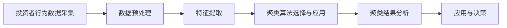

# AI驱动的投资者行为模式聚类分析

> 关键词：AI、投资者行为模式、聚类分析、数据挖掘、金融投资

> 摘要：本文聚焦于AI驱动的投资者行为模式聚类分析，旨在深入探究如何运用先进的人工智能技术对投资者的行为模式进行有效聚类。文章从背景介绍入手，阐述了研究目的、范围、预期读者等内容，接着详细讲解了核心概念、算法原理、数学模型等理论知识，通过项目实战展示了如何在实际中运用这些技术进行投资者行为模式聚类，分析了实际应用场景，推荐了相关工具和资源，最后总结了未来发展趋势与挑战，并对常见问题进行了解答。通过全面而深入的探讨，为金融领域的投资者行为研究提供了有价值的参考。

## 1. 背景介绍 
### 1.1 目的和范围
在金融市场中，投资者的行为模式复杂多样且受到多种因素的影响。对投资者行为模式进行聚类分析，有助于金融机构更好地了解投资者，为其提供个性化的投资服务，制定更有效的营销策略，同时也能帮助投资者更清晰地认识自己的投资风格和偏好。本文的范围涵盖了运用AI技术对投资者在证券、基金等金融市场中的交易行为数据进行聚类分析，包括数据的采集、预处理、特征提取、聚类算法的选择与应用等方面。

### 1.2 预期读者
本文预期读者包括金融行业从业者，如投资顾问、分析师、基金经理等，他们可以通过本文了解如何运用AI技术深入分析投资者行为，优化投资服务和决策；计算机科学领域的研究人员和开发者，可从中获取关于AI在金融领域应用的实践案例和技术思路；对金融投资和人工智能感兴趣的爱好者，能通过本文初步了解相关领域的知识和方法。

### 1.3 文档结构概述
本文首先介绍背景信息，让读者了解研究的目的和意义；接着阐述核心概念，明确投资者行为模式和聚类分析的基本原理及相互联系；然后详细讲解核心算法原理和具体操作步骤，通过Python代码进行演示；随后介绍数学模型和公式，并举例说明；通过项目实战展示如何将理论应用到实际中；分析实际应用场景，说明该技术在金融领域的具体用途；推荐相关的工具和资源，方便读者进一步学习和实践；最后总结未来发展趋势与挑战，解答常见问题，并提供扩展阅读和参考资料。

### 1.4 术语表
#### 1.4.1 核心术语定义
- **投资者行为模式**：指投资者在金融市场中进行投资决策和交易操作时所表现出的相对稳定的行为特征和规律，包括投资偏好、交易频率、风险承受能力等。
- **聚类分析**：是一种无监督学习方法，旨在将数据集中相似的数据对象划分到不同的组（簇）中，使得同一簇内的数据对象相似度较高，不同簇之间的数据对象相似度较低。
- **AI（人工智能）**：是一门研究如何使计算机能够模拟人类智能的学科，包括机器学习、深度学习、自然语言处理等多种技术。

#### 1.4.2 相关概念解释
- **无监督学习**：是机器学习的一种类型，与监督学习不同，无监督学习不需要标记好的训练数据，而是通过对数据的内在结构和模式进行挖掘和分析，发现数据中的隐藏信息。
- **特征提取**：是指从原始数据中提取出能够代表数据特征和本质的信息，以便于后续的分析和处理。在投资者行为模式聚类分析中，特征提取可以包括从交易数据中提取投资金额、交易频率、投资标的等特征。

#### 1.4.3 缩略词列表
- **K-Means**：K均值聚类算法（K-Means Clustering Algorithm）
- **DBSCAN**：基于密度的空间聚类应用（Density-Based Spatial Clustering of Applications with Noise）
- **PCA**：主成分分析（Principal Component Analysis）

## 2. 核心概念与联系 

### 核心概念原理
#### 投资者行为模式
投资者行为模式是由多种因素共同作用形成的，包括投资者的个人特征（如年龄、性别、收入水平等）、投资目标（如短期获利、长期资产增值等）、风险偏好（保守型、稳健型、激进型等）以及市场环境等。这些因素相互影响，使得投资者在投资决策和交易操作上表现出不同的行为特征。例如，保守型投资者通常更倾向于投资低风险的金融产品，如债券、货币基金等，交易频率相对较低；而激进型投资者则更愿意投资高风险、高回报的金融产品，如股票、期货等，交易频率可能较高。

#### 聚类分析
聚类分析的基本思想是通过计算数据对象之间的相似度，将相似度较高的数据对象划分到同一个簇中。常用的相似度度量方法包括欧氏距离、曼哈顿距离、余弦相似度等。聚类算法的目标是使得簇内的数据对象尽可能相似，簇间的数据对象尽可能不同。常见的聚类算法有K-Means算法、DBSCAN算法、层次聚类算法等。

### 架构的文本示意图
```plaintext
投资者行为数据采集 -> 数据预处理 -> 特征提取 -> 聚类算法选择与应用 -> 聚类结果分析 -> 应用与决策
```

### Mermaid流程图


## 3. 核心算法原理 & 具体操作步骤 

### K-Means算法原理
K-Means算法是一种常用的聚类算法，其基本思想是通过迭代的方式将数据对象划分到K个簇中，使得每个簇内的数据对象到该簇中心点的距离之和最小。具体步骤如下：
1. **初始化**：随机选择K个数据对象作为初始的簇中心点。
2. **分配数据对象**：计算每个数据对象到K个簇中心点的距离，将其分配到距离最近的簇中。
3. **更新簇中心点**：对于每个簇，计算该簇内所有数据对象的均值，将其作为新的簇中心点。
4. **重复步骤2和3**：直到簇中心点不再发生变化或达到最大迭代次数。

### Python代码实现
```python
import numpy as np
from sklearn.cluster import KMeans
import matplotlib.pyplot as plt

# 生成示例数据
X = np.array([[1, 2], [1, 4], [1, 0],
              [4, 2], [4, 4], [4, 0]])

# 创建K-Means模型
kmeans = KMeans(n_clusters=2, random_state=0).fit(X)

# 获取聚类标签
labels = kmeans.labels_

# 获取簇中心点
centroids = kmeans.cluster_centers_

# 可视化结果
plt.scatter(X[:, 0], X[:, 1], c=labels, cmap='viridis')
plt.scatter(centroids[:, 0], centroids[:, 1], marker='X', s=200, c='red')
plt.show()
```

### 代码解释
1. **导入必要的库**：导入`numpy`用于数据处理，`sklearn.cluster`中的`KMeans`用于实现K-Means算法，`matplotlib.pyplot`用于可视化结果。
2. **生成示例数据**：使用`numpy`数组创建一个二维数据集。
3. **创建K-Means模型**：指定簇的数量为2，并使用`fit`方法对数据进行训练。
4. **获取聚类标签和簇中心点**：通过`labels_`属性获取每个数据对象的聚类标签，通过`cluster_centers_`属性获取每个簇的中心点。
5. **可视化结果**：使用`scatter`函数将数据对象和簇中心点绘制在二维平面上，不同簇的数据对象用不同颜色表示。

## 4. 数学模型和公式 & 详细讲解 & 举例说明 

### 欧氏距离公式
欧氏距离是一种常用的相似度度量方法，用于计算两个数据对象之间的距离。对于两个n维向量 $\mathbf{x}=(x_1,x_2,\cdots,x_n)$ 和 $\mathbf{y}=(y_1,y_2,\cdots,y_n)$，它们之间的欧氏距离 $d(\mathbf{x},\mathbf{y})$ 定义为：
$$d(\mathbf{x},\mathbf{y})=\sqrt{\sum_{i=1}^{n}(x_i - y_i)^2}$$

### 举例说明
假设有两个二维向量 $\mathbf{x}=(1,2)$ 和 $\mathbf{y}=(4,6)$，则它们之间的欧氏距离为：
$$d(\mathbf{x},\mathbf{y})=\sqrt{(1 - 4)^2+(2 - 6)^2}=\sqrt{(-3)^2+(-4)^2}=\sqrt{9 + 16}=\sqrt{25}=5$$

### K-Means算法的目标函数
K-Means算法的目标是最小化每个簇内数据对象到该簇中心点的距离之和，即最小化以下目标函数：
$$J=\sum_{i=1}^{K}\sum_{\mathbf{x}\in C_i}d(\mathbf{x},\mathbf{\mu}_i)^2$$
其中，$K$ 是簇的数量，$C_i$ 是第 $i$ 个簇，$\mathbf{\mu}_i$ 是第 $i$ 个簇的中心点，$d(\mathbf{x},\mathbf{\mu}_i)$ 是数据对象 $\mathbf{x}$ 到簇中心点 $\mathbf{\mu}_i$ 的距离。

## 5. 项目实战：代码实际案例和详细解释说明 

### 5.1  开发环境搭建
#### 安装Python
首先需要安装Python环境，建议使用Python 3.7及以上版本。可以从Python官方网站（https://www.python.org/downloads/）下载并安装。

#### 安装必要的库
使用`pip`命令安装以下必要的库：
```sh
pip install numpy pandas scikit-learn matplotlib
```

### 5.2  源代码详细实现和代码解读
```python
import numpy as np
import pandas as pd
from sklearn.cluster import KMeans
from sklearn.preprocessing import StandardScaler
import matplotlib.pyplot as plt

# 读取投资者行为数据
data = pd.read_csv('investor_behavior.csv')

# 提取特征
features = data[['investment_amount', 'transaction_frequency', 'risk_score']]

# 数据标准化
scaler = StandardScaler()
scaled_features = scaler.fit_transform(features)

# 创建K-Means模型
kmeans = KMeans(n_clusters=3, random_state=0)

# 训练模型
kmeans.fit(scaled_features)

# 获取聚类标签
labels = kmeans.labels_

# 将聚类标签添加到原始数据中
data['cluster_label'] = labels

# 可视化聚类结果
plt.scatter(scaled_features[:, 0], scaled_features[:, 1], c=labels, cmap='viridis')
plt.xlabel('Investment Amount (Scaled)')
plt.ylabel('Transaction Frequency (Scaled)')
plt.title('Investor Behavior Clustering')
plt.show()
```

### 5.3  代码解读与分析
1. **读取投资者行为数据**：使用`pandas`库的`read_csv`函数读取存储投资者行为数据的CSV文件。
2. **提取特征**：从数据中提取与投资者行为相关的特征，如投资金额、交易频率和风险得分。
3. **数据标准化**：使用`StandardScaler`对特征数据进行标准化处理，使得每个特征具有相同的尺度，避免特征尺度差异对聚类结果的影响。
4. **创建K-Means模型**：指定簇的数量为3，并创建K-Means模型。
5. **训练模型**：使用标准化后的特征数据对K-Means模型进行训练。
6. **获取聚类标签**：通过`labels_`属性获取每个投资者的聚类标签。
7. **将聚类标签添加到原始数据中**：方便后续分析和查看每个投资者所属的簇。
8. **可视化聚类结果**：使用`matplotlib`库将聚类结果可视化，不同簇的数据点用不同颜色表示。

## 6. 实际应用场景 
### 金融机构客户细分
金融机构可以根据投资者行为模式的聚类结果，将客户细分为不同的群体，如保守型投资者、稳健型投资者、激进型投资者等。针对不同群体的特点，金融机构可以提供个性化的投资产品和服务，提高客户满意度和忠诚度。

### 投资策略制定
通过对投资者行为模式的聚类分析，投资经理可以了解不同类型投资者的投资偏好和行为规律，从而制定更有针对性的投资策略。例如，对于保守型投资者，可以推荐低风险、稳定收益的投资组合；对于激进型投资者，可以提供高风险、高回报的投资机会。

### 市场趋势分析
对大量投资者的行为模式进行聚类分析，可以发现市场中的一些趋势和规律。例如，如果某个簇中的投资者交易频率突然增加，可能预示着市场即将发生变化，投资机构可以及时调整投资策略。

## 7. 工具和资源推荐
### 7.1 学习资源推荐
#### 7.1.1 书籍推荐
- 《机器学习》（周志华）：全面介绍了机器学习的基本概念、算法和应用，是机器学习领域的经典教材。
- 《Python机器学习实战》（Sebastian Raschka）：通过实际案例详细介绍了如何使用Python进行机器学习项目的开发，包括数据预处理、模型选择、评估等方面。
- 《金融数据分析与挖掘》（陈涛）：结合金融领域的实际问题，介绍了数据分析和挖掘的方法和技术，对投资者行为模式分析有一定的参考价值。

#### 7.1.2 在线课程
- Coursera上的“机器学习”课程（Andrew Ng教授）：由机器学习领域的知名专家授课，系统地介绍了机器学习的基本原理和算法。
- edX上的“数据科学与机器学习微硕士学位课程”：提供了丰富的数据科学和机器学习课程，包括数据预处理、模型选择、深度学习等内容。
- 网易云课堂上的“金融数据分析与挖掘实战”课程：结合金融领域的实际案例，介绍了数据分析和挖掘的方法和工具。

#### 7.1.3 技术博客和网站
- Medium：有许多关于机器学习、金融科技等领域的优秀博客文章，可以从中获取最新的技术动态和实践经验。
- Kaggle：是一个数据科学竞赛平台，上面有许多关于金融数据分析和挖掘的竞赛和开源代码，可以学习到其他数据科学家的优秀实践。
- Towards Data Science：专注于数据科学和机器学习领域的技术文章，提供了许多实用的教程和案例。

### 7.2 开发工具框架推荐
#### 7.2.1 IDE和编辑器
- PyCharm：是一款专门为Python开发设计的集成开发环境，具有代码自动补全、调试、版本控制等功能，方便开发和调试Python代码。
- Jupyter Notebook：是一个交互式的开发环境，可以在浏览器中编写和运行代码，支持Markdown文本和可视化输出，适合进行数据分析和模型实验。
- Visual Studio Code：是一款轻量级的代码编辑器，支持多种编程语言，具有丰富的插件和扩展功能，可以用于Python开发和数据分析。

#### 7.2.2 调试和性能分析工具
- pdb：是Python自带的调试工具，可以在代码中设置断点，逐步执行代码，查看变量的值和程序的执行流程。
- cProfile：是Python的性能分析工具，可以统计代码中各个函数的执行时间和调用次数，帮助找出代码中的性能瓶颈。
- TensorBoard：是TensorFlow提供的可视化工具，可以用于可视化深度学习模型的训练过程和性能指标，如损失函数、准确率等。

#### 7.2.3 相关框架和库
- scikit-learn：是一个常用的机器学习库，提供了丰富的机器学习算法和工具，包括分类、回归、聚类等算法，以及数据预处理、模型选择、评估等功能。
- TensorFlow：是一个开源的深度学习框架，广泛应用于图像识别、自然语言处理、语音识别等领域，提供了高级的深度学习模型和工具。
- PyTorch：是另一个流行的深度学习框架，具有动态计算图的特点，易于使用和调试，在学术界和工业界都有广泛的应用。

### 7.3 相关论文著作推荐
#### 7.3.1 经典论文
- “K-Means++: The Advantages of Careful Seeding”：介绍了K-Means算法的改进版本K-Means++，通过更合理的初始中心点选择方法，提高了K-Means算法的性能和稳定性。
- “A Density-Based Algorithm for Discovering Clusters in Large Spatial Databases with Noise”：提出了DBSCAN算法，是一种基于密度的聚类算法，能够发现任意形状的簇，并能有效处理噪声数据。

#### 7.3.2 最新研究成果
- 关注顶级学术会议如NeurIPS、ICML、KDD等上关于金融数据分析和投资者行为模式研究的最新论文，了解该领域的前沿技术和研究动态。

#### 7.3.3 应用案例分析
- 一些金融机构和研究机构会发布关于投资者行为模式分析的应用案例报告，可以从中学习到实际应用中的经验和方法。

## 8. 总结：未来发展趋势与挑战
### 未来发展趋势
- **多源数据融合**：未来的投资者行为模式聚类分析将不仅仅依赖于传统的交易数据，还会融合社交媒体数据、新闻资讯数据、宏观经济数据等多源数据，以更全面地了解投资者的行为和心理。
- **深度学习的应用**：深度学习具有强大的特征提取和建模能力，未来将在投资者行为模式聚类分析中得到更广泛的应用，如使用卷积神经网络（CNN）和循环神经网络（RNN）对投资者的行为序列数据进行分析。
- **实时分析与预测**：随着金融市场的快速变化，实时分析投资者行为模式并进行预测将变得越来越重要。未来的系统将具备实时数据处理和分析能力，能够及时发现投资者行为的变化趋势，为投资决策提供更及时的支持。

### 挑战
- **数据质量和隐私问题**：投资者行为数据通常涉及个人隐私，如何在保证数据质量的前提下，合法合规地获取和使用数据是一个重要的挑战。同时，数据中可能存在噪声、缺失值等问题，需要进行有效的预处理。
- **算法复杂度和可解释性**：一些先进的机器学习和深度学习算法虽然具有较高的性能，但算法复杂度较高，计算资源需求大。此外，这些算法的可解释性较差，难以让金融从业者理解聚类结果的含义和背后的原因。
- **市场环境的不确定性**：金融市场受到多种因素的影响，如宏观经济环境、政策法规变化、突发事件等，这些因素的不确定性增加了投资者行为模式聚类分析的难度，需要算法具有较强的适应性和鲁棒性。

## 9. 附录：常见问题与解答
### 如何选择合适的聚类算法？
选择合适的聚类算法需要考虑数据的特点、聚类的目的和应用场景等因素。如果数据具有明显的球形分布，K-Means算法是一个不错的选择；如果数据分布不规则，DBSCAN算法可能更适合；如果需要了解数据的层次结构，可以使用层次聚类算法。

### 如何确定簇的数量？
确定簇的数量是聚类分析中的一个关键问题。常用的方法包括肘部法则、轮廓系数法等。肘部法则通过绘制不同簇数量下的目标函数值（如K-Means算法的簇内误差平方和）与簇数量的关系曲线，选择曲线斜率变化较大的点作为合适的簇数量。轮廓系数法通过计算每个数据对象的轮廓系数，选择轮廓系数最大时的簇数量。

### 聚类结果的稳定性如何保证？
为了保证聚类结果的稳定性，可以采用多次运行聚类算法并取平均结果的方法。此外，对数据进行合理的预处理，如数据标准化、特征选择等，也可以提高聚类结果的稳定性。

## 10. 扩展阅读 & 参考资料
### 扩展阅读
- 《人工智能：现代方法》（Stuart Russell、Peter Norvig）：全面介绍了人工智能的基本概念、算法和应用，是人工智能领域的经典著作。
- 《数据挖掘：概念与技术》（Jiawei Han、Jian Pei、Jianying Yin）：系统地介绍了数据挖掘的基本概念、算法和应用，对聚类分析等数据挖掘技术有深入的讲解。

### 参考资料
- 《机器学习实战》（Peter Harrington）：通过实际案例详细介绍了机器学习的算法和应用，对初学者有很大的帮助。
- 《金融科技：框架与实践》（何虹、何启志）：结合金融科技的发展趋势，介绍了金融领域中数据分析、人工智能等技术的应用。

作者：AI天才研究院/AI Genius Institute & 禅与计算机程序设计艺术 /Zen And The Art of Computer Programming