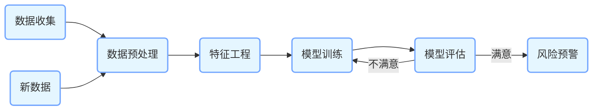

# AI驱动的破产风险预警系统：提前识别投资风险

> 关键词：AI、破产风险预警系统、投资风险、机器学习、数据分析

> 摘要：本文围绕AI驱动的破产风险预警系统展开，深入探讨其核心概念、算法原理、数学模型等内容。通过详细的Python代码案例展示了系统的开发与实现过程，分析了该系统在实际投资场景中的应用，推荐了相关的学习资源、开发工具和论文著作。最后对系统未来的发展趋势与挑战进行总结，并提供常见问题解答和扩展阅读参考资料，旨在帮助投资者利用该系统提前识别投资风险。

## 1. 背景介绍 
### 1.1 目的和范围
在当今复杂多变的金融市场环境中，投资决策面临着诸多不确定性，企业的破产风险是投资者必须关注的重要因素之一。本文章的目的在于深入探讨如何利用人工智能技术构建破产风险预警系统，以帮助投资者提前识别投资风险。文章的范围涵盖了该系统的核心概念、算法原理、数学模型、实际开发案例以及在不同投资场景中的应用等方面。

### 1.2 预期读者
本文预期读者包括金融领域的投资者、分析师、风险管理人员，以及对人工智能在金融领域应用感兴趣的技术人员和研究人员。对于投资者而言，能够借助本文了解如何利用先进技术评估投资对象的破产风险；对于技术人员，可从中学习到构建破产风险预警系统的具体技术和方法。

### 1.3 文档结构概述
本文将按照以下结构进行阐述：首先介绍核心概念与联系，包括相关概念的原理和架构示意图；接着详细讲解核心算法原理及具体操作步骤，并给出Python源代码示例；然后阐述数学模型和公式，并通过举例进行说明；再通过项目实战展示代码实际案例及详细解释；之后分析实际应用场景；推荐相关的工具和资源；最后总结未来发展趋势与挑战，提供常见问题解答和扩展阅读参考资料。

### 1.4 术语表
#### 1.4.1 核心术语定义
- **AI（Artificial Intelligence）**：即人工智能，是研究、开发用于模拟、延伸和扩展人的智能的理论、方法、技术及应用系统的一门新的技术科学。在本文中主要用于构建破产风险预警系统。
- **破产风险预警系统**：是一种通过对企业的各种财务和非财务数据进行分析，运用特定的算法和模型，提前预测企业是否存在破产可能性的系统。
- **投资风险**：指投资主体为实现其投资目的而对未来经营、财务活动可能造成的亏损或破产所承担的危险。
- **机器学习（Machine Learning）**：是一门多领域交叉学科，涉及概率论、统计学、逼近论、凸分析、算法复杂度理论等多门学科。它专门研究计算机怎样模拟或实现人类的学习行为，以获取新的知识或技能，重新组织已有的知识结构使之不断改善自身的性能。在破产风险预警系统中，机器学习算法用于从数据中学习规律并进行预测。

#### 1.4.2 相关概念解释
- **数据挖掘**：是指从大量的数据中通过算法搜索隐藏于其中信息的过程。在破产风险预警系统中，数据挖掘技术用于从企业的海量数据中提取有价值的信息，如财务比率、经营指标等，为模型训练提供数据支持。
- **模型评估**：是指对构建的机器学习模型进行性能评估的过程。常用的评估指标包括准确率、召回率、F1值等，用于衡量模型在预测企业破产风险方面的有效性。

#### 1.4.3 缩略词列表
- **AI**：Artificial Intelligence
- **ML**：Machine Learning
- **ROC**：Receiver Operating Characteristic（受试者工作特征曲线）
- **AUC**：Area Under the Curve（ROC曲线下的面积）

## 2. 核心概念与联系 
### 核心概念原理
AI驱动的破产风险预警系统的核心原理是利用人工智能技术，特别是机器学习算法，对企业的各种数据进行分析和建模。这些数据包括财务数据（如资产负债率、利润率等）、经营数据（如市场份额、客户满意度等）以及宏观经济数据（如GDP增长率、通货膨胀率等）。通过对历史数据的学习，模型可以发现数据中的模式和规律，从而对企业未来的破产风险进行预测。

### 架构示意图

该流程图展示了AI驱动的破产风险预警系统的主要架构。首先进行数据收集，获取企业的各种相关数据；然后对数据进行预处理，包括数据清洗、缺失值处理等；接着进行特征工程，提取有价值的特征；之后使用这些特征进行模型训练；训练完成后对模型进行评估，如果评估结果不满意则重新进行模型训练；如果评估结果满意，则可以使用该模型对新数据进行风险预警。

## 3. 核心算法原理 & 具体操作步骤 
### 核心算法原理
在AI驱动的破产风险预警系统中，常用的机器学习算法包括逻辑回归、决策树、随机森林和支持向量机等。下面以逻辑回归算法为例进行详细讲解。

逻辑回归是一种广义线性模型，用于处理二分类问题，在破产风险预警系统中，可将企业分为破产和非破产两类。逻辑回归的基本原理是通过对输入特征进行线性组合，然后通过逻辑函数（也称为Sigmoid函数）将线性组合的结果映射到[0, 1]区间，得到一个概率值。这个概率值表示样本属于正类（如破产）的概率。

逻辑函数的定义如下：
$$
\sigma(z)=\frac{1}{1 + e^{-z}}
$$
其中，$z$ 是输入特征的线性组合：
$$
z = \theta_0 + \theta_1x_1 + \theta_2x_2 + \cdots + \theta_nx_n
$$
$\theta_0, \theta_1, \cdots, \theta_n$ 是模型的参数，$x_1, x_2, \cdots, x_n$ 是输入特征。

### 具体操作步骤
1. **数据准备**：收集企业的相关数据，并进行清洗和预处理。
2. **特征选择**：从数据中选择对破产风险有重要影响的特征。
3. **模型训练**：使用训练数据对逻辑回归模型进行训练，通过最小化损失函数来估计模型的参数。逻辑回归常用的损失函数是对数损失函数：
$$
L(\theta)=-\frac{1}{m}\sum_{i = 1}^{m}[y^{(i)}\log(\sigma(z^{(i)}))+(1 - y^{(i)})\log(1 - \sigma(z^{(i)}))]
$$
其中，$m$ 是样本数量，$y^{(i)}$ 是第 $i$ 个样本的真实标签，$\sigma(z^{(i)})$ 是第 $i$ 个样本的预测概率。
4. **模型评估**：使用测试数据对训练好的模型进行评估，常用的评估指标包括准确率、召回率、F1值等。
5. **风险预警**：使用训练好的模型对新的企业数据进行预测，根据预测结果进行风险预警。

### Python源代码示例
```python
import numpy as np
from sklearn.linear_model import LogisticRegression
from sklearn.model_selection import train_test_split
from sklearn.metrics import accuracy_score

# 生成示例数据
np.random.seed(0)
X = np.random.randn(100, 5)
y = np.random.randint(0, 2, 100)

# 划分训练集和测试集
X_train, X_test, y_train, y_test = train_test_split(X, y, test_size=0.2, random_state=42)

# 创建逻辑回归模型
model = LogisticRegression()

# 模型训练
model.fit(X_train, y_train)

# 模型预测
y_pred = model.predict(X_test)

# 模型评估
accuracy = accuracy_score(y_test, y_pred)
print(f"模型准确率: {accuracy}")
```
在上述代码中，首先生成了示例数据，然后将数据划分为训练集和测试集。接着创建了逻辑回归模型，并使用训练集对模型进行训练。最后使用测试集进行预测，并计算模型的准确率。

## 4. 数学模型和公式 & 详细讲解 & 举例说明 
### 逻辑回归模型的数学推导
逻辑回归模型的目标是找到一组参数 $\theta$，使得模型对训练数据的预测结果尽可能接近真实标签。这可以通过最小化损失函数来实现。

假设我们有 $m$ 个训练样本 $(x^{(1)}, y^{(1)}), (x^{(2)}, y^{(2)}), \cdots, (x^{(m)}, y^{(m)})$，其中 $x^{(i)}$ 是第 $i$ 个样本的特征向量，$y^{(i)}$ 是第 $i$ 个样本的真实标签（取值为0或1）。

模型对第 $i$ 个样本的预测概率为：
$$
P(y^{(i)} = 1|x^{(i)}; \theta)=\sigma(z^{(i)})=\frac{1}{1 + e^{-\theta^T x^{(i)}}}
$$
$$
P(y^{(i)} = 0|x^{(i)}; \theta)=1 - \sigma(z^{(i)})=\frac{e^{-\theta^T x^{(i)}}}{1 + e^{-\theta^T x^{(i)}}}
$$
可以将这两个式子合并为一个式子：
$$
P(y^{(i)}|x^{(i)}; \theta)=[\sigma(z^{(i)})]^{y^{(i)}}[1 - \sigma(z^{(i)})]^{1 - y^{(i)}}
$$
假设样本之间是独立同分布的，那么整个训练集的似然函数为：
$$
L(\theta)=\prod_{i = 1}^{m}P(y^{(i)}|x^{(i)}; \theta)=\prod_{i = 1}^{m}[\sigma(z^{(i)})]^{y^{(i)}}[1 - \sigma(z^{(i)})]^{1 - y^{(i)}}
$$
为了方便计算，通常对似然函数取对数，得到对数似然函数：
$$
\ell(\theta)=\log L(\theta)=\sum_{i = 1}^{m}[y^{(i)}\log(\sigma(z^{(i)}))+(1 - y^{(i)})\log(1 - \sigma(z^{(i)}))]
$$
逻辑回归的损失函数是对数似然函数的负数，即：
$$
J(\theta)=-\ell(\theta)=-\frac{1}{m}\sum_{i = 1}^{m}[y^{(i)}\log(\sigma(z^{(i)}))+(1 - y^{(i)})\log(1 - \sigma(z^{(i)}))]
$$
为了找到最优的参数 $\theta$，可以使用梯度下降法等优化算法来最小化损失函数。

### 举例说明
假设我们有一个简单的二分类问题，只有一个特征 $x$，真实标签 $y$ 取值为0或1。我们收集了以下训练数据：

| $x$ | $y$ |
| --- | --- |
| 1   | 1   |
| 2   | 1   |
| 3   | 1   |
| 4   | 0   |
| 5   | 0   |

我们使用逻辑回归模型对这些数据进行训练。首先，初始化参数 $\theta_0$ 和 $\theta_1$，然后使用梯度下降法不断更新参数，直到损失函数收敛。

在每次迭代中，计算损失函数的梯度：
$$
\frac{\partial J(\theta)}{\partial \theta_j}=\frac{1}{m}\sum_{i = 1}^{m}(\sigma(z^{(i)}) - y^{(i)})x_j^{(i)}
$$
其中，$j = 0, 1$。

然后根据梯度更新参数：
$$
\theta_j:=\theta_j-\alpha\frac{\partial J(\theta)}{\partial \theta_j}
$$
其中，$\alpha$ 是学习率。

经过多次迭代后，得到最优的参数 $\theta_0$ 和 $\theta_1$，从而得到训练好的逻辑回归模型。

## 5. 项目实战：代码实际案例和详细解释说明 
### 5.1  开发环境搭建
#### 安装Python
首先需要安装Python，建议使用Python 3.7及以上版本。可以从Python官方网站（https://www.python.org/downloads/）下载安装包，按照安装向导进行安装。

#### 安装必要的库
在命令行中使用以下命令安装必要的库：
```sh
pip install numpy pandas scikit-learn matplotlib
```
- **numpy**：用于进行数值计算。
- **pandas**：用于数据处理和分析。
- **scikit-learn**：提供了各种机器学习算法和工具。
- **matplotlib**：用于数据可视化。

### 5.2  源代码详细实现和代码解读
```python
import pandas as pd
from sklearn.model_selection import train_test_split
from sklearn.linear_model import LogisticRegression
from sklearn.metrics import accuracy_score, confusion_matrix
import matplotlib.pyplot as plt

# 加载数据集
data = pd.read_csv('bankruptcy_data.csv')

# 分离特征和标签
X = data.drop('bankruptcy', axis=1)
y = data['bankruptcy']

# 划分训练集和测试集
X_train, X_test, y_train, y_test = train_test_split(X, y, test_size=0.2, random_state=42)

# 创建逻辑回归模型
model = LogisticRegression()

# 模型训练
model.fit(X_train, y_train)

# 模型预测
y_pred = model.predict(X_test)

# 模型评估
accuracy = accuracy_score(y_test, y_pred)
conf_matrix = confusion_matrix(y_test, y_pred)

print(f"模型准确率: {accuracy}")
print("混淆矩阵:")
print(conf_matrix)

# 可视化混淆矩阵
plt.imshow(conf_matrix, interpolation='nearest', cmap=plt.cm.Blues)
plt.title('Confusion matrix')
plt.colorbar()
tick_marks = [0, 1]
plt.xticks(tick_marks, ['Non-bankruptcy', 'Bankruptcy'])
plt.yticks(tick_marks, ['Non-bankruptcy', 'Bankruptcy'])

thresh = conf_matrix.max() / 2.
for i in range(conf_matrix.shape[0]):
    for j in range(conf_matrix.shape[1]):
        plt.text(j, i, format(conf_matrix[i, j], 'd'),
                 horizontalalignment="center",
                 color="white" if conf_matrix[i, j] > thresh else "black")

plt.tight_layout()
plt.ylabel('True label')
plt.xlabel('Predicted label')
plt.show()
```
### 代码解读与分析
1. **数据加载**：使用 `pandas` 库的 `read_csv` 函数加载包含企业破产信息的数据集。
2. **特征和标签分离**：将数据集中的特征和标签分离，`bankruptcy` 列作为标签，其余列作为特征。
3. **数据集划分**：使用 `train_test_split` 函数将数据集划分为训练集和测试集，测试集占比为20%。
4. **模型创建和训练**：创建逻辑回归模型，并使用训练集对模型进行训练。
5. **模型预测**：使用训练好的模型对测试集进行预测。
6. **模型评估**：计算模型的准确率和混淆矩阵，准确率用于衡量模型的整体预测性能，混淆矩阵用于分析模型在不同类别上的预测情况。
7. **可视化**：使用 `matplotlib` 库将混淆矩阵可视化，直观地展示模型的预测结果。

## 6. 实际应用场景 
### 金融机构投资决策
金融机构在进行投资决策时，需要对投资对象的风险进行评估。AI驱动的破产风险预警系统可以帮助金融机构提前识别企业的破产风险，从而避免投资于高风险的企业。例如，银行在发放贷款时，可以使用该系统对借款企业的财务状况进行评估，判断其是否存在破产风险，从而决定是否发放贷款以及贷款的额度和利率。

### 投资者资产配置
个人投资者在进行资产配置时，也可以借助破产风险预警系统来评估投资组合中各企业的风险。通过对不同企业的破产风险进行分析，投资者可以合理调整投资组合，降低投资风险。例如，投资者可以减少对破产风险较高企业的投资，增加对风险较低企业的投资。

### 监管机构风险监测
监管机构可以使用破产风险预警系统对金融市场中的企业进行风险监测。及时发现可能存在破产风险的企业，采取相应的监管措施，防范系统性金融风险。例如，证券监管机构可以对上市公司进行实时监测，当发现某上市公司的破产风险较高时，要求其披露更多的财务信息，加强对其的监管力度。

## 7. 工具和资源推荐
### 7.1 学习资源推荐
#### 7.1.1 书籍推荐
- 《机器学习》（周志华著）：这本书全面介绍了机器学习的基本概念、算法和应用，是机器学习领域的经典教材。
- 《Python机器学习实战》（Sebastian Raschka著）：通过实际案例详细介绍了如何使用Python进行机器学习项目的开发，适合初学者。
- 《深度学习》（Ian Goodfellow、Yoshua Bengio和Aaron Courville著）：深入介绍了深度学习的理论和实践，是深度学习领域的权威著作。

#### 7.1.2 在线课程
- Coursera上的“机器学习”课程（Andrew Ng教授主讲）：这是一门非常经典的机器学习课程，通过视频讲解、编程作业等方式，让学员系统地学习机器学习的知识和技能。
- edX上的“深度学习微硕士项目”：由多家知名高校联合推出，涵盖了深度学习的多个方面，包括卷积神经网络、循环神经网络等。

#### 7.1.3 技术博客和网站
- 机器学习算法全栈工程师（https://www.zybuluo.com/hanbingtao/note/433855）：该博客分享了机器学习领域的各种算法和技术，包括理论讲解和代码实现。
- Kaggle（https://www.kaggle.com/）：是一个数据科学竞赛平台，上面有很多关于机器学习和数据分析的优秀案例和教程。

### 7.2 开发工具框架推荐
#### 7.2.1 IDE和编辑器
- PyCharm：是一款专门为Python开发设计的集成开发环境，具有代码自动补全、调试、版本控制等功能，非常适合Python项目的开发。
- Jupyter Notebook：是一个基于Web的交互式计算环境，可以在浏览器中编写和运行代码，同时可以添加文本说明和可视化图表，方便进行数据分析和机器学习实验。

#### 7.2.2 调试和性能分析工具
- pdb：是Python自带的调试工具，可以在代码中设置断点，逐步执行代码，查看变量的值和程序的执行流程。
- cProfile：是Python的性能分析工具，可以统计程序中各个函数的执行时间和调用次数，帮助开发者找出程序的性能瓶颈。

#### 7.2.3 相关框架和库
- TensorFlow：是Google开发的开源深度学习框架，提供了丰富的深度学习模型和工具，支持分布式训练和部署。
- PyTorch：是Facebook开发的开源深度学习框架，具有动态图机制，易于使用和调试，在学术界和工业界都有广泛的应用。

### 7.3 相关论文著作推荐
#### 7.3.1 经典论文
- Altman, E. I. (1968). Financial ratios, discriminant analysis and the prediction of corporate bankruptcy. The Journal of Finance, 23(4), 589-609. 这篇论文提出了著名的Z-score模型，用于预测企业的破产风险。
- Ohlson, J. A. (1980). Financial ratios and the probabilistic prediction of bankruptcy. Journal of Accounting Research, 18(1), 109-131. 该论文提出了O-score模型，进一步改进了企业破产风险的预测方法。

#### 7.3.2 最新研究成果
- 近年来，随着人工智能技术的发展，越来越多的研究将深度学习、机器学习等技术应用于企业破产风险预警领域。例如，一些研究使用卷积神经网络和循环神经网络对企业的财务数据和文本信息进行分析，取得了较好的预测效果。

#### 7.3.3 应用案例分析
- 可以参考一些金融机构和研究机构发布的关于企业破产风险预警系统的应用案例报告，了解这些系统在实际应用中的效果和经验教训。

## 8. 总结：未来发展趋势与挑战
### 未来发展趋势
- **多源数据融合**：未来的破产风险预警系统将不仅仅依赖于企业的财务数据，还会融合更多的非财务数据，如社交媒体数据、行业新闻数据等，以更全面地评估企业的经营状况和风险。
- **深度学习的广泛应用**：深度学习模型具有强大的特征提取和建模能力，未来将在破产风险预警系统中得到更广泛的应用。例如，使用卷积神经网络对企业的图像数据进行分析，使用循环神经网络对企业的时间序列数据进行建模。
- **实时预警**：随着数据采集和处理技术的不断发展，破产风险预警系统将实现实时监测和预警，及时发现企业的风险变化，为投资者和监管机构提供更及时的决策支持。

### 挑战
- **数据质量问题**：数据质量是影响破产风险预警系统性能的关键因素之一。实际应用中，企业的数据可能存在缺失值、异常值、错误值等问题，需要进行有效的数据清洗和预处理。
- **模型解释性**：深度学习等复杂模型虽然具有较高的预测准确率，但往往缺乏良好的解释性。在金融领域，模型的解释性非常重要，投资者和监管机构需要了解模型的决策依据。
- **法律法规和隐私问题**：在收集和使用企业数据时，需要遵守相关的法律法规和隐私政策，保护企业和个人的隐私。同时，模型的使用也需要符合监管要求。

## 9. 附录：常见问题与解答
### 问题1：如何选择合适的机器学习算法？
答：选择合适的机器学习算法需要考虑多个因素，包括数据的特点、问题的类型、模型的复杂度和可解释性等。对于破产风险预警系统，逻辑回归、决策树、随机森林等算法具有较好的可解释性，适合用于初步的风险评估；而深度学习算法如神经网络则在处理复杂数据和提高预测准确率方面具有优势，但解释性较差。可以通过实验比较不同算法的性能，选择最适合的算法。

### 问题2：数据量对模型性能有什么影响？
答：一般来说，数据量越大，模型能够学习到的信息就越多，性能也就越好。但当数据量达到一定程度后，模型性能的提升会逐渐趋于平缓。此外，如果数据存在噪声或偏差，过多的数据可能会导致模型过拟合。因此，在收集数据时，不仅要关注数据量，还要保证数据的质量。

### 问题3：如何评估模型的性能？
答：评估模型性能可以使用多种指标，如准确率、召回率、F1值、ROC曲线和AUC值等。准确率反映了模型整体的预测正确性；召回率衡量了模型对正类样本的识别能力；F1值是准确率和召回率的调和平均值；ROC曲线和AUC值则用于评估模型在不同阈值下的性能。在实际应用中，需要根据具体的问题和需求选择合适的评估指标。

## 10. 扩展阅读 & 参考资料
### 扩展阅读
- 《金融科技前沿：技术应用与监管挑战》：这本书介绍了金融科技领域的最新技术和应用，包括人工智能在金融风险管理中的应用，对于深入了解破产风险预警系统的背景和发展具有一定的帮助。
- 《数据挖掘：概念与技术》：详细介绍了数据挖掘的各种算法和技术，对于理解破产风险预警系统中的数据处理和特征工程部分有很大的帮助。

### 参考资料
- 相关的学术论文和研究报告，如上述提到的经典论文和最新研究成果。
- 开源代码库，如GitHub上的一些关于机器学习和金融风险评估的项目，可以参考其代码实现和思路。

作者：AI天才研究院/AI Genius Institute & 禅与计算机程序设计艺术 /Zen And The Art of Computer Programming