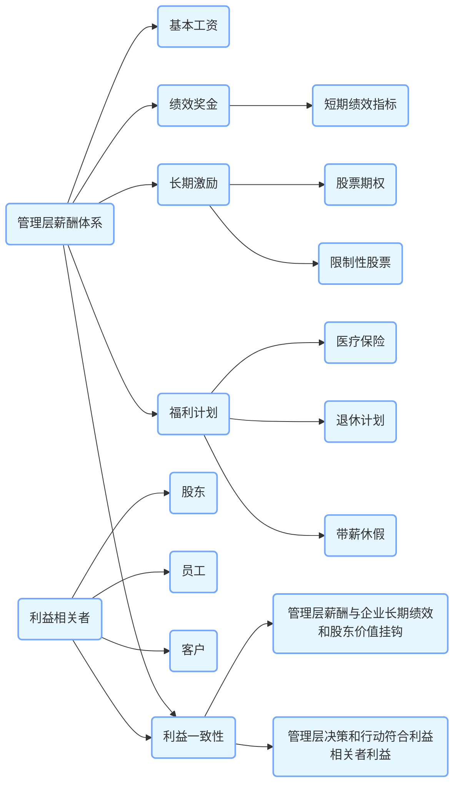

# AI驱动的管理层薪酬分析：评估利益一致性

> 关键词：AI、管理层薪酬分析、利益一致性、数据分析、机器学习

> 摘要：本文聚焦于利用AI技术进行管理层薪酬分析，以评估管理层与股东等利益相关者之间的利益一致性。首先介绍了研究的背景、目的、预期读者和文档结构，对相关术语进行了详细解释。接着阐述了核心概念及联系，包括管理层薪酬体系、利益一致性的内涵等，并给出了相应的文本示意图和Mermaid流程图。深入讲解了核心算法原理，用Python代码进行了详细阐述，同时介绍了相关的数学模型和公式，并举例说明。通过项目实战，展示了开发环境搭建、源代码实现及代码解读。探讨了实际应用场景，推荐了学习资源、开发工具框架和相关论文著作。最后总结了未来发展趋势与挑战，解答了常见问题，并提供了扩展阅读和参考资料，旨在为利用AI进行管理层薪酬分析提供全面而深入的指导。

## 1. 背景介绍 
### 1.1 目的和范围
在现代企业治理中，管理层薪酬问题一直是备受关注的焦点。合理的管理层薪酬体系不仅能够激励管理层为企业创造更大的价值，还能确保管理层的利益与股东、员工等利益相关者的利益保持一致。然而，传统的管理层薪酬分析方法往往依赖于人工统计和简单的财务指标，难以全面、深入地评估管理层薪酬与企业绩效、利益一致性之间的关系。

本研究的目的在于引入AI技术，利用其强大的数据处理和分析能力，对管理层薪酬进行更精准、全面的分析，以评估管理层与利益相关者之间的利益一致性。具体范围包括收集和整理管理层薪酬数据、企业绩效数据、市场数据等多源数据，运用机器学习、深度学习等AI算法建立分析模型，从多个维度评估管理层薪酬的合理性和利益一致性，并提出相应的建议和决策支持。

### 1.2 预期读者
本文的预期读者主要包括企业的董事会成员、薪酬委员会成员、人力资源管理者、财务分析师、企业战略规划者等，他们需要深入了解管理层薪酬体系的设计和评估，以确保企业的薪酬政策能够有效激励管理层并促进企业的长期发展。同时，对于从事金融研究、企业治理研究的学者和研究人员，以及对AI技术在企业管理中的应用感兴趣的技术爱好者，本文也具有一定的参考价值。

### 1.3 文档结构概述
本文将按照以下结构展开：
- 核心概念与联系：介绍管理层薪酬、利益一致性等核心概念，以及它们之间的相互关系，并通过文本示意图和Mermaid流程图进行直观展示。
- 核心算法原理 & 具体操作步骤：详细讲解用于管理层薪酬分析的AI算法原理，包括数据预处理、特征工程、模型选择和训练等步骤，并给出Python代码示例。
- 数学模型和公式 & 详细讲解 & 举例说明：介绍相关的数学模型和公式，如回归模型、决策树模型等，并通过具体例子进行详细说明。
- 项目实战：代码实际案例和详细解释说明：通过一个实际的项目案例，展示如何搭建开发环境、实现源代码，并对代码进行详细解读和分析。
- 实际应用场景：探讨AI驱动的管理层薪酬分析在企业中的实际应用场景，如薪酬设计、绩效评估、风险预警等。
- 工具和资源推荐：推荐学习AI和管理层薪酬分析的相关书籍、在线课程、技术博客和网站，以及开发工具框架和相关论文著作。
- 总结：未来发展趋势与挑战：总结AI驱动的管理层薪酬分析的未来发展趋势，并分析可能面临的挑战。
- 附录：常见问题与解答：解答读者在阅读过程中可能遇到的常见问题。
- 扩展阅读 & 参考资料：提供相关的扩展阅读资料和参考文献，方便读者进一步深入研究。

### 1.4 术语表
#### 1.4.1 核心术语定义
- **管理层薪酬**：指企业为管理层提供的各种经济报酬和福利，包括基本工资、奖金、股票期权、福利计划等。
- **利益一致性**：指管理层的利益与股东、员工、客户等利益相关者的利益在目标和行动上保持一致，即管理层的决策和行为能够促进各方利益的共同增长。
- **AI（人工智能）**：指计算机系统能够执行通常需要人类智能才能完成的任务，如学习、推理、决策等。
- **机器学习**：是AI的一个分支，通过让计算机从数据中自动学习模式和规律，从而实现预测和决策等任务。
- **深度学习**：是机器学习的一个子领域，使用深度神经网络模型，能够处理复杂的非线性数据，在图像识别、自然语言处理等领域取得了显著的成果。

#### 1.4.2 相关概念解释
- **薪酬激励理论**：研究如何通过合理的薪酬设计来激励员工的工作积极性和创造力，以实现企业的目标。常见的薪酬激励理论包括委托 - 代理理论、公平理论、期望理论等。
- **企业绩效**：指企业在一定时期内的经营成果，通常用财务指标（如净利润、营业收入、资产回报率等）和非财务指标（如市场份额、客户满意度、员工满意度等）来衡量。
- **市场数据**：指与企业所处行业和市场相关的数据，如行业平均薪酬水平、市场竞争状况、宏观经济指标等。

#### 1.4.3 缩略词列表
- **AI**：Artificial Intelligence（人工智能）
- **ML**：Machine Learning（机器学习）
- **DL**：Deep Learning（深度学习）
- **ROE**：Return on Equity（净资产收益率）
- **EPS**：Earnings Per Share（每股收益）

## 2. 核心概念与联系 

### 核心概念原理
#### 管理层薪酬体系
管理层薪酬体系是企业为激励和回报管理层而设计的一系列薪酬政策和制度。它通常由多个部分组成，包括基本工资、绩效奖金、长期激励（如股票期权、限制性股票等）和福利计划。基本工资是管理层的固定收入，用于满足其基本生活需求；绩效奖金则与企业的短期绩效指标挂钩，如年度净利润、营业收入等；长期激励旨在促使管理层关注企业的长期发展，将其利益与股东的利益绑定在一起；福利计划则包括医疗保险、退休计划、带薪休假等，为管理层提供额外的保障和福利。

#### 利益一致性
利益一致性是指管理层的利益与股东、员工、客户等利益相关者的利益在目标和行动上保持一致。在企业治理中，确保管理层与股东的利益一致性尤为重要，因为股东是企业的所有者，他们期望管理层能够最大化企业的价值。当管理层的薪酬与企业的长期绩效和股东价值紧密相关时，管理层就会有动力采取有利于企业长期发展的决策和行动，从而实现与股东的利益一致。

### 架构的文本示意图
```plaintext
管理层薪酬体系
|-- 基本工资
|-- 绩效奖金
|   |-- 短期绩效指标（如净利润、营业收入）
|-- 长期激励
|   |-- 股票期权
|   |-- 限制性股票
|-- 福利计划
|   |-- 医疗保险
|   |-- 退休计划
|   |-- 带薪休假

利益相关者
|-- 股东
|-- 员工
|-- 客户

利益一致性
|-- 管理层薪酬与企业长期绩效和股东价值挂钩
|-- 管理层决策和行动符合利益相关者利益
```

### Mermaid流程图


## 3. 核心算法原理 & 具体操作步骤 

### 数据预处理
在进行管理层薪酬分析之前，需要对收集到的数据进行预处理，以确保数据的质量和可用性。数据预处理的主要步骤包括数据清洗、数据集成、数据转换和数据规约。

#### 数据清洗
数据清洗是指去除数据中的噪声、缺失值和异常值。例如，对于管理层薪酬数据中的缺失值，可以采用均值填充、中位数填充或基于模型的填充方法进行处理；对于异常值，可以采用基于统计的方法（如Z-score法）或基于机器学习的方法（如孤立森林算法）进行检测和处理。

```python
import pandas as pd
import numpy as np

# 读取数据
data = pd.read_csv('management_compensation.csv')

# 处理缺失值
data.fillna(data.mean(), inplace=True)

# 检测和处理异常值
from scipy import stats
z_scores = np.abs(stats.zscore(data))
data = data[(z_scores < 3).all(axis=1)]
```

#### 数据集成
数据集成是指将来自不同数据源的数据合并到一个数据集中。例如，将管理层薪酬数据、企业绩效数据和市场数据进行集成，以便进行综合分析。

```python
# 读取企业绩效数据
performance_data = pd.read_csv('company_performance.csv')

# 读取市场数据
market_data = pd.read_csv('market_data.csv')

# 数据集成
integrated_data = pd.merge(data, performance_data, on='company_id')
integrated_data = pd.merge(integrated_data, market_data, on='company_id')
```

#### 数据转换
数据转换是指对数据进行标准化、归一化等处理，以提高模型的性能。例如，对于连续型变量，可以采用Min-Max归一化或Z-score标准化方法进行处理；对于分类变量，可以采用独热编码或标签编码方法进行处理。

```python
from sklearn.preprocessing import MinMaxScaler, OneHotEncoder

# 连续型变量归一化
scaler = MinMaxScaler()
continuous_features = ['base_salary', 'bonus', 'roe', 'eps']
integrated_data[continuous_features] = scaler.fit_transform(integrated_data[continuous_features])

# 分类变量独热编码
encoder = OneHotEncoder()
categorical_features = ['industry']
encoded_features = encoder.fit_transform(integrated_data[categorical_features]).toarray()
encoded_df = pd.DataFrame(encoded_features, columns=encoder.get_feature_names_out(categorical_features))
integrated_data = pd.concat([integrated_data.drop(categorical_features, axis=1), encoded_df], axis=1)
```

#### 数据规约
数据规约是指减少数据的维度和规模，以提高算法的效率。例如，可以采用主成分分析（PCA）方法对数据进行降维处理。

```python
from sklearn.decomposition import PCA

# 主成分分析
pca = PCA(n_components=0.95)
reduced_data = pca.fit_transform(integrated_data)
```

### 特征工程
特征工程是指从原始数据中提取和选择有价值的特征，以提高模型的性能。在管理层薪酬分析中，可以从以下几个方面进行特征工程：
- **管理层特征**：如年龄、性别、教育背景、工作经验等。
- **企业绩效特征**：如净利润、营业收入、净资产收益率、每股收益等。
- **市场特征**：如行业平均薪酬水平、市场竞争状况、宏观经济指标等。

```python
# 选择特征
features = ['age', 'education', 'roe', 'eps', 'industry_avg_salary']
X = reduced_data[features]
y = reduced_data['total_compensation']
```

### 模型选择和训练
在进行管理层薪酬分析时，可以选择多种机器学习模型，如线性回归模型、决策树模型、随机森林模型、神经网络模型等。以下是一个使用线性回归模型进行训练的示例：

```python
from sklearn.model_selection import train_test_split
from sklearn.linear_model import LinearRegression
from sklearn.metrics import mean_squared_error

# 划分训练集和测试集
X_train, X_test, y_train, y_test = train_test_split(X, y, test_size=0.2, random_state=42)

# 训练线性回归模型
model = LinearRegression()
model.fit(X_train, y_train)

# 预测
y_pred = model.predict(X_test)

# 评估模型
mse = mean_squared_error(y_test, y_pred)
print(f'Mean Squared Error: {mse}')
```

## 4. 数学模型和公式 & 详细讲解 & 举例说明 

### 线性回归模型
线性回归模型是一种广泛应用于预测和回归分析的统计模型，它假设因变量 $y$ 与自变量 $x_1, x_2, \cdots, x_n$ 之间存在线性关系，可以表示为：

$$y = \beta_0 + \beta_1x_1 + \beta_2x_2 + \cdots + \beta_nx_n + \epsilon$$

其中，$\beta_0$ 是截距项，$\beta_1, \beta_2, \cdots, \beta_n$ 是回归系数，$\epsilon$ 是误差项，服从均值为 0、方差为 $\sigma^2$ 的正态分布。

线性回归模型的目标是通过最小化误差项的平方和来估计回归系数 $\beta_0, \beta_1, \cdots, \beta_n$，即最小化以下损失函数：

$$L(\beta) = \sum_{i=1}^{m}(y_i - \hat{y}_i)^2 = \sum_{i=1}^{m}(y_i - (\beta_0 + \beta_1x_{i1} + \beta_2x_{i2} + \cdots + \beta_nx_{in}))^2$$

其中，$m$ 是样本数量，$y_i$ 是第 $i$ 个样本的真实值，$\hat{y}_i$ 是第 $i$ 个样本的预测值。

### 详细讲解
线性回归模型的求解方法通常有最小二乘法和梯度下降法。最小二乘法是一种解析方法，通过对损失函数求偏导数并令其等于 0，可以得到回归系数的解析解。梯度下降法是一种迭代方法，通过不断更新回归系数的值，使得损失函数逐渐减小，直到收敛到最小值。

### 举例说明
假设我们有一个简单的线性回归问题，自变量 $x$ 表示企业的净利润，因变量 $y$ 表示管理层的总薪酬。我们收集了 10 个样本数据，如下表所示：

| 企业净利润 ($x$) | 管理层总薪酬 ($y$) |
| --- | --- |
| 100 | 50 |
| 200 | 80 |
| 300 | 110 |
| 400 | 140 |
| 500 | 170 |
| 600 | 200 |
| 700 | 230 |
| 800 | 260 |
| 900 | 290 |
| 1000 | 320 |

我们可以使用最小二乘法来求解线性回归模型的回归系数。首先，我们需要计算 $x$ 和 $y$ 的均值：

$$\bar{x} = \frac{1}{n}\sum_{i=1}^{n}x_i = \frac{1}{10}(100 + 200 + \cdots + 1000) = 550$$

$$\bar{y} = \frac{1}{n}\sum_{i=1}^{n}y_i = \frac{1}{10}(50 + 80 + \cdots + 320) = 185$$

然后，我们可以计算回归系数 $\beta_1$ 和 $\beta_0$：

$$\beta_1 = \frac{\sum_{i=1}^{n}(x_i - \bar{x})(y_i - \bar{y})}{\sum_{i=1}^{n}(x_i - \bar{x})^2} = \frac{(100 - 550)(50 - 185) + (200 - 550)(80 - 185) + \cdots + (1000 - 550)(320 - 185)}{(100 - 550)^2 + (200 - 550)^2 + \cdots + (1000 - 550)^2} = 0.3$$

$$\beta_0 = \bar{y} - \beta_1\bar{x} = 185 - 0.3\times550 = 20$$

因此，线性回归模型的方程为：

$$y = 20 + 0.3x$$

我们可以使用这个模型来预测不同企业净利润下的管理层总薪酬。例如，当企业净利润为 1200 时，管理层总薪酬的预测值为：

$$y = 20 + 0.3\times1200 = 380$$

## 5. 项目实战：代码实际案例和详细解释说明 

### 5.1  开发环境搭建
在进行管理层薪酬分析的项目实战之前，需要搭建相应的开发环境。以下是具体的搭建步骤：

#### 安装Python
Python是一种广泛使用的编程语言，在数据科学和机器学习领域有着丰富的库和工具。可以从Python官方网站（https://www.python.org/downloads/）下载并安装Python 3.x版本。

#### 安装必要的库
在进行管理层薪酬分析时，需要使用一些Python库，如pandas、numpy、scikit-learn、matplotlib等。可以使用pip命令来安装这些库：

```sh
pip install pandas numpy scikit-learn matplotlib
```

#### 安装开发工具
可以选择使用Jupyter Notebook或PyCharm等开发工具来编写和运行Python代码。Jupyter Notebook是一种交互式的开发环境，适合进行数据探索和模型实验；PyCharm是一种专业的Python集成开发环境，适合进行大型项目的开发和管理。

### 5.2  源代码详细实现和代码解读
以下是一个完整的管理层薪酬分析的项目实战代码示例：

```python
import pandas as pd
import numpy as np
from sklearn.model_selection import train_test_split
from sklearn.linear_model import LinearRegression
from sklearn.metrics import mean_squared_error
import matplotlib.pyplot as plt

# 读取数据
data = pd.read_csv('management_compensation.csv')

# 数据清洗
data.fillna(data.mean(), inplace=True)

# 选择特征和目标变量
features = ['roe', 'eps', 'market_share']
target = 'total_compensation'
X = data[features]
y = data[target]

# 划分训练集和测试集
X_train, X_test, y_train, y_test = train_test_split(X, y, test_size=0.2, random_state=42)

# 训练线性回归模型
model = LinearRegression()
model.fit(X_train, y_train)

# 预测
y_pred = model.predict(X_test)

# 评估模型
mse = mean_squared_error(y_test, y_pred)
print(f'Mean Squared Error: {mse}')

# 可视化预测结果
plt.scatter(y_test, y_pred)
plt.xlabel('Actual Compensation')
plt.ylabel('Predicted Compensation')
plt.title('Actual vs Predicted Compensation')
plt.show()
```

### 代码解读与分析
1. **数据读取**：使用pandas库的`read_csv`函数读取管理层薪酬数据文件。
2. **数据清洗**：使用`fillna`方法填充缺失值，这里采用均值填充的方法。
3. **特征选择**：选择`roe`（净资产收益率）、`eps`（每股收益）和`market_share`（市场份额）作为特征变量，`total_compensation`作为目标变量。
4. **数据集划分**：使用`train_test_split`函数将数据集划分为训练集和测试集，测试集占比为 20%。
5. **模型训练**：使用`LinearRegression`类创建线性回归模型，并使用训练集数据进行训练。
6. **模型预测**：使用训练好的模型对测试集数据进行预测。
7. **模型评估**：使用`mean_squared_error`函数计算预测值和真实值之间的均方误差，评估模型的性能。
8. **可视化**：使用`matplotlib`库绘制散点图，直观展示预测值和真实值之间的关系。

## 6. 实际应用场景 
### 薪酬设计
AI驱动的管理层薪酬分析可以帮助企业设计更加合理的薪酬体系。通过对大量历史数据的分析，企业可以了解不同行业、不同规模企业的管理层薪酬水平和结构，以及薪酬与企业绩效之间的关系。基于这些分析结果，企业可以制定出更具竞争力和激励性的薪酬政策，确保管理层的薪酬与企业的长期发展目标相一致。

### 绩效评估
在绩效评估方面，AI技术可以对管理层的工作绩效进行全面、客观的评估。除了传统的财务指标外，还可以考虑非财务指标，如市场份额、客户满意度、创新能力等。通过建立多维度的绩效评估模型，AI可以更准确地衡量管理层的工作表现，并为薪酬调整提供依据。

### 风险预警
AI还可以用于管理层薪酬的风险预警。通过实时监测企业的财务数据、市场数据和管理层薪酬数据，AI模型可以及时发现潜在的风险，如薪酬过高、薪酬与绩效不匹配等问题。一旦发现风险，企业可以及时采取措施进行调整，避免因不合理的薪酬政策给企业带来损失。

### 战略决策支持
对于企业的战略决策，AI驱动的管理层薪酬分析也具有重要的参考价值。例如，在企业进行并购、重组等重大战略决策时，了解目标企业管理层的薪酬情况和利益诉求，可以帮助企业更好地制定整合方案，确保管理层的稳定性和积极性，从而提高战略决策的成功率。

## 7. 工具和资源推荐
### 7.1 学习资源推荐
#### 7.1.1 书籍推荐
- 《Python数据分析实战》：介绍了使用Python进行数据分析的基本方法和技巧，包括数据清洗、数据可视化、机器学习等内容，适合初学者入门。
- 《机器学习》（周志华著）：全面介绍了机器学习的基本概念、算法和应用，是机器学习领域的经典教材。
- 《深度学习》（Ian Goodfellow等著）：系统阐述了深度学习的原理、方法和应用，是深度学习领域的权威著作。

#### 7.1.2 在线课程
- Coursera上的“机器学习”课程（Andrew Ng教授授课）：是一门非常经典的机器学习入门课程，内容涵盖了机器学习的基本概念、算法和应用。
- edX上的“数据科学微硕士”课程：提供了全面的数据科学学习路径，包括数据处理、数据分析、机器学习、深度学习等内容。
- 网易云课堂上的“Python数据分析与机器学习实战”课程：结合实际案例，介绍了使用Python进行数据分析和机器学习的方法和技巧。

#### 7.1.3 技术博客和网站
- Medium：是一个汇聚了众多技术专家和爱好者的博客平台，上面有很多关于AI、数据分析和机器学习的优质文章。
- Kaggle：是一个数据科学竞赛平台，上面有丰富的数据集和开源代码，同时也有很多数据科学爱好者分享的经验和技巧。
- Towards Data Science：是一个专注于数据科学和机器学习的博客网站，提供了大量的技术文章和教程。

### 7.2 开发工具框架推荐
#### 7.2.1 IDE和编辑器
- Jupyter Notebook：是一种交互式的开发环境，适合进行数据探索和模型实验，支持多种编程语言，如Python、R等。
- PyCharm：是一种专业的Python集成开发环境，提供了丰富的代码编辑、调试、测试等功能，适合进行大型项目的开发和管理。
- Visual Studio Code：是一款轻量级的代码编辑器，支持多种编程语言和插件扩展，具有良好的用户体验和性能。

#### 7.2.2 调试和性能分析工具
- Py-Spy：是一个用于Python代码性能分析的工具，可以帮助开发者找出代码中的性能瓶颈。
- IPython：是一个增强版的Python交互式解释器，提供了丰富的调试和分析功能，如代码调试、变量查看等。
- TensorBoard：是TensorFlow提供的一个可视化工具，可以帮助开发者可视化模型的训练过程和性能指标。

#### 7.2.3 相关框架和库
- Pandas：是一个用于数据处理和分析的Python库，提供了丰富的数据结构和数据操作方法，如数据读取、数据清洗、数据聚合等。
- NumPy：是一个用于科学计算的Python库，提供了高效的多维数组对象和数学函数，是许多数据分析和机器学习库的基础。
- Scikit-learn：是一个用于机器学习的Python库，提供了丰富的机器学习算法和工具，如分类、回归、聚类等。
- TensorFlow和PyTorch：是两个流行的深度学习框架，提供了高效的深度学习模型构建和训练工具。

### 7.3 相关论文著作推荐
#### 7.3.1 经典论文
- Jensen, M. C., & Meckling, W. H. (1976). Theory of the firm: Managerial behavior, agency costs and ownership structure. Journal of Financial Economics, 3(4), 305 - 360. 这篇论文提出了委托 - 代理理论，对理解管理层薪酬和企业治理问题具有重要的理论意义。
- Holmstrom, B. (1979). Moral hazard and observability. The Bell Journal of Economics, 74 - 91. 该论文研究了道德风险和信息不对称问题，为设计合理的薪酬激励机制提供了理论基础。

#### 7.3.2 最新研究成果
可以关注《Journal of Financial Economics》、《The Review of Financial Studies》、《Management Science》等顶级学术期刊，上面会发表关于管理层薪酬、企业治理和AI应用等方面的最新研究成果。

#### 7.3.3 应用案例分析
可以参考一些知名咨询公司（如麦肯锡、波士顿咨询等）发布的研究报告和案例分析，了解AI在管理层薪酬分析和企业治理中的实际应用案例和经验。

## 8. 总结：未来发展趋势与挑战
### 未来发展趋势
#### AI技术的不断创新
随着AI技术的不断发展，如深度学习、强化学习等技术的不断创新和应用，管理层薪酬分析的准确性和效率将得到进一步提高。未来，AI模型可能会更加复杂和智能，能够处理更加复杂的多源数据和非线性关系，从而为企业提供更精准的薪酬分析和决策支持。

#### 多源数据的融合
未来的管理层薪酬分析将不仅仅依赖于企业内部的财务数据和人力资源数据，还将融合更多的外部数据，如市场数据、社交媒体数据、行业数据等。通过多源数据的融合，可以更全面地了解企业的经营环境和管理层的绩效表现，从而设计出更加合理的薪酬体系。

#### 与企业战略的深度融合
管理层薪酬分析将与企业的战略规划和决策更加紧密地结合。企业将根据自身的战略目标和发展阶段，制定相应的薪酬策略，确保管理层的薪酬激励与企业的战略方向相一致。同时，AI技术也将帮助企业实时监测战略执行情况，并根据实际情况及时调整薪酬政策。

### 挑战
#### 数据质量和安全问题
AI驱动的管理层薪酬分析依赖于大量的数据，但数据质量和安全问题是一个不容忽视的挑战。数据可能存在缺失值、错误值和异常值，需要进行有效的清洗和预处理。同时，企业的薪酬数据和其他敏感数据需要得到妥善的保护，防止数据泄露和滥用。

#### 模型解释性问题
虽然AI模型在预测和分析方面具有很高的准确性，但很多模型（如深度学习模型）是黑箱模型，难以解释其决策过程和结果。在管理层薪酬分析中，企业需要了解模型的决策依据，以便做出合理的决策。因此，如何提高AI模型的解释性是一个亟待解决的问题。

#### 伦理和法律问题
AI技术的应用也带来了一些伦理和法律问题。例如，在薪酬设计中，如果AI模型存在偏见或歧视，可能会导致不公平的薪酬分配。同时，相关的法律法规也需要进一步完善，以规范AI技术在企业管理中的应用。

## 9. 附录：常见问题与解答
### 问：AI驱动的管理层薪酬分析是否适用于所有企业？
答：AI驱动的管理层薪酬分析适用于大多数企业，但对于一些数据匮乏或业务模式特殊的企业，可能需要进行适当的调整和改进。此外，企业的规模、行业特点、发展阶段等因素也会影响AI模型的效果，需要根据实际情况进行评估和选择。

### 问：如何选择合适的AI算法进行管理层薪酬分析？
答：选择合适的AI算法需要考虑多个因素，如数据的特点、问题的类型、模型的复杂度和可解释性等。对于简单的线性关系问题，可以选择线性回归模型；对于复杂的非线性关系问题，可以选择决策树、随机森林、神经网络等模型。同时，还可以通过交叉验证等方法对不同的算法进行评估和比较，选择最优的算法。

### 问：AI模型的预测结果是否可靠？
答：AI模型的预测结果的可靠性取决于多个因素，如数据的质量、模型的选择和训练、特征工程等。在实际应用中，需要对模型进行充分的评估和验证，同时结合专家的经验和判断，以提高预测结果的可靠性。

### 问：如何确保AI模型的公平性和无偏见性？
答：为了确保AI模型的公平性和无偏见性，需要从数据收集、特征工程、模型训练等多个环节进行控制。在数据收集阶段，要确保数据的多样性和代表性；在特征工程阶段，要避免使用可能导致偏见的特征；在模型训练阶段，可以采用一些公平性算法和技术，如对抗训练、公平性约束等，来提高模型的公平性。

## 10. 扩展阅读 & 参考资料
### 扩展阅读
- 《企业薪酬管理》：全面介绍了企业薪酬管理的理论、方法和实践，对深入理解管理层薪酬问题具有重要的参考价值。
- 《人工智能：现代方法》：系统阐述了人工智能的基本概念、算法和应用，是人工智能领域的经典著作。
- 《数据科学实战》：结合实际案例，介绍了数据科学的整个流程，包括数据采集、数据处理、数据分析和模型部署等内容。

### 参考资料
- 相关的学术期刊文章和研究报告，如《Journal of Financial Economics》、《The Review of Financial Studies》、《Management Science》等。
- 咨询公司发布的研究报告和案例分析，如麦肯锡、波士顿咨询等公司的相关报告。
- 开源代码库和数据集，如Kaggle上的相关数据集和开源代码。

作者：AI天才研究院/AI Genius Institute & 禅与计算机程序设计艺术 /Zen And The Art of Computer Programming