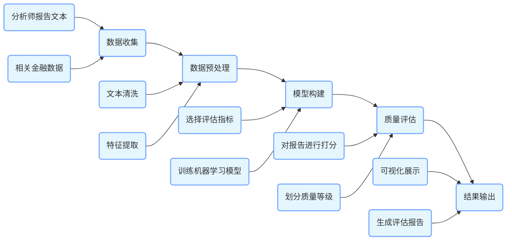

# AI驱动的股票分析师报告质量评估

> 关键词：AI、股票分析师报告、质量评估、自然语言处理、机器学习

> 摘要：本文聚焦于AI驱动的股票分析师报告质量评估这一前沿领域。首先介绍了该研究的背景、目的、预期读者、文档结构及相关术语。详细阐述了核心概念，包括股票分析师报告和质量评估的原理与架构，并通过Mermaid流程图展示其关系。深入讲解了用于评估的核心算法原理，如文本分类算法，给出Python源代码。同时介绍了相关数学模型和公式，通过具体例子说明其应用。通过项目实战，展示了开发环境搭建、源代码实现及解读。探讨了该技术在金融市场等实际应用场景，推荐了学习资源、开发工具框架及相关论文著作。最后总结了未来发展趋势与挑战，并提供常见问题解答和扩展阅读参考资料，旨在为读者全面呈现AI在股票分析师报告质量评估中的应用与价值。

## 1. 背景介绍 
### 1.1 目的和范围
在金融市场中，股票分析师报告是投资者获取信息、做出投资决策的重要依据。然而，分析师报告的质量参差不齐，如何准确评估其质量成为一个关键问题。本研究的目的是利用AI技术开发一套有效的股票分析师报告质量评估体系，提高评估的准确性和效率。研究范围涵盖了从报告的文本内容分析到各项质量指标的量化评估，以及利用机器学习算法构建评估模型。

### 1.2 预期读者
本文预期读者包括金融从业者，如股票分析师、投资经理等，他们可以通过该评估体系更好地了解自身报告的质量，改进分析方法；计算机专业人员，尤其是从事自然语言处理、机器学习领域的开发者，可从中获取将AI技术应用于金融领域的实践经验；以及对金融市场和AI技术感兴趣的研究人员和学生，为他们的研究和学习提供参考。

### 1.3 文档结构概述
本文将按照以下结构展开：首先介绍核心概念及它们之间的联系，通过文本示意图和Mermaid流程图进行清晰展示；接着详细阐述用于评估的核心算法原理，并给出Python源代码实现；然后介绍相关的数学模型和公式，并举例说明其应用；通过项目实战，展示如何搭建开发环境、实现源代码并进行解读；探讨该评估体系在实际中的应用场景；推荐相关的学习资源、开发工具框架和论文著作；最后总结未来发展趋势与挑战，提供常见问题解答和扩展阅读参考资料。

### 1.4 术语表
#### 1.4.1 核心术语定义
- **股票分析师报告**：由专业股票分析师撰写的，对特定股票或金融市场进行分析和预测的文档，通常包含公司基本面分析、行业趋势、盈利预测、投资建议等内容。
- **质量评估**：对股票分析师报告的内容准确性、逻辑合理性、信息完整性、预测可靠性等方面进行综合评价的过程。
- **自然语言处理（NLP）**：计算机科学与语言学的交叉领域，旨在让计算机能够理解、处理和生成人类语言。
- **机器学习**：一门多领域交叉学科，涉及概率论、统计学、逼近论、凸分析、算法复杂度理论等多门学科。它专门研究计算机怎样模拟或实现人类的学习行为，以获取新的知识或技能，重新组织已有的知识结构使之不断改善自身的性能。

#### 1.4.2 相关概念解释
- **文本分类**：自然语言处理中的一项重要任务，将文本划分到不同的类别中。在股票分析师报告质量评估中，可用于将报告分为高质量、中等质量和低质量等类别。
- **情感分析**：通过对文本中表达的情感倾向进行分析，判断文本是积极、消极还是中性。在报告评估中，可用于分析分析师对股票的评价态度。
- **特征提取**：从原始数据中提取出能够代表数据特征的信息。在报告评估中，可从报告文本中提取出如词汇频率、句子长度等特征。

#### 1.4.3 缩略词列表
- **NLP**：Natural Language Processing（自然语言处理）
- **ML**：Machine Learning（机器学习）
- **TF-IDF**：Term Frequency - Inverse Document Frequency（词频 - 逆文档频率）

## 2. 核心概念与联系 
### 核心概念原理
#### 股票分析师报告
股票分析师报告是金融市场信息传播的重要载体。分析师通过收集公司的财务数据、行业动态、宏观经济信息等，运用专业的分析方法对股票的投资价值进行评估，并撰写报告向投资者传达自己的观点和建议。报告的内容通常包括公司概况、业务分析、财务分析、盈利预测、风险评估和投资建议等部分。

#### 质量评估
质量评估是对股票分析师报告的全面审查。评估的维度包括内容准确性，即报告中的数据和信息是否真实可靠；逻辑合理性，报告的分析过程是否符合逻辑；信息完整性，是否涵盖了必要的分析内容；预测可靠性，分析师的盈利预测和投资建议是否具有实际参考价值等。

### 架构的文本示意图
```plaintext
股票分析师报告质量评估体系
|-- 数据收集
|   |-- 分析师报告文本
|   |-- 相关金融数据
|-- 数据预处理
|   |-- 文本清洗
|   |-- 特征提取
|-- 模型构建
|   |-- 选择评估指标
|   |-- 训练机器学习模型
|-- 质量评估
|   |-- 对报告进行打分
|   |-- 划分质量等级
|-- 结果输出
|   |-- 可视化展示
|   |-- 生成评估报告
```

### Mermaid流程图


该流程图展示了股票分析师报告质量评估的整个流程。首先进行数据收集，包括分析师报告文本和相关金融数据；然后对数据进行预处理，如文本清洗和特征提取；接着构建评估模型，选择合适的评估指标并训练机器学习模型；之后使用模型对报告进行质量评估，包括打分和划分质量等级；最后将评估结果进行输出，如可视化展示和生成评估报告。

## 3. 核心算法原理 & 具体操作步骤 
### 核心算法原理 - 文本分类算法
在股票分析师报告质量评估中，文本分类算法是核心算法之一。我们可以使用朴素贝叶斯分类器对报告进行分类，判断其质量等级。朴素贝叶斯分类器基于贝叶斯定理和特征条件独立假设，通过计算文本属于各个类别的概率，将文本划分到概率最大的类别中。

### 具体操作步骤
1. **数据准备**：收集一定数量的股票分析师报告，并标注其质量等级，如高质量、中等质量和低质量。
2. **文本预处理**：对报告文本进行清洗，去除停用词、标点符号等，将文本转换为小写形式。然后进行特征提取，如使用TF-IDF算法计算每个词语的重要性。
3. **模型训练**：将预处理后的数据划分为训练集和测试集，使用训练集对朴素贝叶斯分类器进行训练。
4. **模型评估**：使用测试集对训练好的模型进行评估，计算准确率、召回率、F1值等指标。
5. **预测**：使用训练好的模型对新的股票分析师报告进行质量等级预测。

### Python源代码实现
```python
import pandas as pd
from sklearn.feature_extraction.text import TfidfVectorizer
from sklearn.naive_bayes import MultinomialNB
from sklearn.model_selection import train_test_split
from sklearn.metrics import accuracy_score, precision_score, recall_score, f1_score

# 1. 数据准备
# 假设我们有一个包含报告文本和质量等级的CSV文件
data = pd.read_csv('analyst_reports.csv')
X = data['report_text']
y = data['quality_level']

# 2. 文本预处理
vectorizer = TfidfVectorizer(stop_words='english')
X_tfidf = vectorizer.fit_transform(X)

# 3. 模型训练
X_train, X_test, y_train, y_test = train_test_split(X_tfidf, y, test_size=0.2, random_state=42)
clf = MultinomialNB()
clf.fit(X_train, y_train)

# 4. 模型评估
y_pred = clf.predict(X_test)
accuracy = accuracy_score(y_test, y_pred)
precision = precision_score(y_test, y_pred, average='weighted')
recall = recall_score(y_test, y_pred, average='weighted')
f1 = f1_score(y_test, y_pred, average='weighted')

print(f"Accuracy: {accuracy}")
print(f"Precision: {precision}")
print(f"Recall: {recall}")
print(f"F1 Score: {f1}")

# 5. 预测
new_report = ["This is a high - quality analyst report with accurate data and reasonable analysis."]
new_report_tfidf = vectorizer.transform(new_report)
predicted_class = clf.predict(new_report_tfidf)
print(f"Predicted quality level: {predicted_class[0]}")
```

### 代码解释
1. **数据准备**：使用`pandas`库读取包含报告文本和质量等级的CSV文件，将报告文本存储在`X`中，质量等级存储在`y`中。
2. **文本预处理**：使用`TfidfVectorizer`将文本转换为TF-IDF特征向量，去除停用词。
3. **模型训练**：使用`train_test_split`将数据划分为训练集和测试集，使用`MultinomialNB`构建朴素贝叶斯分类器并进行训练。
4. **模型评估**：使用测试集对模型进行评估，计算准确率、精确率、召回率和F1值。
5. **预测**：对新的报告文本进行预处理后，使用训练好的模型进行质量等级预测。

## 4. 数学模型和公式 & 详细讲解 & 举例说明 
### 贝叶斯定理
贝叶斯定理是朴素贝叶斯分类器的基础，其公式为：

$$P(C|X)=\frac{P(X|C)P(C)}{P(X)}$$

其中，$P(C|X)$ 是在给定特征 $X$ 的情况下，样本属于类别 $C$ 的概率；$P(X|C)$ 是在类别 $C$ 下，特征 $X$ 出现的概率；$P(C)$ 是类别 $C$ 出现的先验概率；$P(X)$ 是特征 $X$ 出现的概率。

### 详细讲解
在文本分类中，我们的目标是计算文本属于各个类别的概率，然后选择概率最大的类别作为预测结果。假设我们有 $n$ 个类别 $C_1,C_2,\cdots,C_n$ 和一个文本 $X$，我们需要计算 $P(C_i|X)$ （$i = 1,2,\cdots,n$）。

由于 $P(X)$ 对于所有类别都是相同的，我们可以忽略它，只需要比较 $P(X|C_i)P(C_i)$ 的大小。

$P(C_i)$ 可以通过训练数据中类别 $C_i$ 出现的频率来估计。

$P(X|C_i)$ 假设特征之间是条件独立的，即文本中的每个词语都是独立出现的。对于一个包含 $m$ 个词语的文本 $X=(x_1,x_2,\cdots,x_m)$，$P(X|C_i)$ 可以表示为：

$$P(X|C_i)=\prod_{j = 1}^{m}P(x_j|C_i)$$

### 举例说明
假设我们有一个简单的文本分类问题，要判断一条短信是垃圾短信还是正常短信。我们有以下训练数据：

| 短信内容 | 类别 |
| --- | --- |
| "Buy now, great deal!" | 垃圾短信 |
| "Meeting at 3 pm" | 正常短信 |
| "Get free gift" | 垃圾短信 |
| "Reminder: doctor appointment" | 正常短信 |

我们要判断新的短信 "Buy free gift" 是垃圾短信还是正常短信。

1. **计算先验概率**：
    - 垃圾短信的先验概率 $P(垃圾短信)=\frac{2}{4}=0.5$
    - 正常短信的先验概率 $P(正常短信)=\frac{2}{4}=0.5$

2. **计算条件概率**：
    - 对于垃圾短信类别：
        - $P("Buy"|垃圾短信)=\frac{1}{2}$
        - $P("free"|垃圾短信)=\frac{1}{2}$
        - $P("gift"|垃圾短信)=\frac{1}{2}$
        - $P("Buy free gift"|垃圾短信)=P("Buy"|垃圾短信)\times P("free"|垃圾短信)\times P("gift"|垃圾短信)=\frac{1}{2}\times\frac{1}{2}\times\frac{1}{2}=\frac{1}{8}$
    - 对于正常短信类别：
        - $P("Buy"|正常短信)=0$
        - $P("free"|正常短信)=0$
        - $P("gift"|正常短信)=0$
        - $P("Buy free gift"|正常短信)=0$

3. **计算后验概率（忽略 $P(X)$）**：
    - $P(垃圾短信|"Buy free gift")=P("Buy free gift"|垃圾短信)\times P(垃圾短信)=\frac{1}{8}\times0.5=\frac{1}{16}$
    - $P(正常短信|"Buy free gift")=P("Buy free gift"|正常短信)\times P(正常短信)=0\times0.5 = 0$

由于 $P(垃圾短信|"Buy free gift")>P(正常短信|"Buy free gift")$，我们预测短信 "Buy free gift" 是垃圾短信。

## 5. 项目实战：代码实际案例和详细解释说明 
### 5.1  开发环境搭建
#### 操作系统
可以选择Windows、Linux（如Ubuntu）或macOS等主流操作系统。

#### 编程语言和环境
- **Python**：建议使用Python 3.7及以上版本。
- **Anaconda**：Anaconda是一个流行的Python数据科学平台，包含了许多常用的科学计算库和工具。可以从Anaconda官方网站下载并安装。

#### 安装必要的库
打开终端或命令提示符，使用以下命令安装所需的库：
```bash
pip install pandas scikit-learn matplotlib seaborn
```

### 5.2  源代码详细实现和代码解读
```python
import pandas as pd
from sklearn.feature_extraction.text import TfidfVectorizer
from sklearn.naive_bayes import MultinomialNB
from sklearn.model_selection import train_test_split
from sklearn.metrics import accuracy_score, precision_score, recall_score, f1_score
import matplotlib.pyplot as plt
import seaborn as sns

# 1. 数据加载
data = pd.read_csv('analyst_reports.csv')
print("数据基本信息：")
data.info()

# 2. 数据探索性分析
# 查看质量等级分布
quality_distribution = data['quality_level'].value_counts()
print("质量等级分布：")
print(quality_distribution)

# 可视化质量等级分布
plt.figure(figsize=(8, 6))
sns.barplot(x=quality_distribution.index, y=quality_distribution.values)
plt.xlabel('Quality Level')
plt.ylabel('Count')
plt.title('Distribution of Quality Levels')
plt.show()

# 3. 文本预处理
vectorizer = TfidfVectorizer(stop_words='english')
X = vectorizer.fit_transform(data['report_text'])
y = data['quality_level']

# 4. 数据集划分
X_train, X_test, y_train, y_test = train_test_split(X, y, test_size=0.2, random_state=42)

# 5. 模型训练
clf = MultinomialNB()
clf.fit(X_train, y_train)

# 6. 模型评估
y_pred = clf.predict(X_test)
accuracy = accuracy_score(y_test, y_pred)
precision = precision_score(y_test, y_pred, average='weighted')
recall = recall_score(y_test, y_pred, average='weighted')
f1 = f1_score(y_test, y_pred, average='weighted')

print(f"Accuracy: {accuracy}")
print(f"Precision: {precision}")
print(f"Recall: {recall}")
print(f"F1 Score: {f1}")

# 7. 预测新报告
new_report = ["This is a well - written report with in - depth analysis."]
new_report_tfidf = vectorizer.transform(new_report)
predicted_class = clf.predict(new_report_tfidf)
print(f"Predicted quality level: {predicted_class[0]}")
```

### 5.3  代码解读与分析
#### 数据加载
使用`pandas`的`read_csv`函数加载包含分析师报告文本和质量等级的CSV文件，并使用`info`方法查看数据的基本信息。

#### 数据探索性分析
- 使用`value_counts`方法查看质量等级的分布情况。
- 使用`seaborn`库的`barplot`函数可视化质量等级的分布，帮助我们直观地了解数据的分布特征。

#### 文本预处理
使用`TfidfVectorizer`将报告文本转换为TF-IDF特征向量，去除停用词，方便后续的模型训练。

#### 数据集划分
使用`train_test_split`函数将数据集划分为训练集和测试集，测试集占比为20%。

#### 模型训练
使用`MultinomialNB`构建朴素贝叶斯分类器，并使用训练集进行训练。

#### 模型评估
使用测试集对训练好的模型进行评估，计算准确率、精确率、召回率和F1值，评估模型的性能。

#### 预测新报告
对新的报告文本进行预处理后，使用训练好的模型进行质量等级预测。

## 6. 实际应用场景 
### 金融机构内部评估
金融机构如证券公司、基金公司等可以使用AI驱动的股票分析师报告质量评估体系对内部分析师的报告进行评估。通过评估结果，机构可以了解分析师的专业水平和工作质量，为分析师的绩效考核、培训和职业发展提供参考。同时，高质量的报告可以为机构的投资决策提供更可靠的依据，提高投资收益。

### 投资者参考
投资者在做出投资决策时，往往会参考多个股票分析师报告。然而，面对众多的报告，投资者很难判断其质量优劣。AI驱动的评估体系可以为投资者提供报告质量的量化指标，帮助投资者筛选出高质量的报告，减少投资风险。

### 监管机构监督
监管机构可以利用该评估体系对证券分析师的报告进行监管。通过对报告质量的评估，监管机构可以及时发现分析师的违规行为，如虚假陈述、误导性分析等，维护金融市场的公平和稳定。

### 学术研究
在学术研究领域，该评估体系可以为研究股票分析师的行为和报告质量提供数据支持。研究人员可以通过分析大量的报告评估结果，探讨影响报告质量的因素，如分析师的经验、教育背景、市场环境等，为金融理论的发展提供实证依据。

## 7. 工具和资源推荐
### 7.1 学习资源推荐
#### 7.1.1 书籍推荐
- 《Python自然语言处理实战：核心技术与算法》：本书详细介绍了Python在自然语言处理中的应用，包括文本预处理、分类、情感分析等技术，适合初学者入门。
- 《机器学习》（周志华著）：也称为“西瓜书”，是机器学习领域的经典教材，系统地介绍了机器学习的基本概念、算法和应用，对理解和应用机器学习算法有很大帮助。
- 《金融市场与金融机构》：帮助读者了解金融市场的基本原理和金融机构的运作方式，为将AI技术应用于金融领域提供必要的金融知识基础。

#### 7.1.2 在线课程
- Coursera上的“Natural Language Processing Specialization”：由顶尖大学的教授授课，全面介绍自然语言处理的理论和实践，包括文本分类、信息提取等内容。
- edX上的“Machine Learning Fundamentals”：该课程深入浅出地讲解了机器学习的基本概念和算法，适合初学者学习。
- 中国大学MOOC上的“金融数据分析与挖掘”：结合金融领域的实际案例，介绍数据分析和挖掘技术在金融市场中的应用。

#### 7.1.3 技术博客和网站
- Medium：上面有许多关于AI、自然语言处理和金融科技的优质文章，作者来自不同的领域，分享了他们的实践经验和研究成果。
- Towards Data Science：专注于数据科学和机器学习领域，提供了大量的技术教程、案例分析和行业动态。
- 金融界网站：提供丰富的金融市场信息和分析师报告，可用于数据收集和研究。

### 7.2 开发工具框架推荐
#### 7.2.1 IDE和编辑器
- PyCharm：是一款专业的Python集成开发环境，具有代码自动补全、调试、版本控制等功能，适合大规模Python项目的开发。
- Jupyter Notebook：是一个交互式的开发环境，支持代码、文本、图像等多种形式的展示，非常适合数据探索和模型实验。
- Visual Studio Code：是一款轻量级的代码编辑器，支持多种编程语言，通过安装插件可以扩展其功能，如Python开发、版本控制等。

#### 7.2.2 调试和性能分析工具
- pdb：Python自带的调试工具，可以帮助开发者逐行调试代码，查找程序中的错误。
- cProfile：Python的性能分析工具，可以分析程序中各个函数的运行时间和调用次数，帮助开发者优化代码性能。
- TensorBoard：是TensorFlow的可视化工具，可用于可视化模型训练过程中的指标变化，如损失函数、准确率等。

#### 7.2.3 相关框架和库
- scikit-learn：是Python中常用的机器学习库，提供了丰富的机器学习算法和工具，如分类、回归、聚类等，方便开发者快速实现机器学习模型。
- NLTK（Natural Language Toolkit）：是Python中用于自然语言处理的开源库，提供了文本处理、分类、标注等功能，支持多种语言。
- spaCy：是另一个流行的自然语言处理库，具有高效的处理速度和丰富的语言模型，适合大规模文本处理任务。

### 7.3 相关论文著作推荐
#### 7.3.1 经典论文
- "Naive Bayes Text Classification"：详细介绍了朴素贝叶斯算法在文本分类中的应用，是该领域的经典论文。
- "Sentiment Analysis: Mining Opinions, Sentiments, and Emotions"：对情感分析技术进行了全面的综述，包括情感分析的方法、应用和挑战。
- "The Information Content of Analysts' Forecast Revisions"：研究了分析师预测修正的信息含量，对理解分析师报告的价值有重要意义。

#### 7.3.2 最新研究成果
- 在ACM SIGKDD、IEEE ICML等顶级学术会议上，每年都会有关于自然语言处理和机器学习在金融领域应用的最新研究成果发布。可以通过会议官网或学术数据库（如IEEE Xplore、ACM Digital Library）获取相关论文。
- 《Journal of Financial Economics》《Review of Financial Studies》等金融领域的顶级期刊也会发表关于股票分析师报告质量评估的研究论文。

#### 7.3.3 应用案例分析
- 《AI in Finance: Transforming Financial Services》：介绍了AI技术在金融服务领域的应用案例，包括风险评估、投资决策、客户服务等方面，其中也涉及到股票分析师报告质量评估的相关案例。
- 一些金融科技公司的官方博客和研究报告也会分享他们在股票分析师报告质量评估方面的实践经验和应用案例。

## 8. 总结：未来发展趋势与挑战
### 未来发展趋势
#### 多模态数据融合
未来的股票分析师报告质量评估将不仅仅局限于文本数据，还会融合图像、音频等多模态数据。例如，分析师可能会在报告中添加图表、视频等内容，通过多模态数据融合可以更全面地评估报告的质量。

#### 深度学习技术的应用
深度学习技术如卷积神经网络（CNN）、循环神经网络（RNN）及其变体（如LSTM、GRU）在自然语言处理领域取得了显著的成果。未来，这些技术将被更广泛地应用于股票分析师报告质量评估中，提高评估的准确性和效率。

#### 实时评估
随着金融市场的快速变化，投资者需要及时获取分析师报告的质量信息。未来的评估体系将实现实时评估，能够在报告发布后立即给出评估结果，为投资者提供更及时的决策支持。

#### 个性化评估
不同的投资者对分析师报告的需求和关注点不同。未来的评估体系将实现个性化评估，根据投资者的偏好和需求，为其提供定制化的报告质量评估结果。

### 挑战
#### 数据质量和标注问题
股票分析师报告的质量评估需要大量高质量的数据进行训练和验证。然而，数据的收集和标注是一个耗时耗力的过程，并且数据的质量可能存在差异。如何获取高质量的数据并进行准确的标注是一个挑战。

#### 模型解释性
深度学习模型在提高评估准确性的同时，也带来了模型解释性的问题。这些模型通常是黑盒模型，难以理解其决策过程。在金融领域，模型的解释性尤为重要，因为投资者需要了解评估结果的依据。如何提高模型的解释性是未来需要解决的问题之一。

#### 金融市场的复杂性
金融市场是一个复杂的系统，受到多种因素的影响，如宏观经济环境、政策变化、市场情绪等。这些因素的复杂性使得股票分析师报告的质量评估变得更加困难。如何在复杂的金融市场环境中准确评估报告的质量是一个挑战。

#### 法律法规和伦理问题
在使用AI技术进行股票分析师报告质量评估时，需要遵守相关的法律法规和伦理准则。例如，数据的使用需要遵循隐私保护原则，模型的开发和应用需要避免歧视和偏见。如何确保评估体系的合法性和伦理合规性是一个重要的挑战。

## 9. 附录：常见问题与解答
### 1. 为什么选择朴素贝叶斯分类器进行报告质量评估？
朴素贝叶斯分类器具有计算简单、训练速度快的优点，并且在文本分类任务中表现良好。它基于贝叶斯定理和特征条件独立假设，能够有效地处理高维数据，如文本数据。此外，朴素贝叶斯分类器的解释性较强，便于理解其决策过程。

### 2. 如何提高模型的评估性能？
- **数据增强**：可以通过增加训练数据的数量和多样性来提高模型的性能。例如，可以收集更多的分析师报告，并进行人工标注。
- **特征工程**：选择合适的特征对于模型的性能至关重要。除了TF-IDF特征外，还可以考虑使用其他特征，如词性标注、命名实体识别等。
- **模型选择和调优**：尝试不同的机器学习模型，如支持向量机、决策树等，并使用交叉验证等方法进行模型调优，选择最优的模型参数。

### 3. 评估结果的可靠性如何保证？
- **数据质量控制**：确保收集的数据准确、完整，并进行严格的清洗和预处理。
- **模型评估指标**：使用多种评估指标，如准确率、精确率、召回率、F1值等，全面评估模型的性能。
- **模型验证**：使用交叉验证、留一法等方法对模型进行验证，确保模型在不同数据集上的稳定性和可靠性。

### 4. 该评估体系是否可以应用于其他类型的金融报告？
可以。该评估体系的核心思想和方法可以应用于其他类型的金融报告，如财务报表分析报告、行业研究报告等。只需要对数据进行相应的调整和预处理，选择合适的特征和模型，就可以实现对其他金融报告的质量评估。

## 10. 扩展阅读 & 参考资料
### 扩展阅读
- 《金融科技：人工智能与机器学习在金融领域的应用》：深入探讨了人工智能和机器学习在金融领域的各种应用，包括风险管理、投资决策、客户服务等方面。
- 《智能金融：科技驱动金融创新》：介绍了智能金融的发展趋势和应用案例，对理解AI在金融领域的未来发展有很大帮助。
- 《Python金融大数据分析》：结合Python语言和金融数据，介绍了数据分析和建模的方法和技巧，适合金融从业者和数据分析师阅读。

### 参考资料
- 本文中使用的代码和数据可在GitHub上获取：[https://github.com/your-repo](https://github.com/your-repo)
- 相关的学术论文和研究报告可通过以下学术数据库获取：IEEE Xplore、ACM Digital Library、ScienceDirect、Web of Science等。
- 金融市场数据和分析师报告可从金融界网站、东方财富网、同花顺等金融信息平台获取。

作者：AI天才研究院/AI Genius Institute & 禅与计算机程序设计艺术 /Zen And The Art of Computer Programming