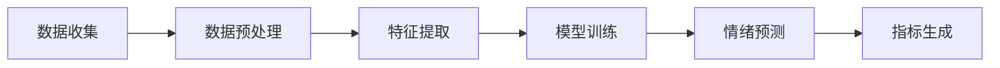

# AI驱动的股票市场情绪指标开发

> 关键词：AI、股票市场、情绪指标、自然语言处理、机器学习

> 摘要：本文围绕AI驱动的股票市场情绪指标开发展开深入探讨。首先介绍了开发此指标的背景和目的，阐述了相关核心概念及联系，详细讲解了核心算法原理和具体操作步骤，运用数学模型和公式进行理论分析并举例说明。通过项目实战展示了代码的实际案例及详细解释，分析了该情绪指标在实际中的应用场景。同时推荐了学习资源、开发工具框架以及相关论文著作。最后总结了未来发展趋势与挑战，还提供了常见问题解答和扩展阅读参考资料，旨在为相关领域的研究者和开发者提供全面且深入的技术指导。

## 1. 背景介绍 
### 1.1 目的和范围
在股票市场中，投资者的情绪对股票价格的波动有着重要影响。传统的股票分析方法主要侧重于基本面和技术面分析，而忽略了投资者情绪这一关键因素。本项目的目的是开发一种基于AI的股票市场情绪指标，通过分析大量的金融文本数据（如新闻报道、社交媒体评论等）来量化投资者的情绪，为投资者提供更全面的市场信息，辅助其做出更明智的投资决策。

本项目的范围涵盖了从数据收集、预处理、特征提取、模型训练到情绪指标生成的整个流程，重点关注如何运用AI技术准确地捕捉和量化股票市场中的投资者情绪。

### 1.2 预期读者
本文的预期读者包括金融领域的投资者、金融分析师、量化交易员、人工智能和机器学习领域的研究者和开发者，以及对股票市场情绪分析感兴趣的相关人员。

### 1.3 文档结构概述
本文将按照以下结构进行组织：
- 核心概念与联系：介绍与股票市场情绪指标开发相关的核心概念及其相互关系，并通过文本示意图和Mermaid流程图进行直观展示。
- 核心算法原理 & 具体操作步骤：详细讲解用于情绪分析的核心算法原理，并给出具体的操作步骤，同时使用Python源代码进行阐述。
- 数学模型和公式 & 详细讲解 & 举例说明：运用数学模型和公式对情绪分析过程进行理论分析，并通过具体例子进行说明。
- 项目实战：代码实际案例和详细解释说明：通过一个实际的项目案例，展示如何开发AI驱动的股票市场情绪指标，包括开发环境搭建、源代码详细实现和代码解读。
- 实际应用场景：分析股票市场情绪指标在实际中的应用场景。
- 工具和资源推荐：推荐学习资源、开发工具框架以及相关论文著作。
- 总结：未来发展趋势与挑战：总结AI驱动的股票市场情绪指标开发的未来发展趋势和面临的挑战。
- 附录：常见问题与解答：解答读者在阅读过程中可能遇到的常见问题。
- 扩展阅读 & 参考资料：提供扩展阅读的建议和参考资料。

### 1.4 术语表
#### 1.4.1 核心术语定义
- **股票市场情绪指标**：用于量化投资者对股票市场的情绪状态的指标，通常基于文本数据进行分析得出。
- **自然语言处理（NLP）**：研究如何让计算机理解和处理人类语言的技术领域，在本项目中用于对金融文本数据进行处理和分析。
- **机器学习（ML）**：一门多领域交叉学科，涉及概率论、统计学、逼近论、凸分析、算法复杂度理论等多门学科。它专门研究计算机怎样模拟或实现人类的学习行为，以获取新的知识或技能，重新组织已有的知识结构使之不断改善自身的性能。在本项目中用于训练情绪分析模型。
- **文本分类**：将文本数据划分到不同类别的任务，在本项目中用于将金融文本数据分类为积极、消极或中性情绪。
- **词向量**：将文本中的词语表示为向量的形式，以便计算机进行处理和分析。

#### 1.4.2 相关概念解释
- **情感极性**：表示文本所表达的情感倾向，通常分为积极、消极和中性三种。
- **文本特征提取**：从文本数据中提取出能够代表文本特征的信息，如词频、TF-IDF值等。
- **模型训练**：使用训练数据对机器学习模型进行训练，调整模型的参数，使其能够准确地完成任务。
- **模型评估**：使用测试数据对训练好的模型进行评估，衡量模型的性能。

#### 1.4.3 缩略词列表
- **NLP**：Natural Language Processing（自然语言处理）
- **ML**：Machine Learning（机器学习）
- **TF-IDF**：Term Frequency-Inverse Document Frequency（词频-逆文档频率）
- **API**：Application Programming Interface（应用程序编程接口）

## 2. 核心概念与联系 

### 核心概念原理
在AI驱动的股票市场情绪指标开发中，主要涉及到自然语言处理和机器学习两个核心领域。自然语言处理用于对金融文本数据进行处理和分析，将文本数据转换为计算机能够理解的形式；机器学习则用于训练情绪分析模型，根据处理后的数据预测文本的情绪极性。

具体来说，整个流程包括以下几个步骤：
1. **数据收集**：从各种渠道收集金融文本数据，如新闻网站、社交媒体平台等。
2. **数据预处理**：对收集到的文本数据进行清洗、分词、去除停用词等操作，以提高数据的质量。
3. **特征提取**：从预处理后的文本数据中提取特征，如词向量、TF-IDF值等。
4. **模型训练**：使用提取的特征和标注好的情绪标签对机器学习模型进行训练。
5. **情绪预测**：使用训练好的模型对新的文本数据进行情绪预测。
6. **指标生成**：根据情绪预测结果生成股票市场情绪指标。

### 架构的文本示意图
```plaintext
数据收集（新闻网站、社交媒体等）
|
v
数据预处理（清洗、分词、去停用词）
|
v
特征提取（词向量、TF-IDF等）
|
v
模型训练（机器学习模型）
|
v
情绪预测（新文本数据）
|
v
指标生成（股票市场情绪指标）
```

### Mermaid流程图


## 3. 核心算法原理 & 具体操作步骤 

### 核心算法原理
在本项目中，我们将使用基于机器学习的文本分类算法来进行情绪分析。具体来说，我们将使用逻辑回归算法作为示例，逻辑回归是一种常用的二分类算法，也可以扩展到多分类问题。

逻辑回归的基本原理是通过一个逻辑函数将线性回归的输出映射到一个概率值，从而实现分类任务。逻辑函数的公式如下：

$$\sigma(z)=\frac{1}{1 + e^{-z}}$$

其中，$z$ 是线性回归的输出，$\sigma(z)$ 是逻辑函数的输出，取值范围在 $[0, 1]$ 之间。

对于文本分类问题，我们可以将文本的特征向量作为输入，通过逻辑回归模型计算出文本属于每个类别的概率，然后选择概率最大的类别作为预测结果。

### 具体操作步骤

#### 步骤1：数据收集
我们可以使用Python的`requests`库从新闻网站或社交媒体平台的API中获取金融文本数据。以下是一个简单的示例代码：

```python
import requests

# 定义API接口地址
url = 'https://api.example.com/news'

# 发送请求获取数据
response = requests.get(url)

# 解析JSON数据
data = response.json()

# 提取文本数据
texts = [item['text'] for item in data]
```

#### 步骤2：数据预处理
使用Python的`nltk`库对文本数据进行预处理，包括清洗、分词、去除停用词等操作。以下是示例代码：

```python
import nltk
from nltk.corpus import stopwords
from nltk.tokenize import word_tokenize
import re

# 下载停用词和分词器
nltk.download('stopwords')
nltk.download('punkt')

# 定义停用词
stop_words = set(stopwords.words('english'))

# 定义数据预处理函数
def preprocess_text(text):
    # 转换为小写
    text = text.lower()
    # 去除特殊字符和标点符号
    text = re.sub(r'[^a-zA-Z0-9\s]', '', text)
    # 分词
    tokens = word_tokenize(text)
    # 去除停用词
    filtered_tokens = [token for token in tokens if token not in stop_words]
    # 拼接成字符串
    preprocessed_text = ' '.join(filtered_tokens)
    return preprocessed_text

# 对文本数据进行预处理
preprocessed_texts = [preprocess_text(text) for text in texts]
```

#### 步骤3：特征提取
使用`sklearn`库的`TfidfVectorizer`类将文本数据转换为TF-IDF特征向量。以下是示例代码：

```python
from sklearn.feature_extraction.text import TfidfVectorizer

# 定义TF-IDF向量器
vectorizer = TfidfVectorizer()

# 提取特征向量
feature_vectors = vectorizer.fit_transform(preprocessed_texts)
```

#### 步骤4：模型训练
使用`sklearn`库的`LogisticRegression`类训练逻辑回归模型。以下是示例代码：

```python
from sklearn.linear_model import LogisticRegression
from sklearn.model_selection import train_test_split

# 假设我们有标注好的情绪标签
labels = [0, 1, 0, 1,...]  # 0表示消极情绪，1表示积极情绪

# 划分训练集和测试集
X_train, X_test, y_train, y_test = train_test_split(feature_vectors, labels, test_size=0.2, random_state=42)

# 定义逻辑回归模型
model = LogisticRegression()

# 训练模型
model.fit(X_train, y_train)
```

#### 步骤5：情绪预测
使用训练好的模型对新的文本数据进行情绪预测。以下是示例代码：

```python
# 假设我们有新的文本数据
new_texts = ['This stock is going to rise!', 'The market is in a bad situation.']

# 对新的文本数据进行预处理
new_preprocessed_texts = [preprocess_text(text) for text in new_texts]

# 提取特征向量
new_feature_vectors = vectorizer.transform(new_preprocessed_texts)

# 进行情绪预测
predictions = model.predict(new_feature_vectors)

print(predictions)
```

#### 步骤6：指标生成
根据情绪预测结果生成股票市场情绪指标。例如，我们可以计算积极情绪文本的比例作为情绪指标。以下是示例代码：

```python
# 计算积极情绪文本的比例
positive_count = sum(predictions)
total_count = len(predictions)
sentiment_index = positive_count / total_count

print(sentiment_index)
```

## 4. 数学模型和公式 & 详细讲解 & 举例说明 

### 逻辑回归模型的数学公式
逻辑回归模型的数学公式可以表示为：

$$P(y = 1|x)=\frac{1}{1 + e^{-(w_0 + w_1x_1 + w_2x_2 + \cdots + w_nx_n)}}$$

其中，$P(y = 1|x)$ 表示样本 $x$ 属于正类（积极情绪）的概率，$w_0$ 是截距项，$w_1, w_2, \cdots, w_n$ 是特征的权重，$x_1, x_2, \cdots, x_n$ 是样本的特征。

### 损失函数
逻辑回归模型通常使用对数损失函数（Log Loss）作为损失函数，其公式如下：

$$L(y, \hat{y}) = -[y\log(\hat{y}) + (1 - y)\log(1 - \hat{y})]$$

其中，$y$ 是真实标签，$\hat{y}$ 是预测概率。

### 梯度下降算法
为了求解逻辑回归模型的参数 $w_0, w_1, w_2, \cdots, w_n$，我们通常使用梯度下降算法。梯度下降算法的基本思想是通过不断地更新参数，使得损失函数的值逐渐减小。

参数更新的公式如下：

$$w_i = w_i - \alpha\frac{\partial L}{\partial w_i}$$

其中，$\alpha$ 是学习率，$\frac{\partial L}{\partial w_i}$ 是损失函数对参数 $w_i$ 的偏导数。

### 举例说明
假设我们有一个简单的文本分类问题，只有一个特征 $x_1$，样本数据如下：

| 样本 | 特征 $x_1$ | 标签 $y$ |
|------|------------|----------|
| 1    | 0.5        | 1        |
| 2    | 0.2        | 0        |
| 3    | 0.8        | 1        |

我们使用逻辑回归模型进行训练，初始参数 $w_0 = 0$，$w_1 = 0$，学习率 $\alpha = 0.1$。

#### 步骤1：计算预测概率
对于样本1，$x_1 = 0.5$，预测概率为：

$$P(y = 1|x_1)=\frac{1}{1 + e^{-(0 + 0\times0.5)}} = 0.5$$

#### 步骤2：计算损失函数值
对于样本1，真实标签 $y = 1$，预测概率 $\hat{y} = 0.5$，损失函数值为：

$$L(y, \hat{y}) = -[1\times\log(0.5) + (1 - 1)\times\log(1 - 0.5)] = -\log(0.5) \approx 0.693$$

#### 步骤3：计算偏导数
损失函数对 $w_0$ 的偏导数为：

$$\frac{\partial L}{\partial w_0} = \hat{y} - y = 0.5 - 1 = -0.5$$

损失函数对 $w_1$ 的偏导数为：

$$\frac{\partial L}{\partial w_1} = (\hat{y} - y)x_1 = (-0.5)\times0.5 = -0.25$$

#### 步骤4：更新参数
根据梯度下降算法，更新参数：

$$w_0 = w_0 - \alpha\frac{\partial L}{\partial w_0} = 0 - 0.1\times(-0.5) = 0.05$$

$$w_1 = w_1 - \alpha\frac{\partial L}{\partial w_1} = 0 - 0.1\times(-0.25) = 0.025$$

重复以上步骤，直到损失函数的值收敛或达到最大迭代次数。

## 5. 项目实战：代码实际案例和详细解释说明 

### 5.1  开发环境搭建
#### 安装Python
首先，确保你已经安装了Python 3.x版本。你可以从Python官方网站（https://www.python.org/downloads/）下载并安装Python。

#### 安装必要的库
使用`pip`命令安装项目所需的库：

```bash
pip install requests nltk scikit-learn
```

#### 下载NLTK数据
在Python环境中运行以下代码下载NLTK所需的数据：

```python
import nltk
nltk.download('stopwords')
nltk.download('punkt')
```

### 5.2  源代码详细实现和代码解读
以下是一个完整的项目实战代码示例：

```python
import requests
import nltk
from nltk.corpus import stopwords
from nltk.tokenize import word_tokenize
import re
from sklearn.feature_extraction.text import TfidfVectorizer
from sklearn.linear_model import LogisticRegression
from sklearn.model_selection import train_test_split

# 数据收集
def collect_data():
    url = 'https://api.example.com/news'
    response = requests.get(url)
    data = response.json()
    texts = [item['text'] for item in data]
    return texts

# 数据预处理
def preprocess_text(text):
    text = text.lower()
    text = re.sub(r'[^a-zA-Z0-9\s]', '', text)
    tokens = word_tokenize(text)
    stop_words = set(stopwords.words('english'))
    filtered_tokens = [token for token in tokens if token not in stop_words]
    preprocessed_text = ' '.join(filtered_tokens)
    return preprocessed_text

# 特征提取
def extract_features(texts):
    vectorizer = TfidfVectorizer()
    feature_vectors = vectorizer.fit_transform(texts)
    return feature_vectors, vectorizer

# 模型训练
def train_model(feature_vectors, labels):
    X_train, X_test, y_train, y_test = train_test_split(feature_vectors, labels, test_size=0.2, random_state=42)
    model = LogisticRegression()
    model.fit(X_train, y_train)
    return model

# 情绪预测
def predict_sentiment(new_texts, vectorizer, model):
    new_preprocessed_texts = [preprocess_text(text) for text in new_texts]
    new_feature_vectors = vectorizer.transform(new_preprocessed_texts)
    predictions = model.predict(new_feature_vectors)
    return predictions

# 指标生成
def generate_sentiment_index(predictions):
    positive_count = sum(predictions)
    total_count = len(predictions)
    sentiment_index = positive_count / total_count
    return sentiment_index

# 主函数
def main():
    # 数据收集
    texts = collect_data()
    # 数据预处理
    preprocessed_texts = [preprocess_text(text) for text in texts]
    # 假设我们有标注好的情绪标签
    labels = [0, 1, 0, 1,...]  # 0表示消极情绪，1表示积极情绪
    # 特征提取
    feature_vectors, vectorizer = extract_features(preprocessed_texts)
    # 模型训练
    model = train_model(feature_vectors, labels)
    # 假设我们有新的文本数据
    new_texts = ['This stock is going to rise!', 'The market is in a bad situation.']
    # 情绪预测
    predictions = predict_sentiment(new_texts, vectorizer, model)
    # 指标生成
    sentiment_index = generate_sentiment_index(predictions)
    print('Sentiment Index:', sentiment_index)

if __name__ == '__main__':
    main()
```

### 5.3  代码解读与分析
- **数据收集**：`collect_data`函数使用`requests`库从API接口获取金融文本数据。
- **数据预处理**：`preprocess_text`函数对文本数据进行清洗、分词、去除停用词等操作，以提高数据的质量。
- **特征提取**：`extract_features`函数使用`TfidfVectorizer`类将文本数据转换为TF-IDF特征向量。
- **模型训练**：`train_model`函数使用`LogisticRegression`类训练逻辑回归模型。
- **情绪预测**：`predict_sentiment`函数使用训练好的模型对新的文本数据进行情绪预测。
- **指标生成**：`generate_sentiment_index`函数根据情绪预测结果生成股票市场情绪指标。
- **主函数**：`main`函数将以上步骤组合起来，完成整个项目的流程。

## 6. 实际应用场景 
### 投资决策辅助
投资者可以使用股票市场情绪指标来辅助自己做出投资决策。当情绪指标显示市场情绪积极时，投资者可以考虑增加股票投资；当情绪指标显示市场情绪消极时，投资者可以考虑减少股票投资或采取避险措施。

### 量化交易策略
量化交易员可以将股票市场情绪指标纳入量化交易策略中，根据情绪指标的变化调整交易策略。例如，当情绪指标出现大幅波动时，触发相应的交易信号。

### 市场监测和预警
金融机构和监管部门可以使用股票市场情绪指标来监测市场情绪的变化，及时发现潜在的市场风险。当情绪指标出现异常时，发出预警信号，提醒相关人员采取措施。

### 上市公司舆情分析
上市公司可以通过分析股票市场情绪指标了解投资者对公司的看法和情绪，及时调整公司的经营策略和公关策略，提升公司的形象和市场价值。

## 7. 工具和资源推荐
### 7.1 学习资源推荐
#### 7.1.1 书籍推荐
- 《Python自然语言处理》：介绍了Python在自然语言处理领域的应用，包括文本处理、分词、词性标注、命名实体识别等内容。
- 《机器学习实战》：通过实际案例介绍了机器学习的基本算法和应用，包括分类、回归、聚类等算法。
- 《深度学习》：由深度学习领域的三位先驱Ian Goodfellow、Yoshua Bengio和Aaron Courville撰写，系统地介绍了深度学习的理论和实践。

#### 7.1.2 在线课程
- Coursera上的“Natural Language Processing Specialization”：由斯坦福大学的教授授课，介绍了自然语言处理的基本概念和算法。
- edX上的“Introduction to Machine Learning”：由麻省理工学院的教授授课，介绍了机器学习的基本概念和算法。
- Kaggle上的“NLP with Disaster Tweets”：一个关于自然语言处理的实战项目，通过分析推特数据来预测灾难事件。

#### 7.1.3 技术博客和网站
- Medium上的Towards Data Science：一个专注于数据科学和机器学习的技术博客，分享了很多优秀的技术文章和案例。
- arXiv：一个预印本服务器，提供了大量的学术论文，包括自然语言处理和机器学习领域的最新研究成果。
- Kaggle：一个数据科学竞赛平台，提供了很多数据集和竞赛项目，可以帮助你提升实践能力。

### 7.2 开发工具框架推荐
#### 7.2.1 IDE和编辑器
- PyCharm：一个专业的Python集成开发环境，提供了代码编辑、调试、版本控制等功能。
- Jupyter Notebook：一个交互式的开发环境，适合进行数据探索和模型训练。
- Visual Studio Code：一个轻量级的代码编辑器，支持多种编程语言，并且有丰富的插件扩展。

#### 7.2.2 调试和性能分析工具
- pdb：Python自带的调试工具，可以帮助你调试代码。
- cProfile：Python自带的性能分析工具，可以帮助你分析代码的性能瓶颈。
- TensorBoard：一个用于可视化深度学习模型训练过程的工具，可以帮助你监控模型的训练进度和性能。

#### 7.2.3 相关框架和库
- NLTK：一个流行的自然语言处理库，提供了丰富的文本处理工具和数据集。
- SpaCy：一个高效的自然语言处理库，提供了快速的分词、词性标注、命名实体识别等功能。
- Scikit-learn：一个常用的机器学习库，提供了各种机器学习算法和工具。
- TensorFlow：一个开源的深度学习框架，广泛应用于自然语言处理、计算机视觉等领域。
- PyTorch：一个开源的深度学习框架，具有动态图的特点，适合进行快速原型开发。

### 7.3 相关论文著作推荐
#### 7.3.1 经典论文
- "A Sentimental Education: Sentiment Analysis Using Subjectivity Summarization Based on Minimum Cuts"：提出了一种基于最小割的主观性总结方法，用于情感分析。
- "Convolutional Neural Networks for Sentence Classification"：介绍了使用卷积神经网络进行句子分类的方法。
- "Attention Is All You Need"：提出了Transformer模型，是自然语言处理领域的重要突破。

#### 7.3.2 最新研究成果
- 在ACL（Association for Computational Linguistics）、EMNLP（Conference on Empirical Methods in Natural Language Processing）等自然语言处理领域的顶级会议上发表的最新研究成果。
- 在arXiv上搜索“Stock market sentiment analysis”可以找到很多关于股票市场情绪分析的最新研究论文。

#### 7.3.3 应用案例分析
- 一些金融科技公司的官方博客或研究报告，会分享他们在股票市场情绪分析方面的应用案例和经验。
- Kaggle上的一些关于股票市场情绪分析的竞赛项目和解决方案。

## 8. 总结：未来发展趋势与挑战
### 未来发展趋势
- **多模态数据融合**：未来的股票市场情绪指标开发将不仅仅依赖于文本数据，还会融合图像、音频等多模态数据，以更全面地捕捉投资者的情绪。
- **深度学习模型的应用**：随着深度学习技术的不断发展，更复杂的深度学习模型将被应用于股票市场情绪分析，如Transformer、BERT等，以提高情绪分析的准确性。
- **实时情绪监测**：实现对股票市场情绪的实时监测和预警，为投资者提供更及时的市场信息。
- **个性化情绪指标**：根据不同投资者的偏好和需求，提供个性化的股票市场情绪指标。

### 挑战
- **数据质量问题**：金融文本数据往往存在噪声、歧义等问题，如何提高数据的质量是一个挑战。
- **模型可解释性**：深度学习模型通常是黑盒模型，难以解释其决策过程，如何提高模型的可解释性是一个重要的研究方向。
- **情绪的复杂性**：投资者的情绪是复杂多变的，受到多种因素的影响，如何准确地捕捉和量化这种复杂性是一个挑战。
- **市场的不确定性**：股票市场本身具有不确定性，情绪指标可能无法完全准确地预测市场的走势。

## 9. 附录：常见问题与解答
### 问题1：如何获取高质量的金融文本数据？
可以通过以下几种方式获取高质量的金融文本数据：
- 新闻网站：如新浪财经、腾讯财经等，这些网站提供了大量的金融新闻报道。
- 社交媒体平台：如微博、推特等，投资者会在这些平台上分享自己的观点和情绪。
- 金融数据提供商：如万得、东方财富等，这些提供商提供了专业的金融数据和文本信息。

### 问题2：如何选择合适的机器学习模型进行情绪分析？
选择合适的机器学习模型需要考虑以下几个因素：
- 数据规模：如果数据规模较小，可以选择简单的模型，如逻辑回归、朴素贝叶斯等；如果数据规模较大，可以选择复杂的模型，如深度学习模型。
- 数据类型：如果数据是文本数据，可以选择基于自然语言处理的模型，如词向量模型、卷积神经网络等。
- 模型性能：可以通过交叉验证等方法评估不同模型的性能，选择性能最好的模型。

### 问题3：如何评估情绪分析模型的性能？
可以使用以下几种指标来评估情绪分析模型的性能：
- 准确率（Accuracy）：预测正确的样本数占总样本数的比例。
- 精确率（Precision）：预测为正类的样本中，实际为正类的样本数占预测为正类的样本数的比例。
- 召回率（Recall）：实际为正类的样本中，预测为正类的样本数占实际为正类的样本数的比例。
- F1值（F1-score）：精确率和召回率的调和平均数。

### 问题4：如何处理数据不平衡问题？
数据不平衡问题是指正负样本数量差异较大的问题。可以使用以下几种方法处理数据不平衡问题：
- 过采样（Oversampling）：增加少数类样本的数量，如随机过采样、SMOTE等。
- 欠采样（Undersampling）：减少多数类样本的数量，如随机欠采样、Tomek Links等。
- 调整模型的权重：在模型训练时，增加少数类样本的权重，以提高模型对少数类样本的关注度。

## 10. 扩展阅读 & 参考资料
### 扩展阅读
- 《金融科技前沿：技术驱动的金融创新》：介绍了金融科技领域的最新发展和应用，包括人工智能在金融领域的应用。
- 《人工智能：现代方法》：一本经典的人工智能教材，系统地介绍了人工智能的理论和方法。
- 《大数据时代：生活、工作与思维的大变革》：探讨了大数据对社会和经济的影响，以及如何利用大数据进行决策。

### 参考资料
- NLTK官方文档：https://www.nltk.org/
- Scikit-learn官方文档：https://scikit-learn.org/
- TensorFlow官方文档：https://www.tensorflow.org/
- PyTorch官方文档：https://pytorch.org/

作者：AI天才研究院/AI Genius Institute & 禅与计算机程序设计艺术 /Zen And The Art of Computer Programming