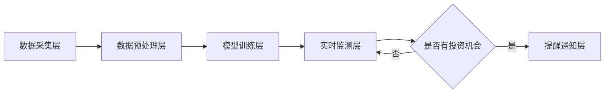

# AI驱动的自动化投资机会提醒

> 关键词：AI、自动化投资、机会提醒、机器学习、金融市场

> 摘要：本文聚焦于AI驱动的自动化投资机会提醒这一前沿领域。首先介绍了其背景，包括目的、预期读者、文档结构和相关术语。接着阐述了核心概念与联系，分析了核心算法原理并给出Python代码示例，探讨了相关数学模型和公式。通过项目实战展示了开发环境搭建、源代码实现及解读。列举了实际应用场景，推荐了学习资源、开发工具框架和相关论文著作。最后总结了未来发展趋势与挑战，并给出常见问题解答和扩展阅读参考资料，旨在帮助读者全面了解并应用AI在自动化投资机会提醒方面的技术。

## 1. 背景介绍 
### 1.1 目的和范围
在当今复杂多变的金融市场中，投资者面临着海量的数据和信息，如何及时、准确地捕捉到投资机会成为了关键问题。AI驱动的自动化投资机会提醒正是为了解决这一难题而出现的技术。其目的在于利用人工智能技术，对金融市场的数据进行实时分析和处理，自动识别出潜在的投资机会，并及时向投资者发出提醒。

本文的范围涵盖了AI驱动的自动化投资机会提醒的核心概念、算法原理、数学模型、实际应用案例以及相关的工具和资源推荐等方面，旨在为读者提供一个全面、深入的了解。

### 1.2 预期读者
本文预期读者包括金融投资者、金融分析师、量化投资从业者、人工智能研究者以及对金融科技感兴趣的技术爱好者等。这些读者希望通过了解AI在投资领域的应用，提升自己的投资决策能力或开展相关的研究和实践工作。

### 1.3 文档结构概述
本文将按照以下结构进行阐述：首先介绍核心概念与联系，帮助读者建立起对该领域的基本认知；接着详细讲解核心算法原理和具体操作步骤，并给出Python代码示例；然后探讨相关的数学模型和公式，并通过举例说明其应用；通过项目实战展示如何在实际中实现AI驱动的自动化投资机会提醒；列举实际应用场景；推荐学习资源、开发工具框架和相关论文著作；最后总结未来发展趋势与挑战，解答常见问题，并提供扩展阅读参考资料。

### 1.4 术语表
#### 1.4.1 核心术语定义
- **AI（Artificial Intelligence）**：人工智能，是一门研究如何使计算机能够模拟人类智能的学科，包括机器学习、深度学习、自然语言处理等技术。
- **自动化投资**：利用计算机程序和算法，自动进行投资决策和交易执行的过程。
- **投资机会提醒**：通过对金融市场数据的分析，识别出潜在的投资机会，并及时向投资者发出通知。
- **机器学习（Machine Learning）**：人工智能的一个分支，研究如何让计算机从数据中自动学习模式和规律，并进行预测和决策。
- **深度学习（Deep Learning）**：一种基于人工神经网络的机器学习方法，能够处理复杂的非线性数据。

#### 1.4.2 相关概念解释
- **金融市场数据**：包括股票价格、债券收益率、汇率、大宗商品价格等各种与金融市场相关的数据。
- **特征工程**：从原始数据中提取有用的特征，以便机器学习模型能够更好地学习和预测。
- **模型评估**：使用各种指标来评估机器学习模型的性能，如准确率、召回率、F1值等。
- **实时数据处理**：对金融市场的实时数据进行快速处理和分析，以便及时发现投资机会。

#### 1.4.3 缩略词列表
- **AI**：Artificial Intelligence
- **ML**：Machine Learning
- **DL**：Deep Learning
- **ROC**：Receiver Operating Characteristic
- **AUC**：Area Under the Curve

## 2. 核心概念与联系 
### 核心概念原理
AI驱动的自动化投资机会提醒主要基于机器学习和数据分析技术。其基本原理是通过收集和整理金融市场的历史数据和实时数据，利用机器学习算法对这些数据进行训练和建模，以识别出潜在的投资机会模式。当新的数据出现时，模型会对其进行预测和分析，如果符合预设的投资机会条件，系统就会自动向投资者发出提醒。

### 架构的文本示意图
一个典型的AI驱动的自动化投资机会提醒系统架构可以分为以下几个部分：
1. **数据采集层**：负责收集各种金融市场数据，包括历史数据和实时数据。数据源可以包括金融数据提供商、交易所、新闻媒体等。
2. **数据预处理层**：对采集到的数据进行清洗、转换和特征提取等操作，以提高数据的质量和可用性。
3. **模型训练层**：使用机器学习算法对预处理后的数据进行训练，建立投资机会预测模型。常见的算法包括决策树、支持向量机、神经网络等。
4. **实时监测层**：实时获取金融市场数据，并将其输入到训练好的模型中进行预测。
5. **提醒通知层**：当模型预测出投资机会时，系统会通过邮件、短信、APP等方式向投资者发出提醒。

### Mermaid流程图


## 3. 核心算法原理 & 具体操作步骤 
### 核心算法原理
在AI驱动的自动化投资机会提醒中，常用的机器学习算法包括逻辑回归、决策树、随机森林、支持向量机和神经网络等。这里以逻辑回归算法为例进行详细讲解。

逻辑回归是一种广泛应用于分类问题的机器学习算法，它通过对输入特征进行线性组合，并使用逻辑函数将其映射到[0, 1]区间，从而得到一个概率值。在投资机会提醒中，我们可以将投资机会分为“有”和“无”两类，逻辑回归模型可以根据输入的金融市场数据预测出出现投资机会的概率。

### Python源代码示例
```python
import pandas as pd
from sklearn.model_selection import train_test_split
from sklearn.linear_model import LogisticRegression
from sklearn.metrics import accuracy_score

# 读取数据
data = pd.read_csv('financial_data.csv')

# 分离特征和标签
X = data.drop('investment_opportunity', axis=1)
y = data['investment_opportunity']

# 划分训练集和测试集
X_train, X_test, y_train, y_test = train_test_split(X, y, test_size=0.2, random_state=42)

# 创建逻辑回归模型
model = LogisticRegression()

# 训练模型
model.fit(X_train, y_train)

# 预测测试集
y_pred = model.predict(X_test)

# 计算准确率
accuracy = accuracy_score(y_test, y_pred)
print(f"模型准确率: {accuracy}")
```
### 具体操作步骤
1. **数据准备**：收集和整理金融市场数据，并将其转换为适合机器学习模型处理的格式。
2. **特征工程**：从原始数据中提取有用的特征，如价格趋势、成交量、技术指标等。
3. **模型选择**：根据问题的特点和数据的类型，选择合适的机器学习算法。
4. **模型训练**：使用训练数据对模型进行训练，调整模型的参数以提高性能。
5. **模型评估**：使用测试数据对训练好的模型进行评估，计算各种性能指标，如准确率、召回率、F1值等。
6. **实时监测和提醒**：将训练好的模型部署到实时监测系统中，实时获取金融市场数据，并进行预测。当预测出投资机会时，及时向投资者发出提醒。

## 4. 数学模型和公式 & 详细讲解 & 举例说明 
### 逻辑回归数学模型
逻辑回归的数学模型可以表示为：
$$P(y=1|x)=\frac{1}{1 + e^{-(w_0 + w_1x_1 + w_2x_2 + \cdots + w_nx_n)}}$$
其中，$P(y=1|x)$ 表示在输入特征 $x=(x_1, x_2, \cdots, x_n)$ 的条件下，输出为 1（即有投资机会）的概率；$w_0, w_1, w_2, \cdots, w_n$ 是模型的参数；$e$ 是自然常数。

### 损失函数
逻辑回归通常使用对数损失函数（也称为交叉熵损失函数）来衡量模型的预测误差。对数损失函数的公式为：
$$L(w)=-\frac{1}{m}\sum_{i=1}^{m}[y^{(i)}\log(P(y^{(i)}=1|x^{(i)})) + (1 - y^{(i)})\log(1 - P(y^{(i)}=1|x^{(i)}))]$$
其中，$m$ 是训练样本的数量；$y^{(i)}$ 是第 $i$ 个样本的真实标签；$P(y^{(i)}=1|x^{(i)})$ 是模型对第 $i$ 个样本的预测概率。

### 模型训练
在训练逻辑回归模型时，我们的目标是找到一组参数 $w$，使得损失函数 $L(w)$ 最小化。通常使用梯度下降算法来求解这个优化问题。梯度下降算法的更新公式为：
$$w_j := w_j - \alpha\frac{\partial L(w)}{\partial w_j}$$
其中，$\alpha$ 是学习率，控制每次更新的步长；$\frac{\partial L(w)}{\partial w_j}$ 是损失函数 $L(w)$ 对参数 $w_j$ 的偏导数。

### 举例说明
假设我们有一个简单的投资机会预测问题，输入特征为股票的收盘价和成交量，输出为是否有投资机会（0 表示无，1 表示有）。我们可以使用上述的逻辑回归模型进行预测。

首先，我们需要收集历史数据，并进行特征工程和数据预处理。然后，使用训练数据对模型进行训练，调整模型的参数。最后，使用测试数据对模型进行评估。

假设我们训练好的模型参数为 $w_0 = -0.5$，$w_1 = 0.2$，$w_2 = 0.3$，输入特征 $x=(100, 1000)$，则预测概率为：
$$P(y=1|x)=\frac{1}{1 + e^{-(-0.5 + 0.2\times100 + 0.3\times1000)}}$$
通过计算得到预测概率后，我们可以根据预设的阈值（如 0.5）来判断是否有投资机会。如果预测概率大于阈值，则认为有投资机会，否则认为无投资机会。

## 5. 项目实战：代码实际案例和详细解释说明 
### 5.1  开发环境搭建
#### 操作系统
建议使用 Linux 或 macOS 操作系统，因为它们对 Python 开发环境的支持更好。如果使用 Windows 操作系统，也可以通过安装 Anaconda 来搭建开发环境。

#### Python 环境
安装 Python 3.7 或以上版本。可以从 Python 官方网站（https://www.python.org/downloads/）下载安装包进行安装。

#### 依赖库安装
使用以下命令安装所需的依赖库：
```bash
pip install pandas numpy scikit-learn matplotlib
```

### 5.2  源代码详细实现和代码解读
```python
import pandas as pd
import numpy as np
from sklearn.model_selection import train_test_split
from sklearn.linear_model import LogisticRegression
from sklearn.metrics import accuracy_score, confusion_matrix
import matplotlib.pyplot as plt

# 读取数据
data = pd.read_csv('financial_data.csv')

# 分离特征和标签
X = data.drop('investment_opportunity', axis=1)
y = data['investment_opportunity']

# 划分训练集和测试集
X_train, X_test, y_train, y_test = train_test_split(X, y, test_size=0.2, random_state=42)

# 创建逻辑回归模型
model = LogisticRegression()

# 训练模型
model.fit(X_train, y_train)

# 预测测试集
y_pred = model.predict(X_test)

# 计算准确率
accuracy = accuracy_score(y_test, y_pred)
print(f"模型准确率: {accuracy}")

# 计算混淆矩阵
conf_matrix = confusion_matrix(y_test, y_pred)
print(f"混淆矩阵:\n{conf_matrix}")

# 可视化混淆矩阵
plt.imshow(conf_matrix, interpolation='nearest', cmap=plt.cm.Blues)
plt.title('Confusion matrix')
plt.colorbar()
tick_marks = np.arange(2)
plt.xticks(tick_marks, ['No Opportunity', 'Opportunity'])
plt.yticks(tick_marks, ['No Opportunity', 'Opportunity'])

thresh = conf_matrix.max() / 2.
for i in range(conf_matrix.shape[0]):
    for j in range(conf_matrix.shape[1]):
        plt.text(j, i, format(conf_matrix[i, j], 'd'),
                 horizontalalignment="center",
                 color="white" if conf_matrix[i, j] > thresh else "black")

plt.tight_layout()
plt.ylabel('True label')
plt.xlabel('Predicted label')
plt.show()
```
### 代码解读与分析
1. **数据读取**：使用 `pandas` 库的 `read_csv` 函数读取金融市场数据。
2. **特征和标签分离**：将数据集中的特征和标签分离，分别存储在 `X` 和 `y` 中。
3. **训练集和测试集划分**：使用 `sklearn` 库的 `train_test_split` 函数将数据集划分为训练集和测试集，测试集占比为 20%。
4. **模型创建和训练**：创建逻辑回归模型，并使用训练集对模型进行训练。
5. **模型预测**：使用训练好的模型对测试集进行预测，得到预测结果 `y_pred`。
6. **模型评估**：计算模型的准确率和混淆矩阵，并进行可视化展示。准确率可以反映模型的整体预测性能，混淆矩阵可以更详细地展示模型在不同类别上的预测情况。

## 6. 实际应用场景 
### 股票投资
在股票市场中，AI驱动的自动化投资机会提醒可以帮助投资者及时发现潜在的买入或卖出机会。例如，通过分析股票的价格走势、成交量、财务指标等数据，模型可以预测股票的未来涨跌趋势，当出现符合预设条件的投资机会时，系统会及时向投资者发出提醒。

### 基金投资
对于基金投资者来说，自动化投资机会提醒可以根据基金的历史业绩、持仓情况、市场环境等因素，评估基金的投资价值，并在合适的时机提醒投资者进行买入或卖出操作。

### 债券投资
在债券市场中，AI可以分析债券的收益率、信用评级、宏观经济数据等信息，识别出具有投资价值的债券品种，并及时向投资者发出提醒。

### 外汇投资
外汇市场波动频繁，AI驱动的自动化投资机会提醒可以实时监测汇率变化、经济数据发布等因素，帮助投资者把握外汇交易机会。

## 7. 工具和资源推荐
### 7.1 学习资源推荐
#### 7.1.1 书籍推荐
- 《机器学习》（周志华）：全面介绍了机器学习的基本概念、算法和应用，是机器学习领域的经典教材。
- 《深度学习》（Ian Goodfellow、Yoshua Bengio、Aaron Courville）：深度学习领域的权威著作，深入讲解了深度学习的原理和技术。
- 《Python 数据分析实战》（Sebastian Raschka）：介绍了如何使用 Python 进行数据分析和机器学习，包含大量的实际案例。

#### 7.1.2 在线课程
- Coursera 上的“机器学习”课程（Andrew Ng 教授授课）：经典的机器学习入门课程，涵盖了机器学习的基本概念、算法和应用。
- edX 上的“深度学习微硕士项目”：提供了深度学习领域的系统学习课程，包括卷积神经网络、循环神经网络等。
- 中国大学 MOOC 上的“人工智能基础”课程：适合初学者了解人工智能的基本概念和技术。

#### 7.1.3 技术博客和网站
- Towards Data Science：一个专注于数据科学和机器学习的技术博客，发布了大量的高质量文章和教程。
- Kaggle：一个数据科学竞赛平台，提供了丰富的数据集和代码示例，同时也有很多数据科学家分享他们的经验和技巧。
- 机器之心：专注于人工智能领域的科技媒体，报道了人工智能的最新研究成果和应用案例。

### 7.2 开发工具框架推荐
#### 7.2.1 IDE和编辑器
- PyCharm：一款专业的 Python 集成开发环境，提供了丰富的代码编辑、调试、测试等功能。
- Jupyter Notebook：一个交互式的开发环境，适合进行数据探索、模型实验和代码演示。
- Visual Studio Code：一款轻量级的代码编辑器，支持多种编程语言，并且有丰富的插件扩展。

#### 7.2.2 调试和性能分析工具
- PDB：Python 自带的调试工具，可以帮助开发者调试代码，定位问题。
- cProfile：Python 标准库中的性能分析工具，可以分析代码的运行时间和函数调用情况。
- TensorBoard：TensorFlow 提供的可视化工具，可以用于可视化模型的训练过程和性能指标。

#### 7.2.3 相关框架和库
- Scikit-learn：一个简单易用的机器学习库，提供了各种机器学习算法和工具，适合初学者快速上手。
- TensorFlow：Google 开发的深度学习框架，具有强大的计算能力和广泛的应用场景。
- PyTorch：Facebook 开发的深度学习框架，以其简洁易用的接口和动态图机制受到了很多研究者的喜爱。

### 7.3 相关论文著作推荐
#### 7.3.1 经典论文
- 《A Logical Calculus of the Ideas Immanent in Nervous Activity》（Warren S. McCulloch、Walter Pitts）：提出了人工神经网络的基本模型，开创了神经网络研究的先河。
- 《Learning Representations by Back-propagating Errors》（David E. Rumelhart、Geoffrey E. Hinton、Ronald J. Williams）：介绍了反向传播算法，是深度学习领域的重要里程碑。
- 《Gradient-Based Learning Applied to Document Recognition》（Yann LeCun、Léon Bottou、Yoshua Bengio、Patrick Haffner）：提出了卷积神经网络（CNN），并成功应用于手写数字识别。

#### 7.3.2 最新研究成果
- 关注顶级学术会议，如 NeurIPS（神经信息处理系统大会）、ICML（国际机器学习会议）、CVPR（计算机视觉与模式识别会议）等，这些会议上会发布人工智能领域的最新研究成果。
- 查阅知名学术期刊，如 Journal of Artificial Intelligence Research（JAIR）、Artificial Intelligence（AI）等，获取高质量的学术论文。

#### 7.3.3 应用案例分析
- 《智能金融：AI时代金融科技的应用与实践》：介绍了人工智能在金融领域的各种应用案例，包括自动化投资、风险管理、客户服务等。
- 《金融科技：框架与实践》：探讨了金融科技的发展趋势和应用场景，分析了人工智能、区块链等技术在金融领域的应用案例。

## 8. 总结：未来发展趋势与挑战
### 未来发展趋势
- **更强大的模型和算法**：随着人工智能技术的不断发展，未来将会出现更强大的机器学习和深度学习模型，能够处理更复杂的金融市场数据，提高投资机会预测的准确性。
- **多模态数据融合**：除了传统的金融市场数据，未来的自动化投资机会提醒系统将融合更多的多模态数据，如新闻资讯、社交媒体数据、图像数据等，以获取更全面的市场信息。
- **个性化服务**：根据投资者的风险偏好、投资目标和历史交易记录等信息，为投资者提供个性化的投资机会提醒服务，提高投资决策的针对性和有效性。
- **与区块链技术结合**：区块链技术的去中心化、不可篡改等特点可以为自动化投资机会提醒系统提供更安全、可信的数据来源，同时也可以实现智能合约的自动执行，提高投资交易的效率和透明度。

### 挑战
- **数据质量和隐私问题**：金融市场数据的质量和隐私是自动化投资机会提醒系统面临的重要挑战。数据的准确性、完整性和及时性直接影响模型的性能，而数据隐私问题则需要严格的法律法规和技术手段来保障。
- **模型解释性和可解释性**：深度学习模型通常是黑盒模型，其决策过程难以解释。在金融领域，模型的解释性和可解释性非常重要，投资者需要了解模型的决策依据，以便做出合理的投资决策。
- **市场不确定性和风险**：金融市场具有高度的不确定性和风险性，即使是最先进的模型也无法完全准确地预测市场走势。因此，如何在不确定性和风险的环境下，提高投资机会提醒的可靠性和有效性，是一个亟待解决的问题。
- **监管和合规问题**：随着人工智能在金融领域的广泛应用，监管机构对其监管和合规要求也越来越严格。如何确保自动化投资机会提醒系统符合相关的法律法规和监管要求，是企业和开发者需要面对的挑战。

## 9. 附录：常见问题与解答
### 1. AI驱动的自动化投资机会提醒系统的准确率有多高？
系统的准确率受到多种因素的影响，如数据质量、模型选择、特征工程等。一般来说，在经过充分的训练和优化后，系统的准确率可以达到一定的水平，但不能保证100%的准确性。投资者应该将其作为参考，结合自己的投资经验和判断做出决策。

### 2. 如何确保系统使用的数据的安全性和隐私性？
可以采用多种技术手段来确保数据的安全性和隐私性，如数据加密、访问控制、匿名化处理等。同时，企业和开发者也应该遵守相关的法律法规和行业标准，保护用户的数据安全和隐私。

### 3. 系统是否可以适应不同的金融市场和投资品种？
可以通过调整模型的参数和特征工程的方法，使系统适应不同的金融市场和投资品种。但不同的市场和品种具有不同的特点和规律，需要对模型进行针对性的优化和训练。

### 4. 系统发出的投资机会提醒是否一定可靠？
系统发出的投资机会提醒只是基于历史数据和模型预测的结果，不能保证一定可靠。金融市场具有不确定性和风险性，投资者应该对提醒进行进一步的分析和判断，结合自己的投资目标和风险承受能力做出决策。

## 10. 扩展阅读 & 参考资料
### 扩展阅读
- 《智能时代》（吴军）：介绍了人工智能技术的发展历程和应用场景，探讨了人工智能对社会和经济的影响。
- 《创新者的窘境》（克莱顿·克里斯坦森）：分析了企业在面对技术创新时的困境和挑战，提供了应对创新的策略和方法。
- 《金融科技：从基础到实务》：全面介绍了金融科技的概念、技术和应用，包括人工智能、区块链、大数据等在金融领域的应用。

### 参考资料
- 相关的学术论文和研究报告，如 IEEE Transactions on Neural Networks and Learning Systems、ACM Transactions on Intelligent Systems and Technology 等期刊上的论文。
- 金融数据提供商的官方网站，如 Bloomberg、Reuters 等，获取最新的金融市场数据和资讯。
- 相关的开源项目和代码库，如 GitHub 上的机器学习和深度学习项目，参考他人的代码实现和经验。

作者：AI天才研究院/AI Genius Institute & 禅与计算机程序设计艺术 /Zen And The Art of Computer Programming