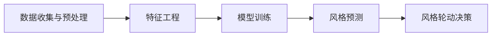

# AI驱动的自适应投资风格轮动

> 关键词：AI、自适应投资、风格轮动、量化投资、机器学习、投资策略

> 摘要：本文聚焦于AI驱动的自适应投资风格轮动这一前沿投资策略。通过深入剖析核心概念、算法原理、数学模型等方面，详细阐述了如何运用AI技术实现投资风格的自适应轮动。结合实际案例，展示了该策略在不同市场环境下的应用效果。同时，提供了丰富的学习资源、开发工具和相关论文推荐，最后对该领域的未来发展趋势与挑战进行了总结，并解答了常见问题。旨在为投资者和相关从业者提供全面且深入的技术指导和实践参考。

## 1. 背景介绍 
### 1.1 目的和范围
随着金融市场的日益复杂和多变，传统的投资策略往往难以适应市场的快速变化。AI驱动的自适应投资风格轮动策略旨在利用人工智能技术，根据市场环境的动态变化，自动调整投资风格，以实现更优的投资回报。本文将涵盖该策略的核心概念、算法原理、数学模型、实际应用案例等方面，全面介绍其理论和实践内容。

### 1.2 预期读者
本文预期读者包括金融投资者、量化投资从业者、人工智能领域的研究人员以及对金融科技感兴趣的学生和爱好者。对于希望了解如何运用AI技术优化投资策略的读者，本文将提供有价值的信息和指导。

### 1.3 文档结构概述
本文将按照以下结构展开：首先介绍核心概念与联系，包括相关的基本概念和它们之间的关系；接着阐述核心算法原理和具体操作步骤，并使用Python代码进行详细说明；然后介绍数学模型和公式，并通过具体例子进行讲解；之后给出项目实战案例，包括开发环境搭建、源代码实现和代码解读；再探讨实际应用场景；接着推荐相关的工具和资源；最后总结未来发展趋势与挑战，解答常见问题，并提供扩展阅读和参考资料。

### 1.4 术语表
#### 1.4.1 核心术语定义
- **AI（人工智能）**：是指计算机系统能够执行通常需要人类智能才能完成的任务，如学习、推理、决策等。
- **自适应投资**：投资策略能够根据市场环境的变化自动调整投资组合，以适应不同的市场条件。
- **风格轮动**：在不同的市场阶段，不同的投资风格（如价值投资、成长投资等）表现不同，通过在不同风格之间切换以获取更好的收益。
- **量化投资**：利用数学模型和计算机技术进行投资决策的方法。

#### 1.4.2 相关概念解释
- **机器学习**：是AI的一个重要分支，通过让计算机从数据中学习模式和规律，从而进行预测和决策。在投资风格轮动中，机器学习可以用于分析市场数据，预测不同投资风格的表现。
- **投资风格**：常见的投资风格包括价值投资、成长投资、动量投资等。价值投资关注股票的内在价值，成长投资注重公司的成长潜力，动量投资则基于股票的过去表现进行投资。

#### 1.4.3 缩略词列表
- **AI**：Artificial Intelligence
- **ML**：Machine Learning
- **LSTM**：Long Short-Term Memory
- **CNN**：Convolutional Neural Network

## 2. 核心概念与联系 

### 核心概念原理
AI驱动的自适应投资风格轮动策略的核心原理是利用人工智能技术对市场数据进行分析和预测，根据预测结果自动调整投资风格。具体来说，该策略包括以下几个关键步骤：
1. **数据收集与预处理**：收集各种市场数据，如股票价格、财务报表、宏观经济数据等，并对数据进行清洗、归一化等预处理操作。
2. **特征工程**：从预处理后的数据中提取有价值的特征，如技术指标、基本面指标等，用于后续的模型训练。
3. **模型训练**：使用机器学习或深度学习模型对历史数据进行训练，学习不同市场环境下不同投资风格的表现规律。
4. **风格预测**：利用训练好的模型对当前市场环境进行分析，预测不同投资风格的未来表现。
5. **风格轮动决策**：根据风格预测结果，调整投资组合的风格配置，实现投资风格的轮动。

### 架构的文本示意图
```plaintext
|-------------------|
|  数据收集与预处理  |
|-------------------|
        |
        v
|-------------------|
|    特征工程       |
|-------------------|
        |
        v
|-------------------|
|    模型训练       |
|-------------------|
        |
        v
|-------------------|
|    风格预测       |
|-------------------|
        |
        v
|-------------------|
|  风格轮动决策     |
|-------------------|
```

### Mermaid流程图


## 3. 核心算法原理 & 具体操作步骤 

### 核心算法原理
在AI驱动的自适应投资风格轮动中，常用的算法包括机器学习算法（如决策树、随机森林、支持向量机等）和深度学习算法（如神经网络、LSTM、CNN等）。这里以神经网络为例，介绍其核心算法原理。

神经网络是一种模仿人类神经系统的计算模型，由多个神经元组成。每个神经元接收输入信号，经过加权求和和激活函数处理后，输出一个结果。神经网络通过多层神经元的组合，可以学习到数据中的复杂模式和规律。

在投资风格轮动中，神经网络的输入是市场数据的特征，输出是不同投资风格的预测得分。通过对历史数据的训练，神经网络可以学习到不同市场环境下不同投资风格的表现规律，从而进行风格预测。

### 具体操作步骤及Python代码实现
以下是一个使用Python和Keras库实现简单神经网络进行投资风格预测的示例代码：

```python
import numpy as np
import pandas as pd
from sklearn.model_selection import train_test_split
from sklearn.preprocessing import StandardScaler
from keras.models import Sequential
from keras.layers import Dense

# 步骤1：数据收集与预处理
# 假设我们已经有一个包含市场数据和投资风格标签的数据集
data = pd.read_csv('investment_data.csv')
X = data.drop('style_label', axis=1)  # 特征数据
y = data['style_label']  # 投资风格标签

# 数据标准化
scaler = StandardScaler()
X = scaler.fit_transform(X)

# 步骤2：划分训练集和测试集
X_train, X_test, y_train, y_test = train_test_split(X, y, test_size=0.2, random_state=42)

# 步骤3：构建神经网络模型
model = Sequential()
model.add(Dense(64, input_dim=X_train.shape[1], activation='relu'))
model.add(Dense(32, activation='relu'))
model.add(Dense(1, activation='sigmoid'))

# 步骤4：编译模型
model.compile(loss='binary_crossentropy', optimizer='adam', metrics=['accuracy'])

# 步骤5：训练模型
model.fit(X_train, y_train, epochs=100, batch_size=32, validation_data=(X_test, y_test))

# 步骤6：风格预测
predictions = model.predict(X_test)
predictions = (predictions > 0.5).astype(int)
```

### 代码解释
1. **数据收集与预处理**：使用`pandas`库读取数据集，并将特征数据和标签数据分离。使用`StandardScaler`对特征数据进行标准化处理，以提高模型的训练效果。
2. **划分训练集和测试集**：使用`train_test_split`函数将数据集划分为训练集和测试集，比例为8:2。
3. **构建神经网络模型**：使用`Sequential`模型构建一个简单的神经网络，包含一个输入层、两个隐藏层和一个输出层。
4. **编译模型**：使用`binary_crossentropy`作为损失函数，`adam`作为优化器，并使用`accuracy`作为评估指标。
5. **训练模型**：使用`fit`方法对模型进行训练，设置训练轮数为100，批量大小为32。
6. **风格预测**：使用训练好的模型对测试集进行预测，并将预测结果转换为二进制标签。

## 4. 数学模型和公式 & 详细讲解 & 举例说明 

### 神经网络的数学模型
神经网络的基本单元是神经元，其数学模型可以表示为：

$$
z = \sum_{i=1}^{n} w_i x_i + b
$$

其中，$x_i$ 是输入信号，$w_i$ 是对应的权重，$b$ 是偏置，$z$ 是加权求和的结果。

神经元的输出是通过激活函数对 $z$ 进行处理得到的，常用的激活函数包括 sigmoid 函数、ReLU 函数等。

#### sigmoid 函数
$$
\sigma(z) = \frac{1}{1 + e^{-z}}
$$

#### ReLU 函数
$$
f(z) = \max(0, z)
$$

### 神经网络的训练过程
神经网络的训练过程是通过优化损失函数来调整权重和偏置的过程。常用的损失函数包括均方误差（MSE）、交叉熵损失等。

对于二分类问题，常用的交叉熵损失函数可以表示为：

$$
L(y, \hat{y}) = - \frac{1}{N} \sum_{i=1}^{N} [y_i \log(\hat{y}_i) + (1 - y_i) \log(1 - \hat{y}_i)]
$$

其中，$y_i$ 是真实标签，$\hat{y}_i$ 是预测标签，$N$ 是样本数量。

### 举例说明
假设我们有一个简单的神经网络，包含一个输入层（2个神经元）、一个隐藏层（3个神经元）和一个输出层（1个神经元）。输入信号为 $x_1 = 0.5$ 和 $x_2 = 0.3$，隐藏层的权重矩阵为：

$$
W_1 = \begin{bmatrix}
0.2 & 0.4 \\
0.1 & 0.3 \\
0.3 & 0.2
\end{bmatrix}
$$

隐藏层的偏置向量为 $b_1 = [0.1, 0.2, 0.3]$。

首先，计算隐藏层的输入：

$$
z_1 = W_1 \begin{bmatrix}
x_1 \\
x_2
\end{bmatrix} + b_1 = \begin{bmatrix}
0.2 & 0.4 \\
0.1 & 0.3 \\
0.3 & 0.2
\end{bmatrix} \begin{bmatrix}
0.5 \\
0.3
\end{bmatrix} + \begin{bmatrix}
0.1 \\
0.2 \\
0.3
\end{bmatrix} = \begin{bmatrix}
0.2 \times 0.5 + 0.4 \times 0.3 + 0.1 \\
0.1 \times 0.5 + 0.3 \times 0.3 + 0.2 \\
0.3 \times 0.5 + 0.2 \times 0.3 + 0.3
\end{bmatrix} = \begin{bmatrix}
0.32 \\
0.34 \\
0.41
\end{bmatrix}
$$

假设使用 ReLU 激活函数，隐藏层的输出为：

$$
a_1 = \max(0, z_1) = \begin{bmatrix}
0.32 \\
0.34 \\
0.41
\end{bmatrix}
$$

输出层的权重矩阵为 $W_2 = [0.2, 0.3, 0.4]$，偏置为 $b_2 = 0.1$。

计算输出层的输入：

$$
z_2 = W_2 a_1 + b_2 = [0.2, 0.3, 0.4] \begin{bmatrix}
0.32 \\
0.34 \\
0.41
\end{bmatrix} + 0.1 = 0.2 \times 0.32 + 0.3 \times 0.34 + 0.4 \times 0.41 + 0.1 = 0.33
$$

假设使用 sigmoid 激活函数，输出层的输出为：

$$
\hat{y} = \sigma(z_2) = \frac{1}{1 + e^{-0.33}} \approx 0.58
$$

## 5. 项目实战：代码实际案例和详细解释说明 

### 5.1  开发环境搭建
在进行项目实战之前，需要搭建相应的开发环境。以下是具体的步骤：

#### 安装Python
建议使用Python 3.7及以上版本，可以从Python官方网站（https://www.python.org/downloads/）下载并安装。

#### 安装必要的库
使用`pip`命令安装以下必要的库：
```sh
pip install pandas numpy scikit-learn keras tensorflow
```

### 5.2  源代码详细实现和代码解读
以下是一个完整的项目实战代码示例，用于实现AI驱动的自适应投资风格轮动：

```python
import pandas as pd
import numpy as np
from sklearn.model_selection import train_test_split
from sklearn.preprocessing import StandardScaler
from keras.models import Sequential
from keras.layers import Dense
import matplotlib.pyplot as plt

# 步骤1：数据收集与预处理
# 假设我们已经有一个包含市场数据和投资风格标签的数据集
data = pd.read_csv('investment_data.csv')
X = data.drop('style_label', axis=1)  # 特征数据
y = data['style_label']  # 投资风格标签

# 数据标准化
scaler = StandardScaler()
X = scaler.fit_transform(X)

# 步骤2：划分训练集和测试集
X_train, X_test, y_train, y_test = train_test_split(X, y, test_size=0.2, random_state=42)

# 步骤3：构建神经网络模型
model = Sequential()
model.add(Dense(64, input_dim=X_train.shape[1], activation='relu'))
model.add(Dense(32, activation='relu'))
model.add(Dense(1, activation='sigmoid'))

# 步骤4：编译模型
model.compile(loss='binary_crossentropy', optimizer='adam', metrics=['accuracy'])

# 步骤5：训练模型
history = model.fit(X_train, y_train, epochs=100, batch_size=32, validation_data=(X_test, y_test))

# 步骤6：评估模型
test_loss, test_acc = model.evaluate(X_test, y_test)
print(f'Test accuracy: {test_acc}')

# 步骤7：绘制训练过程曲线
plt.plot(history.history['accuracy'])
plt.plot(history.history['val_accuracy'])
plt.title('Model accuracy')
plt.ylabel('Accuracy')
plt.xlabel('Epoch')
plt.legend(['Train', 'Test'], loc='upper left')
plt.show()

plt.plot(history.history['loss'])
plt.plot(history.history['val_loss'])
plt.title('Model loss')
plt.ylabel('Loss')
plt.xlabel('Epoch')
plt.legend(['Train', 'Test'], loc='upper left')
plt.show()
```

### 5.3  代码解读与分析
1. **数据收集与预处理**：使用`pandas`库读取数据集，并将特征数据和标签数据分离。使用`StandardScaler`对特征数据进行标准化处理，以提高模型的训练效果。
2. **划分训练集和测试集**：使用`train_test_split`函数将数据集划分为训练集和测试集，比例为8:2。
3. **构建神经网络模型**：使用`Sequential`模型构建一个简单的神经网络，包含一个输入层、两个隐藏层和一个输出层。
4. **编译模型**：使用`binary_crossentropy`作为损失函数，`adam`作为优化器，并使用`accuracy`作为评估指标。
5. **训练模型**：使用`fit`方法对模型进行训练，设置训练轮数为100，批量大小为32。同时，记录训练过程中的损失和准确率，以便后续分析。
6. **评估模型**：使用`evaluate`方法对模型在测试集上的性能进行评估，输出测试集的准确率。
7. **绘制训练过程曲线**：使用`matplotlib`库绘制训练过程中的准确率和损失曲线，帮助我们直观地观察模型的训练情况。

通过分析训练过程曲线，我们可以判断模型是否过拟合或欠拟合。如果训练集的准确率远高于测试集的准确率，且训练集的损失不断下降，而测试集的损失开始上升，则说明模型可能过拟合。此时，可以考虑增加正则化项、减少模型复杂度等方法来解决过拟合问题。

## 6. 实际应用场景 
### 个人投资
对于个人投资者来说，AI驱动的自适应投资风格轮动策略可以帮助他们根据市场环境的变化自动调整投资组合，降低投资风险，提高投资回报。例如，在市场处于上升趋势时，策略可以自动增加成长型股票的配置；在市场处于下跌趋势时，策略可以增加价值型股票或防御性资产的配置。

### 机构投资
对于机构投资者（如基金公司、保险公司等），该策略可以用于构建投资组合，优化资产配置。通过利用AI技术对市场数据进行实时分析和预测，机构投资者可以更快速、准确地调整投资风格，提高投资组合的绩效。

### 量化投资基金
量化投资基金通常使用数学模型和计算机技术进行投资决策。AI驱动的自适应投资风格轮动策略可以为量化投资基金提供更先进的投资方法，增强基金的竞争力。基金经理可以根据策略的预测结果，动态调整基金的投资风格，以适应不同的市场环境。

## 7. 工具和资源推荐
### 7.1 学习资源推荐
#### 7.1.1 书籍推荐
- 《机器学习》（周志华著）：介绍了机器学习的基本概念、算法和应用，是机器学习领域的经典教材。
- 《深度学习》（Ian Goodfellow、Yoshua Bengio和Aaron Courville著）：全面介绍了深度学习的理论和实践，适合深入学习深度学习的读者。
- 《量化投资：策略与技术》（丁鹏著）：介绍了量化投资的基本概念、策略和技术，对量化投资感兴趣的读者可以参考。

#### 7.1.2 在线课程
- Coursera上的“机器学习”课程（Andrew Ng教授授课）：是机器学习领域最受欢迎的在线课程之一，课程内容丰富，讲解清晰。
- edX上的“深度学习”课程（由MIT、Berkeley等知名高校的教授授课）：提供了深度学习的深入学习资源。
- 中国大学MOOC上的“量化投资与金融科技”课程：介绍了量化投资的基本理论和实践，适合初学者。

#### 7.1.3 技术博客和网站
- Medium：是一个技术博客平台，上面有很多关于AI、机器学习和量化投资的优质文章。
- Towards Data Science：专注于数据科学和机器学习领域的技术博客，提供了很多实用的教程和案例。
- 量化投资界：是一个专注于量化投资领域的网站，提供了量化投资的最新资讯、策略和技术分享。

### 7.2 开发工具框架推荐
#### 7.2.1 IDE和编辑器
- PyCharm：是一款专业的Python集成开发环境，提供了丰富的代码编辑、调试和项目管理功能。
- Jupyter Notebook：是一个交互式的开发环境，适合进行数据分析和模型训练的实验。
- Visual Studio Code：是一款轻量级的代码编辑器，支持多种编程语言，具有丰富的插件生态系统。

#### 7.2.2 调试和性能分析工具
- TensorBoard：是TensorFlow提供的可视化工具，可以帮助我们可视化模型的训练过程、损失曲线、准确率等信息。
- Py-Spy：是一个Python性能分析工具，可以帮助我们找出Python代码中的性能瓶颈。

#### 7.2.3 相关框架和库
- TensorFlow：是一个开源的深度学习框架，提供了丰富的深度学习模型和工具。
- PyTorch：是另一个流行的深度学习框架，具有动态图的优势，适合快速迭代和实验。
- scikit-learn：是一个常用的机器学习库，提供了各种机器学习算法和工具，如分类、回归、聚类等。

### 7.3 相关论文著作推荐
#### 7.3.1 经典论文
- “A Machine Learning Approach to Tactical Asset Allocation”（由Rapach等人发表）：介绍了如何使用机器学习方法进行战术资产配置。
- “Deep Learning for Asset Pricing”（由Gu等人发表）：探讨了深度学习在资产定价中的应用。

#### 7.3.2 最新研究成果
可以关注顶级金融和机器学习会议（如NIPS、ICML、AFA等）上的最新研究成果，了解该领域的前沿动态。

#### 7.3.3 应用案例分析
可以参考一些量化投资基金的研究报告和案例分析，了解AI驱动的自适应投资风格轮动策略在实际应用中的效果和经验。

## 8. 总结：未来发展趋势与挑战
### 未来发展趋势
- **更复杂的模型应用**：随着AI技术的不断发展，未来可能会应用更复杂的深度学习模型（如Transformer、GAN等）来进行投资风格轮动，以提高预测的准确性和性能。
- **多模态数据融合**：除了传统的市场数据和财务数据，未来可能会融合更多的多模态数据（如新闻文本、社交媒体数据、卫星图像等），以获取更全面的市场信息。
- **与其他技术的结合**：AI驱动的自适应投资风格轮动策略可能会与区块链、物联网等技术相结合，创造出更创新的投资模式和产品。

### 挑战
- **数据质量和隐私问题**：数据是AI模型训练的基础，数据质量的好坏直接影响模型的性能。同时，在收集和使用数据时，需要注意数据隐私和安全问题。
- **模型可解释性**：深度学习模型通常是黑盒模型，其决策过程难以解释。在金融领域，模型的可解释性非常重要，因为投资者需要了解模型的决策依据。
- **市场不确定性**：金融市场具有高度的不确定性，即使使用最先进的AI技术，也难以完全准确地预测市场走势。因此，需要不断优化模型和策略，以适应市场的变化。

## 9. 附录：常见问题与解答
### 问题1：AI驱动的自适应投资风格轮动策略一定能获得更高的投资回报吗？
解答：不一定。虽然该策略利用AI技术对市场数据进行分析和预测，但金融市场具有高度的不确定性，模型的预测结果可能存在误差。因此，该策略并不能保证一定能获得更高的投资回报，还需要结合市场情况和风险管理进行综合考虑。

### 问题2：如何选择合适的AI模型进行投资风格轮动？
解答：选择合适的AI模型需要考虑多个因素，如数据特点、问题复杂度、模型性能等。对于简单的问题，可以选择传统的机器学习模型（如决策树、随机森林等）；对于复杂的问题，可以考虑使用深度学习模型（如神经网络、LSTM等）。同时，需要通过实验和评估来选择性能最优的模型。

### 问题3：该策略对数据的要求高吗？
解答：该策略对数据的要求较高。一方面，需要收集大量的市场数据和相关信息，以保证模型有足够的训练数据；另一方面，数据的质量也非常重要，需要对数据进行清洗、预处理和特征工程等操作，以提高数据的可用性和模型的性能。

## 10. 扩展阅读 & 参考资料
### 扩展阅读
- 《智能金融：科技驱动金融创新与变革》
- 《金融科技前沿：理论与实务》

### 参考资料
- 相关的学术论文和研究报告
- 金融市场的历史数据和统计资料
- 各金融机构和研究机构发布的投资策略和分析报告

作者：AI天才研究院/AI Genius Institute & 禅与计算机程序设计艺术 /Zen And The Art of Computer Programming