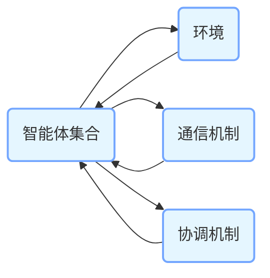
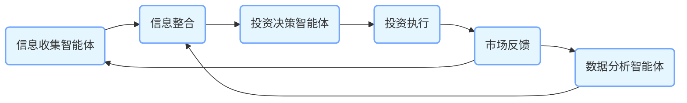

# AI驱动的行业分析：多智能体系统在价值投资中的应用

> 关键词：AI、多智能体系统、价值投资、行业分析、金融科技

> 摘要：本文聚焦于AI驱动下多智能体系统在价值投资领域的应用。首先介绍了研究的背景、目的和范围，明确预期读者与文档结构。详细阐述了多智能体系统和价值投资的核心概念及其联系，给出了相关原理和架构的示意图与流程图。深入讲解了多智能体系统在价值投资中应用的核心算法原理，结合Python代码进行具体操作步骤的说明。运用数学模型和公式对其进行分析并举例。通过项目实战展示了开发环境搭建、源代码实现与解读。探讨了该应用的实际场景，推荐了学习资源、开发工具框架以及相关论文著作。最后总结了未来发展趋势与挑战，解答常见问题并提供扩展阅读和参考资料，旨在为价值投资领域引入新的技术思路和方法。

## 1. 背景介绍 
### 1.1 目的和范围
在当今复杂多变的金融市场中，价值投资作为一种长期且稳健的投资策略，受到众多投资者的青睐。然而，传统的价值投资分析方法往往依赖于人工经验和有限的数据处理能力，难以应对海量、复杂且动态变化的市场信息。随着人工智能技术的飞速发展，多智能体系统作为一种强大的计算模型，为价值投资提供了新的解决方案。

本文的目的在于深入探讨AI驱动的多智能体系统在价值投资中的应用，包括其核心概念、算法原理、数学模型以及实际应用场景等方面。范围涵盖了从理论基础到实际项目开发的全过程，旨在为投资者、金融分析师和相关技术人员提供全面的技术参考和实践指导。

### 1.2 预期读者
本文预期读者主要包括以下几类人群：
- **投资者**：希望借助先进的AI技术提升价值投资决策的准确性和效率，获取更高的投资回报。
- **金融分析师**：需要深入了解多智能体系统在价值投资中的应用原理和方法，为客户提供更专业的投资建议。
- **技术人员**：对人工智能、多智能体系统和金融科技感兴趣，希望学习相关技术并应用于实际项目开发。
- **学术研究人员**：关注金融领域的前沿技术研究，希望通过本文了解多智能体系统在价值投资中的最新应用进展。

### 1.3 文档结构概述
本文将按照以下结构进行组织：
- **核心概念与联系**：介绍多智能体系统和价值投资的核心概念，分析它们之间的联系，并给出相关原理和架构的示意图与流程图。
- **核心算法原理 & 具体操作步骤**：详细讲解多智能体系统在价值投资中应用的核心算法原理，结合Python代码进行具体操作步骤的说明。
- **数学模型和公式 & 详细讲解 & 举例说明**：运用数学模型和公式对多智能体系统在价值投资中的应用进行分析，并通过具体例子进行说明。
- **项目实战：代码实际案例和详细解释说明**：通过一个实际项目案例，展示开发环境搭建、源代码实现与解读，帮助读者更好地理解和应用相关技术。
- **实际应用场景**：探讨多智能体系统在价值投资中的实际应用场景，为读者提供实际参考。
- **工具和资源推荐**：推荐学习资源、开发工具框架以及相关论文著作，帮助读者进一步深入学习和研究。
- **总结：未来发展趋势与挑战**：总结多智能体系统在价值投资中的应用现状，分析未来发展趋势与挑战。
- **附录：常见问题与解答**：解答读者在学习和应用过程中可能遇到的常见问题。
- **扩展阅读 & 参考资料**：提供相关的扩展阅读材料和参考资料，方便读者进一步深入学习。

### 1.4 术语表
#### 1.4.1 核心术语定义
- **多智能体系统（Multi - Agent System，MAS）**：由多个智能体组成的系统，每个智能体具有自主决策能力，能够感知环境并与其他智能体进行交互，以实现共同或各自的目标。
- **价值投资（Value Investing）**：一种投资策略，通过分析公司的内在价值，寻找被低估的股票进行投资，以期在长期获得超过市场平均水平的回报。
- **智能体（Agent）**：具有自主性、反应性、社会性和主动性的实体，能够在一定环境中感知信息，进行决策并采取行动。
- **环境（Environment）**：智能体所处的外部世界，包含各种信息和资源，智能体通过感知环境获取信息并与环境进行交互。
- **交互（Interaction）**：智能体之间或智能体与环境之间进行信息交换和协同工作的过程。

#### 1.4.2 相关概念解释
- **强化学习（Reinforcement Learning）**：一种机器学习方法，智能体通过与环境进行交互，根据环境反馈的奖励信号来学习最优的行为策略。
- **遗传算法（Genetic Algorithm）**：一种模拟自然选择和遗传机制的优化算法，通过对种群中的个体进行选择、交叉和变异操作，逐步搜索最优解。
- **神经网络（Neural Network）**：一种模仿人类神经系统的计算模型，由大量的神经元组成，能够自动学习数据中的模式和规律。

#### 1.4.3 缩略词列表
- **MAS**：Multi - Agent System（多智能体系统）
- **RL**：Reinforcement Learning（强化学习）
- **GA**：Genetic Algorithm（遗传算法）
- **NN**：Neural Network（神经网络）

## 2. 核心概念与联系 

### 2.1 多智能体系统的核心概念
多智能体系统是由多个智能体组成的分布式系统。每个智能体都具有一定的自主性和智能，能够独立地感知环境、做出决策并采取行动。智能体之间可以通过通信机制进行信息交换和协同工作，以实现系统的整体目标。

多智能体系统的架构通常包括以下几个部分：
- **智能体集合**：由多个智能体组成，每个智能体具有不同的功能和任务。
- **环境**：智能体所处的外部世界，包含各种信息和资源。
- **通信机制**：智能体之间进行信息交换的方式，如消息传递、共享内存等。
- **协调机制**：用于协调智能体之间的行为，避免冲突和实现协同工作。

以下是多智能体系统的架构示意图：



### 2.2 价值投资的核心概念
价值投资是一种基于公司内在价值的投资策略。其核心思想是通过对公司的财务状况、行业地位、竞争优势等因素进行深入分析，评估公司的内在价值，并寻找市场价格低于内在价值的股票进行投资。

价值投资的关键步骤包括：
- **基本面分析**：研究公司的财务报表、经营业绩、行业前景等基本面信息，评估公司的内在价值。
- **估值模型**：使用各种估值模型，如市盈率（P/E）、市净率（P/B）、现金流折现模型（DCF）等，对公司的股票进行估值。
- **投资决策**：根据估值结果和市场情况，做出投资决策，选择被低估的股票进行投资。

### 2.3 多智能体系统与价值投资的联系
多智能体系统可以为价值投资提供强大的支持。在价值投资中，需要处理大量的信息，包括公司的财务数据、行业动态、宏观经济信息等。多智能体系统可以通过多个智能体的协作，实现对这些信息的快速收集、分析和处理。

具体来说，多智能体系统在价值投资中的应用可以体现在以下几个方面：
- **信息收集**：不同的智能体可以负责收集不同来源的信息，如财经新闻、公司公告、行业报告等，提高信息收集的效率和全面性。
- **数据分析**：智能体可以使用各种数据分析方法，如机器学习、数据挖掘等，对收集到的信息进行分析，挖掘有价值的信息和规律。
- **投资决策**：智能体可以根据分析结果，结合预设的投资策略，做出投资决策，并进行实时调整。

以下是多智能体系统在价值投资中的应用流程图：



## 3. 核心算法原理 & 具体操作步骤 

### 3.1 核心算法原理
在多智能体系统应用于价值投资中，常用的算法包括强化学习、遗传算法和神经网络等。下面以强化学习为例，详细介绍其核心算法原理。

强化学习是一种通过智能体与环境进行交互来学习最优行为策略的机器学习方法。在价值投资中，智能体可以看作是投资者，环境是金融市场，智能体的目标是通过买卖股票获得最大的投资回报。

强化学习的基本要素包括：
- **状态（State）**：表示智能体所处的环境状态，如股票价格、市场指数、公司财务指标等。
- **动作（Action）**：智能体可以采取的行为，如买入、卖出、持有股票等。
- **奖励（Reward）**：环境根据智能体的动作给予的反馈信号，用于评估动作的好坏，如投资收益、风险指标等。
- **策略（Policy）**：智能体根据当前状态选择动作的规则。

强化学习的目标是通过不断地与环境进行交互，学习到一个最优策略，使得智能体在长期内获得最大的累积奖励。

### 3.2 具体操作步骤
下面是使用Python实现一个简单的强化学习智能体进行价值投资的具体操作步骤：

```python
import numpy as np
import random

# 定义环境类
class StockEnvironment:
    def __init__(self, stock_prices):
        self.stock_prices = stock_prices
        self.current_step = 0
        self.balance = 10000  # 初始资金
        self.shares = 0  # 初始持股数

    def reset(self):
        self.current_step = 0
        self.balance = 10000
        self.shares = 0
        return self.get_state()

    def get_state(self):
        return [self.stock_prices[self.current_step], self.balance, self.shares]

    def step(self, action):
        current_price = self.stock_prices[self.current_step]
        if action == 0:  # 买入
            if self.balance >= current_price:
                num_shares = self.balance // current_price
                self.shares += num_shares
                self.balance -= num_shares * current_price
        elif action == 1:  # 卖出
            if self.shares > 0:
                self.balance += self.shares * current_price
                self.shares = 0
        elif action == 2:  # 持有
            pass

        self.current_step += 1
        done = self.current_step == len(self.stock_prices) - 1
        reward = self.balance + self.shares * self.stock_prices[self.current_step] - 10000  # 计算奖励
        next_state = self.get_state()
        return next_state, reward, done

# 定义智能体类
class QLearningAgent:
    def __init__(self, state_size, action_size):
        self.state_size = state_size
        self.action_size = action_size
        self.q_table = np.zeros((state_size, action_size))
        self.learning_rate = 0.1
        self.discount_factor = 0.9
        self.epsilon = 0.1

    def get_action(self, state):
        if np.random.uniform(0, 1) < self.epsilon:
            return random.randint(0, self.action_size - 1)
        else:
            return np.argmax(self.q_table[state])

    def update_q_table(self, state, action, reward, next_state):
        q_value = self.q_table[state][action]
        max_q_next = np.max(self.q_table[next_state])
        new_q_value = q_value + self.learning_rate * (reward + self.discount_factor * max_q_next - q_value)
        self.q_table[state][action] = new_q_value

# 训练智能体
stock_prices = [100, 105, 110, 108, 112, 115, 113, 118, 120, 117]
env = StockEnvironment(stock_prices)
agent = QLearningAgent(len(stock_prices), 3)

num_episodes = 100
for episode in range(num_episodes):
    state = env.reset()
    done = False
    while not done:
        state_index = env.current_step
        action = agent.get_action(state_index)
        next_state, reward, done = env.step(action)
        next_state_index = env.current_step
        agent.update_q_table(state_index, action, reward, next_state_index)
        state = next_state

# 测试智能体
state = env.reset()
done = False
while not done:
    state_index = env.current_step
    action = agent.get_action(state_index)
    next_state, reward, done = env.step(action)
    state = next_state

print("最终资金:", env.balance + env.shares * env.stock_prices[-1])
```

### 3.3 代码解释
- **StockEnvironment类**：表示股票市场环境，负责管理股票价格、资金和持股数等信息，提供重置环境、获取当前状态和执行动作等方法。
- **QLearningAgent类**：实现了Q - learning算法，通过维护一个Q表来学习最优策略。包括获取动作和更新Q表的方法。
- **训练过程**：智能体通过与环境进行交互，不断更新Q表，学习最优策略。
- **测试过程**：使用训练好的策略进行投资操作，输出最终资金。

## 4. 数学模型和公式 & 详细讲解 & 举例说明 

### 4.1 强化学习的数学模型
在强化学习中，常用的数学模型是马尔可夫决策过程（Markov Decision Process，MDP）。MDP可以用一个五元组 $<S, A, P, R, \gamma>$ 来表示，其中：
- $S$ 是状态集合，表示智能体可能处于的所有状态。
- $A$ 是动作集合，表示智能体可以采取的所有动作。
- $P(s'|s, a)$ 是状态转移概率，表示在状态 $s$ 下采取动作 $a$ 后转移到状态 $s'$ 的概率。
- $R(s, a, s')$ 是奖励函数，表示在状态 $s$ 下采取动作 $a$ 转移到状态 $s'$ 时获得的奖励。
- $\gamma$ 是折扣因子，用于衡量未来奖励的重要性，取值范围为 $[0, 1]$。

### 4.2 Q - learning算法的数学公式
Q - learning算法是一种无模型的强化学习算法，通过迭代更新Q值来学习最优策略。Q值表示在状态 $s$ 下采取动作 $a$ 的期望累积奖励。

Q - learning算法的更新公式为：
$$Q(s, a) \leftarrow Q(s, a) + \alpha [R(s, a) + \gamma \max_{a'} Q(s', a') - Q(s, a)]$$
其中：
- $Q(s, a)$ 是当前状态 $s$ 下采取动作 $a$ 的Q值。
- $\alpha$ 是学习率，控制每次更新的步长。
- $R(s, a)$ 是在状态 $s$ 下采取动作 $a$ 获得的即时奖励。
- $\gamma$ 是折扣因子。
- $s'$ 是采取动作 $a$ 后转移到的下一个状态。
- $\max_{a'} Q(s', a')$ 是下一个状态 $s'$ 下所有动作的最大Q值。

### 4.3 举例说明
假设一个简单的股票投资场景，状态集合 $S = \{s_1, s_2, s_3\}$，动作集合 $A = \{买入, 卖出, 持有\}$。初始Q表如下：

| 状态 | 买入 | 卖出 | 持有 |
|------|------|------|------|
| $s_1$ | 0 | 0 | 0 |
| $s_2$ | 0 | 0 | 0 |
| $s_3$ | 0 | 0 | 0 |

当前处于状态 $s_1$，采取动作“买入”，获得即时奖励 $R(s_1, 买入) = 10$，转移到状态 $s_2$。假设学习率 $\alpha = 0.1$，折扣因子 $\gamma = 0.9$，下一个状态 $s_2$ 下所有动作的最大Q值 $\max_{a'} Q(s_2, a') = 20$。

根据Q - learning更新公式，更新 $Q(s_1, 买入)$ 的值：
$$Q(s_1, 买入) = 0 + 0.1 \times [10 + 0.9 \times 20 - 0] = 0 + 0.1 \times (10 + 18) = 2.8$$

更新后的Q表如下：

| 状态 | 买入 | 卖出 | 持有 |
|------|------|------|------|
| $s_1$ | 2.8 | 0 | 0 |
| $s_2$ | 0 | 0 | 0 |
| $s_3$ | 0 | 0 | 0 |

## 5. 项目实战：代码实际案例和详细解释说明 

### 5.1  开发环境搭建
在进行多智能体系统在价值投资中的项目开发时，需要搭建相应的开发环境。以下是具体的搭建步骤：

#### 5.1.1 安装Python
Python是一种广泛使用的编程语言，具有丰富的科学计算和机器学习库。可以从Python官方网站（https://www.python.org/downloads/）下载并安装Python 3.x版本。

#### 5.1.2 安装必要的库
在项目中，需要使用一些Python库来实现多智能体系统和价值投资的相关功能，如NumPy、Pandas、Matplotlib等。可以使用pip命令进行安装：
```sh
pip install numpy pandas matplotlib
```

#### 5.1.3 安装强化学习库
如果使用强化学习算法，还需要安装相应的强化学习库，如OpenAI Gym和Stable - Baselines3。可以使用pip命令进行安装：
```sh
pip install gym stable - baselines3
```

### 5.2  源代码详细实现和代码解读
下面是一个更复杂的多智能体系统在价值投资中的项目源代码示例，使用OpenAI Gym和Stable - Baselines3库：

```python
import gym
from gym import spaces
import numpy as np
import pandas as pd
from stable_baselines3 import A2C

# 定义股票交易环境
class StockTradingEnv(gym.Env):
    def __init__(self, stock_data):
        super(StockTradingEnv, self).__init__()
        self.stock_data = stock_data
        self.current_step = 0
        self.balance = 10000
        self.shares = 0
        self.action_space = spaces.Discrete(3)  # 买入、卖出、持有
        self.observation_space = spaces.Box(low=0, high=np.inf, shape=(3,))

    def reset(self):
        self.current_step = 0
        self.balance = 10000
        self.shares = 0
        return self._get_observation()

    def _get_observation(self):
        return np.array([self.stock_data[self.current_step], self.balance, self.shares])

    def step(self, action):
        current_price = self.stock_data[self.current_step]
        if action == 0:  # 买入
            if self.balance >= current_price:
                num_shares = self.balance // current_price
                self.shares += num_shares
                self.balance -= num_shares * current_price
        elif action == 1:  # 卖出
            if self.shares > 0:
                self.balance += self.shares * current_price
                self.shares = 0
        elif action == 2:  # 持有
            pass

        self.current_step += 1
        done = self.current_step == len(self.stock_data) - 1
        reward = self.balance + self.shares * self.stock_data[self.current_step] - 10000
        next_state = self._get_observation()
        return next_state, reward, done, {}

# 加载股票数据
stock_data = pd.read_csv('stock_prices.csv')['Close'].values

# 创建环境
env = StockTradingEnv(stock_data)

# 创建A2C模型
model = A2C('MlpPolicy', env, verbose=1)

# 训练模型
model.learn(total_timesteps=10000)

# 测试模型
obs = env.reset()
for _ in range(len(stock_data) - 1):
    action, _states = model.predict(obs)
    obs, rewards, done, info = env.step(action)
    if done:
        break

print("最终资金:", env.balance + env.shares * env.stock_data[-1])
```

### 5.3  代码解读与分析
- **StockTradingEnv类**：继承自OpenAI Gym的Env类，定义了股票交易环境。包括初始化方法、重置方法和步进方法，实现了环境的状态管理和交互逻辑。
- **加载股票数据**：使用Pandas库读取CSV文件中的股票价格数据。
- **创建环境**：实例化StockTradingEnv类，创建股票交易环境。
- **创建A2C模型**：使用Stable - Baselines3库的A2C算法创建强化学习模型。
- **训练模型**：调用模型的learn方法进行训练，指定训练的总时间步。
- **测试模型**：使用训练好的模型进行测试，观察智能体在环境中的表现。

## 6. 实际应用场景 
多智能体系统在价值投资中的应用可以涵盖多个实际场景，以下是一些常见的应用场景：

### 6.1 投资组合优化
多智能体系统可以通过多个智能体的协作，对不同的投资组合进行评估和优化。每个智能体可以负责分析不同的资产类别或市场板块，根据其自身的专业知识和算法模型，给出投资建议。然后，通过协调机制将这些建议整合起来，形成最优的投资组合。

例如，一个智能体可以专门分析股票市场，另一个智能体可以分析债券市场。它们分别根据市场情况和自身的分析模型，给出股票和债券的投资比例建议。最后，协调智能体将这些建议进行综合考虑，结合投资者的风险偏好和投资目标，确定最终的投资组合。

### 6.2 风险评估与管理
在价值投资中，风险评估和管理是非常重要的环节。多智能体系统可以利用多个智能体对不同的风险因素进行监测和分析。例如，一个智能体可以负责监测宏观经济风险，另一个智能体可以负责监测行业竞争风险。

智能体可以通过实时收集和分析相关数据，如宏观经济指标、行业报告、公司财务数据等，评估投资组合面临的风险程度。当风险超过一定阈值时，智能体可以及时发出预警，并提出相应的风险应对策略，如调整投资组合、增加对冲工具等。

### 6.3 市场趋势预测
多智能体系统可以结合机器学习和数据分析技术，对市场趋势进行预测。不同的智能体可以使用不同的预测模型和方法，如时间序列分析、神经网络等，对股票价格、市场指数等进行预测。

例如，一个智能体可以使用ARIMA模型对股票价格进行短期预测，另一个智能体可以使用深度学习模型对市场长期趋势进行预测。然后，通过综合分析这些预测结果，投资者可以更好地把握市场动态，做出更准确的投资决策。

### 6.4 高频交易
在高频交易领域，多智能体系统可以发挥重要作用。多个智能体可以实时监测市场行情，快速分析交易机会，并自动执行交易策略。例如，一个智能体可以负责监测多个股票的价格波动，当发现某个股票出现异常波动时，及时发出交易信号。另一个智能体可以根据这个信号，快速执行买入或卖出操作。

多智能体系统的分布式架构和并行处理能力，可以大大提高高频交易的效率和准确性，帮助投资者在短时间内获取更多的交易利润。

## 7. 工具和资源推荐
### 7.1 学习资源推荐
#### 7.1.1 书籍推荐
- 《人工智能：一种现代的方法》（Artificial Intelligence: A Modern Approach）：这本书是人工智能领域的经典教材，全面介绍了人工智能的基本概念、算法和应用，对于理解多智能体系统和价值投资中的人工智能应用有很大帮助。
- 《价值投资：从格雷厄姆到巴菲特》（Value Investing: From Graham to Buffett and Beyond）：详细介绍了价值投资的理论和实践，包括基本面分析、估值模型、投资策略等内容，是价值投资领域的必读之书。
- 《强化学习：原理与Python实现》（Reinforcement Learning: An Introduction）：深入讲解了强化学习的基本原理、算法和应用，通过Python代码示例帮助读者更好地理解和实现强化学习算法。

#### 7.1.2 在线课程
- Coursera上的“人工智能基础”（Foundations of Artificial Intelligence）课程：由知名教授授课，系统介绍了人工智能的基本概念、算法和应用，包括多智能体系统的相关内容。
- edX上的“价值投资原理”（Principles of Value Investing）课程：从理论和实践两个方面介绍了价值投资的方法和策略，适合投资者和金融分析师学习。
- Udemy上的“强化学习实战”（Reinforcement Learning in Action）课程：通过实际项目案例，讲解了强化学习在不同领域的应用，包括金融投资领域。

#### 7.1.3 技术博客和网站
- Medium上的人工智能和金融科技相关博客：许多专业人士会在Medium上分享他们的研究成果和实践经验，关注相关博客可以及时了解最新的技术动态和行业趋势。
- arXiv.org：一个预印本服务器，提供了大量的学术论文，涵盖了人工智能、机器学习、金融等多个领域，可以从中获取最新的研究成果和技术方法。
- 金融界网站（https://www.jrj.com.cn/）：提供了丰富的金融资讯和市场数据，对于价值投资的研究和实践有很大帮助。

### 7.2 开发工具框架推荐
#### 7.2.1 IDE和编辑器
- PyCharm：一款专业的Python集成开发环境，提供了丰富的代码编辑、调试和项目管理功能，适合Python开发者使用。
- Jupyter Notebook：一种交互式的开发环境，支持Python、R等多种编程语言，可以方便地进行代码编写、数据分析和可视化展示，对于机器学习和数据分析项目非常有用。
- Visual Studio Code：一款轻量级的代码编辑器，支持多种编程语言和插件扩展，具有丰富的代码编辑和调试功能，适合快速开发和学习。

#### 7.2.2 调试和性能分析工具
- PDB：Python自带的调试工具，可以帮助开发者在代码中设置断点、查看变量值和执行流程，方便进行代码调试。
- cProfile：Python标准库中的性能分析工具，可以分析代码的运行时间和函数调用情况，帮助开发者找出性能瓶颈。
- TensorBoard：TensorFlow提供的可视化工具，可以用于可视化深度学习模型的训练过程、损失函数变化和网络结构等信息，方便进行模型调试和优化。

#### 7.2.3 相关框架和库
- OpenAI Gym：一个开源的强化学习环境库，提供了多种模拟环境，方便开发者进行强化学习算法的开发和测试。
- Stable - Baselines3：一个基于PyTorch的强化学习库，提供了多种预训练的强化学习算法和模型，方便开发者快速实现强化学习应用。
- Pandas：一个强大的数据分析库，提供了高效的数据结构和数据处理方法，适合进行金融数据的分析和处理。
- NumPy：一个基础的科学计算库，提供了高效的数组操作和数学函数，是许多机器学习和数据分析库的基础。

### 7.3 相关论文著作推荐
#### 7.3.1 经典论文
- “Multi - Agent Systems: A Modern Approach to Distributed Artificial Intelligence”：这篇论文全面介绍了多智能体系统的基本概念、理论和应用，是多智能体系统领域的经典之作。
- “The Intelligent Investor”：本杰明·格雷厄姆（Benjamin Graham）的经典著作，被誉为价值投资的圣经，详细阐述了价值投资的原则和方法。
- “Reinforcement Learning: A Survey”：对强化学习的发展历程、基本算法和应用领域进行了全面的综述，是了解强化学习的重要文献。

#### 7.3.2 最新研究成果
- 关注顶级学术会议和期刊，如NeurIPS（神经信息处理系统大会）、ICML（国际机器学习会议）、Journal of Financial Economics（金融经济学杂志）等，这些会议和期刊会发表多智能体系统、价值投资和金融科技领域的最新研究成果。
- 可以通过学术搜索引擎，如Google Scholar和Microsoft Academic，搜索相关的最新研究论文。

#### 7.3.3 应用案例分析
- 一些金融机构和科技公司会发布多智能体系统在价值投资中的应用案例报告，可以通过它们的官方网站或相关媒体渠道获取这些报告，了解实际应用中的经验和教训。
- 一些行业研究机构和咨询公司也会发布相关的研究报告和案例分析，如麦肯锡、波士顿咨询等，可以关注它们的研究成果。

## 8. 总结：未来发展趋势与挑战
### 8.1 未来发展趋势
- **与其他技术的融合**：多智能体系统将与区块链、物联网等技术深度融合，实现更加安全、高效的金融交易和投资管理。例如，区块链技术可以提供不可篡改的交易记录和智能合约，保障投资过程的透明度和公正性；物联网技术可以提供更丰富的市场数据和实时信息，帮助智能体做出更准确的决策。
- **智能化程度的提高**：随着人工智能技术的不断发展，多智能体系统的智能化程度将不断提高。智能体将具备更强的自主学习、推理和决策能力，能够更好地适应复杂多变的市场环境。例如，智能体可以通过深度学习算法自动学习市场规律和投资策略，不断优化自己的行为。
- **应用领域的拓展**：多智能体系统在价值投资中的应用将不仅仅局限于股票市场，还将拓展到债券市场、期货市场、外汇市场等其他金融领域。同时，也将应用于企业的风险管理、战略规划等方面，为企业提供更加全面的决策支持。

### 8.2 挑战
- **数据质量和安全问题**：多智能体系统需要大量的高质量数据来进行训练和决策。然而，金融数据往往存在噪声、缺失值和异常值等问题，影响数据的质量。此外，数据安全也是一个重要的问题，金融数据涉及到投资者的隐私和财产安全，需要采取有效的措施来保障数据的安全。
- **算法复杂度和可解释性问题**：多智能体系统中使用的算法往往比较复杂，如深度学习算法和强化学习算法。这些算法的训练时间长、计算资源消耗大，并且难以解释其决策过程。在价值投资中，投资者需要了解智能体的决策依据，以便做出合理的投资决策。因此，如何提高算法的可解释性是一个亟待解决的问题。
- **法律法规和监管问题**：随着多智能体系统在价值投资中的应用越来越广泛，相关的法律法规和监管问题也日益凸显。例如，智能体的投资决策是否符合法律法规的要求，如何对智能体的行为进行监管等。需要建立健全相关的法律法规和监管机制，保障金融市场的稳定和投资者的合法权益。

## 9. 附录：常见问题与解答
### 9.1 多智能体系统在价值投资中的应用是否可靠？
多智能体系统在价值投资中的应用具有一定的可靠性，但也存在一定的风险。多智能体系统可以通过多个智能体的协作，实现对海量数据的快速处理和分析，挖掘有价值的信息和规律，从而提高投资决策的准确性和效率。然而，金融市场是复杂多变的，存在许多不确定性因素，智能体的决策也可能受到数据质量、算法模型等因素的影响。因此，在实际应用中，需要结合投资者的经验和判断，对智能体的决策进行综合评估。

### 9.2 如何选择适合的强化学习算法？
选择适合的强化学习算法需要考虑多个因素，如问题的复杂度、数据的规模、计算资源等。对于简单的问题，可以选择Q - learning、SARSA等算法；对于复杂的问题，可以选择深度强化学习算法，如A2C、PPO等。此外，还可以根据问题的特点和需求，对算法进行适当的调整和优化。

### 9.3 多智能体系统的开发难度大吗？
多智能体系统的开发难度相对较大，需要掌握人工智能、机器学习、分布式系统等多个领域的知识。开发过程中需要考虑智能体的设计、通信机制、协调机制等多个方面的问题。然而，随着开源框架和工具的不断发展，开发难度也在逐渐降低。可以利用现有的开源框架和工具，如OpenAI Gym、Stable - Baselines3等，快速搭建多智能体系统的开发环境。

### 9.4 如何评估多智能体系统在价值投资中的性能？
可以从多个方面评估多智能体系统在价值投资中的性能，如投资回报率、风险指标（如夏普比率、最大回撤等）、决策的准确性和及时性等。可以通过模拟交易和实际交易的方式，对多智能体系统的性能进行评估。同时，还可以与传统的投资方法进行对比，评估多智能体系统的优势和不足。

## 10. 扩展阅读 & 参考资料
### 10.1 扩展阅读
- 《人工智能与金融科技》：深入探讨了人工智能在金融领域的应用，包括多智能体系统在金融投资中的应用案例和技术细节。
- 《量化投资：策略与技术》：介绍了量化投资的基本概念、策略和技术方法，对于理解多智能体系统在价值投资中的应用有很大帮助。
- 《复杂系统理论与应用》：讲解了复杂系统的基本理论和分析方法，有助于理解多智能体系统的分布式架构和协同工作机制。

### 10.2 参考资料
- 相关的学术论文和研究报告，可以通过学术搜索引擎和专业数据库获取。
- 开源代码库，如GitHub上的多智能体系统和强化学习相关项目，可以参考其代码实现和文档说明。
- 金融数据提供商，如Wind、Bloomberg等，提供了丰富的金融数据和分析工具，可用于多智能体系统的开发和测试。

作者：AI天才研究院/AI Genius Institute & 禅与计算机程序设计艺术 /Zen And The Art of Computer Programming