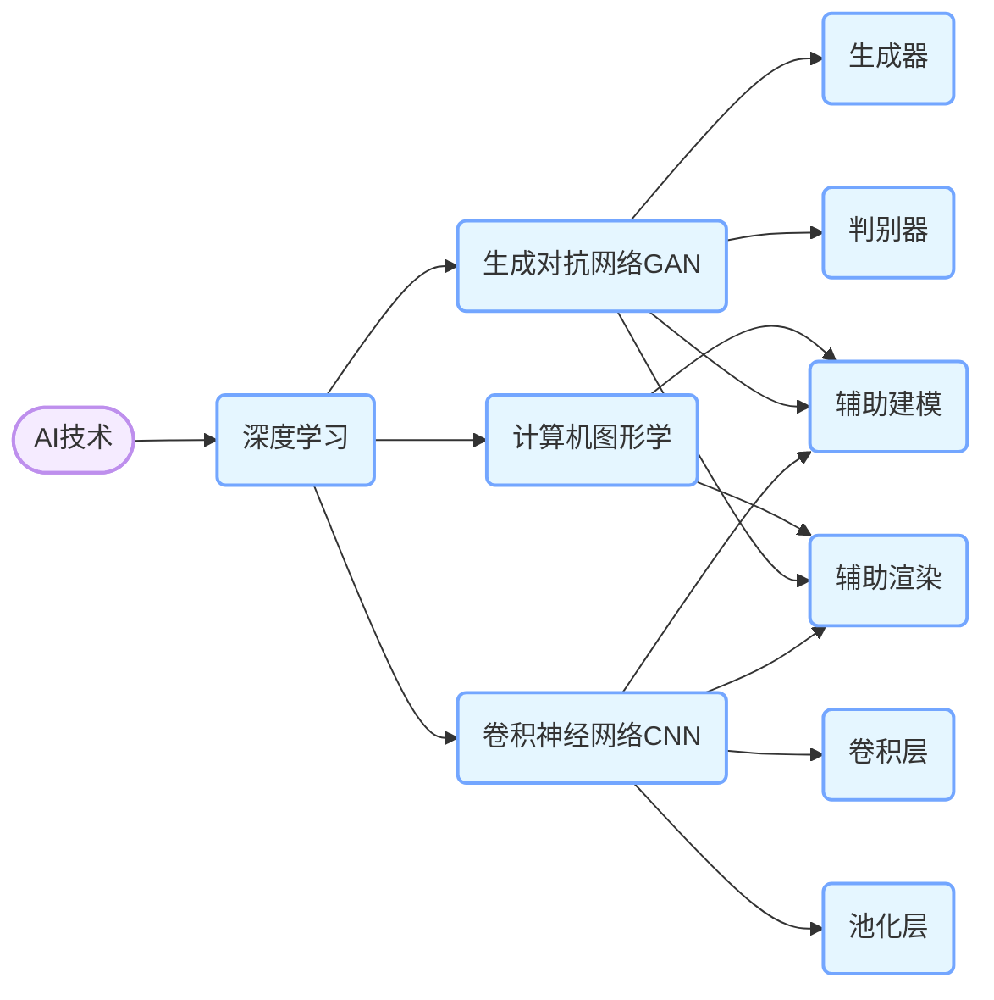

# AI驱动的计算机图形学:从建模到渲染的革新

> 关键词：AI、计算机图形学、建模、渲染、革新

> 摘要：本文聚焦于AI驱动下计算机图形学从建模到渲染的革新。首先介绍了相关背景知识，包括目的范围、预期读者等内容。接着阐述了核心概念及其联系，给出了原理和架构的示意图与流程图。详细讲解了核心算法原理和具体操作步骤，并结合Python代码进行说明。深入分析了数学模型和公式，通过举例让读者更好理解。通过项目实战展示了代码实现和解读。探讨了实际应用场景，推荐了学习工具和资源，包含书籍、在线课程、开发工具等。最后总结了未来发展趋势与挑战，解答了常见问题并提供了扩展阅读和参考资料，全面呈现了AI在计算机图形学领域带来的变革。

## 1. 背景介绍 
### 1.1 目的和范围
本文章的主要目的是深入探讨AI在计算机图形学从建模到渲染整个流程中所带来的革新。随着人工智能技术的飞速发展，其与计算机图形学的融合日益紧密，为该领域带来了前所未有的机遇和变革。我们将研究AI如何改进传统的建模和渲染方法，提高效率和质量，以及探讨相关技术的应用场景和未来发展趋势。范围涵盖了从基础概念到实际应用的多个层面，旨在为读者提供一个全面而深入的了解。

### 1.2 预期读者
本文预期读者包括计算机图形学领域的专业人士，如图形工程师、设计师等，他们可以从中获取关于AI在图形学中最新应用和技术发展的信息，为实际工作提供参考。同时，对人工智能和计算机图形学感兴趣的科研人员也可以通过本文了解两者结合的研究方向和前沿动态。此外，相关专业的学生也能将本文作为学习资料，加深对这一交叉领域的理解。

### 1.3 文档结构概述
本文首先介绍了背景知识，为后续内容奠定基础。接着阐述核心概念及其联系，让读者对关键技术有清晰的认识。然后详细讲解核心算法原理和具体操作步骤，结合Python代码进行说明。通过数学模型和公式进一步深入分析，并用实例辅助理解。项目实战部分展示代码实现和解读，使读者了解实际应用。探讨实际应用场景，让读者明白技术的实用性。推荐学习工具和资源，帮助读者进一步学习。最后总结未来发展趋势与挑战，解答常见问题并提供扩展阅读和参考资料。

### 1.4 术语表
#### 1.4.1 核心术语定义
- **计算机图形学**：研究如何在计算机中表示、处理和显示图形的学科，包括二维和三维图形的生成、处理和渲染等。
- **AI（人工智能）**：使计算机系统能够执行通常需要人类智能才能完成的任务的技术，如学习、推理、解决问题等。
- **建模**：在计算机图形学中，创建三维物体或场景的数学表示的过程。
- **渲染**：将三维模型转换为二维图像的过程，包括光照、材质、阴影等效果的模拟。

#### 1.4.2 相关概念解释
- **深度学习**：一种基于人工神经网络的机器学习方法，通过多层神经网络学习数据的特征和模式。
- **生成对抗网络（GAN）**：由生成器和判别器组成的神经网络架构，用于生成新的数据样本。
- **卷积神经网络（CNN）**：一种专门用于处理具有网格结构数据（如图像）的神经网络，能够自动提取图像的特征。

#### 1.4.3 缩略词列表
- **AI**：Artificial Intelligence
- **GAN**：Generative Adversarial Network
- **CNN**：Convolutional Neural Network

## 2. 核心概念与联系 

### 核心概念原理
在AI驱动的计算机图形学中，有几个核心概念起着关键作用。深度学习是AI技术的核心之一，它通过大量的数据训练神经网络，使网络能够学习到数据中的模式和特征。在计算机图形学中，深度学习可以用于图像生成、风格迁移、图像修复等任务。

生成对抗网络（GAN）是一种特殊的深度学习架构，由生成器和判别器组成。生成器试图生成逼真的数据样本，而判别器则试图区分生成的样本和真实的样本。通过不断的对抗训练，生成器可以生成越来越逼真的图形数据，如逼真的图像、三维模型等。

卷积神经网络（CNN）在计算机图形学中也有广泛的应用。它通过卷积层、池化层等结构自动提取图像的特征，可用于图像分类、目标检测等任务。在建模和渲染中，CNN可以用于分析图像中的物体结构和纹理信息，从而辅助建模和渲染过程。

### 架构的文本示意图
```plaintext
AI（深度学习）
|
|-- 生成对抗网络（GAN）
|   |-- 生成器
|   |-- 判别器
|
|-- 卷积神经网络（CNN）
|
|-- 计算机图形学
    |-- 建模
    |-- 渲染
```

### Mermaid流程图


这个流程图展示了AI技术（主要是深度学习）与计算机图形学中建模和渲染的关系。AI中的生成对抗网络（GAN）和卷积神经网络（CNN）可以辅助计算机图形学的建模和渲染过程，为其带来革新。

## 3. 核心算法原理 & 具体操作步骤 

### 生成对抗网络（GAN）原理
生成对抗网络（GAN）由生成器（Generator）和判别器（Discriminator）组成。生成器的目标是生成尽可能逼真的数据样本，而判别器的目标是区分生成的样本和真实的样本。两者通过对抗训练不断提高性能。

#### Python代码实现
```python
import torch
import torch.nn as nn
import torch.optim as optim
import numpy as np

# 定义生成器
class Generator(nn.Module):
    def __init__(self, input_dim, output_dim):
        super(Generator, self).__init__()
        self.model = nn.Sequential(
            nn.Linear(input_dim, 128),
            nn.LeakyReLU(0.2),
            nn.Linear(128, 256),
            nn.BatchNorm1d(256),
            nn.LeakyReLU(0.2),
            nn.Linear(256, 512),
            nn.BatchNorm1d(512),
            nn.LeakyReLU(0.2),
            nn.Linear(512, output_dim),
            nn.Tanh()
        )

    def forward(self, z):
        return self.model(z)

# 定义判别器
class Discriminator(nn.Module):
    def __init__(self, input_dim):
        super(Discriminator, self).__init__()
        self.model = nn.Sequential(
            nn.Linear(input_dim, 512),
            nn.LeakyReLU(0.2),
            nn.Linear(512, 256),
            nn.LeakyReLU(0.2),
            nn.Linear(256, 1),
            nn.Sigmoid()
        )

    def forward(self, x):
        return self.model(x)

# 训练参数设置
input_dim = 100
output_dim = 784
batch_size = 32
epochs = 100
learning_rate = 0.0002

# 初始化生成器和判别器
generator = Generator(input_dim, output_dim)
discriminator = Discriminator(output_dim)

# 定义损失函数和优化器
criterion = nn.BCELoss()
optimizer_G = optim.Adam(generator.parameters(), lr=learning_rate)
optimizer_D = optim.Adam(discriminator.parameters(), lr=learning_rate)

# 模拟数据（这里简单使用随机噪声）
data = torch.randn(1000, output_dim)

# 训练循环
for epoch in range(epochs):
    for i in range(0, len(data), batch_size):
        real_batch = data[i:i+batch_size]

        # 训练判别器
        optimizer_D.zero_grad()
        real_labels = torch.ones((real_batch.size(0), 1))
        real_output = discriminator(real_batch)
        d_real_loss = criterion(real_output, real_labels)

        z = torch.randn(real_batch.size(0), input_dim)
        fake_batch = generator(z)
        fake_labels = torch.zeros((fake_batch.size(0), 1))
        fake_output = discriminator(fake_batch.detach())
        d_fake_loss = criterion(fake_output, fake_labels)

        d_loss = d_real_loss + d_fake_loss
        d_loss.backward()
        optimizer_D.step()

        # 训练生成器
        optimizer_G.zero_grad()
        z = torch.randn(real_batch.size(0), input_dim)
        fake_batch = generator(z)
        real_labels = torch.ones((fake_batch.size(0), 1))
        output = discriminator(fake_batch)
        g_loss = criterion(output, real_labels)
        g_loss.backward()
        optimizer_G.step()

    print(f'Epoch [{epoch+1}/{epochs}] D_loss: {d_loss.item():.4f} G_loss: {g_loss.item():.4f}')
```

### 具体操作步骤
1. **数据准备**：收集或生成用于训练的图形数据，如真实的图像、三维模型等。
2. **模型初始化**：初始化生成器和判别器的网络参数。
3. **训练判别器**：将真实数据和生成器生成的假数据输入判别器，计算判别器的损失并更新判别器的参数。
4. **训练生成器**：固定判别器的参数，通过生成器生成假数据，让判别器判断，计算生成器的损失并更新生成器的参数。
5. **迭代训练**：重复步骤3和4，直到生成器生成的样本足够逼真。

### 卷积神经网络（CNN）原理
卷积神经网络（CNN）通过卷积层、池化层和全连接层等结构自动提取图像的特征。卷积层使用卷积核在图像上滑动，提取局部特征；池化层用于降低特征图的维度，减少计算量；全连接层用于将提取的特征进行分类或回归。

#### Python代码实现
```python
import torch
import torch.nn as nn
import torch.optim as optim
import torchvision
import torchvision.transforms as transforms

# 定义CNN模型
class CNN(nn.Module):
    def __init__(self):
        super(CNN, self).__init__()
        self.conv1 = nn.Conv2d(3, 6, 5)
        self.pool = nn.MaxPool2d(2, 2)
        self.conv2 = nn.Conv2d(6, 16, 5)
        self.fc1 = nn.Linear(16 * 5 * 5, 120)
        self.fc2 = nn.Linear(120, 84)
        self.fc3 = nn.Linear(84, 10)

    def forward(self, x):
        x = self.pool(torch.relu(self.conv1(x)))
        x = self.pool(torch.relu(self.conv2(x)))
        x = x.view(-1, 16 * 5 * 5)
        x = torch.relu(self.fc1(x))
        x = torch.relu(self.fc2(x))
        x = self.fc3(x)
        return x

# 数据预处理
transform = transforms.Compose(
    [transforms.ToTensor(),
     transforms.Normalize((0.5, 0.5, 0.5), (0.5, 0.5, 0.5))])

# 加载数据集
trainset = torchvision.datasets.CIFAR10(root='./data', train=True,
                                        download=True, transform=transform)
trainloader = torch.utils.data.DataLoader(trainset, batch_size=4,
                                          shuffle=True, num_workers=2)

# 初始化模型、损失函数和优化器
net = CNN()
criterion = nn.CrossEntropyLoss()
optimizer = optim.SGD(net.parameters(), lr=0.001, momentum=0.9)

# 训练模型
for epoch in range(2):  # 训练2个epoch
    running_loss = 0.0
    for i, data in enumerate(trainloader, 0):
        inputs, labels = data

        optimizer.zero_grad()

        outputs = net(inputs)
        loss = criterion(outputs, labels)
        loss.backward()
        optimizer.step()

        running_loss += loss.item()
        if i % 2000 == 1999:    # 每2000个小批量打印一次损失
            print(f'[{epoch + 1}, {i + 1:5d}] loss: {running_loss / 2000:.3f}')
            running_loss = 0.0

print('Finished Training')
```

### 具体操作步骤
1. **数据预处理**：对图像数据进行归一化、裁剪等预处理操作，以提高模型的训练效果。
2. **模型定义**：定义CNN模型的结构，包括卷积层、池化层和全连接层的参数。
3. **损失函数和优化器选择**：选择合适的损失函数（如交叉熵损失）和优化器（如随机梯度下降）。
4. **训练模型**：将预处理后的数据输入模型，计算损失并更新模型的参数。
5. **评估模型**：使用测试数据评估模型的性能。

## 4. 数学模型和公式 & 详细讲解 & 举例说明 

### 生成对抗网络（GAN）的数学模型
GAN的目标是找到生成器 $G$ 和判别器 $D$ 的最优参数，使得生成器生成的样本尽可能逼真，判别器难以区分生成的样本和真实的样本。其目标函数可以表示为：

$$\min_G \max_D V(D, G) = \mathbb{E}_{x \sim p_{data}(x)}[\log D(x)] + \mathbb{E}_{z \sim p_z(z)}[\log(1 - D(G(z)))]$$

其中，$p_{data}(x)$ 是真实数据的分布，$p_z(z)$ 是噪声的分布，$x$ 是真实数据样本，$z$ 是噪声样本，$G(z)$ 是生成器生成的样本，$D(x)$ 是判别器对真实样本的判断结果，$D(G(z))$ 是判别器对生成样本的判断结果。

#### 详细讲解
- **判别器的目标**：最大化 $V(D, G)$，即尽可能准确地区分真实样本和生成样本。对于真实样本 $x$，判别器希望 $D(x)$ 接近 1；对于生成样本 $G(z)$，判别器希望 $D(G(z))$ 接近 0。
- **生成器的目标**：最小化 $V(D, G)$，即生成的样本能够骗过判别器，使得 $D(G(z))$ 接近 1。

#### 举例说明
假设我们要生成手写数字图像。真实数据 $x$ 是从手写数字数据集（如MNIST）中采样得到的图像，噪声 $z$ 是随机向量。生成器 $G$ 接受噪声 $z$ 作为输入，输出一个手写数字图像 $G(z)$。判别器 $D$ 接受图像作为输入，输出一个概率值，表示该图像是真实图像的概率。在训练过程中，判别器不断学习区分真实图像和生成图像，生成器不断学习生成更逼真的图像。

### 卷积神经网络（CNN）的数学模型
在卷积神经网络中，卷积层的计算可以表示为：

$$y_{i,j}^l = \sum_{m=0}^{M-1} \sum_{n=0}^{N-1} x_{i+m,j+n}^{l-1} \cdot w_{m,n}^l + b^l$$

其中，$y_{i,j}^l$ 是第 $l$ 层卷积层输出特征图中 $(i, j)$ 位置的值，$x_{i+m,j+n}^{l-1}$ 是第 $l-1$ 层输入特征图中 $(i+m, j+n)$ 位置的值，$w_{m,n}^l$ 是卷积核中 $(m, n)$ 位置的权重，$b^l$ 是偏置，$M$ 和 $N$ 是卷积核的大小。

#### 详细讲解
卷积层通过卷积核在输入特征图上滑动，计算卷积核与输入特征图对应位置的元素乘积之和，再加上偏置，得到输出特征图的一个值。通过不断滑动卷积核，可以得到整个输出特征图。

#### 举例说明
假设输入特征图是一个 $5\times5$ 的矩阵，卷积核是一个 $3\times3$ 的矩阵。卷积核从输入特征图的左上角开始滑动，每次计算 $3\times3$ 区域内元素与卷积核对应元素的乘积之和，再加上偏置，得到输出特征图的一个值。卷积核滑动完整个输入特征图后，得到一个 $3\times3$ 的输出特征图。

## 5. 项目实战：代码实际案例和详细解释说明 

### 5.1  开发环境搭建
#### 安装Python
首先，确保你已经安装了Python。可以从Python官方网站（https://www.python.org/downloads/） 下载适合你操作系统的Python版本。建议安装Python 3.7及以上版本。

#### 安装深度学习框架
我们使用PyTorch作为深度学习框架。可以使用以下命令安装PyTorch：
```sh
pip install torch torchvision
```
根据你的CUDA版本和操作系统选择合适的安装命令，具体可以参考PyTorch官方网站（https://pytorch.org/get-started/locally/）。

#### 安装其他依赖库
还需要安装一些其他的依赖库，如NumPy、Matplotlib等：
```sh
pip install numpy matplotlib
```

### 5.2  源代码详细实现和代码解读
#### 基于GAN生成手写数字图像
```python
import torch
import torch.nn as nn
import torch.optim as optim
import torchvision
import torchvision.datasets as datasets
import torchvision.transforms as transforms
import matplotlib.pyplot as plt
import numpy as np

# 定义生成器
class Generator(nn.Module):
    def __init__(self, input_dim, output_dim):
        super(Generator, self).__init__()
        self.model = nn.Sequential(
            nn.Linear(input_dim, 128),
            nn.LeakyReLU(0.2),
            nn.Linear(128, 256),
            nn.BatchNorm1d(256),
            nn.LeakyReLU(0.2),
            nn.Linear(256, 512),
            nn.BatchNorm1d(512),
            nn.LeakyReLU(0.2),
            nn.Linear(512, output_dim),
            nn.Tanh()
        )

    def forward(self, z):
        return self.model(z)

# 定义判别器
class Discriminator(nn.Module):
    def __init__(self, input_dim):
        super(Discriminator, self).__init__()
        self.model = nn.Sequential(
            nn.Linear(input_dim, 512),
            nn.LeakyReLU(0.2),
            nn.Linear(512, 256),
            nn.LeakyReLU(0.2),
            nn.Linear(256, 1),
            nn.Sigmoid()
        )

    def forward(self, x):
        return self.model(x)

# 训练参数设置
input_dim = 100
output_dim = 784
batch_size = 32
epochs = 100
learning_rate = 0.0002

# 数据预处理
transform = transforms.Compose([
    transforms.ToTensor(),
    transforms.Normalize((0.5,), (0.5,))
])

# 加载MNIST数据集
mnist_dataset = datasets.MNIST(root='./data', train=True,
                               download=True, transform=transform)
dataloader = torch.utils.data.DataLoader(mnist_dataset, batch_size=batch_size,
                                         shuffle=True)

# 初始化生成器和判别器
generator = Generator(input_dim, output_dim)
discriminator = Discriminator(output_dim)

# 定义损失函数和优化器
criterion = nn.BCELoss()
optimizer_G = optim.Adam(generator.parameters(), lr=learning_rate)
optimizer_D = optim.Adam(discriminator.parameters(), lr=learning_rate)

# 训练循环
for epoch in range(epochs):
    for i, (real_images, _) in enumerate(dataloader):
        real_images = real_images.view(-1, output_dim)

        # 训练判别器
        optimizer_D.zero_grad()
        real_labels = torch.ones((real_images.size(0), 1))
        real_output = discriminator(real_images)
        d_real_loss = criterion(real_output, real_labels)

        z = torch.randn(real_images.size(0), input_dim)
        fake_images = generator(z)
        fake_labels = torch.zeros((fake_images.size(0), 1))
        fake_output = discriminator(fake_images.detach())
        d_fake_loss = criterion(fake_output, fake_labels)

        d_loss = d_real_loss + d_fake_loss
        d_loss.backward()
        optimizer_D.step()

        # 训练生成器
        optimizer_G.zero_grad()
        z = torch.randn(real_images.size(0), input_dim)
        fake_images = generator(z)
        real_labels = torch.ones((fake_images.size(0), 1))
        output = discriminator(fake_images)
        g_loss = criterion(output, real_labels)
        g_loss.backward()
        optimizer_G.step()

    print(f'Epoch [{epoch+1}/{epochs}] D_loss: {d_loss.item():.4f} G_loss: {g_loss.item():.4f}')

# 生成一些样本进行可视化
with torch.no_grad():
    z = torch.randn(16, input_dim)
    generated_images = generator(z).view(-1, 1, 28, 28)
    generated_images = (generated_images + 1) / 2  # 反归一化

    fig, axes = plt.subplots(4, 4, figsize=(4, 4))
    for i in range(4):
        for j in range(4):
            axes[i, j].imshow(generated_images[i * 4 + j].squeeze().numpy(), cmap='gray')
            axes[i, j].axis('off')
    plt.show()
```

#### 代码解读
1. **数据预处理**：使用 `transforms.Compose` 对MNIST数据集进行预处理，将图像转换为张量并进行归一化。
2. **定义生成器和判别器**：生成器接受一个随机噪声向量作为输入，输出一个 $28\times28$ 的手写数字图像；判别器接受一个图像作为输入，输出一个概率值，表示该图像是真实图像的概率。
3. **训练判别器**：将真实图像和生成器生成的假图像输入判别器，计算判别器的损失并更新判别器的参数。
4. **训练生成器**：固定判别器的参数，通过生成器生成假图像，让判别器判断，计算生成器的损失并更新生成器的参数。
5. **可视化生成的样本**：训练完成后，使用生成器生成一些样本并进行可视化。

### 5.3  代码解读与分析
#### 生成器和判别器的结构
生成器和判别器都是多层感知机（MLP）结构。生成器通过多个线性层和激活函数将随机噪声向量映射到图像空间；判别器通过多个线性层和激活函数将图像映射到概率值。

#### 损失函数和优化器
使用二元交叉熵损失函数（BCELoss）来衡量判别器和生成器的损失。优化器使用Adam优化器，它结合了Adagrad和RMSProp的优点，能够自适应地调整学习率。

#### 训练过程
训练过程中，判别器和生成器交替训练。判别器的目标是区分真实图像和生成图像，生成器的目标是生成能够骗过判别器的图像。通过不断的对抗训练，生成器生成的图像会越来越逼真。

## 6. 实际应用场景 
### 游戏开发
在游戏开发中，AI驱动的计算机图形学可以用于快速生成游戏场景和角色模型。通过GAN可以生成逼真的地形、建筑、植被等场景元素，减少人工建模的工作量。CNN可以用于图像风格迁移，为游戏添加独特的视觉风格。此外，在游戏渲染中，AI可以实时优化光照、阴影等效果，提高游戏的视觉质量。

### 影视制作
在影视制作中，AI可以用于虚拟角色的建模和动画制作。通过深度学习技术，可以从演员的动作捕捉数据中学习到更加自然流畅的动画，减少人工调整的时间。在渲染方面，AI可以加速渲染过程，提高渲染质量，如生成逼真的毛发、布料等效果。

### 虚拟现实（VR）和增强现实（AR）
在VR和AR应用中，需要实时生成高质量的虚拟场景。AI驱动的计算机图形学可以根据用户的位置和视角，实时生成和渲染场景，提高沉浸感。例如，GAN可以用于生成逼真的虚拟环境，CNN可以用于识别和跟踪现实世界中的物体，实现虚实融合。

### 工业设计
在工业设计中，AI可以辅助设计师进行产品建模和渲染。通过GAN可以生成不同风格的产品外观设计，为设计师提供灵感。CNN可以用于分析产品的外观和结构，评估设计的合理性。在渲染方面，AI可以快速生成高质量的产品渲染图，用于展示和宣传。

## 7. 工具和资源推荐
### 7.1 学习资源推荐
#### 7.1.1 书籍推荐
- 《深度学习》（Deep Learning）：由Ian Goodfellow、Yoshua Bengio和Aaron Courville所著，是深度学习领域的经典教材，涵盖了深度学习的基本概念、算法和应用。
- 《计算机图形学原理与实践》（Computer Graphics: Principles and Practice）：全面介绍了计算机图形学的基本原理和技术，包括建模、渲染、动画等方面。
- 《Python深度学习》（Deep Learning with Python）：由Francois Chollet所著，以Python和Keras为工具，介绍了深度学习的实践方法。

#### 7.1.2 在线课程
- Coursera上的“深度学习专项课程”（Deep Learning Specialization）：由Andrew Ng教授授课，包括深度学习的基础、卷积神经网络、循环神经网络等内容。
- edX上的“计算机图形学”（Computer Graphics）：介绍了计算机图形学的基本原理和算法，通过编程实践让学生掌握相关技术。
- 哔哩哔哩（B站）上有很多关于AI和计算机图形学的教程，如“莫烦Python”的深度学习教程和“李沐”的计算机视觉教程。

#### 7.1.3 技术博客和网站
- Medium：有很多关于AI和计算机图形学的技术文章，如Towards Data Science、The AI Summer等专栏。
- arXiv：提供了大量的学术论文，包括AI和计算机图形学领域的最新研究成果。
- GitHub：可以找到很多开源的AI和计算机图形学项目，学习他人的代码和实现方法。

### 7.2 开发工具框架推荐
#### 7.2.1 IDE和编辑器
- PyCharm：是一款专门为Python开发设计的集成开发环境（IDE），提供了代码编辑、调试、版本控制等功能。
- Jupyter Notebook：是一个交互式的开发环境，适合进行数据分析和模型实验，支持Python、R等多种编程语言。
- Visual Studio Code：是一款轻量级的代码编辑器，支持多种编程语言和插件扩展，具有丰富的开发工具和调试功能。

#### 7.2.2 调试和性能分析工具
- PyTorch自带的调试工具：可以使用 `torch.autograd.set_detect_anomaly(True)` 来检测梯度异常，使用 `torch.utils.bottleneck` 来分析代码的性能瓶颈。
- TensorBoard：是TensorFlow的可视化工具，也可以与PyTorch结合使用，用于可视化模型的训练过程、损失曲线、模型结构等。
- NVIDIA Nsight Systems：是一款性能分析工具，可用于分析GPU的性能瓶颈，优化代码的运行效率。

#### 7.2.3 相关框架和库
- PyTorch：是一个开源的深度学习框架，具有动态图机制，易于使用和调试，广泛应用于计算机视觉、自然语言处理等领域。
- TensorFlow：是另一个流行的深度学习框架，具有强大的分布式训练和部署能力，提供了丰富的工具和库。
- OpenCV：是一个开源的计算机视觉库，提供了各种图像处理和计算机视觉算法，如图像滤波、特征提取、目标检测等。

### 7.3 相关论文著作推荐
#### 7.3.1 经典论文
- “Generative Adversarial Networks”：由Ian Goodfellow等人发表，首次提出了生成对抗网络的概念，为生成式模型的发展奠定了基础。
- “ImageNet Classification with Deep Convolutional Neural Networks”：由Alex Krizhevsky等人发表，介绍了AlexNet卷积神经网络，在ImageNet图像分类竞赛中取得了优异的成绩，推动了深度学习在计算机视觉领域的发展。
- “A Neural Algorithm of Artistic Style”：由Leon A. Gatys等人发表，提出了一种基于卷积神经网络的图像风格迁移算法，实现了将艺术风格从一幅图像迁移到另一幅图像。

#### 7.3.2 最新研究成果
- 在arXiv上可以找到很多关于AI和计算机图形学的最新研究论文，如基于GAN的三维模型生成、基于深度学习的实时渲染等方面的研究。
- 顶级学术会议如ACM SIGGRAPH、CVPR、ICCV等会发表很多该领域的最新研究成果，可以关注这些会议的论文集。

#### 7.3.3 应用案例分析
- 一些知名的游戏公司和影视制作公司会在其官方博客或技术分享中介绍AI在游戏开发和影视制作中的应用案例，如Epic Games在虚幻引擎中应用AI技术的案例。
- 一些工业设计公司也会分享AI在产品设计中的应用经验，可以通过相关的行业网站和论坛获取这些信息。

## 8. 总结：未来发展趋势与挑战
### 未来发展趋势
#### 更加智能化的建模和渲染
未来，AI将在计算机图形学的建模和渲染过程中发挥更加重要的作用。通过深度学习和强化学习技术，模型可以自动学习和优化建模和渲染的参数，实现更加智能化的创作过程。例如，自动生成具有复杂结构和细节的三维模型，以及实时生成高质量的渲染效果。

#### 跨领域融合
AI与计算机图形学将与其他领域如物理学、生物学等进行更深入的融合。例如，结合物理模拟技术可以实现更加真实的流体、布料等效果的渲染；结合生物学知识可以生成更加逼真的生物模型。此外，AI与虚拟现实、增强现实等技术的融合也将为用户带来更加沉浸式的体验。

#### 实时交互和个性化
随着硬件技术的不断发展，AI驱动的计算机图形学将实现更加实时的交互和个性化的内容生成。例如，在游戏和虚拟社交场景中，根据用户的行为和偏好实时生成个性化的场景和角色。在影视制作中，观众可以与虚拟角色进行实时交互，影响剧情的发展。

### 挑战
#### 数据质量和隐私问题
AI模型的训练需要大量高质量的数据，但在计算机图形学领域，获取和标注数据往往比较困难。此外，数据隐私问题也是一个重要的挑战，如何在保护用户隐私的前提下使用数据进行模型训练是需要解决的问题。

#### 计算资源需求
AI驱动的计算机图形学通常需要大量的计算资源，尤其是在进行复杂的建模和渲染任务时。如何在有限的计算资源下提高模型的效率和性能是一个挑战。此外，随着模型的不断增大和复杂度的提高，能源消耗也成为一个不容忽视的问题。

#### 模型可解释性和可靠性
深度学习模型通常是黑盒模型，其决策过程难以解释。在计算机图形学中，这可能会导致一些不可预测的结果。如何提高模型的可解释性和可靠性，确保生成的图形内容符合预期是需要解决的问题。

## 9. 附录：常见问题与解答
### 1. AI在计算机图形学中的应用是否会取代人工创作？
不会。虽然AI可以辅助计算机图形学的建模和渲染过程，提高效率和质量，但人工创作仍然具有不可替代的作用。人工创作可以融入创作者的创意、情感和审美，创造出具有独特风格和内涵的作品。AI更多地是作为一种工具，帮助创作者实现他们的想法。

### 2. 学习AI驱动的计算机图形学需要具备哪些基础知识？
需要具备一定的计算机科学基础知识，如编程语言（Python）、数据结构和算法等。同时，还需要了解计算机图形学的基本概念和技术，如建模、渲染、动画等。此外，对深度学习和机器学习的基本原理和算法也需要有一定的了解。

### 3. 如何评估AI生成的图形内容的质量？
可以从多个方面评估AI生成的图形内容的质量，如真实性、美观性、一致性等。真实性可以通过与真实场景或物体进行比较来评估；美观性可以从视觉效果、色彩搭配等方面进行评估；一致性可以检查图形内容在不同视角和光照条件下是否保持一致。此外，还可以通过用户反馈和主观评价来评估图形内容的质量。

### 4. AI在计算机图形学中的应用是否会受到硬件限制？
会。AI驱动的计算机图形学通常需要大量的计算资源，尤其是在进行复杂的建模和渲染任务时。目前的硬件技术在一定程度上限制了AI在计算机图形学中的应用。例如，实时渲染高质量的图形内容需要强大的GPU支持。随着硬件技术的不断发展，如GPU性能的提升和量子计算的发展，这些限制将逐渐得到缓解。

## 10. 扩展阅读 & 参考资料
### 扩展阅读
- 《人工智能：现代方法》（Artificial Intelligence: A Modern Approach）：全面介绍了人工智能的基本概念、算法和应用，是人工智能领域的经典教材。
- 《计算机视觉：算法与应用》（Computer Vision: Algorithms and Applications）：详细介绍了计算机视觉的各种算法和应用，包括图像特征提取、目标检测、图像分割等。
- 《实时渲染》（Real-Time Rendering）：专注于实时渲染技术，介绍了光照模型、材质渲染、阴影算法等内容，对于游戏开发和实时图形应用有很大的帮助。

### 参考资料
- Goodfellow, I. J., Bengio, Y., & Courville, A. (2016). Deep Learning. MIT Press.
- Foley, J. D., van Dam, A., Feiner, S. K., & Hughes, J. F. (2013). Computer Graphics: Principles and Practice. Addison-Wesley.
- Chollet, F. (2017). Deep Learning with Python. Manning Publications.

作者：AI天才研究院/AI Genius Institute & 禅与计算机程序设计艺术 /Zen And The Art of Computer Programming