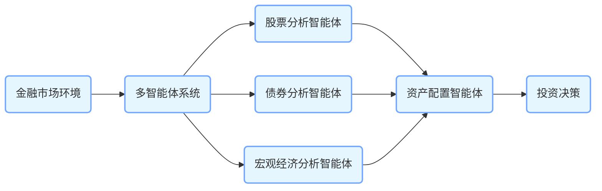

# AI驱动的跨资产类别配置：价值投资中的多智能体应用

> 关键词：AI、跨资产类别配置、价值投资、多智能体、金融市场

> 摘要：本文聚焦于AI驱动的跨资产类别配置在价值投资中的多智能体应用。首先介绍了相关背景，包括研究目的、预期读者、文档结构和术语定义。接着阐述了核心概念与联系，给出了原理和架构的示意图与流程图。详细讲解了核心算法原理，并用Python代码进行了说明。通过数学模型和公式进一步剖析了该应用的内在逻辑。结合项目实战，从开发环境搭建到源代码实现与解读，深入探讨了其实际操作。分析了实际应用场景，推荐了学习资源、开发工具框架和相关论文著作。最后总结了未来发展趋势与挑战，解答了常见问题，并提供了扩展阅读和参考资料，旨在为读者全面呈现AI在跨资产类别配置和价值投资领域的多智能体应用的全貌。

## 1. 背景介绍 
### 1.1 目的和范围
在当今复杂多变的金融市场中，价值投资作为一种经典的投资策略，面临着诸多挑战。传统的投资决策方法往往难以应对海量的市场数据和复杂的资产类别。AI技术的发展为解决这些问题提供了新的思路。本文的目的在于深入探讨AI驱动的跨资产类别配置在价值投资中的应用，特别是多智能体系统的运用。研究范围涵盖了从理论原理到实际应用的各个方面，包括核心概念的阐述、算法原理的分析、数学模型的构建、项目实战的展示以及实际应用场景的探讨等。

### 1.2 预期读者
本文预期读者包括金融从业者，如投资经理、分析师等，他们可以从中获取新的投资策略和决策方法；计算机科学领域的研究人员和开发者，对AI在金融领域的应用感兴趣，可借鉴其中的算法和技术实现；以及对金融市场和AI技术有一定了解的爱好者，希望深入学习相关知识。

### 1.3 文档结构概述
本文将按照以下结构进行组织：首先介绍背景信息，让读者了解研究的目的和范围；接着阐述核心概念与联系，包括多智能体系统在跨资产类别配置中的原理和架构；详细讲解核心算法原理和具体操作步骤，并用Python代码进行说明；通过数学模型和公式进一步解释其内在逻辑；结合项目实战，展示如何在实际中应用这些技术；分析实际应用场景；推荐相关的学习资源、开发工具框架和论文著作；最后总结未来发展趋势与挑战，解答常见问题，并提供扩展阅读和参考资料。

### 1.4 术语表
#### 1.4.1 核心术语定义
- **AI（人工智能）**：是一门研究如何使计算机系统能够模拟人类智能的技术，包括机器学习、深度学习、自然语言处理等多个领域。
- **跨资产类别配置**：指将投资资金分配到不同类型的资产中，如股票、债券、大宗商品等，以实现风险分散和收益最大化的投资策略。
- **价值投资**：一种投资理念，强调通过分析资产的内在价值，寻找被低估的资产进行投资，以获取长期的投资回报。
- **多智能体系统**：由多个智能体组成的系统，每个智能体具有一定的自主性和智能，能够通过与其他智能体和环境的交互来实现共同的目标。

#### 1.4.2 相关概念解释
- **机器学习**：是AI的一个重要分支，通过让计算机从数据中学习模式和规律，从而实现预测和决策的功能。常见的机器学习算法包括决策树、支持向量机、神经网络等。
- **深度学习**：是机器学习的一种特殊形式，基于人工神经网络，通过构建深层的神经网络模型，自动从大量数据中学习复杂的特征和模式。
- **智能体**：是一个具有自主性、反应性、社会性和学习能力的实体，能够感知环境并根据自身的目标和规则做出决策和行动。

#### 1.4.3 缩略词列表
- **AI**：Artificial Intelligence
- **ML**：Machine Learning
- **DL**：Deep Learning
- **MAS**：Multi - Agent System

## 2. 核心概念与联系 

### 核心概念原理
在AI驱动的跨资产类别配置的价值投资中，多智能体系统扮演着关键的角色。每个智能体可以看作是一个独立的决策者，它具有自己的目标、知识和能力。例如，一个智能体可以专注于分析股票市场的基本面数据，另一个智能体可以关注宏观经济指标对债券市场的影响。

多智能体系统的原理在于通过智能体之间的交互和协作，实现对复杂金融市场的全面分析和决策。智能体之间可以通过消息传递、协商等方式进行信息共享和合作。例如，当分析股票市场的智能体发现某只股票被低估时，它可以将这个信息传递给负责资产配置的智能体，后者根据这个信息和其他资产的情况进行综合考虑，做出投资决策。

### 架构的文本示意图
```plaintext
                     金融市场环境
                          |
                          |
           +-------------------------------+
           |                               |
           |         多智能体系统          |
           |                               |
           +-------------------------------+
           |             |             |
           |             |             |
  股票分析智能体    债券分析智能体    宏观经济分析智能体
           |             |             |
           |             |             |
           +-------------------------------+
                          |
                          |
                    资产配置智能体
                          |
                          |
                     投资决策
```

### Mermaid流程图


## 3. 核心算法原理 & 具体操作步骤 

### 核心算法原理
在多智能体系统中，常用的算法包括强化学习算法。强化学习是一种通过智能体与环境进行交互，根据环境反馈的奖励信号来学习最优策略的算法。

以资产配置为例，智能体的目标是最大化投资组合的长期收益。智能体在每个时间步会根据当前的市场状态（如资产价格、宏观经济指标等）选择一个投资动作（如买入、卖出或持有某种资产），然后环境会根据这个动作给出一个奖励（如投资组合的收益）。智能体通过不断地尝试不同的动作，学习到在不同市场状态下的最优投资策略。

### Python源代码详细阐述
```python
import numpy as np
import random

# 定义环境类
class FinancialEnvironment:
    def __init__(self, num_assets):
        self.num_assets = num_assets
        self.asset_prices = np.random.rand(num_assets)  # 初始化资产价格

    def step(self, action):
        # 模拟市场变化
        self.asset_prices += np.random.normal(0, 0.01, self.num_assets)
        # 计算奖励
        reward = np.dot(action, self.asset_prices)
        return self.asset_prices, reward

# 定义智能体类
class Agent:
    def __init__(self, num_assets):
        self.num_assets = num_assets
        self.policy = np.random.rand(num_assets)  # 初始化策略

    def choose_action(self, state):
        # 根据策略选择动作
        action = np.random.choice([0, 1], size=self.num_assets, p=self.policy)
        return action

    def update_policy(self, state, action, reward):
        # 简单的策略更新
        self.policy += 0.01 * reward * action

# 主循环
num_assets = 3
env = FinancialEnvironment(num_assets)
agent = Agent(num_assets)

num_episodes = 100
for episode in range(num_episodes):
    state = env.asset_prices
    action = agent.choose_action(state)
    next_state, reward = env.step(action)
    agent.update_policy(state, action, reward)
    print(f"Episode {episode}: Reward = {reward}")
```

### 具体操作步骤
1. **初始化环境和智能体**：创建金融市场环境和智能体对象，初始化资产价格和智能体的策略。
2. **智能体选择动作**：智能体根据当前的市场状态和自身的策略选择一个投资动作。
3. **环境反馈奖励**：环境根据智能体的动作更新市场状态，并给出相应的奖励。
4. **智能体更新策略**：智能体根据奖励信号更新自己的策略，以提高未来的收益。
5. **重复步骤2 - 4**：不断循环，直到达到预定的训练次数。

## 4. 数学模型和公式 & 详细讲解 & 举例说明 

### 数学模型
在强化学习中，常用的数学模型是马尔可夫决策过程（MDP）。MDP可以用一个五元组 $(S, A, P, R, \gamma)$ 来表示，其中：
- $S$ 是状态空间，表示所有可能的市场状态。
- $A$ 是动作空间，表示智能体可以采取的所有投资动作。
- $P(s'|s, a)$ 是状态转移概率，表示在状态 $s$ 下采取动作 $a$ 后转移到状态 $s'$ 的概率。
- $R(s, a)$ 是奖励函数，表示在状态 $s$ 下采取动作 $a$ 所获得的奖励。
- $\gamma$ 是折扣因子，用于权衡当前奖励和未来奖励的重要性。

### 公式
智能体的目标是最大化长期累积折扣奖励，即：
$$G_t = \sum_{k=0}^{\infty} \gamma^k R_{t + k + 1}$$
其中，$G_t$ 是从时间步 $t$ 开始的长期累积折扣奖励，$R_{t + k + 1}$ 是时间步 $t + k + 1$ 的奖励。

为了找到最优策略，通常使用价值函数。状态价值函数 $V^{\pi}(s)$ 表示在策略 $\pi$ 下从状态 $s$ 开始的长期累积折扣奖励的期望：
$$V^{\pi}(s) = \mathbb{E}_{\pi}[G_t | S_t = s]$$
动作价值函数 $Q^{\pi}(s, a)$ 表示在策略 $\pi$ 下从状态 $s$ 采取动作 $a$ 后开始的长期累积折扣奖励的期望：
$$Q^{\pi}(s, a) = \mathbb{E}_{\pi}[G_t | S_t = s, A_t = a]$$

### 详细讲解
状态价值函数和动作价值函数可以帮助智能体评估不同状态和动作的价值。智能体可以通过不断地更新这些价值函数来学习最优策略。例如，在Q - learning算法中，动作价值函数的更新公式为：
$$Q(S_t, A_t) \leftarrow Q(S_t, A_t) + \alpha [R_{t + 1} + \gamma \max_{a} Q(S_{t + 1}, a) - Q(S_t, A_t)]$$
其中，$\alpha$ 是学习率，控制每次更新的步长。

### 举例说明
假设我们有一个简单的金融市场，只有两种资产（股票和债券），市场状态可以用资产价格来表示，动作可以是买入、卖出或持有。智能体的目标是最大化投资组合的收益。

初始时，智能体对每个状态 - 动作对的Q值都进行了随机初始化。在每个时间步，智能体根据当前的市场状态选择一个动作，然后环境会给出相应的奖励。智能体根据奖励和Q - learning公式更新Q值。经过多次迭代，智能体逐渐学习到在不同市场状态下的最优投资策略。

## 5. 项目实战：代码实际案例和详细解释说明 

### 5.1  开发环境搭建
#### 安装Python
首先，需要安装Python环境。可以从Python官方网站（https://www.python.org/downloads/）下载适合自己操作系统的Python版本，并按照安装向导进行安装。

#### 安装必要的库
在本项目中，需要使用一些常用的Python库，如`numpy`、`pandas`等。可以使用`pip`命令进行安装：
```sh
pip install numpy pandas
```

### 5.2  源代码详细实现和代码解读
```python
import numpy as np
import pandas as pd
import random

# 定义金融市场环境类
class FinancialMarket:
    def __init__(self, num_assets, num_steps):
        self.num_assets = num_assets
        self.num_steps = num_steps
        self.asset_prices = np.random.rand(num_assets)  # 初始化资产价格
        self.current_step = 0

    def reset(self):
        self.asset_prices = np.random.rand(self.num_assets)
        self.current_step = 0
        return self.asset_prices

    def step(self, action):
        # 模拟市场价格变化
        price_changes = np.random.normal(0, 0.01, self.num_assets)
        self.asset_prices += price_changes
        # 计算投资组合价值变化
        portfolio_value = np.dot(action, self.asset_prices)
        reward = portfolio_value
        self.current_step += 1
        done = self.current_step >= self.num_steps
        return self.asset_prices, reward, done

# 定义智能体类
class QLearningAgent:
    def __init__(self, num_assets, num_actions, learning_rate=0.1, discount_factor=0.9):
        self.num_assets = num_assets
        self.num_actions = num_actions
        self.learning_rate = learning_rate
        self.discount_factor = discount_factor
        self.q_table = np.zeros((num_assets, num_actions))

    def choose_action(self, state):
        if random.uniform(0, 1) < 0.1:  # 探索率
            return random.randint(0, self.num_actions - 1)
        else:
            return np.argmax(self.q_table[state])

    def update_q_table(self, state, action, reward, next_state):
        max_q_next = np.max(self.q_table[next_state])
        self.q_table[state, action] += self.learning_rate * (
            reward + self.discount_factor * max_q_next - self.q_table[state, action]
        )

# 主程序
num_assets = 3
num_actions = 3  # 买入、卖出、持有
num_steps = 100
market = FinancialMarket(num_assets, num_steps)
agent = QLearningAgent(num_assets, num_actions)

num_episodes = 100
for episode in range(num_episodes):
    state = market.reset()
    done = False
    total_reward = 0
    while not done:
        state_index = np.argmax(state)
        action = agent.choose_action(state_index)
        action_vector = np.zeros(num_assets)
        action_vector[action] = 1
        next_state, reward, done = market.step(action_vector)
        next_state_index = np.argmax(next_state)
        agent.update_q_table(state_index, action, reward, next_state_index)
        state = next_state
        total_reward += reward
    print(f"Episode {episode}: Total Reward = {total_reward}")
```

### 5.3  代码解读与分析
#### 金融市场环境类（`FinancialMarket`）
- `__init__` 方法：初始化金融市场环境，包括资产数量、总步数、初始资产价格和当前步数。
- `reset` 方法：重置市场环境，将资产价格重新初始化，并将当前步数置为0。
- `step` 方法：模拟市场价格变化，根据智能体的动作计算投资组合的价值变化，返回新的市场状态、奖励和是否结束的标志。

#### 智能体类（`QLearningAgent`）
- `__init__` 方法：初始化智能体，包括资产数量、动作数量、学习率、折扣因子和Q表。
- `choose_action` 方法：根据当前状态选择一个动作，采用探索 - 利用策略，有一定概率进行随机探索。
- `update_q_table` 方法：根据Q - learning公式更新Q表。

#### 主程序
- 初始化金融市场环境和智能体。
- 进行多次训练回合，每个回合中智能体与环境进行交互，不断更新Q表，直到达到最大步数。
- 记录每个回合的总奖励并输出。

## 6. 实际应用场景 
### 投资组合管理
在投资组合管理中，AI驱动的跨资产类别配置和多智能体系统可以帮助投资经理更有效地分配资产。不同的智能体可以负责分析不同类型的资产，如股票、债券、大宗商品等。通过智能体之间的协作和信息共享，投资经理可以根据市场变化及时调整投资组合，实现风险分散和收益最大化。

### 风险管理
风险管理是金融投资中的重要环节。多智能体系统可以实时监测市场风险，如市场波动、信用风险等。当某个智能体检测到风险增加时，它可以及时通知其他智能体和投资决策系统，以便采取相应的措施，如减少风险资产的持仓、增加避险资产的配置等。

### 量化交易
在量化交易中，AI和多智能体系统可以用于开发交易策略。智能体可以根据历史数据和实时市场信息，学习到最优的交易策略。例如，一个智能体可以负责分析技术指标，另一个智能体可以关注基本面数据，它们共同协作，生成交易信号，实现自动化交易。

## 7. 工具和资源推荐
### 7.1 学习资源推荐
#### 7.1.1 书籍推荐
- 《人工智能：一种现代的方法》：全面介绍了人工智能的基本概念、算法和应用，是人工智能领域的经典教材。
- 《Python机器学习》：详细讲解了Python在机器学习中的应用，包括各种机器学习算法的实现和案例分析。
- 《价值投资：从格雷厄姆到巴菲特》：深入阐述了价值投资的理论和实践，是价值投资领域的权威著作。

#### 7.1.2 在线课程
- Coursera上的“人工智能基础”课程：由知名高校的教授授课，系统介绍了人工智能的基础知识和应用。
- edX上的“机器学习”课程：提供了丰富的机器学习算法和实践案例，帮助学习者掌握机器学习的核心技术。

#### 7.1.3 技术博客和网站
- Medium：有许多关于AI和金融领域的技术博客，提供了最新的研究成果和实践经验。
- arXiv：是一个预印本平台，包含了大量的学术论文，可用于了解AI在金融领域的最新研究动态。

### 7.2 开发工具框架推荐
#### 7.2.1 IDE和编辑器
- PyCharm：是一款专业的Python集成开发环境，提供了丰富的代码编辑、调试和版本控制功能。
- Jupyter Notebook：是一个交互式的开发环境，适合进行数据探索和模型验证，支持Python、R等多种编程语言。

#### 7.2.2 调试和性能分析工具
- pdb：是Python内置的调试工具，可以帮助开发者定位和解决代码中的问题。
- cProfile：用于分析Python代码的性能，找出性能瓶颈。

#### 7.2.3 相关框架和库
- TensorFlow：是一个开源的深度学习框架，提供了丰富的深度学习模型和工具，可用于开发复杂的AI模型。
- scikit - learn：是一个常用的机器学习库，包含了各种机器学习算法和工具，方便开发者进行机器学习任务。

### 7.3 相关论文著作推荐
#### 7.3.1 经典论文
- “Reinforcement Learning: An Introduction”：是强化学习领域的经典论文，系统介绍了强化学习的基本概念、算法和应用。
- “A Markov Decision Process Approach to Portfolio Optimization”：探讨了马尔可夫决策过程在投资组合优化中的应用。

#### 7.3.2 最新研究成果
- 关注顶级学术会议如NeurIPS、ICML等上发表的关于AI在金融领域应用的论文，了解最新的研究进展。
- 查阅知名学术期刊如《Journal of Financial Economics》《Review of Financial Studies》等上的相关研究成果。

#### 7.3.3 应用案例分析
- 一些金融机构和研究机构会发布关于AI在投资决策和风险管理中的应用案例，可以从中学习实际应用中的经验和方法。

## 8. 总结：未来发展趋势与挑战
### 未来发展趋势
- **更复杂的多智能体系统**：随着AI技术的不断发展，多智能体系统将变得更加复杂和智能。智能体之间的协作和通信机制将更加完善，能够处理更加复杂的金融市场环境。
- **融合多种AI技术**：除了强化学习，未来的跨资产类别配置系统可能会融合深度学习、自然语言处理等多种AI技术，以更全面地分析市场信息。
- **与区块链技术结合**：区块链技术的去中心化、不可篡改等特性可以为金融市场带来更高的透明度和安全性。未来，AI驱动的跨资产类别配置系统可能会与区块链技术结合，实现更加可信和高效的投资决策。

### 挑战
- **数据质量和隐私问题**：金融市场数据的质量和隐私是一个重要的挑战。不准确或不完整的数据可能会导致投资决策的失误，而数据隐私问题则需要在数据采集、存储和使用过程中加以解决。
- **模型解释性**：AI模型的解释性是一个难题。在金融领域，投资决策需要有明确的解释和依据，而复杂的AI模型往往难以解释其决策过程，这给模型的应用带来了一定的困难。
- **市场不确定性**：金融市场具有高度的不确定性，AI模型难以完全准确地预测市场变化。如何提高模型在不确定环境下的适应性和鲁棒性是未来需要解决的问题。

## 9. 附录：常见问题与解答
### 问题1：多智能体系统在跨资产类别配置中的优势是什么？
答：多智能体系统的优势在于可以实现分工协作，不同的智能体可以专注于分析不同类型的资产和市场信息。通过智能体之间的交互和信息共享，可以更全面地了解市场情况，做出更合理的投资决策。同时，多智能体系统具有更好的灵活性和适应性，能够根据市场变化及时调整策略。

### 问题2：强化学习在金融投资中的应用有哪些局限性？
答：强化学习在金融投资中的局限性主要包括：需要大量的训练数据，金融市场数据的获取和标注成本较高；模型的训练时间较长，难以实时响应市场变化；强化学习模型的解释性较差，难以理解模型的决策过程，给投资决策带来一定的风险。

### 问题3：如何评估AI驱动的跨资产类别配置系统的性能？
答：可以从多个方面评估系统的性能，如投资组合的收益率、风险指标（如波动率、夏普比率等）、与基准指数的比较等。同时，还可以进行回测分析，通过历史数据验证系统的有效性和稳定性。

## 10. 扩展阅读 & 参考资料
### 扩展阅读
- 《智能金融：AI如何重塑金融未来》：进一步探讨了AI在金融领域的应用和发展趋势。
- 《金融科技：应用与创新》：介绍了金融科技的各种应用场景和创新模式。

### 参考资料
- 相关学术论文和研究报告，如上述推荐的经典论文和最新研究成果。
- 金融机构和行业协会发布的报告和数据，如国际货币基金组织（IMF）、世界银行等的相关报告。

作者：AI天才研究院/AI Genius Institute & 禅与计算机程序设计艺术 /Zen And The Art of Computer Programming