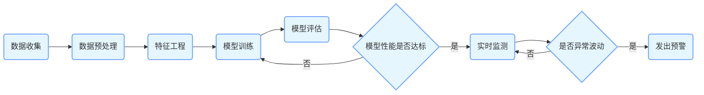

# AI驱动的金融市场异常波动预警系统

> 关键词：AI、金融市场、异常波动预警、机器学习、深度学习

> 摘要：本文围绕AI驱动的金融市场异常波动预警系统展开，深入探讨了其核心概念、算法原理、数学模型等内容。通过详细的Python代码示例和实际案例，阐述了该系统的开发与实现过程。同时，分析了系统在金融领域的实际应用场景，推荐了相关的学习资源、开发工具和研究论文。最后对系统的未来发展趋势与挑战进行了总结，并解答了常见问题。该预警系统利用AI技术能够更精准地捕捉金融市场的异常波动，为投资者和金融机构提供及时有效的预警信息，降低金融风险。

## 1. 背景介绍 
### 1.1 目的和范围
金融市场的异常波动往往伴随着巨大的风险，可能导致投资者的重大损失和金融机构的不稳定。传统的金融市场分析方法在面对复杂多变的市场环境时，往往难以准确及时地预警异常波动。本文章的目的是介绍一种基于AI技术的金融市场异常波动预警系统，旨在利用先进的机器学习和深度学习算法，更精准地识别和预测金融市场的异常波动情况。

本系统的范围涵盖了多种金融市场，如股票市场、债券市场、外汇市场等。通过对市场数据的收集、处理和分析，系统能够实时监测市场动态，并在出现异常波动时发出预警信号。

### 1.2 预期读者
本文的预期读者包括金融领域的从业者，如投资者、金融分析师、风险管理专家等，他们可以借助该预警系统更好地管理投资风险和制定投资策略。同时，也适合计算机科学和人工智能领域的研究人员和开发者，他们可以从中获取关于将AI技术应用于金融领域的灵感和实践经验。此外，对金融市场和人工智能感兴趣的学生和爱好者也能从本文中了解相关知识。

### 1.3 文档结构概述
本文将按照以下结构进行组织：首先介绍核心概念与联系，包括系统的原理和架构；接着阐述核心算法原理和具体操作步骤，并使用Python代码进行详细说明；然后介绍数学模型和公式，并举例说明；之后通过项目实战展示系统的实际开发过程，包括开发环境搭建、源代码实现和代码解读；再分析系统的实际应用场景；随后推荐相关的工具和资源；最后总结系统的未来发展趋势与挑战，解答常见问题，并提供扩展阅读和参考资料。

### 1.4 术语表
#### 1.4.1 核心术语定义
- **金融市场异常波动**：指金融市场的价格、交易量等指标在短期内出现超出正常范围的剧烈变化，可能由宏观经济因素、政策变化、突发事件等引起。
- **AI（人工智能）**：是一门研究如何使计算机能够模拟人类智能的学科，包括机器学习、深度学习、自然语言处理等技术。
- **机器学习**：是AI的一个分支，通过让计算机从数据中学习模式和规律，从而进行预测和决策。
- **深度学习**：是一种基于神经网络的机器学习技术，能够自动从大量数据中提取特征和模式，具有很强的学习能力。
- **预警系统**：是一种能够实时监测和分析数据，当出现异常情况时及时发出警报的系统。

#### 1.4.2 相关概念解释
- **数据预处理**：在将金融市场数据输入到AI模型之前，需要对数据进行清洗、归一化、特征提取等处理，以提高模型的性能和准确性。
- **特征工程**：是指从原始数据中提取和选择对模型有意义的特征，这些特征将作为模型的输入。
- **模型训练**：使用历史金融市场数据对AI模型进行训练，让模型学习数据中的模式和规律。
- **模型评估**：使用测试数据对训练好的模型进行评估，以衡量模型的性能和准确性。

#### 1.4.3 缩略词列表
- **AI**：Artificial Intelligence（人工智能）
- **ML**：Machine Learning（机器学习）
- **DL**：Deep Learning（深度学习）
- **RNN**：Recurrent Neural Network（循环神经网络）
- **LSTM**：Long Short-Term Memory（长短期记忆网络）
- **GRU**：Gated Recurrent Unit（门控循环单元）

## 2. 核心概念与联系 

### 核心概念原理
AI驱动的金融市场异常波动预警系统的核心原理是利用AI技术对金融市场数据进行分析和建模，从而识别和预测市场的异常波动。具体来说，系统首先收集金融市场的历史数据和实时数据，包括股票价格、交易量、利率等。然后对数据进行预处理和特征工程，提取对异常波动有指示作用的特征。接着使用机器学习或深度学习算法对处理后的数据进行训练，构建预警模型。最后，将实时数据输入到训练好的模型中，模型根据学习到的模式和规律判断市场是否出现异常波动，并发出相应的预警信号。

### 架构示意图
下面是该预警系统的架构示意图：


该架构主要包括以下几个部分：
1. **数据收集**：从各种数据源收集金融市场的历史数据和实时数据。
2. **数据预处理**：对收集到的数据进行清洗、归一化等处理，以提高数据质量。
3. **特征工程**：从预处理后的数据中提取和选择对异常波动有指示作用的特征。
4. **模型训练**：使用特征数据对AI模型进行训练，让模型学习数据中的模式和规律。
5. **模型评估**：使用测试数据对训练好的模型进行评估，衡量模型的性能。
6. **实时监测**：将实时数据输入到训练好的模型中，判断市场是否出现异常波动。
7. **发出预警**：当模型判断市场出现异常波动时，及时发出预警信号。

## 3. 核心算法原理 & 具体操作步骤 

### 核心算法原理
在本预警系统中，我们可以使用多种机器学习和深度学习算法，如支持向量机（SVM）、随机森林（Random Forest）、循环神经网络（RNN）及其变体（LSTM、GRU）等。下面以LSTM为例，介绍其核心算法原理。

LSTM是一种特殊的RNN，能够解决传统RNN在处理长序列数据时的梯度消失和梯度爆炸问题。LSTM的核心结构是记忆单元（Cell），它通过三个门控机制（输入门、遗忘门、输出门）来控制信息的流入、流出和保留。

- **遗忘门**：决定上一时刻的记忆单元状态 $C_{t-1}$ 中有多少信息需要被遗忘。遗忘门的输出 $f_t$ 由上一时刻的隐藏状态 $h_{t-1}$ 和当前时刻的输入 $x_t$ 经过一个sigmoid函数计算得到：
$$f_t = \sigma(W_f[h_{t-1}, x_t] + b_f)$$
其中，$W_f$ 是遗忘门的权重矩阵，$b_f$ 是遗忘门的偏置向量，$\sigma$ 是sigmoid函数。

- **输入门**：决定当前时刻的输入 $x_t$ 中有多少信息需要被添加到记忆单元中。输入门的输出 $i_t$ 和候选记忆单元状态 $\tilde{C}_t$ 分别计算如下：
$$i_t = \sigma(W_i[h_{t-1}, x_t] + b_i)$$
$$\tilde{C}_t = \tanh(W_C[h_{t-1}, x_t] + b_C)$$
其中，$W_i$ 和 $W_C$ 分别是输入门和候选记忆单元状态的权重矩阵，$b_i$ 和 $b_C$ 分别是它们的偏置向量，$\tanh$ 是双曲正切函数。

- **记忆单元更新**：根据遗忘门和输入门的输出，更新记忆单元状态 $C_t$：
$$C_t = f_t \odot C_{t-1} + i_t \odot \tilde{C}_t$$
其中，$\odot$ 表示逐元素相乘。

- **输出门**：决定当前时刻的记忆单元状态 $C_t$ 中有多少信息需要被输出到隐藏状态 $h_t$ 中。输出门的输出 $o_t$ 和当前时刻的隐藏状态 $h_t$ 分别计算如下：
$$o_t = \sigma(W_o[h_{t-1}, x_t] + b_o)$$
$$h_t = o_t \odot \tanh(C_t)$$
其中，$W_o$ 是输出门的权重矩阵，$b_o$ 是输出门的偏置向量。

### 具体操作步骤
下面是使用Python和Keras库实现一个简单的LSTM模型进行金融市场异常波动预警的具体操作步骤：

```python
import numpy as np
import pandas as pd
from keras.models import Sequential
from keras.layers import LSTM, Dense
from sklearn.preprocessing import MinMaxScaler

# 步骤1：数据收集与预处理
# 假设我们有一个包含股票价格的CSV文件
data = pd.read_csv('stock_prices.csv')
prices = data['Close'].values.reshape(-1, 1)

# 数据归一化
scaler = MinMaxScaler(feature_range=(0, 1))
scaled_prices = scaler.fit_transform(prices)

# 划分训练集和测试集
train_size = int(len(scaled_prices) * 0.8)
train_data = scaled_prices[:train_size]
test_data = scaled_prices[train_size:]

# 步骤2：准备训练数据
def create_dataset(dataset, time_step=1):
    X, Y = [], []
    for i in range(len(dataset)-time_step-1):
        a = dataset[i:(i+time_step), 0]
        X.append(a)
        Y.append(dataset[i + time_step, 0])
    return np.array(X), np.array(Y)

time_step = 100
X_train, y_train = create_dataset(train_data, time_step)
X_test, y_test = create_dataset(test_data, time_step)

# 调整输入数据的形状以适应LSTM模型
X_train = X_train.reshape(X_train.shape[0], X_train.shape[1], 1)
X_test = X_test.reshape(X_test.shape[0], X_test.shape[1], 1)

# 步骤3：构建LSTM模型
model = Sequential()
model.add(LSTM(50, return_sequences=True, input_shape=(time_step, 1)))
model.add(LSTM(50, return_sequences=True))
model.add(LSTM(50))
model.add(Dense(1))
model.compile(optimizer='adam', loss='mean_squared_error')

# 步骤4：模型训练
model.fit(X_train, y_train, epochs=100, batch_size=64, verbose=1)

# 步骤5：模型预测
train_predict = model.predict(X_train)
test_predict = model.predict(X_test)

# 反归一化
train_predict = scaler.inverse_transform(train_predict)
test_predict = scaler.inverse_transform(test_predict)

# 步骤6：异常波动预警
# 假设异常波动定义为预测价格与实际价格的差异超过一定阈值
threshold = 0.1
for i in range(len(test_predict)):
    actual_price = scaler.inverse_transform(test_data[i + time_step].reshape(-1, 1))
    if abs(test_predict[i] - actual_price) > threshold * actual_price:
        print(f"第 {i} 个时间步出现异常波动！")
```

### 代码解释
1. **数据收集与预处理**：读取包含股票价格的CSV文件，并使用MinMaxScaler对数据进行归一化处理。然后将数据划分为训练集和测试集。
2. **准备训练数据**：定义一个函数 `create_dataset` 来创建训练数据和标签。将时间序列数据转换为适合LSTM模型输入的格式。
3. **构建LSTM模型**：使用Keras的Sequential模型构建一个包含三个LSTM层和一个全连接层的神经网络。
4. **模型训练**：使用训练数据对模型进行训练，设置训练的轮数和批量大小。
5. **模型预测**：使用训练好的模型对训练集和测试集进行预测，并将预测结果反归一化。
6. **异常波动预警**：定义一个阈值，当预测价格与实际价格的差异超过该阈值时，认为出现异常波动并发出预警。

## 4. 数学模型和公式 & 详细讲解 & 举例说明 

### 损失函数
在训练LSTM模型时，我们使用均方误差（Mean Squared Error, MSE）作为损失函数。均方误差的计算公式如下：
$$MSE = \frac{1}{n} \sum_{i=1}^{n} (y_i - \hat{y}_i)^2$$
其中，$n$ 是样本数量，$y_i$ 是实际值，$\hat{y}_i$ 是预测值。

均方误差衡量了预测值与实际值之间的平均平方误差，其值越小，说明模型的预测效果越好。

### 优化算法
在上述代码中，我们使用Adam优化算法来更新模型的参数。Adam是一种自适应学习率的优化算法，结合了Adagrad和RMSProp的优点。Adam的更新公式如下：

- 计算梯度的一阶矩估计（均值）：
$$m_t = \beta_1 m_{t-1} + (1 - \beta_1) g_t$$
- 计算梯度的二阶矩估计（方差）：
$$v_t = \beta_2 v_{t-1} + (1 - \beta_2) g_t^2$$
- 修正一阶矩和二阶矩的偏差：
$$\hat{m}_t = \frac{m_t}{1 - \beta_1^t}$$
$$\hat{v}_t = \frac{v_t}{1 - \beta_2^t}$$
- 更新模型参数：
$$\theta_{t+1} = \theta_t - \frac{\alpha}{\sqrt{\hat{v}_t} + \epsilon} \hat{m}_t$$
其中，$g_t$ 是当前时刻的梯度，$\beta_1$ 和 $\beta_2$ 是衰减率，通常分别设置为0.9和0.999，$\alpha$ 是学习率，$\epsilon$ 是一个很小的常数，用于防止除零错误。

### 举例说明
假设我们有一个简单的数据集，包含5个样本的实际值 $y = [1, 2, 3, 4, 5]$ 和预测值 $\hat{y} = [1.2, 1.8, 3.1, 3.9, 5.2]$。则均方误差的计算如下：

$$MSE = \frac{1}{5}[(1 - 1.2)^2 + (2 - 1.8)^2 + (3 - 3.1)^2 + (4 - 3.9)^2 + (5 - 5.2)^2]$$
$$= \frac{1}{5}[(-0.2)^2 + 0.2^2 + (-0.1)^2 + 0.1^2 + (-0.2)^2]$$
$$= \frac{1}{5}[0.04 + 0.04 + 0.01 + 0.01 + 0.04]$$
$$= \frac{0.14}{5} = 0.028$$

这个结果表示预测值与实际值之间的平均平方误差为0.028。

## 5. 项目实战：代码实际案例和详细解释说明 

### 5.1  开发环境搭建
为了实现AI驱动的金融市场异常波动预警系统，我们需要搭建以下开发环境：

#### 操作系统
推荐使用Linux或Windows操作系统，本项目在Ubuntu 20.04和Windows 10上进行了测试。

#### Python环境
安装Python 3.7或以上版本，可以从Python官方网站（https://www.python.org/downloads/）下载安装包进行安装。

#### 依赖库安装
使用pip工具安装以下依赖库：
```bash
pip install numpy pandas keras tensorflow scikit-learn matplotlib
```
- **numpy**：用于进行数值计算。
- **pandas**：用于数据处理和分析。
- **keras**：用于构建和训练深度学习模型。
- **tensorflow**：Keras的后端引擎。
- **scikit-learn**：用于数据预处理和模型评估。
- **matplotlib**：用于数据可视化。

### 5.2  源代码详细实现和代码解读
下面是一个完整的AI驱动的金融市场异常波动预警系统的源代码示例：

```python
import numpy as np
import pandas as pd
from keras.models import Sequential
from keras.layers import LSTM, Dense
from sklearn.preprocessing import MinMaxScaler
import matplotlib.pyplot as plt

# 步骤1：数据收集与预处理
def load_and_preprocess_data(file_path):
    data = pd.read_csv(file_path)
    prices = data['Close'].values.reshape(-1, 1)
    scaler = MinMaxScaler(feature_range=(0, 1))
    scaled_prices = scaler.fit_transform(prices)
    return scaled_prices, scaler

# 步骤2：准备训练数据
def create_dataset(dataset, time_step=1):
    X, Y = [], []
    for i in range(len(dataset)-time_step-1):
        a = dataset[i:(i+time_step), 0]
        X.append(a)
        Y.append(dataset[i + time_step, 0])
    return np.array(X), np.array(Y)

# 步骤3：构建LSTM模型
def build_lstm_model(time_step):
    model = Sequential()
    model.add(LSTM(50, return_sequences=True, input_shape=(time_step, 1)))
    model.add(LSTM(50, return_sequences=True))
    model.add(LSTM(50))
    model.add(Dense(1))
    model.compile(optimizer='adam', loss='mean_squared_error')
    return model

# 步骤4：模型训练与预测
def train_and_predict(model, X_train, y_train, X_test):
    model.fit(X_train, y_train, epochs=100, batch_size=64, verbose=1)
    train_predict = model.predict(X_train)
    test_predict = model.predict(X_test)
    return train_predict, test_predict

# 步骤5：反归一化
def inverse_transform_predictions(train_predict, test_predict, scaler):
    train_predict = scaler.inverse_transform(train_predict)
    test_predict = scaler.inverse_transform(test_predict)
    return train_predict, test_predict

# 步骤6：异常波动预警
def detect_anomalies(test_predict, test_data, scaler, threshold=0.1):
    anomalies = []
    for i in range(len(test_predict)):
        actual_price = scaler.inverse_transform(test_data[i + time_step].reshape(-1, 1))
        if abs(test_predict[i] - actual_price) > threshold * actual_price:
            anomalies.append(i)
    return anomalies

# 步骤7：数据可视化
def plot_results(prices, train_predict, test_predict, train_size):
    plt.plot(prices, label='Actual Prices')
    look_back = len(train_predict)
    trainPredictPlot = np.empty_like(prices)
    trainPredictPlot[:, :] = np.nan
    trainPredictPlot[look_back - len(train_predict):look_back, :] = train_predict
    testPredictPlot = np.empty_like(prices)
    testPredictPlot[:, :] = np.nan
    testPredictPlot[look_back:, :] = test_predict
    plt.plot(trainPredictPlot, label='Train Predictions')
    plt.plot(testPredictPlot, label='Test Predictions')
    plt.legend()
    plt.show()

# 主函数
if __name__ == "__main__":
    file_path = 'stock_prices.csv'
    scaled_prices, scaler = load_and_preprocess_data(file_path)
    train_size = int(len(scaled_prices) * 0.8)
    train_data = scaled_prices[:train_size]
    test_data = scaled_prices[train_size:]
    time_step = 100
    X_train, y_train = create_dataset(train_data, time_step)
    X_test, y_test = create_dataset(test_data, time_step)
    X_train = X_train.reshape(X_train.shape[0], X_train.shape[1], 1)
    X_test = X_test.reshape(X_test.shape[0], X_test.shape[1], 1)
    model = build_lstm_model(time_step)
    train_predict, test_predict = train_and_predict(model, X_train, y_train, X_test)
    train_predict, test_predict = inverse_transform_predictions(train_predict, test_predict, scaler)
    anomalies = detect_anomalies(test_predict, test_data, scaler)
    print("异常波动的时间步：", anomalies)
    prices = scaler.inverse_transform(scaled_prices)
    plot_results(prices, train_predict, test_predict, train_size)
```

### 代码解读与分析
1. **数据收集与预处理**：`load_and_preprocess_data` 函数读取CSV文件中的股票价格数据，并使用MinMaxScaler对数据进行归一化处理。
2. **准备训练数据**：`create_dataset` 函数将时间序列数据转换为适合LSTM模型输入的格式，即输入序列和对应的标签。
3. **构建LSTM模型**：`build_lstm_model` 函数使用Keras构建一个包含三个LSTM层和一个全连接层的神经网络，并使用Adam优化算法和均方误差损失函数进行编译。
4. **模型训练与预测**：`train_and_predict` 函数使用训练数据对模型进行训练，并对训练集和测试集进行预测。
5. **反归一化**：`inverse_transform_predictions` 函数将预测结果反归一化，得到实际的股票价格。
6. **异常波动预警**：`detect_anomalies` 函数根据预测价格与实际价格的差异判断是否出现异常波动，并记录异常波动的时间步。
7. **数据可视化**：`plot_results` 函数将实际价格、训练集预测结果和测试集预测结果绘制在同一张图上，方便直观观察。

## 6. 实际应用场景 
AI驱动的金融市场异常波动预警系统在金融领域有广泛的应用场景，以下是一些常见的应用场景：

### 投资者风险管理
对于个人投资者和机构投资者来说，该预警系统可以帮助他们及时发现金融市场的异常波动，从而采取相应的风险管理措施。例如，当系统发出异常波动预警时，投资者可以及时调整投资组合，减少风险暴露。

### 金融机构监管
金融监管机构可以利用该预警系统实时监测金融市场的稳定性，及时发现潜在的风险隐患。当市场出现异常波动时，监管机构可以采取相应的监管措施，如调整货币政策、加强市场监管等，以维护金融市场的稳定。

### 量化投资策略优化
量化投资策略通常依赖于对金融市场数据的分析和建模。该预警系统可以为量化投资策略提供实时的市场异常波动信息，帮助策略开发者及时调整策略参数，提高策略的盈利能力和稳定性。

### 金融产品设计
金融机构在设计金融产品时，可以参考该预警系统的结果，合理设置产品的风险收益特征。例如，对于一些风险较高的金融产品，可以设置更加严格的止损机制，以保护投资者的利益。

## 7. 工具和资源推荐
### 7.1 学习资源推荐
#### 7.1.1 书籍推荐
- 《Python机器学习》：本书介绍了使用Python进行机器学习的基本概念和方法，包括数据预处理、模型选择、评估等内容。
- 《深度学习》：由深度学习领域的三位顶尖专家撰写，全面介绍了深度学习的理论和实践。
- 《金融时间序列分析》：详细介绍了金融时间序列数据的分析方法和模型，对于理解金融市场数据有很大帮助。

#### 7.1.2 在线课程
- Coursera上的“机器学习”课程：由斯坦福大学教授Andrew Ng讲授，是机器学习领域的经典课程。
- edX上的“深度学习”课程：由多家知名高校联合推出，涵盖了深度学习的各个方面。
- Udemy上的“Python金融数据分析”课程：专门介绍了使用Python进行金融数据分析的方法和技巧。

#### 7.1.3 技术博客和网站
- Towards Data Science：是一个专注于数据科学和机器学习的博客平台，上面有很多优秀的技术文章和案例分析。
- Medium：是一个综合性的博客平台，有很多关于金融科技和人工智能的文章。
- Kaggle：是一个数据科学竞赛平台，上面有很多金融市场数据集和相关的竞赛项目，可以通过参与竞赛来提高自己的技能。

### 7.2 开发工具框架推荐
#### 7.2.1 IDE和编辑器
- PyCharm：是一款专门为Python开发设计的集成开发环境，具有强大的代码编辑、调试和项目管理功能。
- Jupyter Notebook：是一个交互式的笔记本环境，适合进行数据探索和模型实验。
- Visual Studio Code：是一款轻量级的代码编辑器，支持多种编程语言和插件扩展，非常适合快速开发。

#### 7.2.2 调试和性能分析工具
- TensorBoard：是TensorFlow的可视化工具，可以用于监控模型的训练过程、查看模型的结构和性能指标等。
- Py-Spy：是一个Python性能分析工具，可以用于分析Python程序的CPU使用率和内存占用情况。
- cProfile：是Python标准库中的性能分析模块，可以用于分析Python程序的函数调用时间和调用次数。

#### 7.2.3 相关框架和库
- TensorFlow：是一个开源的深度学习框架，提供了丰富的工具和接口，用于构建和训练各种深度学习模型。
- PyTorch：是另一个流行的深度学习框架，具有动态图机制，适合快速开发和实验。
- Scikit-learn：是一个用于机器学习的Python库，提供了各种机器学习算法和工具，如数据预处理、模型选择、评估等。

### 7.3 相关论文著作推荐
#### 7.3.1 经典论文
- “Long Short-Term Memory”：由Sepp Hochreiter和Jürgen Schmidhuber发表，介绍了LSTM的基本原理和结构。
- “Gradient-based learning applied to document recognition”：由Yann LeCun等人发表，提出了卷积神经网络（CNN）的概念，对深度学习的发展产生了重要影响。
- “A Decision-Theoretic Generalization of On-Line Learning and an Application to Boosting”：由Yoav Freund和Robert E. Schapire发表，提出了AdaBoost算法，是集成学习领域的经典论文。

#### 7.3.2 最新研究成果
- 关注顶级学术会议，如NeurIPS（神经信息处理系统大会）、ICML（国际机器学习会议）、KDD（知识发现与数据挖掘会议）等，这些会议上会发布很多关于金融市场和人工智能的最新研究成果。
- 查阅顶级学术期刊，如Journal of Financial Economics、Journal of Financial and Quantitative Analysis等，这些期刊上发表的论文具有较高的学术水平和影响力。

#### 7.3.3 应用案例分析
- 可以参考一些知名金融机构和科技公司的研究报告和案例分析，了解他们在金融市场异常波动预警方面的实践经验和成果。例如，摩根大通、高盛等金融机构的研究报告，以及谷歌、微软等科技公司的技术博客。

## 8. 总结：未来发展趋势与挑战
### 未来发展趋势
- **多模态数据融合**：未来的预警系统将不仅仅依赖于金融市场的价格和交易量数据，还会融合新闻资讯、社交媒体数据、宏观经济数据等多模态数据，以更全面地了解市场动态，提高预警的准确性。
- **强化学习应用**：强化学习可以在动态的金融市场环境中进行决策优化。未来的预警系统可能会引入强化学习算法，根据市场的实时反馈不断调整预警策略，提高系统的适应性和灵活性。
- **可解释性AI**：随着AI技术在金融领域的广泛应用，对模型可解释性的需求越来越高。未来的预警系统将更加注重模型的可解释性，以便金融从业者能够理解模型的决策过程，增强对系统的信任。
- **云服务与分布式计算**：为了处理大规模的金融市场数据和提高系统的计算效率，未来的预警系统将更多地采用云服务和分布式计算技术，实现数据的高效存储和处理。

### 挑战
- **数据质量与隐私保护**：金融市场数据往往存在噪声、缺失值等问题，数据质量的好坏直接影响预警系统的性能。同时，金融数据涉及大量的敏感信息，如何在保证数据质量的前提下，保护数据的隐私和安全是一个重要的挑战。
- **模型过拟合与泛化能力**：由于金融市场的复杂性和不确定性，模型容易出现过拟合现象，即在训练数据上表现良好，但在测试数据和实际应用中表现不佳。如何提高模型的泛化能力，使其能够适应不同的市场环境，是需要解决的问题。
- **市场变化的不确定性**：金融市场受到多种因素的影响，如宏观经济政策、突发事件等，市场变化具有很大的不确定性。预警系统需要具备快速适应市场变化的能力，及时调整预警策略。
- **监管与合规要求**：金融行业受到严格的监管，预警系统的开发和应用需要符合相关的监管要求和合规标准。如何在满足监管要求的前提下，发挥预警系统的作用，是金融机构和开发者需要面对的挑战。

## 9. 附录：常见问题与解答
### 问题1：如何选择合适的AI算法用于金融市场异常波动预警？
答：选择合适的AI算法需要考虑多个因素，如数据的特点、问题的复杂度、计算资源等。对于时间序列数据，如金融市场价格数据，循环神经网络（RNN）及其变体（LSTM、GRU）通常是比较合适的选择，因为它们能够处理序列数据中的长期依赖关系。此外，支持向量机（SVM）、随机森林（Random Forest）等传统机器学习算法也可以用于异常检测任务，可以根据具体情况进行尝试和比较。

### 问题2：如何评估预警系统的性能？
答：可以使用多种指标来评估预警系统的性能，如准确率（Accuracy）、召回率（Recall）、F1值（F1-Score）、均方误差（MSE）等。准确率衡量了模型预测正确的样本比例；召回率衡量了模型正确预测出的正样本比例；F1值是准确率和召回率的调和平均值，综合考虑了两者的性能；均方误差用于衡量预测值与实际值之间的平均平方误差，适用于回归问题。

### 问题3：如何处理金融市场数据中的缺失值和异常值？
答：对于缺失值，可以采用插值法（如线性插值、多项式插值）、均值填充、中位数填充等方法进行处理。对于异常值，可以使用统计方法（如Z-score方法）或基于机器学习的方法（如孤立森林、One-Class SVM）进行检测和处理。在处理异常值时，需要谨慎判断，避免误删正常的数据点。

### 问题4：预警系统的阈值应该如何设置？
答：预警系统的阈值设置需要根据具体的应用场景和需求进行调整。可以通过历史数据进行实验和分析，找到一个合适的阈值，使得预警系统在准确率和召回率之间达到一个较好的平衡。此外，也可以采用动态阈值的方法，根据市场的实时情况自动调整阈值。

## 10. 扩展阅读 & 参考资料
- 《人工智能：现代方法》
- 《Python深度学习》
- https://www.tensorflow.org/
- https://pytorch.org/
- https://scikit-learn.org/

作者：AI天才研究院/AI Genius Institute & 禅与计算机程序设计艺术 /Zen And The Art of Computer Programming