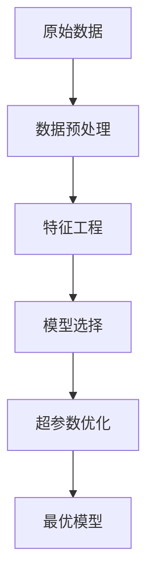

# AutoML：自动化AI Agent的模型选择与优化

> 关键词：AutoML、自动化、AI Agent、模型选择、模型优化

> 摘要：本文围绕AutoML（自动化机器学习）在AI Agent中的模型选择与优化展开。详细介绍了AutoML的背景知识，包括目的、预期读者、文档结构和相关术语。阐述了AutoML的核心概念与联系，给出了原理和架构的文本示意图以及Mermaid流程图。深入讲解了核心算法原理，并使用Python代码进行详细阐述，同时介绍了相关的数学模型和公式。通过项目实战，展示了开发环境搭建、源代码实现和代码解读。探讨了AutoML在实际中的应用场景，推荐了学习资源、开发工具框架和相关论文著作。最后总结了AutoML的未来发展趋势与挑战，并提供了常见问题的解答和扩展阅读参考资料。

## 1. 背景介绍 

### 1.1 目的和范围
在当今人工智能快速发展的时代，AI Agent的应用越来越广泛。然而，构建一个高效的AI Agent需要进行大量的模型选择和优化工作，这对于开发者来说是一项繁琐且具有挑战性的任务。AutoML的出现旨在自动化这个过程，减少人工干预，提高开发效率。本文的目的是深入探讨AutoML在AI Agent模型选择与优化中的应用，涵盖从基本概念到实际项目应用的各个方面。

### 1.2 预期读者
本文适合对人工智能、机器学习有一定基础，想要深入了解AutoML技术的开发者、研究人员和数据科学家。同时，对于希望将AutoML应用到实际项目中的企业技术人员也具有参考价值。

### 1.3 文档结构概述
本文首先介绍AutoML的背景知识，包括目的、预期读者、文档结构和相关术语。接着阐述AutoML的核心概念与联系，给出原理和架构的文本示意图以及Mermaid流程图。然后深入讲解核心算法原理，并使用Python代码进行详细阐述，同时介绍相关的数学模型和公式。通过项目实战，展示开发环境搭建、源代码实现和代码解读。探讨AutoML在实际中的应用场景，推荐学习资源、开发工具框架和相关论文著作。最后总结AutoML的未来发展趋势与挑战，并提供常见问题的解答和扩展阅读参考资料。

### 1.4 术语表

#### 1.4.1 核心术语定义
- **AutoML**：自动化机器学习，是一种能够自动完成机器学习流程中多个步骤的技术，包括数据预处理、特征工程、模型选择、超参数优化等。
- **AI Agent**：人工智能代理，是一种能够感知环境、做出决策并采取行动以实现特定目标的智能实体。
- **模型选择**：从众多可用的机器学习模型中选择最适合当前任务的模型。
- **模型优化**：对选定的模型进行调整和改进，以提高其性能。
- **超参数**：在模型训练之前需要手动设置的参数，如学习率、迭代次数等。

#### 1.4.2 相关概念解释
- **自动化流程**：AutoML通过自动化的方式完成机器学习流程中的各个步骤，减少人工干预，提高效率。
- **搜索空间**：在模型选择和超参数优化过程中，所有可能的模型和超参数组合构成的空间。
- **评估指标**：用于衡量模型性能的指标，如准确率、召回率、F1值等。

#### 1.4.3 缩略词列表
- **ML**：Machine Learning，机器学习
- **DL**：Deep Learning，深度学习
- **GPU**：Graphics Processing Unit，图形处理单元

## 2. 核心概念与联系 

### 核心概念原理
AutoML的核心原理是将机器学习流程中的各个步骤自动化，通过搜索算法在搜索空间中寻找最优的模型和超参数组合。其主要步骤包括数据预处理、特征工程、模型选择和超参数优化。

数据预处理是对原始数据进行清洗、转换和归一化等操作，以提高数据的质量和可用性。特征工程是从原始数据中提取有价值的特征，以增强模型的表达能力。模型选择是从众多可用的模型中选择最适合当前任务的模型。超参数优化是对选定的模型进行超参数调整，以提高其性能。

### 架构的文本示意图
```plaintext
+----------------+
|    原始数据    |
+----------------+
       |
       v
+----------------+
|  数据预处理    |
+----------------+
       |
       v
+----------------+
|  特征工程      |
+----------------+
       |
       v
+----------------+
|  模型选择      |
+----------------+
       |
       v
+----------------+
|  超参数优化    |
+----------------+
       |
       v
+----------------+
|  最优模型      |
+----------------+
```

### Mermaid流程图


## 3. 核心算法原理 & 具体操作步骤 

### 核心算法原理
AutoML中常用的搜索算法包括随机搜索、网格搜索、贝叶斯优化等。下面以贝叶斯优化为例，介绍其核心算法原理。

贝叶斯优化是一种基于概率模型的优化算法，它通过对目标函数的先验知识进行建模，不断更新后验分布，从而在搜索空间中寻找最优解。具体步骤如下：
1. 初始化：选择一个初始的超参数组合，并计算其目标函数值。
2. 建模：使用高斯过程等概率模型对目标函数进行建模。
3. 选择下一个点：根据后验分布选择下一个超参数组合，通常使用采集函数来平衡探索和利用。
4. 评估：计算新的超参数组合的目标函数值。
5. 更新模型：根据新的评估结果更新概率模型。
6. 重复步骤3-5，直到满足停止条件。

### Python源代码详细阐述
```python
import numpy as np
from scipy.stats import norm
from sklearn.gaussian_process import GaussianProcessRegressor
from sklearn.gaussian_process.kernels import Matern

def acquisition_function(x, model, y_max, xi=0.01):
    """
    采集函数，使用期望改进
    """
    mu, std = model.predict(x.reshape(-1, 1), return_std=True)
    Z = (mu - y_max - xi) / std
    ei = (mu - y_max - xi) * norm.cdf(Z) + std * norm.pdf(Z)
    return ei

def bayesian_optimization(objective_function, bounds, n_iter=10):
    """
    贝叶斯优化算法
    """
    # 初始化
    x_init = np.random.uniform(bounds[0], bounds[1], size=2).reshape(-1, 1)
    y_init = np.array([objective_function(x) for x in x_init])
    # 建模
    kernel = Matern(nu=2.5)
    model = GaussianProcessRegressor(kernel=kernel, n_restarts_optimizer=10)
    model.fit(x_init, y_init)
    # 迭代优化
    for i in range(n_iter):
        # 选择下一个点
        x_candidates = np.linspace(bounds[0], bounds[1], 100).reshape(-1, 1)
        ei = acquisition_function(x_candidates, model, y_init.max())
        x_next = x_candidates[np.argmax(ei)]
        # 评估
        y_next = objective_function(x_next)
        # 更新模型
        x_init = np.vstack((x_init, x_next))
        y_init = np.hstack((y_init, y_next))
        model.fit(x_init, y_init)
    # 返回最优解
    best_index = np.argmax(y_init)
    return x_init[best_index], y_init[best_index]

# 示例目标函数
def objective_function(x):
    return -np.sin(x) * np.exp(-0.1 * (x - 2) ** 2)

# 运行贝叶斯优化
bounds = [-5, 5]
best_x, best_y = bayesian_optimization(objective_function, bounds)
print(f"最优解: x = {best_x}, y = {best_y}")
```

### 具体操作步骤
1. 定义目标函数：根据具体的任务，定义需要优化的目标函数。
2. 确定搜索空间：确定超参数的取值范围。
3. 初始化：选择初始的超参数组合，并计算其目标函数值。
4. 建模：使用高斯过程等概率模型对目标函数进行建模。
5. 选择下一个点：根据采集函数选择下一个超参数组合。
6. 评估：计算新的超参数组合的目标函数值。
7. 更新模型：根据新的评估结果更新概率模型。
8. 重复步骤5-7，直到满足停止条件。
9. 返回最优解。

## 4. 数学模型和公式 & 详细讲解 & 举例说明 

### 高斯过程
高斯过程是一种概率模型，用于对函数进行建模。给定一组输入 $X = \{x_1, x_2, \cdots, x_n\}$ 和对应的输出 $Y = \{y_1, y_2, \cdots, y_n\}$，高斯过程假设 $Y$ 服从多元正态分布：
$$
Y \sim \mathcal{N}(\mu(X), K(X, X))
$$
其中，$\mu(X)$ 是均值函数，$K(X, X)$ 是协方差矩阵。协方差矩阵的元素 $K(x_i, x_j)$ 表示输入 $x_i$ 和 $x_j$ 之间的相关性。

### 采集函数
采集函数用于平衡探索和利用，常见的采集函数包括期望改进（Expected Improvement，EI）、置信上限（Upper Confidence Bound，UCB）等。以期望改进为例，其公式为：
$$
EI(x) = (\mu(x) - y_{max} - \xi) \Phi(Z) + \sigma(x) \phi(Z)
$$
其中，$\mu(x)$ 和 $\sigma(x)$ 分别是高斯过程在 $x$ 处的均值和标准差，$y_{max}$ 是当前找到的最优目标函数值，$\xi$ 是一个常数，用于平衡探索和利用，$\Phi(Z)$ 和 $\phi(Z)$ 分别是标准正态分布的累积分布函数和概率密度函数，$Z = \frac{\mu(x) - y_{max} - \xi}{\sigma(x)}$。

### 举例说明
假设我们要优化一个函数 $f(x) = - \sin(x) \exp(-0.1 (x - 2)^2)$，搜索空间为 $[-5, 5]$。我们可以使用贝叶斯优化算法来寻找最优解。

首先，我们定义目标函数和搜索空间：
```python
import numpy as np

def objective_function(x):
    return -np.sin(x) * np.exp(-0.1 * (x - 2) ** 2)

bounds = [-5, 5]
```

然后，我们使用前面介绍的贝叶斯优化算法来寻找最优解：
```python
best_x, best_y = bayesian_optimization(objective_function, bounds)
print(f"最优解: x = {best_x}, y = {best_y}")
```

通过不断迭代，贝叶斯优化算法会在搜索空间中寻找最优解。

## 5. 项目实战：代码实际案例和详细解释说明 

### 5.1  开发环境搭建
为了实现AutoML在AI Agent模型选择与优化的项目，我们需要搭建以下开发环境：
1. **Python环境**：建议使用Python 3.7及以上版本。
2. **必要的库**：安装`scikit-learn`、`scikit-optimize`、`pandas`、`numpy`等库。可以使用以下命令进行安装：
```bash
pip install scikit-learn scikit-optimize pandas numpy
```
3. **IDE**：推荐使用PyCharm或Jupyter Notebook，方便代码的编写和调试。

### 5.2  源代码详细实现和代码解读
以下是一个使用`scikit-optimize`库实现AutoML模型选择和超参数优化的示例代码：
```python
import numpy as np
import pandas as pd
from sklearn.datasets import load_iris
from sklearn.model_selection import train_test_split
from sklearn.ensemble import RandomForestClassifier
from sklearn.svm import SVC
from skopt import BayesSearchCV
from skopt.space import Real, Integer, Categorical

# 加载数据集
iris = load_iris()
X = iris.data
y = iris.target

# 划分训练集和测试集
X_train, X_test, y_train, y_test = train_test_split(X, y, test_size=0.2, random_state=42)

# 定义模型和超参数搜索空间
models = {
    'RandomForest': {
        'model': RandomForestClassifier(),
        'params': {
            'n_estimators': Integer(10, 100),
            'max_depth': Integer(3, 10),
            'min_samples_split': Integer(2, 10),
            'min_samples_leaf': Integer(1, 5)
        }
    },
    'SVC': {
        'model': SVC(),
        'params': {
            'C': Real(0.1, 10.0),
            'kernel': Categorical(['linear', 'rbf', 'poly']),
            'degree': Integer(2, 5)
        }
    }
}

# 进行模型选择和超参数优化
best_model = None
best_score = 0
for model_name, model_info in models.items():
    search = BayesSearchCV(
        model_info['model'],
        model_info['params'],
        n_iter=10,
        cv=3,
        scoring='accuracy'
    )
    search.fit(X_train, y_train)
    score = search.best_score_
    if score > best_score:
        best_score = score
        best_model = search.best_estimator_

# 评估最优模型
test_score = best_model.score(X_test, y_test)
print(f"最优模型: {best_model}")
print(f"训练集准确率: {best_score}")
print(f"测试集准确率: {test_score}")
```

### 代码解读与分析
1. **数据加载和划分**：使用`load_iris`函数加载鸢尾花数据集，并使用`train_test_split`函数将数据集划分为训练集和测试集。
2. **定义模型和超参数搜索空间**：定义了两个模型（随机森林和支持向量机）和它们的超参数搜索空间。使用`Integer`、`Real`和`Categorical`来定义不同类型的超参数。
3. **模型选择和超参数优化**：使用`BayesSearchCV`进行贝叶斯优化，对每个模型进行超参数搜索。选择最优的模型和超参数组合。
4. **评估最优模型**：使用测试集评估最优模型的性能，并输出训练集和测试集的准确率。

通过这个示例，我们可以看到如何使用AutoML技术进行模型选择和超参数优化，提高模型的性能。

## 6. 实际应用场景 
### 图像识别
在图像识别领域，AutoML可以自动选择合适的卷积神经网络（CNN）模型，并对其超参数进行优化。例如，在人脸识别系统中，AutoML可以帮助选择最适合的CNN架构，如ResNet、VGG等，并调整学习率、批量大小等超参数，以提高识别准确率。

### 自然语言处理
在自然语言处理任务中，如文本分类、情感分析等，AutoML可以自动选择合适的模型，如循环神经网络（RNN）、长短时记忆网络（LSTM）等，并进行超参数优化。这可以减少人工调参的时间和工作量，提高模型的性能。

### 医疗诊断
在医疗诊断领域，AutoML可以帮助医生从大量的医疗数据中选择合适的模型进行疾病诊断。例如，通过分析患者的病历、影像数据等，AutoML可以自动选择最适合的模型，并对其进行优化，以提高诊断的准确性和效率。

### 金融风险预测
在金融领域，AutoML可以用于风险预测，如信用评分、市场趋势预测等。通过对历史金融数据的分析，AutoML可以自动选择合适的模型，并进行超参数优化，以提高预测的准确性和可靠性。

## 7. 工具和资源推荐

### 7.1 学习资源推荐

#### 7.1.1 书籍推荐
- 《Automated Machine Learning: Methods, Systems, Challenges》：这本书全面介绍了AutoML的方法、系统和挑战，是学习AutoML的经典书籍。
- 《Hands-On Machine Learning with Scikit-Learn, Keras, and TensorFlow: Concepts, Tools, and Techniques to Build Intelligent Systems》：这本书详细介绍了机器学习的基础知识和实践方法，包括AutoML的相关内容。

#### 7.1.2 在线课程
- Coursera上的“Machine Learning”课程：由Andrew Ng教授授课，是学习机器学习的经典课程，也包含了AutoML的相关内容。
- edX上的“Deep Learning Specialization”课程：该课程深入介绍了深度学习的原理和应用，其中也涉及到AutoML在深度学习中的应用。

#### 7.1.3 技术博客和网站
- Towards Data Science：这是一个专注于数据科学和机器学习的博客平台，上面有很多关于AutoML的文章和教程。
- Kaggle：Kaggle是一个数据科学竞赛平台，上面有很多AutoML相关的竞赛和优秀解决方案，可以学习到很多实践经验。

### 7.2 开发工具框架推荐

#### 7.2.1 IDE和编辑器
- PyCharm：是一款专业的Python IDE，提供了丰富的代码编辑、调试和分析功能，非常适合开发AutoML项目。
- Jupyter Notebook：是一个交互式的开发环境，可以方便地进行代码编写、数据可视化和结果展示，适合进行AutoML的实验和研究。

#### 7.2.2 调试和性能分析工具
- TensorBoard：是TensorFlow提供的可视化工具，可以用于查看模型的训练过程、性能指标等，帮助进行调试和性能分析。
- Py-Spy：是一个Python性能分析工具，可以实时查看Python程序的CPU使用情况和函数调用栈，帮助找出性能瓶颈。

#### 7.2.3 相关框架和库
- Auto-Sklearn：是一个基于Scikit-Learn的AutoML框架，提供了自动化的模型选择和超参数优化功能。
- H2O AutoML：是一个开源的AutoML平台，支持多种机器学习算法和数据类型，具有高效的模型选择和超参数优化能力。

### 7.3 相关论文著作推荐

#### 7.3.1 经典论文
- 《Algorithms for Hyper-Parameter Optimization》：该论文介绍了几种常用的超参数优化算法，如随机搜索、网格搜索和贝叶斯优化等。
- 《Efficient and Robust Automated Machine Learning》：这篇论文提出了一种高效且鲁棒的AutoML方法，在多个数据集上取得了很好的效果。

#### 7.3.2 最新研究成果
- 关注顶级机器学习会议（如NeurIPS、ICML、CVPR等）上的相关论文，了解AutoML的最新研究进展。
- 在arXiv上搜索AutoML相关的预印本论文，获取最新的研究成果。

#### 7.3.3 应用案例分析
- 查看Kaggle上的优秀解决方案，了解AutoML在实际竞赛中的应用案例。
- 阅读企业的技术博客，了解AutoML在实际业务中的应用案例和经验分享。

## 8. 总结：未来发展趋势与挑战

### 未来发展趋势
- **集成更多的机器学习算法**：未来的AutoML系统将集成更多的机器学习算法，包括深度学习、强化学习等，以应对更复杂的任务。
- **与云计算和大数据结合**：AutoML将与云计算和大数据技术相结合，实现大规模数据的高效处理和模型训练。
- **自动化特征工程**：除了模型选择和超参数优化，未来的AutoML将更加注重自动化特征工程，提高数据的质量和可用性。
- **可解释性增强**：随着人工智能的广泛应用，对模型可解释性的需求越来越高。未来的AutoML系统将更加注重模型的可解释性，提供更清晰的决策依据。

### 挑战
- **计算资源需求高**：AutoML需要进行大量的模型选择和超参数优化，计算资源需求较高。如何在有限的计算资源下提高效率是一个挑战。
- **数据质量要求高**：AutoML的性能很大程度上依赖于数据的质量。如何处理噪声数据、缺失数据等问题是一个挑战。
- **模型可解释性**：虽然AutoML可以自动选择和优化模型，但模型的可解释性仍然是一个问题。如何让模型的决策过程更加透明和可解释是一个挑战。
- **领域知识融合**：不同的领域有不同的特点和需求，如何将领域知识融入到AutoML系统中，提高模型的性能和适用性是一个挑战。

## 9. 附录：常见问题与解答

### 问题1：AutoML可以完全替代人工吗？
答：虽然AutoML可以自动化很多机器学习流程，但目前还不能完全替代人工。人工在数据理解、问题定义、模型评估等方面仍然起着重要的作用。AutoML可以帮助减少人工干预，提高效率，但最终的决策还需要人工来做出。

### 问题2：AutoML适用于所有类型的数据集吗？
答：AutoML并不适用于所有类型的数据集。对于一些小规模、简单的数据集，手动选择模型和调整超参数可能更加高效。而对于大规模、复杂的数据集，AutoML可以发挥其优势，快速找到最优的模型和超参数组合。

### 问题3：如何选择合适的AutoML工具？
答：选择合适的AutoML工具需要考虑以下因素：
- **功能需求**：不同的AutoML工具提供的功能不同，需要根据自己的需求选择合适的工具。
- **数据类型和规模**：不同的AutoML工具对数据类型和规模的支持不同，需要选择适合自己数据的工具。
- **易用性**：选择易用性好的AutoML工具可以提高开发效率。
- **社区支持**：选择社区支持好的AutoML工具可以更容易获取帮助和资源。

### 问题4：AutoML的性能如何评估？
答：AutoML的性能可以通过以下指标进行评估：
- **准确率**：衡量模型预测结果的准确性。
- **召回率**：衡量模型正确预测正样本的比例。
- **F1值**：综合考虑准确率和召回率的指标。
- **训练时间**：衡量模型训练所需的时间。
- **资源消耗**：衡量模型训练所需的计算资源和内存资源。

## 10. 扩展阅读 & 参考资料
- 《Automated Machine Learning: Methods, Systems, Challenges》
- 《Hands-On Machine Learning with Scikit-Learn, Keras, and TensorFlow: Concepts, Tools, and Techniques to Build Intelligent Systems》
- Coursera上的“Machine Learning”课程
- edX上的“Deep Learning Specialization”课程
- Towards Data Science博客平台
- Kaggle数据科学竞赛平台
- Auto-Sklearn官方文档
- H2O AutoML官方文档
- 《Algorithms for Hyper-Parameter Optimization》
- 《Efficient and Robust Automated Machine Learning》

作者：AI天才研究院/AI Genius Institute & 禅与计算机程序设计艺术 /Zen And The Art of Computer Programming