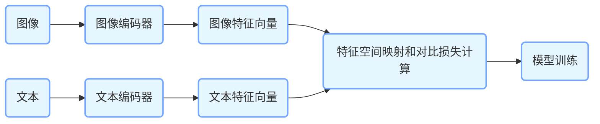

# CLIP模型：实现AI Agent的跨模态理解

> 关键词：CLIP模型、AI Agent、跨模态理解、对比学习、图像文本匹配

> 摘要：本文深入探讨了CLIP模型在实现AI Agent跨模态理解方面的应用。首先介绍了研究背景、目的和预期读者等信息，接着阐述了CLIP模型的核心概念、算法原理、数学模型。通过项目实战展示了CLIP模型的实际应用，包括开发环境搭建、代码实现与解读。还分析了CLIP模型的实际应用场景，推荐了相关的学习资源、开发工具和论文著作。最后总结了CLIP模型的未来发展趋势与挑战，并给出常见问题解答和参考资料，帮助读者全面了解CLIP模型及其在跨模态理解中的重要作用。

## 1. 背景介绍 
### 1.1 目的和范围
在人工智能领域，让AI Agent具备跨模态理解能力是一个重要的研究方向。跨模态理解意味着AI能够处理和关联不同类型的数据，如文本和图像。CLIP（Contrastive Language-Image Pretraining）模型为实现这一目标提供了有效的解决方案。本文的目的是深入剖析CLIP模型的原理、算法和应用，探讨其在实现AI Agent跨模态理解方面的关键作用。范围涵盖CLIP模型的核心概念、算法原理、数学模型、实际应用案例以及相关的学习资源和工具。

### 1.2 预期读者
本文适合对人工智能、计算机视觉、自然语言处理等领域感兴趣的研究人员、工程师和开发者。无论是初学者希望了解跨模态理解的基础知识，还是有一定经验的专业人士想要深入研究CLIP模型的细节，都能从本文中获得有价值的信息。

### 1.3 文档结构概述
本文将按照以下结构展开：首先介绍CLIP模型的核心概念和相关联系，包括其原理和架构；接着详细讲解CLIP模型的核心算法原理和具体操作步骤，并给出Python源代码示例；然后阐述CLIP模型的数学模型和公式，并进行详细讲解和举例说明；通过项目实战展示CLIP模型的实际应用，包括开发环境搭建、代码实现和解读；分析CLIP模型的实际应用场景；推荐相关的学习资源、开发工具和论文著作；最后总结CLIP模型的未来发展趋势与挑战，给出常见问题解答和参考资料。

### 1.4 术语表
#### 1.4.1 核心术语定义
- **CLIP模型**：一种基于对比学习的跨模态预训练模型，能够学习图像和文本之间的关联。
- **AI Agent**：人工智能代理，是一种能够感知环境、做出决策并采取行动的智能实体。
- **跨模态理解**：指AI系统能够处理和关联不同模态的数据，如文本、图像、音频等。
- **对比学习**：一种无监督学习方法，通过对比正样本和负样本之间的差异来学习特征表示。
- **图像文本匹配**：判断图像和文本是否描述了相同的内容。

#### 1.4.2 相关概念解释
- **预训练**：在大规模数据集上进行无监督学习，学习到通用的特征表示，然后在特定任务上进行微调。
- **特征表示**：将原始数据转换为低维向量的过程，使得数据在向量空间中具有可比较性。
- **模态**：指数据的类型，如文本、图像、音频等。

#### 1.4.3 缩略词列表
- **CLIP**：Contrastive Language-Image Pretraining
- **AI**：Artificial Intelligence
- **NLP**：Natural Language Processing
- **CV**：Computer Vision

## 2. 核心概念与联系 

### 核心概念原理
CLIP模型的核心思想是通过对比学习来学习图像和文本之间的关联。具体来说，CLIP模型同时对图像和文本进行编码，将它们映射到同一个特征空间中。在训练过程中，模型会尝试最大化图像和对应的文本在特征空间中的相似度，同时最小化图像和不对应的文本之间的相似度。

### 架构的文本示意图
CLIP模型主要由图像编码器和文本编码器两部分组成。图像编码器通常采用卷积神经网络（如ResNet）或视觉Transformer（如ViT），用于将图像转换为特征向量。文本编码器则使用Transformer架构，将文本转换为特征向量。两个编码器的输出会被映射到同一个特征空间中，然后通过对比损失函数进行训练。

```plaintext
+----------------+         +----------------+
| 图像编码器     |         | 文本编码器     |
| (ResNet/ViT)   |         | (Transformer)  |
+----------------+         +----------------+
         |                        |
         v                        v
+----------------+         +----------------+
| 图像特征向量   |         | 文本特征向量   |
+----------------+         +----------------+
         |                        |
         v                        v
+--------------------------------------+
| 特征空间映射和对比损失计算           |
+--------------------------------------+
```

### Mermaid流程图


## 3. 核心算法原理 & 具体操作步骤 

### 核心算法原理
CLIP模型的核心算法基于对比学习。在训练过程中，给定一个包含图像和文本对的数据集，模型会将图像和文本分别编码为特征向量。然后，模型会计算图像特征向量和文本特征向量之间的相似度得分。对于每个图像，其对应的文本应该具有最高的相似度得分，而与其他文本的相似度得分应该较低。

### 具体操作步骤
1. **数据准备**：收集包含图像和文本对的数据集，如Conceptual Captions、YFCC100M等。
2. **图像编码**：使用图像编码器（如ResNet或ViT）将图像转换为特征向量。
3. **文本编码**：使用文本编码器（如Transformer）将文本转换为特征向量。
4. **特征空间映射**：将图像特征向量和文本特征向量映射到同一个特征空间中。
5. **相似度计算**：计算图像特征向量和文本特征向量之间的相似度得分，通常使用余弦相似度。
6. **对比损失计算**：使用对比损失函数来最大化图像和对应的文本之间的相似度，同时最小化图像和不对应的文本之间的相似度。
7. **模型训练**：使用随机梯度下降等优化算法对模型进行训练。

### Python源代码示例
```python
import torch
import torch.nn as nn
import torch.optim as optim
from torchvision.models import resnet50
from transformers import GPT2Tokenizer, GPT2Model

# 定义图像编码器
class ImageEncoder(nn.Module):
    def __init__(self):
        super(ImageEncoder, self).__init__()
        self.resnet = resnet50(pretrained=True)
        self.resnet.fc = nn.Identity()  # 去掉最后一层全连接层

    def forward(self, images):
        return self.resnet(images)

# 定义文本编码器
class TextEncoder(nn.Module):
    def __init__(self):
        super(TextEncoder, self).__init__()
        self.tokenizer = GPT2Tokenizer.from_pretrained('gpt2')
        self.gpt2 = GPT2Model.from_pretrained('gpt2')

    def forward(self, texts):
        inputs = self.tokenizer(texts, return_tensors='pt', padding=True, truncation=True)
        outputs = self.gpt2(**inputs)
        return outputs.last_hidden_state.mean(dim=1)

# 定义CLIP模型
class CLIP(nn.Module):
    def __init__(self):
        super(CLIP, self).__init__()
        self.image_encoder = ImageEncoder()
        self.text_encoder = TextEncoder()
        self.temperature = nn.Parameter(torch.tensor(1.0))

    def forward(self, images, texts):
        image_features = self.image_encoder(images)
        text_features = self.text_encoder(texts)

        # 计算相似度得分
        logits_per_image = torch.matmul(image_features, text_features.t()) / self.temperature
        logits_per_text = logits_per_image.t()

        return logits_per_image, logits_per_text

# 定义对比损失函数
def contrastive_loss(logits_per_image, logits_per_text):
    labels = torch.arange(len(logits_per_image)).to(logits_per_image.device)
    loss_image = nn.CrossEntropyLoss()(logits_per_image, labels)
    loss_text = nn.CrossEntropyLoss()(logits_per_text, labels)
    return (loss_image + loss_text) / 2

# 初始化模型和优化器
model = CLIP()
optimizer = optim.Adam(model.parameters(), lr=1e-4)

# 模拟训练过程
images = torch.randn(4, 3, 224, 224)  # 模拟图像数据
texts = ["a cat", "a dog", "a bird", "a fish"]  # 模拟文本数据

for epoch in range(10):
    logits_per_image, logits_per_text = model(images, texts)
    loss = contrastive_loss(logits_per_image, logits_per_text)

    optimizer.zero_grad()
    loss.backward()
    optimizer.step()

    print(f'Epoch {epoch+1}, Loss: {loss.item()}')
```

## 4. 数学模型和公式 & 详细讲解 & 举例说明 

### 数学模型和公式
CLIP模型的核心是对比损失函数。假设我们有一个包含 $N$ 个图像 - 文本对的数据集 $\{(I_i, T_i)\}_{i=1}^N$，其中 $I_i$ 表示第 $i$ 个图像，$T_i$ 表示第 $i$ 个文本。

首先，我们将图像 $I_i$ 通过图像编码器 $E_I$ 编码为特征向量 $\mathbf{v}_I^i$，将文本 $T_i$ 通过文本编码器 $E_T$ 编码为特征向量 $\mathbf{v}_T^i$：

$$\mathbf{v}_I^i = E_I(I_i)$$
$$\mathbf{v}_T^i = E_T(T_i)$$

然后，我们计算图像特征向量和文本特征向量之间的相似度得分。通常使用余弦相似度：

$$s_{ij} = \frac{\mathbf{v}_I^i \cdot \mathbf{v}_T^j}{\|\mathbf{v}_I^i\| \|\mathbf{v}_T^j\|}$$

其中，$s_{ij}$ 表示第 $i$ 个图像和第 $j$ 个文本之间的相似度得分。

接下来，我们定义对比损失函数。对比损失函数的目标是最大化图像和对应的文本之间的相似度，同时最小化图像和不对应的文本之间的相似度。具体来说，我们使用交叉熵损失函数：

$$L_{image} = -\frac{1}{N} \sum_{i=1}^N \log \frac{\exp(s_{ii} / \tau)}{\sum_{j=1}^N \exp(s_{ij} / \tau)}$$
$$L_{text} = -\frac{1}{N} \sum_{i=1}^N \log \frac{\exp(s_{ii} / \tau)}{\sum_{j=1}^N \exp(s_{ji} / \tau)}$$

其中，$\tau$ 是温度参数，用于控制相似度得分的分布。最终的损失函数为：

$$L = \frac{L_{image} + L_{text}}{2}$$

### 详细讲解
- **特征编码**：图像编码器和文本编码器将图像和文本转换为特征向量，使得它们可以在同一个特征空间中进行比较。
- **相似度计算**：余弦相似度用于衡量两个特征向量之间的相似度，值越大表示越相似。
- **对比损失函数**：交叉熵损失函数用于最大化图像和对应的文本之间的相似度，同时最小化图像和不对应的文本之间的相似度。温度参数 $\tau$ 可以控制相似度得分的分布，使得模型更加关注相似度较高的样本。

### 举例说明
假设我们有一个包含 3 个图像 - 文本对的数据集：

| 图像 | 文本 |
| --- | --- |
| 图像 1：一只猫的图片 | 一只猫 |
| 图像 2：一只狗的图片 | 一只狗 |
| 图像 3：一只鸟的图片 | 一只鸟 |

我们将图像和文本分别编码为特征向量：

$$\mathbf{v}_I^1 = [0.2, 0.3, 0.4]$$
$$\mathbf{v}_I^2 = [0.5, 0.6, 0.7]$$
$$\mathbf{v}_I^3 = [0.8, 0.9, 1.0]$$
$$\mathbf{v}_T^1 = [0.21, 0.31, 0.41]$$
$$\mathbf{v}_T^2 = [0.51, 0.61, 0.71]$$
$$\mathbf{v}_T^3 = [0.81, 0.91, 1.01]$$

然后，我们计算相似度得分矩阵：

$$S = \begin{bmatrix}
s_{11} & s_{12} & s_{13} \\
s_{21} & s_{22} & s_{23} \\
s_{31} & s_{32} & s_{33}
\end{bmatrix}$$

假设温度参数 $\tau = 1$，我们可以计算出损失函数 $L_{image}$ 和 $L_{text}$，然后取平均值得到最终的损失函数 $L$。通过不断迭代优化，模型会学习到图像和文本之间的关联，使得对应的图像和文本在特征空间中的相似度得分更高。

## 5. 项目实战：代码实际案例和详细解释说明 

### 5.1  开发环境搭建
#### 安装Python和必要的库
首先，确保你已经安装了Python 3.6或更高版本。然后，使用以下命令安装必要的库：

```bash
pip install torch torchvision transformers
```

#### 下载预训练模型
可以使用Hugging Face的 `transformers` 库下载预训练的文本编码器，使用 `torchvision` 库下载预训练的图像编码器。

### 5.2  源代码详细实现和代码解读
```python
import torch
import torch.nn as nn
import torch.optim as optim
from torchvision.models import resnet50
from transformers import GPT2Tokenizer, GPT2Model

# 定义图像编码器
class ImageEncoder(nn.Module):
    def __init__(self):
        super(ImageEncoder, self).__init__()
        self.resnet = resnet50(pretrained=True)
        self.resnet.fc = nn.Identity()  # 去掉最后一层全连接层

    def forward(self, images):
        return self.resnet(images)

# 定义文本编码器
class TextEncoder(nn.Module):
    def __init__(self):
        super(TextEncoder, self).__init__()
        self.tokenizer = GPT2Tokenizer.from_pretrained('gpt2')
        self.gpt2 = GPT2Model.from_pretrained('gpt2')

    def forward(self, texts):
        inputs = self.tokenizer(texts, return_tensors='pt', padding=True, truncation=True)
        outputs = self.gpt2(**inputs)
        return outputs.last_hidden_state.mean(dim=1)

# 定义CLIP模型
class CLIP(nn.Module):
    def __init__(self):
        super(CLIP, self).__init__()
        self.image_encoder = ImageEncoder()
        self.text_encoder = TextEncoder()
        self.temperature = nn.Parameter(torch.tensor(1.0))

    def forward(self, images, texts):
        image_features = self.image_encoder(images)
        text_features = self.text_encoder(texts)

        # 计算相似度得分
        logits_per_image = torch.matmul(image_features, text_features.t()) / self.temperature
        logits_per_text = logits_per_image.t()

        return logits_per_image, logits_per_text

# 定义对比损失函数
def contrastive_loss(logits_per_image, logits_per_text):
    labels = torch.arange(len(logits_per_image)).to(logits_per_image.device)
    loss_image = nn.CrossEntropyLoss()(logits_per_image, labels)
    loss_text = nn.CrossEntropyLoss()(logits_per_text, labels)
    return (loss_image + loss_text) / 2

# 初始化模型和优化器
model = CLIP()
optimizer = optim.Adam(model.parameters(), lr=1e-4)

# 模拟训练过程
images = torch.randn(4, 3, 224, 224)  # 模拟图像数据
texts = ["a cat", "a dog", "a bird", "a fish"]  # 模拟文本数据

for epoch in range(10):
    logits_per_image, logits_per_text = model(images, texts)
    loss = contrastive_loss(logits_per_image, logits_per_text)

    optimizer.zero_grad()
    loss.backward()
    optimizer.step()

    print(f'Epoch {epoch+1}, Loss: {loss.item()}')
```

### 代码解读与分析
- **图像编码器**：使用预训练的ResNet-50模型作为图像编码器，去掉最后一层全连接层，以获取图像的特征向量。
- **文本编码器**：使用预训练的GPT-2模型作为文本编码器，将文本转换为特征向量。
- **CLIP模型**：将图像编码器和文本编码器组合在一起，计算图像特征向量和文本特征向量之间的相似度得分。
- **对比损失函数**：使用交叉熵损失函数来最大化图像和对应的文本之间的相似度，同时最小化图像和不对应的文本之间的相似度。
- **训练过程**：使用随机梯度下降算法对模型进行训练，不断迭代优化模型参数，使得损失函数逐渐减小。

## 6. 实际应用场景 
### 图像检索
CLIP模型可以用于图像检索任务。给定一个文本查询，模型可以计算文本特征向量和图像特征向量之间的相似度得分，然后根据相似度得分对图像进行排序，返回与查询文本最相关的图像。

### 图像分类
在图像分类任务中，CLIP模型可以根据文本描述来进行分类。例如，给定一些图像和一组文本标签，模型可以计算图像特征向量和每个文本标签特征向量之间的相似度得分，然后将图像分类到相似度得分最高的标签类别中。

### 多模态生成
CLIP模型可以用于多模态生成任务，如文本到图像生成。通过将文本输入到CLIP模型中，得到文本特征向量，然后在图像生成模型中使用该特征向量来指导图像生成过程，使得生成的图像与输入的文本描述相符。

### 零样本学习
CLIP模型具有零样本学习的能力。在零样本学习任务中，模型可以在没有见过特定类别的训练样本的情况下，根据文本描述对图像进行分类。例如，给定一些新的类别标签和对应的文本描述，模型可以根据这些文本描述对图像进行分类，而不需要对这些新类别进行额外的训练。

## 7. 工具和资源推荐
### 7.1 学习资源推荐
#### 7.1.1 书籍推荐
- 《深度学习》（Deep Learning）：由Ian Goodfellow、Yoshua Bengio和Aaron Courville所著，是深度学习领域的经典教材，涵盖了神经网络、卷积神经网络、循环神经网络等基础知识。
- 《计算机视觉：算法与应用》（Computer Vision: Algorithms and Applications）：由Richard Szeliski所著，介绍了计算机视觉的基本算法和应用，包括图像滤波、特征提取、目标检测等内容。
- 《自然语言处理入门》（Natural Language Processing in Action）：由Hobson Lane、Cole Howard和 Hannes Hapke所著，适合初学者学习自然语言处理的基础知识和实践技巧。

#### 7.1.2 在线课程
- Coursera上的“深度学习专项课程”（Deep Learning Specialization）：由Andrew Ng教授授课，涵盖了深度学习的各个方面，包括神经网络、卷积神经网络、循环神经网络等。
- edX上的“计算机视觉基础”（Foundations of Computer Vision）：由UC Berkeley的Jitendra Malik教授授课，介绍了计算机视觉的基本概念和算法。
- 吴恩达老师在B站上的“机器学习”课程：免费且内容丰富，适合初学者入门机器学习。

#### 7.1.3 技术博客和网站
- Hugging Face博客：提供了关于自然语言处理和深度学习的最新技术和研究成果。
- OpenAI博客：发布了许多关于人工智能的重要研究和技术进展，包括CLIP模型的相关文章。
- Medium上的Towards Data Science：汇聚了众多数据科学和人工智能领域的优秀文章。

### 7.2 开发工具框架推荐
#### 7.2.1 IDE和编辑器
- PyCharm：功能强大的Python集成开发环境，提供了代码编辑、调试、版本控制等功能。
- Jupyter Notebook：交互式的开发环境，适合进行数据分析、模型训练和实验验证。
- Visual Studio Code：轻量级的代码编辑器，支持多种编程语言和插件扩展。

#### 7.2.2 调试和性能分析工具
- PyTorch Profiler：用于分析PyTorch模型的性能瓶颈，帮助优化模型训练和推理速度。
- TensorBoard：用于可视化模型训练过程中的指标和参数，如损失函数、准确率等。
- NVIDIA Nsight Systems：用于分析GPU应用程序的性能，帮助优化GPU计算效率。

#### 7.2.3 相关框架和库
- PyTorch：开源的深度学习框架，提供了丰富的神经网络层和优化算法，支持GPU加速。
- Transformers：Hugging Face开发的自然语言处理库，提供了预训练的语言模型和工具，方便进行文本处理和模型微调。
- TorchVision：PyTorch的计算机视觉库，提供了预训练的图像模型和数据集，方便进行图像分类、目标检测等任务。

### 7.3 相关论文著作推荐
#### 7.3.1 经典论文
- 《Learning Transferable Visual Models From Natural Language Supervision》：CLIP模型的原始论文，详细介绍了CLIP模型的原理、算法和实验结果。
- 《Attention Is All You Need》：Transformer架构的原始论文，提出了基于注意力机制的序列建模方法，为自然语言处理和计算机视觉领域带来了重大突破。
- 《ImageNet Classification with Deep Convolutional Neural Networks》：AlexNet的原始论文，开创了深度学习在计算机视觉领域的应用先河。

#### 7.3.2 最新研究成果
- 《DALL-E 2: Creating Images from Text》：OpenAI发布的关于DALL-E 2模型的研究论文，展示了基于文本生成高质量图像的能力。
- 《CLIP-as-service: A Fast and Scalable CLIP Inference Service》：介绍了如何将CLIP模型部署为快速可扩展的推理服务。
- 《Improving Zero-Shot Image Classification with Contrastive Language-Image Pretraining》：研究了如何改进CLIP模型在零样本图像分类任务中的性能。

#### 7.3.3 应用案例分析
- 《Using CLIP for Image Search in E-commerce》：分析了CLIP模型在电商图像搜索中的应用案例，展示了其在实际场景中的效果。
- 《CLIP-based Image Captioning for Visually Impaired Users》：探讨了如何使用CLIP模型为视障用户提供图像描述服务。
- 《Multi-modal Sentiment Analysis with CLIP》：研究了如何使用CLIP模型进行多模态情感分析任务。

## 8. 总结：未来发展趋势与挑战
### 未来发展趋势
- **更强大的跨模态能力**：未来的CLIP模型可能会进一步增强跨模态理解能力，能够处理更多类型的数据，如音频、视频等，实现更加全面的多模态融合。
- **更高效的训练和推理**：随着硬件技术的不断发展和算法的优化，CLIP模型的训练和推理效率将得到进一步提升，使得模型能够在更短的时间内完成训练和推理任务。
- **更广泛的应用场景**：CLIP模型将在更多的领域得到应用，如智能安防、医疗影像分析、自动驾驶等，为这些领域带来新的技术突破和应用创新。

### 挑战
- **数据质量和标注问题**：CLIP模型的训练需要大量高质量的图像和文本对数据。然而，数据的收集和标注是一项耗时耗力的工作，并且数据的质量也会影响模型的性能。
- **模型可解释性**：CLIP模型作为一种深度学习模型，其决策过程往往是黑盒的，缺乏可解释性。在一些对安全性和可靠性要求较高的应用场景中，模型的可解释性是一个重要的问题。
- **计算资源需求**：CLIP模型的训练和推理需要大量的计算资源，特别是在处理大规模数据集和复杂任务时。如何在有限的计算资源下提高模型的性能是一个挑战。

## 9. 附录：常见问题与解答
### 问题1：CLIP模型可以用于哪些类型的图像和文本数据？
解答：CLIP模型可以处理各种类型的图像和文本数据。图像可以是自然图像、艺术图像、医学图像等，文本可以是描述性文本、标题、标签等。只要图像和文本之间存在一定的关联，CLIP模型就可以学习到它们之间的关系。

### 问题2：如何评估CLIP模型的性能？
解答：可以使用多种指标来评估CLIP模型的性能，如准确率、召回率、F1值等。在图像检索任务中，可以使用平均准确率（Mean Average Precision，MAP）来评估模型的检索性能；在图像分类任务中，可以使用准确率来评估模型的分类性能。

### 问题3：CLIP模型的训练时间和计算资源需求如何？
解答：CLIP模型的训练时间和计算资源需求取决于数据集的大小、模型的复杂度和硬件设备的性能。一般来说，训练CLIP模型需要大量的计算资源和时间，通常需要使用GPU集群进行训练。在推理阶段，CLIP模型的计算资源需求相对较低，但仍然需要一定的计算能力。

### 问题4：如何对CLIP模型进行微调？
解答：可以使用自己的数据集对CLIP模型进行微调。首先，将自己的数据集按照图像和文本对的格式进行整理。然后，在原有的CLIP模型基础上，使用新的数据集进行训练，调整模型的参数。在微调过程中，可以使用较小的学习率，以避免模型过拟合。

## 10. 扩展阅读 & 参考资料
- OpenAI官方文档：https://openai.com/
- Hugging Face Transformers文档：https://huggingface.co/docs/transformers/index
- CLIP模型GitHub仓库：https://github.com/openai/CLIP

作者：AI天才研究院/AI Genius Institute & 禅与计算机程序设计艺术 /Zen And The Art of Computer Programming