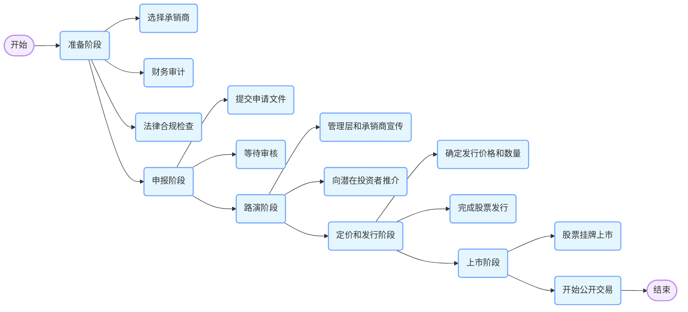

# IPO投资策略：如何评估新上市公司

> 关键词：IPO投资策略、新上市公司评估、财务分析、行业前景、管理团队

> 摘要：本文围绕IPO投资策略中如何评估新上市公司展开。详细介绍了评估新上市公司的背景知识，包括目的、预期读者等。阐述了核心概念，如IPO的原理和流程，给出了相应的示意图和流程图。深入讲解了核心算法原理和具体操作步骤，运用Python代码展示了部分分析过程。同时，给出了相关的数学模型和公式，并举例说明。通过项目实战，展示了实际案例的代码实现和解读。分析了新上市公司评估在实际中的应用场景，推荐了学习、开发等相关的工具和资源。最后总结了未来发展趋势与挑战，解答了常见问题，并提供了扩展阅读和参考资料，旨在为投资者在IPO投资中评估新上市公司提供全面、专业的指导。

## 1. 背景介绍 
### 1.1 目的和范围
在金融市场中，首次公开募股（Initial Public Offering，简称IPO）为投资者提供了参与新上市公司成长的机会。然而，新上市公司的质量参差不齐，如何准确评估新上市公司，制定合理的IPO投资策略，是投资者面临的重要问题。本文的目的在于系统地介绍评估新上市公司的方法和策略，帮助投资者在IPO投资中做出更明智的决策。范围涵盖了从新上市公司的基本概念、核心评估方法，到实际应用案例和未来发展趋势等多个方面。

### 1.2 预期读者
本文预期读者包括对IPO投资感兴趣的个人投资者、金融机构的投资分析师、从事金融研究的学者以及相关领域的专业人士。无论是初涉投资领域的新手，还是经验丰富的专业投资者，都能从本文中获取有价值的信息和指导。

### 1.3 文档结构概述
本文将按照以下结构进行阐述：首先介绍评估新上市公司的背景知识，包括目的、预期读者等；接着讲解核心概念，如IPO的原理和流程，并给出相应的示意图和流程图；然后深入探讨核心算法原理和具体操作步骤，运用Python代码展示部分分析过程；之后给出相关的数学模型和公式，并举例说明；通过项目实战，展示实际案例的代码实现和解读；分析新上市公司评估在实际中的应用场景；推荐学习、开发等相关的工具和资源；最后总结未来发展趋势与挑战，解答常见问题，并提供扩展阅读和参考资料。

### 1.4 术语表
#### 1.4.1 核心术语定义
- **IPO（Initial Public Offering）**：首次公开募股，是指一家企业或公司（股份有限公司）第一次将它的股份向公众出售。
- **市盈率（Price Earnings Ratio，PE）**：指股票价格除以每股收益（EPS）的比率，反映了市场对公司盈利预期的指标。
- **市净率（Price to Book Ratio，PB）**：是每股股价与每股净资产的比率，用于衡量公司的估值水平。
- **净资产收益率（Return on Equity，ROE）**：净利润与平均股东权益的百分比，反映股东权益的收益水平。

#### 1.4.2 相关概念解释
- **财务报表**：包括资产负债表、利润表和现金流量表，是反映企业财务状况和经营成果的重要文件。
- **行业生命周期**：分为初创期、成长期、成熟期和衰退期，不同阶段的行业特点和投资风险不同。
- **管理团队**：负责公司的日常运营和战略决策，其能力和经验对公司的发展至关重要。

#### 1.4.3 缩略词列表
- **IPO**：Initial Public Offering
- **PE**：Price Earnings Ratio
- **PB**：Price to Book Ratio
- **ROE**：Return on Equity

## 2. 核心概念与联系 

### IPO原理和流程

IPO的基本原理是企业通过向公众发行股票，筹集资金以支持其业务发展。其主要流程如下：
1. **准备阶段**：企业选择合适的投资银行作为承销商，进行财务审计、法律合规检查等工作。
2. **申报阶段**：向证券监管机构提交招股说明书等申请文件，等待审核。
3. **路演阶段**：企业管理层和承销商向潜在投资者进行宣传和推介，介绍公司的业务、财务状况和发展前景。
4. **定价和发行阶段**：根据市场需求和投资者反馈，确定股票发行价格和发行数量，完成股票发行。
5. **上市阶段**：股票在证券交易所挂牌上市，开始公开交易。

### 文本示意图
```plaintext
IPO流程
|-- 准备阶段
|   |-- 选择承销商
|   |-- 财务审计
|   |-- 法律合规检查
|-- 申报阶段
|   |-- 提交申请文件
|   |-- 等待审核
|-- 路演阶段
|   |-- 管理层和承销商宣传
|   |-- 向潜在投资者推介
|-- 定价和发行阶段
|   |-- 确定发行价格和数量
|   |-- 完成股票发行
|-- 上市阶段
|   |-- 股票挂牌上市
|   |-- 开始公开交易
```

### Mermaid流程图


## 3. 核心算法原理 & 具体操作步骤 

### 财务分析算法原理
在评估新上市公司时，财务分析是重要的一环。以下是一些常用的财务分析指标和算法：

#### 市盈率（PE）计算
市盈率反映了市场对公司盈利预期的指标，计算公式为：
$$PE = \frac{股票价格}{每股收益}$$

#### 市净率（PB）计算
市净率用于衡量公司的估值水平，计算公式为：
$$PB = \frac{股票价格}{每股净资产}$$

#### 净资产收益率（ROE）计算
净资产收益率反映股东权益的收益水平，计算公式为：
$$ROE = \frac{净利润}{平均股东权益} \times 100\%$$

### Python代码实现财务指标计算
```python
class FinancialAnalysis:
    def __init__(self, stock_price, earnings_per_share, net_asset_per_share, net_profit, average_shareholders_equity):
        self.stock_price = stock_price
        self.earnings_per_share = earnings_per_share
        self.net_asset_per_share = net_asset_per_share
        self.net_profit = net_profit
        self.average_shareholders_equity = average_shareholders_equity

    def calculate_pe(self):
        """计算市盈率"""
        if self.earnings_per_share == 0:
            return None
        return self.stock_price / self.earnings_per_share

    def calculate_pb(self):
        """计算市净率"""
        if self.net_asset_per_share == 0:
            return None
        return self.stock_price / self.net_asset_per_share

    def calculate_roe(self):
        """计算净资产收益率"""
        if self.average_shareholders_equity == 0:
            return None
        return (self.net_profit / self.average_shareholders_equity) * 100

# 示例数据
stock_price = 50
earnings_per_share = 2
net_asset_per_share = 10
net_profit = 1000000
average_shareholders_equity = 5000000

# 创建财务分析对象
analysis = FinancialAnalysis(stock_price, earnings_per_share, net_asset_per_share, net_profit, average_shareholders_equity)

# 计算财务指标
pe = analysis.calculate_pe()
pb = analysis.calculate_pb()
roe = analysis.calculate_roe()

print(f"市盈率: {pe}")
print(f"市净率: {pb}")
print(f"净资产收益率: {roe}%")
```

### 具体操作步骤
1. **收集数据**：收集新上市公司的股票价格、每股收益、每股净资产、净利润和平均股东权益等财务数据。
2. **创建财务分析对象**：使用上述数据创建`FinancialAnalysis`类的对象。
3. **计算财务指标**：调用对象的`calculate_pe`、`calculate_pb`和`calculate_roe`方法，计算市盈率、市净率和净资产收益率。
4. **分析结果**：根据计算结果，结合行业平均水平和公司历史数据，评估公司的估值和盈利能力。

## 4. 数学模型和公式 & 详细讲解 & 举例说明 

### 财务指标公式
#### 市盈率（PE）
$$PE = \frac{股票价格}{每股收益}$$
- **详细讲解**：市盈率反映了投资者为获取公司每一元盈利所愿意支付的价格。较高的市盈率通常表示市场对公司的未来盈利增长有较高的预期，但也可能意味着股票被高估；较低的市盈率则可能表示股票被低估，但也可能反映公司的盈利前景不佳。
- **举例说明**：假设某新上市公司的股票价格为50元，每股收益为2元，则该公司的市盈率为$PE = \frac{50}{2} = 25$。如果同行业的平均市盈率为20，说明该公司的股票相对较贵，可能市场对其未来盈利增长有较高的预期。

#### 市净率（PB）
$$PB = \frac{股票价格}{每股净资产}$$
- **详细讲解**：市净率衡量了公司的市场价值与账面价值的比率。较低的市净率可能表示股票被低估，具有一定的投资价值；较高的市净率则可能表示市场对公司的未来发展前景有较高的预期，但也可能存在泡沫。
- **举例说明**：假设某新上市公司的股票价格为50元，每股净资产为10元，则该公司的市净率为$PB = \frac{50}{10} = 5$。如果同行业的平均市净率为3，说明该公司的股票相对较贵，可能市场对其未来发展前景有较高的预期。

#### 净资产收益率（ROE）
$$ROE = \frac{净利润}{平均股东权益} \times 100\%$$
- **详细讲解**：净资产收益率反映了股东权益的收益水平，是衡量公司盈利能力的重要指标。较高的净资产收益率表示公司利用股东权益创造利润的能力较强；较低的净资产收益率则表示公司的盈利能力较弱。
- **举例说明**：假设某新上市公司的净利润为100万元，平均股东权益为500万元，则该公司的净资产收益率为$ROE = \frac{100}{500} \times 100\% = 20\%$。如果同行业的平均净资产收益率为15%，说明该公司的盈利能力较强。

### 现金流折现模型（DCF）
现金流折现模型是一种常用的估值方法，其基本原理是将公司未来的现金流折现到当前，以确定公司的内在价值。公式如下：
$$V = \sum_{t=1}^{n} \frac{CF_t}{(1 + r)^t}$$
其中，$V$表示公司的内在价值，$CF_t$表示第$t$期的现金流，$r$表示折现率，$n$表示预测期数。

- **详细讲解**：现金流折现模型考虑了公司未来的现金流和时间价值，是一种较为科学的估值方法。但该模型的准确性取决于对未来现金流和折现率的预测，存在一定的主观性。
- **举例说明**：假设某新上市公司预计未来3年的现金流分别为100万元、120万元和150万元，折现率为10%，则该公司的内在价值为：
$$V = \frac{100}{(1 + 0.1)^1} + \frac{120}{(1 + 0.1)^2} + \frac{150}{(1 + 0.1)^3} \approx 295.04 \text{万元}$$

## 5. 项目实战：代码实际案例和详细解释说明 

### 5.1  开发环境搭建
为了实现对新上市公司的评估，我们可以使用Python进行数据处理和分析。以下是开发环境的搭建步骤：
1. **安装Python**：从Python官方网站（https://www.python.org/downloads/）下载并安装Python 3.x版本。
2. **安装必要的库**：使用`pip`命令安装以下必要的库：
```bash
pip install pandas numpy matplotlib
```
- `pandas`：用于数据处理和分析。
- `numpy`：用于数值计算。
- `matplotlib`：用于数据可视化。

### 5.2  源代码详细实现和代码解读
以下是一个完整的Python代码示例，用于对新上市公司的财务数据进行分析和可视化：
```python
import pandas as pd
import numpy as np
import matplotlib.pyplot as plt

# 模拟新上市公司的财务数据
data = {
    '年份': [2018, 2019, 2020, 2021, 2022],
    '营业收入': [1000, 1200, 1500, 1800, 2000],
    '净利润': [100, 120, 150, 180, 200],
    '总资产': [5000, 5500, 6000, 6500, 7000],
    '股东权益': [3000, 3200, 3500, 3800, 4000]
}

# 创建DataFrame对象
df = pd.DataFrame(data)

# 计算财务指标
df['毛利率'] = (df['营业收入'] - df['净利润']) / df['营业收入']
df['净利率'] = df['净利润'] / df['营业收入']
df['总资产收益率'] = df['净利润'] / df['总资产']
df['净资产收益率'] = df['净利润'] / df['股东权益']

# 可视化财务指标
plt.figure(figsize=(12, 8))

plt.subplot(2, 2, 1)
plt.plot(df['年份'], df['毛利率'])
plt.title('毛利率')
plt.xlabel('年份')
plt.ylabel('毛利率')

plt.subplot(2, 2, 2)
plt.plot(df['年份'], df['净利率'])
plt.title('净利率')
plt.xlabel('年份')
plt.ylabel('净利率')

plt.subplot(2, 2, 3)
plt.plot(df['年份'], df['总资产收益率'])
plt.title('总资产收益率')
plt.xlabel('年份')
plt.ylabel('总资产收益率')

plt.subplot(2, 2, 4)
plt.plot(df['年份'], df['净资产收益率'])
plt.title('净资产收益率')
plt.xlabel('年份')
plt.ylabel('净资产收益率')

plt.tight_layout()
plt.show()

# 打印财务指标数据
print(df[['年份', '毛利率', '净利率', '总资产收益率', '净资产收益率']])
```

### 5.3  代码解读与分析
1. **数据模拟**：使用字典`data`模拟新上市公司的财务数据，包括年份、营业收入、净利润、总资产和股东权益。
2. **创建DataFrame对象**：使用`pandas`库的`DataFrame`函数将模拟数据转换为DataFrame对象，方便进行数据处理和分析。
3. **计算财务指标**：根据财务指标的计算公式，计算毛利率、净利率、总资产收益率和净资产收益率，并将结果添加到DataFrame对象中。
4. **可视化财务指标**：使用`matplotlib`库的`plot`函数绘制财务指标的折线图，直观展示公司的财务状况和盈利能力。
5. **打印财务指标数据**：使用`print`函数打印财务指标数据，方便进一步分析和比较。

通过以上代码，我们可以对新上市公司的财务数据进行全面的分析和可视化，为投资决策提供参考。

## 6. 实际应用场景 
### 个人投资者
个人投资者在参与IPO投资时，可以使用上述评估方法对新上市公司进行分析。通过财务分析、行业前景评估和管理团队考察等，选择具有投资价值的新上市公司，制定合理的投资策略。例如，个人投资者可以根据市盈率、市净率等指标判断股票的估值水平，结合行业发展趋势和公司的竞争优势，决定是否投资以及投资的金额。

### 金融机构
金融机构如证券公司、基金公司等，在进行IPO研究和投资决策时，需要对新上市公司进行深入的评估。金融机构可以利用专业的研究团队和数据分析工具，对新上市公司的财务状况、行业前景、管理团队等进行全面的分析，为客户提供投资建议和研究报告。同时，金融机构也可以根据评估结果进行资产配置和投资组合管理。

### 企业战略投资
企业在进行战略投资时，也可以对新上市公司进行评估。通过评估新上市公司的业务模式、技术实力、市场份额等，判断其是否与自身的战略发展方向相符。如果新上市公司具有与企业互补的业务或技术，企业可以考虑进行战略投资，实现资源共享和协同发展。

## 7. 工具和资源推荐
### 7.1 学习资源推荐
#### 7.1.1 书籍推荐
- 《证券分析》（本杰明·格雷厄姆著）：被誉为投资界的圣经，详细介绍了证券分析的基本方法和理论。
- 《聪明的投资者》（本杰明·格雷厄姆著）：为普通投资者提供了实用的投资建议和策略。
- 《财务报表分析与股票估值》（斯蒂芬·佩因曼著）：系统介绍了财务报表分析和股票估值的方法和技巧。

#### 7.1.2 在线课程
- Coursera上的“Financial Markets”课程：由耶鲁大学教授罗伯特·席勒讲授，介绍了金融市场的基本原理和投资策略。
- edX上的“Investment Management with Python and Machine Learning”课程：结合Python和机器学习技术，介绍了投资管理的方法和应用。

#### 7.1.3 技术博客和网站
- 雪球网（https://xueqiu.com/）：提供股票、基金等金融产品的信息和分析，有大量的投资者分享投资经验和观点。
- 东方财富网（https://www.eastmoney.com/）：提供全面的金融信息和数据，包括股票行情、财经新闻、研究报告等。

### 7.2 开发工具框架推荐
#### 7.2.1 IDE和编辑器
- PyCharm：一款专业的Python集成开发环境，具有代码编辑、调试、自动完成等功能。
- Jupyter Notebook：一种交互式的开发环境，适合进行数据分析和可视化。

#### 7.2.2 调试和性能分析工具
- pdb：Python自带的调试工具，可以帮助开发者调试代码。
- cProfile：Python的性能分析工具，可以分析代码的运行时间和性能瓶颈。

#### 7.2.3 相关框架和库
- pandas：用于数据处理和分析，提供了高效的数据结构和数据操作方法。
- numpy：用于数值计算，提供了丰富的数学函数和数组操作方法。
- matplotlib：用于数据可视化，提供了多种绘图函数和样式。

### 7.3 相关论文著作推荐
#### 7.3.1 经典论文
- Fama, E. F., & French, K. R. (1992). The cross-section of expected stock returns. The Journal of Finance, 47(2), 427-465. 提出了著名的Fama-French三因子模型，用于解释股票收益率的差异。
- Sharpe, W. F. (1964). Capital asset prices: A theory of market equilibrium under conditions of risk. The Journal of Finance, 19(3), 425-442. 提出了资本资产定价模型（CAPM），用于计算资产的预期收益率。

#### 7.3.2 最新研究成果
- 在学术数据库如IEEE Xplore、ACM Digital Library等上搜索关于IPO投资策略和新上市公司评估的最新研究论文，了解该领域的前沿动态和研究成果。

#### 7.3.3 应用案例分析
- 阅读一些知名投资机构或学者发表的关于IPO投资的案例分析报告，学习他们的评估方法和投资决策过程。

## 8. 总结：未来发展趋势与挑战
### 未来发展趋势
- **数字化和智能化**：随着科技的不断发展，数字化和智能化将在IPO投资中发挥越来越重要的作用。投资者可以利用大数据、人工智能等技术，对新上市公司进行更全面、深入的评估。
- **国际化**：全球金融市场的一体化趋势将促使更多的新上市公司进行跨境上市，投资者也将有更多的机会参与国际市场的IPO投资。
- **可持续投资**：越来越多的投资者开始关注企业的社会责任和可持续发展，未来在评估新上市公司时，可持续发展因素将成为重要的考虑因素之一。

### 挑战
- **信息不对称**：新上市公司的信息披露可能存在不完整、不准确的情况，投资者难以获取全面、真实的信息，增加了评估的难度和风险。
- **市场波动**：IPO市场受宏观经济环境、政策变化等因素的影响较大，市场波动可能导致新上市公司的股价大幅波动，增加了投资的不确定性。
- **竞争激烈**：随着IPO市场的发展，越来越多的投资者参与到新上市公司的评估和投资中，竞争日益激烈，投资者需要不断提高自己的评估能力和投资水平。

## 9. 附录：常见问题与解答
### 问题1：如何获取新上市公司的财务数据？
解答：可以通过证券交易所的官方网站、上市公司的招股说明书、财经媒体和金融数据提供商等渠道获取新上市公司的财务数据。

### 问题2：市盈率和市净率哪个更重要？
解答：市盈率和市净率都是重要的估值指标，但它们反映的侧重点不同。市盈率主要反映市场对公司盈利预期的指标，市净率主要衡量公司的估值水平。在评估新上市公司时，应综合考虑这两个指标，并结合其他因素进行分析。

### 问题3：如何评估新上市公司的行业前景？
解答：可以从行业的市场规模、增长趋势、竞争格局、政策环境等方面评估新上市公司的行业前景。同时，可以参考行业研究报告、专家观点和相关数据进行分析。

## 10. 扩展阅读 & 参考资料
### 扩展阅读
- 《金融炼金术》（乔治·索罗斯著）：介绍了索罗斯的投资哲学和交易策略。
- 《漫步华尔街》（伯顿·马尔基尔著）：为投资者提供了实用的投资建议和市场分析。

### 参考资料
- 证券交易所官方网站，如上海证券交易所（https://www.sse.com.cn/）、深圳证券交易所（https://www.szse.cn/）。
- 金融数据提供商，如Wind、东方财富Choice等。

作者：AI天才研究院/AI Genius Institute & 禅与计算机程序设计艺术 /Zen And The Art of Computer Programming