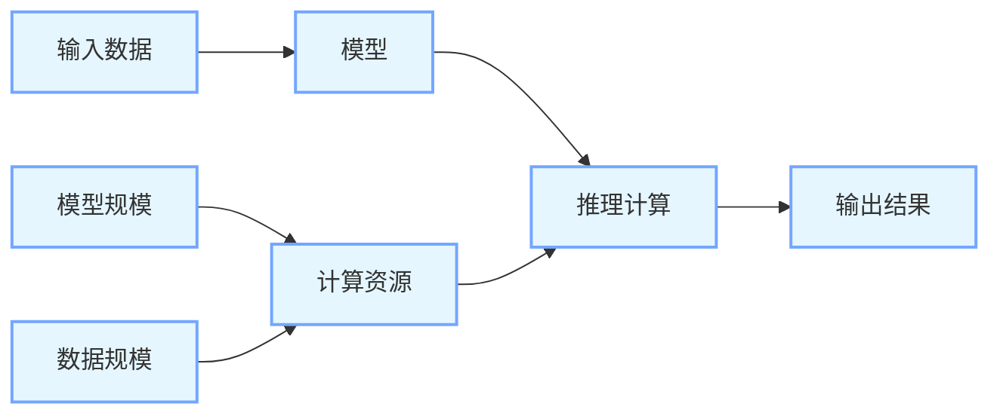

# Inference Scaling Law在数学和编程任务中的应用

> 关键词：Inference Scaling Law、数学任务、编程任务、算法原理、应用场景

> 摘要：本文深入探讨了Inference Scaling Law在数学和编程任务中的应用。首先介绍了相关背景知识，包括目的范围、预期读者等内容。接着阐述了核心概念与联系，通过文本示意图和Mermaid流程图展示其架构。详细讲解了核心算法原理，并用Python源代码进行说明。分析了数学模型和公式，结合具体例子进行解读。通过项目实战展示代码的实际案例和详细解释。探讨了在实际中的应用场景，推荐了相关的学习资源、开发工具框架和论文著作。最后总结了未来发展趋势与挑战，并提供了常见问题解答和扩展阅读参考资料。

## 1. 背景介绍 
### 1.1 目的和范围
Inference Scaling Law在当今的人工智能和计算机科学领域具有重要意义。其目的在于研究推理过程中的资源使用和性能之间的关系，通过量化这种关系，我们可以更有效地利用计算资源，提高推理效率。本文章的范围聚焦于Inference Scaling Law在数学和编程任务中的应用，包括如何在这些任务中运用该定律优化算法、提高性能以及解决实际问题。

### 1.2 预期读者
本文预期读者包括对人工智能、机器学习、数学和编程有一定了解的专业人士，如数据科学家、算法工程师、软件开发者等。同时，对于对前沿技术感兴趣的研究人员和学生，也能从本文中获得关于Inference Scaling Law的深入理解和应用启示。

### 1.3 文档结构概述
本文将按照以下结构进行阐述：首先介绍背景知识，让读者对Inference Scaling Law及其应用场景有初步认识；接着讲解核心概念与联系，通过示意图和流程图展示其架构；然后详细分析核心算法原理和具体操作步骤，并用Python代码实现；随后探讨数学模型和公式，并结合实际例子进行说明；通过项目实战展示代码的实际应用；介绍实际应用场景；推荐相关的学习资源、开发工具框架和论文著作；最后总结未来发展趋势与挑战，提供常见问题解答和扩展阅读参考资料。

### 1.4 术语表
#### 1.4.1 核心术语定义
- **Inference Scaling Law**：推理缩放定律，描述了在推理过程中，计算资源（如计算时间、内存使用等）与模型规模、输入数据规模等因素之间的定量关系。
- **推理（Inference）**：在机器学习和人工智能中，根据训练好的模型对新数据进行预测或决策的过程。
- **模型规模**：通常指模型中参数的数量，反映了模型的复杂度。

#### 1.4.2 相关概念解释
- **计算复杂度**：衡量算法执行所需的计算资源（如时间和空间）的指标。在Inference Scaling Law中，计算复杂度与推理过程的效率密切相关。
- **数据规模**：指输入到模型中的数据的大小，数据规模的变化会影响推理的性能和资源使用。

#### 1.4.3 缩略词列表
- **GPU**：Graphics Processing Unit，图形处理器，常用于加速大规模计算任务。
- **CPU**：Central Processing Unit，中央处理器，计算机的核心计算组件。

## 2. 核心概念与联系 

### 核心概念原理
Inference Scaling Law的核心在于揭示推理过程中计算资源与各种因素之间的关系。从本质上讲，推理过程可以看作是对输入数据进行一系列的计算操作，以得到输出结果。这些计算操作的复杂度和所需资源受到模型规模、输入数据规模等因素的影响。

例如，在一个简单的线性回归模型 $y = wx + b$ 中，推理过程就是根据输入的 $x$ 值，计算出对应的 $y$ 值。这里的计算复杂度主要取决于 $w$ 和 $b$ 的计算以及乘法和加法操作的数量。当模型规模增大（如增加更多的特征或层）时，计算复杂度也会相应增加。

### 架构的文本示意图
```plaintext
输入数据 -> 模型（包含参数） -> 推理计算 -> 输出结果
|                             |
| 计算资源（时间、内存等）    |
|                             |
| 受模型规模、数据规模影响    |
```

### Mermaid 流程图


这个流程图展示了推理过程的基本架构，输入数据经过模型进行推理计算得到输出结果。同时，计算资源受到模型规模和数据规模的影响，而计算资源又会影响推理计算的效率。

## 3. 核心算法原理 & 具体操作步骤 

### 核心算法原理
Inference Scaling Law的核心算法原理基于对推理过程中计算复杂度的分析。以一个简单的矩阵乘法为例，假设我们有一个输入矩阵 $X$ 和一个权重矩阵 $W$，推理过程就是计算 $Y = XW$。

矩阵乘法的计算复杂度为 $O(mnp)$，其中 $m$ 是输入矩阵 $X$ 的行数，$n$ 是输入矩阵 $X$ 的列数，$p$ 是权重矩阵 $W$ 的列数。这意味着当输入数据规模（$m$ 和 $n$）或模型规模（$p$）增加时，计算复杂度也会相应增加。

### 具体操作步骤
下面我们将详细说明如何在实际中应用Inference Scaling Law进行推理计算，以矩阵乘法为例，使用Python代码实现：

```python
import numpy as np

# 定义输入矩阵 X 和权重矩阵 W
m = 100  # 输入矩阵 X 的行数
n = 50   # 输入矩阵 X 的列数
p = 20   # 权重矩阵 W 的列数

X = np.random.rand(m, n)  # 随机生成输入矩阵 X
W = np.random.rand(n, p)  # 随机生成权重矩阵 W

# 进行推理计算（矩阵乘法）
Y = np.dot(X, W)

# 输出结果
print("推理结果 Y 的形状：", Y.shape)
```

### 代码解释
1. **导入必要的库**：使用 `import numpy as np` 导入NumPy库，NumPy是Python中用于科学计算的常用库，提供了高效的矩阵运算功能。
2. **定义矩阵的维度**：通过 `m`、`n` 和 `p` 定义输入矩阵 $X$ 和权重矩阵 $W$ 的维度。
3. **随机生成矩阵**：使用 `np.random.rand()` 函数随机生成输入矩阵 $X$ 和权重矩阵 $W$。
4. **进行推理计算**：使用 `np.dot()` 函数进行矩阵乘法，得到输出矩阵 $Y$。
5. **输出结果**：打印输出矩阵 $Y$ 的形状。

通过这个例子，我们可以看到Inference Scaling Law在实际推理计算中的应用，即根据输入数据规模和模型规模来评估计算复杂度和所需的计算资源。

## 4. 数学模型和公式 & 详细讲解 & 举例说明 

### 数学模型和公式
在Inference Scaling Law中，一个常见的数学模型是将推理时间 $T$ 表示为模型规模 $M$ 和输入数据规模 $D$ 的函数：

$$T = aM^bD^c$$

其中，$a$、$b$ 和 $c$ 是常数，需要通过实验或理论分析来确定。$b$ 表示模型规模对推理时间的影响程度，$c$ 表示输入数据规模对推理时间的影响程度。

### 详细讲解
这个公式表明，推理时间与模型规模和输入数据规模的幂次成正比。当 $b > 0$ 时，模型规模增大，推理时间会增加；当 $c > 0$ 时，输入数据规模增大，推理时间也会增加。

例如，在一个深度学习模型中，模型规模通常由模型中的参数数量决定，输入数据规模由输入样本的数量和特征维度决定。通过调整模型规模和输入数据规模，我们可以根据这个公式来预测推理时间。

### 举例说明
假设我们有一个简单的线性回归模型，经过实验得到 $a = 0.1$，$b = 0.5$，$c = 0.3$。现在模型规模 $M = 100$，输入数据规模 $D = 50$，则推理时间 $T$ 为：

$$T = 0.1\times100^{0.5}\times50^{0.3}$$

```python
import math

a = 0.1
b = 0.5
c = 0.3
M = 100
D = 50

T = a * math.pow(M, b) * math.pow(D, c)
print("推理时间 T：", T)
```

在这个例子中，我们可以根据给定的模型规模和输入数据规模，使用数学公式计算出推理时间。通过这种方式，我们可以在实际应用中提前评估推理所需的时间，从而合理安排计算资源。

## 5. 项目实战：代码实际案例和详细解释说明 

### 5.1  开发环境搭建
为了实现Inference Scaling Law在数学和编程任务中的应用，我们需要搭建一个合适的开发环境。以下是具体的步骤：

#### 安装Python
Python是一种广泛使用的编程语言，我们可以从Python官方网站（https://www.python.org/downloads/）下载并安装最新版本的Python。

#### 安装必要的库
我们需要安装一些常用的Python库，如NumPy、Pandas、Scikit-learn等。可以使用以下命令进行安装：

```bash
pip install numpy pandas scikit-learn
```

#### 选择集成开发环境（IDE）
可以选择使用PyCharm、Jupyter Notebook等IDE来进行代码开发。PyCharm是一个功能强大的Python IDE，提供了丰富的代码编辑和调试功能；Jupyter Notebook则适合进行交互式的数据探索和代码演示。

### 5.2  源代码详细实现和代码解读
以下是一个使用Inference Scaling Law优化线性回归模型推理过程的代码示例：

```python
import numpy as np
from sklearn.linear_model import LinearRegression
import time

# 生成随机数据
n_samples = 1000
n_features = 10
X = np.random.rand(n_samples, n_features)
y = 2 * X[:, 0] + 3 * X[:, 1] + np.random.randn(n_samples)

# 训练线性回归模型
model = LinearRegression()
model.fit(X, y)

# 定义不同的数据规模进行推理测试
data_sizes = [100, 200, 300, 400, 500]
times = []

for size in data_sizes:
    # 生成测试数据
    X_test = np.random.rand(size, n_features)
    
    # 记录开始时间
    start_time = time.time()
    
    # 进行推理计算
    y_pred = model.predict(X_test)
    
    # 记录结束时间
    end_time = time.time()
    
    # 计算推理时间
    inference_time = end_time - start_time
    times.append(inference_time)
    print(f"数据规模 {size} 的推理时间：{inference_time} 秒")

# 绘制推理时间与数据规模的关系图
import matplotlib.pyplot as plt
plt.plot(data_sizes, times, marker='o')
plt.xlabel('数据规模')
plt.ylabel('推理时间 (秒)')
plt.title('推理时间与数据规模的关系')
plt.show()
```

### 代码解读
1. **生成随机数据**：使用 `np.random.rand()` 函数生成随机的输入数据 $X$ 和目标数据 $y$。
2. **训练线性回归模型**：使用 `LinearRegression()` 类创建一个线性回归模型，并使用 `fit()` 方法进行训练。
3. **定义不同的数据规模进行推理测试**：通过循环遍历不同的数据规模，生成相应的测试数据。
4. **记录推理时间**：在每次推理计算前后记录时间，计算推理时间并保存。
5. **绘制推理时间与数据规模的关系图**：使用 `matplotlib` 库绘制推理时间与数据规模的关系图，直观展示数据规模对推理时间的影响。

### 5.3  代码解读与分析
从代码的运行结果可以看出，随着数据规模的增加，推理时间也会相应增加。这与Inference Scaling Law的理论是一致的，即输入数据规模越大，推理所需的计算资源和时间就越多。

通过分析推理时间与数据规模的关系图，我们可以进一步了解Inference Scaling Law在实际中的应用。例如，我们可以根据这个关系图预测在不同数据规模下的推理时间，从而合理安排计算资源，优化推理过程。

## 6. 实际应用场景 
### 数学任务中的应用
在数学任务中，Inference Scaling Law可以用于优化数值计算、方程求解等过程。例如，在大规模矩阵运算中，通过合理调整矩阵的规模和计算方式，可以根据Inference Scaling Law减少计算时间和内存使用。

在数学建模中，我们可以使用Inference Scaling Law来评估模型的复杂度和推理效率。当模型规模较大时，我们可以根据该定律预测推理所需的时间和资源，从而决定是否需要对模型进行简化或优化。

### 编程任务中的应用
在编程任务中，Inference Scaling Law可以用于优化算法的性能。例如，在排序算法中，我们可以根据输入数据的规模和算法的复杂度，选择合适的排序算法。当数据规模较小时，简单的排序算法（如冒泡排序）可能就足够了；当数据规模较大时，我们可以选择更高效的排序算法（如快速排序、归并排序）。

在软件开发中，Inference Scaling Law可以用于评估系统的性能和可扩展性。例如，在设计一个分布式系统时，我们可以根据Inference Scaling Law预测系统在不同负载下的响应时间和吞吐量，从而进行合理的资源分配和系统优化。

## 7. 工具和资源推荐
### 7.1 学习资源推荐
#### 7.1.1 书籍推荐
- 《深度学习》（Deep Learning）：由Ian Goodfellow、Yoshua Bengio和Aaron Courville所著，是深度学习领域的经典教材，涵盖了深度学习的基本原理、算法和应用。
- 《Python机器学习》（Python Machine Learning）：由Sebastian Raschka和Vahid Mirjalili所著，介绍了如何使用Python进行机器学习的开发，包括数据预处理、模型训练和评估等内容。

#### 7.1.2 在线课程
- Coursera上的“深度学习专项课程”（Deep Learning Specialization）：由Andrew Ng教授授课，提供了深度学习的全面介绍和实践经验。
- edX上的“人工智能导论”（Introduction to Artificial Intelligence）：介绍了人工智能的基本概念、算法和应用，适合初学者学习。

#### 7.1.3 技术博客和网站
- Towards Data Science：一个专注于数据科学和机器学习的技术博客，提供了大量的教程、案例和研究成果。
- arXiv：一个预印本服务器，包含了计算机科学、数学等领域的最新研究论文。

### 7.2 开发工具框架推荐
#### 7.2.1 IDE和编辑器
- PyCharm：一个功能强大的Python IDE，提供了丰富的代码编辑、调试和项目管理功能。
- Jupyter Notebook：一个交互式的开发环境，适合进行数据探索、代码演示和实验。

#### 7.2.2 调试和性能分析工具
- Py-Spy：一个用于Python代码性能分析的工具，可以帮助我们找出代码中的性能瓶颈。
- Visual Studio Profiler：一个强大的性能分析工具，支持多种编程语言，包括Python。

#### 7.2.3 相关框架和库
- TensorFlow：一个开源的机器学习框架，提供了丰富的工具和库，用于构建和训练深度学习模型。
- PyTorch：另一个流行的深度学习框架，具有动态图的特点，适合快速开发和实验。

### 7.3 相关论文著作推荐
#### 7.3.1 经典论文
- "Attention Is All You Need"：提出了Transformer架构，是自然语言处理领域的重要突破。
- "ImageNet Classification with Deep Convolutional Neural Networks"：介绍了AlexNet模型，开启了深度学习在计算机视觉领域的应用热潮。

#### 7.3.2 最新研究成果
- 关注arXiv上关于Inference Scaling Law的最新研究论文，了解该领域的最新进展。
- 参加相关的学术会议，如NeurIPS、ICML等，获取最新的研究成果和趋势。

#### 7.3.3 应用案例分析
- 分析一些实际应用中使用Inference Scaling Law进行优化的案例，学习如何将理论应用到实际中。可以在相关的技术博客和学术论文中找到这些案例。

## 8. 总结：未来发展趋势与挑战
### 未来发展趋势
- **模型优化**：随着Inference Scaling Law的研究深入，未来将有更多的方法和技术用于优化模型的推理过程。例如，通过模型压缩、量化等技术，可以减少模型的规模，提高推理效率。
- **硬件加速**：硬件技术的不断发展将为Inference Scaling Law的应用提供更好的支持。例如，GPU、TPU等专用硬件的性能不断提升，可以加速大规模的推理计算。
- **跨领域应用**：Inference Scaling Law将在更多的领域得到应用，如医疗、金融、交通等。通过将该定律应用到不同的领域，可以提高这些领域的决策效率和准确性。

### 挑战
- **数据多样性**：实际应用中的数据具有多样性和复杂性，如何在不同类型的数据上准确应用Inference Scaling Law是一个挑战。需要进一步研究不同数据分布和特征对推理性能的影响。
- **模型复杂度**：随着模型复杂度的不断增加，如深度学习中的大型预训练模型，Inference Scaling Law的应用变得更加困难。需要开发新的方法和技术来处理这些复杂模型的推理问题。
- **资源限制**：在实际应用中，计算资源和存储资源往往是有限的。如何在资源限制的情况下，根据Inference Scaling Law合理分配资源，提高推理效率，是一个需要解决的问题。

## 9. 附录：常见问题与解答
### 问题1：Inference Scaling Law适用于所有类型的模型吗？
答：Inference Scaling Law适用于大多数类型的模型，但具体的应用效果可能会因模型的复杂度、结构和数据特点而有所不同。对于一些简单的模型，如线性回归模型，该定律可以较好地描述推理过程中的资源使用和性能关系；对于一些复杂的模型，如深度学习中的大型预训练模型，可能需要进一步的研究和调整。

### 问题2：如何确定Inference Scaling Law中的常数 $a$、$b$ 和 $c$？
答：常数 $a$、$b$ 和 $c$ 通常需要通过实验或理论分析来确定。一种常见的方法是在不同的模型规模和输入数据规模下进行实验，记录推理时间，然后通过回归分析等方法拟合出这些常数。另外，也可以根据模型的结构和算法原理进行理论推导，但这种方法通常比较复杂，适用于一些简单的模型。

### 问题3：Inference Scaling Law在分布式系统中有什么应用？
答：在分布式系统中，Inference Scaling Law可以用于优化资源分配和任务调度。通过预测不同数据规模和模型规模下的推理时间和资源需求，可以合理分配计算节点和存储资源，提高系统的整体性能和可扩展性。例如，在一个分布式深度学习推理系统中，可以根据该定律将推理任务分配到不同的节点上，以实现负载均衡和高效计算。

## 10. 扩展阅读 & 参考资料
- Goodfellow, I., Bengio, Y., & Courville, A. (2016). Deep Learning. MIT Press.
- Raschka, S., & Mirjalili, V. (2017). Python Machine Learning. Packt Publishing.
- Vaswani, A., Shazeer, N., Parmar, N., Uszkoreit, J., Jones, L., Gomez, A. N.,... & Polosukhin, I. (2017). Attention is all you need. Advances in neural information processing systems, 5998-6008.
- Krizhevsky, A., Sutskever, I., & Hinton, G. E. (2012). ImageNet classification with deep convolutional neural networks. Advances in neural information processing systems, 1097-1105.

作者：AI天才研究院/AI Genius Institute & 禅与计算机程序设计艺术 /Zen And The Art of Computer Programming