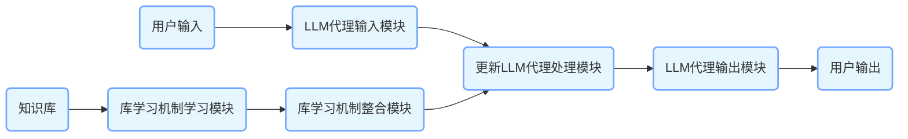

# LLM代理采用库学习机制实现持续自我改进

> 关键词：LLM代理、库学习机制、持续自我改进、人工智能、知识管理、强化学习、元学习

> 摘要：本文围绕LLM代理采用库学习机制实现持续自我改进展开深入探讨。首先介绍了相关的背景知识，包括目的范围、预期读者等内容。接着阐述了LLM代理和库学习机制的核心概念及它们之间的联系，并给出了相应的原理和架构示意图与流程图。详细讲解了核心算法原理及具体操作步骤，借助Python源代码进行说明。同时分析了相关的数学模型和公式，并举例阐释。通过项目实战展示了代码实际案例及详细解释。探讨了LLM代理采用库学习机制的实际应用场景，推荐了学习资源、开发工具框架以及相关论文著作。最后总结了未来发展趋势与挑战，解答了常见问题并提供了扩展阅读和参考资料，旨在全面深入地剖析该技术，为相关领域的研究和实践提供有价值的参考。

## 1. 背景介绍 
### 1.1 目的和范围
在当今人工智能快速发展的时代，大型语言模型（LLM）已经在多个领域展现出强大的能力。然而，LLM也面临着一些挑战，如知识更新不及时、对特定领域知识的掌握有限等。LLM代理采用库学习机制实现持续自我改进的研究，旨在解决这些问题，使LLM代理能够不断学习新知识，优化自身性能，提高在各种任务中的表现。

本研究的范围涵盖了LLM代理的基本原理、库学习机制的实现方式、相关算法和数学模型，以及实际应用场景等方面。通过对这些内容的研究，为实现LLM代理的持续自我改进提供理论支持和实践指导。

### 1.2 预期读者
本文预期读者包括人工智能领域的研究人员、开发者、相关专业的学生，以及对LLM技术感兴趣的技术爱好者。对于研究人员来说，本文可以提供新的研究思路和方向；对于开发者而言，能够为他们在实际项目中实现LLM代理的持续自我改进提供技术参考；对于学生来说，有助于他们深入理解LLM代理和库学习机制的相关知识；对于技术爱好者，可帮助他们了解该领域的前沿技术。

### 1.3 文档结构概述
本文将按照以下结构进行阐述：首先介绍背景知识，包括目的范围、预期读者等；接着讲解LLM代理和库学习机制的核心概念及联系；然后详细说明核心算法原理和具体操作步骤，包括Python源代码；分析相关的数学模型和公式，并举例说明；通过项目实战展示代码实现和详细解释；探讨实际应用场景；推荐学习资源、开发工具框架和相关论文著作；最后总结未来发展趋势与挑战，解答常见问题并提供扩展阅读和参考资料。

### 1.4 术语表
#### 1.4.1 核心术语定义
- **LLM代理（Large Language Model Agent）**：基于大型语言模型构建的智能代理，能够执行各种任务，如对话、文本生成、知识问答等。
- **库学习机制（Library Learning Mechanism）**：一种让LLM代理从知识库中学习新知识，并将学习到的知识整合到自身模型中的机制。
- **持续自我改进（Continuous Self - Improvement）**：LLM代理在运行过程中，不断学习新的知识和技能，优化自身性能，以更好地完成各种任务的过程。

#### 1.4.2 相关概念解释
- **知识库（Knowledge Library）**：存储各种知识的集合，包括文本、图像、数据等，是LLM代理学习的重要资源。
- **元学习（Meta - Learning）**：一种学习如何学习的方法，在库学习机制中，元学习可以帮助LLM代理更高效地从知识库中学习新知识。
- **强化学习（Reinforcement Learning）**：通过智能体与环境进行交互，根据环境反馈的奖励信号来学习最优策略的方法，可用于LLM代理的自我改进。

#### 1.4.3 缩略词列表
- **LLM**：Large Language Model（大型语言模型）
- **RL**：Reinforcement Learning（强化学习）
- **ML**：Meta - Learning（元学习）

## 2. 核心概念与联系 
### 2.1 LLM代理的原理和架构
LLM代理基于大型语言模型构建，其核心是预训练的语言模型，如GPT系列、BERT等。这些模型通过在大规模文本数据上进行无监督学习，学习到了语言的模式和规律。LLM代理在运行时，接收用户输入的任务或问题，然后利用预训练模型生成相应的输出。

LLM代理的架构通常包括输入模块、处理模块和输出模块。输入模块负责接收用户的输入，将其转换为模型可以处理的格式；处理模块是核心，包含预训练的语言模型，对输入进行处理和推理；输出模块将处理结果转换为用户可以理解的格式，如文本、语音等。

以下是LLM代理架构的文本示意图：

```plaintext
用户输入 ---> 输入模块 ---> 处理模块（预训练语言模型） ---> 输出模块 ---> 用户输出
```

### 2.2 库学习机制的原理和架构
库学习机制的核心思想是让LLM代理从知识库中学习新知识，并将其整合到自身模型中。知识库可以是结构化的数据库，也可以是非结构化的文本集合。

库学习机制的架构包括知识库、学习模块和整合模块。知识库存储各种知识；学习模块负责从知识库中提取有用的知识；整合模块将学习到的知识整合到LLM代理的模型中，实现模型的更新。

以下是库学习机制架构的文本示意图：

```plaintext
知识库 ---> 学习模块 ---> 整合模块 ---> LLM代理模型更新
```

### 2.3 LLM代理与库学习机制的联系
LLM代理通过库学习机制可以不断获取新知识，从而实现持续自我改进。库学习机制为LLM代理提供了知识来源和学习方法，使得LLM代理能够在面对新的任务和问题时，有更丰富的知识储备和更强的处理能力。

当LLM代理在执行任务过程中遇到知识不足的情况时，库学习机制可以从知识库中查找相关知识，帮助LLM代理解决问题，并将学习到的知识整合到自身模型中，以便在未来的任务中更好地发挥作用。

### 2.4 Mermaid流程图


## 3. 核心算法原理 & 具体操作步骤 
### 3.1 核心算法原理
#### 3.1.1 知识提取算法
知识提取算法的目的是从知识库中提取与LLM代理当前任务相关的知识。常用的方法包括基于关键词匹配、语义相似度计算等。

基于关键词匹配的方法是在知识库中查找包含与任务关键词相同的知识条目。语义相似度计算则是通过计算任务描述与知识条目之间的语义相似度，选择相似度较高的知识条目。

#### 3.1.2 知识整合算法
知识整合算法将提取到的知识整合到LLM代理的模型中。一种常见的方法是通过微调（Fine - Tuning）预训练模型。微调是在预训练模型的基础上，使用包含新知识的数据集进行训练，使模型能够学习到新的知识和模式。

#### 3.1.3 强化学习算法
强化学习算法用于优化LLM代理的行为。在库学习机制中，强化学习可以根据LLM代理在任务中的表现给予奖励或惩罚，引导其不断学习和改进。

### 3.2 具体操作步骤
#### 3.2.1 任务接收
LLM代理接收用户输入的任务或问题。

#### 3.2.2 知识提取
使用知识提取算法从知识库中提取与任务相关的知识。

#### 3.2.3 知识整合
将提取到的知识通过知识整合算法整合到LLM代理的模型中。

#### 3.2.4 任务执行
使用更新后的模型执行任务，并生成输出。

#### 3.2.5 强化学习反馈
根据任务执行的结果，使用强化学习算法给予奖励或惩罚，优化LLM代理的行为。

### 3.3 Python源代码实现
```python
import numpy as np
from sklearn.feature_extraction.text import TfidfVectorizer
from sklearn.metrics.pairwise import cosine_similarity
import torch
from transformers import AutoModelForCausalLM, AutoTokenizer

# 模拟知识库
knowledge_base = [
    "苹果是一种水果",
    "香蕉富含钾元素",
    "橘子的维生素C含量高"
]

# 关键词匹配知识提取
def keyword_matching(task, knowledge_base):
    keywords = task.split()
    relevant_knowledge = []
    for knowledge in knowledge_base:
        for keyword in keywords:
            if keyword in knowledge:
                relevant_knowledge.append(knowledge)
                break
    return relevant_knowledge

# 语义相似度计算知识提取
def semantic_similarity(task, knowledge_base):
    vectorizer = TfidfVectorizer()
    all_texts = [task] + knowledge_base
    vectors = vectorizer.fit_transform(all_texts)
    task_vector = vectors[0]
    knowledge_vectors = vectors[1:]
    similarities = cosine_similarity(task_vector, knowledge_vectors)
    max_index = np.argmax(similarities)
    return knowledge_base[max_index]

# 模拟知识整合（微调预训练模型）
def knowledge_integration(model, tokenizer, new_knowledge):
    # 这里只是简单模拟，实际微调需要更多步骤
    input_ids = tokenizer.encode(new_knowledge, return_tensors='pt')
    model.train()
    # 训练过程省略
    model.eval()
    return model

# 模拟任务执行
def task_execution(model, tokenizer, task):
    input_ids = tokenizer.encode(task, return_tensors='pt')
    output = model.generate(input_ids)
    result = tokenizer.decode(output[0], skip_special_tokens=True)
    return result

# 主函数
def main():
    task = "苹果是什么"
    # 知识提取
    relevant_knowledge_1 = keyword_matching(task, knowledge_base)
    relevant_knowledge_2 = semantic_similarity(task, knowledge_base)
    print("关键词匹配提取的知识:", relevant_knowledge_1)
    print("语义相似度提取的知识:", relevant_knowledge_2)

    # 加载预训练模型
    model_name = "gpt2"
    tokenizer = AutoTokenizer.from_pretrained(model_name)
    model = AutoModelForCausalLM.from_pretrained(model_name)

    # 知识整合
    updated_model = knowledge_integration(model, tokenizer, relevant_knowledge_2)

    # 任务执行
    result = task_execution(updated_model, tokenizer, task)
    print("任务执行结果:", result)

if __name__ == "__main__":
    main()
```

## 4. 数学模型和公式 & 详细讲解 & 举例说明 
### 4.1 语义相似度计算的数学模型
语义相似度计算常用的方法是余弦相似度。设两个文本向量 $\vec{A}$ 和 $\vec{B}$，它们的余弦相似度计算公式为：

$$\text{Cosine Similarity}(\vec{A}, \vec{B})=\frac{\vec{A}\cdot\vec{B}}{\|\vec{A}\|\|\vec{B}\|}$$

其中，$\vec{A}\cdot\vec{B}$ 是向量 $\vec{A}$ 和 $\vec{B}$ 的点积，$\|\vec{A}\|$ 和 $\|\vec{B}\|$ 分别是向量 $\vec{A}$ 和 $\vec{B}$ 的模。

### 4.2 详细讲解
余弦相似度的取值范围是 $[-1, 1]$。当两个向量的方向完全相同时，余弦相似度为 1，表示它们的语义完全相同；当两个向量的方向完全相反时，余弦相似度为 -1；当两个向量相互垂直时，余弦相似度为 0，表示它们的语义没有关联。

在文本处理中，通常使用词向量或文本特征向量来计算余弦相似度。例如，在上面的Python代码中，使用了TF - IDF（词频 - 逆文档频率）向量来表示文本，然后计算任务描述和知识条目之间的余弦相似度。

### 4.3 举例说明
假设有两个文本：$A =$ "苹果是一种水果" 和 $B =$ "苹果富含维生素"。首先，将这两个文本转换为向量 $\vec{A}$ 和 $\vec{B}$（使用TF - IDF等方法）。假设 $\vec{A}=(0.2, 0.3, 0.5)$，$\vec{B}=(0.1, 0.4, 0.5)$。

计算向量的模：
$$\|\vec{A}\|=\sqrt{0.2^2 + 0.3^2 + 0.5^2}=\sqrt{0.04 + 0.09 + 0.25}=\sqrt{0.38}\approx0.62$$
$$\|\vec{B}\|=\sqrt{0.1^2 + 0.4^2 + 0.5^2}=\sqrt{0.01 + 0.16 + 0.25}=\sqrt{0.42}\approx0.65$$

计算点积：
$$\vec{A}\cdot\vec{B}=0.2\times0.1 + 0.3\times0.4 + 0.5\times0.5=0.02 + 0.12 + 0.25 = 0.39$$

计算余弦相似度：
$$\text{Cosine Similarity}(\vec{A}, \vec{B})=\frac{0.39}{0.62\times0.65}\approx0.96$$

这表明这两个文本的语义相似度较高。

### 4.4 强化学习的数学模型
强化学习的核心是智能体与环境的交互。智能体在环境中执行动作，环境根据智能体的动作给予奖励或惩罚。强化学习的目标是找到一个最优策略 $\pi$，使得智能体在长期内获得的累积奖励最大。

强化学习的数学模型通常使用马尔可夫决策过程（MDP）来描述。MDP 由一个五元组 $(S, A, P, R, \gamma)$ 组成，其中：
- $S$ 是状态集合，表示环境的所有可能状态。
- $A$ 是动作集合，表示智能体可以执行的所有动作。
- $P$ 是状态转移概率，$P(s'|s, a)$ 表示在状态 $s$ 执行动作 $a$ 后转移到状态 $s'$ 的概率。
- $R$ 是奖励函数，$R(s, a, s')$ 表示在状态 $s$ 执行动作 $a$ 转移到状态 $s'$ 时获得的奖励。
- $\gamma$ 是折扣因子，用于平衡短期奖励和长期奖励。

智能体的策略 $\pi$ 定义了在每个状态下选择动作的概率分布，即 $\pi(a|s)$ 表示在状态 $s$ 选择动作 $a$ 的概率。

智能体的目标是最大化累积折扣奖励：
$$G_t=\sum_{k = 0}^{\infty}\gamma^kR_{t + k + 1}$$

其中，$G_t$ 是从时间步 $t$ 开始的累积折扣奖励，$R_{t + k + 1}$ 是在时间步 $t + k + 1$ 获得的奖励。

### 4.5 详细讲解
马尔可夫决策过程的核心假设是状态转移具有马尔可夫性，即下一个状态只与当前状态和当前动作有关，而与过去的状态和动作无关。

折扣因子 $\gamma$ 的取值范围是 $[0, 1]$。当 $\gamma$ 接近 0 时，智能体更关注短期奖励；当 $\gamma$ 接近 1 时，智能体更关注长期奖励。

策略 $\pi$ 可以是确定性的（即对于每个状态，只选择一个固定的动作），也可以是随机性的（即对于每个状态，以一定的概率选择不同的动作）。

### 4.6 举例说明
假设有一个简单的网格世界环境，智能体的目标是从起点移动到终点。状态 $s$ 表示智能体在网格中的位置，动作 $a$ 可以是上下左右移动。如果智能体成功到达终点，获得奖励 10；如果智能体撞到墙壁，获得奖励 -1。

设折扣因子 $\gamma = 0.9$，初始状态 $s_0$，智能体在状态 $s_0$ 选择动作 $a_0$ 移动到状态 $s_1$，获得奖励 $R(s_0, a_0, s_1)= - 1$；在状态 $s_1$ 选择动作 $a_1$ 移动到状态 $s_2$，获得奖励 $R(s_1, a_1, s_2)= - 1$；最终到达终点状态 $s_3$，获得奖励 $R(s_2, a_2, s_3)=10$。

则从初始状态 $s_0$ 开始的累积折扣奖励为：
$$G_0=R(s_0, a_0, s_1)+\gamma R(s