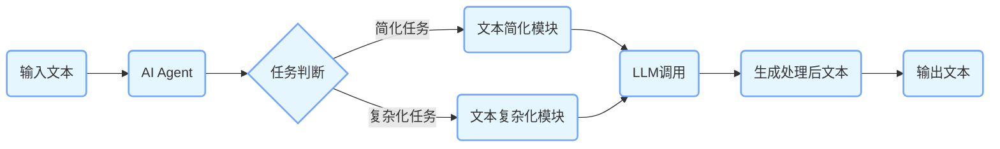

# LLM在AI Agent中的文本简化与复杂化能力

> 关键词：LLM、AI Agent、文本简化、文本复杂化、自然语言处理

> 摘要：本文深入探讨了大型语言模型（LLM）在AI Agent中所具备的文本简化与复杂化能力。首先介绍了相关背景知识，包括研究目的、预期读者等内容。接着详细阐述了核心概念及它们之间的联系，分析了实现文本简化与复杂化的核心算法原理，并给出Python代码示例。同时，引入数学模型和公式来解释这些能力背后的原理。通过项目实战，展示了如何在实际开发中运用这些能力。还探讨了其实际应用场景，推荐了学习所需的工具和资源。最后对未来发展趋势与挑战进行了总结，并提供常见问题解答和扩展阅读参考资料，旨在为读者全面呈现LLM在AI Agent中文本简化与复杂化能力的全貌。

## 1. 背景介绍 
### 1.1 目的和范围
本研究的目的在于深入理解大型语言模型（LLM）在AI Agent中实现文本简化与复杂化的能力。随着自然语言处理技术的不断发展，LLM已经成为处理和生成自然语言的强大工具。而AI Agent作为能够自主执行任务的智能实体，需要具备灵活处理文本的能力，以适应不同的应用场景。

本文的范围将涵盖文本简化与复杂化的核心概念、实现算法、数学模型、实际应用案例以及相关的工具和资源。通过对这些方面的研究，我们旨在为开发者和研究人员提供全面的指导，帮助他们更好地利用LLM在AI Agent中实现文本处理的需求。

### 1.2 预期读者
本文预期的读者包括自然语言处理领域的研究人员、AI Agent开发者、对LLM技术感兴趣的程序员以及相关专业的学生。对于研究人员来说，本文可以为他们的研究提供新的思路和理论支持；对于开发者而言，能够帮助他们在实际项目中更好地运用LLM实现文本简化与复杂化功能；对于学生来说，则可以作为学习自然语言处理和AI Agent技术的参考资料。

### 1.3 文档结构概述
本文将按照以下结构进行组织：
- 核心概念与联系：介绍文本简化与复杂化的基本概念，以及它们与LLM和AI Agent之间的关系，并通过示意图和流程图进行直观展示。
- 核心算法原理 & 具体操作步骤：详细阐述实现文本简化与复杂化的核心算法，并给出Python代码示例，帮助读者理解算法的具体实现过程。
- 数学模型和公式 & 详细讲解 & 举例说明：引入数学模型和公式来解释文本简化与复杂化的原理，并通过具体例子进行说明。
- 项目实战：代码实际案例和详细解释说明：通过一个实际项目案例，展示如何在开发环境中实现文本简化与复杂化功能，并对代码进行详细解读。
- 实际应用场景：探讨文本简化与复杂化能力在不同领域的实际应用场景。
- 工具和资源推荐：推荐学习和开发所需的工具和资源，包括书籍、在线课程、技术博客、开发工具、框架和库以及相关论文著作。
- 总结：未来发展趋势与挑战：对LLM在AI Agent中文本简化与复杂化能力的未来发展趋势进行展望，并分析可能面临的挑战。
- 附录：常见问题与解答：解答读者在学习和实践过程中可能遇到的常见问题。
- 扩展阅读 & 参考资料：提供进一步学习和研究所需的扩展阅读资料和参考文献。

### 1.4 术语表
#### 1.4.1 核心术语定义
- **大型语言模型（LLM）**：是一种基于深度学习的自然语言处理模型，通过在大规模文本数据上进行训练，学习语言的模式和规律，从而能够生成自然流畅的文本。
- **AI Agent**：是一种能够感知环境、自主决策并执行任务的智能实体，通常可以与人类进行交互，完成各种自然语言处理任务。
- **文本简化**：将复杂的文本转换为更简单、易懂的表达方式，通常涉及词汇替换、句子结构调整等操作。
- **文本复杂化**：与文本简化相反，将简单的文本转换为更复杂、丰富的表达方式，可能包括使用更高级的词汇、增加修饰成分等。

#### 1.4.2 相关概念解释
- **自然语言处理（NLP）**：是计算机科学和人工智能领域的一个重要分支，旨在让计算机能够理解、处理和生成自然语言。LLM是NLP领域的重要技术之一。
- **语言生成**：是指计算机根据输入的信息生成自然语言文本的过程，LLM在语言生成方面具有强大的能力。

#### 1.4.3 缩略词列表
- **LLM**：Large Language Model（大型语言模型）
- **AI**：Artificial Intelligence（人工智能）
- **NLP**：Natural Language Processing（自然语言处理）

## 2. 核心概念与联系 

### 核心概念原理
#### 文本简化
文本简化的核心目标是降低文本的复杂度，使其更易于理解。这可以通过多种方式实现，例如：
- **词汇替换**：将复杂的词汇替换为更简单、常用的词汇。例如，将“utilize”替换为“use”。
- **句子结构调整**：将复杂的句子拆分为多个简单的句子，或者调整句子的语序，使其更符合自然语言的表达习惯。例如，将“Despite the fact that it was raining, he went out.”简化为“It was raining, but he went out.”

#### 文本复杂化
文本复杂化则是通过增加文本的信息含量和表达的丰富性，使其变得更复杂。具体方法包括：
- **使用高级词汇**：引入更专业、更复杂的词汇来替换简单的词汇。例如，将“big”替换为“enormous”。
- **增加修饰成分**：在句子中添加定语、状语等修饰成分，使句子更加详细和丰富。例如，将“He walked.”复杂化 为“He walked slowly along the winding path, enjoying the beautiful scenery.”

#### 与LLM和AI Agent的关系
LLM作为强大的语言处理模型，为AI Agent提供了实现文本简化与复杂化的能力基础。AI Agent可以利用LLM的语言理解和生成能力，根据具体的任务需求对文本进行简化或复杂化处理。例如，在一个智能客服系统中，AI Agent可以将复杂的技术文档简化为通俗易懂的语言，以便用户更好地理解；而在一个文学创作辅助系统中，AI Agent可以将简单的创意描述复杂化，生成更富有文采的文学作品。

### 架构的文本示意图
```plaintext
         +------------------+
         |      LLM         |
         +------------------+
         | 文本理解能力    |
         | 语言生成能力    |
         +------------------+
                ^      |
                |      v
         +------------------+
         |     AI Agent     |
         +------------------+
         | 任务感知模块    |
         | 决策模块        |
         | 文本处理模块    |
         +------------------+
                ^      |
                |      v
         +------------------+
         |   输入文本      |
         +------------------+
                |
                v
         +------------------+
         | 输出简化或复杂  |
         |    化文本       |
         +------------------+
```

### Mermaid流程图


## 3. 核心算法原理 & 具体操作步骤 

### 文本简化算法原理
文本简化可以基于规则或机器学习方法实现。这里我们介绍一种基于规则的简单算法，其核心思想是通过预定义的词汇替换规则和句子结构调整规则来对文本进行简化。

#### Python代码实现
```python
import re

# 定义词汇替换规则
word_replacements = {
    "utilize": "use",
    "commence": "start",
    "terminate": "end"
}

# 定义句子结构调整规则
sentence_split_pattern = re.compile(r'([,;])')

def simplify_text(text):
    # 词汇替换
    for old_word, new_word in word_replacements.items():
        text = text.replace(old_word, new_word)
    
    # 句子结构调整
    parts = sentence_split_pattern.split(text)
    simplified_text = ""
    for i, part in enumerate(parts):
        if part in [',', ';']:
            simplified_text += part + " "
        else:
            simplified_text += part.strip() + " "
    
    return simplified_text.strip()

# 测试示例
input_text = "We should utilize this opportunity to commence the project and terminate it on time."
simplified = simplify_text(input_text)
print("简化后的文本:", simplified)
```

### 文本复杂化算法原理
文本复杂化可以通过增加修饰成分和使用高级词汇来实现。我们可以使用预定义的修饰词和高级词汇列表，随机选择合适的词汇添加到文本中。

#### Python代码实现
```python
import random

# 定义高级词汇替换规则
advanced_word_replacements = {
    "big": "enormous",
    "small": "tiny",
    "good": "excellent"
}

# 定义修饰词列表
adjective_list = ["beautiful", "amazing", "wonderful", "fascinating"]

def complicate_text(text):
    # 词汇替换
    words = text.split()
    for i, word in enumerate(words):
        if word in advanced_word_replacements:
            words[i] = advanced_word_replacements[word]
    
    # 增加修饰成分
    if random.random() > 0.5:
        index = random.randint(0, len(words) - 1)
        adjective = random.choice(adjective_list)
        words.insert(index, adjective)
    
    complicated_text = " ".join(words)
    return complicated_text

# 测试示例
input_text = "This is a big house."
complicated = complicate_text(input_text)
print("复杂化后的文本:", complicated)
```

### 具体操作步骤
#### 文本简化
1. 加载预定义的词汇替换规则和句子结构调整规则。
2. 对输入文本进行词汇替换，将复杂的词汇替换为简单的词汇。
3. 根据句子结构调整规则，对句子进行拆分和重组，使其更简单易懂。
4. 输出简化后的文本。

#### 文本复杂化
1. 加载预定义的高级词汇替换规则和修饰词列表。
2. 对输入文本进行词汇替换，将简单的词汇替换为高级词汇。
3. 随机选择一个位置，插入一个修饰词，增加文本的丰富性。
4. 输出复杂化后的文本。

## 4. 数学模型和公式 & 详细讲解 & 举例说明 

### 文本简化的数学模型
文本简化可以看作是一个映射函数 $f: T \to S$，其中 $T$ 是原始文本集合，$S$ 是简化后的文本集合。这个映射函数可以通过一系列的规则和变换来实现。

假设 $t \in T$ 是一个原始文本，我们可以将其表示为一个词序列 $t = [w_1, w_2, \cdots, w_n]$，其中 $w_i$ 是文本中的第 $i$ 个词。简化后的文本 $s = f(t)$ 可以通过以下步骤得到：

#### 词汇替换
对于每个词 $w_i$，如果存在一个替换规则 $w_i \to w_j$，则将 $w_i$ 替换为 $w_j$。我们可以用一个替换函数 $r: W \to W$ 来表示这个过程，其中 $W$ 是词汇集合。则替换后的词序列为 $t' = [r(w_1), r(w_2), \cdots, r(w_n)]$。

#### 句子结构调整
句子结构调整可以看作是对词序列 $t'$ 的重新排列和分割。假设我们有一个句子分割函数 $p: T' \to S'$，其中 $T'$ 是经过词汇替换后的文本集合，$S'$ 是分割后的句子集合。则最终简化后的文本 $s = p(t')$。

### 举例说明
假设原始文本 $t =$ "We should utilize this opportunity to commence the project."，词汇替换规则为 $\{"utilize": "use", "commence": "start"\}$。

- 词汇替换：$t' =$ "We should use this opportunity to start the project."
- 句子结构调整：假设没有进一步的句子结构调整规则，则 $s = t'$。

### 文本复杂化的数学模型
文本复杂化可以看作是一个映射函数 $g: T \to C$，其中 $T$ 是原始文本集合，$C$ 是复杂化后的文本集合。

假设 $t = [w_1, w_2, \cdots, w_n]$ 是原始文本，我们可以通过以下步骤得到复杂化后的文本 $c = g(t)$：

#### 词汇替换
使用一个高级词汇替换函数 $h: W \to W$，将简单的词汇替换为高级词汇。替换后的词序列为 $t' = [h(w_1), h(w_2), \cdots, h(w_n)]$。

#### 增加修饰成分
假设我们有一个修饰词集合 $A$，我们可以随机选择一个位置 $k$ 和一个修饰词 $a \in A$，将 $a$ 插入到 $t'$ 中，得到复杂化后的词序列 $c = [w_1', \cdots, w_{k - 1}', a, w_k', \cdots, w_n']$。

### 举例说明
假设原始文本 $t =$ "This is a big house."，高级词汇替换规则为 $\{"big": "enormous"\}$，修饰词集合 $A = \{"beautiful", "amazing"\}$。

- 词汇替换：$t' =$ "This is an enormous house."
- 增加修饰成分：假设随机选择位置 $k = 2$ 和修饰词 $a =$ "beautiful"，则 $c =$ "This is a beautiful enormous house."

## 5. 项目实战：代码实际案例和详细解释说明 

### 5.1  开发环境搭建
#### 安装Python
首先，确保你已经安装了Python 3.x版本。你可以从Python官方网站（https://www.python.org/downloads/）下载并安装适合你操作系统的Python版本。

#### 安装必要的库
在本项目中，我们只需要使用Python的内置库，因此不需要额外安装其他库。

### 5.2  源代码详细实现和代码解读
#### 完整代码
```python
import re
import random

# 定义词汇替换规则
word_replacements = {
    "utilize": "use",
    "commence": "start",
    "terminate": "end"
}

# 定义高级词汇替换规则
advanced_word_replacements = {
    "big": "enormous",
    "small": "tiny",
    "good": "excellent"
}

# 定义修饰词列表
adjective_list = ["beautiful", "amazing", "wonderful", "fascinating"]

# 定义句子结构调整规则
sentence_split_pattern = re.compile(r'([,;])')

def simplify_text(text):
    # 词汇替换
    for old_word, new_word in word_replacements.items():
        text = text.replace(old_word, new_word)
    
    # 句子结构调整
    parts = sentence_split_pattern.split(text)
    simplified_text = ""
    for i, part in enumerate(parts):
        if part in [',', ';']:
            simplified_text += part + " "
        else:
            simplified_text += part.strip() + " "
    
    return simplified_text.strip()

def complicate_text(text):
    # 词汇替换
    words = text.split()
    for i, word in enumerate(words):
        if word in advanced_word_replacements:
            words[i] = advanced_word_replacements[word]
    
    # 增加修饰成分
    if random.random() > 0.5:
        index = random.randint(0, len(words) - 1)
        adjective = random.choice(adjective_list)
        words.insert(index, adjective)
    
    complicated_text = " ".join(words)
    return complicated_text

# 主程序
if __name__ == "__main__":
    input_text = input("请输入要处理的文本: ")
    operation = input("请选择操作（s: 简化，c: 复杂化）: ")
    
    if operation == 's':
        result = simplify_text(input_text)
        print("简化后的文本:", result)
    elif operation == 'c':
        result = complicate_text(input_text)
        print("复杂化后的文本:", result)
    else:
        print("无效的操作选择，请输入 's' 或 'c'。")
```

#### 代码解读
1. **导入必要的库**：导入 `re` 库用于正则表达式处理，导入 `random` 库用于随机数生成。
2. **定义规则和列表**：定义词汇替换规则、高级词汇替换规则和修饰词列表，以及句子结构调整的正则表达式模式。
3. **`simplify_text` 函数**：该函数实现了文本简化的功能。首先进行词汇替换，然后根据句子结构调整规则对句子进行拆分和重组。
4. **`complicate_text` 函数**：该函数实现了文本复杂化的功能。首先进行词汇替换，然后以一定的概率随机插入一个修饰词。
5. **主程序**：通过用户输入获取要处理的文本和操作类型（简化或复杂化），调用相应的函数进行处理，并输出结果。

### 5.3  代码解读与分析
#### 优点
- **简单易懂**：代码使用了简单的规则和基本的Python操作，易于理解和实现。
- **可扩展性**：可以通过添加更多的词汇替换规则、高级词汇替换规则和修饰词列表来扩展功能。

#### 缺点
- **规则局限性**：基于规则的方法依赖于预定义的规则，对于未覆盖的情况可能无法处理。
- **缺乏语义理解**：代码没有考虑文本的语义信息，可能会导致一些不合理的简化或复杂化结果。

## 6. 实际应用场景 

### 教育领域
- **教材编写**：在编写教材时，可以使用文本简化功能将复杂的学术知识转化为更易于学生理解的语言，帮助学生更好地掌握知识。例如，将专业的科学论文简化为适合中学生阅读的科普文章。
- **个性化学习**：根据学生的学习水平和能力，为学生提供简化或复杂化的学习材料。对于基础薄弱的学生，可以提供简化后的文本；对于学习能力较强的学生，可以提供复杂化的拓展材料。

### 信息传播领域
- **新闻报道**：在新闻报道中，为了让更多的读者能够理解新闻内容，可以使用文本简化功能将专业术语和复杂的句子结构进行简化。同时，在一些深度报道中，可以使用文本复杂化功能来丰富内容，提供更多的背景信息和分析。
- **社交媒体**：在社交媒体上，用户可能希望快速获取信息，因此可以使用文本简化功能将长文章简化为简洁的摘要。而对于一些创意性的内容，如诗歌、故事等，可以使用文本复杂化功能来增加其艺术感和吸引力。

### 智能客服领域
- **用户咨询**：当用户咨询复杂的产品信息或技术问题时，智能客服可以使用文本简化功能将专业的解答转化为通俗易懂的语言，帮助用户更好地理解。而在与专业用户交流时，可以使用文本复杂化功能提供更详细、准确的信息。
- **常见问题解答**：对于常见问题的解答，可以使用文本简化功能制作简洁明了的答案，方便用户快速查找。同时，对于一些复杂问题的深入解答，可以使用文本复杂化功能提供更多的细节和解决方案。

### 文学创作领域
- **辅助写作**：在文学创作过程中，作家可以使用文本复杂化功能来丰富作品的语言表达，增加文采。而在修改和润色阶段，可以使用文本简化功能来检查句子是否过于复杂，是否需要简化以提高可读性。
- **创意启发**：通过输入简单的创意描述，使用文本复杂化功能可以生成更丰富的文学作品雏形，为作家提供创意启发。

## 7. 工具和资源推荐
### 7.1 学习资源推荐
#### 7.1.1 书籍推荐
- 《自然语言处理入门》：这本书详细介绍了自然语言处理的基本概念、算法和技术，适合初学者入门学习。
- 《深度学习》：深度学习是LLM的核心技术，这本书对深度学习的理论和实践进行了全面的介绍。
- 《Python自然语言处理实战》：结合Python语言，介绍了自然语言处理的实际应用和开发技巧。

#### 7.1.2 在线课程
- Coursera上的“Natural Language Processing Specialization”：由顶尖大学的教授授课，系统地介绍了自然语言处理的各个方面。
- edX上的“Deep Learning for Natural Language Processing”：重点介绍了深度学习在自然语言处理中的应用。
- 网易云课堂上的“Python自然语言处理基础教程”：适合初学者快速掌握Python在自然语言处理中的应用。

#### 7.1.3 技术博客和网站
- Medium上的自然语言处理相关博客：有很多专业人士分享的最新研究成果和实践经验。
- arXiv.org：提供了大量的自然语言处理领域的学术论文。
- Hugging Face博客：Hugging Face是自然语言处理领域的知名开源组织，其博客上有很多关于LLM和NLP的技术文章。

### 7.2 开发工具框架推荐
#### 7.2.1 IDE和编辑器
- PyCharm：功能强大的Python集成开发环境，提供了代码编辑、调试、版本控制等一系列功能。
- Visual Studio Code：轻量级的代码编辑器，支持多种编程语言，有丰富的插件扩展功能。

#### 7.2.2 调试和性能分析工具
- PDB：Python自带的调试器，可以帮助开发者定位代码中的问题。
- cProfile：Python的性能分析工具，可以分析代码的运行时间和函数调用情况。

#### 7.2.3 相关框架和库
- Transformers：Hugging Face开发的开源库，提供了多种预训练的LLM模型，方便开发者进行自然语言处理任务的开发。
- NLTK：自然语言工具包，提供了丰富的自然语言处理工具和数据集。
- SpaCy：高效的自然语言处理库，具有快速的处理速度和良好的性能。

### 7.3 相关论文著作推荐
#### 7.3.1 经典论文
- “Attention Is All You Need”：介绍了Transformer架构，是现代LLM的基础。
- “BERT: Pre-training of Deep Bidirectional Transformers for Language Understanding”：提出了BERT模型，在自然语言处理领域取得了巨大的成功。

#### 7.3.2 最新研究成果
- 关注ACL（Association for Computational Linguistics）、EMNLP（Conference on Empirical Methods in Natural Language Processing）等顶级自然语言处理会议的最新论文，了解该领域的最新研究动态。

#### 7.3.3 应用案例分析
- 一些企业和研究机构会发布关于LLM在实际应用中的案例分析报告，可以从中学习到实际项目中的经验和技巧。

## 8. 总结：未来发展趋势与挑战
### 未来发展趋势
- **更智能的文本处理**：随着LLM技术的不断发展，未来的AI Agent将具备更智能的文本简化与复杂化能力，能够更好地理解文本的语义和上下文，实现更精准的处理。
- **多模态融合**：将文本处理与图像、语音等多模态信息融合，使AI Agent能够处理更丰富的信息，提供更全面的服务。例如，在视频讲解中，根据视频内容对相关文本进行简化或复杂化处理。
- **个性化服务**：根据用户的偏好和需求，为用户提供个性化的文本简化与复杂化服务。例如，根据用户的阅读习惯和知识水平，自动调整文本的复杂度。

### 挑战
- **语义理解难题**：虽然LLM在语言处理方面取得了很大的进展，但仍然存在语义理解不够准确的问题。在进行文本简化与复杂化时，可能会出现误解语义导致处理结果不合理的情况。
- **数据隐私和安全**：LLM的训练需要大量的数据，其中可能包含用户的敏感信息。如何保护数据隐私和安全，防止数据泄露，是一个重要的挑战。
- **计算资源需求**：运行大型的LLM模型需要大量的计算资源，包括高性能的GPU和大规模的存储设备。如何降低计算成本，提高资源利用效率，是未来需要解决的问题。

## 9. 附录：常见问题与解答
### 问题1：文本简化和文本复杂化的效果如何评估？
解答：可以使用多种指标来评估文本简化和文本复杂化的效果。对于文本简化，可以使用可读性指标，如Flesch-Kincaid阅读难度指数、Gunning Fog指数等，这些指标可以衡量文本的易读性。对于文本复杂化，可以从词汇丰富度、句子复杂度等方面进行评估，例如计算文本中高级词汇的比例、平均句子长度等。

### 问题2：如何提高基于规则的文本处理方法的效果？
解答：可以通过以下方法提高基于规则的文本处理方法的效果：
- 增加规则数量：不断收集和整理更多的词汇替换规则、句子结构调整规则等，以覆盖更多的情况。
- 结合机器学习方法：将规则方法与机器学习方法相结合，利用机器学习模型来学习更复杂的语言模式和规律，从而提高处理效果。
- 进行人工标注和优化：对处理结果进行人工标注，根据标注结果对规则进行优化和调整。

### 问题3：在实际项目中，如何选择合适的LLM模型？
解答：在选择合适的LLM模型时，可以考虑以下因素：
- 任务需求：根据具体的任务需求，选择适合的模型。例如，如果是文本生成任务，可以选择具有较强生成能力的模型；如果是文本分类任务，可以选择在分类任务上表现较好的模型。
- 模型大小和计算资源：考虑项目的计算资源限制，选择合适大小的模型。较大的模型通常具有更好的性能，但也需要更多的计算资源。
- 模型的公开性和易用性：选择公开可用、易于使用的模型，可以减少开发成本和时间。

## 10. 扩展阅读 & 参考资料
### 扩展阅读
- 《人工智能时代的自然语言处理》：探讨了自然语言处理在人工智能时代的发展趋势和应用前景。
- 《语言与机器：自然语言处理的计算模型》：介绍了自然语言处理的计算模型和算法。

### 参考资料
- Hugging Face官方文档：https://huggingface.co/docs
- NLTK官方文档：https://www.nltk.org/
- SpaCy官方文档：https://spacy.io/

作者：AI天才研究院/AI Genius Institute & 禅与计算机程序设计艺术 /Zen And The Art of Computer Programming