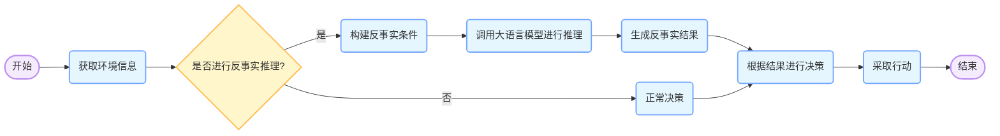

# LLM在AI Agent反事实推理中的应用

> 关键词：大语言模型（LLM）、AI Agent、反事实推理、应用、自然语言处理

> 摘要：本文聚焦于大语言模型（LLM）在AI Agent反事实推理中的应用。首先介绍了相关背景，包括目的、预期读者等。接着阐述了核心概念及联系，通过文本示意图和Mermaid流程图清晰展示。详细讲解了核心算法原理和具体操作步骤，并使用Python代码进行说明。给出了相关数学模型和公式，并举例解释。通过项目实战展示了代码的实际应用和解读。分析了LLM在AI Agent反事实推理中的实际应用场景。推荐了学习资源、开发工具框架以及相关论文著作。最后总结了未来发展趋势与挑战，还提供了常见问题解答和扩展阅读参考资料，旨在为相关领域的研究者和开发者提供全面且深入的技术指导。

## 1. 背景介绍 
### 1.1 目的和范围
在人工智能领域，反事实推理是一种重要的能力，它允许智能体思考“如果某个事件没有发生，结果会怎样”这样的问题。大语言模型（LLM）如GPT - 3、ChatGPT等在自然语言处理方面展现出了强大的能力。本文章的目的是探讨如何将LLM应用于AI Agent的反事实推理中，提高AI Agent在复杂场景下的决策和推理能力。范围涵盖了从理论概念到实际应用的多个方面，包括核心算法原理、数学模型、项目实战等。

### 1.2 预期读者
本文预期读者包括人工智能领域的研究者、开发者、对反事实推理和大语言模型感兴趣的学生以及相关企业的技术人员。对于想要了解如何将LLM与AI Agent反事实推理相结合的人员，本文将提供有价值的信息和技术指导。

### 1.3 文档结构概述
本文首先介绍背景信息，让读者了解研究的目的和预期读者。接着阐述核心概念与联系，使读者对LLM、AI Agent和反事实推理有清晰的认识。然后详细讲解核心算法原理和具体操作步骤，通过Python代码进行说明。给出数学模型和公式，并举例解释其应用。通过项目实战展示代码的实际应用和解读。分析实际应用场景，让读者了解其实际价值。推荐学习资源、开发工具框架和相关论文著作，方便读者进一步深入学习。最后总结未来发展趋势与挑战，提供常见问题解答和扩展阅读参考资料。

### 1.4 术语表
#### 1.4.1 核心术语定义
- **大语言模型（LLM）**：是一种基于深度学习的自然语言处理模型，通过在大规模文本数据上进行训练，学习语言的模式和规律，能够生成自然流畅的文本，如GPT系列、BERT等。
- **AI Agent**：是一种能够感知环境、进行决策并采取行动的智能实体。它可以与环境进行交互，根据环境的反馈调整自己的行为。
- **反事实推理**：是一种思考方式，通过假设某个事件没有发生，来推断可能出现的结果。在人工智能中，反事实推理可以帮助AI Agent更好地理解因果关系，做出更合理的决策。

#### 1.4.2 相关概念解释
- **自然语言处理（NLP）**：是人工智能的一个重要分支，主要研究如何让计算机理解和处理人类语言。LLM是NLP领域的重要技术之一。
- **因果关系**：是指事件之间的引起和被引起的关系。反事实推理的核心就是基于因果关系进行思考。

#### 1.4.3 缩略词列表
- **LLM**：Large Language Model（大语言模型）
- **AI**：Artificial Intelligence（人工智能）
- **NLP**：Natural Language Processing（自然语言处理）

## 2. 核心概念与联系 

### 核心概念原理
#### 大语言模型（LLM）
LLM基于Transformer架构，通过在大规模文本数据上进行无监督学习，学习到语言的统计规律和语义信息。它可以根据输入的文本生成连贯、有逻辑的回复。例如，当输入一个问题时，LLM会根据其学习到的知识生成相应的答案。

#### AI Agent
AI Agent通常由感知模块、决策模块和行动模块组成。感知模块用于获取环境信息，决策模块根据感知到的信息进行决策，行动模块根据决策结果采取相应的行动。在反事实推理中，AI Agent需要根据当前的环境信息和假设的反事实条件进行推理和决策。

#### 反事实推理
反事实推理基于因果关系模型，通过改变某个事件的状态，来推断其他事件的变化。例如，在一个交通事故场景中，假设如果司机没有超速行驶，那么事故是否会发生。通过反事实推理，可以分析出超速行驶与事故发生之间的因果关系。

### 架构的文本示意图
```plaintext
+-----------------+
|    大语言模型    |
+-----------------+
       |
       v
+-----------------+
|    AI Agent     |
|  感知 - 决策 - 行动 |
+-----------------+
       |
       v
+-----------------+
|  反事实推理引擎  |
|  因果关系分析  |
+-----------------+
```

### Mermaid流程图


## 3. 核心算法原理 & 具体操作步骤 

### 核心算法原理
在将LLM应用于AI Agent反事实推理中，主要的算法原理是基于提示工程和因果推理。通过向LLM提供合适的提示，引导其进行反事实推理。提示中通常包含当前的环境信息和反事实条件。

### 具体操作步骤
1. **数据预处理**：收集和整理与反事实推理相关的数据，包括环境信息、历史事件等。对数据进行清洗和标注，以便后续处理。
2. **构建提示**：根据数据和反事实条件，构建合适的提示。提示应清晰地描述当前的情况和需要进行反事实推理的问题。
3. **调用LLM进行推理**：将构建好的提示输入到LLM中，获取其生成的反事实结果。
4. **结果评估和决策**：对LLM生成的结果进行评估，判断其合理性和可靠性。根据评估结果，AI Agent进行决策和行动。

### Python代码实现
```python
import openai

# 设置OpenAI API密钥
openai.api_key = "your_api_key"

def counterfactual_reasoning(prompt):
    try:
        response = openai.Completion.create(
            engine="text-davinci-003",
            prompt=prompt,
            max_tokens=150,
            temperature=0.7
        )
        return response.choices[0].text.strip()
    except Exception as e:
        print(f"推理过程中出现错误: {e}")
        return None

# 示例提示
prompt = "在一个电商平台上，用户A购买了商品X。假设用户A没有看到商品X的广告，那么他是否还会购买商品X？"

# 进行反事实推理
result = counterfactual_reasoning(prompt)
if result:
    print("反事实推理结果: ", result)
```
在上述代码中，我们使用了OpenAI的API进行反事实推理。首先设置API密钥，然后定义了一个`counterfactual_reasoning`函数，该函数接受一个提示作为输入，调用LLM进行推理，并返回推理结果。最后，我们给出了一个示例提示，并调用函数进行推理，打印出推理结果。

## 4. 数学模型和公式 & 详细讲解 & 举例说明 

### 因果图模型
在反事实推理中，因果图模型是一种常用的数学模型。因果图是一个有向无环图（DAG），其中节点表示变量，边表示变量之间的因果关系。

设 $V = \{X_1, X_2, \cdots, X_n\}$ 是变量集合，$G = (V, E)$ 是因果图，其中 $E$ 是边的集合。对于每个变量 $X_i$，其因果机制可以表示为：
$$X_i = f_i(PA_i, U_i)$$
其中 $PA_i$ 是 $X_i$ 的父节点集合，$U_i$ 是未观测到的噪声变量。

### 反事实公式
根据因果图模型，可以推导出反事实公式。设 $Y$ 是结果变量，$X$ 是原因变量，$do(X = x)$ 表示对 $X$ 进行干预，使其取值为 $x$。则在干预 $do(X = x)$ 下，$Y$ 的反事实值 $Y_{x}$ 可以表示为：
$$P(Y_{x} = y) = \sum_{z} P(Y = y | X = x, Z = z) P(Z = z)$$
其中 $Z$ 是 $X$ 到 $Y$ 路径上的中介变量。

### 举例说明
假设我们有一个简单的因果图，其中变量 $X$ 表示是否吸烟，变量 $Y$ 表示是否患肺癌，变量 $Z$ 表示空气质量。因果关系为：吸烟（$X$）会影响患肺癌（$Y$），空气质量（$Z$）也会影响患肺癌（$Y$）。

已知 $P(Y = 1 | X = 1, Z = 1) = 0.8$，$P(Y = 1 | X = 1, Z = 0) = 0.6$，$P(Y = 1 | X = 0, Z = 1) = 0.3$，$P(Y = 1 | X = 0, Z = 0) = 0.1$，$P(Z = 1) = 0.4$，$P(Z = 0) = 0.6$。

我们想计算在干预 $do(X = 0)$ 下，$Y$ 的反事实概率 $P(Y_{0} = 1)$。

根据反事实公式：
$$P(Y_{0} = 1) = P(Y = 1 | X = 0, Z = 1) P(Z = 1) + P(Y = 1 | X = 0, Z = 0) P(Z = 0)$$
$$= 0.3 \times 0.4 + 0.1 \times 0.6$$
$$= 0.12 + 0.06$$
$$= 0.18$$

这意味着在假设不吸烟的情况下，患肺癌的概率为 0.18。

## 5. 项目实战：代码实际案例和详细解释说明 

### 5.1  开发环境搭建
#### 操作系统
可以选择Windows、Linux或macOS操作系统。建议使用Linux系统，如Ubuntu，因为它在开发和部署方面具有良好的兼容性和稳定性。

#### 编程语言和库
- **Python**：选择Python 3.7及以上版本。
- **OpenAI API**：用于调用大语言模型进行推理。需要在OpenAI官网注册并获取API密钥。
- **其他依赖库**：可以使用`pip`安装所需的库，如`openai`、`numpy`、`pandas`等。

```bash
pip install openai numpy pandas
```

### 5.2  源代码详细实现和代码解读
```python
import openai
import pandas as pd

# 设置OpenAI API密钥
openai.api_key = "your_api_key"

def counterfactual_reasoning(prompt):
    try:
        response = openai.Completion.create(
            engine="text-davinci-003",
            prompt=prompt,
            max_tokens=200,
            temperature=0.8
        )
        return response.choices[0].text.strip()
    except Exception as e:
        print(f"推理过程中出现错误: {e}")
        return None

# 读取数据
data = pd.read_csv("data.csv")

# 示例反事实推理
for index, row in data.iterrows():
    # 构建提示
    prompt = f"在一个销售场景中，客户 {row['customer_id']} 购买了产品 {row['product_id']}。假设该客户没有收到促销邮件，那么他是否还会购买该产品？"
    result = counterfactual_reasoning(prompt)
    if result:
        print(f"客户 {row['customer_id']} 的反事实推理结果: {result}")
```
#### 代码解读
1. **导入必要的库**：导入`openai`库用于调用大语言模型，导入`pandas`库用于读取数据。
2. **设置API密钥**：将OpenAI的API密钥设置到`openai.api_key`中。
3. **定义反事实推理函数**：`counterfactual_reasoning`函数接受一个提示作为输入，调用LLM进行推理，并返回推理结果。如果推理过程中出现错误，打印错误信息并返回`None`。
4. **读取数据**：使用`pandas`的`read_csv`函数读取存储客户购买信息的CSV文件。
5. **进行反事实推理**：遍历数据中的每一行，根据客户和产品信息构建提示，调用反事实推理函数进行推理，并打印推理结果。

### 5.3  代码解读与分析
- **数据处理**：通过`pandas`读取数据，方便对数据进行管理和处理。可以根据实际需求对数据进行清洗、筛选和转换。
- **提示构建**：根据数据中的信息构建合适的提示，将实际场景和反事实条件清晰地传达给LLM。提示的质量直接影响推理结果的准确性。
- **错误处理**：在调用LLM进行推理时，可能会出现网络错误、API限制等问题。通过`try-except`语句进行错误处理，保证程序的稳定性。

## 6. 实际应用场景 
### 医疗领域
在医疗领域，反事实推理可以帮助医生评估不同治疗方案的效果。例如，假设一个患者接受了某种治疗方法并康复了，通过反事实推理可以思考如果患者接受了另一种治疗方法，结果会怎样。LLM可以根据患者的病历信息和医学知识进行反事实推理，为医生提供参考。

### 金融领域
在金融领域，反事实推理可以用于风险评估和投资决策。例如，假设一个投资者购买了某只股票并获得了收益，通过反事实推理可以思考如果投资者没有购买这只股票，或者购买了其他股票，收益会如何。LLM可以根据市场数据和金融知识进行推理，帮助投资者做出更合理的决策。

### 交通领域
在交通领域，反事实推理可以用于交通规划和事故分析。例如，假设一条道路发生了交通事故，通过反事实推理可以思考如果道路的交通流量、信号灯设置等因素发生变化，事故是否会发生。LLM可以根据交通数据和交通规则进行推理，为交通管理部门提供决策支持。

### 教育领域
在教育领域，反事实推理可以用于教学评估和个性化学习。例如，假设一个学生在某种教学方法下取得了一定的成绩，通过反事实推理可以思考如果采用另一种教学方法，学生的成绩会怎样。LLM可以根据学生的学习数据和教育理论进行推理，为教师提供教学建议。

## 7. 工具和资源推荐
### 7.1 学习资源推荐
#### 7.1.1 书籍推荐
- 《因果论：模型、推理和推断》（*Causality: Models, Reasoning, and Inference*）：这本书系统地介绍了因果推理的理论和方法，对于理解反事实推理的数学基础非常有帮助。
- 《自然语言处理入门》（*Natural Language Processing in Action*）：全面介绍了自然语言处理的基本概念、算法和应用，包括大语言模型的相关知识。

#### 7.1.2 在线课程
- Coursera上的“因果推理”（*Causal Inference*）课程：由知名教授授课，深入讲解因果推理的理论和实践。
- edX上的“自然语言处理基础”（*Foundations of Natural Language Processing*）课程：介绍自然语言处理的基础知识和常用技术。

#### 7.1.3 技术博客和网站
- Hugging Face博客：提供了关于大语言模型的最新研究成果和应用案例。
- Medium上的人工智能相关博客：有很多关于反事实推理和大语言模型的技术文章。

### 7.2 开发工具框架推荐
#### 7.2.1 IDE和编辑器
- PyCharm：功能强大的Python集成开发环境，提供代码编辑、调试、版本控制等功能。
- Visual Studio Code：轻量级的代码编辑器，支持多种编程语言，有丰富的插件扩展。

#### 7.2.2 调试和性能分析工具
- pdb：Python自带的调试器，可以帮助开发者定位代码中的问题。
- cProfile：Python的性能分析工具，可以分析代码的运行时间和资源消耗。

#### 7.2.3 相关框架和库
- Transformers：Hugging Face开发的自然语言处理框架，提供了多种预训练的大语言模型。
- scikit-learn：用于机器学习的工具库，包含了多种机器学习算法和数据处理工具。

### 7.3 相关论文著作推荐
#### 7.3.1 经典论文
- Judea Pearl的“Causal diagrams for empirical research”：该论文介绍了因果图模型的基本概念和方法，是因果推理领域的经典之作。
- Tom Mitchell的“Machine Learning”：虽然不是专门关于反事实推理的论文，但对于理解机器学习的基本原理和方法非常有帮助。

#### 7.3.2 最新研究成果
- 关注顶级人工智能会议（如NeurIPS、ICML、ACL等）上关于大语言模型和反事实推理的最新研究论文。
- 阅读知名学术期刊（如Journal of Artificial Intelligence Research、Artificial Intelligence等）上的相关研究成果。

#### 7.3.3 应用案例分析
- 查找行业报告和案例研究，了解LLM在不同领域的反事实推理应用案例，如医疗、金融、交通等领域。

## 8. 总结：未来发展趋势与挑战
### 未来发展趋势
- **更强大的大语言模型**：随着技术的不断进步，大语言模型的性能将不断提高，能够处理更复杂的反事实推理任务。
- **多模态融合**：将文本、图像、音频等多模态信息融合到反事实推理中，提高推理的准确性和可靠性。
- **跨领域应用**：LLM在AI Agent反事实推理中的应用将拓展到更多领域，如智能家居、智能农业等。

### 挑战
- **数据质量和隐私问题**：反事实推理需要大量高质量的数据，但数据的收集和标注存在一定的困难，同时也涉及到隐私保护问题。
- **推理的可解释性**：大语言模型的推理过程往往是黑盒的，难以解释推理结果的依据，这在一些对可解释性要求较高的领域（如医疗、金融）是一个挑战。
- **计算资源需求**：运行大语言模型需要大量的计算资源，这限制了其在一些资源受限的场景中的应用。

## 9. 附录：常见问题与解答
### 问题1：如何选择合适的大语言模型进行反事实推理？
解答：选择大语言模型时，需要考虑模型的性能、适用场景和成本等因素。例如，OpenAI的GPT系列模型在自然语言处理方面表现出色，但使用API需要付费。Hugging Face的Transformers库提供了多种开源的预训练模型，可以根据具体需求进行选择。

### 问题2：反事实推理的结果是否可靠？
解答：反事实推理的结果受到多种因素的影响，如数据质量、提示的准确性、模型的性能等。在实际应用中，需要对推理结果进行评估和验证，可以结合领域知识和实际经验来判断结果的可靠性。

### 问题3：如何提高反事实推理的效率？
解答：可以通过优化提示、选择合适的模型和参数、并行计算等方法提高反事实推理的效率。同时，对数据进行预处理和特征工程也可以减少推理的时间和资源消耗。

## 10. 扩展阅读 & 参考资料
### 扩展阅读
- Pearl, Judea, Madelyn Glymour, and Nicholas P. Jewell. *Causal Inference in Statistics: A Primer*. Wiley, 2016.
- Goodfellow, Ian, Yoshua Bengio, and Aaron Courville. *Deep Learning*. MIT Press, 2016.

### 参考资料
- OpenAI官方文档：https://platform.openai.com/docs/
- Hugging Face官方文档：https://huggingface.co/docs/

作者：AI天才研究院/AI Genius Institute & 禅与计算机程序设计艺术 /Zen And The Art of Computer Programming