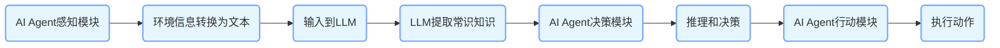

# LLM在AI Agent常识推理中的应用

> 关键词：大语言模型（LLM）、AI Agent、常识推理、自然语言处理、知识表示、推理机制、应用场景

> 摘要：本文深入探讨了大语言模型（LLM）在AI Agent常识推理中的应用。首先介绍了相关背景，包括目的范围、预期读者等内容。接着阐述了LLM、AI Agent和常识推理的核心概念及其联系，通过文本示意图和Mermaid流程图展示其架构。详细讲解了LLM用于常识推理的核心算法原理及具体操作步骤，结合Python源代码进行说明。同时给出了相关数学模型和公式，并举例解释。在项目实战部分，展示了开发环境搭建、源代码实现及代码解读。分析了LLM在AI Agent常识推理中的实际应用场景，推荐了学习资源、开发工具框架以及相关论文著作。最后总结了未来发展趋势与挑战，提供了常见问题解答和扩展阅读参考资料，旨在为该领域的研究和实践提供全面的指导和参考。

## 1. 背景介绍 
### 1.1 目的和范围
随着人工智能技术的快速发展，AI Agent在各个领域的应用越来越广泛。常识推理是AI Agent实现智能行为的关键能力之一，它能够让AI Agent像人类一样理解和处理日常知识。大语言模型（LLM）作为自然语言处理领域的重要成果，具有强大的语言理解和生成能力。本文章的目的在于深入研究LLM在AI Agent常识推理中的应用，探讨如何利用LLM的优势提升AI Agent的常识推理能力。范围涵盖了LLM和AI Agent的核心概念、相关算法原理、数学模型、项目实战、应用场景等多个方面。

### 1.2 预期读者
本文预期读者包括人工智能领域的研究人员、开发者、学生以及对AI Agent和大语言模型感兴趣的技术爱好者。研究人员可以从本文中获取关于LLM在常识推理方面的最新研究思路和方法；开发者可以借鉴项目实战部分的代码和实现步骤，将其应用到实际项目中；学生可以通过阅读本文系统地学习相关知识；技术爱好者则可以通过本文了解该领域的前沿动态和技术原理。

### 1.3 文档结构概述
本文首先介绍相关背景知识，包括目的范围、预期读者等内容。接着详细阐述LLM、AI Agent和常识推理的核心概念及其联系，通过文本示意图和Mermaid流程图展示其架构。然后讲解LLM用于常识推理的核心算法原理及具体操作步骤，结合Python源代码进行说明。随后给出相关数学模型和公式，并举例解释。在项目实战部分，展示开发环境搭建、源代码实现及代码解读。分析LLM在AI Agent常识推理中的实际应用场景，推荐学习资源、开发工具框架以及相关论文著作。最后总结未来发展趋势与挑战，提供常见问题解答和扩展阅读参考资料。

### 1.4 术语表
#### 1.4.1 核心术语定义
- **大语言模型（LLM）**：是一种基于深度学习的语言模型，通过在大规模文本数据上进行训练，学习语言的模式和规律，能够生成自然流畅的文本。
- **AI Agent**：是一种能够感知环境、做出决策并采取行动的智能实体，它可以根据环境的变化自主地完成特定的任务。
- **常识推理**：是指基于人类日常知识和经验进行推理的能力，能够理解和处理常见的事实、关系和情境。

#### 1.4.2 相关概念解释
- **自然语言处理（NLP）**：是人工智能领域的一个重要分支，主要研究如何让计算机理解和处理人类语言，包括语言的理解、生成、翻译等任务。
- **知识表示**：是指将知识以计算机能够理解和处理的形式表示出来，常见的知识表示方法包括语义网络、框架、本体等。
- **推理机制**：是指AI Agent根据已有的知识和信息进行推理和决策的过程，包括演绎推理、归纳推理、类比推理等。

#### 1.4.3 缩略词列表
- **LLM**：Large Language Model（大语言模型）
- **AI**：Artificial Intelligence（人工智能）
- **NLP**：Natural Language Processing（自然语言处理）

## 2. 核心概念与联系 
### 核心概念原理
#### 大语言模型（LLM）
大语言模型通常基于Transformer架构，通过在大规模文本数据上进行无监督学习来学习语言的模式和规律。它的核心思想是通过注意力机制捕捉文本中不同位置之间的依赖关系，从而更好地理解和生成文本。例如，GPT系列模型就是典型的大语言模型，它们在预训练阶段通过预测下一个词的方式学习语言知识，在微调阶段可以针对不同的任务进行优化。

#### AI Agent
AI Agent是一个能够感知环境、做出决策并采取行动的智能实体。它通常由感知模块、决策模块和行动模块组成。感知模块负责获取环境信息，决策模块根据感知到的信息和已有的知识进行推理和决策，行动模块根据决策结果执行相应的动作。例如，在智能机器人中，传感器可以作为感知模块，控制器可以作为决策模块，机械臂可以作为行动模块。

#### 常识推理
常识推理是基于人类日常知识和经验进行推理的能力。它涉及到对常见事实、关系和情境的理解和处理。例如，当我们听到“苹果是一种水果”时，我们可以根据常识推理出苹果可以食用、有营养等信息。常识推理在AI Agent中非常重要，它可以帮助AI Agent更好地理解人类的意图和环境信息，从而做出更合理的决策。

### 架构的文本示意图
LLM在AI Agent常识推理中的应用架构可以描述如下：AI Agent的感知模块获取环境信息，将其转换为文本形式。这些文本信息被输入到LLM中，LLM利用其强大的语言理解能力对文本进行分析和处理，提取相关的常识知识。然后，AI Agent的决策模块根据LLM提供的常识知识和其他信息进行推理和决策，最后行动模块根据决策结果执行相应的动作。

### Mermaid流程图


## 3. 核心算法原理 & 具体操作步骤 
### 核心算法原理
在LLM用于AI Agent常识推理中，主要利用了LLM的语言理解和生成能力。当AI Agent获取到环境信息并转换为文本后，将文本输入到LLM中。LLM通过以下步骤进行处理：
1. **词嵌入**：将输入的文本中的每个词转换为对应的向量表示，以便计算机能够处理。
2. **注意力机制**：通过注意力机制捕捉文本中不同位置之间的依赖关系，从而更好地理解文本的语义。
3. **解码器**：根据输入的文本和注意力机制的结果，生成相关的常识知识或回答。

### 具体操作步骤
以下是使用Python和Hugging Face的Transformers库实现LLM进行常识推理的具体操作步骤：

```python
# 安装必要的库
!pip install transformers

# 导入必要的库
from transformers import AutoTokenizer, AutoModelForCausalLM

# 加载预训练的语言模型和分词器
model_name = "gpt2"
tokenizer = AutoTokenizer.from_pretrained(model_name)
model = AutoModelForCausalLM.from_pretrained(model_name)

# 定义输入文本
input_text = "苹果是一种水果，水果通常是健康的，那么苹果是健康的吗？"

# 对输入文本进行分词
input_ids = tokenizer.encode(input_text, return_tensors="pt")

# 生成输出
output = model.generate(input_ids, max_length=100, num_return_sequences=1)

# 解码输出
output_text = tokenizer.decode(output[0], skip_special_tokens=True)

# 打印输出结果
print("输入文本：", input_text)
print("输出结果：", output_text)
```

### 代码解释
1. **安装和导入库**：使用`pip`安装`transformers`库，然后导入`AutoTokenizer`和`AutoModelForCausalLM`类。
2. **加载预训练模型和分词器**：选择`gpt2`作为预训练模型，使用`AutoTokenizer.from_pretrained`和`AutoModelForCausalLM.from_pretrained`方法加载模型和分词器。
3. **定义输入文本**：定义一个包含常识推理问题的输入文本。
4. **分词**：使用分词器对输入文本进行分词，将其转换为模型可以处理的输入格式。
5. **生成输出**：使用模型的`generate`方法生成输出，设置最大长度和返回序列的数量。
6. **解码输出**：使用分词器对生成的输出进行解码，将其转换为人类可读的文本。
7. **打印结果**：打印输入文本和输出结果。

## 4. 数学模型和公式 & 详细讲解 & 举例说明 
### 数学模型
在LLM中，常用的数学模型是Transformer架构。Transformer架构主要由编码器和解码器组成，其中编码器用于对输入文本进行编码，解码器用于生成输出文本。Transformer的核心是注意力机制，它可以计算输入序列中不同位置之间的相关性。

### 注意力机制公式
注意力机制的核心公式如下：

$$
\text{Attention}(Q, K, V) = \text{softmax}(\frac{QK^T}{\sqrt{d_k}})V
$$

其中：
- $Q$ 是查询矩阵，$K$ 是键矩阵，$V$ 是值矩阵。
- $d_k$ 是键向量的维度。
- $\text{softmax}$ 是一个激活函数，用于将输入转换为概率分布。

### 详细讲解
注意力机制的主要作用是计算输入序列中每个位置与其他位置之间的相关性。具体来说，查询矩阵 $Q$ 表示当前位置的查询信息，键矩阵 $K$ 表示其他位置的键信息，通过计算 $QK^T$ 可以得到每个位置与其他位置之间的相关性得分。为了避免得分过大，需要除以 $\sqrt{d_k}$ 进行缩放。最后，通过 $\text{softmax}$ 函数将得分转换为概率分布，再乘以值矩阵 $V$ 得到加权和，即注意力输出。

### 举例说明
假设我们有一个输入序列 $x = [x_1, x_2, x_3]$，其中每个 $x_i$ 是一个词向量。我们可以将 $x$ 分别投影到查询矩阵 $Q$、键矩阵 $K$ 和值矩阵 $V$ 上，得到 $Q = [q_1, q_2, q_3]$，$K = [k_1, k_2, k_3]$，$V = [v_1, v_2, v_3]$。然后，计算 $QK^T$ 得到相关性得分矩阵：

$$
QK^T = 
\begin{bmatrix}
q_1^Tk_1 & q_1^Tk_2 & q_1^Tk_3 \\
q_2^Tk_1 & q_2^Tk_2 & q_2^Tk_3 \\
q_3^Tk_1 & q_3^Tk_2 & q_3^Tk_3
\end{bmatrix}
$$

接着，除以 $\sqrt{d_k}$ 并通过 $\text{softmax}$ 函数得到概率分布矩阵，最后乘以 $V$ 得到注意力输出。

## 5. 项目实战：代码实际案例和详细解释说明 
### 5.1  开发环境搭建
#### 操作系统
可以选择Windows、Linux或macOS作为开发环境的操作系统。建议使用Linux系统，因为它在开发和部署方面具有更好的性能和稳定性。

#### Python环境
安装Python 3.7或更高版本。可以从Python官方网站下载安装包进行安装，也可以使用Anaconda等Python发行版进行安装。

#### 安装必要的库
使用`pip`或`conda`安装以下必要的库：
- `transformers`：用于加载和使用预训练的语言模型。
- `torch`：深度学习框架，用于模型的训练和推理。

### 5.2  源代码详细实现和代码解读
以下是一个更完整的项目实战代码示例，用于实现基于LLM的AI Agent常识推理：

```python
# 导入必要的库
from transformers import AutoTokenizer, AutoModelForCausalLM
import torch

# 加载预训练的语言模型和分词器
model_name = "gpt2"
tokenizer = AutoTokenizer.from_pretrained(model_name)
model = AutoModelForCausalLM.from_pretrained(model_name)

# 定义AI Agent类
class AIAgent:
    def __init__(self, model, tokenizer):
        self.model = model
        self.tokenizer = tokenizer

    def perceive(self, environment_info):
        # 将环境信息转换为文本
        text = str(environment_info)
        return text

    def reason(self, text):
        # 对输入文本进行分词
        input_ids = self.tokenizer.encode(text, return_tensors="pt")

        # 生成输出
        output = self.model.generate(input_ids, max_length=100, num_return_sequences=1)

        # 解码输出
        output_text = self.tokenizer.decode(output[0], skip_special_tokens=True)
        return output_text

    def act(self, decision):
        # 执行动作，这里简单打印决策结果
        print("执行动作：", decision)

# 创建AI Agent实例
agent = AIAgent(model, tokenizer)

# 模拟环境信息
environment_info = "天空是蓝色的，蓝色通常让人感到平静，那么天空会让人感到平静吗？"

# 感知环境信息
perceived_text = agent.perceive(environment_info)

# 进行常识推理
decision = agent.reason(perceived_text)

# 执行动作
agent.act(decision)
```

### 代码解读与分析
1. **导入库**：导入`transformers`库中的`AutoTokenizer`和`AutoModelForCausalLM`类，以及`torch`库。
2. **加载模型和分词器**：选择`gpt2`作为预训练模型，使用`AutoTokenizer.from_pretrained`和`AutoModelForCausalLM.from_pretrained`方法加载模型和分词器。
3. **定义AI Agent类**：定义一个`AIAgent`类，包含`perceive`、`reason`和`act`三个方法。
    - `perceive`方法：将环境信息转换为文本。
    - `reason`方法：对输入文本进行分词，使用模型生成输出，然后解码输出。
    - `act`方法：执行动作，这里简单打印决策结果。
4. **创建AI Agent实例**：创建一个`AIAgent`实例，传入模型和分词器。
5. **模拟环境信息**：定义一个模拟的环境信息。
6. **感知、推理和执行动作**：调用`perceive`方法感知环境信息，调用`reason`方法进行常识推理，调用`act`方法执行动作。

## 6. 实际应用场景 
### 智能客服
在智能客服场景中，AI Agent可以利用LLM的常识推理能力更好地理解用户的问题，并给出合理的回答。例如，当用户询问“手机充不进电怎么办？”时，AI Agent可以根据常识推理出可能的原因，如充电器故障、手机接口问题等，并给出相应的解决方案。

### 智能助手
智能助手可以利用LLM的常识推理能力为用户提供更加个性化和智能化的服务。例如，当用户询问“今天天气怎么样？我适合穿什么衣服？”时，智能助手可以根据天气信息和常识推理出适合的穿衣建议。

### 智能家居控制
在智能家居控制场景中，AI Agent可以根据用户的指令和环境信息进行常识推理，实现更加智能的家居控制。例如，当用户说“我感觉有点冷”时，AI Agent可以根据常识推理出需要调高室内温度，然后控制空调等设备进行相应的操作。

### 自动驾驶
在自动驾驶场景中，AI Agent需要根据环境信息和交通规则进行常识推理，做出合理的决策。例如，当遇到交通信号灯时，AI Agent可以根据信号灯的颜色和交通规则推理出应该停车、行驶还是等待。

## 7. 工具和资源推荐
### 7.1 学习资源推荐
#### 7.1.1 书籍推荐
- 《深度学习》（Deep Learning）：由Ian Goodfellow、Yoshua Bengio和Aaron Courville合著，是深度学习领域的经典教材，介绍了深度学习的基本概念、算法和应用。
- 《自然语言处理入门》：由何晗编写，系统地介绍了自然语言处理的基础知识和常用算法，适合初学者阅读。
- 《人工智能：一种现代的方法》（Artificial Intelligence: A Modern Approach）：由Stuart Russell和Peter Norvig合著，是人工智能领域的权威教材，涵盖了人工智能的各个方面。

#### 7.1.2 在线课程
- Coursera上的“深度学习专项课程”（Deep Learning Specialization）：由Andrew Ng教授授课，介绍了深度学习的基本概念、算法和应用，是学习深度学习的优质课程。
- edX上的“自然语言处理”（Natural Language Processing）：由哈佛大学的教授授课，系统地介绍了自然语言处理的基础知识和常用算法。
- B站（哔哩哔哩）上有很多关于人工智能和自然语言处理的教程视频，可以根据自己的需求选择学习。

#### 7.1.3 技术博客和网站
- Hugging Face官方博客：提供了关于大语言模型和自然语言处理的最新研究成果和技术文章