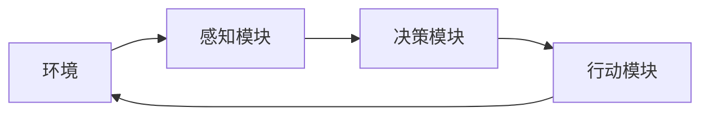

# LLM在AI Agent抽象思维形成中的应用

> 关键词：大语言模型（LLM）、AI Agent、抽象思维、认知架构、知识表征

> 摘要：本文深入探讨了大语言模型（LLM）在AI Agent抽象思维形成中的应用。首先介绍了研究的背景、目的、预期读者和文档结构，阐述了相关术语。接着详细讲解了核心概念及联系，包括LLM和AI Agent的原理与架构，并给出了相应的示意图和流程图。然后分析了核心算法原理，用Python代码进行了说明，同时介绍了相关的数学模型和公式。通过项目实战，展示了如何搭建开发环境、实现源代码并进行解读。探讨了LLM在AI Agent抽象思维形成中的实际应用场景，推荐了学习资源、开发工具框架和相关论文著作。最后总结了未来发展趋势与挑战，解答了常见问题，并提供了扩展阅读和参考资料。

## 1. 背景介绍 
### 1.1 目的和范围
在人工智能的发展进程中，让AI Agent具备抽象思维能力是一个重要的研究方向。大语言模型（LLM）如GPT系列等展现出了强大的语言理解和生成能力，为AI Agent抽象思维的形成提供了新的途径。本文的目的是深入研究LLM如何在AI Agent抽象思维形成中发挥作用，包括原理、算法、应用场景等方面。研究范围涵盖了LLM和AI Agent的基本概念、相关算法、数学模型，以及在实际项目中的应用案例等。

### 1.2 预期读者
本文预期读者包括人工智能领域的研究人员、开发者、对AI技术感兴趣的学生，以及关注AI Agent发展的企业技术人员等。对于想要深入了解LLM和AI Agent抽象思维形成的读者，本文将提供全面而深入的知识。

### 1.3 文档结构概述
本文将按照以下结构展开：首先介绍相关背景知识，包括目的、读者和结构等；接着阐述核心概念与联系，展示其原理和架构；然后讲解核心算法原理和具体操作步骤，用Python代码说明；介绍数学模型和公式并举例；通过项目实战展示代码实现和解读；探讨实际应用场景；推荐相关工具和资源；总结未来发展趋势与挑战；解答常见问题；最后提供扩展阅读和参考资料。

### 1.4 术语表
#### 1.4.1 核心术语定义
- **大语言模型（LLM）**：是一种基于深度学习的自然语言处理模型，通过在大规模文本数据上进行训练，学习语言的模式和规律，能够完成各种自然语言处理任务，如文本生成、问答系统等。
- **AI Agent**：是一种能够感知环境、进行决策并采取行动以实现特定目标的智能实体。它可以与环境进行交互，利用自身的知识和能力完成各种任务。
- **抽象思维**：是指在认识过程中，借助概念、判断、推理等思维形式，对客观事物进行间接的、概括的反映的过程。在AI领域，抽象思维表现为AI Agent能够从具体的信息中提取出一般性的知识和规律。

#### 1.4.2 相关概念解释
- **知识表征**：是指将知识以某种形式表示出来，以便AI Agent能够处理和利用。在LLM和AI Agent中，知识表征可以是文本、向量等形式。
- **认知架构**：是指AI Agent的内部结构和组织方式，包括感知、决策、行动等模块，以及它们之间的交互关系。

#### 1.4.3 缩略词列表
- **LLM**：Large Language Model（大语言模型）
- **AI**：Artificial Intelligence（人工智能）

## 2. 核心概念与联系 
### 2.1 LLM的原理与架构
大语言模型通常基于Transformer架构，它由多个编码器和解码器层组成。Transformer架构的核心是自注意力机制，它能够让模型在处理输入序列时，关注序列中不同位置的信息。

以下是Transformer架构的文本示意图：

```plaintext
输入序列 --> 嵌入层 --> 编码器层（多个） --> 解码器层（多个） --> 输出序列
```

Mermaid流程图如下：


### 2.2 AI Agent的原理与架构
AI Agent一般由感知模块、决策模块和行动模块组成。感知模块负责从环境中获取信息，决策模块根据感知到的信息和自身的知识进行决策，行动模块则根据决策结果采取相应的行动。

以下是AI Agent架构的文本示意图：

```plaintext
环境 --> 感知模块 --> 决策模块 --> 行动模块 --> 环境
```

Mermaid流程图如下：


### 2.3 LLM与AI Agent抽象思维形成的联系
LLM可以为AI Agent提供丰富的语言知识和语义理解能力，帮助AI Agent更好地处理和理解环境中的信息。在抽象思维形成方面，LLM可以协助AI Agent从具体的文本信息中提取出抽象的概念和规律。例如，AI Agent可以将从环境中感知到的具体事件描述输入到LLM中，LLM可以分析这些描述，提取出其中的关键信息和抽象概念，为AI Agent的决策提供支持。

## 3. 核心算法原理 & 具体操作步骤 
### 3.1 自注意力机制算法原理
自注意力机制是Transformer架构的核心，它可以让模型在处理输入序列时，为每个位置的输入计算一个加权和，权重表示该位置与其他位置的相关性。

以下是自注意力机制的Python代码实现：

```python
import torch
import torch.nn as nn

class SelfAttention(nn.Module):
    def __init__(self, input_dim, output_dim):
        super(SelfAttention, self).__init__()
        self.W_q = nn.Linear(input_dim, output_dim)
        self.W_k = nn.Linear(input_dim, output_dim)
        self.W_v = nn.Linear(input_dim, output_dim)

    def forward(self, x):
        queries = self.W_q(x)
        keys = self.W_k(x)
        values = self.W_v(x)

        scores = torch.matmul(queries, keys.transpose(-2, -1))
        attention_weights = torch.softmax(scores, dim=-1)
        output = torch.matmul(attention_weights, values)

        return output

# 示例使用
input_dim = 512
output_dim = 512
input_tensor = torch.randn(10, 20, input_dim)  # 输入序列形状为 (batch_size, sequence_length, input_dim)
attention_layer = SelfAttention(input_dim, output_dim)
output = attention_layer(input_tensor)
print(output.shape)
```

### 3.2 具体操作步骤
1. **数据预处理**：将输入的文本数据进行分词、编码等处理，转换为模型可以接受的输入格式。
2. **嵌入层处理**：将编码后的输入数据通过嵌入层转换为向量表示。
3. **编码器层处理**：将嵌入层的输出输入到编码器层中，经过多个编码器层的处理，提取输入序列的特征。
4. **解码器层处理**：在生成任务中，将编码器层的输出输入到解码器层中，解码器层根据输入和之前生成的部分输出，生成下一个词。
5. **输出处理**：将解码器层的输出进行解码，转换为文本形式。

## 4. 数学模型和公式 & 详细讲解 & 举例说明 
### 4.1 自注意力机制的数学模型
自注意力机制的核心公式如下：

$$
\text{Attention}(Q, K, V) = \text{softmax}(\frac{QK^T}{\sqrt{d_k}})V
$$

其中，$Q$ 是查询矩阵，$K$ 是键矩阵，$V$ 是值矩阵，$d_k$ 是键向量的维度。

### 4.2 详细讲解
- **查询矩阵 $Q$**：由输入序列经过线性变换得到，表示每个位置的查询向量。
- **键矩阵 $K$**：同样由输入序列经过线性变换得到，表示每个位置的键向量。
- **值矩阵 $V$**：由输入序列经过线性变换得到，表示每个位置的值向量。
- **$QK^T$**：计算查询向量和键向量的点积，得到每个位置与其他位置的相关性分数。
- **$\frac{QK^T}{\sqrt{d_k}}$**：为了防止点积结果过大，对分数进行缩放。
- **$\text{softmax}(\frac{QK^T}{\sqrt{d_k}})$**：将缩放后的分数进行softmax操作，得到注意力权重，权重之和为1。
- **$\text{softmax}(\frac{QK^T}{\sqrt{d_k}})V$**：将注意力权重与值矩阵相乘，得到每个位置的加权和，即自注意力机制的输出。

### 4.3 举例说明
假设输入序列为 $[x_1, x_2, x_3]$，每个 $x_i$ 的维度为 $d$。经过线性变换得到查询矩阵 $Q = [q_1, q_2, q_3]$，键矩阵 $K = [k_1, k_2, k_3]$，值矩阵 $V = [v_1, v_2, v_3]$。

计算 $QK^T$ 得到一个 $3 \times 3$ 的矩阵，其中第 $i$ 行第 $j$ 列的元素表示 $q_i$ 和 $k_j$ 的点积。经过缩放和softmax操作后，得到注意力权重矩阵。最后将注意力权重矩阵与值矩阵相乘，得到自注意力机制的输出。

## 5. 项目实战：代码实际案例和详细解释说明 
### 5.1  开发环境搭建
#### 5.1.1 安装Python
首先需要安装Python，建议使用Python 3.7及以上版本。可以从Python官方网站（https://www.python.org/downloads/）下载安装包进行安装。

#### 5.1.2 安装深度学习框架
使用PyTorch作为深度学习框架，可以通过以下命令进行安装：

```bash
pip install torch torchvision
```

#### 5.1.3 安装其他依赖库
安装一些常用的依赖库，如`transformers`用于使用预训练的大语言模型：

```bash
pip install transformers
```

### 5.2  源代码详细实现和代码解读
以下是一个使用`transformers`库和LLM进行文本生成的示例代码：

```python
from transformers import GPT2LMHeadModel, GPT2Tokenizer

# 加载预训练的模型和分词器
tokenizer = GPT2Tokenizer.from_pretrained('gpt2')
model = GPT2LMHeadModel.from_pretrained('gpt2')

# 输入文本
input_text = "Once upon a time"
input_ids = tokenizer.encode(input_text, return_tensors='pt')

# 生成文本
output = model.generate(input_ids, max_length=100, num_beams=5, no_repeat_ngram_size=2, early_stopping=True)

# 解码输出
generated_text = tokenizer.decode(output[0], skip_special_tokens=True)
print(generated_text)
```

#### 代码解读
1. **加载预训练的模型和分词器**：使用`GPT2Tokenizer`和`GPT2LMHeadModel`从`transformers`库中加载预训练的GPT-2模型和分词器。
2. **输入文本编码**：将输入文本使用分词器进行编码，转换为模型可以接受的输入格式。
3. **文本生成**：使用`model.generate()`方法生成文本，设置了最大长度、束搜索的束数、避免重复的n-gram大小等参数。
4. **解码输出**：将生成的输出使用分词器进行解码，转换为文本形式。

### 5.3  代码解读与分析
通过上述代码，我们可以看到如何使用预训练的LLM进行文本生成。模型会根据输入的文本，生成后续的文本内容。在实际应用中，可以根据具体需求调整生成参数，如最大长度、束搜索的束数等，以获得不同的生成效果。同时，也可以将生成的文本作为AI Agent的输入，帮助AI Agent进行决策和行动。

## 6. 实际应用场景 
### 6.1 智能客服
在智能客服场景中，AI Agent可以利用LLM的语言理解和生成能力，更好地理解用户的问题，并提供准确的回答。LLM可以帮助AI Agent从用户的问题中提取关键信息，抽象出问题的本质，然后根据知识库中的知识生成合适的回答。例如，当用户询问“你们的某款产品有什么特点”时，AI Agent可以将问题输入到LLM中，LLM分析问题后，提取出“产品特点”的关键信息，AI Agent根据这个抽象信息从知识库中查找相关内容并生成回答。

### 6.2 智能写作
在智能写作领域，AI Agent可以结合LLM进行文章创作。LLM可以为AI Agent提供丰富的语言表达和知识储备，帮助AI Agent从具体的写作主题中抽象出文章的结构和要点。例如，当给定一个写作主题“人工智能的发展趋势”时，AI Agent可以使用LLM分析相关的资料，提取出人工智能发展的关键趋势，如技术创新、应用拓展等抽象概念，然后根据这些概念组织文章的结构和内容。

### 6.3 智能决策辅助
在商业决策等场景中，AI Agent可以利用LLM对大量的数据和信息进行分析和处理。LLM可以帮助AI Agent从具体的数据中抽象出规律和趋势，为决策提供支持。例如，在市场分析中，AI Agent可以将市场数据输入到LLM中，LLM分析数据后，提取出市场的发展趋势、消费者需求等抽象信息，AI Agent根据这些信息为企业的决策提供建议。

## 7. 工具和资源推荐
### 7.1 学习资源推荐
#### 7.1.1 书籍推荐
- 《深度学习》（Deep Learning）：由Ian Goodfellow、Yoshua Bengio和Aaron Courville所著，是深度学习领域的经典教材，介绍了深度学习的基本原理和方法。
- 《自然语言处理入门》：详细介绍了自然语言处理的基础知识和常用技术，适合初学者入门。

#### 7.1.2 在线课程
- Coursera上的“深度学习专项课程”：由Andrew Ng教授授课，系统地介绍了深度学习的各个方面。
- edX上的“自然语言处理”课程：提供了自然语言处理的深入学习内容。

#### 7.1.3 技术博客和网站
- Hugging Face博客：提供了关于大语言模型和自然语言处理的最新研究成果和应用案例。
- Towards Data Science：是一个数据科学和人工智能领域的技术博客，有很多关于LLM和AI Agent的优秀文章。

### 7.2 开发工具框架推荐
#### 7.2.1 IDE和编辑器
- PyCharm：是一款功能强大的Python集成开发环境，提供了代码编辑、调试、版本控制等功能。
- Jupyter Notebook：适合进行交互式的代码开发和数据分析，方便展示代码和结果。

#### 7.2.2 调试和性能分析工具
- TensorBoard：可以用于可视化深度学习模型的训练过程和性能指标。
- Py-Spy：是一个用于分析Python代码性能的工具，可以帮助找出代码中的性能瓶颈。

#### 7.2.3 相关框架和库
- Transformers：由Hugging Face开发的库，提供了丰富的预训练大语言模型和工具，方便进行自然语言处理任务。
- OpenAI Gym：是一个用于开发和比较强化学习算法的工具包，可以用于训练AI Agent。

### 7.3 相关论文著作推荐
#### 7.3.1 经典论文
- 《Attention Is All You Need》：介绍了Transformer架构，是大语言模型发展的重要里程碑。
- 《Language Models are Unsupervised Multitask Learners》：介绍了GPT模型的原理和应用。

#### 7.3.2 最新研究成果
可以关注arXiv等预印本平台上关于LLM和AI Agent的最新研究论文，了解领域内的前沿动态。

#### 7.3.3 应用案例分析
一些知名的研究机构和企业会发布关于LLM和AI Agent应用的案例分析报告，可以从中学习实际应用中的经验和方法。

## 8. 总结：未来发展趋势与挑战
### 8.1 未来发展趋势
- **更强的抽象思维能力**：未来的LLM和AI Agent将具备更强的抽象思维能力，能够从更复杂的数据和信息中提取出更高级的抽象概念和规律。
- **多模态融合**：将语言信息与图像、音频等多模态信息融合，使AI Agent能够处理更丰富的信息，进一步提升抽象思维能力。
- **自主学习和进化**：AI Agent将具备更强的自主学习能力，能够在不断的交互和实践中自我进化，提高抽象思维水平。

### 8.2 挑战
- **数据质量和隐私问题**：LLM的训练需要大量的数据，数据的质量和隐私问题是需要解决的挑战。低质量的数据可能会影响模型的性能，而隐私问题则涉及到用户信息的保护。
- **计算资源需求**：训练和运行大规模的LLM需要大量的计算资源，如何降低计算成本和提高计算效率是一个重要的挑战。
- **可解释性和可信度**：LLM的决策过程往往是黑盒的，缺乏可解释性和可信度。如何让AI Agent的抽象思维过程和决策结果更加透明和可信，是未来需要解决的问题。

## 9. 附录：常见问题与解答
### 9.1 LLM一定能帮助AI Agent形成抽象思维吗？
不是的，LLM只是为AI Agent提供了丰富的语言知识和语义理解能力，但要形成抽象思维，还需要AI Agent具备合适的认知架构和学习机制。LLM可以作为一种工具，辅助AI Agent从文本信息中提取抽象概念，但不能完全替代AI Agent的抽象思维能力的培养。

### 9.2 如何评估AI Agent的抽象思维能力？
可以从多个方面评估AI Agent的抽象思维能力，如能否从具体的信息中提取出一般性的概念和规律，能否根据抽象概念进行推理和决策，能否解决需要抽象思维的问题等。可以设计一些专门的测试任务，如概念分类、类比推理等，来评估AI Agent的抽象思维能力。

### 9.3 LLM在AI Agent抽象思维形成中的应用有哪些限制？
LLM的应用存在一些限制，如对训练数据的依赖、缺乏真正的理解和常识、处理复杂问题的能力有限等。在实际应用中，需要结合其他技术和方法，如知识图谱、强化学习等，来弥补LLM的不足，提高AI Agent的抽象思维能力。

## 10. 扩展阅读 & 参考资料
### 扩展阅读
- 《AI 3.0》：探讨了人工智能的发展现状和未来趋势，对理解LLM和AI Agent的发展有一定的帮助。
- 《思考，快与慢》：介绍了人类的思维方式和决策过程，对于研究AI Agent的抽象思维形成有一定的启发。

### 参考资料
- Hugging Face官方文档：https://huggingface.co/docs
- OpenAI官方网站：https://openai.com/
- arXiv预印本平台：https://arxiv.org/

作者：AI天才研究院/AI Genius Institute & 禅与计算机程序设计艺术 /Zen And The Art of Computer Programming