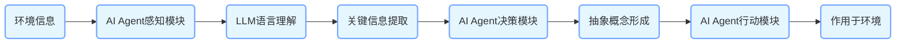

# LLM在AI Agent抽象概念形成中的应用

> 关键词：大语言模型（LLM）、AI Agent、抽象概念形成、人工智能、自然语言处理、认知智能、智能体技术

> 摘要：本文聚焦于大语言模型（LLM）在AI Agent抽象概念形成中的应用。首先介绍了相关背景知识，包括目的、预期读者等内容。接着阐述了LLM和AI Agent的核心概念及联系，通过文本示意图和Mermaid流程图进行直观展示。详细讲解了核心算法原理和具体操作步骤，结合Python代码进行说明。同时给出了相关数学模型和公式，并举例解释。在项目实战部分，通过代码实际案例展示了如何利用LLM助力AI Agent抽象概念的形成，并对代码进行解读分析。探讨了该技术的实际应用场景，推荐了相关的学习资源、开发工具框架以及论文著作。最后总结了未来发展趋势与挑战，解答常见问题，并提供扩展阅读和参考资料，旨在全面深入地探讨LLM在AI Agent抽象概念形成中的关键作用和应用价值。

## 1. 背景介绍 
### 1.1 目的和范围
随着人工智能技术的飞速发展，AI Agent逐渐成为研究和应用的热点。AI Agent旨在模拟人类的智能行为，能够自主感知环境、做出决策并采取行动。而抽象概念形成是人类智能的重要体现，它能够帮助我们从具体的事物和现象中提取出一般性的特征和规律，从而更好地理解和处理信息。大语言模型（LLM）在自然语言处理领域取得了显著的成果，其强大的语言理解和生成能力为AI Agent抽象概念形成提供了新的思路和方法。

本文的目的在于深入探讨LLM在AI Agent抽象概念形成中的应用，分析其原理、方法和实际效果。范围涵盖了从理论基础到实际应用的多个方面，包括核心概念的解释、算法原理的阐述、数学模型的建立、项目实战的演示以及应用场景的探讨等。

### 1.2 预期读者
本文预期读者包括人工智能领域的研究人员、开发者、学生以及对AI Agent和大语言模型感兴趣的技术爱好者。对于研究人员，本文可以提供新的研究方向和思路；对于开发者，本文可以作为技术参考，帮助他们在实际项目中应用相关技术；对于学生，本文可以作为学习资料，加深他们对人工智能相关概念和技术的理解；对于技术爱好者，本文可以满足他们对前沿技术的好奇心。

### 1.3 文档结构概述
本文按照以下结构进行组织：
- 核心概念与联系：介绍LLM和AI Agent的基本概念，以及它们之间的联系，通过文本示意图和Mermaid流程图进行直观展示。
- 核心算法原理 & 具体操作步骤：详细讲解利用LLM实现AI Agent抽象概念形成的核心算法原理，并给出具体的操作步骤，结合Python代码进行说明。
- 数学模型和公式 & 详细讲解 & 举例说明：建立相关的数学模型和公式，对其进行详细讲解，并通过具体例子进行解释。
- 项目实战：代码实际案例和详细解释说明：通过一个实际项目案例，展示如何利用LLM助力AI Agent抽象概念的形成，并对代码进行详细解读和分析。
- 实际应用场景：探讨LLM在AI Agent抽象概念形成中的实际应用场景。
- 工具和资源推荐：推荐相关的学习资源、开发工具框架以及论文著作。
- 总结：未来发展趋势与挑战：总结LLM在AI Agent抽象概念形成中的应用现状，分析未来发展趋势和面临的挑战。
- 附录：常见问题与解答：解答读者在阅读过程中可能遇到的常见问题。
- 扩展阅读 & 参考资料：提供相关的扩展阅读材料和参考资料，方便读者进一步深入学习。

### 1.4 术语表
#### 1.4.1 核心术语定义
- **大语言模型（LLM）**：基于深度学习技术，通过在大规模文本数据上进行训练得到的语言模型，能够生成自然语言文本，理解语言的语义和语法结构。
- **AI Agent**：具有自主感知、决策和行动能力的智能体，能够在一定环境中与其他实体进行交互，以实现特定的目标。
- **抽象概念形成**：从具体的事物和现象中提取出一般性的特征和规律，形成抽象的概念和知识表示的过程。

#### 1.4.2 相关概念解释
- **自然语言处理（NLP）**：研究如何让计算机理解、处理和生成自然语言的技术领域，大语言模型是自然语言处理中的重要研究成果。
- **认知智能**：模拟人类的认知能力，包括感知、理解、推理、学习等方面的智能，AI Agent的发展与认知智能密切相关。

#### 1.4.3 缩略词列表
- **LLM**：Large Language Model（大语言模型）
- **AI**：Artificial Intelligence（人工智能）
- **NLP**：Natural Language Processing（自然语言处理）

## 2. 核心概念与联系 

### 2.1 大语言模型（LLM）
大语言模型是基于Transformer架构的深度学习模型，通过在大规模文本数据上进行无监督学习，学习到语言的统计规律和语义信息。其核心思想是通过自注意力机制来捕捉文本中不同位置之间的依赖关系，从而能够更好地理解和生成自然语言。

以GPT（Generative Pretrained Transformer）系列模型为例，它们在大规模的语料库上进行预训练，学习到了丰富的语言知识。在预训练过程中，模型通过预测下一个词的任务来学习语言的模式和规律。在微调阶段，可以针对具体的任务对模型进行微调，使其适应不同的应用场景。

### 2.2 AI Agent
AI Agent是一个具有自主性、反应性、社会性和主动性的智能实体。自主性是指AI Agent能够独立地感知环境、做出决策并采取行动；反应性是指AI Agent能够对环境中的变化做出及时的反应；社会性是指AI Agent能够与其他智能体或人类进行交互；主动性是指AI Agent能够主动地追求目标。

AI Agent通常由感知模块、决策模块和行动模块组成。感知模块用于获取环境信息，决策模块根据感知到的信息和自身的目标进行决策，行动模块则根据决策结果采取相应的行动。

### 2.3 核心概念联系
LLM可以为AI Agent提供强大的语言理解和生成能力，帮助AI Agent更好地处理自然语言信息。在AI Agent抽象概念形成过程中，LLM可以用于对输入的文本信息进行理解和分析，提取其中的关键信息和特征，从而辅助AI Agent形成抽象概念。

例如，当AI Agent接收到一段关于动物的文本描述时，LLM可以对文本进行语义分析，识别出动物的种类、特征等信息。AI Agent可以根据这些信息，结合自身的知识和经验，形成关于动物的抽象概念，如“哺乳动物”“鸟类”等。

### 2.4 文本示意图
```plaintext
+-----------------+       +-----------------+
|     LLM         |       |     AI Agent    |
+-----------------+       +-----------------+
| - 语言理解      |       | - 感知模块      |
| - 语言生成      |       | - 决策模块      |
| - 知识提取      |       | - 行动模块      |
+-----------------+       +-----------------+
          |                         |
          | 提供语言处理能力         | 利用语言信息进行决策和行动
          |                         |
          +-------------------------+
                   抽象概念形成
```

### 2.5 Mermaid流程图


## 3. 核心算法原理 & 具体操作步骤 

### 3.1 核心算法原理
利用LLM实现AI Agent抽象概念形成的核心算法主要包括以下几个步骤：
1. **文本预处理**：对输入的文本信息进行清洗、分词等预处理操作，以便LLM能够更好地处理。
2. **LLM推理**：将预处理后的文本输入到LLM中，得到LLM的输出结果，包括文本的语义表示、关键信息等。
3. **特征提取**：从LLM的输出结果中提取关键特征，这些特征将用于后续的抽象概念形成。
4. **概念映射**：将提取的特征映射到已有的概念空间中，形成抽象概念。

### 3.2 具体操作步骤
以下是利用Python和Hugging Face的transformers库实现上述步骤的示例代码：

```python
from transformers import AutoTokenizer, AutoModel
import torch
from sklearn.feature_extraction.text import TfidfVectorizer
from sklearn.cluster import KMeans

# 步骤1：文本预处理
def preprocess_text(text):
    # 这里简单地将文本转换为小写
    return text.lower()

# 步骤2：LLM推理
def llm_inference(text):
    # 加载预训练的语言模型和分词器
    tokenizer = AutoTokenizer.from_pretrained('bert-base-uncased')
    model = AutoModel.from_pretrained('bert-base-uncased')

    # 对文本进行分词
    inputs = tokenizer(text, return_tensors='pt')

    # 进行推理
    with torch.no_grad():
        outputs = model(**inputs)

    # 获取最后一层的隐藏状态
    last_hidden_states = outputs.last_hidden_state

    # 取[CLS]标记的表示作为文本的语义表示
    text_embedding = last_hidden_states[:, 0, :].squeeze()

    return text_embedding

# 步骤3：特征提取
def feature_extraction(texts):
    vectorizer = TfidfVectorizer()
    features = vectorizer.fit_transform(texts)
    return features

# 步骤4：概念映射
def concept_mapping(features, num_clusters=3):
    kmeans = KMeans(n_clusters=num_clusters)
    kmeans.fit(features)
    labels = kmeans.labels_
    return labels

# 示例文本
texts = [
    "A cat is a small domestic animal.",
    "A dog is a loyal pet.",
    "A bird can fly in the sky."
]

# 文本预处理
preprocessed_texts = [preprocess_text(text) for text in texts]

# LLM推理
embeddings = [llm_inference(text) for text in preprocessed_texts]

# 特征提取
features = feature_extraction([text.numpy() for text in embeddings])

# 概念映射
labels = concept_mapping(features)

print("概念标签:", labels)
```

### 3.3 代码解释
- **preprocess_text函数**：对输入的文本进行预处理，这里简单地将文本转换为小写。
- **llm_inference函数**：加载预训练的BERT模型和分词器，对输入的文本进行分词和推理，获取文本的语义表示。
- **feature_extraction函数**：使用TF-IDF向量器对文本的语义表示进行特征提取。
- **concept_mapping函数**：使用KMeans聚类算法对提取的特征进行聚类，将文本映射到不同的概念类别中。

## 4. 数学模型和公式 & 详细讲解 & 举例说明 

### 4.1 数学模型
在利用LLM实现AI Agent抽象概念形成的过程中，涉及到多个数学模型，包括语言模型、特征提取模型和概念映射模型。

#### 4.1.1 语言模型
以BERT模型为例，其输入是一个由词向量、位置向量和段向量组成的向量表示：
$$\mathbf{x}_i = \mathbf{e}_{token_i} + \mathbf{e}_{pos_i} + \mathbf{e}_{seg_i}$$
其中，$\mathbf{e}_{token_i}$ 是第 $i$ 个词的词向量，$\mathbf{e}_{pos_i}$ 是第 $i$ 个词的位置向量，$\mathbf{e}_{seg_i}$ 是第 $i$ 个词的段向量。

BERT模型通过多层Transformer编码器对输入向量进行处理，得到每个位置的隐藏状态：
$$\mathbf{h}_i^{l} = \text{Transformer}(\mathbf{h}_i^{l-1})$$
其中，$\mathbf{h}_i^{l}$ 是第 $l$ 层第 $i$ 个位置的隐藏状态，$\text{Transformer}$ 是Transformer编码器的操作。

#### 4.1.2 特征提取模型
TF-IDF（Term Frequency-Inverse Document Frequency）是一种常用的特征提取方法，用于衡量一个词在文档中的重要性。其计算公式为：
$$\text{TF-IDF}(t, d) = \text{TF}(t, d) \times \text{IDF}(t)$$
其中，$\text{TF}(t, d)$ 是词 $t$ 在文档 $d$ 中出现的频率，$\text{IDF}(t)$ 是词 $t$ 的逆文档频率，计算公式为：
$$\text{IDF}(t) = \log\frac{N}{n_t + 1}$$
其中，$N$ 是文档总数，$n_t$ 是包含词 $t$ 的文档数。

#### 4.1.3 概念映射模型
KMeans聚类算法是一种常用的无监督学习算法，用于将数据点划分为不同的簇。其目标是最小化每个簇内数据点到簇中心的距离之和：
$$\min \sum_{i=1}^{k} \sum_{\mathbf{x} \in C_i} \|\mathbf{x} - \mathbf{\mu}_i\|^2$$
其中，$k$ 是簇的数量，$C_i$ 是第 $i$ 个簇，$\mathbf{\mu}_i$ 是第 $i$ 个簇的中心，$\mathbf{x}$ 是数据点。

### 4.2 详细讲解
- **语言模型**：BERT模型通过自注意力机制捕捉文本中不同位置之间的依赖关系，从而能够学习到文本的语义信息。词向量、位置向量和段向量的组合可以帮助模型更好地理解文本的上下文信息。
- **特征提取模型**：TF-IDF方法通过考虑词在文档中的频率和在整个文档集合中的出现频率，能够有效地提取文本的关键特征。高频词在文档中可能是重要的，但如果在所有文档中都频繁出现，则其重要性会降低，IDF的作用就是降低这些高频词的权重。
- **概念映射模型**：KMeans聚类算法通过迭代的方式不断更新簇中心，直到簇中心不再变化或达到最大迭代次数。每个数据点会被分配到距离最近的簇中心所在的簇中，从而实现数据的聚类。

### 4.3 举例说明
假设我们有以下文本集合：
- 文档1：“The cat is cute.”
- 文档2：“The dog is friendly.”
- 文档3：“The bird can fly.”

#### 4.3.1 语言模型
对于文档1，输入到BERT模型中的向量表示会包含“the”“cat”“is”“cute”等词的词向量、位置向量和段向量。经过Transformer编码器的处理，会得到每个位置的隐藏状态，我们可以取[CLS]标记的隐藏状态作为整个文档的语义表示。

#### 4.3.2 特征提取模型
使用TF-IDF方法对文档集合进行特征提取，“cat”在文档1中出现的频率较高，且在其他文档中未出现，因此其TF-IDF值会较高，说明“cat”是文档1的一个重要特征。

#### 4.3.3 概念映射模型
使用KMeans聚类算法对提取的特征进行聚类，假设我们设置簇的数量为2。经过迭代计算，文档1和文档2可能会被分配到一个簇中，因为它们都与宠物相关；文档3可能会被分配到另一个簇中，因为它与会飞的动物相关。

## 5. 项目实战：代码实际案例和详细解释说明 

### 5.1  开发环境搭建
#### 5.1.1 安装Python
确保你已经安装了Python 3.7或更高版本。你可以从Python官方网站（https://www.python.org/downloads/） 下载并安装Python。

#### 5.1.2 创建虚拟环境
为了避免不同项目之间的依赖冲突，建议使用虚拟环境。在命令行中执行以下命令创建并激活虚拟环境：
```bash
# 创建虚拟环境
python -m venv myenv

# 激活虚拟环境（Windows）
myenv\Scripts\activate

# 激活虚拟环境（Linux/Mac）
source myenv/bin/activate
```

#### 5.1.3 安装依赖库
在虚拟环境中安装项目所需的依赖库，包括transformers、torch、sklearn等：
```bash
pip install transformers torch scikit-learn
```

### 5.2  源代码详细实现和代码解读
以下是一个完整的项目代码示例，用于利用LLM实现AI Agent抽象概念形成：

```python
from transformers import AutoTokenizer, AutoModel
import torch
from sklearn.feature_extraction.text import TfidfVectorizer
from sklearn.cluster import KMeans
import numpy as np

# 步骤1：文本预处理
def preprocess_text(text):
    # 去除标点符号，转换为小写
    import re
    text = re.sub(r'[^\w\s]', '', text)
    return text.lower()

# 步骤2：LLM推理
def llm_inference(text):
    # 加载预训练的语言模型和分词器
   