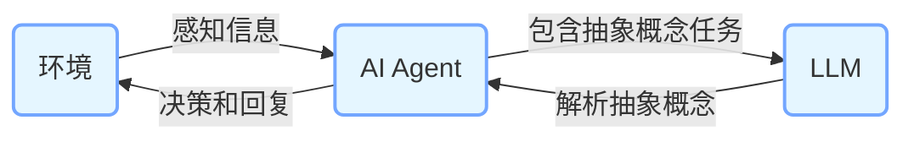

# LLM在AI Agent抽象概念操作中的应用

> 关键词：大语言模型（LLM）、AI Agent、抽象概念操作、智能交互、自然语言处理

> 摘要：本文深入探讨了大语言模型（LLM）在AI Agent抽象概念操作中的应用。首先介绍了相关背景，包括目的范围、预期读者等内容。接着阐述了核心概念及联系，通过文本示意图和Mermaid流程图清晰展示其架构。详细讲解了核心算法原理，并用Python代码进行说明，同时给出了相关数学模型和公式。通过项目实战案例，对代码实现和解读进行了深入分析。探讨了实际应用场景，推荐了学习资源、开发工具框架以及相关论文著作。最后总结了未来发展趋势与挑战，还包含常见问题解答和扩展阅读参考资料，旨在为读者全面呈现LLM在AI Agent抽象概念操作方面的知识体系。

## 1. 背景介绍 
### 1.1 目的和范围
随着人工智能技术的飞速发展，大语言模型（LLM）如GPT系列、文心一言等展现出了强大的语言理解和生成能力。AI Agent作为一种能够自主感知环境、做出决策并执行操作的智能实体，在诸多领域有着广泛的应用前景。本文章的目的在于深入研究LLM在AI Agent抽象概念操作中的应用，探索如何利用LLM的能力提升AI Agent对抽象概念的理解、处理和应用，以实现更加智能、灵活的交互和决策。

本文的范围涵盖了LLM和AI Agent的核心概念、相关算法原理、数学模型、实际项目案例以及应用场景等方面，旨在为读者提供一个全面且深入的知识体系，帮助读者理解和掌握LLM在AI Agent抽象概念操作中的应用技术。

### 1.2 预期读者
本文预期读者包括人工智能领域的研究人员、开发者、学生以及对AI技术感兴趣的专业人士。对于研究人员，本文可提供新的研究思路和方向；对于开发者，可作为技术实践的参考指南；对于学生，有助于他们系统地学习相关知识；对于普通爱好者，能帮助他们了解前沿技术的应用和发展。

### 1.3 文档结构概述
本文将按照以下结构展开：首先介绍核心概念与联系，通过示意图和流程图清晰展示LLM与AI Agent在抽象概念操作中的关系；接着阐述核心算法原理，并给出Python代码示例；然后讲解相关的数学模型和公式，并举例说明；之后通过项目实战案例详细展示代码实现和解读；探讨实际应用场景；推荐学习资源、开发工具框架和相关论文著作；最后总结未来发展趋势与挑战，还包含常见问题解答和扩展阅读参考资料。

### 1.4 术语表
#### 1.4.1 核心术语定义
- **大语言模型（LLM）**：是一种基于深度学习的语言模型，通过在大规模文本数据上进行训练，学习语言的统计规律和语义信息，能够生成自然流畅的文本，进行语言理解、问答等任务。
- **AI Agent**：是一种能够感知环境、根据感知信息做出决策并执行相应操作的智能实体，它可以自主或在人类指导下完成各种任务。
- **抽象概念操作**：指对抽象的、非具体的概念进行理解、表示、推理和应用的过程，例如对“公平”“正义”“情感”等概念的处理。

#### 1.4.2 相关概念解释
- **自然语言处理（NLP）**：是人工智能的一个重要分支，研究如何让计算机理解、处理和生成自然语言，LLM是NLP领域的重要技术成果。
- **知识图谱**：是一种以图的形式表示知识的方法，将实体和它们之间的关系进行建模，有助于AI Agent对抽象概念进行结构化表示和推理。

#### 1.4.3 缩略词列表
- **LLM**：Large Language Model（大语言模型）
- **AI**：Artificial Intelligence（人工智能）
- **NLP**：Natural Language Processing（自然语言处理）

## 2. 核心概念与联系 

### 核心概念原理
大语言模型（LLM）基于Transformer架构，通过在大规模文本数据上进行无监督学习，学习到了丰富的语言知识和语义信息。它能够根据输入的文本生成合理的回复，对自然语言进行理解和生成。

AI Agent则是一个具有自主性和交互性的智能实体，它可以通过传感器感知环境信息，利用内部的决策机制进行决策，并通过执行器执行相应的操作。在抽象概念操作方面，AI Agent需要理解和处理抽象的概念，例如在智能客服场景中，理解用户提出的关于“满意度”“体验感”等抽象概念。

LLM在AI Agent抽象概念操作中的应用，主要是利用LLM强大的语言理解和生成能力，帮助AI Agent更好地理解抽象概念的语义，将抽象概念转化为可操作的信息，并生成相应的决策和回复。例如，当AI Agent接收到一个包含抽象概念的任务描述时，LLM可以对其进行解析，提取关键信息，为AI Agent提供决策依据。

### 架构的文本示意图
```plaintext
             +---------------------+
             |       LLM           |
             +---------------------+
             | - 语言理解与生成   |
             | - 抽象概念解析     |
             +---------------------+
                     ^
                     |
             +---------------------+
             |      AI Agent       |
             +---------------------+
             | - 环境感知         |
             | - 决策制定         |
             | - 操作执行         |
             +---------------------+
                     |
                     v
             +---------------------+
             |      环境           |
             +---------------------+
```

### Mermaid流程图


这个流程图展示了AI Agent与环境进行交互，当接收到包含抽象概念的任务时，将其发送给LLM进行解析，LLM解析后将结果返回给AI Agent，AI Agent根据结果做出决策并回复给环境。

## 3. 核心算法原理 & 具体操作步骤 

### 核心算法原理
在LLM应用于AI Agent抽象概念操作中，主要涉及到以下几个核心算法原理：

#### 词嵌入（Word Embedding）
词嵌入是将文本中的单词映射到低维向量空间的技术，通过词嵌入可以将文本数据转化为计算机能够处理的数值形式。常见的词嵌入模型有Word2Vec、GloVe等。在使用LLM时，输入的文本会首先被转换为词嵌入向量，以便模型进行处理。

#### 注意力机制（Attention Mechanism）
注意力机制是Transformer架构的核心组成部分，它允许模型在处理输入序列时，动态地关注不同位置的信息。在抽象概念操作中，注意力机制可以帮助模型聚焦于与抽象概念相关的关键信息，提高对抽象概念的理解能力。

#### 生成式模型（Generative Model）
LLM作为一种生成式模型，能够根据输入的文本生成相应的输出。在AI Agent的应用中，LLM可以根据抽象概念的解析结果，生成合理的决策和回复。

### 具体操作步骤
以下是使用Python代码结合Hugging Face的Transformers库实现LLM在AI Agent抽象概念操作中的具体步骤：

```python
from transformers import AutoTokenizer, AutoModelForCausalLM

# 加载预训练的LLM模型和分词器
model_name = "gpt2"
tokenizer = AutoTokenizer.from_pretrained(model_name)
model = AutoModelForCausalLM.from_pretrained(model_name)

# 定义AI Agent接收的包含抽象概念的任务描述
abstract_task = "请分析这个产品的用户满意度如何"

# 将任务描述转换为模型可接受的输入
input_ids = tokenizer.encode(abstract_task, return_tensors='pt')

# 使用模型进行推理
output = model.generate(input_ids, max_length=100, num_return_sequences=1)

# 将模型输出解码为文本
response = tokenizer.decode(output[0], skip_special_tokens=True)

print("AI Agent的回复:", response)
```

### 代码解释
1. **加载模型和分词器**：使用`AutoTokenizer`和`AutoModelForCausalLM`从Hugging Face的模型库中加载预训练的GPT-2模型和对应的分词器。
2. **定义任务描述**：定义一个包含抽象概念“用户满意度”的任务描述。
3. **文本编码**：使用分词器将任务描述编码为模型可接受的输入张量。
4. **模型推理**：使用模型的`generate`方法进行推理，生成输出序列。
5. **文本解码**：将模型输出的张量解码为文本，并打印AI Agent的回复。

## 4. 数学模型和公式 & 详细讲解 & 举例说明 

### 词嵌入模型
词嵌入模型的目标是将单词映射到一个低维向量空间，使得语义相似的单词在向量空间中距离较近。以Word2Vec为例，它有两种训练模式：Skip-gram和CBOW。

#### Skip-gram模型
Skip-gram模型的目标是根据中心词预测其上下文单词。假设我们有一个包含$V$个单词的词汇表，输入的中心词为$w_c$，其对应的词向量为$\mathbf{v}_c$，上下文单词为$w_o$，其对应的词向量为$\mathbf{u}_o$。Skip-gram模型的目标函数是最大化以下概率：

$$
J(\theta) = \prod_{t=1}^{T} \prod_{-c \leq j \leq c, j \neq 0} P(w_{t+j} | w_t)
$$

其中，$T$是文本序列的长度，$c$是上下文窗口的大小。$P(w_o | w_c)$可以通过softmax函数计算：

$$
P(w_o | w_c) = \frac{\exp(\mathbf{u}_o^T \mathbf{v}_c)}{\sum_{w=1}^{V} \exp(\mathbf{u}_w^T \mathbf{v}_c)}
$$

#### 举例说明
假设我们有一个简单的句子“the cat sat on the mat”，以“cat”为中心词，上下文窗口大小为1，则上下文单词为“the”和“sat”。Skip-gram模型的目标是根据“cat”的词向量预测“the”和“sat”的词向量。

### 注意力机制
注意力机制通过计算查询（Query）、键（Key）和值（Value）之间的相似度来确定每个输入位置的权重。假设输入序列为$\mathbf{X} = [\mathbf{x}_1, \mathbf{x}_2, \cdots, \mathbf{x}_n]$，查询、键和值分别通过线性变换得到：

$$
\mathbf{Q} = \mathbf{X} \mathbf{W}_Q
$$
$$
\mathbf{K} = \mathbf{X} \mathbf{W}_K
$$
$$
\mathbf{V} = \mathbf{X} \mathbf{W}_V
$$

其中，$\mathbf{W}_Q$、$\mathbf{W}_K$和$\mathbf{W}_V$是可学习的权重矩阵。注意力分数通过查询和键的点积计算：

$$
\mathbf{Attention}(\mathbf{Q}, \mathbf{K}, \mathbf{V}) = \text{softmax}\left(\frac{\mathbf{Q} \mathbf{K}^T}{\sqrt{d_k}}\right) \mathbf{V}
$$

其中，$d_k$是键向量的维度。

#### 举例说明
假设我们有一个输入序列$\mathbf{X} = [\mathbf{x}_1, \mathbf{x}_2, \mathbf{x}_3]$，通过线性变换得到查询$\mathbf{Q} = [\mathbf{q}_1, \mathbf{q}_2, \mathbf{q}_3]$，键$\mathbf{K} = [\mathbf{k}_1, \mathbf{k}_2, \mathbf{k}_3]$和值$\mathbf{V} = [\mathbf{v}_1, \mathbf{v}_2, \mathbf{v}_3]$。注意力分数计算如下：

$$
\text{Attention}(\mathbf{q}_1) = \text{softmax}\left(\left[\frac{\mathbf{q}_1^T \mathbf{k}_1}{\sqrt{d_k}}, \frac{\mathbf{q}_1^T \mathbf{k}_2}{\sqrt{d_k}}, \frac{\mathbf{q}_1^T \mathbf{k}_3}{\sqrt{d_k}}\right]\right) \begin{bmatrix} \mathbf{v}_1 \\ \mathbf{v}_2 \\ \mathbf{v}_3 \end{bmatrix}
$$

### 生成式模型
生成式模型通过最大化训练数据的似然函数来学习语言的概率分布。以自回归语言模型为例，给定输入序列$\mathbf{x} = [x_1, x_2, \cdots, x_n]$，模型的目标是最大化以下概率：

$$
P(\mathbf{x}) = \prod_{t=1}^{n} P(x_t | x_1, x_2, \cdots, x_{t-1})
$$

在推理阶段，模型根据输入的前缀序列生成下一个单词，直到达到最大长度或遇到结束标记。

#### 举例说明
假设输入序列为“Hello, how are”，模型将根据这个前缀序列预测下一个单词，例如预测为“you”，然后继续预测后续的单词，直到生成一个完整的句子。

## 5. 项目实战：代码实际案例和详细解释说明 

### 5.1  开发环境搭建
#### 安装Python
首先，确保你已经安装了Python 3.6或更高版本。可以从Python官方网站（https://www.python.org/downloads/）下载并安装适合你操作系统的Python版本。

#### 创建虚拟环境
为了避免不同项目之间的依赖冲突，建议使用虚拟环境。在命令行中执行以下命令创建并激活虚拟环境：

```bash
# 创建虚拟环境
python -m venv llm_agent_env

# 激活虚拟环境（Windows）
llm_agent_env\Scripts\activate

# 激活虚拟环境（Linux/Mac）
source llm_agent_env/bin/activate
```

#### 安装依赖库
在虚拟环境中安装所需的依赖库，主要包括Hugging Face的Transformers库和torch：

```bash
pip install transformers torch
```

### 5.2  源代码详细实现和代码解读
以下是一个完整的项目实战代码示例，实现了一个简单的AI Agent，利用LLM进行抽象概念操作：

```python
from transformers import AutoTokenizer, AutoModelForCausalLM

# 加载预训练的LLM模型和分词器
model_name = "gpt2"
tokenizer = AutoTokenizer.from_pretrained(model_name)
model = AutoModelForCausalLM.from_pretrained(model_name)

# 定义AI Agent类
class AIAgent:
    def __init__(self, model, tokenizer):
        self.model = model
        self.tokenizer = tokenizer

    def process_abstract_task(self, task):
        # 将任务描述转换为模型可接受的输入
        input_ids = self.tokenizer.encode(task, return_tensors='pt')

        # 使用模型进行推理
        output = self.model.generate(input_ids, max_length=100, num_return_sequences=1)

        # 将模型输出解码为文本
        response = self.tokenizer.decode(output[0], skip_special_tokens=True)

        return response

# 创建AI Agent实例
agent = AIAgent(model, tokenizer)

# 定义包含抽象概念的任务
abstract_task = "请分析这个项目的创新性如何"

# 处理任务并获取回复
response = agent.process_abstract_task(abstract_task)

print("AI Agent的回复:", response)
```

### 代码解读与分析
1. **加载模型和分词器**：使用`AutoTokenizer`和`AutoModelForCausalLM`从Hugging Face的模型库中加载预训练的GPT-2模型和对应的分词器。
2. **定义AI Agent类**：`AIAgent`类封装了模型和分词器，提供了`process_abstract_task`方法用于处理包含抽象概念的任务。
3. **处理抽象概念任务**：在`process_abstract_task`方法中，首先将任务描述编码为模型可接受的输入张量，然后使用模型进行推理，最后将模型输出解码为文本并返回。
4. **创建AI Agent实例并处理任务**：创建`AIAgent`实例，定义一个包含抽象概念“创新性”的任务，调用`process_abstract_task`方法处理任务并打印回复。

通过这个项目实战，我们可以看到如何利用LLM实现AI Agent对抽象概念的操作。

## 6. 实际应用场景 
### 智能客服
在智能客服场景中，用户可能会提出一些包含抽象概念的问题，例如“你们的服务质量怎么样”“产品的性价比高吗”等。AI Agent可以利用LLM对这些抽象概念进行理解和分析，结合知识库和历史数据，为用户提供准确、详细的回复。例如，AI Agent可以分析产品的价格、性能、功能等因素，给出关于性价比的评价，并提供相应的产品推荐。

### 智能写作
在智能写作领域，AI Agent可以根据用户输入的抽象主题，如“环保意识的重要性”“科技对社会的影响”等，利用LLM生成相关的文章内容。LLM可以帮助AI Agent理解抽象主题的含义，组织文章结构，生成合理的段落和句子，提高写作效率和质量。

### 教育辅导
在教育辅导场景中，AI Agent可以作为学生的学习助手，处理学生提出的抽象概念问题，如“数学中的极限概念是什么”“历史事件的影响如何分析”等。LLM可以帮助AI Agent准确理解学生的问题，提供详细的解释和示例，辅助学生学习和理解抽象概念。

### 决策支持
在企业决策场景中，AI Agent可以根据市场数据、行业趋势等信息，结合LLM对抽象概念的分析能力，为企业提供决策支持。例如，分析市场的“竞争力”“发展潜力”等抽象概念，帮助企业制定战略规划、产品研发等决策。

## 7. 工具和资源推荐
### 7.1 学习资源推荐
#### 7.1.1 书籍推荐
- 《深度学习》（Deep Learning）：由Ian Goodfellow、Yoshua Bengio和Aaron Courville所著，是深度学习领域的经典教材，涵盖了神经网络、深度学习模型等基础知识。
- 《自然语言处理入门》：详细介绍了自然语言处理的基本概念、算法和技术，适合初学者入门。
- 《Transformer：自然语言处理的新范式》：深入讲解了Transformer架构及其在自然语言处理中的应用，对于理解LLM的原理非常有帮助。

#### 7.1.2 在线课程
- Coursera上的“深度学习专项课程”：由Andrew Ng教授主讲，包括神经网络、卷积神经网络、循环神经网络等多个模块，对深度学习的理论和实践进行了系统的讲解。
- edX上的“自然语言处理基础”：提供了自然语言处理的基础知识和技术，包括词法分析、句法分析、语义分析等内容。
- Hugging Face的官方教程：提供了关于Transformers库的详细使用教程，包括模型加载、文本生成、微调等操作。

#### 7.1.3 技术博客和网站
- Medium：上面有很多关于人工智能、自然语言处理的技术博客文章，涵盖了最新的研究成果和实践经验。
- arXiv：是一个预印本数据库，提供了大量的学术论文，包括人工智能领域的最新研究成果。
- Hugging Face的官方博客：发布了关于LLM和自然语言处理的最新消息、技术文章和模型更新。

### 7.2 开发工具框架推荐
#### 7.2.1 IDE和编辑器
- PyCharm：是一款专门为Python开发设计的集成开发环境，提供了代码编辑、调试、版本控制等功能，适合Python项目的开发。
- Visual Studio Code：是一款轻量级的代码编辑器，支持多种编程语言，具有丰富的插件扩展功能，可用于Python代码的开发和调试。

#### 7.2.2 调试和性能分析工具
- Py-Spy：是一个用于Python代码性能分析的工具，可以实时监控Python程序的CPU使用率、函数调用时间等信息，帮助开发者找出性能瓶颈。
- TensorBoard：是TensorFlow提供的一个可视化工具，可用于可视化深度学习模型的训练过程、损失函数变化等信息，方便开发者进行模型调试和优化。

#### 7.2.3 相关框架和库
- Hugging Face Transformers：是一个开源的自然语言处理库，提供了大量的预训练模型和工具，方便开发者进行模型加载、微调、文本生成等操作。
- PyTorch：是一个深度学习框架，具有动态图计算的特点，易于使用和调试，广泛应用于自然语言处理、计算机视觉等领域。
- SpaCy：是一个高效的自然语言处理库，提供了词法分析、句法分析、命名实体识别等功能，可用于文本预处理和分析。

### 7.3 相关论文著作推荐
#### 7.3.1 经典论文
- “Attention Is All You Need”：介绍了Transformer架构，是现代大语言模型的基础。
- “BERT: Pre-training of Deep Bidirectional Transformers for Language Understanding”：提出了BERT模型，开创了预训练语言模型的新时代。
- “GPT: Generative Pretrained Transformer”：介绍了GPT模型的原理和训练方法。

#### 7.3.2 最新研究成果
- 关注arXiv上关于大语言模型、AI Agent的最新研究论文，了解该领域的前沿技术和发展趋势。
- 参加相关的学术会议，如NeurIPS、ACL等，获取最新的研究成果和行业动态。

#### 7.3.3 应用案例分析
- 关注各大科技公司的技术博客和开源项目，了解他们在实际应用中如何使用LLM和AI Agent解决具体问题。
- 研究一些知名的开源项目，如OpenAI的GPT系列、Hugging Face的Transformers库等，学习他们的实现思路和技术方案。

## 8. 总结：未来发展趋势与挑战
### 未来发展趋势
#### 多模态融合
未来，LLM在AI Agent抽象概念操作中的应用将不仅仅局限于文本信息，还将与图像、音频、视频等多模态信息进行融合。例如，在智能客服场景中，AI Agent可以同时处理用户的语音提问和上传的图片信息，提供更加全面和准确的回复。

#### 个性化和自适应
随着用户需求的不断多样化，AI Agent将更加注重个性化和自适应。通过对用户历史数据和行为模式的分析，LLM可以帮助AI Agent更好地理解用户的偏好和需求，提供个性化的服务和建议。例如，在智能写作场景中，根据用户的写作风格和需求，生成符合用户特点的文章内容。

#### 强化学习与LLM的结合
强化学习可以让AI Agent在与环境的交互中不断学习和优化决策策略。将强化学习与LLM相结合，可以提高AI Agent在抽象概念操作中的决策能力和适应性。例如，在游戏领域，AI Agent可以利用LLM理解游戏规则和策略，通过强化学习不断提高游戏水平。

### 挑战
#### 计算资源需求
LLM通常需要大量的计算资源进行训练和推理，这对于硬件设备和计算成本提出了很高的要求。如何在有限的计算资源下提高LLM的性能和效率，是一个亟待解决的问题。

#### 抽象概念理解的准确性
虽然LLM在语言理解和生成方面取得了很大的进展，但对于一些复杂的抽象概念，仍然存在理解不准确的问题。例如，对于“文化内涵”“哲学思想”等抽象概念，LLM可能无法完全准确地理解其含义和本质。

#### 伦理和安全问题
随着AI Agent的广泛应用，伦理和安全问题也日益凸显。例如，AI Agent可能会生成虚假信息、偏见性内容等，对社会和个人造成不良影响。如何确保LLM在AI Agent抽象概念操作中的应用符合伦理和安全标准，是一个重要的挑战。

## 9. 附录：常见问题与解答
### 问题1：LLM在AI Agent抽象概念操作中的应用有哪些局限性？
答：LLM在AI Agent抽象概念操作中的应用存在一些局限性。首先，对于一些非常抽象、模糊的概念，LLM可能无法准确理解其含义，导致生成的回复不准确或不完整。其次，LLM的训练数据可能存在偏差，导致其在处理某些领域的抽象概念时存在局限性。此外，LLM的计算资源需求较大，在一些资源受限的环境中可能无法正常运行。

### 问题2：如何提高AI Agent对抽象概念的理解能力？
答：可以从以下几个方面提高AI Agent对抽象概念的理解能力。一是使用更强大的LLM模型，这些模型通常在大规模数据上进行训练，具有更好的语言理解和生成能力。二是结合知识图谱等结构化知识，帮助AI Agent对抽象概念进行更深入的理解和推理。三是进行领域特定的微调，将LLM在特定领域的数据上进行微调，提高其在该领域的抽象概念处理能力。

### 问题3：LLM和AI Agent的结合是否会取代人类的工作？
答：LLM和AI Agent的结合可以提高工作效率和质量，但不会完全取代人类的工作。虽然它们在处理一些重复性、规律性的任务方面具有优势，但在创造性思维、情感理解、复杂决策等方面，人类仍然具有不可替代的优势。未来，LLM和AI Agent将更多地作为人类的辅助工具，与人类协同工作。

## 10. 扩展阅读 & 参考资料
### 扩展阅读
- 《人工智能时代的伦理与安全》：深入探讨了人工智能发展过程中的伦理和安全问题，对于理解LLM在AI Agent应用中的伦理挑战具有重要参考价值。
- 《智能时代的人机协作》：介绍了人类与人工智能在各个领域的协作模式和发展趋势，有助于读者了解LLM和AI Agent在未来的应用前景。

### 参考资料
- Hugging Face官方文档：https://huggingface.co/docs
- OpenAI官方网站：https://openai.com/
- arXiv预印本数据库：https://arxiv.org/

作者：AI天才研究院/AI Genius Institute & 禅与计算机程序设计艺术 /Zen And The Art of Computer Programming