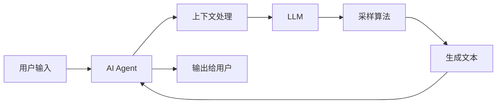

# LLM在AI Agent语言生成多样性上的优化

> 关键词：大语言模型（LLM）、AI Agent、语言生成多样性、优化策略、采样算法

> 摘要：本文聚焦于大语言模型（LLM）在AI Agent语言生成多样性方面的优化问题。首先介绍了研究的背景、目的和预期读者，对相关术语进行了清晰定义。接着阐述了LLM和AI Agent的核心概念及其联系，给出了原理和架构的文本示意图与Mermaid流程图。详细讲解了用于优化语言生成多样性的核心算法原理，包括Python源代码示例。深入分析了相关数学模型和公式，并举例说明。通过项目实战，展示了开发环境搭建、源代码实现与解读。探讨了LLM在AI Agent语言生成多样性优化的实际应用场景，推荐了学习资源、开发工具框架以及相关论文著作。最后总结了未来发展趋势与挑战，解答了常见问题，并提供了扩展阅读和参考资料，旨在为相关领域的研究者和开发者提供全面而深入的指导。

## 1. 背景介绍 
### 1.1 目的和范围
随着人工智能技术的飞速发展，大语言模型（LLM）如ChatGPT、GPT - 4等在自然语言处理领域取得了显著成就。AI Agent作为能够自主感知环境、做出决策并采取行动的智能体，在很多应用场景中需要借助LLM进行语言生成。然而，目前LLM生成的语言往往存在多样性不足的问题，表现为生成的文本模式化、缺乏新意。本研究的目的就是探讨如何对LLM在AI Agent语言生成多样性上进行优化，以提高AI Agent在与用户交互、信息生成等方面的表现。研究范围涵盖了相关的核心概念、算法原理、数学模型、项目实战以及实际应用场景等多个方面。

### 1.2 预期读者
本文预期读者包括自然语言处理领域的研究者、AI Agent开发者、对大语言模型和人工智能技术感兴趣的程序员以及相关专业的学生。这些读者可能希望深入了解LLM在AI Agent语言生成多样性优化方面的理论和实践知识，以推动相关技术的发展和应用。

### 1.3 文档结构概述
本文将按照以下结构展开：首先介绍核心概念与联系，让读者对LLM和AI Agent有清晰的认识；接着阐述核心算法原理和具体操作步骤，通过Python代码详细说明；然后讲解相关的数学模型和公式，并举例说明；进行项目实战，包括开发环境搭建、源代码实现和代码解读；探讨实际应用场景；推荐相关的工具和资源；总结未来发展趋势与挑战；最后解答常见问题并提供扩展阅读和参考资料。

### 1.4 术语表
#### 1.4.1 核心术语定义
- **大语言模型（LLM）**：基于深度学习的大规模语言模型，通过在海量文本数据上进行训练，学习语言的模式和规律，能够生成自然流畅的文本。
- **AI Agent**：一种能够感知环境、根据感知信息做出决策并采取行动的智能体，在语言交互场景中可以利用LLM进行语言生成。
- **语言生成多样性**：指LLM生成的文本在内容、表达方式、风格等方面具有丰富的变化，避免生成千篇一律的文本。

#### 1.4.2 相关概念解释
- **采样算法**：在LLM生成文本时，用于从模型输出的概率分布中选择下一个词的算法，不同的采样算法会影响生成文本的多样性。
- **温度参数**：在采样算法中，用于控制概率分布的平滑程度的参数，较高的温度会使分布更加均匀，增加生成的随机性和多样性。

#### 1.4.3 缩略词列表
- **LLM**：Large Language Model（大语言模型）
- **AI**：Artificial Intelligence（人工智能）

## 2. 核心概念与联系 
### 核心概念原理
#### 大语言模型（LLM）
大语言模型通常基于Transformer架构，如GPT系列模型。Transformer架构由编码器和解码器组成（在GPT中主要使用解码器部分），通过多头自注意力机制捕捉文本中的长距离依赖关系。LLM在大规模的文本数据上进行预训练，学习到语言的语法、语义和语用等知识。在生成文本时，模型根据输入的上下文信息，预测下一个词的概率分布，然后通过采样算法选择合适的词作为输出，逐步生成完整的文本。

#### AI Agent
AI Agent是一种具有自主性、反应性和社会性的智能体。在语言交互场景中，AI Agent可以接收用户的输入信息，将其作为上下文传递给LLM，然后根据LLM生成的文本做出相应的反应，如回答问题、提供建议等。AI Agent还可以根据环境信息和自身的目标，对LLM生成的文本进行筛选和调整，以实现更有效的交互。

### 架构的文本示意图
```plaintext
用户输入 -> AI Agent
           |
           v
上下文处理 -> LLM（预测下一个词的概率分布）
           |
           v
采样算法（选择下一个词）
           |
           v
生成文本 -> AI Agent
           |
           v
输出给用户
```

### Mermaid流程图


## 3. 核心算法原理 & 具体操作步骤 
### 核心算法原理
#### 基于温度的采样算法
在传统的贪婪搜索中，每次都选择概率最大的词作为输出，这样会导致生成的文本缺乏多样性。基于温度的采样算法通过调整温度参数来改变概率分布的平滑程度。设模型输出的词的概率分布为 $P = [p_1, p_2, \cdots, p_n]$，温度参数为 $T$，则调整后的概率分布 $P'$ 为：

$$p_i' = \frac{e^{p_i / T}}{\sum_{j = 1}^{n} e^{p_j / T}}$$

当 $T$ 较小时，概率分布会更加尖锐，模型更倾向于选择概率大的词，生成的文本更加确定；当 $T$ 较大时，概率分布会更加平滑，模型选择其他词的可能性增加，生成的文本更加多样化。

#### 核采样（Top - k和Top - p采样）
- **Top - k采样**：只考虑概率最大的 $k$ 个词，将其他词的概率设为0，然后在这 $k$ 个词中进行采样。这种方法可以避免选择概率极小的词，但 $k$ 值的选择需要根据具体情况进行调整。
- **Top - p采样**：也称为核采样，选择概率累积和超过阈值 $p$ 的最小词集合，然后在这个集合中进行采样。这种方法可以自适应地选择合适的词集合，避免了固定 $k$ 值可能带来的问题。

### 具体操作步骤和Python源代码示例
```python
import torch
import torch.nn.functional as F

def temperature_sampling(logits, temperature=1.0):
    """
    基于温度的采样算法
    :param logits: 模型输出的未经过softmax的分数
    :param temperature: 温度参数
    :return: 采样得到的词的索引
    """
    probs = F.softmax(logits / temperature, dim=-1)
    next_token = torch.multinomial(probs, num_samples=1).item()
    return next_token

def top_k_sampling(logits, k=5):
    """
    Top - k采样算法
    :param logits: 模型输出的未经过softmax的分数
    :param k: 选择概率最大的k个词
    :return: 采样得到的词的索引
    """
    top_k_logits, top_k_indices = torch.topk(logits, k=k)
    top_k_probs = F.softmax(top_k_logits, dim=-1)
    next_token_index = torch.multinomial(top_k_probs, num_samples=1).item()
    next_token = top_k_indices[next_token_index].item()
    return next_token

def top_p_sampling(logits, p=0.9):
    """
    Top - p采样算法
    :param logits: 模型输出的未经过softmax的分数
    :param p: 概率累积和的阈值
    :return: 采样得到的词的索引
    """
    sorted_logits, sorted_indices = torch.sort(logits, descending=True)
    cumulative_probs = torch.cumsum(F.softmax(sorted_logits, dim=-1), dim=-1)
    # 移除累积概率超过p的词
    sorted_indices_to_remove = cumulative_probs > p
    # 确保至少保留一个词
    sorted_indices_to_remove[..., 1:] = sorted_indices_to_remove[..., :-1].clone()
    sorted_indices_to_remove[..., 0] = 0
    indices_to_remove = sorted_indices[sorted_indices_to_remove]
    logits[indices_to_remove] = float('-inf')
    probs = F.softmax(logits, dim=-1)
    next_token = torch.multinomial(probs, num_samples=1).item()
    return next_token
```

## 4. 数学模型和公式 & 详细讲解 & 举例说明 
### 基于温度的采样算法数学模型和公式
如前文所述，基于温度的采样算法通过调整温度参数 $T$ 来改变概率分布。设原始的概率分布为 $P = [p_1, p_2, \cdots, p_n]$，调整后的概率分布 $P'$ 为：

$$p_i' = \frac{e^{p_i / T}}{\sum_{j = 1}^{n} e^{p_j / T}}$$

详细讲解：当 $T = 1$ 时，调整后的概率分布与原始概率分布相同；当 $T < 1$ 时，概率分布会更加尖锐，模型更倾向于选择概率大的词；当 $T > 1$ 时，概率分布会更加平滑，模型选择其他词的可能性增加。

举例说明：假设模型输出的概率分布为 $P = [0.1, 0.2, 0.3, 0.4]$，当 $T = 1$ 时，调整后的概率分布不变；当 $T = 0.5$ 时，计算如下：

$$p_1' = \frac{e^{0.1 / 0.5}}{\sum_{j = 1}^{4} e^{p_j / 0.5}} = \frac{e^{0.2}}{e^{0.2}+e^{0.4}+e^{0.6}+e^{0.8}} \approx 0.07$$
$$p_2' = \frac{e^{0.2 / 0.5}}{\sum_{j = 1}^{4} e^{p_j / 0.5}} = \frac{e^{0.4}}{e^{0.2}+e^{0.4}+e^{0.6}+e^{0.8}} \approx 0.12$$
$$p_3' = \frac{e^{0.3 / 0.5}}{\sum_{j = 1}^{4} e^{p_j / 0.5}} = \frac{e^{0.6}}{e^{0.2}+e^{0.4}+e^{0.6}+e^{0.8}} \approx 0.22$$
$$p_4' = \frac{e^{0.4 / 0.5}}{\sum_{j = 1}^{4} e^{p_j / 0.5}} = \frac{e^{0.8}}{e^{0.2}+e^{0.4}+e^{0.6}+e^{0.8}} \approx 0.59$$

可以看到，概率分布更加尖锐，模型更倾向于选择概率最大的词。

当 $T = 2$ 时：

$$p_1' = \frac{e^{0.1 / 2}}{\sum_{j = 1}^{4} e^{p_j / 2}} = \frac{e^{0.05}}{e^{0.05}+e^{0.1}+e^{0.15}+e^{0.2}} \approx 0.22$$
$$p_2' = \frac{e^{0.2 / 2}}{\sum_{j = 1}^{4} e^{p_j / 2}} = \frac{e^{0.1}}{e^{0.05}+e^{0.1}+e^{0.15}+e^{0.2}} \approx 0.24$$
$$p_3' = \frac{e^{0.3 / 2}}{\sum_{j = 1}^{4} e^{p_j / 2}} = \frac{e^{0.15}}{e^{0.05}+e^{0.1}+e^{0.15}+e^{0.2}} \approx 0.26$$
$$p_4' = \frac{e^{0.4 / 2}}{\sum_{j = 1}^{4} e^{p_j / 2}} = \frac{e^{0.2}}{e^{0.05}+e^{0.1}+e^{0.15}+e^{0.2}} \approx 0.28$$

概率分布更加平滑，模型选择其他词的可能性增加。

### 核采样（Top - k和Top - p采样）数学模型和公式
#### Top - k采样
设模型输出的概率分布为 $P = [p_1, p_2, \cdots, p_n]$，选择概率最大的 $k$ 个词，将其他词的概率设为0。设 $S$ 是概率最大的 $k$ 个词的索引集合，则调整后的概率分布 $P'$ 为：

$$p_i' = \begin{cases}
\frac{p_i}{\sum_{j \in S} p_j}, & i \in S \\
0, & i \notin S
\end{cases}$$

#### Top - p采样
设模型输出的概率分布为 $P = [p_1, p_2, \cdots, p_n]$，首先对概率分布进行排序得到 $P_{sorted} = [p_{sorted_1}, p_{sorted_2}, \cdots, p_{sorted_n}]$，然后计算累积概率 $C = [c_1, c_2, \cdots, c_n]$，其中 $c_i = \sum_{j = 1}^{i} p_{sorted_j}$。选择最小的 $m$ 使得 $c_m > p$，则调整后的概率分布 $P'$ 只考虑前 $m$ 个词，其他词的概率设为0，然后对这 $m$ 个词的概率进行归一化。

举例说明：假设模型输出的概率分布为 $P = [0.05, 0.1, 0.15, 0.2, 0.25, 0.25]$，$k = 3$，则选择概率最大的3个词，即 $[0.2, 0.25, 0.25]$，调整后的概率分布为 $P' = [0, 0, 0, \frac{0.2}{0.2 + 0.25 + 0.25}, \frac{0.25}{0.2 + 0.25 + 0.25}, \frac{0.25}{0.2 + 0.25 + 0.25}] = [0, 0, 0, 0.286, 0.357, 0.357]$。

假设 $p = 0.8$，排序后的概率分布为 $[0.25, 0.25, 0.2, 0.15, 0.1, 0.05]$，累积概率为 $[0.25, 0.5, 0.7, 0.85, 0.95, 1]$，选择前4个词，调整后的概率分布为 $P' = [\frac{0.25}{0.25 + 0.25 + 0.2 + 0.15}, \frac{0.25}{0.25 + 0.25 + 0.2 + 0.15}, \frac{0.2}{0.25 + 0.25 + 0.2 + 0.15}, \frac{0.15}{0.25 + 0.25 + 0.2 + 0.15}, 0, 0] = [0.294, 0.294, 0.235, 0.176, 0, 0]$。

## 5. 项目实战：代码实际案例和详细解释说明 
### 5.1  开发环境搭建
#### 安装Python
确保你的系统中已经安装了Python 3.7及以上版本。可以从Python官方网站（https://www.python.org/downloads/）下载并安装。

#### 安装必要的库
使用pip安装以下必要的库：
```bash
pip install torch transformers
```
- `torch`：PyTorch是一个深度学习框架，用于构建和训练神经网络。
- `transformers`：Hugging Face的transformers库提供了各种预训练的大语言模型和相关工具。

### 5.2  源代码详细实现和代码解读
```python
from transformers import GPT2LMHeadModel, GPT2Tokenizer
import torch

# 加载预训练的模型和分词器
tokenizer = GPT2Tokenizer.from_pretrained('gpt2')
model = GPT2LMHeadModel.from_pretrained('gpt2')

# 输入文本
input_text = "Once upon a time"
input_ids = tokenizer.encode(input_text, return_tensors='pt')

# 生成文本
max_length = 50
temperature = 1.5
top_k = 5
top_p = 0.9

generated_texts = []
for _ in range(3):
    output = model.generate(
        input_ids,
        max_length=max_length,
        temperature=temperature,
        top_k=top_k,
        top_p=top_p,
        do_sample=True
    )
    generated_text = tokenizer.decode(output[0], skip_special_tokens=True)
    generated_texts.append(generated_text)

# 输出生成的文本
for i, text in enumerate(generated_texts):
    print(f"Generated text {i + 1}:")
    print(text)
    print()
```
### 代码解读与分析
1. **加载预训练的模型和分词器**：使用`transformers`库加载GPT - 2模型和对应的分词器。
2. **输入文本处理**：将输入文本编码为模型可以接受的输入ID。
3. **生成文本**：使用`model.generate()`方法生成文本，设置了最大长度、温度参数、Top - k和Top - p参数，并开启采样模式。
4. **解码输出**：将模型生成的ID序列解码为文本。
5. **输出结果**：打印生成的文本。

通过调整温度、Top - k和Top - p参数，可以观察到生成文本的多样性变化。较高的温度和合适的Top - k、Top - p设置可以增加生成文本的多样性。

## 6. 实际应用场景 
### 智能客服
在智能客服场景中，AI Agent需要能够以多样化的方式回答用户的问题，避免给用户千篇一律的感觉。通过优化LLM在AI Agent语言生成多样性，可以使客服回复更加自然、生动，提高用户体验。例如，对于用户的常见问题，AI Agent可以给出不同的表达方式和解决方案，增加与用户的互动性。

### 内容创作
在内容创作领域，如文章写作、故事生成等，AI Agent可以利用LLM生成多样化的文本。例如，在生成故事时，通过优化语言生成多样性，可以创造出不同情节、风格的故事，满足不同用户的需求。

### 对话系统
在对话系统中，AI Agent需要与用户进行自然流畅的对话。多样化的语言生成可以使对话更加有趣和富有变化，避免对话陷入单调的模式。例如，在闲聊场景中，AI Agent可以给出不同的回应，增加对话的趣味性。

### 教育领域
在教育领域，AI Agent可以作为学习助手，为学生提供多样化的学习资源和解释。例如，对于一个知识点，AI Agent可以用不同的方式进行讲解，帮助学生更好地理解。

## 7. 工具和资源推荐
### 7.1 学习资源推荐
#### 7.1.1 书籍推荐
- 《深度学习》（Deep Learning）：由Ian Goodfellow、Yoshua Bengio和Aaron Courville撰写，是深度学习领域的经典教材，涵盖了神经网络、优化算法等基础知识。
- 《自然语言处理入门》：详细介绍了自然语言处理的基本概念、算法和应用，适合初学者入门。
- 《Attention Is All You Need》相关书籍：深入讲解了Transformer架构和注意力机制，对于理解大语言模型非常有帮助。

#### 7.1.2 在线课程
- Coursera上的“深度学习专项课程”：由Andrew Ng教授授课，包括深度学习基础、卷积神经网络、循环神经网络等内容。
- edX上的“自然语言处理”课程：提供了自然语言处理的全面介绍，包括文本分类、机器翻译等任务。
- Hugging Face的官方教程：提供了使用transformers库的详细指南和示例代码。

#### 7.1.3 技术博客和网站
- Towards Data Science：一个专注于数据科学和机器学习的博客平台，有很多关于大语言模型和自然语言处理的优质文章。
- ArXiv：一个预印本服务器，提供了最新的学术研究论文，包括大语言模型的最新进展。
- Hugging Face博客：发布了关于大语言模型的最新研究成果和应用案例。

### 7.2 开发工具框架推荐
#### 7.2.1 IDE和编辑器
- PyCharm：一款功能强大的Python集成开发环境，提供了代码编辑、调试、版本控制等功能。
- Jupyter Notebook：一个交互式的开发环境，适合进行数据分析和模型实验。
- Visual Studio Code：一款轻量级的代码编辑器，支持多种编程语言和插件扩展。

#### 7.2.2 调试和性能分析工具
- PyTorch Profiler：用于分析PyTorch模型的性能，帮助开发者找出性能瓶颈。
- TensorBoard：一个可视化工具，可以用于监控模型的训练过程和性能指标。
- cProfile：Python内置的性能分析工具，可以分析代码的运行时间和函数调用次数。

#### 7.2.3 相关框架和库
- PyTorch：一个广泛使用的深度学习框架，提供了丰富的神经网络层和优化算法。
- TensorFlow：另一个流行的深度学习框架，具有强大的分布式训练和部署能力。
- transformers：Hugging Face的transformers库，提供了各种预训练的大语言模型和相关工具。

### 7.3 相关论文著作推荐
#### 7.3.1 经典论文
- 《Attention Is All You Need》：介绍了Transformer架构，是大语言模型的基础。
- 《Language Models are Unsupervised Multitask Learners》：介绍了GPT - 2模型，开创了无监督学习在语言生成任务中的应用。
- 《BERT: Pre - training of Deep Bidirectional Transformers for Language Understanding》：介绍了BERT模型，在自然语言处理任务中取得了显著成就。

#### 7.3.2 最新研究成果
- 关注ArXiv上关于大语言模型和自然语言处理的最新论文，了解最新的研究进展和技术创新。
- 参加相关的学术会议，如ACL（Association for Computational Linguistics）、EMNLP（Conference on Empirical Methods in Natural Language Processing）等，获取最新的研究成果。

#### 7.3.3 应用案例分析
- Hugging Face的官方博客和GitHub仓库提供了很多大语言模型的应用案例，可以学习和参考。
- Kaggle上有很多自然语言处理的竞赛和项目，通过参与这些项目可以了解大语言模型在实际应用中的使用方法和技巧。

## 8. 总结：未来发展趋势与挑战
### 未来发展趋势
- **多模态融合**：未来的AI Agent可能会融合语言、图像、音频等多种模态的信息，进一步提高语言生成的多样性和准确性。例如，在生成文本时可以结合图像信息，使生成的文本更加生动和具体。
- **个性化生成**：根据用户的个性化需求和偏好，生成更加符合用户口味的文本。例如，在内容创作和对话系统中，AI Agent可以根据用户的历史交互记录和兴趣爱好，生成个性化的文本。
- **强化学习优化**：使用强化学习技术对LLM进行优化，使AI Agent能够在与环境的交互中不断学习和改进语言生成的策略，提高语言生成的质量和多样性。

### 挑战
- **计算资源需求**：大语言模型的训练和推理需要大量的计算资源，如何在有限的计算资源下提高语言生成的效率和多样性是一个挑战。
- **数据质量和偏见**：大语言模型的性能很大程度上依赖于训练数据的质量，如果数据存在偏见或噪声，会影响生成文本的质量和多样性。如何获取高质量、无偏见的数据是一个亟待解决的问题。
- **可解释性和可控性**：大语言模型的决策过程往往是黑盒的，难以解释和控制。在一些对安全性和可靠性要求较高的应用场景中，如何提高模型的可解释性和可控性是一个重要的挑战。

## 9. 附录：常见问题与解答
### 问题1：如何选择合适的温度参数？
解答：温度参数的选择需要根据具体的应用场景进行调整。一般来说，当需要生成更加多样化的文本时，可以选择较高的温度（如1.5 - 2）；当需要生成更加确定和连贯的文本时，可以选择较低的温度（如0.7 - 1）。可以通过实验不同的温度值，观察生成文本的效果，选择最合适的温度参数。

### 问题2：Top - k和Top - p采样有什么区别？
解答：Top - k采样固定选择概率最大的 $k$ 个词，而Top - p采样自适应地选择概率累积和超过阈值 $p$ 的最小词集合。Top - k采样的优点是简单直观，但 $k$ 值的选择需要根据具体情况进行调整；Top - p采样可以自适应地选择合适的词集合，避免了固定 $k$ 值可能带来的问题。

### 问题3：如何评估语言生成的多样性？
解答：可以使用一些指标来评估语言生成的多样性，如独特n - gram比例、熵等。独特n - gram比例是指生成文本中独特的n - gram（连续的n个词）的比例，比例越高表示多样性越高；熵是用来衡量概率分布的不确定性，熵越大表示生成的文本越多样化。

## 10. 扩展阅读 & 参考资料
### 扩展阅读
- 《The Illustrated Transformer》：以可视化的方式详细介绍了Transformer架构，帮助读者更好地理解。
- 《GPT - 3: Language Models are Few - Shot Learners》：深入探讨了GPT - 3模型的特点和应用。
- 《How to Fine - Tune a Pretrained Language Model》：介绍了如何对预训练的语言模型进行微调。

### 参考资料
- Hugging Face官方文档：https://huggingface.co/docs/transformers/index
- PyTorch官方文档：https://pytorch.org/docs/stable/index.html
- ArXiv：https://arxiv.org/

作者：AI天才研究院/AI Genius Institute & 禅与计算机程序设计艺术 /Zen And The Art of Computer Programming