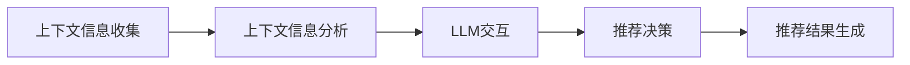

# LLM支持的AI Agent上下文感知推荐技术

> 关键词：LLM、AI Agent、上下文感知推荐技术、大语言模型、推荐系统

> 摘要：本文深入探讨了LLM支持的AI Agent上下文感知推荐技术。首先介绍了该技术的背景，包括目的、预期读者、文档结构和相关术语。接着阐述了核心概念与联系，通过文本示意图和Mermaid流程图进行了清晰展示。详细讲解了核心算法原理，并使用Python源代码进行了说明，同时给出了数学模型和公式及举例。在项目实战部分，进行了开发环境搭建、源代码实现与解读。分析了实际应用场景，推荐了相关工具和资源，最后总结了未来发展趋势与挑战，还提供了常见问题解答和扩展阅读参考资料，旨在为读者全面深入地理解和应用该技术提供指导。

## 1. 背景介绍 
### 1.1 目的和范围
随着人工智能技术的飞速发展，推荐系统在各个领域的应用越来越广泛。传统的推荐系统往往只能基于用户的历史行为数据进行推荐，缺乏对上下文信息的有效利用，导致推荐结果的准确性和个性化程度有限。LLM（大语言模型）支持的AI Agent上下文感知推荐技术旨在解决这一问题，通过结合大语言模型强大的语言理解和生成能力，以及AI Agent的自主决策和交互能力，实现更加精准、个性化的推荐。

本文的范围涵盖了LLM支持的AI Agent上下文感知推荐技术的核心概念、算法原理、数学模型、项目实战、实际应用场景、工具和资源推荐等方面，旨在为读者提供一个全面、深入的技术指南。

### 1.2 预期读者
本文的预期读者包括但不限于以下几类人群：
1. **人工智能研究人员**：对LLM、AI Agent和推荐系统等领域感兴趣，希望深入了解相关技术的原理和应用。
2. **软件开发工程师**：负责开发推荐系统或相关应用程序，需要掌握LLM支持的AI Agent上下文感知推荐技术的实现方法。
3. **数据科学家**：从事数据分析和挖掘工作，需要利用上下文信息提高推荐系统的性能和效果。
4. **企业管理人员**：关注推荐系统在业务中的应用，希望了解该技术如何为企业带来价值。

### 1.3 文档结构概述
本文将按照以下结构进行组织：
1. **背景介绍**：介绍LLM支持的AI Agent上下文感知推荐技术的目的、预期读者、文档结构和相关术语。
2. **核心概念与联系**：阐述核心概念的原理和架构，通过文本示意图和Mermaid流程图进行展示。
3. **核心算法原理 & 具体操作步骤**：详细讲解核心算法原理，并使用Python源代码进行说明。
4. **数学模型和公式 & 详细讲解 & 举例说明**：给出数学模型和公式，并进行详细讲解和举例。
5. **项目实战：代码实际案例和详细解释说明**：进行开发环境搭建、源代码实现与解读。
6. **实际应用场景**：分析该技术在不同领域的实际应用场景。
7. **工具和资源推荐**：推荐相关的学习资源、开发工具框架和论文著作。
8. **总结：未来发展趋势与挑战**：总结该技术的未来发展趋势和面临的挑战。
9. **附录：常见问题与解答**：提供常见问题的解答。
10. **扩展阅读 & 参考资料**：列出扩展阅读的资料和参考来源。

### 1.4 术语表
#### 1.4.1 核心术语定义
1. **LLM（大语言模型）**：是一种基于深度学习的语言模型，通过在大规模文本数据上进行训练，学习语言的统计规律和语义信息，能够生成自然流畅的文本。
2. **AI Agent（人工智能代理）**：是一种能够感知环境、自主决策并采取行动的智能实体，通常由感知模块、决策模块和执行模块组成。
3. **上下文感知推荐技术**：是一种基于上下文信息的推荐方法，通过考虑用户的当前状态、环境信息、历史行为等因素，为用户提供更加精准、个性化的推荐。
4. **推荐系统**：是一种信息过滤系统，根据用户的兴趣和偏好，从大量的信息中筛选出用户可能感兴趣的内容，并推荐给用户。

#### 1.4.2 相关概念解释
1. **上下文信息**：是指与用户当前行为和状态相关的各种信息，包括时间、地点、设备、社交关系等。
2. **个性化推荐**：是指根据用户的个人特征和兴趣偏好，为用户提供个性化的推荐内容。
3. **语义理解**：是指计算机对文本的语义信息进行理解和分析的能力，包括词义理解、句法分析、语义推理等。
4. **自然语言生成**：是指计算机根据一定的规则和模板，生成自然流畅的文本的能力。

#### 1.4.3 缩略词列表
1. **LLM**：Large Language Model
2. **AI**：Artificial Intelligence
3. **RNN**：Recurrent Neural Network
4. **LSTM**：Long Short-Term Memory
5. **GRU**：Gated Recurrent Unit
6. **API**：Application Programming Interface

## 2. 核心概念与联系 

### 核心概念原理
LLM支持的AI Agent上下文感知推荐技术的核心原理是将大语言模型的语言理解和生成能力与AI Agent的自主决策和交互能力相结合，通过对上下文信息的感知和分析，为用户提供更加精准、个性化的推荐。

具体来说，该技术的工作流程如下：
1. **上下文信息收集**：AI Agent通过各种传感器和接口，收集用户的上下文信息，包括时间、地点、设备、社交关系等。
2. **上下文信息分析**：AI Agent对收集到的上下文信息进行分析和处理，提取有用的特征和模式。
3. **LLM交互**：AI Agent将分析后的上下文信息输入到LLM中，与LLM进行交互，获取相关的知识和建议。
4. **推荐决策**：AI Agent根据LLM提供的知识和建议，结合用户的历史行为和偏好，进行推荐决策。
5. **推荐结果生成**：AI Agent根据推荐决策，生成推荐结果，并将其呈现给用户。

### 架构的文本示意图
```plaintext
+---------------------+
|    上下文信息收集    |
| （时间、地点等）    |
+---------------------+
         |
         v
+---------------------+
|    上下文信息分析    |
| （特征提取等）      |
+---------------------+
         |
         v
+---------------------+
|      LLM交互        |
| （获取知识建议）    |
+---------------------+
         |
         v
+---------------------+
|    推荐决策          |
| （结合历史偏好）    |
+---------------------+
         |
         v
+---------------------+
|    推荐结果生成      |
| （呈现给用户）      |
+---------------------+
```

### Mermaid流程图


## 3. 核心算法原理 & 具体操作步骤 

### 核心算法原理
LLM支持的AI Agent上下文感知推荐技术的核心算法主要包括以下几个方面：
1. **上下文信息表示**：将收集到的上下文信息转换为计算机能够处理的向量表示，以便后续的分析和处理。常用的方法包括词嵌入、特征工程等。
2. **LLM交互算法**：设计与LLM进行交互的算法，包括如何输入上下文信息、如何获取LLM的输出等。常用的方法包括提示工程、对话管理等。
3. **推荐决策算法**：根据LLM提供的知识和建议，结合用户的历史行为和偏好，进行推荐决策。常用的方法包括协同过滤、深度学习等。

### 具体操作步骤
以下是使用Python实现LLM支持的AI Agent上下文感知推荐技术的具体操作步骤：

#### 步骤1：安装必要的库
```python
import numpy as np
import pandas as pd
from transformers import AutoTokenizer, AutoModelForCausalLM
```

#### 步骤2：加载LLM模型和分词器
```python
tokenizer = AutoTokenizer.from_pretrained("gpt2")
model = AutoModelForCausalLM.from_pretrained("gpt2")
```

#### 步骤3：收集上下文信息
```python
# 假设上下文信息为时间和地点
context = "当前时间是下午3点，地点是北京"
```

#### 步骤4：上下文信息分析
```python
# 这里简单示例，将上下文信息转换为词向量
input_ids = tokenizer.encode(context, return_tensors='pt')
```

#### 步骤5：LLM交互
```python
# 与LLM进行交互，获取推荐建议
output = model.generate(input_ids, max_length=100, num_return_sequences=1)
recommendation = tokenizer.decode(output[0], skip_special_tokens=True)
```

#### 步骤6：推荐决策
```python
# 假设这里结合用户历史偏好进行推荐决策
# 简单示例，直接返回LLM的输出作为推荐结果
final_recommendation = recommendation
```

#### 步骤7：推荐结果生成
```python
print("推荐结果：", final_recommendation)
```

## 4. 数学模型和公式 & 详细讲解 & 举例说明 

### 上下文信息表示
假设上下文信息可以表示为一个向量 $\mathbf{x} = [x_1, x_2, \cdots, x_n]$，其中 $x_i$ 表示第 $i$ 个特征的值。可以使用词嵌入技术将文本信息转换为向量表示，例如使用预训练的词向量模型将单词转换为固定长度的向量。

### LLM交互
LLM的输入可以表示为一个序列 $\mathbf{y} = [y_1, y_2, \cdots, y_m]$，其中 $y_j$ 表示第 $j$ 个输入词的编码。LLM的输出是一个概率分布 $P(z| \mathbf{y})$，表示在输入 $\mathbf{y}$ 的条件下，生成输出 $z$ 的概率。

### 推荐决策
假设用户的历史行为和偏好可以表示为一个向量 $\mathbf{p} = [p_1, p_2, \cdots, p_k]$，推荐决策可以通过计算推荐项与用户偏好的相似度来进行。常用的相似度计算方法包括余弦相似度：

$$
\text{Cosine Similarity}(\mathbf{a}, \mathbf{b}) = \frac{\mathbf{a} \cdot \mathbf{b}}{\|\mathbf{a}\| \|\mathbf{b}\|}
$$

其中 $\mathbf{a}$ 和 $\mathbf{b}$ 是两个向量，$\cdot$ 表示点积，$\|\cdot\|$ 表示向量的模。

### 举例说明
假设用户的历史偏好向量为 $\mathbf{p} = [0.2, 0.3, 0.5]$，推荐项的向量表示为 $\mathbf{r} = [0.1, 0.4, 0.5]$，则它们的余弦相似度为：

$$
\text{Cosine Similarity}(\mathbf{p}, \mathbf{r}) = \frac{0.2 \times 0.1 + 0.3 \times 0.4 + 0.5 \times 0.5}{\sqrt{0.2^2 + 0.3^2 + 0.5^2} \sqrt{0.1^2 + 0.4^2 + 0.5^2}} \approx 0.94
$$

由于相似度较高，该推荐项可能是一个比较合适的推荐。

## 5. 项目实战：代码实际案例和详细解释说明 

### 5.1  开发环境搭建
#### 安装Python
首先，确保你已经安装了Python 3.7或更高版本。可以从Python官方网站（https://www.python.org/downloads/）下载并安装。

#### 创建虚拟环境
为了避免不同项目之间的依赖冲突，建议使用虚拟环境。可以使用以下命令创建和激活虚拟环境：
```bash
python -m venv llm_agent_recommendation_env
source llm_agent_recommendation_env/bin/activate  # 对于Windows系统，使用 `llm_agent_recommendation_env\Scripts\activate`
```

#### 安装必要的库
在虚拟环境中，使用以下命令安装必要的库：
```bash
pip install numpy pandas transformers
```

### 5.2  源代码详细实现和代码解读
```python
import numpy as np
import pandas as pd
from transformers import AutoTokenizer, AutoModelForCausalLM

# 步骤1：加载LLM模型和分词器
tokenizer = AutoTokenizer.from_pretrained("gpt2")
model = AutoModelForCausalLM.from_pretrained("gpt2")

# 步骤2：模拟用户历史行为数据
user_history = pd.DataFrame({
    "item_id": [1, 2, 3, 4],
    "rating": [4, 5, 3, 4]
})

# 步骤3：收集上下文信息
context = "当前时间是晚上8点，地点是电影院"

# 步骤4：上下文信息分析
input_ids = tokenizer.encode(context, return_tensors='pt')

# 步骤5：LLM交互
output = model.generate(input_ids, max_length=100, num_return_sequences=1)
recommendation = tokenizer.decode(output[0], skip_special_tokens=True)

# 步骤6：推荐决策
# 这里简单示例，根据LLM的输出和用户历史行为进行推荐
# 假设LLM推荐了一些电影，我们根据用户历史评分筛选出可能感兴趣的电影
recommended_movies = recommendation.split(", ")
user_favorite_movies = user_history[user_history["rating"] >= 4]["item_id"].tolist()
final_recommendations = [movie for movie in recommended_movies if int(movie) in user_favorite_movies]

# 步骤7：推荐结果生成
print("推荐结果：", final_recommendations)
```

### 5.3  代码解读与分析
1. **加载LLM模型和分词器**：使用 `transformers` 库加载预训练的GPT-2模型和对应的分词器。
2. **模拟用户历史行为数据**：使用 `pandas` 库创建一个简单的用户历史行为数据表格，包含电影ID和用户评分。
3. **收集上下文信息**：模拟收集用户的上下文信息，这里是时间和地点。
4. **上下文信息分析**：使用分词器将上下文信息编码为输入ID。
5. **LLM交互**：使用 `model.generate` 方法与LLM进行交互，生成推荐建议。
6. **推荐决策**：根据LLM的输出和用户历史评分，筛选出用户可能感兴趣的电影。
7. **推荐结果生成**：打印最终的推荐结果。

## 6. 实际应用场景 
### 电子商务
在电子商务领域，LLM支持的AI Agent上下文感知推荐技术可以根据用户的当前位置、时间、浏览历史等上下文信息，为用户推荐更加符合其需求的商品。例如，当用户在晚上浏览手机时，推荐适合夜间使用的手机配件；当用户在旅游景点附近时，推荐当地的特色商品。

### 社交媒体
在社交媒体平台上，该技术可以根据用户的社交关系、当前话题、浏览历史等上下文信息，为用户推荐更加感兴趣的内容，如好友动态、热门话题、相关文章等。同时，还可以根据用户的情绪状态和当前场景，推荐合适的互动方式和内容。

### 智能客服
在智能客服系统中，AI Agent可以通过感知用户的问题上下文、历史对话记录等信息，结合LLM的知识和建议，为用户提供更加准确、个性化的解答和服务。例如，当用户询问某个产品的使用方法时，AI Agent可以根据用户的设备信息和使用习惯，提供详细的操作指南。

### 教育领域
在教育领域，该技术可以根据学生的学习进度、兴趣爱好、当前学习场景等上下文信息，为学生推荐适合的学习资源和课程。例如，当学生在学习数学时，推荐相关的练习题、教学视频和学习资料。

## 7. 工具和资源推荐
### 7.1 学习资源推荐
#### 7.1.1 书籍推荐
1. 《深度学习》（Deep Learning）：由Ian Goodfellow、Yoshua Bengio和Aaron Courville所著，是深度学习领域的经典教材，涵盖了神经网络、卷积神经网络、循环神经网络等重要内容。
2. 《自然语言处理入门》（Natural Language Processing with Python）：由Steven Bird、Ewan Klein和Edward Loper所著，介绍了使用Python进行自然语言处理的基本方法和技术。
3. 《推荐系统实践》：由项亮所著，系统地介绍了推荐系统的基本原理、算法和应用，是推荐系统领域的经典书籍。

#### 7.1.2 在线课程
1. Coursera上的“深度学习专项课程”（Deep Learning Specialization）：由Andrew Ng教授主讲，涵盖了深度学习的各个方面，包括神经网络、卷积神经网络、循环神经网络等。
2. edX上的“自然语言处理基础”（Foundations of Natural Language Processing）：介绍了自然语言处理的基本概念、算法和技术。
3. Udemy上的“推荐系统实战”（Practical Recommender Systems）：通过实际案例介绍了推荐系统的开发和实现。

#### 7.1.3 技术博客和网站
1. Hugging Face博客（https://huggingface.co/blog）：提供了关于大语言模型、自然语言处理等领域的最新研究成果和技术应用。
2. Towards Data Science（https://towardsdatascience.com）：是一个数据科学和人工智能领域的博客平台，有很多关于推荐系统、深度学习等方面的优质文章。
3. ArXiv（https://arxiv.org）：是一个预印本论文平台，包含了大量关于人工智能、机器学习等领域的最新研究论文。

### 7.2 开发工具框架推荐
#### 7.2.1 IDE和编辑器
1. PyCharm：是一款专业的Python集成开发环境，提供了代码编辑、调试、版本控制等功能，适合开发大型Python项目。
2. Jupyter Notebook：是一个交互式的开发环境，支持Python、R等多种编程语言，适合进行数据探索、模型训练和可视化等工作。
3. Visual Studio Code：是一款轻量级的代码编辑器，支持多种编程语言和插件，具有丰富的扩展功能。

#### 7.2.2 调试和性能分析工具
1. PDB：是Python自带的调试器，可以帮助开发者在代码中设置断点、查看变量值等，进行代码调试。
2. cProfile：是Python的性能分析工具，可以分析代码的运行时间和函数调用次数，帮助开发者找出性能瓶颈。
3. TensorBoard：是TensorFlow的可视化工具，可以用于可视化模型的训练过程、参数变化等信息。

#### 7.2.3 相关框架和库
1. Transformers：是Hugging Face开发的一个自然语言处理框架，提供了多种预训练的大语言模型和工具，方便开发者进行模型的加载、微调等操作。
2. Scikit-learn：是一个常用的机器学习库，提供了多种机器学习算法和工具，包括分类、回归、聚类等。
3. PyTorch：是一个深度学习框架，具有动态图、易于使用等特点，广泛应用于自然语言处理、计算机视觉等领域。

### 7.3 相关论文著作推荐
#### 7.3.1 经典论文
1. “Attention Is All You Need”：提出了Transformer模型，是大语言模型的基础架构。
2. “DeepWalk: Online Learning of Social Representations”：介绍了一种基于随机游走的图嵌入方法，可用于推荐系统中的节点表示学习。
3. “Item-based Collaborative Filtering Recommendation Algorithms”：提出了基于物品的协同过滤推荐算法，是推荐系统中常用的算法之一。

#### 7.3.2 最新研究成果
1. “LLaMA: Open and Efficient Foundation Language Models”：介绍了LLaMA模型，是一种高效的大语言模型。
2. “Context-aware Recommender Systems: A Survey and Future Challenges”：对上下文感知推荐系统进行了综述，并提出了未来的研究挑战。
3. “AI Agents with Large Language Models”：探讨了大语言模型在AI Agent中的应用和发展趋势。

#### 7.3.3 应用案例分析
1. “Recommender Systems in E-commerce: A Comprehensive Review”：对电子商务领域的推荐系统进行了全面的综述和分析。
2. “Social Media Recommender Systems: A Survey”：介绍了社交媒体推荐系统的现状和发展趋势。
3. “Intelligent Customer Service with AI Agents: A Case Study”：通过实际案例介绍了AI Agent在智能客服系统中的应用。

## 8. 总结：未来发展趋势与挑战
### 未来发展趋势
1. **多模态融合**：未来的LLM支持的AI Agent上下文感知推荐技术将不仅仅局限于文本信息，还将融合图像、音频、视频等多模态信息，提供更加丰富、全面的推荐服务。
2. **个性化程度提升**：随着技术的不断发展，推荐系统将能够更加准确地理解用户的个性化需求和偏好，提供更加个性化、精准的推荐结果。
3. **与其他技术的融合**：该技术将与区块链、物联网、虚拟现实等其他技术进行深度融合，创造出更多的应用场景和商业价值。
4. **可解释性增强**：为了提高用户对推荐结果的信任度，未来的推荐系统将更加注重可解释性，能够向用户解释推荐结果的生成原因和依据。

### 挑战
1. **数据隐私和安全**：上下文信息通常包含用户的敏感信息，如何在保证推荐效果的同时，保护用户的数据隐私和安全是一个重要的挑战。
2. **计算资源需求**：大语言模型的训练和推理需要大量的计算资源，如何在有限的计算资源下实现高效的推荐是一个亟待解决的问题。
3. **语义理解的准确性**：虽然大语言模型在语义理解方面取得了很大的进展，但仍然存在一些语义歧义、误解等问题，如何提高语义理解的准确性是一个挑战。
4. **模型的可扩展性**：随着用户数量和数据量的不断增加，如何保证推荐系统的可扩展性，使其能够处理大规模的数据和用户请求是一个挑战。

## 9. 附录：常见问题与解答
### 问题1：LLM支持的AI Agent上下文感知推荐技术与传统推荐系统有什么区别？
传统推荐系统主要基于用户的历史行为数据进行推荐，缺乏对上下文信息的有效利用。而LLM支持的AI Agent上下文感知推荐技术通过结合大语言模型的语言理解和生成能力，以及AI Agent的自主决策和交互能力，能够感知和分析用户的上下文信息，为用户提供更加精准、个性化的推荐。

### 问题2：如何选择合适的LLM模型？
选择合适的LLM模型需要考虑多个因素，如模型的性能、规模、适用场景、计算资源等。一般来说，可以根据具体的应用需求选择预训练的模型，如GPT-2、GPT-3、BERT等。同时，也可以根据自己的数据和任务对模型进行微调，以提高模型的性能。

### 问题3：如何处理上下文信息中的噪声和缺失值？
对于上下文信息中的噪声，可以使用数据清洗和预处理技术进行处理，如去除异常值、平滑处理等。对于缺失值，可以使用插值法、填充法等方法进行处理，或者根据上下文信息进行合理的推测和估计。

### 问题4：如何评估LLM支持的AI Agent上下文感知推荐技术的性能？
可以使用多种指标来评估推荐系统的性能，如准确率、召回率、F1值、均方误差等。同时，也可以通过用户反馈、A/B测试等方法来评估推荐系统的用户体验和商业价值。

## 10. 扩展阅读 & 参考资料
### 扩展阅读
1. 《人工智能：现代方法》（Artificial Intelligence: A Modern Approach）：全面介绍了人工智能的基本概念、算法和应用，是人工智能领域的经典教材。
2. 《数据挖掘：概念与技术》（Data Mining: Concepts and Techniques）：介绍了数据挖掘的基本方法和技术，包括分类、聚类、关联规则挖掘等。
3. 《深度学习实战》（Deep Learning in Practice）：通过实际案例介绍了深度学习在计算机视觉、自然语言处理等领域的应用。

### 参考资料
1. Hugging Face官方文档（https://huggingface.co/docs）
2. Scikit-learn官方文档（https://scikit-learn.org/stable/documentation.html）
3. PyTorch官方文档（https://pytorch.org/docs/stable/index.html）

作者：AI天才研究院/AI Genius Institute & 禅与计算机程序设计艺术 /Zen And The Art of Computer Programming