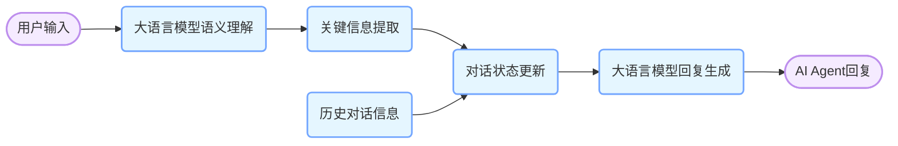

# LLM支持的AI Agent对话状态跟踪

> 关键词：LLM（大语言模型）、AI Agent、对话状态跟踪、自然语言处理、人工智能

> 摘要：本文聚焦于LLM支持的AI Agent对话状态跟踪这一前沿技术领域。首先介绍了相关背景，包括目的范围、预期读者等内容。接着详细阐述了核心概念及其联系，通过文本示意图和Mermaid流程图进行直观展示。深入剖析核心算法原理，以Python代码详细说明具体操作步骤，并引入数学模型和公式进行理论支撑，结合实际例子加深理解。通过项目实战，从开发环境搭建到源代码实现及解读，全面展示技术的实际应用。探讨了该技术的实际应用场景，推荐了学习所需的工具和资源，涵盖书籍、在线课程、开发工具等方面。最后对未来发展趋势与挑战进行总结，解答常见问题并提供扩展阅读和参考资料，旨在为读者全面深入了解LLM支持的AI Agent对话状态跟踪提供专业且系统的知识体系。

## 1. 背景介绍 
### 1.1 目的和范围
在当今人工智能快速发展的时代，自然语言处理领域取得了显著的进展。基于大语言模型（LLM）的AI Agent在对话系统中展现出强大的能力，但要实现更加智能、连贯和高效的对话，对话状态跟踪是关键环节。本文的目的在于深入探讨LLM支持的AI Agent对话状态跟踪技术，详细介绍其核心概念、算法原理、数学模型，并通过实际项目案例展示其应用。范围涵盖从理论基础到实际应用的各个方面，旨在为相关领域的研究者、开发者提供全面而深入的技术参考。

### 1.2 预期读者
本文的预期读者包括自然语言处理领域的研究人员，他们可以从本文中获取最新的技术思路和研究方向；人工智能开发者，能够学习到具体的算法实现和项目开发经验；对对话系统和AI Agent感兴趣的技术爱好者，有助于他们理解这一前沿技术的原理和应用场景。

### 1.3 文档结构概述
本文将按照以下结构展开：首先介绍核心概念与联系，让读者对LLM支持的AI Agent对话状态跟踪有一个初步的认识；接着详细阐述核心算法原理和具体操作步骤，结合Python代码进行讲解；引入数学模型和公式，为技术提供理论支持；通过项目实战，展示如何在实际开发中应用该技术；探讨实际应用场景，说明其在不同领域的价值；推荐相关的工具和资源，帮助读者进一步学习和研究；最后总结未来发展趋势与挑战，解答常见问题并提供扩展阅读和参考资料。

### 1.4 术语表
#### 1.4.1 核心术语定义
- **LLM（大语言模型）**：是一种基于深度学习的语言模型，通过在大规模文本数据上进行训练，能够学习到语言的模式和规律，从而生成自然流畅的文本。例如GPT - 3、ChatGPT等都是知名的大语言模型。
- **AI Agent（人工智能代理）**：是一种能够感知环境、做出决策并执行行动的智能实体。在对话系统中，AI Agent可以理解用户的输入，根据对话状态进行回复，并推动对话的进行。
- **对话状态跟踪（Dialogue State Tracking）**：是指在对话过程中，对当前对话的状态进行实时监测和更新的过程。对话状态包括用户的意图、需求、历史对话信息等，通过对话状态跟踪，AI Agent可以更好地理解用户的意图，提供更准确的回复。

#### 1.4.2 相关概念解释
- **自然语言处理（Natural Language Processing，NLP）**：是人工智能的一个重要分支，旨在让计算机能够理解、处理和生成人类语言。对话状态跟踪是自然语言处理中的一个具体任务，涉及到语义理解、信息抽取等多个方面。
- **上下文感知**：在对话中，上下文感知是指AI Agent能够理解当前对话所处的上下文信息，包括之前的对话内容、当前的对话场景等。通过上下文感知，AI Agent可以提供更连贯和准确的回复。

#### 1.4.3 缩略词列表
- **LLM**：Large Language Model
- **AI**：Artificial Intelligence
- **NLP**：Natural Language Processing
- **DST**：Dialogue State Tracking

## 2. 核心概念与联系 
### 核心概念原理
LLM支持的AI Agent对话状态跟踪的核心原理是利用大语言模型强大的语言理解和生成能力，结合对话状态跟踪技术，实现对对话状态的实时监测和更新。在对话过程中，AI Agent接收用户的输入，通过LLM对输入进行语义理解，提取其中的关键信息，如用户的意图、需求等。同时，结合历史对话信息和当前的对话状态，更新对话状态表示。根据更新后的对话状态，AI Agent利用LLM生成合适的回复，推动对话的进行。

### 架构的文本示意图
```plaintext
用户输入 -> 大语言模型（语义理解） -> 关键信息提取 -> 对话状态更新
对话状态 -> 大语言模型（回复生成） -> AI Agent回复
历史对话信息 -> 对话状态更新
```

### Mermaid流程图


## 3. 核心算法原理 & 具体操作步骤 
### 核心算法原理
在LLM支持的AI Agent对话状态跟踪中，核心算法主要包括语义理解、关键信息提取和对话状态更新。语义理解利用LLM对用户输入进行处理，将自然语言转化为计算机能够理解的表示形式。关键信息提取从语义理解的结果中提取出与对话状态相关的信息，如用户的意图、需求等。对话状态更新根据提取的关键信息和历史对话信息，更新当前的对话状态。

### 具体操作步骤及Python源代码
以下是一个简单的示例，展示了如何使用Python和Hugging Face的Transformers库实现基本的对话状态跟踪。

```python
from transformers import AutoTokenizer, AutoModelForSequenceClassification
import torch

# 加载预训练的语言模型和分词器
model_name = "bert-base-uncased"
tokenizer = AutoTokenizer.from_pretrained(model_name)
model = AutoModelForSequenceClassification.from_pretrained(model_name)

# 初始化对话状态
dialogue_state = {}

def semantic_understanding(user_input):
    """
    语义理解函数，对用户输入进行编码和模型推理
    """
    inputs = tokenizer(user_input, return_tensors="pt")
    outputs = model(**inputs)
    logits = outputs.logits
    predicted_class_id = torch.argmax(logits, dim=-1).item()
    return predicted_class_id

def key_information_extraction(semantic_result):
    """
    关键信息提取函数，根据语义理解结果提取关键信息
    """
    if semantic_result == 0:
        key_info = "用户询问信息"
    elif semantic_result == 1:
        key_info = "用户提出请求"
    else:
        key_info = "其他情况"
    return key_info

def dialogue_state_update(key_info):
    """
    对话状态更新函数，根据关键信息更新对话状态
    """
    global dialogue_state
    if "key_info_list" not in dialogue_state:
        dialogue_state["key_info_list"] = []
    dialogue_state["key_info_list"].append(key_info)
    return dialogue_state

# 模拟用户输入
user_input = "我想了解一下产品的价格"
# 语义理解
semantic_result = semantic_understanding(user_input)
# 关键信息提取
key_info = key_information_extraction(semantic_result)
# 对话状态更新
updated_dialogue_state = dialogue_state_update(key_info)

print("用户输入:", user_input)
print("语义理解结果:", semantic_result)
print("关键信息:", key_info)
print("更新后的对话状态:", updated_dialogue_state)
```

### 代码解释
1. **加载预训练模型和分词器**：使用Hugging Face的Transformers库加载预训练的BERT模型和对应的分词器。
2. **语义理解**：`semantic_understanding`函数将用户输入进行分词和编码，然后输入到模型中进行推理，返回预测的类别ID。
3. **关键信息提取**：`key_information_extraction`函数根据语义理解的结果，提取出对应的关键信息。
4. **对话状态更新**：`dialogue_state_update`函数将提取的关键信息添加到对话状态的列表中，更新对话状态。

## 4. 数学模型和公式 & 详细讲解 & 举例说明 
### 数学模型和公式
在对话状态跟踪中，常用的数学模型是隐马尔可夫模型（Hidden Markov Model，HMM）和条件随机场（Conditional Random Field，CRF）。这里我们以HMM为例进行介绍。

HMM由三个主要部分组成：状态转移概率矩阵 $A$、观测概率矩阵 $B$ 和初始状态概率向量 $\pi$。设状态集合为 $S = \{s_1, s_2, \cdots, s_N\}$，观测集合为 $O = \{o_1, o_2, \cdots, o_M\}$。

- 状态转移概率矩阵 $A$：$A = [a_{ij}]_{N \times N}$，其中 $a_{ij} = P(q_{t+1} = s_j | q_t = s_i)$ 表示在时刻 $t$ 处于状态 $s_i$ 的条件下，在时刻 $t + 1$ 转移到状态 $s_j$ 的概率。
- 观测概率矩阵 $B$：$B = [b_{j}(k)]_{N \times M}$，其中 $b_{j}(k) = P(o_t = o_k | q_t = s_j)$ 表示在时刻 $t$ 处于状态 $s_j$ 的条件下，观测到 $o_k$ 的概率。
- 初始状态概率向量 $\pi$：$\pi = [\pi_i]_{N}$，其中 $\pi_i = P(q_1 = s_i)$ 表示在时刻 $t = 1$ 处于状态 $s_i$ 的概率。

### 详细讲解
在对话状态跟踪中，状态可以表示对话的不同阶段或状态，如询问信息、提出请求、结束对话等。观测可以表示用户的输入或系统的回复。通过HMM，我们可以根据观测序列（用户的输入）推断出最可能的状态序列（对话的状态）。

### 举例说明
假设我们有一个简单的对话系统，状态集合 $S = \{$询问信息, 提出请求, 结束对话$\}$，观测集合 $O = \{$询问价格, 购买产品, 再见$\}$。

状态转移概率矩阵 $A$ 如下：
$$
A = 
\begin{bmatrix}
0.6 & 0.3 & 0.1 \\
0.2 & 0.7 & 0.1 \\
0 & 0 & 1
\end{bmatrix}
$$

观测概率矩阵 $B$ 如下：
$$
B = 
\begin{bmatrix}
0.8 & 0.1 & 0.1 \\
0.1 & 0.8 & 0.1 \\
0 & 0 & 1
\end{bmatrix}
$$

初始状态概率向量 $\pi$ 如下：
$$
\pi = 
\begin{bmatrix}
0.7 & 0.2 & 0.1
\end{bmatrix}
$$

假设用户的输入序列为 $\{$询问价格, 购买产品, 再见$\}$，我们可以使用Viterbi算法来推断最可能的状态序列。

```python
import numpy as np

# 状态转移概率矩阵
A = np.array([[0.6, 0.3, 0.1], [0.2, 0.7, 0.1], [0, 0, 1]])
# 观测概率矩阵
B = np.array([[0.8, 0.1, 0.1], [0.1, 0.8, 0.1], [0, 0, 1]])
# 初始状态概率向量
pi = np.array([0.7, 0.2, 0.1])
# 观测序列
observations = [0, 1, 2]

def viterbi(obs, states, start_p, trans_p, emit_p):
    """
    Viterbi算法实现
    """
    V = [{}]
    path = {}

    # 初始化
    for y in states:
        V[0][y] = start_p[y] * emit_p[y][obs[0]]
        path[y] = [y]

    # 递推
    for t in range(1, len(obs)):
        V.append({})
        newpath = {}
        for y in states:
            (prob, state) = max((V[t - 1][y0] * trans_p[y0][y] * emit_p[y][obs[t]], y0) for y0 in states)
            V[t][y] = prob
            newpath[y] = path[state] + [y]
        path = newpath

    # 终止
    (prob, state) = max((V[len(obs) - 1][y], y) for y in states)
    return path[state]

states = range(len(A))
result = viterbi(observations, states, pi, A, B)
print("最可能的状态序列:", result)
```

### 代码解释
- `viterbi`函数实现了Viterbi算法，用于推断最可能的状态序列。
- 首先进行初始化，计算初始时刻每个状态的概率。
- 然后进行递推，根据前一时刻的状态概率和状态转移概率、观测概率，计算当前时刻每个状态的概率。
- 最后进行终止，选择概率最大的状态作为最终的状态序列。

## 5. 项目实战：代码实际案例和详细解释说明 
### 5.1  开发环境搭建
#### 系统环境
建议使用Linux或macOS系统，因为这些系统对Python和深度学习框架的支持更好。如果使用Windows系统，也可以通过安装WSL（Windows Subsystem for Linux）来模拟Linux环境。

#### Python环境
安装Python 3.7及以上版本。可以使用Anaconda或Miniconda来管理Python环境，以下是使用Miniconda创建新环境的命令：
```bash
conda create -n dialogue_state_tracking python=3.8
conda activate dialogue_state_tracking
```

#### 安装依赖库
安装必要的Python库，如Hugging Face的Transformers库、PyTorch等：
```bash
pip install transformers torch
```

### 5.2  源代码详细实现和代码解读
以下是一个更完整的对话状态跟踪项目示例，使用Flask搭建一个简单的Web服务，实现与用户的交互。

```python
from flask import Flask, request, jsonify
from transformers import AutoTokenizer, AutoModelForSequenceClassification
import torch

app = Flask(__name__)

# 加载预训练的语言模型和分词器
model_name = "bert-base-uncased"
tokenizer = AutoTokenizer.from_pretrained(model_name)
model = AutoModelForSequenceClassification.from_pretrained(model_name)

# 初始化对话状态
dialogue_state = {}

def semantic_understanding(user_input):
    """
    语义理解函数，对用户输入进行编码和模型推理
    """
    inputs = tokenizer(user_input, return_tensors="pt")
    outputs = model(**inputs)
    logits = outputs.logits
    predicted_class_id = torch.argmax(logits, dim=-1).item()
    return predicted_class_id

def key_information_extraction(semantic_result):
    """
    关键信息提取函数，根据语义理解结果提取关键信息
    """
    if semantic_result == 0:
        key_info = "用户询问信息"
    elif semantic_result == 1:
        key_info = "用户提出请求"
    else:
        key_info = "其他情况"
    return key_info

def dialogue_state_update(key_info):
    """
    对话状态更新函数，根据关键信息更新对话状态
    """
    global dialogue_state
    if "key_info_list" not in dialogue_state:
        dialogue_state["key_info_list"] = []
    dialogue_state["key_info_list"].append(key_info)
    return dialogue_state

@app.route('/dialogue', methods=['POST'])
def dialogue():
    data = request.get_json()
    user_input = data.get('user_input')
    if user_input:
        # 语义理解
        semantic_result = semantic_understanding(user_input)
        # 关键信息提取
        key_info = key_information_extraction(semantic_result)
        # 对话状态更新
        updated_dialogue_state = dialogue_state_update(key_info)
        return jsonify({
            "semantic_result": semantic_result,
            "key_info": key_info,
            "dialogue_state": updated_dialogue_state
        })
    return jsonify({"error": "Missing user input"}), 400

if __name__ == '__main__':
    app.run(debug=True)
```

### 代码解读与分析
1. **Flask应用初始化**：使用Flask创建一个Web应用，并定义路由 `/dialogue` 用于处理用户的对话请求。
2. **模型加载**：加载预训练的BERT模型和分词器，用于语义理解。
3. **对话状态初始化**：初始化一个空的对话状态字典。
4. **语义理解、关键信息提取和对话状态更新函数**：与前面的示例相同，用于处理用户输入并更新对话状态。
5. **路由处理函数**：`dialogue` 函数接收用户的输入，调用语义理解、关键信息提取和对话状态更新函数，返回处理结果。
6. **启动应用**：使用 `app.run(debug=True)` 启动Flask应用，开启调试模式。

### 测试代码
可以使用以下Python代码测试上述Web服务：
```python
import requests

url = 'http://127.0.0.1:5000/dialogue'
data = {'user_input': '我想了解一下产品的价格'}
response = requests.post(url, json=data)
print(response.json())
```

### 代码解释
- `requests.post` 函数向 `http://127.0.0.1:5000/dialogue` 发送POST请求，携带用户输入数据。
- 打印服务器返回的JSON响应，包含语义理解结果、关键信息和更新后的对话状态。

## 6. 实际应用场景 
### 智能客服系统
在智能客服系统中，LLM支持的AI Agent对话状态跟踪可以帮助客服机器人更好地理解用户的问题和需求。通过跟踪对话状态，机器人可以根据用户的历史问题和当前问题，提供更准确、连贯的回复。例如，当用户询问产品的价格后，又询问产品的售后服务，机器人可以根据对话状态，知道用户已经对产品有了一定的兴趣，从而更针对性地介绍售后服务的相关内容。

### 智能语音助手
智能语音助手如Siri、小爱同学等，也可以应用对话状态跟踪技术。在与用户的对话过程中，语音助手可以通过跟踪对话状态，理解用户的多轮指令。例如，用户说“打开音乐应用”，接着说“播放周杰伦的歌曲”，语音助手可以根据对话状态，知道用户想要在刚刚打开的音乐应用中播放周杰伦的歌曲。

### 智能教育系统
在智能教育系统中，AI Agent可以作为学生的学习伙伴，与学生进行对话交流。通过对话状态跟踪，AI Agent可以了解学生的学习进度、问题和需求，提供个性化的学习建议和指导。例如，当学生询问某个知识点的讲解后，AI Agent可以根据对话状态，进一步询问学生是否理解，是否需要更多的练习题目等。

### 智能家居控制
在智能家居控制场景中，用户可以通过语音或文字与智能家居系统进行对话，控制各种设备。对话状态跟踪技术可以帮助系统更好地理解用户的控制意图，避免出现误解。例如，用户说“打开客厅的灯”，之后又说“把亮度调暗一些”，系统可以根据对话状态，知道是要调节刚刚打开的客厅灯的亮度。

## 7. 工具和资源推荐
### 7.1 学习资源推荐
#### 7.1.1 书籍推荐
- 《自然语言处理入门》：这本书系统地介绍了自然语言处理的基础知识和常用技术，包括词法分析、句法分析、语义理解等内容，对于初学者来说是一本很好的入门书籍。
- 《深度学习》：由Ian Goodfellow、Yoshua Bengio和Aaron Courville所著，是深度学习领域的经典教材，涵盖了深度学习的基本原理、算法和应用，对于理解大语言模型和相关技术有很大的帮助。
- 《Python自然语言处理实战：核心技术与算法》：结合Python代码，详细介绍了自然语言处理的各种技术和算法，包括文本分类、情感分析、对话系统等，适合有一定Python基础的读者。

#### 7.1.2 在线课程
- Coursera上的“Natural Language Processing Specialization”：由斯坦福大学的教授授课，系统地介绍了自然语言处理的各个方面，包括词向量、序列模型、注意力机制等内容，课程内容丰富，讲解详细。
- edX上的“Deep Learning for Natural Language Processing”：该课程专注于深度学习在自然语言处理中的应用，包括循环神经网络、卷积神经网络、Transformer模型等，适合对深度学习有一定了解的学习者。
- 哔哩哔哩（B站）上有很多自然语言处理和人工智能相关的教程视频，例如李沐老师的“动手学深度学习”系列课程，以代码实践为主，讲解生动易懂。

#### 7.1.3 技术博客和网站
- Hugging Face Blog：Hugging Face是自然语言处理领域的知名开源组织，其博客上会发布很多关于大语言模型、自然语言处理技术的最新研究成果和应用案例。
- Medium上的“Towards Data Science”：这是一个专注于数据科学和人工智能领域的博客平台，有很多优秀的技术文章和教程，涵盖了自然语言处理、机器学习、深度学习等多个方面。
- arXiv：是一个开放的学术预印本平台，上面可以找到很多关于自然语言处理和人工智能的最新研究论文，对于了解技术的前沿动态非常有帮助。

### 7.2 开发工具框架推荐
#### 7.2.1 IDE和编辑器
- PyCharm：是一款专业的Python集成开发环境，具有强大的代码编辑、调试、自动补全、代码分析等功能，适合Python开发者使用。
- Visual Studio Code（VS Code）：是一款轻量级的代码编辑器，支持多种编程语言，拥有丰富的插件生态系统，可以通过安装Python相关插件来进行Python开发，具有很高的灵活性。

#### 7.2.2 调试和性能分析工具
- PDB：是Python自带的调试器，可以在代码中设置断点，逐行执行代码，查看变量的值和程序的执行流程，帮助开发者定位和解决问题。
- TensorBoard：是TensorFlow的可视化工具，也可以用于PyTorch等其他深度学习框架。它可以可视化模型的训练过程、损失函数的变化、模型的结构等信息，帮助开发者分析模型的性能。

#### 7.2.3 相关框架和库
- Hugging Face Transformers：是一个非常流行的自然语言处理库，提供了大量的预训练模型，如BERT、GPT - 2等，并且支持模型的快速加载、微调等操作，大大简化了自然语言处理任务的开发流程。
- PyTorch：是一个开源的深度学习框架，具有动态图机制，易于使用和调试，广泛应用于自然语言处理、计算机视觉等领域。
- spaCy：是一个用于自然语言处理的Python库，提供了高效的词法分析、句法分析、命名实体识别等功能，适合进行大规模文本处理和分析。

### 7.3 相关论文著作推荐
#### 7.3.1 经典论文
- “Attention Is All You Need”：这篇论文提出了Transformer模型，是自然语言处理领域的里程碑式成果，Transformer模型成为了大语言模型的基础架构。
- “BERT: Pre-training of Deep Bidirectional Transformers for Language Understanding”：介绍了BERT模型，通过预训练和微调的方式，在多个自然语言处理任务上取得了优异的成绩，推动了自然语言处理技术的发展。

#### 7.3.2 最新研究成果
- 关注arXiv上关于大语言模型、对话系统、对话状态跟踪等方面的最新论文，例如关于如何利用大语言模型更好地进行对话状态跟踪的研究，以及如何提高对话系统的泛化能力和鲁棒性的研究。

#### 7.3.3 应用案例分析
- 可以参考一些知名公司或研究机构发布的关于对话系统应用案例的报告，例如谷歌、微软等公司在智能客服、智能语音助手等领域的应用案例，了解实际应用中的技术挑战和解决方案。

## 8. 总结：未来发展趋势与挑战
### 未来发展趋势
- **多模态融合**：未来的AI Agent对话状态跟踪将不仅仅局限于文本信息，还会融合图像、语音、视频等多模态信息。例如，在智能客服系统中，用户可以通过上传图片来描述产品的问题，AI Agent可以结合图像信息和对话状态进行更准确的回复。
- **个性化对话**：随着对用户数据的深入挖掘和分析，AI Agent将能够实现更加个性化的对话。根据用户的历史对话记录、兴趣爱好、行为习惯等信息，为用户提供更符合其需求的回复和建议。
- **跨领域对话**：目前的对话系统大多针对特定领域，未来的AI Agent将具备跨领域对话的能力。例如，用户可以在一个对话中同时询问旅游、美食、科技等多个领域的问题，AI Agent能够灵活切换领域，提供准确的回答。

### 挑战
- **语义理解的准确性**：虽然大语言模型在语义理解方面取得了很大的进展，但仍然存在一些问题，如对模糊语义、隐喻、歧义等的理解不够准确。在对话状态跟踪中，语义理解的准确性直接影响到关键信息的提取和对话状态的更新，因此提高语义理解的准确性是一个重要的挑战。
- **数据隐私和安全**：在对话过程中，AI Agent会收集和处理大量的用户数据，包括用户的个人信息、对话内容等。如何保证这些数据的隐私和安全，防止数据泄露和滥用，是一个亟待解决的问题。
- **计算资源的需求**：大语言模型通常需要大量的计算资源进行训练和推理，这对于一些小型企业和开发者来说是一个很大的挑战。如何优化模型结构和算法，降低计算资源的需求，是未来发展的一个重要方向。

## 9. 附录：常见问题与解答
### 问题1：如何选择合适的大语言模型用于对话状态跟踪？
解答：选择合适的大语言模型需要考虑多个因素，如模型的性能、计算资源的需求、任务的特点等。如果计算资源充足，可以选择一些大型的预训练模型，如GPT - 3、BERT等，这些模型在语义理解和语言生成方面具有较好的性能。如果计算资源有限，可以选择一些轻量级的模型，如DistilBERT等。此外，还可以根据任务的特点选择特定领域的预训练模型，以提高模型的性能。

### 问题2：对话状态跟踪中的关键信息提取有哪些方法？
解答：关键信息提取的方法有很多种，常见的包括基于规则的方法、基于机器学习的方法和基于深度学习的方法。基于规则的方法通过定义一系列的规则来提取关键信息，这种方法简单直接，但需要人工编写大量的规则，可扩展性较差。基于机器学习的方法通过训练分类器或命名实体识别模型来提取关键信息，需要大量的标注数据。基于深度学习的方法利用神经网络模型自动学习关键信息的特征，具有较好的性能和泛化能力。

### 问题3：如何评估对话状态跟踪的性能？
解答：评估对话状态跟踪的性能通常使用准确率、召回率、F1值等指标。准确率表示预测正确的对话状态占总预测对话状态的比例，召回率表示预测正确的对话状态占实际对话状态的比例，F1值是准确率和召回率的调和平均值。此外，还可以使用人工评估的方法，让专业人员对对话状态跟踪的结果进行评估，给出主观的评价。

## 10. 扩展阅读 & 参考资料
### 扩展阅读
- 《对话系统技术实战：从原理到应用》：详细介绍了对话系统的各个方面，包括对话管理、对话状态跟踪、自然语言生成等内容，对于深入了解对话系统技术有很大的帮助。
- 《人工智能：现代方法》：是人工智能领域的经典教材，涵盖了人工智能的各个方面，包括知识表示、推理、机器学习、自然语言处理等内容，对于构建全面的人工智能知识体系有很大的帮助。

### 参考资料
- Hugging Face官方文档：https://huggingface.co/docs
- PyTorch官方文档：https://pytorch.org/docs/stable/index.html
- spaCy官方文档：https://spacy.io/usage

作者：AI天才研究院/AI Genius Institute & 禅与计算机程序设计艺术 /Zen And The Art of Computer Programming