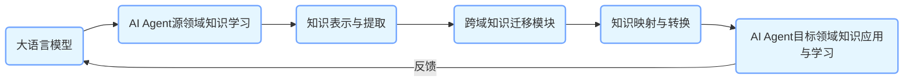

# LLM支持的AI Agent跨域知识迁移技术

> 关键词：LLM、AI Agent、跨域知识迁移、大语言模型、智能体、知识融合

> 摘要：本文围绕LLM支持的AI Agent跨域知识迁移技术展开深入探讨。首先介绍了该技术的背景，包括目的、预期读者、文档结构和相关术语。接着阐述了核心概念与联系，给出了原理和架构的示意图与流程图。详细讲解了核心算法原理及具体操作步骤，使用Python代码进行了说明。通过数学模型和公式进一步剖析该技术，并举例说明。在项目实战部分，进行了开发环境搭建，给出了源代码实现和解读。探讨了实际应用场景，推荐了相关的学习资源、开发工具框架和论文著作。最后总结了未来发展趋势与挑战，还给出了常见问题解答和扩展阅读参考资料，旨在为读者全面深入地理解和应用该技术提供有价值的指导。

## 1. 背景介绍 
### 1.1 目的和范围
随着人工智能技术的不断发展，大语言模型（LLM）和AI Agent成为研究和应用的热点。LLM具有强大的语言理解和生成能力，但在实际应用中，往往需要AI Agent在不同领域之间灵活运用知识，以解决复杂的现实问题。LLM支持的AI Agent跨域知识迁移技术的目的就是让AI Agent能够借助LLM的能力，将在一个领域学到的知识有效地迁移到其他领域，提高AI Agent的通用性和适应性。

本技术文档的范围涵盖了该技术的核心概念、算法原理、数学模型、项目实战、实际应用场景以及相关的工具和资源推荐等方面，旨在为读者提供一个全面且深入的技术指导。

### 1.2 预期读者
本文预期读者包括人工智能领域的研究人员、开发者、数据科学家、软件工程师等对LLM和AI Agent技术感兴趣，希望深入了解跨域知识迁移技术的专业人士。同时，也适合对人工智能前沿技术有一定了解，想要进一步探索相关应用的爱好者。

### 1.3 文档结构概述
本文将按照以下结构进行阐述：首先介绍核心概念与联系，包括相关原理和架构的示意图与流程图；接着详细讲解核心算法原理及具体操作步骤，并给出Python代码示例；然后通过数学模型和公式对该技术进行深入分析，并举例说明；在项目实战部分，将介绍开发环境搭建、源代码实现和代码解读；探讨实际应用场景；推荐相关的学习资源、开发工具框架和论文著作；最后总结未来发展趋势与挑战，给出常见问题解答和扩展阅读参考资料。

### 1.4 术语表
#### 1.4.1 核心术语定义
- **大语言模型（LLM）**：是一种基于深度学习的人工智能模型，通过在大规模文本数据上进行训练，学习语言的模式和规律，能够完成各种自然语言处理任务，如文本生成、问答系统等。
- **AI Agent**：即人工智能智能体，是一种能够感知环境、自主决策并采取行动以实现特定目标的智能实体。它可以与环境进行交互，根据环境的反馈调整自己的行为。
- **跨域知识迁移**：指将在一个领域（源领域）中学习到的知识、技能或模式应用到另一个不同的领域（目标领域）中，以提高在目标领域的学习效率和性能。

#### 1.4.2 相关概念解释
- **领域**：在本文中，领域是指具有特定主题、规则和知识体系的应用场景，例如医疗领域、金融领域、教育领域等。
- **知识表示**：是将知识以某种形式进行编码和存储，以便计算机能够理解和处理。常见的知识表示方法包括符号表示、向量表示等。

#### 1.4.3 缩略词列表
- **LLM**：Large Language Model（大语言模型）
- **AI**：Artificial Intelligence（人工智能）

## 2. 核心概念与联系 

### 核心概念原理
LLM支持的AI Agent跨域知识迁移技术的核心原理是利用大语言模型的强大语言理解和生成能力，为AI Agent提供丰富的知识基础。AI Agent在源领域中学习到的知识可以通过一定的方法进行表示和提取，然后借助LLM的语义理解能力，将这些知识映射到目标领域中。

具体来说，AI Agent在源领域中通过与环境的交互和学习，形成了对该领域的认知和知识体系。这些知识可以表示为一组特征向量或符号表示。当需要迁移到目标领域时，LLM可以对源领域的知识表示进行理解和分析，找出与目标领域相关的语义信息。然后，根据目标领域的特点和需求，对这些知识进行调整和转换，使其能够在目标领域中发挥作用。

### 架构的文本示意图
```plaintext
+-------------------+
|      大语言模型     |
+-------------------+
       |        ^
       |        |
+-------------------+
|     AI Agent      |
|  源领域知识学习    |
+-------------------+
       |
       | 知识表示与提取
+-------------------+
|  跨域知识迁移模块  |
+-------------------+
       |
       | 知识映射与转换
+-------------------+
|  AI Agent目标领域  |
|  知识应用与学习   |
+-------------------+
```

### Mermaid流程图


## 3. 核心算法原理 & 具体操作步骤 

### 核心算法原理
LLM支持的AI Agent跨域知识迁移技术主要涉及以下几个核心算法：

#### 知识表示算法
在源领域中，AI Agent通过学习和交互获得的知识需要进行有效的表示。常用的知识表示方法是将知识映射到向量空间中，例如使用词向量、句向量等。以词向量为例，可以使用预训练的词嵌入模型（如Word2Vec、GloVe等）将源领域中的文本数据转换为向量表示。

#### 知识相似度计算算法
为了将源领域的知识迁移到目标领域，需要计算源领域知识与目标领域知识之间的相似度。常用的相似度计算方法包括余弦相似度、欧几里得距离等。余弦相似度可以衡量两个向量之间的夹角余弦值，值越接近1表示相似度越高。

#### 知识映射与转换算法
根据知识相似度计算的结果，将源领域的知识映射到目标领域中。这可能涉及到对源领域知识的调整和转换，例如通过线性变换、非线性映射等方法，使源领域知识能够适应目标领域的特点和需求。

### 具体操作步骤及Python代码实现

#### 步骤1：知识表示
以下是使用`gensim`库实现Word2Vec词向量表示的Python代码示例：
```python
from gensim.models import Word2Vec
import numpy as np

# 示例文本数据
source_domain_texts = [
    ["apple", "banana", "cherry"],
    ["dog", "cat", "rabbit"]
]

# 训练Word2Vec模型
model = Word2Vec(sentences=source_domain_texts, vector_size=100, window=5, min_count=1, workers=4)

# 获取词向量
word_vector = model.wv['apple']
print("Word vector for 'apple':", word_vector)
```

#### 步骤2：知识相似度计算
以下是使用`scikit-learn`库计算余弦相似度的Python代码示例：
```python
from sklearn.metrics.pairwise import cosine_similarity

# 示例向量
vector1 = np.array([1, 2, 3]).reshape(1, -1)
vector2 = np.array([4, 5, 6]).reshape(1, -1)

# 计算余弦相似度
similarity = cosine_similarity(vector1, vector2)
print("Cosine similarity:", similarity)
```

#### 步骤3：知识映射与转换
以下是一个简单的线性变换示例：
```python
# 示例源领域向量
source_vector = np.array([1, 2, 3])

# 线性变换矩阵
transformation_matrix = np.array([[0.5, 0, 0], [0, 0.5, 0], [0, 0, 0.5]])

# 进行线性变换
target_vector = np.dot(source_vector, transformation_matrix)
print("Transformed vector:", target_vector)
```

## 4. 数学模型和公式 & 详细讲解 & 举例说明 

### 知识表示的数学模型
在使用词向量进行知识表示时，假设词汇表中有 $V$ 个单词，每个单词的词向量维度为 $d$。则可以用一个 $V \times d$ 的矩阵 $W$ 来表示所有单词的词向量，其中第 $i$ 行表示第 $i$ 个单词的词向量 $\mathbf{w}_i$。

对于一个文本序列 $s = [w_1, w_2, \cdots, w_n]$，可以将其转换为一个向量表示 $\mathbf{v}_s$，例如可以通过对序列中所有单词的词向量进行平均：
$$
\mathbf{v}_s = \frac{1}{n} \sum_{i=1}^{n} \mathbf{w}_{i}
$$

### 知识相似度计算的数学模型
余弦相似度是一种常用的相似度计算方法，对于两个向量 $\mathbf{a}$ 和 $\mathbf{b}$，它们的余弦相似度定义为：
$$
\text{cosine}(\mathbf{a}, \mathbf{b}) = \frac{\mathbf{a} \cdot \mathbf{b}}{\|\mathbf{a}\| \|\mathbf{b}\|}
$$
其中，$\mathbf{a} \cdot \mathbf{b}$ 表示向量 $\mathbf{a}$ 和 $\mathbf{b}$ 的点积，$\|\mathbf{a}\|$ 和 $\|\mathbf{b}\|$ 分别表示向量 $\mathbf{a}$ 和 $\mathbf{b}$ 的模。

### 知识映射与转换的数学模型
假设源领域的知识向量为 $\mathbf{x}$，目标领域的知识向量为 $\mathbf{y}$，可以通过一个线性变换矩阵 $T$ 来实现知识的映射与转换：
$$
\mathbf{y} = T \mathbf{x}
$$

### 举例说明
假设源领域中有两个单词 “apple” 和 “banana”，它们的词向量分别为 $\mathbf{w}_{apple} = [0.1, 0.2, 0.3]$ 和 $\mathbf{w}_{banana} = [0.4, 0.5, 0.6]$。对于文本序列 “apple banana”，其向量表示为：
$$
\mathbf{v}_{s} = \frac{1}{2} ([0.1, 0.2, 0.3] + [0.4, 0.5, 0.6]) = [0.25, 0.35, 0.45]
$$

假设另一个文本序列的向量表示为 $\mathbf{v}_{t} = [0.5, 0.6, 0.7]$，则它们的余弦相似度为：
$$
\text{cosine}(\mathbf{v}_{s}, \mathbf{v}_{t}) = \frac{[0.25, 0.35, 0.45] \cdot [0.5, 0.6, 0.7]}{\sqrt{0.25^2 + 0.35^2 + 0.45^2} \sqrt{0.5^2 + 0.6^2 + 0.7^2}}
$$
计算可得：
$$
\text{cosine}(\mathbf{v}_{s}, \mathbf{v}_{t}) = \frac{0.25 \times 0.5 + 0.35 \times 0.6 + 0.45 \times 0.7}{\sqrt{0.25^2 + 0.35^2 + 0.45^2} \sqrt{0.5^2 + 0.6^2 + 0.7^2}} \approx 0.98
$$

假设线性变换矩阵 $T = \begin{bmatrix} 0.5 & 0 & 0 \\ 0 & 0.5 & 0 \\ 0 & 0 & 0.5 \end{bmatrix}$，对于源领域向量 $\mathbf{x} = [1, 2, 3]$，经过线性变换后的目标领域向量为：
$$
\mathbf{y} = T \mathbf{x} = \begin{bmatrix} 0.5 & 0 & 0 \\ 0 & 0.5 & 0 \\ 0 & 0 & 0.5 \end{bmatrix} \begin{bmatrix} 1 \\ 2 \\ 3 \end{bmatrix} = \begin{bmatrix} 0.5 \\ 1 \\ 1.5 \end{bmatrix}
$$

## 5. 项目实战：代码实际案例和详细解释说明 

### 5.1  开发环境搭建
#### 操作系统
推荐使用Linux系统，如Ubuntu 20.04及以上版本，因为Linux系统在开发和部署方面具有较好的稳定性和兼容性。

#### Python环境
安装Python 3.7及以上版本，可以通过以下命令进行安装：
```bash
sudo apt update
sudo apt install python3 python3-pip
```

#### 依赖库安装
安装项目所需的依赖库，包括`gensim`、`scikit-learn`等，可以使用以下命令：
```bash
pip install gensim scikit-learn numpy
```

### 5.2  源代码详细实现和代码解读
以下是一个完整的LLM支持的AI Agent跨域知识迁移项目的源代码示例：
```python
from gensim.models import Word2Vec
from sklearn.metrics.pairwise import cosine_similarity
import numpy as np

# 源领域文本数据
source_domain_texts = [
    ["apple", "banana", "cherry"],
    ["dog", "cat", "rabbit"]
]

# 目标领域文本数据
target_domain_texts = [
    ["grape", "strawberry", "melon"],
    ["bird", "fish", "turtle"]
]

# 步骤1：知识表示
# 训练源领域Word2Vec模型
source_model = Word2Vec(sentences=source_domain_texts, vector_size=100, window=5, min_count=1, workers=4)

# 训练目标领域Word2Vec模型
target_model = Word2Vec(sentences=target_domain_texts, vector_size=100, window=5, min_count=1, workers=4)

# 获取源领域和目标领域的词向量
source_word_vector = source_model.wv['apple']
target_word_vector = target_model.wv['grape']

# 步骤2：知识相似度计算
similarity = cosine_similarity([source_word_vector], [target_word_vector])
print("Cosine similarity between 'apple' and 'grape':", similarity)

# 步骤3：知识映射与转换
# 线性变换矩阵
transformation_matrix = np.random.rand(100, 100)

# 进行线性变换
transformed_source_vector = np.dot(source_word_vector, transformation_matrix)

# 计算变换后的向量与目标向量的相似度
transformed_similarity = cosine_similarity([transformed_source_vector], [target_word_vector])
print("Cosine similarity after transformation:", transformed_similarity)
```

### 5.3  代码解读与分析
#### 知识表示部分
通过`Word2Vec`模型对源领域和目标领域的文本数据进行训练，得到相应的词向量表示。这一步是为了将文本数据转换为计算机可以处理的向量形式。

#### 知识相似度计算部分
使用`cosine_similarity`函数计算源领域和目标领域中特定单词的词向量之间的余弦相似度，以衡量它们之间的相似程度。

#### 知识映射与转换部分
通过随机生成的线性变换矩阵对源领域的词向量进行线性变换，然后再次计算变换后的向量与目标领域词向量的相似度。通过比较变换前后的相似度，可以评估知识迁移的效果。

## 6. 实际应用场景 
### 医疗领域
在医疗领域，不同科室的知识和经验往往具有一定的专业性和独立性。通过LLM支持的AI Agent跨域知识迁移技术，可以将外科手术中的经验和知识迁移到内科疾病的诊断和治疗中。例如，外科手术中对人体解剖结构的精细操作和观察能力，可以为内科医生在诊断某些复杂疾病时提供新的视角和思路。AI Agent可以借助LLM的知识理解能力，将外科领域的知识映射到内科领域，帮助医生做出更准确的诊断和治疗决策。

### 金融领域
金融领域包含多个子领域，如股票投资、债券交易、风险管理等。不同子领域的知识和市场规律有所不同。通过跨域知识迁移技术，AI Agent可以将股票投资中的技术分析方法和市场趋势预测经验迁移到债券交易中。例如，利用股票市场中的趋势分析模型，对债券市场的价格走势进行预测。同时，LLM可以为AI Agent提供金融领域的宏观知识和政策解读，帮助AI Agent更好地理解不同子领域之间的关联和影响。

### 教育领域
在教育领域，不同学科之间存在着一定的知识联系和交叉。通过跨域知识迁移技术，AI Agent可以将数学学科中的逻辑推理方法和建模技巧迁移到物理、化学等学科的学习中。例如，在物理实验数据处理中，运用数学中的统计分析方法进行数据建模和误差分析。LLM可以为AI Agent提供丰富的学科知识和教育资源，帮助学生更好地理解和应用跨学科知识。

## 7. 工具和资源推荐
### 7.1 学习资源推荐
#### 7.1.1 书籍推荐
- 《人工智能：一种现代的方法》：这本书全面介绍了人工智能的基本概念、算法和应用，是人工智能领域的经典教材之一。
- 《深度学习》：由Ian Goodfellow、Yoshua Bengio和Aaron Courville合著，详细介绍了深度学习的原理、模型和算法，是深度学习领域的权威著作。
- 《自然语言处理入门》：适合初学者了解自然语言处理的基本概念和方法，包括词法分析、句法分析、语义理解等内容。

#### 7.1.2 在线课程
- Coursera上的“人工智能基础”课程：由知名高校的教授授课，系统地介绍了人工智能的基础知识和应用。
- edX上的“深度学习专项课程”：提供了深度学习的深入学习内容，包括神经网络、卷积神经网络、循环神经网络等。
- 哔哩哔哩上的一些自然语言处理相关课程：有很多博主分享了自然语言处理的入门和进阶教程，适合不同水平的学习者。

#### 7.1.3 技术博客和网站
- Medium：上面有很多人工智能领域的技术博客和文章，涵盖了最新的研究成果和应用案例。
- arXiv：是一个预印本平台，提供了大量的学术论文，包括人工智能、机器学习等领域的最新研究。
- 机器之心：专注于人工智能领域的资讯和技术解读，提供了很多有价值的行业动态和技术分析。

### 7.2 开发工具框架推荐
#### 7.2.1 IDE和编辑器
- PyCharm：是一款专业的Python集成开发环境，提供了丰富的代码编辑、调试和项目管理功能。
- Jupyter Notebook：适合进行交互式编程和数据分析，方便代码的编写、运行和结果展示。
- Visual Studio Code：是一款轻量级的代码编辑器，支持多种编程语言，有丰富的插件扩展功能。

#### 7.2.2 调试和性能分析工具
- PDB：Python自带的调试器，可以帮助开发者定位和解决代码中的问题。
- TensorBoard：是TensorFlow提供的可视化工具，可以用于监控模型训练过程中的性能指标和可视化模型结构。
- cProfile：Python的性能分析模块，可以分析代码的运行时间和函数调用情况，帮助优化代码性能。

#### 7.2.3 相关框架和库
- PyTorch：是一个开源的深度学习框架，具有动态图的特点，方便模型的构建和调试。
- TensorFlow：是另一个广泛使用的深度学习框架，提供了丰富的工具和库，支持分布式训练和模型部署。
- Hugging Face Transformers：是一个用于自然语言处理的库，提供了多种预训练的大语言模型，如GPT、BERT等，方便开发者进行模型的微调应用。

### 7.3 相关论文著作推荐
#### 7.3.1 经典论文
- “Attention Is All You Need”：提出了Transformer架构，是自然语言处理领域的重要突破，为后续的大语言模型发展奠定了基础。
- “BERT: Pre-training of Deep Bidirectional Transformers for Language Understanding”：介绍了BERT模型，通过预训练和微调的方式在多个自然语言处理任务上取得了优异的成绩。
- “Generative Adversarial Nets”：提出了生成对抗网络（GAN）的概念，在图像生成、数据增强等领域有广泛的应用。

#### 7.3.2 最新研究成果
- 关于大语言模型的可解释性研究论文：随着大语言模型的广泛应用，其可解释性成为研究的热点，相关论文探讨了如何理解和解释大语言模型的决策过程。
- 跨域知识迁移的新方法和技术论文：不断有新的研究提出更有效的跨域知识迁移方法，提高AI Agent在不同领域的性能。

#### 7.3.3 应用案例分析
- 医疗领域的人工智能应用案例分析论文：介绍了人工智能在医疗诊断、疾病预测、药物研发等方面的实际应用和效果评估。
- 金融领域的智能投资和风险管理案例分析论文：分析了人工智能在金融市场中的应用，如量化投资、风险评估等。

## 8. 总结：未来发展趋势与挑战
### 未来发展趋势
- **更强大的跨域迁移能力**：随着大语言模型的不断发展和优化，AI Agent的跨域知识迁移能力将得到进一步提升。未来的技术将能够更准确地识别不同领域之间的知识关联，实现更高效的知识迁移。
- **多模态知识迁移**：除了文本知识，未来的跨域知识迁移技术将扩展到图像、音频、视频等多模态数据。AI Agent将能够在不同模态的数据之间进行知识迁移，提高其在复杂环境中的应用能力。
- **与其他技术的融合**：LLM支持的AI Agent跨域知识迁移技术将与物联网、区块链等技术进行深度融合。例如，在物联网环境中，AI Agent可以通过跨域知识迁移技术更好地处理和分析不同设备产生的数据；在区块链环境中，知识迁移技术可以用于智能合约的优化和安全评估。

### 挑战
- **知识表示的准确性**：不同领域的知识具有不同的特点和结构，如何准确地表示和提取这些知识是一个挑战。目前的知识表示方法还存在一定的局限性，需要进一步研究和改进。
- **领域差异的处理**：不同领域之间存在着较大的差异，包括术语、规则、数据分布等。如何有效地处理这些差异，确保知识迁移的有效性和可靠性，是需要解决的问题。
- **伦理和安全问题**：随着AI Agent在不同领域的广泛应用，伦理和安全问题变得越来越重要。例如，知识迁移可能会导致隐私泄露、数据滥用等问题，需要建立相应的法律法规和伦理准则来规范技术的应用。

## 9. 附录：常见问题与解答
### 问题1：LLM支持的AI Agent跨域知识迁移技术与传统的迁移学习有什么区别？
解答：传统的迁移学习主要关注在不同任务或数据集之间迁移特征或模型参数，通常需要有一定的领域相关性和标注数据。而LLM支持的AI Agent跨域知识迁移技术借助大语言模型的强大语言理解和生成能力，可以在更广泛的领域之间进行知识迁移，甚至可以处理语义上的关联，不一定需要大量的标注数据。

### 问题2：如何评估跨域知识迁移的效果？
解答：可以使用多种指标来评估跨域知识迁移的效果，如目标领域的任务性能指标（如准确率、召回率、F1值等）、知识相似度指标（如余弦相似度）等。还可以通过人工评估的方式，观察AI Agent在目标领域的行为和决策是否合理。

### 问题3：在实际应用中，如何选择合适的大语言模型？
解答：选择合适的大语言模型需要考虑多个因素，如模型的规模、性能、应用场景、计算资源等。对于一些简单的应用场景，可以选择较小规模的预训练模型进行微调；对于复杂的任务，可能需要使用较大规模的模型。同时，还需要考虑模型的开源性和可扩展性。

## 10. 扩展阅读 & 参考资料
- Goodfellow, I., Bengio, Y., & Courville, A. (2016). Deep Learning. MIT Press.
- Vaswani, A., Shazeer, N., Parmar, N., Uszkoreit, J., Jones, L., Gomez, A. N.,... & Polosukhin, I. (2017). Attention is all you need. Advances in neural information processing systems, 5998-6008.
- Devlin, J., Chang, M. W., Lee, K., & Toutanova, K. (2018). Bert: Pre-training of deep bidirectional transformers for language understanding. arXiv preprint arXiv:1810.04805.

作者：AI天才研究院/AI Genius Institute & 禅与计算机程序设计艺术 /Zen And The Art of Computer Programming