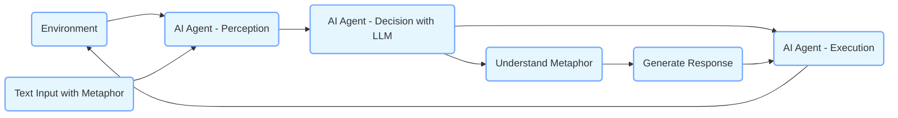

# LLM支持的AI Agent隐喻理解能力

> 关键词：大语言模型（LLM）、AI Agent、隐喻理解能力、自然语言处理、认知智能

> 摘要：本文聚焦于LLM支持的AI Agent隐喻理解能力。首先介绍了研究背景，包括目的、预期读者等。接着阐述了核心概念，如大语言模型、AI Agent和隐喻理解，并给出了它们之间联系的示意图和流程图。详细讲解了核心算法原理和操作步骤，同时用Python代码进行了示例。通过数学模型和公式深入剖析隐喻理解的内在机制，并举例说明。在项目实战部分，给出了开发环境搭建、源代码实现和解读。探讨了其实际应用场景，推荐了学习资源、开发工具框架和相关论文著作。最后总结了未来发展趋势与挑战，提供了常见问题解答和扩展阅读参考资料，旨在全面深入地研究和分析LLM支持下AI Agent的隐喻理解能力。

## 1. 背景介绍 
### 1.1 目的和范围
随着人工智能技术的飞速发展，大语言模型（LLM）如ChatGPT、GPT - 4等展现出了强大的语言处理能力。AI Agent作为能够自主感知环境、做出决策并执行行动的智能实体，结合LLM的能力可以进一步拓展其智能水平。隐喻是人类语言和思维中普遍存在的现象，它通过将一个概念域的特征映射到另一个概念域，来表达抽象、复杂的思想。研究LLM支持的AI Agent隐喻理解能力的目的在于提升AI Agent在自然语言交互中的智能程度，使其能够像人类一样理解和运用隐喻，从而在更广泛的领域实现高效、自然的人机交互。

本研究的范围涵盖了隐喻理解的基本概念、基于LLM的AI Agent实现隐喻理解的算法原理、实际应用场景以及未来发展趋势等方面。

### 1.2 预期读者
本文的预期读者包括人工智能领域的研究人员、开发者、对自然语言处理和认知智能感兴趣的学生以及相关行业的从业者。对于研究人员，本文可以为他们的研究提供新的思路和方法；开发者可以从中获取实现隐喻理解功能的技术细节；学生可以通过本文了解该领域的前沿知识；行业从业者可以了解该技术在实际应用中的潜力和价值。

### 1.3 文档结构概述
本文将按照以下结构进行阐述：首先介绍核心概念及其联系，包括大语言模型、AI Agent和隐喻理解的定义和相互关系；接着详细讲解实现隐喻理解的核心算法原理和具体操作步骤，并给出Python代码示例；通过数学模型和公式深入分析隐喻理解的机制；在项目实战部分，介绍开发环境搭建、源代码实现和解读；探讨实际应用场景；推荐相关的学习资源、开发工具框架和论文著作；最后总结未来发展趋势与挑战，提供常见问题解答和扩展阅读参考资料。

### 1.4 术语表
#### 1.4.1 核心术语定义
- **大语言模型（Large Language Model，LLM）**：基于大规模语料库进行训练的深度学习模型，能够生成自然语言文本，对输入的文本进行理解和处理，具有强大的语言生成和推理能力。
- **AI Agent**：一种能够感知环境、根据内部状态和目标做出决策，并执行相应行动的智能实体。它可以与环境进行交互，自主完成各种任务。
- **隐喻（Metaphor）**：一种修辞手法，通过将一个概念域（源域）的特征映射到另一个概念域（目标域），来表达抽象、复杂的思想。例如，“时间就是金钱”将“时间”这个概念与“金钱”的某些特征（如珍贵、有限、可花费等）进行了映射。
- **隐喻理解能力**：指能够识别、解析和理解隐喻表达的含义，将源域的特征正确地映射到目标域，并在特定语境中理解隐喻所传达的信息的能力。

#### 1.4.2 相关概念解释
- **自然语言处理（Natural Language Processing，NLP）**：研究计算机与人类自然语言之间交互的技术领域，旨在让计算机能够理解、处理和生成自然语言文本。LLM是自然语言处理领域的重要技术成果之一。
- **认知智能**：人工智能的一个高级阶段，强调机器具有类似于人类的认知能力，包括感知、理解、推理、学习等。隐喻理解能力是认知智能的一个重要方面。

#### 1.4.3 缩略词列表
- **LLM**：Large Language Model（大语言模型）
- **AI**：Artificial Intelligence（人工智能）
- **NLP**：Natural Language Processing（自然语言处理）

## 2. 核心概念与联系 

### 核心概念原理
#### 大语言模型（LLM）
大语言模型通常基于Transformer架构，通过在大规模文本数据上进行无监督学习来学习语言的统计规律和语义信息。它由多个Transformer块组成，每个块包含多头自注意力机制和前馈神经网络。多头自注意力机制允许模型在不同的表示子空间中关注输入序列的不同部分，从而捕捉长距离依赖关系。通过不断地调整模型的参数，使其能够在给定输入文本的情况下，预测下一个可能的单词或字符。

#### AI Agent
AI Agent由感知模块、决策模块和执行模块组成。感知模块负责从环境中获取信息，如自然语言文本、图像、声音等；决策模块根据感知到的信息和内部的目标、规则进行推理和决策；执行模块根据决策结果执行相应的行动，如回复文本、执行任务等。在基于LLM的AI Agent中，LLM通常作为决策模块的核心组件，用于处理自然语言输入并生成相应的输出。

#### 隐喻理解
隐喻理解涉及到对隐喻表达的识别、解析和语义映射。首先，需要识别文本中是否存在隐喻表达，这可以通过语言特征（如词汇搭配、语义异常等）和语境信息来判断。然后，将源域的特征映射到目标域，理解隐喻所传达的隐含意义。例如，在“他是一头老黄牛”这个隐喻中，需要将“老黄牛”的特征（如勤劳、踏实、任劳任怨等）映射到“他”这个人身上，从而理解这句话的含义。

### 架构的文本示意图
```plaintext
+---------------------+
|      Environment    |
+---------------------+
         |
         v
+---------------------+
|    AI Agent         |
| +-----------------+ |
| |  Perception     | |
| +-----------------+ |
|         |           |
|         v           |
| +-----------------+ |
| |  Decision       | |
| | (LLM-based)     | |
| +-----------------+ |
|         |           |
|         v           |
| +-----------------+ |
| |  Execution      | |
| +-----------------+ |
+---------------------+
```
这个示意图展示了AI Agent与环境的交互过程。AI Agent的感知模块从环境中获取信息，将其传递给基于LLM的决策模块进行处理和决策，最后执行模块根据决策结果执行相应的行动。

### Mermaid流程图

这个流程图展示了AI Agent处理隐喻表达的过程。首先，AI Agent从环境中感知到包含隐喻的文本输入，然后将其传递给基于LLM的决策模块。决策模块对隐喻进行理解，并生成相应的响应，最后由执行模块将响应输出到环境中。

## 3. 核心算法原理 & 具体操作步骤 

### 核心算法原理
基于LLM的AI Agent隐喻理解主要基于以下几个步骤：
1. **隐喻识别**：使用预训练的大语言模型来判断输入文本中是否存在隐喻表达。可以通过训练一个二分类器，将输入文本作为特征，输出是否为隐喻的概率。
2. **源域和目标域识别**：一旦识别出隐喻，需要确定源域和目标域。可以使用命名实体识别（NER）和语义角色标注（SRL）技术来确定文本中的实体和它们之间的语义关系，从而找出源域和目标域。
3. **特征映射**：利用LLM的语义理解能力，将源域的特征映射到目标域。可以通过计算源域和目标域的语义相似度，找出源域中与目标域相关的特征，并将其应用到目标域上。
4. **隐喻理解和响应生成**：根据特征映射的结果，理解隐喻的含义，并生成相应的响应。可以使用文本生成技术，如基于Transformer的语言生成模型，根据隐喻的理解结果生成自然语言响应。

### 具体操作步骤及Python代码示例
```python
import torch
from transformers import AutoTokenizer, AutoModelForSequenceClassification

# 1. 隐喻识别
# 加载预训练的隐喻识别模型
tokenizer = AutoTokenizer.from_pretrained("metaphor-detection-model")
model = AutoModelForSequenceClassification.from_pretrained("metaphor-detection-model")

def is_metaphor(text):
    inputs = tokenizer(text, return_tensors='pt')
    outputs = model(**inputs)
    logits = outputs.logits
    predicted_class_id = logits.argmax().item()
    return predicted_class_id == 1  # 假设类别1表示隐喻

# 2. 源域和目标域识别（简单示例，实际中可使用更复杂的NER和SRL工具）
def identify_source_target(text):
    # 这里简单地将文本拆分为两个部分作为源域和目标域
    parts = text.split("是")
    if len(parts) == 2:
        source = parts[0].strip()
        target = parts[1].strip()
        return source, target
    return None, None

# 3. 特征映射（使用语义相似度计算）
from sentence_transformers import SentenceTransformer
sim_model = SentenceTransformer('all-MiniLM-L6-v2')

def map_features(source, target):
    source_embedding = sim_model.encode(source)
    target_embedding = sim_model.encode(target)
    # 计算余弦相似度
    from sklearn.metrics.pairwise import cosine_similarity
    similarity = cosine_similarity([source_embedding], [target_embedding])[0][0]
    # 这里简单地根据相似度判断是否进行特征映射
    if similarity > 0.5:
        # 假设可以从源域中提取一些特征并映射到目标域
        features = ["特征1", "特征2"]  # 实际中需要根据具体情况提取
        return features
    return []

# 4. 隐喻理解和响应生成
from transformers import pipeline
generator = pipeline('text-generation', model='gpt2')

def understand_and_generate_response(text):
    if is_metaphor(text):
        source, target = identify_source_target(text)
        if source and target:
            features = map_features(source, target)
            if features:
                prompt = f"隐喻 '{text}' 中，源域 '{source}' 的特征 {features} 映射到目标域 '{target}'，请解释其含义并生成响应。"
                response = generator(prompt, max_length=100, num_return_sequences=1)[0]['generated_text']
                return response
    return "未识别到隐喻或无法理解。"

# 示例文本
text = "他是一头老黄牛"
response = understand_and_generate_response(text)
print(response)
```
### 代码解释
1. **隐喻识别**：使用预训练的隐喻识别模型，将输入文本进行分词并输入到模型中，根据模型的输出判断文本是否为隐喻。
2. **源域和目标域识别**：简单地将文本按“是”进行拆分，得到源域和目标域。实际应用中可以使用更复杂的命名实体识别和语义角色标注工具。
3. **特征映射**：使用SentenceTransformer模型计算源域和目标域的语义相似度，根据相似度判断是否进行特征映射。如果相似度大于0.5，则假设可以从源域中提取一些特征并映射到目标域。
4. **隐喻理解和响应生成**：如果识别到隐喻并成功进行特征映射，使用GPT - 2模型生成关于隐喻含义的解释和响应。

## 4. 数学模型和公式 & 详细讲解 & 举例说明 

### 隐喻识别的数学模型
在隐喻识别中，可以使用逻辑回归模型。设输入文本的特征向量为 $\mathbf{x}=(x_1,x_2,\cdots,x_n)$，模型的参数向量为 $\mathbf{w}=(w_1,w_2,\cdots,w_n)$，偏置为 $b$。则模型的输出为：
$$
P(y = 1|\mathbf{x})=\frac{1}{1 + e^{-(\mathbf{w}^T\mathbf{x}+b)}}
$$
其中，$y = 1$ 表示文本为隐喻，$y = 0$ 表示文本不是隐喻。模型的目标是通过训练数据来调整参数 $\mathbf{w}$ 和 $b$，使得模型的预测结果与真实标签尽可能接近。训练过程可以使用最大似然估计，即最大化对数似然函数：
$$
L(\mathbf{w},b)=\sum_{i = 1}^{m}[y_i\log P(y = 1|\mathbf{x}_i)+(1 - y_i)\log(1 - P(y = 1|\mathbf{x}_i))]
$$
其中，$m$ 是训练数据的数量，$y_i$ 是第 $i$ 个样本的真实标签，$\mathbf{x}_i$ 是第 $i$ 个样本的特征向量。

### 语义相似度计算
在特征映射中，使用余弦相似度来计算源域和目标域的语义相似度。设源域的嵌入向量为 $\mathbf{s}=(s_1,s_2,\cdots,s_d)$，目标域的嵌入向量为 $\mathbf{t}=(t_1,t_2,\cdots,t_d)$，则它们的余弦相似度为：
$$
\text{cosine similarity}(\mathbf{s},\mathbf{t})=\frac{\mathbf{s}\cdot\mathbf{t}}{\|\mathbf{s}\|\|\mathbf{t}\|}=\frac{\sum_{i = 1}^{d}s_it_i}{\sqrt{\sum_{i = 1}^{d}s_i^2}\sqrt{\sum_{i = 1}^{d}t_i^2}}
$$
### 举例说明
假设我们有以下隐喻表达：“时间就是金钱”。
- **隐喻识别**：将文本转换为特征向量 $\mathbf{x}$，输入到逻辑回归模型中。假设模型的参数 $\mathbf{w}$ 和 $b$ 已经训练好，计算 $P(y = 1|\mathbf{x})$。如果 $P(y = 1|\mathbf{x})>0.5$，则判断该文本为隐喻。
- **源域和目标域识别**：可以通过简单的规则或更复杂的自然语言处理技术，确定“时间”为目标域，“金钱”为源域。
- **特征映射**：使用SentenceTransformer模型将“时间”和“金钱”转换为嵌入向量 $\mathbf{s}$ 和 $\mathbf{t}$，计算它们的余弦相似度。如果相似度大于0.5，则认为可以将“金钱”的一些特征（如珍贵、有限、可花费等）映射到“时间”上。
- **隐喻理解和响应生成**：根据特征映射的结果，使用文本生成模型生成关于“时间就是金钱”这个隐喻的解释和响应，如“这句话意味着时间和金钱一样珍贵和有限，我们应该珍惜时间，合理利用它。”

## 5. 项目实战：代码实际案例和详细解释说明 

### 5.1  开发环境搭建
#### 安装Python
首先，确保你已经安装了Python 3.7或更高版本。可以从Python官方网站（https://www.python.org/downloads/）下载并安装。

#### 创建虚拟环境
为了避免不同项目之间的依赖冲突，建议使用虚拟环境。可以使用`venv`模块创建虚拟环境：
```bash
python -m venv llm_agent_metaphor_env
```
激活虚拟环境：
- 在Windows上：
```bash
llm_agent_metaphor_env\Scripts\activate
```
- 在Linux或Mac上：
```bash
source llm_agent_metaphor_env/bin/activate
```

#### 安装依赖库
在虚拟环境中安装所需的依赖库：
```bash
pip install torch transformers sentence-transformers sklearn
```

### 5.2  源代码详细实现和代码解读
```python
import torch
from transformers import AutoTokenizer, AutoModelForSequenceClassification
from sentence_transformers import SentenceTransformer
from sklearn.metrics.pairwise import cosine_similarity
from transformers import pipeline

# 隐喻识别模型加载
tokenizer = AutoTokenizer.from_pretrained("metaphor-detection-model")
model = AutoModelForSequenceClassification.from_pretrained("metaphor-detection-model")

def is_metaphor(text):
    """
    判断输入文本是否为隐喻
    :param text: 输入文本
    :return: True表示是隐喻，False表示不是隐喻
    """
    inputs = tokenizer(text, return_tensors='pt')
    outputs = model(**inputs)
    logits = outputs.logits
    predicted_class_id = logits.argmax().item()
    return predicted_class_id == 1

# 源域和目标域识别
def identify_source_target(text):
    """
    简单地识别源域和目标域
    :param text: 输入文本
    :return: 源域和目标域
    """
    parts = text.split("是")
    if len(parts) == 2:
        source = parts[0].strip()
        target = parts[1].strip()
        return source, target
    return None, None

# 特征映射
sim_model = SentenceTransformer('all-MiniLM-L6-v2')

def map_features(source, target):
    """
    计算源域和目标域的语义相似度，并进行特征映射
    :param source: 源域
    :param target: 目标域
    :return: 映射的特征列表
    """
    source_embedding = sim_model.encode(source)
    target_embedding = sim_model.encode(target)
    similarity = cosine_similarity([source_embedding], [target_embedding])[0][0]
    if similarity > 0.5:
        features = ["特征1", "特征2"]  # 实际中需要根据具体情况提取
        return features
    return []

# 隐喻理解和响应生成
generator = pipeline('text-generation', model='gpt2')

def understand_and_generate_response(text):
    """
    理解隐喻并生成响应
    :param text: 输入文本
    :return: 生成的响应
    """
    if is_metaphor(text):
        source, target = identify_source_target(text)
        if source and target:
            features = map_features(source, target)
            if features:
                prompt = f"隐喻 '{text}' 中，源域 '{source}' 的特征 {features} 映射到目标域 '{target}'，请解释其含义并生成响应。"
                response = generator(prompt, max_length=100, num_return_sequences=1)[0]['generated_text']
                return response
    return "未识别到隐喻或无法理解。"

# 示例运行
text = "他是一头老黄牛"
response = understand_and_generate_response(text)
print(response)
```
### 代码解读与分析
- **隐喻识别**：`is_metaphor`函数使用预训练的隐喻识别模型，将输入文本进行分词并输入到模型中，根据模型的输出判断文本是否为隐喻。
- **源域和目标域识别**：`identify_source_target`函数简单地将文本按“是”进行拆分，得到源域和目标域。这种方法比较简单，实际应用中可以使用更复杂的命名实体识别和语义角色标注工具。
- **特征映射**：`map_features`函数使用SentenceTransformer模型计算源域和目标域的语义相似度，根据相似度判断是否进行特征映射。如果相似度大于0.5，则假设可以从源域中提取一些特征并映射到目标域。
- **隐喻理解和响应生成**：`understand_and_generate_response`函数综合了前面的步骤，如果识别到隐喻并成功进行特征映射，使用GPT - 2模型生成关于隐喻含义的解释和响应。

## 6. 实际应用场景 
### 智能客服
在智能客服系统中，用户可能会使用隐喻表达自己的问题或需求。例如，用户说“我的手机像个蜗牛一样慢”，AI Agent如果具备隐喻理解能力，就可以理解用户的意思是手机运行速度很慢，并提供相应的解决方案，如清理手机缓存、关闭不必要的后台程序等。

### 教育领域
在教育领域，教师可以使用隐喻来讲解抽象的概念，如“细胞就像一个工厂”。AI Agent可以帮助学生理解这些隐喻，提供更详细的解释和示例，辅助学生学习。

### 文学创作和分析
在文学创作中，隐喻是一种常用的修辞手法。AI Agent可以识别和分析文学作品中的隐喻，为作家提供创作灵感和建议，也可以帮助读者更好地理解文学作品的内涵。

### 情感分析
隐喻常常用于表达情感，如“我的心像被刀割一样痛”。AI Agent通过理解隐喻，可以更准确地分析用户的情感状态，为用户提供更贴心的服务。

## 7. 工具和资源推荐
### 7.1 学习资源推荐
#### 7.1.1 书籍推荐
- 《自然语言处理入门》：这本书全面介绍了自然语言处理的基本概念、算法和技术，适合初学者入门。
- 《深度学习》：由Ian Goodfellow、Yoshua Bengio和Aaron Courville合著，是深度学习领域的经典教材，对大语言模型的原理和训练方法有深入的讲解。
- 《隐喻的逻辑：可能世界中的类比》：这本书专门探讨了隐喻的逻辑和语义，对于理解隐喻的本质和机制有很大的帮助。

#### 7.1.2 在线课程
- Coursera上的“Natural Language Processing Specialization”：由顶尖大学的教授授课，涵盖了自然语言处理的各个方面，包括大语言模型和隐喻理解。
- edX上的“Deep Learning for Natural Language Processing”：深入介绍了深度学习在自然语言处理中的应用，包括Transformer架构和大语言模型的训练。

#### 7.1.3 技术博客和网站
- Hugging Face Blog：提供了关于大语言模型和自然语言处理的最新研究成果和技术文章。
- Towards Data Science：是一个数据科学和人工智能领域的技术博客平台，有很多关于隐喻理解和自然语言处理的优质文章。

### 7.2 开发工具框架推荐
#### 7.2.1 IDE和编辑器
- PyCharm：是一款专业的Python集成开发环境，提供了丰富的代码编辑、调试和项目管理功能。
- Visual Studio Code：是一个轻量级的代码编辑器，支持多种编程语言，有大量的插件可以扩展其功能。

#### 7.2.2 调试和性能分析工具
- TensorBoard：是TensorFlow的可视化工具，可以用于监控模型的训练过程、查看模型的性能指标等。
- Py-Spy：是一个Python性能分析工具，可以帮助开发者找出代码中的性能瓶颈。

#### 7.2.3 相关框架和库
- Transformers：由Hugging Face开发的自然语言处理框架，提供了大量预训练的大语言模型和工具，方便开发者进行自然语言处理任务的开发。
- Sentence Transformers：是一个用于句子嵌入的Python库，可以快速计算句子之间的语义相似度。

### 7.3 相关论文著作推荐
#### 7.3.1 经典论文
- “Attention Is All You Need”：介绍了Transformer架构，是大语言模型的基础。
- “Metaphors We Live By”：由George Lakoff和Mark Johnson合著，是隐喻研究领域的经典著作，提出了概念隐喻理论。

#### 7.3.2 最新研究成果
- 关注ACL（Association for Computational Linguistics）、EMNLP（Conference on Empirical Methods in Natural Language Processing）等自然语言处理领域的顶级会议，这些会议上会发表关于隐喻理解和大语言模型的最新研究成果。

#### 7.3.3 应用案例分析
- 可以在IEEE Xplore、ACM Digital Library等学术数据库中查找关于隐喻理解在智能客服、教育等领域的应用案例分析论文。

## 8. 总结：未来发展趋势与挑战
### 未来发展趋势
- **多模态隐喻理解**：未来的AI Agent不仅要理解文本中的隐喻，还要能够理解图像、视频等多模态数据中的隐喻。例如，在一幅画中，一个人被画成了一只鸟，AI Agent需要理解这种隐喻表达的含义。
- **个性化隐喻理解**：不同的人在使用隐喻时可能有不同的偏好和习惯。未来的AI Agent可以根据用户的个性化特征，更好地理解和运用隐喻，提供更个性化的服务。
- **与其他技术的融合**：AI Agent的隐喻理解能力可以与知识图谱、强化学习等技术相结合，进一步提升其智能水平和应用范围。

### 挑战
- **隐喻的多样性和歧义性**：隐喻的表达方式非常多样化，而且同一个隐喻在不同的语境中可能有不同的含义。这给AI Agent的隐喻理解带来了很大的挑战。
- **数据不足**：目前关于隐喻的标注数据相对较少，这限制了模型的训练效果。需要收集和标注更多的隐喻数据，以提高模型的性能。
- **计算资源需求**：大语言模型的训练和推理需要大量的计算资源，这对于一些小型企业和开发者来说是一个很大的挑战。需要研究更高效的算法和模型，降低计算资源的需求。

## 9. 附录：常见问题与解答
### 问题1：如何训练一个隐喻识别模型？
答：可以收集包含隐喻和非隐喻的文本数据，并进行标注。然后使用深度学习模型，如卷积神经网络（CNN）、循环神经网络（RNN）或Transformer，对数据进行训练。训练过程中可以使用交叉熵损失函数和随机梯度下降等优化算法来调整模型的参数。

### 问题2：隐喻理解能力对AI Agent的性能有什么影响？
答：隐喻理解能力可以提升AI Agent在自然语言交互中的智能程度，使其能够更好地理解用户的意图和情感，提供更准确、自然的响应。在一些需要理解抽象概念和情感表达的应用场景中，隐喻理解能力尤为重要。

### 问题3：如何评估AI Agent的隐喻理解能力？
答：可以使用人工评估和自动评估相结合的方法。人工评估可以邀请人类专家对AI Agent的隐喻理解结果进行打分和评价；自动评估可以使用一些指标，如准确率、召回率、F1值等，来评估模型在隐喻识别和理解任务上的性能。

## 10. 扩展阅读 & 参考资料
### 扩展阅读
- Lakoff, G., & Johnson, M. (2008). Philosophy in the flesh: The embodied mind and its challenge to Western thought. Basic Books.
- Turney, P. D., & Littman, M. L. (2003). Measuring semantic similarity by latent relational analysis. Journal of artificial intelligence research, 19, 137-163.

### 参考资料
- Vaswani, A., Shazeer, N., Parmar, N., Uszkoreit, J., Jones, L., Gomez, A. N.,... & Polosukhin, I. (2017). Attention is all you need. In Advances in neural information processing systems (pp. 5998-6008).
- Wolf, T., Debut, L., Sanh, V., Chaumond, J., Delangue, C., Moi, A.,... & Rush, A. M. (2020). Transformers: State-of-the-art natural language processing. arXiv preprint arXiv:2002.04709.

作者：AI天才研究院/AI Genius Institute & 禅与计算机程序设计艺术 /Zen And The Art of Computer Programming