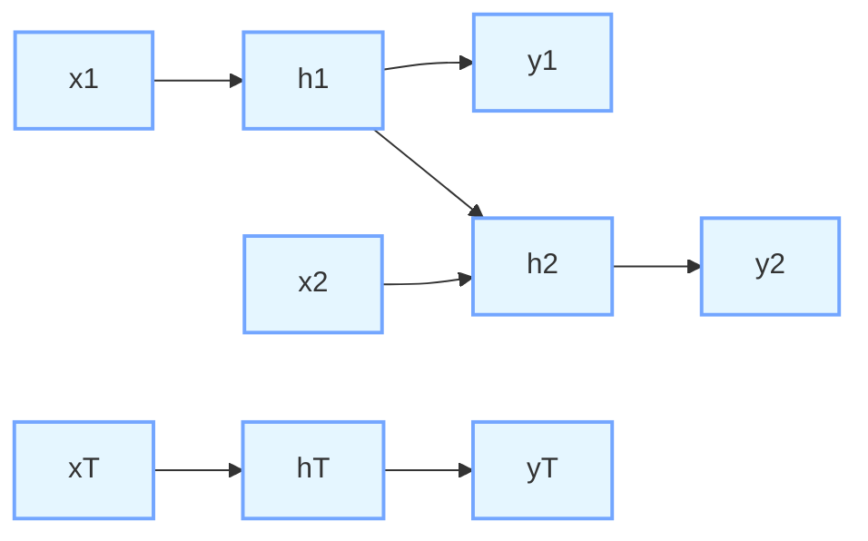

# LLM状态建模中的隐藏状态问题

> 关键词：大语言模型（LLM）、状态建模、隐藏状态、信息表征、序列处理

> 摘要：本文围绕大语言模型（LLM）状态建模中的隐藏状态问题展开深入探讨。首先介绍了相关背景知识，包括研究目的、预期读者和文档结构等。接着阐述了核心概念，剖析隐藏状态在LLM中的原理与架构，并通过Mermaid流程图进行直观展示。详细讲解了核心算法原理及具体操作步骤，结合Python源代码进行说明。同时给出了数学模型和公式，并举例解释。通过项目实战，提供代码实际案例及详细解读。探讨了隐藏状态问题在实际中的应用场景，推荐了相关的学习资源、开发工具框架和论文著作。最后总结了未来发展趋势与挑战，并提供常见问题解答和扩展阅读参考资料，旨在为深入理解和解决LLM状态建模中的隐藏状态问题提供全面的技术指导。

## 1. 背景介绍 
### 1.1 目的和范围
大语言模型（LLM）在自然语言处理领域取得了显著的成果，如文本生成、问答系统、机器翻译等。在LLM的状态建模过程中，隐藏状态起着至关重要的作用。隐藏状态用于捕捉序列数据中的上下文信息，是模型进行推理和决策的关键因素。然而，隐藏状态也面临着诸多问题，如信息丢失、梯度消失或爆炸、难以解释等。本文的目的是深入研究LLM状态建模中的隐藏状态问题，分析其产生的原因、影响，并探讨相应的解决方法。范围涵盖隐藏状态的基本概念、核心算法原理、数学模型、实际应用场景以及未来发展趋势等方面。

### 1.2 预期读者
本文预期读者包括自然语言处理领域的研究人员、人工智能工程师、对大语言模型感兴趣的开发者以及相关专业的学生。对于有一定编程基础和机器学习知识的读者，能够更好地理解文中的技术细节和代码实现。

### 1.3 文档结构概述
本文将按照以下结构进行组织：首先介绍核心概念与联系，包括隐藏状态的定义、原理和架构；接着详细阐述核心算法原理和具体操作步骤，结合Python代码进行说明；然后给出数学模型和公式，并通过具体例子进行解释；再通过项目实战展示代码的实际应用和详细解读；探讨隐藏状态问题在实际中的应用场景；推荐相关的学习资源、开发工具框架和论文著作；最后总结未来发展趋势与挑战，提供常见问题解答和扩展阅读参考资料。

### 1.4 术语表
#### 1.4.1 核心术语定义
- **大语言模型（LLM）**：是一种基于深度学习的语言模型，通常使用大量的文本数据进行训练，能够处理各种自然语言任务，如文本生成、问答、翻译等。
- **状态建模**：在LLM中，状态建模是指对模型在处理序列数据时的内部状态进行表示和更新的过程，以便模型能够捕捉上下文信息。
- **隐藏状态**：是LLM在处理序列数据时的内部状态，它不直接可见，但包含了模型对过去输入的信息表征，用于影响当前和未来的输出。
- **上下文信息**：指文本中与当前处理的部分相关的前后文内容，隐藏状态的作用之一就是捕捉和利用这些上下文信息。

#### 1.4.2 相关概念解释
- **序列处理**：LLM通常处理的是序列数据，如文本句子。序列处理意味着模型按顺序依次处理输入序列中的每个元素，并根据之前的处理结果更新隐藏状态。
- **信息表征**：隐藏状态是对输入序列信息的一种表征方式，它将输入的文本信息转化为模型内部的数值表示，以便进行后续的计算和决策。
- **梯度消失或爆炸**：在训练LLM时，梯度用于更新模型的参数。梯度消失指梯度在反向传播过程中变得非常小，导致模型参数更新缓慢；梯度爆炸则指梯度变得非常大，导致模型不稳定。

#### 1.4.3 缩略词列表
- **LLM**：大语言模型（Large Language Model）
- **RNN**：循环神经网络（Recurrent Neural Network）
- **LSTM**：长短期记忆网络（Long Short-Term Memory）
- **GRU**：门控循环单元（Gated Recurrent Unit）
- **Transformer**：一种基于注意力机制的深度学习模型架构

## 2. 核心概念与联系 
### 核心概念原理
在LLM中，隐藏状态是模型内部的一种表示，用于存储和传递序列数据中的上下文信息。以循环神经网络（RNN）为例，RNN是一种经典的序列处理模型，它在处理序列数据时会维护一个隐藏状态。假设输入序列为 $x_1, x_2, \cdots, x_T$，其中 $T$ 是序列的长度。在第 $t$ 个时间步，RNN根据当前输入 $x_t$ 和上一个时间步的隐藏状态 $h_{t - 1}$ 计算当前的隐藏状态 $h_t$，公式如下：

$$h_t = f(W_{hh}h_{t - 1} + W_{xh}x_t + b_h)$$

其中 $W_{hh}$ 和 $W_{xh}$ 是权重矩阵，$b_h$ 是偏置向量，$f$ 是激活函数，如tanh函数。隐藏状态 $h_t$ 包含了从序列开始到当前时间步的信息，模型可以根据 $h_t$ 进行预测或生成输出。

### 架构的文本示意图
以下是一个简单的RNN架构示意图：

输入序列：$x_1 \to x_2 \to \cdots \to x_T$

隐藏状态：$h_0 \to h_1 \to \cdots \to h_T$

输出：$y_1 \to y_2 \to \cdots \to y_T$

在每个时间步，输入 $x_t$ 和上一个隐藏状态 $h_{t - 1}$ 共同作用生成当前隐藏状态 $h_t$，然后根据 $h_t$ 生成输出 $y_t$。

### Mermaid流程图


该流程图展示了RNN在处理序列数据时的基本流程，每个时间步输入一个元素，更新隐藏状态并生成输出，且隐藏状态会在时间步之间传递。

## 3. 核心算法原理 & 具体操作步骤 
### 核心算法原理
在LLM中，除了RNN，还有其他一些常用的模型架构用于处理隐藏状态，如LSTM和GRU。

#### LSTM（长短期记忆网络）
LSTM是为了解决RNN中的梯度消失问题而提出的。它通过引入门控机制来控制信息的流动，包括输入门 $i_t$、遗忘门 $f_t$、输出门 $o_t$ 和细胞状态 $C_t$。以下是LSTM的核心公式：

遗忘门：
$$f_t = \sigma(W_f[h_{t - 1}, x_t] + b_f)$$

输入门：
$$i_t = \sigma(W_i[h_{t - 1}, x_t] + b_i)$$

候选细胞状态：
$$\tilde{C}_t = \tanh(W_C[h_{t - 1}, x_t] + b_C)$$

细胞状态更新：
$$C_t = f_t \odot C_{t - 1} + i_t \odot \tilde{C}_t$$

输出门：
$$o_t = \sigma(W_o[h_{t - 1}, x_t] + b_o)$$

隐藏状态更新：
$$h_t = o_t \odot \tanh(C_t)$$

其中 $\sigma$ 是sigmoid函数，$\odot$ 表示逐元素相乘，$W$ 是权重矩阵，$b$ 是偏置向量。

#### GRU（门控循环单元）
GRU是LSTM的一种简化版本，它合并了细胞状态和隐藏状态，并减少了门控的数量。GRU的核心公式如下：

重置门：
$$r_t = \sigma(W_r[h_{t - 1}, x_t] + b_r)$$

更新门：
$$z_t = \sigma(W_z[h_{t - 1}, x_t] + b_z)$$

候选隐藏状态：
$$\tilde{h}_t = \tanh(W_h[r_t \odot h_{t - 1}, x_t] + b_h)$$

隐藏状态更新：
$$h_t = (1 - z_t) \odot h_{t - 1} + z_t \odot \tilde{h}_t$$

### 具体操作步骤
以下是使用Python和PyTorch库实现一个简单的LSTM模型的具体操作步骤：

```python
import torch
import torch.nn as nn

# 定义LSTM模型
class LSTMModel(nn.Module):
    def __init__(self, input_size, hidden_size, num_layers, output_size):
        super(LSTMModel, self).__init__()
        self.hidden_size = hidden_size
        self.num_layers = num_layers
        self.lstm = nn.LSTM(input_size, hidden_size, num_layers, batch_first=True)
        self.fc = nn.Linear(hidden_size, output_size)

    def forward(self, x):
        # 初始化隐藏状态和细胞状态
        h0 = torch.zeros(self.num_layers, x.size(0), self.hidden_size).to(x.device)
        c0 = torch.zeros(self.num_layers, x.size(0), self.hidden_size).to(x.device)

        # 前向传播LSTM
        out, _ = self.lstm(x, (h0, c0))

        # 取最后一个时间步的输出
        out = out[:, -1, :]

        # 通过全连接层
        out = self.fc(out)
        return out

# 定义模型参数
input_size = 10
hidden_size = 20
num_layers = 2
output_size = 1

# 创建模型实例
model = LSTMModel(input_size, hidden_size, num_layers, output_size)

# 定义输入数据
batch_size = 32
seq_length = 5
input_data = torch.randn(batch_size, seq_length, input_size)

# 前向传播
output = model(input_data)
print(output.shape)
```

### 代码解释
1. **定义LSTM模型类**：`LSTMModel` 继承自 `nn.Module`，在 `__init__` 方法中初始化LSTM层和全连接层。
2. **前向传播方法**：`forward` 方法实现了模型的前向传播过程，包括初始化隐藏状态和细胞状态，通过LSTM层进行计算，取最后一个时间步的输出，再通过全连接层得到最终输出。
3. **创建模型实例**：根据定义的参数创建 `LSTMModel` 的实例。
4. **定义输入数据**：生成随机的输入数据，模拟实际的序列数据。
5. **前向传播**：将输入数据传入模型，得到输出并打印输出的形状。

## 4. 数学模型和公式 & 详细讲解 & 举例说明 
### RNN数学模型和公式
在RNN中，隐藏状态的更新公式为：

$$h_t = f(W_{hh}h_{t - 1} + W_{xh}x_t + b_h)$$

其中 $x_t$ 是第 $t$ 个时间步的输入向量，$h_{t - 1}$ 是上一个时间步的隐藏状态向量，$W_{hh}$ 是隐藏状态到隐藏状态的权重矩阵，$W_{xh}$ 是输入到隐藏状态的权重矩阵，$b_h$ 是偏置向量，$f$ 是激活函数。

输出公式为：

$$y_t = g(W_{hy}h_t + b_y)$$

其中 $y_t$ 是第 $t$ 个时间步的输出向量，$W_{hy}$ 是隐藏状态到输出的权重矩阵，$b_y$ 是偏置向量，$g$ 是激活函数。

### 详细讲解
- **权重矩阵**：$W_{hh}$、$W_{xh}$ 和 $W_{hy}$ 是模型需要学习的参数，它们决定了输入、隐藏状态和输出之间的映射关系。
- **偏置向量**：$b_h$ 和 $b_y$ 用于调整模型的输出，增加模型的灵活性。
- **激活函数**：$f$ 和 $g$ 通常选择非线性激活函数，如tanh或sigmoid，以引入非线性因素，使模型能够学习复杂的模式。

### 举例说明
假设输入向量 $x_t$ 的维度为 $d_x = 3$，隐藏状态向量 $h_t$ 的维度为 $d_h = 2$，输出向量 $y_t$ 的维度为 $d_y = 1$。则权重矩阵的形状分别为：$W_{xh} \in \mathbb{R}^{2 \times 3}$，$W_{hh} \in \mathbb{R}^{2 \times 2}$，$W_{hy} \in \mathbb{R}^{1 \times 2}$。偏置向量的形状分别为：$b_h \in \mathbb{R}^{2}$，$b_y \in \mathbb{R}^{1}$。

假设 $x_t = [1, 2, 3]^T$，$h_{t - 1} = [0.1, 0.2]^T$，$W_{xh} = \begin{bmatrix} 0.1 & 0.2 & 0.3 \\ 0.4 & 0.5 & 0.6 \end{bmatrix}$，$W_{hh} = \begin{bmatrix} 0.7 & 0.8 \\ 0.9 & 1.0 \end{bmatrix}$，$b_h = [0.01, 0.02]^T$，激活函数 $f$ 为tanh函数。

首先计算 $W_{xh}x_t + W_{hh}h_{t - 1} + b_h$：

$$
\begin{align*}
W_{xh}x_t + W_{hh}h_{t - 1} + b_h &= \begin{bmatrix} 0.1 & 0.2 & 0.3 \\ 0.4 & 0.5 & 0.6 \end{bmatrix} \begin{bmatrix} 1 \\ 2 \\ 3 \end{bmatrix} + \begin{bmatrix} 0.7 & 0.8 \\ 0.9 & 1.0 \end{bmatrix} \begin{bmatrix} 0.1 \\ 0.2 \end{bmatrix} + \begin{bmatrix} 0.01 \\ 0.02 \end{bmatrix} \\
&= \begin{bmatrix} 0.1 \times 1 + 0.2 \times 2 + 0.3 \times 3 \\ 0.4 \times 1 + 0.5 \times 2 + 0.6 \times 3 \end{bmatrix} + \begin{bmatrix} 0.7 \times 0.1 + 0.8 \times 0.2 \\ 0.9 \times 0.1 + 1.0 \times 0.2 \end{bmatrix} + \begin{bmatrix} 0.01 \\ 0.02 \end{bmatrix} \\
&= \begin{bmatrix} 1.4 \\ 3.2 \end{bmatrix} + \begin{bmatrix} 0.23 \\ 0.29 \end{bmatrix} + \begin{bmatrix} 0.01 \\ 0.02 \end{bmatrix} \\
&= \begin{bmatrix} 1.64 \\ 3.51 \end{bmatrix}
\end{align*}
$$

然后应用tanh函数得到 $h_t$：

$$h_t = \tanh \begin{bmatrix} 1.64 \\ 3.51 \end{bmatrix} = \begin{bmatrix} 0.93 \\ 0.99 \end{bmatrix}$$

## 5. 项目实战：代码实际案例和详细解释说明 
### 5.1  开发环境搭建
#### 安装Python
首先确保你已经安装了Python，建议使用Python 3.7及以上版本。可以从Python官方网站（https://www.python.org/downloads/）下载并安装。

#### 安装PyTorch
PyTorch是一个广泛使用的深度学习框架，用于实现神经网络模型。可以根据自己的操作系统和CUDA版本选择合适的安装方式，具体安装命令可以参考PyTorch官方网站（https://pytorch.org/get-started/locally/）。例如，如果你使用的是CPU版本，可以使用以下命令安装：

```sh
pip install torch torchvision
```

#### 安装其他依赖库
还需要安装一些其他的依赖库，如`numpy`、`matplotlib`等，可以使用以下命令安装：

```sh
pip install numpy matplotlib
```

### 5.2  源代码详细实现和代码解读
以下是一个使用LSTM进行文本分类的项目实战代码：

```python
import torch
import torch.nn as nn
import torch.optim as optim
from torch.utils.data import Dataset, DataLoader
import numpy as np
import random

# 定义数据集类
class TextDataset(Dataset):
    def __init__(self, data, labels):
        self.data = data
        self.labels = labels

    def __len__(self):
        return len(self.data)

    def __getitem__(self, idx):
        return torch.tensor(self.data[idx], dtype=torch.float32), torch.tensor(self.labels[idx], dtype=torch.long)

# 定义LSTM文本分类模型
class LSTMTextClassifier(nn.Module):
    def __init__(self, input_size, hidden_size, num_layers, num_classes):
        super(LSTMTextClassifier, self).__init__()
        self.hidden_size = hidden_size
        self.num_layers = num_layers
        self.lstm = nn.LSTM(input_size, hidden_size, num_layers, batch_first=True)
        self.fc = nn.Linear(hidden_size, num_classes)

    def forward(self, x):
        # 初始化隐藏状态和细胞状态
        h0 = torch.zeros(self.num_layers, x.size(0), self.hidden_size).to(x.device)
        c0 = torch.zeros(self.num_layers, x.size(0), self.hidden_size).to(x.device)

        # 前向传播LSTM
        out, _ = self.lstm(x, (h0, c0))

        # 取最后一个时间步的输出
        out = out[:, -1, :]

        # 通过全连接层
        out = self.fc(out)
        return out

# 生成一些随机数据用于演示
def generate_random_data(num_samples, seq_length, input_size, num_classes):
    data = []
    labels = []
    for _ in range(num_samples):
        sample = np.random.randn(seq_length, input_size)
        label = random.randint(0, num_classes - 1)
        data.append(sample)
        labels.append(label)
    return data, labels

# 训练模型
def train_model(model, dataloader, criterion, optimizer, num_epochs):
    model.train()
    for epoch in range(num_epochs):
        running_loss = 0.0
        for inputs, labels in dataloader:
            inputs = inputs.to(device)
            labels = labels.to(device)

            # 清零梯度
            optimizer.zero_grad()

            # 前向传播
            outputs = model(inputs)
            loss = criterion(outputs, labels)

            # 反向传播和优化
            loss.backward()
            optimizer.step()

            running_loss += loss.item()

        print(f'Epoch {epoch + 1}/{num_epochs}, Loss: {running_loss / len(dataloader)}')

# 主函数
if __name__ == "__main__":
    # 设备选择
    device = torch.device("cuda" if torch.cuda.is_available() else "cpu")

    # 定义模型参数
    input_size = 10
    hidden_size = 20
    num_layers = 2
    num_classes = 2
    num_samples = 1000
    seq_length = 5
    batch_size = 32
    num_epochs = 10

    # 生成随机数据
    data, labels = generate_random_data(num_samples, seq_length, input_size, num_classes)

    # 创建数据集和数据加载器
    dataset = TextDataset(data, labels)
    dataloader = DataLoader(dataset, batch_size=batch_size, shuffle=True)

    # 创建模型实例
    model = LSTMTextClassifier(input_size, hidden_size, num_layers, num_classes).to(device)

    # 定义损失函数和优化器
    criterion = nn.CrossEntropyLoss()
    optimizer = optim.Adam(model.parameters(), lr=0.001)

    # 训练模型
    train_model(model, dataloader, criterion, optimizer, num_epochs)
```

### 5.3  代码解读与分析
#### 数据集类 `TextDataset`
- 继承自 `torch.utils.data.Dataset`，用于封装数据和标签。
- `__len__` 方法返回数据集的样本数量。
- `__getitem__` 方法根据索引返回对应的输入数据和标签。

#### LSTM文本分类模型 `LSTMTextClassifier`
- 继承自 `nn.Module`，包含一个LSTM层和一个全连接层。
- `forward` 方法实现了模型的前向传播过程，包括初始化隐藏状态和细胞状态，通过LSTM层进行计算，取最后一个时间步的输出，再通过全连接层得到最终输出。

#### 生成随机数据函数 `generate_random_data`
- 用于生成随机的输入数据和标签，用于演示模型的训练过程。

#### 训练模型函数 `train_model`
- 定义了模型的训练过程，包括前向传播、计算损失、反向传播和优化参数。

#### 主函数
- 选择设备（CPU或GPU）。
- 定义模型参数和训练参数。
- 生成随机数据，创建数据集和数据加载器。
- 创建模型实例，定义损失函数和优化器。
- 调用 `train_model` 函数进行模型训练。

## 6. 实际应用场景 
### 文本生成
在文本生成任务中，如故事生成、诗歌创作等，LLM的隐藏状态可以捕捉上下文信息，帮助模型生成连贯的文本。例如，在生成故事时，模型根据之前生成的句子更新隐藏状态，然后根据当前的隐藏状态生成下一个句子，使得生成的故事具有逻辑性和连贯性。

### 问答系统
在问答系统中，隐藏状态可以用于理解问题的上下文和语义。当用户提出一个问题时，模型将问题序列输入，通过隐藏状态捕捉问题的关键信息和上下文关系，然后根据这些信息从知识库中检索答案或生成回答。

### 机器翻译
在机器翻译任务中，隐藏状态可以帮助模型理解源语言句子的语义和结构，并将其转换为目标语言。模型在处理源语言句子时，隐藏状态会不断更新，记录句子的上下文信息。在生成目标语言句子时，模型根据隐藏状态生成合适的翻译结果。

### 情感分析
在情感分析任务中，隐藏状态可以捕捉文本中的情感信息。模型通过处理文本序列，隐藏状态会反映出文本中表达的情感倾向，如积极、消极或中性。最后，根据隐藏状态进行情感分类，判断文本的情感极性。

## 7. 工具和资源推荐
### 7.1 学习资源推荐
#### 7.1.1 书籍推荐
- 《深度学习》（Deep Learning）：由Ian Goodfellow、Yoshua Bengio和Aaron Courville所著，是深度学习领域的经典教材，涵盖了神经网络、深度学习模型等方面的基础知识和原理。
- 《动手学深度学习》（Dive into Deep Learning）：由李沐等人编写，提供了丰富的代码示例和详细的讲解，适合初学者快速上手深度学习。
- 《自然语言处理入门》（Natural Language Processing with Python）：介绍了使用Python进行自然语言处理的基本方法和技术，包括文本预处理、词性标注、命名实体识别等。

#### 7.1.2 在线课程
- Coursera上的“深度学习专项课程”（Deep Learning Specialization）：由Andrew Ng教授授课，系统地介绍了深度学习的各个方面，包括神经网络、卷积神经网络、循环神经网络等。
- edX上的“自然语言处理基础”（Foundations of Natural Language Processing）：涵盖了自然语言处理的基本概念、算法和应用，适合初学者学习。
- 哔哩哔哩上有许多关于深度学习和自然语言处理的教程视频，如“李宏毅机器学习”等，讲解生动易懂。

#### 7.1.3 技术博客和网站
- Medium：有许多深度学习和自然语言处理领域的优秀博客文章，作者来自不同的研究机构和公司。
- arXiv：是一个预印本服务器，提供了大量的最新研究论文，涵盖了人工智能、机器学习等领域。
- Hugging Face：是一个专注于自然语言处理的开源社区，提供了丰富的模型库、工具和教程。

### 7.2 开发工具框架推荐
#### 7.2.1 IDE和编辑器
- PyCharm：是一款专门为Python开发设计的集成开发环境（IDE），提供了丰富的代码编辑、调试和项目管理功能。
- Jupyter Notebook：是一个交互式的开发环境，适合进行数据分析、模型训练和实验。可以方便地编写代码、展示结果和添加注释。
- Visual Studio Code：是一个轻量级的代码编辑器，支持多种编程语言，通过安装插件可以实现Python开发的各种功能。

#### 7.2.2 调试和性能分析工具
- PyTorch Profiler：是PyTorch自带的性能分析工具，可以帮助开发者分析模型的性能瓶颈，如计算时间、内存使用等。
- TensorBoard：是TensorFlow提供的可视化工具，也可以与PyTorch结合使用。可以用于可视化模型的训练过程、损失曲线、梯度分布等。
- PDB：是Python自带的调试器，可以在代码中设置断点，逐步执行代码，查看变量的值和程序的执行流程。

#### 7.2.3 相关框架和库
- PyTorch：是一个开源的深度学习框架，具有动态图机制，易于使用和调试。提供了丰富的神经网络层和优化算法。
- TensorFlow：是另一个广泛使用的深度学习框架，具有强大的分布式训练和部署能力。提供了高级的API和工具，适合大规模的深度学习项目。
- Transformers：是Hugging Face开发的一个自然语言处理库，提供了许多预训练的大语言模型，如BERT、GPT等，方便开发者进行模型微调。

### 7.3 相关论文著作推荐
#### 7.3.1 经典论文
- “Long Short-Term Memory”：由Sepp Hochreiter和Jürgen Schmidhuber发表，介绍了LSTM的基本原理和结构，解决了RNN中的梯度消失问题。
- “Attention Is All You Need”：提出了Transformer架构，引入了注意力机制，在自然语言处理任务中取得了显著的成果。
- “Generative Adversarial Nets”：由Ian Goodfellow等人发表，介绍了生成对抗网络（GAN）的基本原理和应用。

#### 7.3.2 最新研究成果
- 在arXiv上可以找到许多关于大语言模型和隐藏状态的最新研究论文，如关于提高隐藏状态信息表征能力、解决隐藏状态信息丢失问题等方面的研究。
- 顶级学术会议如NeurIPS、ICML、ACL等也会发表许多关于自然语言处理和深度学习的最新研究成果。

#### 7.3.3 应用案例分析
- 一些公司和研究机构会发布关于大语言模型在实际应用中的案例分析，如OpenAI发布的关于GPT系列模型在文本生成、问答系统等方面的应用案例。
- Kaggle上也有许多关于自然语言处理任务的竞赛和案例分享，可以学习到不同的应用场景和解决方案。

## 8. 总结：未来发展趋势与挑战
### 未来发展趋势
#### 更强的信息表征能力
未来的LLM将致力于提高隐藏状态的信息表征能力，能够更准确地捕捉序列数据中的上下文信息和语义信息。例如，通过改进模型架构和注意力机制，使隐藏状态能够更好地表示长距离依赖关系。

#### 可解释性增强
随着大语言模型的广泛应用，对模型的可解释性要求越来越高。未来的研究将关注如何解释隐藏状态所包含的信息，以及模型如何根据隐藏状态进行决策。这有助于提高模型的可信度和安全性。

#### 多模态融合
将文本与图像、音频等其他模态的数据进行融合是未来的一个重要发展方向。隐藏状态可以在多模态数据的处理中发挥重要作用，帮助模型更好地理解和处理不同模态之间的信息关联。

#### 个性化建模
针对不同用户的需求和偏好进行个性化建模是未来的趋势之一。隐藏状态可以用于捕捉用户的个性化信息，使模型能够为不同用户提供更加个性化的服务和输出。

### 挑战
#### 信息丢失问题
在处理长序列数据时，隐藏状态容易出现信息丢失的问题。随着序列长度的增加，早期的信息可能会在隐藏状态的更新过程中逐渐被遗忘，导致模型对长距离依赖关系的处理能力下降。

#### 计算资源消耗
大语言模型通常需要大量的计算资源进行训练和推理，尤其是在处理大规模数据和复杂任务时。隐藏状态的更新和计算也会增加计算的复杂度和资源消耗，如何在有限的资源下提高模型的效率是一个挑战。

#### 可解释性难题
隐藏状态是模型内部的一种数值表示，其含义和决策过程往往难以解释。如何为隐藏状态提供合理的解释，使人们能够理解模型的行为和决策依据，是一个亟待解决的问题。

#### 数据隐私和安全
在使用大语言模型时，隐藏状态可能包含用户的敏感信息。如何保护这些信息的隐私和安全，防止信息泄露和滥用，是一个重要的挑战。

## 9. 附录：常见问题与解答
### 问题1：隐藏状态的维度如何选择？
隐藏状态的维度通常需要根据具体的任务和数据集进行调整。一般来说，如果任务比较复杂，需要更多的信息来表示，那么可以选择较大的隐藏状态维度；如果任务相对简单，较小的维度可能就足够了。可以通过实验来选择合适的维度，观察模型的性能和训练效果。

### 问题2：LSTM和GRU哪个更好？
LSTM和GRU都有各自的优点和适用场景。LSTM通过引入更多的门控机制，能够更好地处理长序列数据，对信息的保留和遗忘有更精细的控制；GRU则相对简单，计算效率更高，在一些对计算资源要求较高的场景中可能更有优势。选择哪个模型需要根据具体的任务和数据来决定，可以通过实验比较它们的性能。

### 问题3：如何解决隐藏状态的信息丢失问题？
可以采用以下方法来解决隐藏状态的信息丢失问题：
- 使用更复杂的模型架构，如LSTM、GRU或Transformer，它们在处理长序列数据时能够更好地保留信息。
- 引入注意力机制，使模型能够有选择地关注序列中的重要信息，减少信息丢失。
- 进行数据增强，增加训练数据的多样性，帮助模型学习更丰富的信息。

### 问题4：隐藏状态在模型训练和推理中有什么不同？
在模型训练过程中，隐藏状态的更新是通过反向传播算法来调整模型的参数，使模型能够学习到输入序列和输出之间的映射关系。在推理过程中，隐藏状态用于根据输入序列生成输出，模型根据当前的隐藏状态进行预测或生成文本。

## 10. 扩展阅读 & 参考资料
### 扩展阅读
- 《神经网络与深度学习》：进一步深入学习神经网络的原理和应用，包括不同类型的神经网络架构和训练算法。
- 《深度学习实战》：通过实际案例学习深度学习的应用和开发技巧，包括数据预处理、模型选择和调优等。
- 《自然语言处理：理论与实践》：系统地介绍自然语言处理的各个方面，包括文本分类、信息检索、机器翻译等。

### 参考资料
- Goodfellow, I., Bengio, Y., & Courville, A. (2016). Deep Learning. MIT Press.
- 李沐, 阿斯顿·张, 扎卡里·C·立顿, 亚历山大·J·斯莫拉等. (2020). 动手学深度学习. 人民邮电出版社.
- Bird, S., Klein, E., & Loper, E. (2009). Natural Language Processing with Python. O'Reilly Media.

作者：AI天才研究院/AI Genius Institute & 禅与计算机程序设计艺术 /Zen And The Art of Computer Programming