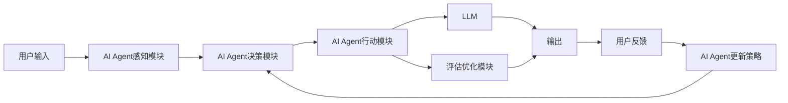

# LLM驱动的AI Agent创意写作助手

> 关键词：LLM、AI Agent、创意写作助手、自然语言处理、人工智能、语言生成、写作辅助

> 摘要：本文围绕LLM驱动的AI Agent创意写作助手展开深入探讨。首先介绍了该主题的背景信息，包括目的、预期读者等内容。接着详细阐述了核心概念，通过文本示意图和Mermaid流程图展示其架构与原理。深入分析了核心算法原理，结合Python源代码进行说明，同时给出相关数学模型和公式并举例。通过项目实战，呈现开发环境搭建、源代码实现与解读等内容。探讨了其实际应用场景，推荐了学习资源、开发工具框架以及相关论文著作。最后总结未来发展趋势与挑战，解答常见问题并提供扩展阅读和参考资料，旨在全面剖析这一新兴技术在创意写作领域的应用与发展。

## 1. 背景介绍 
### 1.1 目的和范围
随着人工智能技术的飞速发展，自然语言处理领域取得了巨大的进步。LLM（大语言模型）如GPT系列、文心一言等展现出了强大的语言理解和生成能力。而AI Agent（智能体）则是一种能够感知环境、自主决策并执行行动的智能实体。将LLM与AI Agent相结合开发创意写作助手的目的在于为写作者提供更高效、更有创意的写作辅助工具。

本文章的范围涵盖了LLM驱动的AI Agent创意写作助手的核心概念、算法原理、数学模型、项目实战、应用场景等多个方面，旨在为读者全面深入地介绍这一技术。

### 1.2 预期读者
本文预期读者包括对自然语言处理、人工智能、创意写作等领域感兴趣的技术爱好者、研究人员、开发者，以及需要借助写作辅助工具提高写作效率和质量的写作者，如作家、文案策划人员、学生等。

### 1.3 文档结构概述
本文首先介绍背景信息，让读者了解研究的目的和范围。接着阐述核心概念，帮助读者理解LLM、AI Agent以及创意写作助手之间的联系和架构。然后详细讲解核心算法原理，结合Python代码让读者明白其实现方式。通过数学模型和公式进一步深入分析。项目实战部分通过实际案例展示开发过程和代码解读。探讨实际应用场景，为读者提供应用思路。推荐相关的工具和资源，方便读者深入学习和开发。最后总结未来发展趋势与挑战，解答常见问题并提供扩展阅读和参考资料。

### 1.4 术语表
#### 1.4.1 核心术语定义
- **LLM（Large Language Model）**：大语言模型，是一种基于深度学习的语言模型，通过在大规模文本数据上进行训练，学习语言的模式和规律，能够生成自然流畅的文本。
- **AI Agent（Artificial Intelligence Agent）**：智能体，是一种能够感知环境、根据环境信息进行决策并采取行动的智能实体。在创意写作助手的语境下，AI Agent可以根据用户的写作需求和文本内容进行分析和决策，提供相应的写作建议和辅助。
- **创意写作助手**：利用人工智能技术为写作者提供创意启发、内容生成、语法检查、风格优化等写作辅助功能的工具。

#### 1.4.2 相关概念解释
- **自然语言处理（Natural Language Processing，NLP）**：是人工智能领域的一个重要分支，主要研究如何让计算机理解和处理人类语言。LLM和AI Agent创意写作助手都基于自然语言处理技术实现。
- **语言生成**：指计算机根据输入的信息生成自然语言文本的过程。在创意写作助手中，语言生成用于生成文章内容、续写、改写等。

#### 1.4.3 缩略词列表
- **LLM**：Large Language Model（大语言模型）
- **AI**：Artificial Intelligence（人工智能）
- **NLP**：Natural Language Processing（自然语言处理）

## 2. 核心概念与联系 
### 核心概念原理
#### LLM原理
LLM通常基于Transformer架构，通过自注意力机制（Self - Attention Mechanism）来学习文本中不同位置之间的依赖关系。在训练过程中，模型在大规模的文本语料库上进行无监督学习，学习语言的概率分布。例如，给定一个输入序列 $x_1, x_2, \cdots, x_n$，模型会学习预测下一个词 $x_{n + 1}$ 的概率 $P(x_{n+1}|x_1, x_2, \cdots, x_n)$。

Transformer架构由编码器（Encoder）和解码器（Decoder）组成，在一些LLM中，可能只使用解码器（如GPT系列），通过堆叠多个解码器层来学习语言的特征。解码器层主要包含多头自注意力（Multi - Head Self - Attention）和前馈神经网络（Feed - Forward Neural Network）两个子层。

#### AI Agent原理
AI Agent可以看作是一个具有感知、决策和行动能力的智能实体。在创意写作助手的场景中，AI Agent的感知模块负责获取用户的写作需求、当前文本内容等信息；决策模块根据感知到的信息，结合预定义的策略和知识，决定采取何种行动；行动模块则执行决策模块的指令，如生成写作建议、进行内容生成等。

#### 创意写作助手原理
创意写作助手基于LLM和AI Agent构建。它接收用户的写作需求，AI Agent对需求进行分析和理解，然后调用LLM进行内容生成、创意启发等操作。同时，AI Agent还可以对生成的内容进行评估和优化，根据用户的反馈不断调整策略，以提供更符合用户需求的写作辅助。

### 架构的文本示意图
```plaintext
用户输入（写作需求、文本内容等）
|
v
AI Agent（感知模块）
|
v
AI Agent（决策模块）
|
v
AI Agent（行动模块）
|       |
v       v
LLM（内容生成、创意启发等）  评估优化模块
|
v
输出（写作建议、生成内容等）
|
v
用户反馈
|
v
AI Agent（更新策略）
```

### Mermaid流程图


## 3. 核心算法原理 & 具体操作步骤 
### 核心算法原理
#### 自注意力机制
自注意力机制是Transformer架构的核心，它允许模型在处理每个位置的输入时，考虑到序列中其他位置的信息。对于输入序列 $X = [x_1, x_2, \cdots, x_n]$，首先通过线性变换得到查询（Query）矩阵 $Q$、键（Key）矩阵 $K$ 和值（Value）矩阵 $V$：

$Q = XW_Q$

$K = XW_K$

$V = XW_V$

其中 $W_Q$、$W_K$ 和 $W_V$ 是可学习的权重矩阵。然后计算注意力分数：

$Attention(Q, K, V) = softmax(\frac{QK^T}{\sqrt{d_k}})V$

其中 $d_k$ 是查询和键的维度。

#### 多头自注意力
多头自注意力通过将自注意力机制并行应用多次，增加模型的表达能力。具体来说，将查询、键和值分别投影到多个低维子空间中，在每个子空间中计算自注意力，然后将结果拼接并通过一个线性变换得到最终输出：

$MultiHead(Q, K, V) = Concat(head_1, head_2, \cdots, head_h)W_O$

其中 $head_i = Attention(QW_i^Q, KW_i^K, VW_i^V)$，$W_i^Q$、$W_i^K$、$W_i^V$ 和 $W_O$ 是可学习的权重矩阵，$h$ 是头的数量。

### 具体操作步骤及Python源代码
以下是一个简单的自注意力机制的Python实现：

```python
import torch
import torch.nn as nn
import torch.nn.functional as F

class SelfAttention(nn.Module):
    def __init__(self, input_dim, d_k):
        super(SelfAttention, self).__init__()
        self.input_dim = input_dim
        self.d_k = d_k
        self.W_q = nn.Linear(input_dim, d_k)
        self.W_k = nn.Linear(input_dim, d_k)
        self.W_v = nn.Linear(input_dim, d_k)

    def forward(self, x):
        Q = self.W_q(x)
        K = self.W_k(x)
        V = self.W_v(x)

        attention_scores = torch.matmul(Q, K.transpose(-2, -1)) / torch.sqrt(torch.tensor(self.d_k, dtype=torch.float32))
        attention_probs = F.softmax(attention_scores, dim=-1)
        output = torch.matmul(attention_probs, V)

        return output
```

使用示例：
```python
# 输入序列的维度
input_dim = 128
# 查询和键的维度
d_k = 64
# 序列长度
seq_len = 10
# 批量大小
batch_size = 2

# 生成随机输入
x = torch.randn(batch_size, seq_len, input_dim)

# 创建自注意力模块
self_attention = SelfAttention(input_dim, d_k)

# 前向传播
output = self_attention(x)
print(output.shape)  # 输出形状应为 (batch_size, seq_len, d_k)
```

## 4. 数学模型和公式 & 详细讲解 & 举例说明 
### 语言模型的数学模型
语言模型的目标是学习语言的概率分布 $P(x_1, x_2, \cdots, x_n)$，即给定一个词序列 $x_1, x_2, \cdots, x_n$ 的概率。根据链式法则，有：

$P(x_1, x_2, \cdots, x_n) = P(x_1)P(x_2|x_1)P(x_3|x_1, x_2)\cdots P(x_n|x_1, x_2, \cdots, x_{n - 1})$

在实际应用中，由于计算 $P(x_n|x_1, x_2, \cdots, x_{n - 1})$ 的复杂度较高，通常采用近似方法，如n - 元语法模型（n - gram model），假设一个词的概率只依赖于它前面的 $n - 1$ 个词：

$P(x_n|x_1, x_2, \cdots, x_{n - 1}) \approx P(x_n|x_{n - (n - 1)}, \cdots, x_{n - 1})$

### Transformer模型的损失函数
Transformer模型通常使用交叉熵损失函数进行训练。假设模型的输出为 $\hat{y}$，真实标签为 $y$，则交叉熵损失函数定义为：

$L = -\sum_{i = 1}^{N}\sum_{j = 1}^{V}y_{ij}\log(\hat{y}_{ij})$

其中 $N$ 是样本数量，$V$ 是词汇表的大小，$y_{ij}$ 是第 $i$ 个样本的第 $j$ 个词的真实标签（通常是一个one - hot向量），$\hat{y}_{ij}$ 是模型预测的第 $i$ 个样本的第 $j$ 个词的概率。

### 举例说明
假设我们有一个简单的词汇表 $V = \{a, b, c\}$，一个样本的真实标签 $y = [1, 0, 0]$（表示第一个词是 $a$），模型的输出 $\hat{y} = [0.8, 0.1, 0.1]$。则交叉熵损失为：

$L = -(1\times\log(0.8)+0\times\log(0.1)+0\times\log(0.1)) \approx - \log(0.8) \approx 0.223$

## 5. 项目实战：代码实际案例和详细解释说明 
### 5.1  开发环境搭建
#### 安装Python
首先确保你已经安装了Python，建议使用Python 3.7及以上版本。可以从Python官方网站（https://www.python.org/downloads/）下载并安装。

#### 安装深度学习框架
我们使用PyTorch作为深度学习框架，可以根据自己的CUDA版本（如果有GPU）选择合适的安装命令。在没有GPU的情况下，可以使用以下命令安装：

```sh
pip install torch torchvision
```

#### 安装其他依赖库
还需要安装一些其他的依赖库，如 `transformers` 库用于使用预训练的LLM：

```sh
pip install transformers
```

### 5.2  源代码详细实现和代码解读
以下是一个简单的基于 `transformers` 库的创意写作助手的实现：

```python
from transformers import AutoTokenizer, AutoModelForCausalLM

# 加载预训练的模型和分词器
model_name = "gpt2"
tokenizer = AutoTokenizer.from_pretrained(model_name)
model = AutoModelForCausalLM.from_pretrained(model_name)

# 定义生成文本的函数
def generate_text(prompt, max_length=100, num_return_sequences=1):
    input_ids = tokenizer.encode(prompt, return_tensors="pt")
    output = model.generate(input_ids, max_length=max_length, num_return_sequences=num_return_sequences)
    generated_text = tokenizer.decode(output[0], skip_special_tokens=True)
    return generated_text

# 示例使用
prompt = "Once upon a time"
generated_text = generate_text(prompt)
print(generated_text)
```

### 5.3  代码解读与分析
- **加载预训练的模型和分词器**：使用 `AutoTokenizer.from_pretrained` 和 `AutoModelForCausalLM.from_pretrained` 函数从Hugging Face的模型库中加载预训练的GPT - 2模型和对应的分词器。
- **定义生成文本的函数**：`generate_text` 函数接收一个提示文本 `prompt`，将其编码为模型可以接受的输入 `input_ids`，然后调用 `model.generate` 函数生成文本。最后将生成的文本解码并返回。
- **示例使用**：提供一个简单的提示文本 `Once upon a time`，调用 `generate_text` 函数生成文本并打印输出。

## 6. 实际应用场景 
### 文学创作
对于作家来说，LLM驱动的AI Agent创意写作助手可以提供创意启发，帮助他们突破创作瓶颈。例如，在构思情节时，助手可以根据设定的主题和人物背景生成一些情节建议；在写作过程中，助手可以对语句进行润色和优化，提高文章的质量。

### 文案策划
在广告、营销等领域，文案策划人员需要快速生成吸引人的文案。创意写作助手可以根据产品特点和目标受众，生成不同风格的文案，如广告语、宣传文案、产品描述等，提高工作效率。

### 学术写作
学生和研究人员在撰写学术论文时，创意写作助手可以帮助他们进行文献综述、整理思路、检查语法和拼写错误等。同时，助手还可以提供一些相关的学术观点和研究成果，辅助作者进行深入思考。

### 内容创作平台
在内容创作平台上，创意写作助手可以为用户提供个性化的写作辅助服务。例如，根据用户的写作习惯和偏好，提供定制化的写作建议和模板，提高用户的创作体验和作品质量。

## 7. 工具和资源推荐
### 7.1 学习资源推荐
#### 7.1.1 书籍推荐
- 《深度学习》（Deep Learning）：由Ian Goodfellow、Yoshua Bengio和Aaron Courville所著，是深度学习领域的经典教材，涵盖了神经网络、优化算法、卷积神经网络等多个方面的内容。
- 《自然语言处理入门》：何晗著，适合初学者快速了解自然语言处理的基本概念和方法。
- 《Python自然语言处理》（Natural Language Processing with Python）：Steven Bird、Ewan Klein和Edward Loper所著，介绍了使用Python进行自然语言处理的方法和工具。

#### 7.1.2 在线课程
- Coursera上的“深度学习专项课程”（Deep Learning Specialization）：由Andrew Ng教授授课，全面介绍了深度学习的理论和实践。
- edX上的“自然语言处理基础”（Foundations of Natural Language Processing）：深入讲解自然语言处理的基本概念和算法。
- 哔哩哔哩（Bilibili）上有许多关于自然语言处理和深度学习的免费教学视频，可以根据自己的需求选择学习。

#### 7.1.3 技术博客和网站
- Hugging Face博客（https://huggingface.co/blog）：提供了关于自然语言处理、深度学习和预训练模型的最新研究成果和技术文章。
- Medium上的“Towards Data Science”：有许多关于数据科学、机器学习和自然语言处理的高质量文章。
- 机器之心（https://www.alpaca.ai/）：专注于人工智能领域的资讯和技术文章，提供了丰富的学习资源。

### 7.2 开发工具框架推荐
#### 7.2.1 IDE和编辑器
- PyCharm：一款功能强大的Python集成开发环境，提供了代码编辑、调试、版本控制等多种功能，适合Python开发者使用。
- Visual Studio Code：轻量级的代码编辑器，支持多种编程语言，通过安装相关插件可以方便地进行Python开发。
- Jupyter Notebook：交互式的开发环境，适合进行数据探索、模型训练和代码演示，方便在开发过程中记录思路和结果。

#### 7.2.2 调试和性能分析工具
- PyTorch Profiler：PyTorch