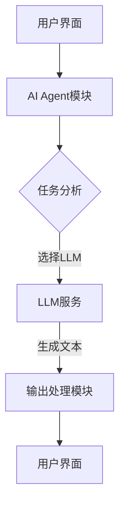

# LLM驱动的AI Agent创意生成系统

> 关键词：LLM、AI Agent、创意生成系统、自然语言处理、人工智能、智能代理、生成式模型

> 摘要：本文围绕LLM驱动的AI Agent创意生成系统展开深入探讨。详细介绍了该系统的背景知识，包括其目的、预期读者、文档结构和相关术语。阐述了核心概念及联系，通过文本示意图和Mermaid流程图进行清晰展示。深入剖析核心算法原理，结合Python源代码说明具体操作步骤，同时给出相关数学模型和公式并举例讲解。通过项目实战，从开发环境搭建到源代码实现及解读进行详细说明。探讨了该系统的实际应用场景，推荐了学习资源、开发工具框架和相关论文著作。最后总结了未来发展趋势与挑战，还设置了常见问题解答和扩展阅读参考资料。旨在全面深入地介绍LLM驱动的AI Agent创意生成系统，为相关领域的研究者和开发者提供有价值的参考。

## 1. 背景介绍 
### 1.1 目的和范围
LLM（Large Language Model，大语言模型）的出现为自然语言处理领域带来了革命性的变化。AI Agent（智能代理）作为能够自主感知环境、决策并行动的实体，与LLM的结合具有巨大的潜力。本系统的目的在于构建一个基于LLM驱动的AI Agent创意生成系统，利用LLM强大的语言理解和生成能力，让AI Agent能够生成具有创新性和实用性的创意内容，如文案创作、故事编写、设计灵感启发等。

本系统的范围涵盖了从基础的自然语言处理技术到复杂的AI Agent架构设计，包括对LLM的调用和优化，以及AI Agent的决策和行动机制。同时，还涉及到将创意生成系统应用于不同领域的实践和探索。

### 1.2 预期读者
本文预期读者包括自然语言处理、人工智能领域的研究者，他们可以从本文中获取关于LLM与AI Agent结合的最新研究思路和技术细节；软件开发人员，能够借鉴系统的实现方法和代码示例进行相关项目的开发；创意工作者，了解如何利用该系统获取创意灵感，提升工作效率和创意质量；以及对人工智能技术感兴趣的普通读者，通过本文可以初步了解LLM驱动的AI Agent创意生成系统的原理和应用。

### 1.3 文档结构概述
本文首先介绍背景知识，包括目的、预期读者、文档结构和术语表。接着阐述核心概念与联系，通过文本示意图和Mermaid流程图展示系统架构。然后深入讲解核心算法原理和具体操作步骤，结合Python源代码进行说明。之后给出数学模型和公式，并举例讲解。通过项目实战，从开发环境搭建到源代码实现及解读进行详细说明。探讨实际应用场景，推荐学习资源、开发工具框架和相关论文著作。最后总结未来发展趋势与挑战，设置常见问题解答和扩展阅读参考资料。

### 1.4 术语表
#### 1.4.1 核心术语定义
- **LLM（Large Language Model）**：大语言模型，是一种基于深度学习的语言模型，通过在大规模文本数据上进行训练，能够学习到语言的模式和规律，具备强大的语言理解和生成能力。
- **AI Agent（智能代理）**：能够感知环境、根据内部状态和目标进行决策，并采取行动以实现目标的实体。在本系统中，AI Agent利用LLM的能力进行创意生成。
- **创意生成系统**：通过特定的算法和技术，能够自动生成具有创新性和实用性的创意内容的系统。

#### 1.4.2 相关概念解释
- **自然语言处理（Natural Language Processing，NLP）**：研究如何让计算机理解、处理和生成人类语言的技术领域。LLM是自然语言处理中的重要成果之一。
- **生成式模型**：能够根据输入生成新的输出的模型。LLM属于生成式模型，能够根据输入的文本生成相关的自然语言文本。
- **智能决策**：AI Agent根据环境信息和自身目标，通过一定的算法和策略进行决策的过程。

#### 1.4.3 缩略词列表
- **LLM**：Large Language Model
- **AI**：Artificial Intelligence
- **NLP**：Natural Language Processing

## 2. 核心概念与联系 

### 核心概念原理
LLM驱动的AI Agent创意生成系统主要基于LLM和AI Agent两个核心概念。LLM通过大规模的预训练学习到了丰富的语言知识和模式，能够根据输入的文本生成合理、连贯的文本输出。例如，当输入一个主题“夏日旅游”，LLM可以生成关于夏日旅游的各种文案，如旅游攻略、景点介绍等。

AI Agent则是一个具有自主性的实体，它能够感知环境中的信息，根据自身的目标和任务进行决策，并采取相应的行动。在创意生成系统中，AI Agent的目标是生成有价值的创意内容。它会根据用户的需求（如主题、风格、字数等），结合LLM的能力，进行创意内容的生成。

### 架构的文本示意图
LLM驱动的AI Agent创意生成系统的架构主要包括以下几个部分：
1. **用户界面**：用户通过该界面输入需求信息，如创意主题、风格要求、字数限制等。
2. **AI Agent模块**：接收用户需求信息，进行任务分析和决策。根据需求选择合适的LLM，并对LLM的输入进行处理和优化。
3. **LLM服务**：提供语言理解和生成能力。根据AI Agent的输入生成相应的创意文本。
4. **输出处理模块**：对LLM生成的文本进行后处理，如格式调整、语法检查等，最终将处理后的创意内容输出给用户。

### Mermaid流程图


## 3. 核心算法原理 & 具体操作步骤 

### 核心算法原理
本系统的核心算法主要包括任务分析算法、LLM调用算法和输出处理算法。

- **任务分析算法**：该算法的目的是对用户输入的需求信息进行解析和分析，确定创意生成的任务目标和约束条件。例如，根据用户输入的主题、风格、字数等信息，将其转换为AI Agent能够理解和处理的内部表示。
- **LLM调用算法**：根据任务分析的结果，选择合适的LLM，并对LLM的输入进行优化。例如，将用户需求信息进行格式调整，添加必要的提示词，以提高LLM生成文本的质量和相关性。
- **输出处理算法**：对LLM生成的文本进行后处理，包括语法检查、格式调整、内容筛选等。例如，使用自然语言处理工具检查生成文本的语法错误，根据用户需求调整文本的格式，如段落划分、字体样式等。

### 具体操作步骤及Python源代码

#### 任务分析步骤及代码
```python
def task_analysis(user_input):
    # 解析用户输入，这里简单假设用户输入是一个字典，包含主题、风格、字数等信息
    try:
        theme = user_input.get('theme', '')
        style = user_input.get('style', '')
        word_count = user_input.get('word_count', 0)
        # 进行任务分析，这里可以添加更复杂的逻辑
        task_info = {
            'theme': theme,
            'style': style,
            'word_count': word_count
        }
        return task_info
    except Exception as e:
        print(f"任务分析出错: {e}")
        return None

# 示例用户输入
user_input = {
    'theme': '夏日旅游',
    'style': '活泼有趣',
    'word_count': 500
}

task_info = task_analysis(user_input)
if task_info:
    print(f"任务信息: {task_info}")
```

#### LLM调用步骤及代码
```python
import requests

def call_llm(task_info):
    # 假设使用一个简单的API调用LLM，这里只是示例，实际中需要替换为真实的API地址和参数
    api_url = "https://example.com/llm_api"
    payload = {
        'theme': task_info['theme'],
        'style': task_info['style'],
        'word_count': task_info['word_count']
    }
    try:
        response = requests.post(api_url, json=payload)
        if response.status_code == 200:
            generated_text = response.json().get('text', '')
            return generated_text
        else:
            print(f"LLM调用失败，状态码: {response.status_code}")
            return None
    except Exception as e:
        print(f"LLM调用出错: {e}")
        return None

if task_info:
    generated_text = call_llm(task_info)
    if generated_text:
        print(f"生成的文本: {generated_text}")
```

#### 输出处理步骤及代码
```python
import re

def output_processing(generated_text):
    # 简单的语法检查和格式调整
    # 去除多余的空格
    processed_text = re.sub(r'\s+', ' ', generated_text)
    # 可以添加更多的处理逻辑，如段落划分等
    return processed_text

if generated_text:
    processed_text = output_processing(generated_text)
    print(f"处理后的文本: {processed_text}")
```

## 4. 数学模型和公式 & 详细讲解 & 举例说明 

### 数学模型
本系统主要涉及到的数学模型包括LLM的语言模型和AI Agent的决策模型。

#### LLM的语言模型
LLM通常基于Transformer架构，其核心是注意力机制。Transformer的输入是一个词嵌入序列 $X = [x_1, x_2, ..., x_n]$，通过多头注意力机制和前馈神经网络进行处理，最终输出一个新的序列 $Y = [y_1, y_2, ..., y_n]$。

多头注意力机制的计算公式如下：
$$
\text{MultiHead}(Q, K, V) = \text{Concat}(\text{head}_1, ..., \text{head}_h)W^O
$$
其中，$\text{head}_i = \text{Attention}(QW_i^Q, KW_i^K, VW_i^V)$，$\text{Attention}(Q, K, V) = \text{softmax}(\frac{QK^T}{\sqrt{d_k}})V$。

$Q$、$K$、$V$ 分别是查询、键、值矩阵，$W_i^Q$、$W_i^K$、$W_i^V$ 是可学习的权重矩阵，$W^O$ 是输出权重矩阵，$d_k$ 是键的维度。

#### AI Agent的决策模型
AI Agent的决策模型可以基于强化学习算法，如Q学习。Q学习的目标是学习一个最优的动作价值函数 $Q(s, a)$，表示在状态 $s$ 下采取动作 $a$ 的期望累积奖励。

Q学习的更新公式如下：
$$
Q(s_t, a_t) \leftarrow Q(s_t, a_t) + \alpha [r_t + \gamma \max_{a} Q(s_{t+1}, a) - Q(s_t, a_t)]
$$
其中，$s_t$ 是当前状态，$a_t$ 是当前动作，$r_t$ 是当前奖励，$s_{t+1}$ 是下一个状态，$\alpha$ 是学习率，$\gamma$ 是折扣因子。

### 详细讲解
- **LLM的语言模型**：Transformer的多头注意力机制能够捕捉输入序列中不同位置之间的依赖关系，从而更好地理解和生成自然语言文本。通过对输入序列进行多次不同的注意力计算，然后将结果拼接起来，能够学习到更丰富的语义信息。
- **AI Agent的决策模型**：Q学习通过不断地尝试不同的动作，并根据获得的奖励来更新动作价值函数，最终找到最优的决策策略。在创意生成系统中，AI Agent可以根据用户需求和LLM的输出情况，选择不同的动作，如调整输入参数、选择不同的LLM等，以获得更高的奖励（如生成更符合用户需求的创意内容）。

### 举例说明
#### LLM的语言模型举例
假设输入序列 $X = ["夏日", "旅游", "攻略"]$，经过词嵌入后得到 $X = [x_1, x_2, x_3]$。多头注意力机制会计算不同位置之间的注意力权重，例如，“夏日” 可能与 “旅游” 有较强的注意力权重，因为它们在语义上相关。通过多次注意力计算和前馈神经网络处理，最终输出一个新的序列 $Y$，可以是与 “夏日旅游攻略” 相关的文本生成结果。

#### AI Agent的决策模型举例
假设AI Agent处于一个状态 $s_t$，用户需求是生成一篇活泼有趣的夏日旅游攻略，字数500字。AI Agent尝试了一个动作 $a_t$，选择了某个LLM并输入了相应的参数，但生成的文本不太符合要求，获得的奖励 $r_t$ 较低。根据Q学习的更新公式，AI Agent会更新 $Q(s_t, a_t)$ 的值，并在下次决策时尝试其他动作，如调整输入参数或选择其他LLM，以提高奖励。

## 5. 项目实战：代码实际案例和详细解释说明 

### 5.1  开发环境搭建
#### 硬件环境
- 服务器：建议使用具有较高计算性能的服务器，如配备多核心CPU和GPU的服务器，以提高LLM的推理速度。
- 内存：至少16GB以上的内存，以满足系统运行和数据处理的需求。

#### 软件环境
- 操作系统：推荐使用Linux系统，如Ubuntu 20.04。
- Python环境：Python 3.7及以上版本。
- 相关库和框架：安装`requests`、`re`等Python库，用于API调用和文本处理。如果使用深度学习框架，如PyTorch或TensorFlow，也需要进行相应的安装。

#### 安装步骤
1. 安装Python：可以从Python官方网站下载并安装Python 3.7及以上版本。
2. 安装虚拟环境：使用`venv`或`conda`创建虚拟环境，以隔离项目依赖。例如，使用`venv`创建虚拟环境：
```bash
python -m venv myenv
source myenv/bin/activate  # 在Windows上使用 myenv\Scripts\activate
```
3. 安装依赖库：在虚拟环境中使用`pip`安装所需的库。
```bash
pip install requests
```

### 5.2  源代码详细实现和代码解读
#### 完整代码示例
```python
import requests
import re

def task_analysis(user_input):
    try:
        theme = user_input.get('theme', '')
        style = user_input.get('style', '')
        word_count = user_input.get('word_count', 0)
        task_info = {
            'theme': theme,
            'style': style,
            'word_count': word_count
        }
        return task_info
    except Exception as e:
        print(f"任务分析出错: {e}")
        return None

def call_llm(task_info):
    api_url = "https://example.com/llm_api"
    payload = {
        'theme': task_info['theme'],
        'style': task_info['style'],
        'word_count': task_info['word_count']
    }
    try:
        response = requests.post(api_url, json=payload)
        if response.status_code == 200:
            generated_text = response.json().get('text', '')
            return generated_text
        else:
            print(f"LLM调用失败，状态码: {response.status_code}")
            return None
    except Exception as e:
        print(f"LLM调用出错: {e}")
        return None

def output_processing(generated_text):
    processed_text = re.sub(r'\s+', ' ', generated_text)
    return processed_text

if __name__ == "__main__":
    user_input = {
        'theme': '夏日旅游',
        'style': '活泼有趣',
        'word_count': 500
    }
    task_info = task_analysis(user_input)
    if task_info:
        generated_text = call_llm(task_info)
        if generated_text:
            processed_text = output_processing(generated_text)
            print(f"处理后的文本: {processed_text}")
```

#### 代码解读
1. **任务分析函数 `task_analysis`**：该函数接收用户输入的字典，解析其中的主题、风格和字数信息，将其封装成任务信息字典并返回。如果解析过程中出现错误，会打印错误信息并返回`None`。
2. **LLM调用函数 `call_llm`**：该函数接收任务信息字典，将其作为参数通过`requests`库发送POST请求到LLM的API地址。如果请求成功（状态码为200），则提取返回的文本信息并返回；否则，打印错误信息并返回`None`。
3. **输出处理函数 `output_processing`**：该函数接收LLM生成的文本，使用正则表达式去除多余的空格，然后返回处理后的文本。
4. **主程序**：定义用户输入的字典，调用任务分析函数、LLM调用函数和输出处理函数，最终打印处理后的文本。

### 5.3  代码解读与分析
#### 优点
- **模块化设计**：代码采用模块化设计，将任务分析、LLM调用和输出处理分别封装成独立的函数，提高了代码的可读性和可维护性。
- **易于扩展**：可以方便地扩展各个模块的功能，例如在任务分析模块中添加更复杂的逻辑，在LLM调用模块中支持更多的LLM服务