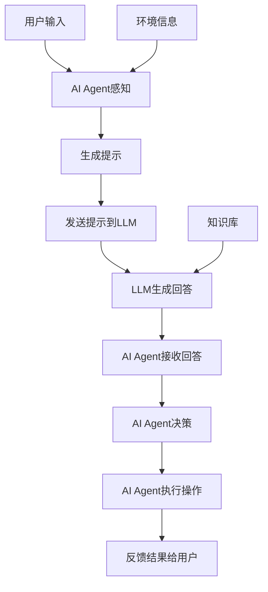

# LLM驱动的AI Agent创新产品设计

> 关键词：LLM（大语言模型）、AI Agent、创新产品设计、自然语言交互、智能决策

> 摘要：本文围绕LLM驱动的AI Agent创新产品设计展开深入探讨。首先介绍了相关背景，包括目的、预期读者、文档结构和术语表。接着阐述了核心概念与联系，通过文本示意图和Mermaid流程图清晰展示原理和架构。详细讲解了核心算法原理及具体操作步骤，用Python代码进行说明。分析了相关数学模型和公式，并举例说明。通过项目实战展示代码实现和解读。探讨了实际应用场景，推荐了学习资源、开发工具框架和相关论文著作。最后总结了未来发展趋势与挑战，提供常见问题解答和扩展阅读参考资料，旨在为开发者和产品设计者提供全面的指导，推动LLM驱动的AI Agent创新产品的发展。

## 1. 背景介绍 
### 1.1 目的和范围
本文章的主要目的是深入探讨如何利用大语言模型（LLM）驱动AI Agent进行创新产品设计。随着LLM技术的不断发展，如GPT系列、BLOOM等模型的出现，其在自然语言处理方面展现出了强大的能力。AI Agent作为一种能够自主感知环境、做出决策并执行操作的智能实体，结合LLM的优势，可以创造出更智能、更人性化的产品。本文将涵盖从核心概念、算法原理、数学模型到项目实战、实际应用场景等多个方面，为读者提供全面的知识体系和实践指导。

### 1.2 预期读者
本文预期读者包括但不限于软件开发人员、人工智能研究者、产品经理、创业者等。对于软件开发人员，可从中学习如何将LLM与AI Agent结合进行代码实现；人工智能研究者能获取最新的技术趋势和研究思路；产品经理可以了解如何设计基于LLM驱动的AI Agent创新产品；创业者则能找到有潜力的商业机会和产品方向。

### 1.3 文档结构概述
本文共分为十个部分。第一部分为背景介绍，包括目的、预期读者、文档结构概述和术语表；第二部分阐述核心概念与联系，通过文本示意图和Mermaid流程图展示原理和架构；第三部分详细讲解核心算法原理及具体操作步骤，并用Python代码进行说明；第四部分分析相关数学模型和公式，并举例说明；第五部分通过项目实战展示代码实现和解读；第六部分探讨实际应用场景；第七部分推荐学习资源、开发工具框架和相关论文著作；第八部分总结未来发展趋势与挑战；第九部分为附录，提供常见问题解答；第十部分列出扩展阅读和参考资料。

### 1.4 术语表
#### 1.4.1 核心术语定义
- **大语言模型（LLM）**：是一种基于深度学习的自然语言处理模型，通过在大规模文本数据上进行训练，学习语言的模式和规律，能够生成自然流畅的文本回答、进行知识问答等。例如GPT - 3、ChatGPT等。
- **AI Agent**：人工智能代理，是一个能够感知环境、根据感知信息做出决策并执行相应操作的智能实体。它可以与用户、其他系统或环境进行交互，完成各种任务。
- **自然语言交互**：指用户与计算机系统之间使用自然语言（如英语、汉语等）进行信息交流和沟通的方式。

#### 1.4.2 相关概念解释
- **Prompt Engineering**：提示工程，是指通过设计合适的输入提示来引导LLM生成更符合预期的输出。在使用LLM时，合理的提示可以显著提高模型的性能和回答质量。
- **Agent Architecture**：代理架构，是指AI Agent的内部结构和组成部分，包括感知模块、决策模块、执行模块等，用于实现Agent的各种功能。

#### 1.4.3 缩略词列表
- **LLM**：Large Language Model（大语言模型）
- **API**：Application Programming Interface（应用程序编程接口）

## 2. 核心概念与联系 

### 核心概念原理
LLM驱动的AI Agent创新产品设计的核心在于将大语言模型的强大语言理解和生成能力与AI Agent的自主决策和执行能力相结合。大语言模型可以作为AI Agent的“大脑”，为其提供知识和语言处理能力。当AI Agent接收到用户的输入或环境信息时，将其转化为合适的提示输入到LLM中，LLM根据提示生成相应的回答或建议，AI Agent再根据这些结果做出决策并执行相应的操作。

例如，在一个智能客服产品中，用户提出问题后，AI Agent将问题作为提示发送给LLM，LLM生成回答，AI Agent将回答反馈给用户。如果问题比较复杂，AI Agent还可以根据LLM的建议进一步询问用户信息，以更好地解决问题。

### 架构的文本示意图
```plaintext
用户 <-> AI Agent <-> LLM
|                   |
|                   |
环境信息           知识库
```
在这个架构中，用户与AI Agent进行交互，AI Agent接收用户的输入和环境信息，并将其转化为提示发送给LLM。LLM根据提示和自身的知识库生成回答，AI Agent再将回答反馈给用户。同时，AI Agent还可以根据需要从知识库中获取额外的信息。

### Mermaid流程图

这个流程图展示了LLM驱动的AI Agent的工作流程。用户输入信息后，AI Agent感知到输入并结合环境信息生成提示，将提示发送给LLM。LLM根据提示和知识库生成回答，AI Agent接收回答后进行决策并执行操作，最后将结果反馈给用户。

## 3. 核心算法原理 & 具体操作步骤 

### 核心算法原理
LLM驱动的AI Agent主要涉及到自然语言处理算法和决策算法。自然语言处理算法主要用于对用户输入的文本进行处理和理解，以及将LLM生成的文本进行解析和转换。决策算法则用于根据LLM的回答和环境信息做出决策。

#### 自然语言处理算法
常见的自然语言处理算法包括分词、词性标注、命名实体识别、情感分析等。在与LLM交互时，需要对用户输入进行预处理，如去除停用词、进行词法分析等，以提高输入提示的质量。同时，对LLM生成的回答也需要进行后处理，如提取关键信息、进行语义理解等。

#### 决策算法
决策算法可以采用规则引擎、机器学习算法或强化学习算法等。规则引擎根据预先定义的规则进行决策，适用于一些简单的场景。机器学习算法通过对历史数据进行训练，学习输入和输出之间的映射关系，从而进行决策。强化学习算法则通过与环境进行交互，不断优化决策策略，以获得最大的奖励。

### 具体操作步骤

#### 步骤1：初始化
首先，需要初始化AI Agent和LLM。AI Agent需要设置感知模块、决策模块和执行模块等，LLM需要加载相应的模型和参数。

```python
import openai

# 初始化LLM，这里以OpenAI的GPT为例
openai.api_key = "your_api_key"

# 初始化AI Agent
class AIAgent:
    def __init__(self):
        self.perception_module = None
        self.decision_module = None
        self.execution_module = None

agent = AIAgent()
```

#### 步骤2：用户输入处理
当用户输入信息后，AI Agent的感知模块对输入进行处理，生成合适的提示。

```python
def process_user_input(user_input):
    # 简单的预处理，去除多余空格
    processed_input = user_input.strip()
    # 生成提示
    prompt = f"用户问题: {processed_input}"
    return prompt

user_input = "今天天气怎么样？"
prompt = process_user_input(user_input)
```

#### 步骤3：与LLM交互
将生成的提示发送给LLM，获取回答。

```python
def get_llm_response(prompt):
    response = openai.Completion.create(
        engine="text-davinci-003",
        prompt=prompt,
        max_tokens=100
    )
    answer = response.choices[0].text.strip()
    return answer

answer = get_llm_response(prompt)
```

#### 步骤4：决策和执行
AI Agent的决策模块根据LLM的回答做出决策，执行模块执行相应的操作。

```python
def make_decision(answer):
    # 简单的决策逻辑，这里假设直接反馈回答
    decision = answer
    return decision

def execute_action(decision):
    print(f"AI Agent反馈: {decision}")

decision = make_decision(answer)
execute_action(decision)
```

## 4. 数学模型和公式 & 详细讲解 & 举例说明 

### 自然语言处理中的数学模型
#### 词向量模型
词向量模型将词语表示为低维向量，以便计算机进行处理。常见的词向量模型有Word2Vec和GloVe。

Word2Vec的核心思想是通过神经网络学习词语的上下文信息，从而得到词语的向量表示。其目标函数可以表示为：

$$\max \sum_{t=1}^{T} \sum_{-c \leq j \leq c, j \neq 0} \log p(w_{t+j} | w_t)$$

其中，$T$ 是文本的长度，$c$ 是上下文窗口的大小，$w_t$ 是第 $t$ 个词语，$p(w_{t+j} | w_t)$ 是在 $w_t$ 的上下文中出现 $w_{t+j}$ 的概率。

例如，在一个包含 “我 喜欢 苹果” 的文本中，当 $c = 1$ 时，对于词语 “喜欢”，其上下文词语为 “我” 和 “苹果”。通过Word2Vec模型，可以学习到 “我”、“喜欢” 和 “苹果” 的向量表示。

#### 语言模型
语言模型用于计算一个句子的概率。常见的语言模型有n - gram模型和基于神经网络的语言模型。

n - gram模型假设一个词语的出现只与前 $n - 1$ 个词语有关。其计算公式为：

$$P(w_1, w_2, \cdots, w_m) = \prod_{i=1}^{m} P(w_i | w_{i - n + 1}, \cdots, w_{i - 1})$$

其中，$w_1, w_2, \cdots, w_m$ 是一个句子中的词语，$P(w_i | w_{i - n + 1}, \cdots, w_{i - 1})$ 是在 $w_{i - n + 1}, \cdots, w_{i - 1}$ 的条件下出现 $w_i$ 的概率。

例如，对于一个2 - gram模型，句子 “我 喜欢 苹果” 的概率可以表示为：

$$P(我, 喜欢, 苹果) = P(我) \times P(喜欢 | 我) \times P(苹果 | 喜欢)$$

### 决策算法中的数学模型
#### 规则引擎
规则引擎的决策逻辑可以用规则表达式来表示。例如，一个简单的规则可以表示为：

如果 问题类型 == “天气查询” 且 LLM回答包含 “晴天” 则 决策 = “建议出门时携带太阳镜”

#### 机器学习算法
以逻辑回归算法为例，其决策函数可以表示为：

$$P(y = 1 | x) = \frac{1}{1 + e^{-(w^T x + b)}}$$

其中，$x$ 是输入特征向量，$w$ 是权重向量，$b$ 是偏置项，$P(y = 1 | x)$ 是在输入 $x$ 的条件下类别为1的概率。

例如，在一个情感分析任务中，输入特征可以是文本的词向量，输出类别为积极或消极。通过训练逻辑回归模型，可以得到权重向量 $w$ 和偏置项 $b$，从而根据输入文本的特征向量 $x$ 计算其属于积极类别的概率。

#### 强化学习算法
强化学习算法的目标是通过与环境进行交互，学习到一个最优的策略 $\pi$，使得累计奖励最大化。其核心公式是贝尔曼方程：

$$V^{\pi}(s) = \sum_{a \in A} \pi(a | s) \sum_{s', r} p(s', r | s, a) [r + \gamma V^{\pi}(s')]$$

其中，$V^{\pi}(s)$ 是在策略 $\pi$ 下状态 $s$ 的价值，$A$ 是动作集合，$\pi(a | s)$ 是在状态 $s$ 下采取动作 $a$ 的概率，$p(s', r | s, a)$ 是在状态 $s$ 下采取动作 $a$ 转移到状态 $s'$ 并获得奖励 $r$ 的概率，$\gamma$ 是折扣因子。

例如，在一个游戏AI中，AI Agent需要在不同的游戏状态下选择最优的动作，以获得最高的分数。通过强化学习算法，AI Agent可以不断优化自己的策略，提高游戏表现。

## 5. 项目实战：代码实际案例和详细解释说明 

### 5.1  开发环境搭建
#### 操作系统
建议使用Linux或macOS系统，因为它们对Python开发环境的支持较好。如果使用Windows系统，也可以通过安装WSL（Windows Subsystem for Linux）来模拟Linux环境。

#### Python版本
建议使用Python 3.7及以上版本。可以从Python官方网站（https://www.python.org/downloads/）下载并安装。

#### 依赖库安装
在项目中，需要安装一些Python依赖库，如`openai`、`numpy`、`pandas`等。可以使用`pip`来安装这些库：

```bash
pip install openai numpy pandas
```

### 5.2  源代码详细实现和代码解读

#### 项目需求
实现一个简单的智能问答机器人，用户输入问题，机器人通过LLM获取回答并反馈给用户。

#### 源代码实现
```python
import openai

# 设置OpenAI API密钥
openai.api_key = "your_api_key"

class AIAgent:
    def __init__(self):
        pass

    def process_user_input(self, user_input):
        # 简单的预处理，去除多余空格
        processed_input = user_input.strip()
        # 生成提示
        prompt = f"用户问题: {processed_input}"
        return prompt

    def get_llm_response(self, prompt):
        try:
            response = openai.Completion.create(
                engine="text-davinci-003",
                prompt=prompt,
                max_tokens=100
            )
            answer = response.choices[0].text.strip()
            return answer
        except Exception as e:
            print(f"与LLM交互出错: {e}")
            return "抱歉，暂时无法回答您的问题。"

    def make_decision(self, answer):
        # 简单的决策逻辑，这里假设直接反馈回答
        decision = answer
        return decision

    def execute_action(self, decision):
        print(f"AI Agent反馈: {decision}")

    def run(self):
        while True:
            user_input = input("请输入您的问题（输入 '退出' 结束对话）: ")
            if user_input == "退出":
                break
            prompt = self.process_user_input(user_input)
            answer = self.get_llm_response(prompt)
            decision = self.make_decision(answer)
            self.execute_action(decision)

if __name__ == "__main__":
    agent = AIAgent()
    agent.run()
```

#### 代码解读
- **`__init__` 方法**：初始化AI Agent，这里暂时没有需要初始化的内容。
- **`process_user_input` 方法**：对用户输入进行预处理，去除多余空格，并生成合适的提示。
- **`get_llm_response` 方法**：将提示发送给LLM，获取回答。使用`openai.Completion.create`方法与OpenAI的GPT模型进行交互。如果出现异常，捕获并输出错误信息，同时返回一个默认的回答。
- **`make_decision` 方法**：简单的决策逻辑，直接将LLM的回答作为决策结果。
- **`execute_action` 方法**：将决策结果反馈给用户，这里通过打印输出。
- **`run` 方法**：循环接收用户输入，直到用户输入 “退出” 结束对话。在每次循环中，依次调用`process_user_input`、`get_llm_response`、`make_decision`和`execute_action`方法。

### 5.3  代码解读与分析
#### 优点
- **简单易懂**：代码结构清晰，逻辑简单，易于理解和维护。
- **可扩展性**：可以方便地扩展功能，如添加更复杂的预处理、决策逻辑和执行操作。
- **与LLM集成**：通过调用OpenAI的API，方便地与强大的LLM进行交互。

#### 缺点
- **决策逻辑简单**：当前的决策逻辑只是简单地返回LLM的回答，没有考虑更多的因素，如用户的历史记录、上下文信息等。
- **错误处理不够完善**：虽然对与LLM交互时的异常进行了简单处理，但对于其他可能的错误，如网络问题、输入格式错误等，没有进行全面的处理。
- **缺乏知识管理**：没有对LLM的回答进行有效的知识管理，无法利用历史回答进行学习和优化。

## 6. 实际应用场景 
### 智能客服
在智能客服领域，LLM驱动的AI Agent可以快速准确地回答用户的问题。用户通过自然语言提出问题，AI Agent将问题作为提示发送给LLM，LLM生成回答后，AI Agent进行处理和决策，将最合适的回答反馈给用户。例如，在电商平台的客服系统中，用户询问商品的尺码、颜色、库存等问题，AI Agent可以及时给出准确的回答，提高用户满意度和服务效率。

### 智能助手
智能助手可以帮助用户完成各种任务，如日程安排、信息查询、文件处理等。用户可以通过语音或文本与智能助手进行交互，AI Agent根据用户的需求调用相应的功能。例如，用户说 “明天上午9点帮我预约一个会议室”，AI Agent将该请求作为提示发送给LLM，LLM分析请求并生成相应的操作步骤，AI Agent根据步骤调用会议室预约系统完成预约。

### 教育领域
在教育领域，LLM驱动的AI Agent可以作为智能辅导工具，帮助学生解答问题、提供学习建议。学生可以提出课程相关的问题，AI Agent通过LLM获取准确的回答，并根据学生的学习情况提供个性化的学习计划。例如，在数学课程中，学生遇到难题时，AI Agent可以详细地解答问题，并提供类似题目的练习和讲解。

### 金融领域
在金融领域，AI Agent可以用于风险评估、投资建议等。通过分析大量的金融数据和市场信息，结合LLM的知识和推理能力，AI Agent可以为投资者提供合理的投资建议。例如，当投资者询问某只股票的投资价值时，AI Agent可以分析该股票的财务报表、市场趋势等信息，并结合LLM的分析结果给出投资建议。

## 7. 工具和资源推荐
### 7.1 学习资源推荐
#### 7.1.1 书籍推荐
- 《Python自然语言处理》：本书介绍了使用Python进行自然语言处理的基本方法和技术，包括分词、词性标注、命名实体识别等，对于理解和实现LLM驱动的AI Agent中的自然语言处理部分非常有帮助。
- 《人工智能：一种现代的方法》：这是一本经典的人工智能教材，涵盖了人工智能的各个方面，包括搜索算法、机器学习、自然语言处理等，对于全面了解AI Agent的原理和技术有很大的帮助。
- 《深度学习》：由Ian Goodfellow、Yoshua Bengio和Aaron Courville合著，详细介绍了深度学习的基本原理、算法和应用，对于理解LLM的工作原理和实现有重要的参考价值。

#### 7.1.2 在线课程
- Coursera上的“自然语言处理专项课程”：由斯坦福大学的教授授课，内容涵盖了自然语言处理的各个方面，包括词向量、语言模型、文本分类等。
- edX上的“人工智能基础”：该课程介绍了人工智能的基本概念、算法和应用，适合初学者入门。
- 吴恩达的“深度学习专项课程”：在Coursera上提供，深入讲解了深度学习的原理和应用，对于掌握LLM和AI Agent的相关技术非常有帮助。

#### 7.1.3 技术博客和网站
- Medium：上面有很多关于人工智能、自然语言处理和LLM的技术文章，作者来自世界各地的专业人士和研究者。
- Towards Data Science：专注于数据科学和人工智能领域的技术博客，提供了很多实用的教程和案例。
- OpenAI官方博客：可以获取关于OpenAI的最新研究成果和技术动态，对于了解LLM的发展非常有帮助。

### 7.2 开发工具框架推荐
#### 7.2.1 IDE和编辑器
- PyCharm：一款专业的Python集成开发环境，提供了代码编辑、调试、版本控制等功能，非常适合Python开发。
- Visual Studio Code：一款轻量级的代码编辑器，支持多种编程语言，通过安装Python扩展可以实现Python开发的高效编程。
- Jupyter Notebook：一种交互式的开发环境，适合进行数据分析、模型训练和代码演示。

#### 7.2.2 调试和性能分析工具
- PDB：Python自带的调试器，可以帮助开发者在代码中设置断点、查看变量值等，进行代码调试。
- cProfile：Python的性能分析工具，可以分析代码的运行时间和函数调用次数，帮助开发者找出性能瓶颈。
- TensorBoard：用于可视化深度学习模型的训练过程和性能指标，对于优化LLM和AI Agent的性能非常有帮助。

#### 7.2.3 相关框架和库
- OpenAI API：提供了与OpenAI的LLM进行交互的接口，方便开发者使用强大的语言模型。
- Hugging Face Transformers：一个开源的自然语言处理库，包含了多种预训练的LLM模型，如GPT - 2、BERT等，并且提供了简单易用的API。
- LangChain：一个用于构建LLM驱动的应用程序的框架，提供了一系列工具和组件，帮助开发者快速实现AI Agent的功能。

### 7.3 相关论文著作推荐
#### 7.3.1 经典论文
- “Attention Is All You Need”：提出了Transformer架构，是现代LLM的基础，对自然语言处理领域产生了深远的影响。
- “BERT: Pre-training of Deep Bidirectional Transformers for Language Understanding”：介绍了BERT模型，通过预训练和微调的方式在多个自然语言处理任务上取得了优异的成绩。
- “Generative Pretrained Transformer 3 (GPT - 3): Language Models Are Few - Shot Learners”：详细介绍了GPT - 3模型的架构和性能，展示了其在少样本学习方面的强大能力。

#### 7.3.2 最新研究成果
- 关注顶级学术会议如ACL（Association for Computational Linguistics）、NeurIPS（Conference on Neural Information Processing Systems）等的最新论文，了解LLM和AI Agent领域的最新研究进展。
- 一些知名研究机构如OpenAI、Google Brain、Meta AI的官方网站也会发布最新的研究成果。

#### 7.3.3 应用案例分析
- 可以在ACM Digital Library、IEEE Xplore等学术数据库中搜索关于LLM驱动的AI Agent在不同领域的应用案例分析，学习实际应用中的经验和方法。

## 8. 总结：未来发展趋势与挑战
### 未来发展趋势
#### 更强大的语言理解和生成能力
随着LLM技术的不断发展，未来的模型将具有更强大的语言理解和生成能力，能够更好地处理复杂的自然语言任务，如文本推理、知识问答等。这将使得AI Agent能够更准确地理解用户的意图，提供更优质的服务。

#### 多模态融合
未来的AI Agent将不仅仅局限于处理文本信息，还将融合图像、语音、视频等多种模态的信息。例如，用户可以通过语音和手势与AI Agent进行交互，AI Agent可以根据多种模态的信息做出更准确的决策。

#### 个性化服务
AI Agent将能够根据用户的历史记录、偏好和行为模式提供个性化的服务。例如，在智能客服中，AI Agent可以根据用户的购买历史和偏好推荐合适的产品；在智能助手中，AI Agent可以根据用户的日程安排和习惯提供个性化的提醒和建议。

#### 自主学习和进化
未来的AI Agent将具有更强的自主学习和进化能力，能够在与环境的交互中不断学习和优化自己的策略。例如，通过强化学习算法，AI Agent可以在游戏、机器人控制等领域不断提高自己的性能。

### 挑战
#### 数据隐私和安全
LLM需要大量的数据进行训练，这些数据可能包含用户的敏感信息。因此，如何保护数据的隐私和安全是一个重要的挑战。同时，AI Agent在与用户交互过程中也需要处理大量的敏感信息，如个人身份信息、财务信息等，需要采取有效的措施来保障信息安全。

#### 模型可解释性
LLM通常是一个黑盒模型，其决策过程难以解释。在一些关键领域，如医疗、金融等，模型的可解释性非常重要。因此，如何提高LLM和AI Agent的可解释性是一个亟待解决的问题。

#### 计算资源需求
训练和运行大型的LLM需要大量的计算资源，如GPU、TPU等。这不仅增加了开发和使用的成本，还对能源消耗和环境造成了压力。因此，如何降低计算资源需求，提高模型的效率是一个重要的挑战。

#### 伦理和道德问题
随着AI Agent的广泛应用，一些伦理和道德问题也逐渐浮现。例如，AI Agent可能会产生偏见、歧视等问题，对社会造成不良影响。因此，需要建立相应的伦理和道德准则，规范AI Agent的开发和使用。

## 9. 附录：常见问题与解答
### 问题1：如何选择合适的LLM模型？
解答：选择合适的LLM模型需要考虑多个因素，如任务需求、计算资源、数据隐私等。如果是简单的文本生成任务，可以选择一些开源的轻量级模型，如GPT - 2；如果需要更高的性能和更准确的回答，可以选择商业模型，如OpenAI的GPT - 3、GPT - 4等。同时，还需要考虑模型的训练数据和适用领域，选择与任务相关的模型。

### 问题2：如何提高AI Agent的决策能力？
解答：可以从以下几个方面提高AI Agent的决策能力：
- **优化提示工程**：设计更合理的提示，引导LLM生成更准确的回答。
- **引入知识图谱**：将知识图谱与LLM相结合，为AI Agent提供更丰富的知识支持。
- **采用机器学习和强化学习算法**：通过训练模型，学习更复杂的决策策略。
- **考虑上下文信息**：在决策过程中，考虑用户的历史记录、上下文信息等，提高决策的准确性。

### 问题3：如何处理LLM生成的错误回答？
解答：可以采取以下措施处理LLM生成的错误回答：
- **人工审核**：对重要的回答进行人工审核，及时纠正错误。
- **引入规则引擎**：在AI Agent中引入规则引擎，对LLM的回答进行过滤和修正。
- **反馈机制**：建立反馈机制，让用户对回答进行评价和反馈，根据反馈信息对模型进行优化。
- **多模型融合**：结合多个LLM模型的回答，综合判断以提高回答的准确性。

### 问题4：如何保障AI Agent的安全性？
解答：保障AI Agent的安全性可以从以下几个方面入手：
- **数据加密**：对用户输入和LLM生成的信息进行加密处理，防止数据泄露。
- **访问控制**：设置严格的访问权限，限制对AI Agent和相关数据的访问。
- **安全审计**：对AI Agent的运行过程进行安全审计，及时发现和处理安全问题。
- **模型加固**：采用对抗训练等技术，提高模型的抗攻击能力。

## 10. 扩展阅读 & 参考资料
### 扩展阅读
- 《AI 3.0》：探讨了人工智能的发展现状和未来趋势，对于理解LLM和AI Agent在人工智能领域的地位和作用有很大的帮助。
- 《人类的明天》：分析了人工智能对社会、经济和人类生活的影响，引发读者对人工智能发展的深入思考。

### 参考资料
- OpenAI官方文档：https://platform.openai.com/docs/
- Hugging Face官方文档：https://huggingface.co/docs/
- LangChain官方文档：https://langchain.readthedocs.io/en/latest/

作者：AI天才研究院/AI Genius Institute & 禅与计算机程序设计艺术 /Zen And The Art of Computer Programming