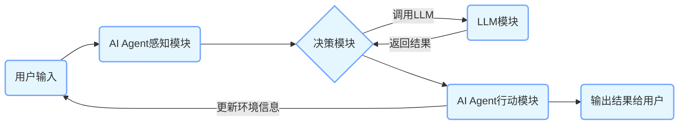

# LLM驱动的AI Agent创造性问题解决框架

> 关键词：LLM（大语言模型）、AI Agent、创造性问题解决、框架设计、智能交互

> 摘要：本文围绕LLM驱动的AI Agent创造性问题解决框架展开深入探讨。首先介绍了该框架提出的背景、适用范围、预期读者以及文档结构等内容。接着阐述了核心概念，包括LLM、AI Agent等及其相互联系，并给出了相应的文本示意图和Mermaid流程图。详细讲解了核心算法原理，使用Python代码进行说明，同时分析了相关的数学模型和公式。通过项目实战，介绍了开发环境搭建、源代码实现及解读。还探讨了该框架的实际应用场景，推荐了学习资源、开发工具框架和相关论文著作。最后总结了未来发展趋势与挑战，并提供了常见问题解答和扩展阅读参考资料，旨在为读者全面呈现这一前沿技术框架。

## 1. 背景介绍 
### 1.1 目的和范围
随着人工智能技术的飞速发展，大语言模型（LLM）如GPT - 3、ChatGPT等展现出了强大的语言理解和生成能力。然而，单纯的大语言模型在实际问题解决中存在一定的局限性，例如缺乏自主决策和执行能力。AI Agent作为一种能够感知环境、做出决策并采取行动的智能实体，可以与LLM相结合，构建一个更强大的创造性问题解决框架。

本框架的目的在于利用LLM的语言能力和AI Agent的自主决策能力，实现对各种复杂问题的创造性解决。其范围涵盖了多个领域，如智能客服、自动化办公、科学研究等，旨在为不同领域的问题解决提供通用的解决方案。

### 1.2 预期读者
本文的预期读者包括人工智能领域的研究人员、开发者、软件架构师以及对AI技术应用感兴趣的专业人士。对于希望深入了解LLM和AI Agent结合应用，以及如何构建创造性问题解决框架的读者具有较高的参考价值。

### 1.3 文档结构概述
本文将按照以下结构进行阐述：首先介绍相关的核心概念及其联系，包括LLM和AI Agent的原理和架构；接着详细讲解核心算法原理和具体操作步骤，并用Python代码进行说明；然后分析数学模型和公式，并举例说明；通过项目实战，展示该框架的实际应用，包括开发环境搭建、源代码实现和代码解读；探讨该框架的实际应用场景；推荐相关的学习资源、开发工具框架和论文著作；最后总结未来发展趋势与挑战，提供常见问题解答和扩展阅读参考资料。

### 1.4 术语表
#### 1.4.1 核心术语定义
- **LLM（大语言模型）**：是一种基于深度学习的语言模型，通过在大规模文本数据上进行训练，能够学习到语言的模式和规律，从而实现自然语言的理解和生成。
- **AI Agent（人工智能智能体）**：是一个能够感知环境、根据感知信息做出决策，并采取相应行动的智能实体。它可以是软件程序、机器人等不同形式。
- **创造性问题解决**：指的是在面对复杂、新颖的问题时，能够提出独特、有效的解决方案的过程。

#### 1.4.2 相关概念解释
- **语言理解**：LLM通过对输入文本的分析和处理，理解其语义和上下文信息的能力。
- **自主决策**：AI Agent根据感知到的环境信息和自身的目标，独立做出决策的能力。
- **行动执行**：AI Agent根据决策结果采取具体行动的过程。

#### 1.4.3 缩略词列表
- **LLM**：Large Language Model
- **AI**：Artificial Intelligence

## 2. 核心概念与联系 

### 核心概念原理
#### LLM原理
大语言模型通常基于Transformer架构，它由多个编码器和解码器层组成。编码器负责对输入文本进行特征提取和编码，解码器则根据编码信息生成输出文本。训练过程中，模型通过大量的文本数据进行无监督学习，学习到语言的统计规律和语义信息。

例如，GPT系列模型是基于Transformer的解码器架构，通过自回归的方式生成文本。它在大规模的互联网文本数据上进行预训练，然后可以通过微调的方式应用于不同的任务。

#### AI Agent原理
AI Agent由感知模块、决策模块和行动模块组成。感知模块负责收集环境信息，如用户输入、传感器数据等；决策模块根据感知信息和自身的目标，使用某种决策算法做出决策；行动模块根据决策结果执行相应的行动，如回复用户、控制机器人运动等。

### 架构的文本示意图
```
+-------------------+       +-------------------+       +-------------------+
|      LLM模块      |       |     AI Agent模块    |       |     环境模块      |
+-------------------+       +-------------------+       +-------------------+
| - 语言理解         |       | - 感知模块         |       | - 用户输入         |
| - 语言生成         |       | - 决策模块         |       | - 外部数据         |
|                   |       | - 行动模块         |       |                   |
+-------------------+       +-------------------+       +-------------------+
          |                         |                         |
          | 提供语言能力             | 与环境交互              | 提供信息和反馈
          |                         |                         |
          +-------------------------+-------------------------+
                          相互协作解决问题
```

### Mermaid流程图


这个流程图展示了LLM驱动的AI Agent创造性问题解决框架的基本工作流程。用户输入信息被AI Agent的感知模块接收，决策模块根据感知信息决定是否调用LLM获取语言相关的支持，LLM返回结果后，决策模块做出最终决策，由行动模块执行并输出结果给用户，同时行动模块可以更新环境信息，形成一个闭环。

## 3. 核心算法原理 & 具体操作步骤 

### 核心算法原理
本框架的核心算法主要涉及到AI Agent的决策算法和LLM的调用算法。

#### AI Agent决策算法
我们可以使用基于规则的决策算法，也可以使用更复杂的强化学习算法。这里以基于规则的决策算法为例进行说明。假设我们有一个简单的规则集合，根据用户输入的问题类型，决定是否调用LLM进行回答。

```python
# 规则集合
rules = {
    "general_question": "call_llm",
    "specific_task": "execute_task"
}

def decision_making(user_input):
    # 简单的问题类型判断
    if "?" in user_input:
        question_type = "general_question"
    else:
        question_type = "specific_task"
    
    action = rules.get(question_type)
    return action

```

#### LLM调用算法
在Python中，我们可以使用开源的库如`transformers`来调用预训练的LLM。以下是一个简单的示例：

```python
from transformers import AutoTokenizer, AutoModelForCausalLM

# 加载预训练的模型和分词器
tokenizer = AutoTokenizer.from_pretrained("gpt2")
model = AutoModelForCausalLM.from_pretrained("gpt2")

def call_llm(prompt):
    # 对输入进行分词
    input_ids = tokenizer.encode(prompt, return_tensors='pt')
    
    # 生成文本
    output = model.generate(input_ids, max_length=100, num_beams=5, no_repeat_ngram_size=2, early_stopping=True)
    
    # 解码生成的文本
    response = tokenizer.decode(output[0], skip_special_tokens=True)
    return response

```

### 具体操作步骤
1. **接收用户输入**：AI Agent的感知模块接收用户输入的信息。
2. **决策**：使用决策算法判断是否需要调用LLM。
3. **调用LLM（如果需要）**：根据决策结果，调用LLM获取语言相关的支持。
4. **执行行动**：AI Agent的行动模块根据决策结果执行相应的行动，如回复用户、执行具体任务等。
5. **更新环境信息**：行动模块将执行结果反馈给环境，更新环境信息。

以下是一个完整的示例代码：

```python
# 规则集合
rules = {
    "general_question": "call_llm",
    "specific_task": "execute_task"
}

from transformers import AutoTokenizer, AutoModelForCausalLM

# 加载预训练的模型和分词器
tokenizer = AutoTokenizer.from_pretrained("gpt2")
model = AutoModelForCausalLM.from_pretrained("gpt2")

def decision_making(user_input):
    # 简单的问题类型判断
    if "?" in user_input:
        question_type = "general_question"
    else:
        question_type = "specific_task"
    
    action = rules.get(question_type)
    return action

def call_llm(prompt):
    # 对输入进行分词
    input_ids = tokenizer.encode(prompt, return_tensors='pt')
    
    # 生成文本
    output = model.generate(input_ids, max_length=100, num_beams=5, no_repeat_ngram_size=2, early_stopping=True)
    
    # 解码生成的文本
    response = tokenizer.decode(output[0], skip_special_tokens=True)
    return response

def execute_task(task):
    return f"Executing task: {task}"

def main():
    user_input = input("Please enter your question or task: ")
    action = decision_making(user_input)
    
    if action == "call_llm":
        response = call_llm(user_input)
    elif action == "execute_task":
        response = execute_task(user_input)
    
    print(response)

if __name__ == "__main__":
    main()

```

## 4. 数学模型和公式 & 详细讲解 & 举例说明 

### 数学模型和公式
#### LLM的语言生成模型
大语言模型的语言生成通常基于概率模型。假设我们有一个输入序列 $x = (x_1, x_2, \cdots, x_n)$ 和一个输出序列 $y = (y_1, y_2, \cdots, y_m)$，LLM的目标是计算条件概率 $P(y|x)$。

在自回归模型中，输出序列是逐个生成的，即：

$$P(y|x) = \prod_{i=1}^{m} P(y_i|y_{<i}, x)$$

其中 $y_{<i} = (y_1, y_2, \cdots, y_{i - 1})$ 表示前 $i - 1$ 个输出词。

#### AI Agent的决策模型
对于基于规则的决策模型，我们可以用一个映射函数 $f$ 来表示规则集合。假设问题类型集合为 $Q$，行动集合为 $A$，则 $f: Q \to A$。

例如，在我们的示例中，$Q = \{"general\_question", "specific\_task"\}$，$A = \{"call\_llm", "execute\_task"\}$，规则函数 $f$ 定义为：

$$
f(q) = 
\begin{cases}
"call\_llm", & \text{if } q = "general\_question" \\
"execute\_task", & \text{if } q = "specific\_task"
\end{cases}
$$

### 详细讲解
#### LLM的语言生成模型
LLM通过在大规模文本数据上进行训练，学习到语言的统计规律，从而能够计算条件概率 $P(y_i|y_{<i}, x)$。在生成文本时，模型根据当前的输入和已经生成的部分输出，选择概率最大的词作为下一个输出词，直到达到预设的最大长度或满足停止条件。

#### AI Agent的决策模型
基于规则的决策模型通过预先定义的规则来决定AI Agent的行动。当接收到用户输入时，首先判断问题类型，然后根据规则函数 $f$ 选择相应的行动。这种决策模型简单直观，但缺乏灵活性，对于复杂的问题可能无法做出最优决策。

### 举例说明
#### LLM语言生成示例
假设输入序列 $x$ 为 "What is the capital of France?"，LLM的目标是计算输出序列 $y$ 的条件概率 $P(y|x)$。在生成过程中，模型首先根据输入序列和已经生成的部分输出，计算每个可能的下一个词的概率，然后选择概率最大的词作为下一个输出。例如，可能的输出序列 $y$ 为 "The capital of France is Paris."。

#### AI Agent决策示例
假设用户输入为 "What is the meaning of life?"，根据我们的决策算法，判断问题类型为 "general_question"，则规则函数 $f$ 选择行动 "call_llm"，AI Agent将调用LLM获取回答。如果用户输入为 "Open the door"，判断问题类型为 "specific_task"，则规则函数 $f$ 选择行动 "execute_task"，AI Agent将执行开门任务（在实际应用中，需要根据具体的任务进行实现）。

## 5. 项目实战：代码实际案例和详细解释说明 

### 5.1  开发环境搭建
#### 操作系统
可以选择Windows、Linux或macOS操作系统。这里以Ubuntu 20.04为例进行说明。

#### Python环境
安装Python 3.7或更高版本。可以使用以下命令安装：

```bash
sudo apt update
sudo apt install python3 python3-pip
```

#### 依赖库安装
安装`transformers`库和其他必要的依赖库：

```bash
pip install transformers torch
```

### 5.2  源代码详细实现和代码解读
以下是一个完整的项目代码示例：

```python
# 规则集合
rules = {
    "general_question": "call_llm",
    "specific_task": "execute_task"
}

from transformers import AutoTokenizer, AutoModelForCausalLM

# 加载预训练的模型和分词器
tokenizer = AutoTokenizer.from_pretrained("gpt2")
model = AutoModelForCausalLM.from_pretrained("gpt2")

def decision_making(user_input):
    # 简单的问题类型判断
    if "?" in user_input:
        question_type = "general_question"
    else:
        question_type = "specific_task"
    
    action = rules.get(question_type)
    return action

def call_llm(prompt):
    # 对输入进行分词
    input_ids = tokenizer.encode(prompt, return_tensors='pt')
    
    # 生成文本
    output = model.generate(input_ids, max_length=100, num_beams=5, no_repeat_ngram_size=2, early_stopping=True)
    
    # 解码生成的文本
    response = tokenizer.decode(output[0], skip_special_tokens=True)
    return response

def execute_task(task):
    return f"Executing task: {task}"

def main():
    while True:
        user_input = input("Please enter your question or task (type 'exit' to quit): ")
        if user_input.lower() == 'exit':
            break
        
        action = decision_making(user_input)
        
        if action == "call_llm":
            response = call_llm(user_input)
        elif action == "execute_task":
            response = execute_task(user_input)
        
        print(response)

if __name__ == "__main__":
    main()

```

#### 代码解读
1. **规则集合**：`rules` 字典定义了问题类型和相应的行动之间的映射关系。
2. **模型加载**：使用`transformers`库加载预训练的GPT - 2模型和分词器。
3. **决策算法**：`decision_making` 函数根据用户输入中是否包含问号来判断问题类型，并根据规则集合选择相应的行动。
4. **LLM调用**：`call_llm` 函数将用户输入进行分词，然后调用模型生成文本，最后解码生成的文本并返回。
5. **任务执行**：`execute_task` 函数简单地返回一个执行任务的提示信息。
6. **主函数**：`main` 函数通过一个循环不断接收用户输入，根据决策结果调用相应的函数，并输出结果。当用户输入 "exit" 时，程序退出。

### 5.3  代码解读与分析
#### 优点
- **简单易懂**：代码结构清晰，逻辑简单，易于理解和实现。
- **可扩展性**：可以通过修改规则集合和添加新的任务执行函数来扩展系统的功能。
- **结合LLM**：利用了LLM的强大语言能力，能够处理一般性的问题。

#### 缺点
- **规则简单**：决策规则过于简单，对于复杂的问题可能无法做出准确的决策。
- **缺乏灵活性**：基于规则的决策模型缺乏灵活性，无法根据环境的变化进行自适应调整。
- **任务执行简单**：`execute_task` 函数只是简单地返回提示信息，实际应用中需要更复杂的任务执行逻辑。

## 6. 实际应用场景 
### 智能客服
在智能客服系统中，LLM驱动的AI Agent可以根据用户的问题类型，自动判断是否需要调用LLM进行回答。对于一般性的问题，如产品信息查询、常见问题解答等，调用LLM生成准确的回答；对于特定的任务，如订单查询、投诉处理等，执行相应的任务流程。这样可以提高客服效率，减少人工客服的工作量。

### 自动化办公
在自动化办公场景中，AI Agent可以接收用户的指令，如生成文档、发送邮件、安排会议等。对于需要语言处理的任务，如文档生成，调用LLM生成高质量的文本；对于其他任务，执行相应的自动化操作。通过这种方式，可以实现办公流程的自动化，提高工作效率。

### 科学研究
在科学研究领域，AI Agent可以帮助研究人员处理大量的文献资料，回答研究问题，甚至协助进行实验设计和数据分析。例如，当研究人员提出一个研究问题时，AI Agent可以调用LLM搜索相关的文献，提取关键信息，并生成总结和分析报告。

### 智能教育
在智能教育系统中，AI Agent可以作为学生的学习助手，回答学生的问题，提供学习建议和辅导。对于一般性的知识问题，调用LLM进行回答；对于特定的学习任务，如作业批改、考试模拟等，执行相应的任务。这样可以为学生提供个性化的学习支持，提高学习效果。

## 7. 工具和资源推荐
### 7.1 学习资源推荐
#### 7.1.1 书籍推荐
- 《深度学习》（Deep Learning）：由Ian Goodfellow、Yoshua Bengio和Aaron Courville所著，是深度学习领域的经典教材，涵盖了神经网络、卷积神经网络、循环神经网络等重要内容。
- 《自然语言处理入门》（Natural Language Processing with Python）：介绍了使用Python进行自然语言处理的基础知识和技术，包括分词、词性标注、命名实体识别等。
- 《人工智能：一种现代的方法》（Artificial Intelligence: A Modern Approach）：全面介绍了人工智能的各个领域，包括搜索算法、知识表示、机器学习、自然语言处理等。

#### 7.1.2 在线课程
- Coursera上的“深度学习专项课程”（Deep Learning Specialization）：由Andrew Ng教授主讲，包括神经网络和深度学习、改善深层神经网络、结构化机器学习项目等多个课程。
- edX上的“自然语言处理”（Natural Language Processing）：介绍了自然语言处理的基本概念、算法和应用，包括语言模型、机器翻译、情感分析等。
- Udemy上的“人工智能实战课程”（Artificial Intelligence A-Z™: Learn How To Build An AI）：通过实际项目案例，介绍了人工智能的各个领域，包括机器学习、深度学习、强化学习等。

#### 7.1.3 技术博客和网站
- Towards Data Science：是一个专注于数据科学和人工智能的技术博客平台，有许多优秀的文章和教程。
- Medium上的AI相关博客：有很多人工智能领域的专家和开发者分享他们的经验和见解。
- arXiv：是一个预印本服务器，提供了大量的人工智能研究论文。

### 7.2 开发工具框架推荐
#### 7.2.1 IDE和编辑器
- PyCharm：是一款专门为Python开发设计的集成开发环境，具有代码编辑、调试、版本控制等功能。
- Visual Studio Code：是一款轻量级的代码编辑器，支持多种编程语言，有丰富的插件扩展功能。
- Jupyter Notebook：是一个交互式的开发环境，适合进行数据分析和模型训练，支持Python、R等多种编程语言。

#### 7.2.2 调试和性能分析工具
- PDB：是Python自带的调试器，可以帮助开发者定位和解决代码中的问题。
- TensorBoard：是TensorFlow的可视化工具，可以用于监控模型训练过程中的各种指标，如损失函数、准确率等。
- cProfile：是Python的性能分析工具，可以分析代码的执行时间和函数调用情况。

#### 7.2.3 相关框架和库
- Transformers：是Hugging Face开发的一个开源库，提供了多种预训练的大语言模型，如GPT - 2、BERT等，方便开发者进行自然语言处理任务。
- PyTorch：是一个开源的深度学习框架，具有动态图计算的特点，适合进行研究和开发。
- OpenAI Gym：是一个用于开发和比较强化学习算法的工具包，提供了多种环境和任务。

### 7.3 相关论文著作推荐
#### 7.3.1 经典论文
- “Attention Is All You Need”：提出了Transformer架构，是大语言模型的基础。
- “BERT: Pre-training of Deep Bidirectional Transformers for Language Understanding”：介绍了BERT模型，开创了预训练 - 微调的自然语言处理范式。
- “Reinforcement Learning: An Introduction”：是强化学习领域的经典教材，介绍了强化学习的基本概念、算法和应用。

#### 7.3.2 最新研究成果
- 关注顶级学术会议如NeurIPS、ICML、ACL等的最新论文，了解LLM和AI Agent领域的最新研究进展。
- arXiv上的相关预印本论文，很多研究人员会在上面分享他们的最新研究成果。

#### 7.3.3 应用案例分析
- 可以参考一些实际应用案例的论文，如智能客服、自动化办公等领域的应用，了解如何将LLM和AI Agent应用到实际场景中。

## 8. 总结：未来发展趋势与挑战
### 未来发展趋势
#### 更强的语言理解和生成能力
随着大语言模型的不断发展，未来的LLM将具有更强的语言理解和生成能力，能够处理更复杂、更专业的问题。同时，模型的规模和性能也将不断提升，为AI Agent提供更强大的语言支持。

#### 多模态融合
未来的AI Agent将不仅仅局限于语言交互，还将融合视觉、听觉等多种模态信息。例如，在智能客服场景中，AI Agent可以同时处理用户的语音、文字和图像信息，提供更全面、更准确的服务。

#### 自主学习和进化
AI Agent将具备更强的自主学习和进化能力，能够根据环境的变化和用户的反馈不断优化自己的决策和行动策略。通过强化学习、元学习等技术，AI Agent可以在不断的实践中提高自己的问题解决能力。

#### 广泛的应用场景
LLM驱动的AI Agent创造性问题解决框架将在更多的领域得到应用，如医疗、金融、交通等。在医疗领域，AI Agent可以辅助医生进行疾病诊断和治疗方案制定；在金融领域，AI Agent可以进行风险评估和投资决策等。

### 挑战
#### 数据隐私和安全
大语言模型需要大量的数据进行训练，这些数据可能包含用户的敏感信息。如何保护数据的隐私和安全，防止数据泄露和滥用，是一个亟待解决的问题。

#### 模型可解释性
大语言模型通常是基于深度学习的黑盒模型，其决策过程和结果难以解释。在一些关键领域，如医疗、金融等，模型的可解释性至关重要。如何提高模型的可解释性，让用户理解模型的决策依据，是一个挑战。

#### 道德和伦理问题
AI Agent的决策和行动可能会对人类社会产生影响，因此需要考虑道德和伦理问题。例如，AI Agent在做出决策时应该遵循什么样的道德准则，如何避免偏见和歧视等。

#### 计算资源需求
大语言模型的训练和推理需要大量的计算资源，这对硬件设备和能源消耗提出了很高的要求。如何降低计算资源的需求，提高模型的效率，是一个需要解决的问题。

## 9. 附录：常见问题与解答
### 问题1：LLM驱动的AI Agent和传统的AI系统有什么区别？
传统的AI系统通常是基于规则或特定的算法进行设计，对于复杂的问题和未知的情况处理能力有限。而LLM驱动的AI Agent利用了大语言模型的强大语言理解和生成能力，能够处理自然语言输入，并通过自主决策和行动解决问题。它具有更强的灵活性和适应性，能够在不同的场景中应用。

### 问题2：如何选择合适的LLM模型？
选择合适的LLM模型需要考虑多个因素，如模型的规模、性能、适用场景等。一般来说，对于一般性的任务，可以选择一些开源的预训练模型，如GPT - 2、BERT等；对于特定的领域任务，可以选择经过微调的模型或在特定领域数据上训练的模型。此外，还需要考虑模型的计算资源需求和推理速度等因素。

### 问题3：如何提高AI Agent的决策能力？
可以通过以下几种方式提高AI Agent的决策能力：
- **使用更复杂的决策算法**：如强化学习算法，让AI Agent在不断的实践中学习最优的决策策略。
- **增加训练数据**：通过大量的训练数据，让AI Agent学习到更多的知识和经验，提高决策的准确性。
- **结合领域知识**：将领域知识融入到AI Agent的决策过程中，使其能够根据具体的领域规则和约束做出更合理的决策。

### 问题4：LLM驱动的AI Agent在实际应用中会遇到哪些问题？
在实际应用中，LLM驱动的AI Agent可能会遇到以下问题：
- **语言理解不准确**：由于语言的复杂性和歧义性，LLM可能无法准确理解用户的意图，导致回答不准确或不符合要求。
- **决策失误**：AI Agent的决策算法可能存在缺陷，导致在某些情况下做出错误的决策。
- **计算资源不足**：大语言模型的推理需要大量的计算资源，如果硬件设备性能不足，可能会导致推理速度慢或无法正常运行。
- **数据质量问题**：如果训练数据存在噪声、错误或偏差，可能会影响LLM的性能和AI Agent的决策结果。

## 10. 扩展阅读 & 参考资料
### 扩展阅读
- 《GPT - 4技术报告》：深入了解GPT - 4的技术原理和性能特点。
- 《强化学习精要：核心算法与TensorFlow实现》：进一步学习强化学习算法的实现和应用。
- 《多模态人工智能》：了解多模态融合技术在人工智能领域的应用和发展。

### 参考资料
- Hugging Face官方文档：https://huggingface.co/docs
- PyTorch官方文档：https://pytorch.org/docs/stable/index.html
- OpenAI官方网站：https://openai.com/

作者：AI天才研究院/AI Genius Institute & 禅与计算机程序设计艺术 /Zen And The Art of Computer Programming