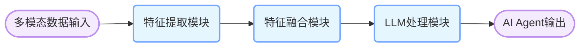

# LLM驱动的AI Agent多模态融合处理

> 关键词：LLM（大语言模型）、AI Agent、多模态融合处理、自然语言处理、计算机视觉

> 摘要：本文深入探讨了LLM驱动的AI Agent多模态融合处理技术。首先介绍了该技术的背景，包括目的、预期读者、文档结构和相关术语。接着阐述了核心概念及其联系，通过文本示意图和Mermaid流程图进行直观展示。详细讲解了核心算法原理，并用Python代码进行说明，同时给出了数学模型和公式。通过项目实战案例，展示了开发环境搭建、源代码实现与解读。分析了该技术的实际应用场景，推荐了学习资源、开发工具框架和相关论文著作。最后总结了未来发展趋势与挑战，并提供了常见问题解答和扩展阅读参考资料。

## 1. 背景介绍 
### 1.1 目的和范围
随着人工智能技术的不断发展，单一模态的数据处理已经难以满足复杂的应用需求。LLM（大语言模型）凭借其强大的语言理解和生成能力，为AI Agent的开发提供了有力支持。而多模态融合处理则能够综合利用多种类型的数据，如文本、图像、音频等，使AI Agent具备更全面、更智能的交互能力。本文的目的在于深入研究LLM驱动的AI Agent多模态融合处理技术，探讨其原理、算法、应用场景等方面的内容，为相关领域的研究和开发提供参考。

### 1.2 预期读者
本文适合对人工智能、自然语言处理、计算机视觉等领域感兴趣的研究人员、开发人员和技术爱好者阅读。对于正在从事AI Agent开发、多模态融合处理相关项目的专业人士，本文提供的技术原理、代码实现和应用案例将具有一定的指导意义。

### 1.3 文档结构概述
本文共分为十个部分。第一部分为背景介绍，阐述了文章的目的、预期读者和文档结构。第二部分介绍核心概念与联系，通过文本示意图和Mermaid流程图展示多模态融合处理的原理和架构。第三部分讲解核心算法原理，并使用Python源代码详细阐述。第四部分给出数学模型和公式，并进行详细讲解和举例说明。第五部分通过项目实战，展示开发环境搭建、源代码实现和代码解读。第六部分分析实际应用场景。第七部分推荐学习资源、开发工具框架和相关论文著作。第八部分总结未来发展趋势与挑战。第九部分为附录，提供常见问题与解答。第十部分列出扩展阅读和参考资料。

### 1.4 术语表
#### 1.4.1 核心术语定义
- **LLM（大语言模型）**：是一种基于深度学习的语言模型，通过在大规模文本数据上进行训练，能够学习到语言的模式和规律，具备强大的语言理解和生成能力。
- **AI Agent（人工智能代理）**：是一种能够感知环境、进行决策并采取行动的智能实体，它可以根据预设的目标和规则，自主地完成各种任务。
- **多模态融合处理**：将多种不同模态的数据（如文本、图像、音频等）进行整合和处理，以获得更全面、更准确的信息，提高AI Agent的智能水平和交互能力。

#### 1.4.2 相关概念解释
- **模态**：指数据的表现形式，如文本、图像、音频、视频等。不同模态的数据具有不同的特征和信息表达方式。
- **特征提取**：从原始数据中提取出具有代表性的特征，以便后续的处理和分析。在多模态融合处理中，需要对不同模态的数据分别进行特征提取。
- **融合策略**：将不同模态的特征进行融合的方法和策略，常见的融合策略包括早期融合、晚期融合等。

#### 1.4.3 缩略词列表
- **LLM**：Large Language Model
- **AI**：Artificial Intelligence
- **NLP**：Natural Language Processing
- **CV**：Computer Vision

## 2. 核心概念与联系 

### 核心概念原理
LLM驱动的AI Agent多模态融合处理的核心思想是将LLM的语言处理能力与多模态数据的信息相结合，使AI Agent能够更好地理解和处理复杂的现实世界信息。具体来说，首先对不同模态的数据（如文本、图像、音频）进行特征提取，得到各自的特征表示。然后，根据不同的融合策略将这些特征进行融合，得到一个综合的特征表示。最后，将综合特征输入到LLM中，利用LLM的强大语言理解和生成能力进行推理和决策，从而使AI Agent能够完成各种任务。

### 架构的文本示意图
```plaintext
+-------------------+
| 多模态数据输入    |
| (文本、图像、音频)|
+-------------------+
        |
        v
+-------------------+
| 特征提取模块      |
| (文本特征提取、   |
| 图像特征提取、    |
| 音频特征提取)     |
+-------------------+
        |
        v
+-------------------+
| 特征融合模块      |
| (早期融合、晚期  |
| 融合等策略)       |
+-------------------+
        |
        v
+-------------------+
| LLM处理模块       |
| (语言理解、生成  |
| 和推理)           |
+-------------------+
        |
        v
+-------------------+
| AI Agent输出      |
| (决策、行动等)    |
+-------------------+
```

### Mermaid流程图


## 3. 核心算法原理 & 具体操作步骤 

### 核心算法原理
在LLM驱动的AI Agent多模态融合处理中，主要涉及到三个核心步骤：特征提取、特征融合和LLM处理。

#### 特征提取
- **文本特征提取**：可以使用预训练的语言模型（如BERT、GPT等）来提取文本的特征。这些模型在大规模文本数据上进行了预训练，能够学习到语言的语义信息。
- **图像特征提取**：常用的方法是使用卷积神经网络（CNN），如ResNet、VGG等。这些网络可以自动提取图像的特征。
- **音频特征提取**：可以使用Mel频率倒谱系数（MFCC）等方法将音频信号转换为特征向量。

#### 特征融合
- **早期融合**：在特征提取之后，直接将不同模态的特征拼接在一起，形成一个综合的特征向量。
- **晚期融合**：分别对不同模态的特征进行处理，然后在决策阶段将处理结果进行融合。

#### LLM处理
将融合后的特征输入到LLM中，LLM根据输入的信息进行语言理解、生成和推理，最终输出AI Agent的决策和行动。

### 具体操作步骤及Python源代码
以下是一个简单的示例，展示了如何使用Python实现文本和图像的多模态融合处理。

```python
import torch
import torchvision.models as models
from transformers import AutoTokenizer, AutoModel

# 文本特征提取
def text_feature_extraction(text):
    tokenizer = AutoTokenizer.from_pretrained('bert-base-uncased')
    model = AutoModel.from_pretrained('bert-base-uncased')
    inputs = tokenizer(text, return_tensors='pt')
    outputs = model(**inputs)
    text_features = outputs.last_hidden_state.mean(dim=1)
    return text_features

# 图像特征提取
def image_feature_extraction(image):
    model = models.resnet18(pretrained=True)
    model.eval()
    image_features = model(image.unsqueeze(0))
    return image_features

# 特征融合（早期融合）
def feature_fusion(text_features, image_features):
    fused_features = torch.cat((text_features, image_features), dim=1)
    return fused_features

# 示例数据
text = "This is a sample text."
image = torch.randn(3, 224, 224)  # 假设图像为随机张量

# 特征提取
text_features = text_feature_extraction(text)
image_features = image_feature_extraction(image)

# 特征融合
fused_features = feature_fusion(text_features, image_features)

print("Fused features shape:", fused_features.shape)
```

在上述代码中，首先定义了文本特征提取、图像特征提取和特征融合的函数。然后，使用示例数据进行特征提取和融合，并打印出融合后的特征向量的形状。

## 4. 数学模型和公式 & 详细讲解 & 举例说明 

### 特征提取数学模型
#### 文本特征提取
假设输入的文本为 $x = [x_1, x_2, \cdots, x_n]$，其中 $x_i$ 表示文本中的第 $i$ 个词。使用预训练的语言模型 $f_{text}$ 进行特征提取，得到文本特征 $h_{text}$：
$$h_{text} = f_{text}(x)$$

#### 图像特征提取
假设输入的图像为 $I$，使用卷积神经网络 $f_{image}$ 进行特征提取，得到图像特征 $h_{image}$：
$$h_{image} = f_{image}(I)$$

#### 音频特征提取
假设输入的音频信号为 $s$，使用音频特征提取函数 $f_{audio}$ 进行特征提取，得到音频特征 $h_{audio}$：
$$h_{audio} = f_{audio}(s)$$

### 特征融合数学模型
#### 早期融合
早期融合是将不同模态的特征直接拼接在一起。假设文本特征为 $h_{text}$，图像特征为 $h_{image}$，则融合后的特征 $h_{fused}$ 为：
$$h_{fused} = [h_{text}; h_{image}]$$

#### 晚期融合
晚期融合通常是在决策阶段进行。假设文本特征经过处理后得到决策结果 $y_{text}$，图像特征经过处理后得到决策结果 $y_{image}$，则最终的决策结果 $y$ 可以通过加权求和得到：
$$y = \alpha y_{text} + (1 - \alpha) y_{image}$$
其中 $\alpha$ 是权重系数，$0 \leq \alpha \leq 1$。

### 举例说明
假设文本特征 $h_{text} = [0.1, 0.2, 0.3]$，图像特征 $h_{image} = [0.4, 0.5, 0.6]$。

#### 早期融合
融合后的特征 $h_{fused} = [0.1, 0.2, 0.3, 0.4, 0.5, 0.6]$

#### 晚期融合
假设文本特征的决策结果 $y_{text} = 0.7$，图像特征的决策结果 $y_{image} = 0.8$，权重系数 $\alpha = 0.6$。则最终的决策结果 $y = 0.6 \times 0.7 + (1 - 0.6) \times 0.8 = 0.74$

## 5. 项目实战：代码实际案例和详细解释说明 

### 5.1  开发环境搭建
#### 硬件环境
- 一台配备NVIDIA GPU的计算机，建议使用NVIDIA Tesla V100或更高性能的GPU，以加速深度学习模型的训练和推理过程。
- 至少16GB的内存，以确保能够处理大规模的数据和模型。

#### 软件环境
- **操作系统**：推荐使用Ubuntu 18.04或更高版本的Linux系统。
- **Python**：安装Python 3.7或更高版本。
- **深度学习框架**：安装PyTorch和TensorFlow，可使用以下命令进行安装：
```bash
pip install torch torchvision
pip install tensorflow
```
- **其他依赖库**：安装transformers、torchvision、opencv-python等库，可使用以下命令进行安装：
```bash
pip install transformers torchvision opencv-python
```

### 5.2  源代码详细实现和代码解读
以下是一个完整的项目实战案例，实现了一个基于LLM和图像的多模态问答系统。

```python
import torch
import torchvision.models as models
from transformers import AutoTokenizer, AutoModelForQuestionAnswering
import cv2
import numpy as np

# 文本特征提取
def text_feature_extraction(text):
    tokenizer = AutoTokenizer.from_pretrained('bert-large-uncased-whole-word-masking-finetuned-squad')
    model = AutoModelForQuestionAnswering.from_pretrained('bert-large-uncased-whole-word-masking-finetuned-squad')
    inputs = tokenizer(text, return_tensors='pt')
    outputs = model(**inputs)
    text_features = outputs.start_logits.mean(dim=1)
    return text_features

# 图像特征提取
def image_feature_extraction(image_path):
    model = models.resnet50(pretrained=True)
    model.eval()
    image = cv2.imread(image_path)
    image = cv2.resize(image, (224, 224))
    image = np.transpose(image, (2, 0, 1))
    image = torch.from_numpy(image).float() / 255.0
    image_features = model(image.unsqueeze(0))
    return image_features

# 特征融合（早期融合）
def feature_fusion(text_features, image_features):
    fused_features = torch.cat((text_features, image_features), dim=1)
    return fused_features

# 多模态问答系统
def multimodal_qa(question, image_path):
    text_features = text_feature_extraction(question)
    image_features = image_feature_extraction(image_path)
    fused_features = feature_fusion(text_features, image_features)
    # 这里简单返回融合后的特征，实际应用中可以将其输入到LLM进行问答
    return fused_features

# 示例数据
question = "What is in the image?"
image_path = "example_image.jpg"

# 进行多模态问答
result = multimodal_qa(question, image_path)
print("Multimodal QA result shape:", result.shape)
```

### 5.3  代码解读与分析
- **文本特征提取**：使用`bert-large-uncased-whole-word-masking-finetuned-squad`预训练模型进行文本特征提取。该模型是在SQuAD问答数据集上进行微调的，能够较好地处理问答任务。
- **图像特征提取**：使用ResNet50预训练模型进行图像特征提取。首先将图像进行读取和预处理，然后将其输入到ResNet50模型中，得到图像特征。
- **特征融合**：采用早期融合的策略，将文本特征和图像特征直接拼接在一起。
- **多模态问答系统**：将问题和图像路径作为输入，分别进行特征提取和融合，最终返回融合后的特征。在实际应用中，可以将融合后的特征输入到LLM中进行问答。

## 6. 实际应用场景 
### 智能客服
在智能客服系统中，用户可能会同时通过文本和图片描述问题。例如，用户在咨询电子产品故障时，不仅会用文字描述故障现象，还可能会上传故障部位的图片。LLM驱动的AI Agent可以对文本和图片进行多模态融合处理，更准确地理解用户的问题，并提供更合适的解决方案。

### 自动驾驶
在自动驾驶场景中，车辆需要同时处理来自摄像头、雷达等多种传感器的数据。摄像头可以提供图像信息，雷达可以提供距离和速度信息。通过多模态融合处理，AI Agent可以综合利用这些信息，更准确地感知周围环境，做出更安全、更合理的决策。

### 医疗诊断
在医疗领域，医生通常需要结合患者的病历文本、X光片、CT图像等多种信息进行诊断。LLM驱动的AI Agent可以对这些多模态数据进行融合处理，辅助医生进行疾病诊断，提高诊断的准确性和效率。

### 教育领域
在在线教育中，学生可能会通过文本提问、上传作业图片等方式与教师或智能辅导系统进行交互。AI Agent可以对这些多模态数据进行处理，理解学生的问题和学习情况，提供个性化的学习建议和辅导。

## 7. 工具和资源推荐
### 7.1 学习资源推荐
#### 7.1.1 书籍推荐
- 《深度学习》（Deep Learning）：由Ian Goodfellow、Yoshua Bengio和Aaron Courville所著，是深度学习领域的经典教材，涵盖了深度学习的基本原理、算法和应用。
- 《自然语言处理入门》（Natural Language Processing with Python）：介绍了使用Python进行自然语言处理的基本方法和技术，适合初学者入门。
- 《计算机视觉：算法与应用》（Computer Vision: Algorithms and Applications）：全面介绍了计算机视觉的基本算法和应用，包括图像特征提取、目标检测、图像分割等。

#### 7.1.2 在线课程
- Coursera上的“深度学习专项课程”（Deep Learning Specialization）：由Andrew Ng教授主讲，包括深度学习基础、卷积神经网络、循环神经网络等多个课程，是学习深度学习的优质资源。
- edX上的“自然语言处理”（Natural Language Processing）：由哈佛大学和微软研究院联合开设，介绍了自然语言处理的基本概念、算法和应用。
- Udemy上的“计算机视觉大师班”（Computer Vision Masterclass）：提供了丰富的计算机视觉实践案例和代码实现，帮助学习者快速掌握计算机视觉技术。

#### 7.1.3 技术博客和网站
- arXiv：一个预印本平台，提供了大量的人工智能、机器学习、计算机视觉等领域的最新研究论文。
- Medium：一个技术博客平台，有许多人工智能领域的专家和爱好者分享他们的研究成果和实践经验。
- AI社区：如CSDN、博客园等，提供了丰富的人工智能技术文章和代码示例。

### 7.2 开发工具框架推荐
#### 7.2.1 IDE和编辑器
- PyCharm：一款专门为Python开发设计的集成开发环境，提供了代码编辑、调试、版本控制等功能，适合Python项目的开发。
- Jupyter Notebook：一种交互式开发环境，支持Python、R等多种编程语言，方便进行数据分析、模型训练和可视化。
- Visual Studio Code：一款轻量级的代码编辑器，支持多种编程语言和插件扩展，可用于人工智能项目的开发。

#### 7.2.2 调试和性能分析工具
- TensorBoard：TensorFlow提供的可视化工具，可用于监控模型的训练过程、查看模型的结构和性能指标。
- PyTorch Profiler：PyTorch提供的性能分析工具，可用于分析模型的运行时间、内存使用情况等。
- NVIDIA Nsight Systems：一款用于GPU性能分析的工具，可帮助开发者优化深度学习模型在GPU上的运行效率。

#### 7.2.3 相关框架和库
- PyTorch：一个开源的深度学习框架，提供了丰富的神经网络层和优化算法，支持动态图计算，易于使用和调试。
- TensorFlow：另一个广泛使用的深度学习框架，具有强大的分布式训练和部署能力，适合大规模的工业应用。
- Hugging Face Transformers：一个用于自然语言处理的开源库，提供了大量的预训练模型和工具，方便进行文本分类、问答系统等任务的开发。

### 7.3 相关论文著作推荐
#### 7.3.1 经典论文
- "Attention Is All You Need"：提出了Transformer架构，是自然语言处理领域的重要突破，为后续的大语言模型发展奠定了基础。
- "ImageNet Classification with Deep Convolutional Neural Networks"：介绍了AlexNet卷积神经网络，开启了深度学习在计算机视觉领域的应用热潮。
- "Deep Residual Learning for Image Recognition"：提出了残差网络（ResNet），解决了深度神经网络训练中的梯度消失问题，提高了模型的训练效率和性能。

#### 7.3.2 最新研究成果
- 关注arXiv上关于多模态融合处理、LLM应用等方面的最新论文，了解该领域的前沿研究动态。
- 参加人工智能领域的顶级会议，如NeurIPS、ICML、CVPR等，获取最新的研究成果和技术趋势。

#### 7.3.3 应用案例分析
- 分析一些实际应用中的多模态融合处理案例，如智能客服、自动驾驶等领域的相关论文和报告，学习如何将理论知识应用到实际项目中。

## 8. 总结：未来发展趋势与挑战
### 未来发展趋势
- **更强大的多模态融合能力**：未来的LLM驱动的AI Agent将具备更强大的多模态融合能力，能够处理更多种类的模态数据，如视频、触觉等，实现更加自然和智能的交互。
- **跨领域应用拓展**：该技术将在更多领域得到应用，如金融、娱乐、农业等，为各行业带来新的发展机遇。
- **个性化和自适应能力增强**：AI Agent将能够根据用户的个性化需求和行为习惯，自适应地调整融合策略和交互方式，提供更加个性化的服务。

### 挑战
- **数据处理和存储挑战**：多模态数据的规模通常较大，如何高效地处理和存储这些数据是一个挑战。需要研究更高效的数据处理算法和存储方案。
- **融合策略优化**：目前的多模态融合策略还存在一定的局限性，需要进一步研究和优化，以提高融合的效果和性能。
- **伦理和安全问题**：随着AI Agent的广泛应用，伦理和安全问题日益突出。例如，如何确保AI Agent的决策和行动符合人类的价值观和法律法规，如何防止数据泄露和滥用等。

## 9. 附录：常见问题与解答
### 问题1：多模态融合处理有哪些常见的融合策略？
解答：常见的融合策略包括早期融合、晚期融合和中间融合。早期融合是在特征提取之后直接将不同模态的特征拼接在一起；晚期融合是在决策阶段将不同模态的处理结果进行融合；中间融合则是在特征提取和决策之间的某个中间阶段进行融合。

### 问题2：如何选择合适的预训练模型进行特征提取？
解答：选择合适的预训练模型需要考虑多个因素，如数据的模态、任务的类型、模型的性能和计算资源等。对于文本特征提取，可以选择在大规模文本数据上预训练的语言模型，如BERT、GPT等；对于图像特征提取，可以选择在ImageNet等大规模图像数据集上预训练的卷积神经网络，如ResNet、VGG等。

### 问题3：多模态融合处理在实际应用中面临哪些困难？
解答：多模态融合处理在实际应用中面临的困难包括数据质量不一致、不同模态数据的特征表示不匹配、融合策略的选择和优化等。此外，还需要考虑计算资源的限制和实时性要求。

### 问题4：如何评估多模态融合处理的效果？
解答：可以使用多种指标来评估多模态融合处理的效果，如准确率、召回率、F1值、均方误差等。具体的评估指标需要根据任务的类型和目标来选择。

## 10. 扩展阅读 & 参考资料
### 扩展阅读
- 《多模态机器学习：基础与应用》（Multimodal Machine Learning: Foundations and Applications）：深入介绍了多模态机器学习的理论和方法，适合进一步研究多模态融合处理的读者阅读。
- 《人工智能：一种现代方法》（Artificial Intelligence: A Modern Approach）：全面介绍了人工智能的基本概念、算法和应用，是人工智能领域的经典教材。

### 参考资料
- Goodfellow, I., Bengio, Y., & Courville, A. (2016). Deep Learning. MIT Press.
- Manning, C. D., Raghavan, P., & Schütze, H. (2008). Introduction to Information Retrieval. Cambridge University Press.
- LeCun, Y., Bengio, Y., & Hinton, G. (2015). Deep learning. Nature, 521(7553), 436-444.

作者：AI天才研究院/AI Genius Institute & 禅与计算机程序设计艺术 /Zen And The Art of Computer Programming