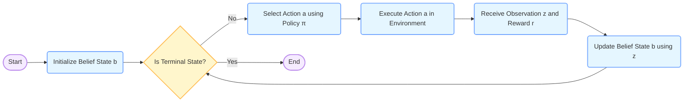

# POMDP在复杂AI决策中的应用

> 关键词：POMDP、复杂AI决策、马尔可夫决策过程、部分可观测、人工智能

> 摘要：本文深入探讨了POMDP（部分可观测马尔可夫决策过程）在复杂AI决策中的应用。首先介绍了相关背景，包括目的、预期读者、文档结构和术语表。接着阐述了POMDP的核心概念与联系，通过文本示意图和Mermaid流程图展示其架构。详细讲解了核心算法原理和具体操作步骤，并用Python源代码进行说明。同时给出了数学模型和公式，并举例说明。通过项目实战，展示了代码的实际案例和详细解释。还分析了POMDP在实际中的应用场景，推荐了相关的学习资源、开发工具框架和论文著作。最后总结了未来发展趋势与挑战，并给出常见问题解答和扩展阅读参考资料。

## 1. 背景介绍 
### 1.1 目的和范围
在复杂的人工智能决策场景中，环境往往是部分可观测的，这意味着智能体无法直接获取环境的全部状态信息。POMDP作为一种强大的建模工具，能够有效地处理这种部分可观测性，为智能体提供合理的决策策略。本文的目的是深入介绍POMDP的原理、算法，并详细探讨其在复杂AI决策中的应用。范围涵盖了POMDP的核心概念、算法实现、数学模型、实际应用案例，以及相关的学习资源和未来发展趋势等方面。

### 1.2 预期读者
本文主要面向对人工智能决策、机器学习、强化学习等领域感兴趣的研究人员、开发者和学生。具备一定的概率论、线性代数和编程基础的读者将更容易理解文中的内容。

### 1.3 文档结构概述
本文将按照以下结构进行组织：首先介绍POMDP的背景信息，包括目的、读者群体和文档结构等。接着详细阐述POMDP的核心概念和架构，通过示意图和流程图进行展示。然后讲解核心算法原理和具体操作步骤，并给出Python代码实现。之后介绍POMDP的数学模型和公式，并举例说明。通过项目实战展示代码的实际应用和详细解释。分析POMDP在不同实际场景中的应用。推荐相关的学习资源、开发工具框架和论文著作。最后总结未来发展趋势与挑战，给出常见问题解答和扩展阅读参考资料。

### 1.4 术语表
#### 1.4.1 核心术语定义
- **POMDP（部分可观测马尔可夫决策过程）**：是一种用于建模在部分可观测环境中进行决策的数学框架，它结合了马尔可夫决策过程（MDP）和部分可观测性的特点。
- **马尔可夫决策过程（MDP）**：是一个离散时间的随机控制过程，描述了智能体在一个完全可观测的环境中进行决策的过程，具有马尔可夫性。
- **状态（State）**：表示环境在某一时刻的特征或配置。
- **动作（Action）**：智能体在某一时刻可以采取的行为。
- **观测（Observation）**：智能体在部分可观测环境中能够获取的关于环境状态的部分信息。
- **奖励（Reward）**：智能体在执行某个动作后从环境中获得的即时反馈，用于衡量该动作的好坏。
- **策略（Policy）**：是一个从状态到动作的映射，指导智能体在不同状态下采取何种动作。

#### 1.4.2 相关概念解释
- **部分可观测性**：指智能体无法直接获取环境的全部状态信息，只能通过观测来推断环境状态。这使得决策过程更加复杂，因为智能体需要根据有限的观测信息来做出最优决策。
- **信念状态（Belief State）**：在POMDP中，由于环境是部分可观测的，智能体无法确定当前的真实状态，而是用一个概率分布来表示对所有可能状态的信念，这个概率分布就是信念状态。

#### 1.4.3 缩略词列表
- **POMDP**：Partially Observable Markov Decision Process
- **MDP**：Markov Decision Process

## 2. 核心概念与联系 
### 核心概念原理
POMDP是在马尔可夫决策过程（MDP）的基础上发展而来的。MDP假设环境是完全可观测的，即智能体在每个时刻都能准确知道当前的环境状态。而POMDP则考虑了部分可观测性，智能体只能通过观测来获取关于环境状态的部分信息。

POMDP可以用一个六元组 $\langle S, A, T, Z, O, R \rangle$ 来表示：
- $S$ 是状态集合，表示环境可能处于的所有状态。
- $A$ 是动作集合，智能体可以采取的所有动作。
- $T(s'|s, a)$ 是状态转移概率，表示在状态 $s$ 下执行动作 $a$ 后转移到状态 $s'$ 的概率。
- $Z$ 是观测集合，智能体可能获得的所有观测。
- $O(z|s', a)$ 是观测概率，表示在状态 $s'$ 下执行动作 $a$ 后获得观测 $z$ 的概率。
- $R(s, a)$ 是奖励函数，表示在状态 $s$ 下执行动作 $a$ 后获得的即时奖励。

在POMDP中，由于环境是部分可观测的，智能体无法直接知道当前的真实状态，而是用一个信念状态 $b(s)$ 来表示对所有可能状态的信念，其中 $b(s)$ 表示智能体认为环境处于状态 $s$ 的概率。智能体的目标是找到一个最优策略 $\pi$，使得在给定信念状态 $b$ 下，长期累积奖励的期望值最大。

### 架构的文本示意图
```plaintext
+----------------------+
|       Environment    |
|                      |
|  States (S)          |
|  State Transitions (T) |
|  Rewards (R)         |
+----------------------+
           ^
           |
           | Observations (Z, O)
           |
+----------------------+
|       Agent          |
|                      |
|  Belief State (b)    |
|  Actions (A)         |
|  Policy (π)          |
+----------------------+
```
在这个示意图中，环境包含状态集合 $S$、状态转移概率 $T$ 和奖励函数 $R$。智能体通过观测 $Z$ 和观测概率 $O$ 来获取关于环境的部分信息，并维护一个信念状态 $b$。智能体根据信念状态和策略 $\pi$ 选择动作 $A$ 并执行，动作会影响环境的状态和奖励。

### Mermaid流程图

这个流程图展示了POMDP的决策过程。首先初始化信念状态 $b$，然后判断是否到达终止状态。如果没有到达终止状态，则根据策略 $\pi$ 选择动作 $a$ 并在环境中执行，接着接收观测 $z$ 和奖励 $r$，并根据观测更新信念状态 $b$，重复这个过程直到到达终止状态。

## 3. 核心算法原理 & 具体操作步骤 
### 核心算法原理
POMDP的核心目标是找到一个最优策略 $\pi$，使得在给定信念状态 $b$ 下，长期累积奖励的期望值最大。常用的解决POMDP的算法有值迭代算法（Value Iteration）和策略迭代算法（Policy Iteration）。这里我们主要介绍值迭代算法。

值迭代算法的基本思想是通过迭代更新每个信念状态的价值函数 $V(b)$，直到价值函数收敛。价值函数 $V(b)$ 表示从信念状态 $b$ 开始，遵循最优策略所能获得的长期累积奖励的期望值。

值迭代算法的迭代公式如下：
$$V_{k + 1}(b) = \max_{a \in A} \left[ R(b, a) + \gamma \sum_{z \in Z} O(z|b, a) V_k(b') \right]$$
其中，$V_k(b)$ 是第 $k$ 次迭代时信念状态 $b$ 的价值函数，$R(b, a)$ 是在信念状态 $b$ 下执行动作 $a$ 的期望奖励，$\gamma$ 是折扣因子（$0 \leq \gamma < 1$），$O(z|b, a)$ 是在信念状态 $b$ 下执行动作 $a$ 后获得观测 $z$ 的概率，$b'$ 是根据观测 $z$ 更新后的信念状态。

### 具体操作步骤
1. **初始化**：初始化价值函数 $V_0(b)$ 为 0，对于所有的信念状态 $b$。
2. **迭代更新**：
    - 对于每个信念状态 $b$，计算在该信念状态下执行每个动作 $a$ 的 $Q$ 值：
      $$Q(b, a) = R(b, a) + \gamma \sum_{z \in Z} O(z|b, a) V_k(b')$$
    - 选择 $Q$ 值最大的动作 $a^*$，更新价值函数：
      $$V_{k + 1}(b) = Q(b, a^*)$$
3. **收敛判断**：判断 $V_{k + 1}(b)$ 和 $V_k(b)$ 的差值是否小于一个预设的阈值 $\epsilon$。如果小于阈值，则认为价值函数收敛，停止迭代；否则，继续进行下一次迭代。
4. **生成策略**：根据收敛后的价值函数 $V(b)$，生成最优策略 $\pi$：
      $$\pi(b) = \arg \max_{a \in A} Q(b, a)$$

### Python源代码实现
```python
import numpy as np

# 定义POMDP参数
S = 3  # 状态数量
A = 2  # 动作数量
Z = 2  # 观测数量
gamma = 0.9  # 折扣因子
epsilon = 1e-6  # 收敛阈值

# 初始化状态转移概率 T(s'|s, a)
T = np.random.rand(S, A, S)
T = T / np.sum(T, axis=2, keepdims=True)

# 初始化观测概率 O(z|s', a)
O = np.random.rand(S, A, Z)
O = O / np.sum(O, axis=2, keepdims=True)

# 初始化奖励函数 R(s, a)
R = np.random.rand(S, A)

# 初始化信念状态
b = np.ones(S) / S

# 初始化价值函数
V = np.zeros(S)

# 值迭代算法
def value_iteration():
    global V
    while True:
        V_new = np.copy(V)
        for s in range(S):
            Q_values = []
            for a in range(A):
                # 计算期望奖励
                r = np.dot(b, R[:, a])
                # 计算下一个信念状态的价值
                next_V = 0
                for z in range(Z):
                    # 计算观测概率
                    p_z = np.sum(b * O[:, a, z])
                    # 更新信念状态
                    b_new = b * O[:, a, z]
                    b_new = b_new / np.sum(b_new)
                    # 计算下一个信念状态的价值
                    next_V += p_z * np.max([np.dot(b_new, T[:, a, :]) @ V for a in range(A)])
                Q = r + gamma * next_V
                Q_values.append(Q)
            V_new[s] = np.max(Q_values)
        # 判断收敛
        if np.max(np.abs(V_new - V)) < epsilon:
            break
        V = V_new
    return V

# 生成策略
def generate_policy():
    policy = np.zeros(S, dtype=int)
    for s in range(S):
        Q_values = []
        for a in range(A):
            # 计算期望奖励
            r = np.dot(b, R[:, a])
            # 计算下一个信念状态的价值
            next_V = 0
            for z in range(Z):
                # 计算观测概率
                p_z = np.sum(b * O[:, a, z])
                # 更新信念状态
                b_new = b * O[:, a, z]
                b_new = b_new / np.sum(b_new)
                # 计算下一个信念状态的价值
                next_V += p_z * np.max([np.dot(b_new, T[:, a, :]) @ V for a in range(A)])
            Q = r + gamma * next_V
            Q_values.append(Q)
        policy[s] = np.argmax(Q_values)
    return policy

# 运行值迭代算法
V = value_iteration()
# 生成策略
policy = generate_policy()

print("Value function:", V)
print("Optimal policy:", policy)
```
### 代码解释
1. **参数初始化**：定义了POMDP的参数，包括状态数量 $S$、动作数量 $A$、观测数量 $Z$、折扣因子 $\gamma$ 和收敛阈值 $\epsilon$。初始化了状态转移概率 $T$、观测概率 $O$、奖励函数 $R$ 和信念状态 $b$，并将价值函数 $V$ 初始化为 0。
2. **值迭代算法**：`value_iteration` 函数实现了值迭代算法。在每次迭代中，对于每个信念状态 $b$，计算在该信念状态下执行每个动作 $a$ 的 $Q$ 值，并选择 $Q$ 值最大的动作更新价值函数 $V$。判断 $V$ 的更新是否小于阈值 $\epsilon$，如果小于阈值，则认为价值函数收敛，停止迭代。
3. **生成策略**：`generate_policy` 函数根据收敛后的价值函数 $V$ 生成最优策略 $\pi$。对于每个信念状态 $b$，计算在该信念状态下执行每个动作 $a$ 的 $Q$ 值，并选择 $Q$ 值最大的动作作为最优动作。
4. **输出结果**：最后输出收敛后的价值函数 $V$ 和最优策略 $\pi$。

## 4. 数学模型和公式 & 详细讲解 & 举例说明 
### 数学模型
POMDP的数学模型可以用一个六元组 $\langle S, A, T, Z, O, R \rangle$ 来表示，具体含义如下：
- $S$ 是状态集合，$|S|$ 表示状态的数量。
- $A$ 是动作集合，$|A|$ 表示动作的数量。
- $T(s'|s, a)$ 是状态转移概率，满足 $\sum_{s' \in S} T(s'|s, a) = 1$，对于所有的 $s \in S$ 和 $a \in A$。
- $Z$ 是观测集合，$|Z|$ 表示观测的数量。
- $O(z|s', a)$ 是观测概率，满足 $\sum_{z \in Z} O(z|s', a) = 1$，对于所有的 $s' \in S$ 和 $a \in A$。
- $R(s, a)$ 是奖励函数，表示在状态 $s$ 下执行动作 $a$ 后获得的即时奖励。

### 公式讲解
#### 信念状态更新
在执行动作 $a$ 并获得观测 $z$ 后，信念状态 $b$ 需要更新为 $b'$。根据贝叶斯定理，信念状态更新公式如下：
$$b'(s') = \frac{O(z|s', a) \sum_{s \in S} T(s'|s, a) b(s)}{\sum_{s'' \in S} O(z|s'', a) \sum_{s \in S} T(s''|s, a) b(s)}$$
这个公式的分子表示在当前信念状态 $b$ 下，执行动作 $a$ 后转移到状态 $s'$ 并获得观测 $z$ 的概率，分母是归一化因子，确保 $b'(s')$ 是一个概率分布。

#### 价值函数更新
值迭代算法的价值函数更新公式为：
$$V_{k + 1}(b) = \max_{a \in A} \left[ R(b, a) + \gamma \sum_{z \in Z} O(z|b, a) V_k(b') \right]$$
其中，$R(b, a) = \sum_{s \in S} b(s) R(s, a)$ 是在信念状态 $b$ 下执行动作 $a$ 的期望奖励，$O(z|b, a) = \sum_{s' \in S} b(s') O(z|s', a)$ 是在信念状态 $b$ 下执行动作 $a$ 后获得观测 $z$ 的概率。

### 举例说明
假设一个简单的POMDP问题，有两个状态 $S = \{s_1, s_2\}$，两个动作 $A = \{a_1, a_2\}$，两个观测 $Z = \{z_1, z_2\}$。状态转移概率 $T$、观测概率 $O$ 和奖励函数 $R$ 如下：

$$T = 
\begin{bmatrix}
\begin{bmatrix}
0.8 & 0.2 \\
0.3 & 0.7
\end{bmatrix}
&
\begin{bmatrix}
0.6 & 0.4 \\
0.1 & 0.9
\end{bmatrix}
\end{bmatrix}$$

$$O = 
\begin{bmatrix}
\begin{bmatrix}
0.7 & 0.3 \\
0.2 & 0.8
\end{bmatrix}
&
\begin{bmatrix}
0.6 & 0.4 \\
0.3 & 0.7
\end{bmatrix}
\end{bmatrix}$$

$$R = 
\begin{bmatrix}
1 & -1 \\
-1 & 1
\end{bmatrix}$$

初始信念状态 $b = [0.5, 0.5]$，折扣因子 $\gamma = 0.9$。

#### 信念状态更新示例
假设执行动作 $a_1$ 并获得观测 $z_1$，则根据信念状态更新公式：
$$b'(s_1) = \frac{O(z_1|s_1, a_1) \sum_{s \in S} T(s_1|s, a_1) b(s)}{\sum_{s'' \in S} O(z_1|s'', a_1) \sum_{s \in S} T(s''|s, a_1) b(s)}$$
$$b'(s_2) = \frac{O(z_1|s_2, a_1) \sum_{s \in S} T(s_2|s, a_1) b(s)}{\sum_{s'' \in S} O(z_1|s'', a_1) \sum_{s \in S} T(s''|s, a_1) b(s)}$$

代入具体数值计算：
$$\sum_{s \in S} T(s_1|s, a_1) b(s) = 0.8 \times 0.5 + 0.3 \times 0.5 = 0.55$$
$$\sum_{s \in S} T(s_2|s, a_1) b(s) = 0.2 \times 0.5 + 0.7 \times 0.5 = 0.45$$
$$O(z_1|s_1, a_1) \sum_{s \in S} T(s_1|s, a_1) b(s) = 0.7 \times 0.55 = 0.385$$
$$O(z_1|s_2, a_1) \sum_{s \in S} T(s_2|s, a_1) b(s) = 0.2 \times 0.45 = 0.09$$
$$\sum_{s'' \in S} O(z_1|s'', a_1) \sum_{s \in S} T(s''|s, a_1) b(s) = 0.385 + 0.09 = 0.475$$

则更新后的信念状态为：
$$b'(s_1) = \frac{0.385}{0.475} \approx 0.81$$
$$b'(s_2) = \frac{0.09}{0.475} \approx 0.19$$

#### 价值函数更新示例
假设当前价值函数 $V_k = [0, 0]$，则在信念状态 $b$ 下执行动作 $a_1$ 的 $Q$ 值为：
$$Q(b, a_1) = R(b, a_1) + \gamma \sum_{z \in Z} O(z|b, a_1) V_k(b')$$
$$R(b, a_1) = \sum_{s \in S} b(s) R(s, a_1) = 0.5 \times 1 + 0.5 \times (-1) = 0$$
$$O(z_1|b, a_1) = \sum_{s' \in S} b(s') O(z_1|s', a_1) = 0.5 \times 0.7 + 0.5 \times 0.2 = 0.45$$
$$O(z_2|b, a_1) = \sum_{s' \in S} b(s') O(z_2|s', a_1) = 0.5 \times 0.3 + 0.5 \times 0.8 = 0.55$$

由于 $V_k = [0, 0]$，所以 $\sum_{z \in Z} O(z|b, a_1) V_k(b') = 0$，则 $Q(b, a_1) = 0$。

同理，计算执行动作 $a_2$ 的 $Q$ 值，然后选择 $Q$ 值最大的动作更新价值函数 $V_{k + 1}$。

## 5. 项目实战：代码实际案例和详细解释说明 
### 5.1  开发环境搭建
#### 安装Python
首先需要安装Python，建议使用Python 3.7及以上版本。可以从Python官方网站（https://www.python.org/downloads/）下载并安装。

#### 安装必要的库
本项目需要使用 `numpy` 库进行数值计算。可以使用以下命令安装：
```sh
pip install numpy
```

### 5.2  源代码详细实现和代码解读
```python
import numpy as np

# 定义POMDP参数
S = 3  # 状态数量
A = 2  # 动作数量
Z = 2  # 观测数量
gamma = 0.9  # 折扣因子
epsilon = 1e-6  # 收敛阈值

# 初始化状态转移概率 T(s'|s, a)
T = np.random.rand(S, A, S)
T = T / np.sum(T, axis=2, keepdims=True)

# 初始化观测概率 O(z|s', a)
O = np.random.rand(S, A, Z)
O = O / np.sum(O, axis=2, keepdims=True)

# 初始化奖励函数 R(s, a)
R = np.random.rand(S, A)

# 初始化信念状态
b = np.ones(S) / S

# 初始化价值函数
V = np.zeros(S)

# 值迭代算法
def value_iteration():
    global V
    while True:
        V_new = np.copy(V)
        for s in range(S):
            Q_values = []
            for a in range(A):
                # 计算期望奖励
                r = np.dot(b, R[:, a])
                # 计算下一个信念状态的价值
                next_V = 0
                for z in range(Z):
                    # 计算观测概率
                    p_z = np.sum(b * O[:, a, z])
                    # 更新信念状态
                    b_new = b * O[:, a, z]
                    b_new = b_new / np.sum(b_new)
                    # 计算下一个信念状态的价值
                    next_V += p_z * np.max([np.dot(b_new, T[:, a, :]) @ V for a in range(A)])
                Q = r + gamma * next_V
                Q_values.append(Q)
            V_new[s] = np.max(Q_values)
        # 判断收敛
        if np.max(np.abs(V_new - V)) < epsilon:
            break
        V = V_new
    return V

# 生成策略
def generate_policy():
    policy = np.zeros(S, dtype=int)
    for s in range(S):
        Q_values = []
        for a in range(A):
            # 计算期望奖励
            r = np.dot(b, R[:, a])
            # 计算下一个信念状态的价值
            next_V = 0
            for z in range(Z):
                # 计算观测概率
                p_z = np.sum(b * O[:, a, z])
                # 更新信念状态
                b_new = b * O[:, a, z]
                b_new = b_new / np.sum(b_new)
                # 计算下一个信念状态的价值
                next_V += p_z * np.max([np.dot(b_new, T[:, a, :]) @ V for a in range(A)])
            Q = r + gamma * next_V
            Q_values.append(Q)
        policy[s] = np.argmax(Q_values)
    return policy

# 运行值迭代算法
V = value_iteration()
# 生成策略
policy = generate_policy()

print("Value function:", V)
print("Optimal policy:", policy)
```
### 代码解读与分析
#### 代码整体结构
代码主要分为以下几个部分：
1. **参数初始化**：定义了POMDP的参数，包括状态数量 $S$、动作数量 $A$、观测数量 $Z$、折扣因子 $\gamma$ 和收敛阈值 $\epsilon$。初始化了状态转移概率 $T$、观测概率 $O$、奖励函数 $R$ 和信念状态 $b$，并将价值函数 $V$ 初始化为 0。
2. **值迭代算法**：`value_iteration` 函数实现了值迭代算法，通过迭代更新价值函数 $V$ 直到收敛。
3. **生成策略**：`generate_policy` 函数根据收敛后的价值函数 $V$ 生成最优策略 $\pi$。
4. **运行算法并输出结果**：调用 `value_iteration` 函数和 `generate_policy` 函数，输出收敛后的价值函数 $V$ 和最优策略 $\pi$。

#### 具体代码分析
- **状态转移概率和观测概率的初始化**：使用 `np.random.rand` 函数随机生成状态转移概率 $T$ 和观测概率 $O$，并进行归一化处理，确保它们是合法的概率分布。
- **奖励函数的初始化**：使用 `np.random.rand` 函数随机生成奖励函数 $R$。
- **信念状态的初始化**：将信念状态 $b$ 初始化为均匀分布。
- **值迭代算法**：在每次迭代中，对于每个信念状态 $b$，计算在该信念状态下执行每个动作 $a$ 的 $Q$ 值，并选择 $Q$ 值最大的动作更新价值函数 $V$。判断 $V$ 的更新是否小于阈值 $\epsilon$，如果小于阈值，则认为价值函数收敛，停止迭代。
- **生成策略**：根据收敛后的价值函数 $V$，对于每个信念状态 $b$，计算在该信念状态下执行每个动作 $a$ 的 $Q$ 值，并选择 $Q$ 值最大的动作作为最优动作。

## 6. 实际应用场景 
### 机器人导航
在机器人导航中，机器人所处的环境往往是部分可观测的，例如机器人可能只能通过传感器获取周围环境的部分信息，如障碍物的位置、距离等。POMDP可以用于建模机器人的决策过程，根据传感器的观测信息更新信念状态，并选择最优的动作（如前进、后退、转弯等），以实现高效、安全的导航。

### 医疗诊断
在医疗诊断中，医生往往只能通过患者的症状、检查结果等部分信息来推断患者的病情。POMDP可以用于建模医生的诊断决策过程，根据患者的症状和检查结果更新对患者病情的信念状态，并选择最优的诊断和治疗方案，以提高诊断的准确性和治疗的效果。

### 智能交通系统
在智能交通系统中，交通管理者需要根据交通流量、车辆位置等部分信息来做出决策，如交通信号控制、路线规划等。POMDP可以用于建模交通管理者的决策过程，根据实时的交通信息更新对交通状态的信念状态，并选择最优的交通管理策略，以提高交通效率和安全性。

### 游戏AI
在游戏中，玩家的行为和游戏环境往往是部分可观测的。POMDP可以用于建模游戏AI的决策过程，根据游戏的观测信息更新对玩家行为和游戏状态的信念状态，并选择最优的游戏策略，以提高游戏AI的智能水平和游戏体验。

## 7. 工具和资源推荐
### 7.1 学习资源推荐
#### 7.1.1 书籍推荐
- 《Artificial Intelligence: A Modern Approach》：这是一本经典的人工智能教材，涵盖了人工智能的各个领域，包括POMDP。书中对POMDP的基本概念、算法和应用进行了详细的介绍。
- 《Reinforcement Learning: An Introduction》：这本书是强化学习领域的经典教材，对马尔可夫决策过程和POMDP进行了深入的讲解，并提供了大量的示例和代码。

#### 7.1.2 在线课程
- Coursera上的“Reinforcement Learning Specialization”：该课程由DeepMind的研究人员授课，涵盖了强化学习的基础知识和高级算法，包括POMDP。
- edX上的“Artificial Intelligence”：该课程由UC Berkeley的教授授课，对人工智能的各个领域进行了全面的介绍，包括POMDP。

#### 7.1.3 技术博客和网站
- Towards Data Science：这是一个专注于数据科学和机器学习的技术博客，上面有很多关于POMDP的文章和教程。
- arXiv：这是一个预印本数据库，上面有很多关于POMDP的最新研究成果和论文。

### 7.2 开发工具框架推荐
#### 7.2.1 IDE和编辑器
- PyCharm：这是一个功能强大的Python集成开发环境，支持代码编辑、调试、性能分析等功能，非常适合开发POMDP相关的项目。
- Jupyter Notebook：这是一个交互式的开发环境，支持Python代码的编写、运行和可视化，非常适合进行POMDP算法的实验和验证。

#### 7.2.2 调试和性能分析工具
- pdb：这是Python自带的调试工具，可以用于调试POMDP相关的代码，帮助定位和解决问题。
- cProfile：这是Python自带的性能分析工具，可以用于分析POMDP算法的性能瓶颈，优化代码性能。

#### 7.2.3 相关框架和库
- POMDPy：这是一个基于Python的POMDP求解框架，提供了多种POMDP求解算法的实现，方便开发者快速实现和测试POMDP算法。
- pomdp-solve：这是一个基于C++的POMDP求解工具，提供了高效的POMDP求解算法，支持大规模POMDP问题的求解。

### 7.3 相关论文著作推荐
#### 7.3.1 经典论文
- “A Survey of POMDP Solvers”：这篇论文对POMDP求解算法进行了全面的综述，介绍了各种POMDP求解算法的原理、优缺点和应用场景。
- “Partially Observable Markov Decision Processes for Mobile Robot Navigation”：这篇论文将POMDP应用于移动机器人导航，提出了一种基于POMDP的机器人导航算法，并进行了实验验证。

#### 7.3.2 最新研究成果
- 在arXiv和顶级学术会议（如NeurIPS、ICML、AAAI等）上搜索关于POMDP的最新研究成果，了解POMDP领域的最新发展动态。

#### 7.3.3 应用案例分析
- 一些实际应用领域的论文和报告，如机器人导航、医疗诊断、智能交通系统等，会介绍POMDP在这些领域的具体应用案例和效果分析。

## 8. 总结：未来发展趋势与挑战
### 未来发展趋势
#### 算法优化
随着计算机性能的不断提高和算法的不断创新，未来POMDP求解算法将更加高效和精确。例如，基于深度学习的POMDP求解算法将得到更广泛的研究和应用，通过神经网络来近似价值函数和策略，提高求解效率和精度。

#### 多智能体POMDP
在实际应用中，往往存在多个智能体需要进行协同决策的情况。多智能体POMDP将成为未来的一个研究热点，研究如何在部分可观测的环境中实现多个智能体的协同决策，提高系统的整体性能。

#### 与其他技术的融合
POMDP将与其他人工智能技术（如计算机视觉、自然语言处理等）进行更深入的融合，以解决更复杂的实际问题。例如，在机器人导航中，结合计算机视觉技术获取更准确的环境信息，提高机器人的导航能力。

### 挑战
#### 计算复杂度
POMDP的求解是一个NP-hard问题，随着状态空间、动作空间和观测空间的增大，计算复杂度会呈指数级增长。如何有效地降低计算复杂度，提高求解效率，是POMDP面临的一个重要挑战。

#### 数据获取和建模
在实际应用中，获取准确的状态转移概率、观测概率和奖励函数等数据是非常困难的。如何有效地获取和建模这些数据，提高POMDP模型的准确性和可靠性，是另一个挑战。

#### 可解释性
基于深度学习的POMDP求解算法往往缺乏可解释性，难以理解模型的决策过程和依据。如何提高POMDP模型的可解释性，是未来需要解决的一个问题。

## 9. 附录：常见问题与解答
### 问题1：POMDP和MDP有什么区别？
答：MDP假设环境是完全可观测的，即智能体在每个时刻都能准确知道当前的环境状态。而POMDP考虑了部分可观测性，智能体只能通过观测来获取关于环境状态的部分信息，需要用信念状态来表示对所有可能状态的信念。

### 问题2：POMDP的求解算法有哪些？
答：常见的POMDP求解算法有值迭代算法、策略迭代算法、蒙特卡罗树搜索算法等。此外，还有一些基于深度学习的POMDP求解算法，如深度Q网络（DQN）的扩展版本。

### 问题3：如何选择合适的POMDP求解算法？
答：选择合适的POMDP求解算法需要考虑问题的规模、复杂度和求解效率等因素。对于小规模的POMDP问题，可以使用值迭代算法或策略迭代算法；对于大规模的POMDP问题，可以使用蒙特卡罗树搜索算法或基于深度学习的求解算法。

### 问题4：POMDP在实际应用中有哪些局限性？
答：POMDP在实际应用中的局限性主要包括计算复杂度高、数据获取和建模困难、可解释性差等。此外，POMDP模型的准确性和可靠性也受到状态转移概率、观测概率和奖励函数等数据的影响。

## 10. 扩展阅读 & 参考资料
### 扩展阅读
- 阅读更多关于强化学习、马尔可夫决策过程和POMDP的书籍和论文，深入了解这些领域的理论和方法。
- 关注相关的学术会议和研讨会，了解POMDP领域的最新研究成果和发展动态。
- 参与开源项目和社区，与其他开发者交流和分享经验，提高自己的实践能力。

### 参考资料
- 《Artificial Intelligence: A Modern Approach》, Stuart Russell and Peter Norvig
- 《Reinforcement Learning: An Introduction》, Richard S. Sutton and Andrew G. Barto
- “A Survey of POMDP Solvers”, Shlomo Zilberstein, et al.
- “Partially Observable Markov Decision Processes for Mobile Robot Navigation”, Lydia E. Kavraki, et al.

作者：AI天才研究院/AI Genius Institute & 禅与计算机程序设计艺术 /Zen And The Art of Computer Programming