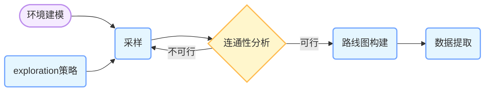

# PRM训练数据收集中的exploration策略

> 关键词：PRM、训练数据收集、exploration策略、路径规划、机器学习

> 摘要：本文围绕PRM（概率路线图）训练数据收集中的exploration策略展开深入探讨。首先介绍了PRM的背景和相关概念，包括其目的、适用读者和文档结构。接着详细阐述了核心概念，通过文本示意图和Mermaid流程图展示了PRM与exploration策略的联系。深入讲解了核心算法原理，并给出Python源代码示例。分析了相关的数学模型和公式，同时进行了详细举例说明。通过项目实战，给出开发环境搭建步骤、源代码实现和解读。探讨了实际应用场景，推荐了学习资源、开发工具框架以及相关论文著作。最后总结了未来发展趋势与挑战，并给出常见问题解答和扩展阅读参考资料。

## 1. 背景介绍 
### 1.1 目的和范围
PRM（概率路线图）是一种在机器人路径规划等领域广泛应用的算法，其训练数据的质量和多样性对于算法的性能至关重要。而exploration策略在训练数据收集过程中起着关键作用，它能够帮助我们更有效地探索环境，获取更有价值的训练数据。本文的目的是深入研究PRM训练数据收集中的exploration策略，详细介绍其原理、算法、实际应用等方面的内容，范围涵盖了从基本概念到实际项目实战的各个环节。

### 1.2 预期读者
本文适合对机器人路径规划、机器学习算法等领域感兴趣的研究人员、工程师和学生阅读。尤其是那些希望深入了解PRM算法以及如何优化训练数据收集过程的专业人士，通过阅读本文可以获取有价值的知识和实践经验。

### 1.3 文档结构概述
本文将按照以下结构进行阐述：首先介绍相关的核心概念和它们之间的联系，通过示意图和流程图帮助读者理解；接着详细讲解核心算法原理，并给出Python代码示例；然后分析相关的数学模型和公式，通过具体例子加深理解；进行项目实战，包括开发环境搭建、源代码实现和解读；探讨实际应用场景；推荐学习资源、开发工具框架和相关论文著作；最后总结未来发展趋势与挑战，给出常见问题解答和扩展阅读参考资料。

### 1.4 术语表
#### 1.4.1 核心术语定义
- **PRM（概率路线图）**：一种用于机器人路径规划的算法，通过在环境中随机采样节点并连接可行路径，构建一个路线图来寻找从起点到终点的路径。
- **exploration策略**：在训练数据收集过程中，用于指导如何探索环境以获取更多有效训练数据的方法和规则。
- **训练数据收集**：为了训练机器学习模型或算法，从环境中获取相关数据的过程。

#### 1.4.2 相关概念解释
- **路径规划**：在给定的环境中，找到从起点到终点的可行路径的过程。
- **采样**：从环境中随机选取一些点作为节点，用于构建PRM路线图。
- **连通性分析**：判断两个节点之间是否存在可行路径的过程。

#### 1.4.3 缩略词列表
- **PRM**：Probabilistic Roadmap（概率路线图）

## 2. 核心概念与联系 

### 核心概念原理
PRM算法的核心思想是通过在环境中随机采样节点，然后对这些节点进行连通性分析，将能够连接的节点用边连接起来，形成一个路线图。在训练数据收集过程中，exploration策略的作用是指导如何更有效地进行采样，以获取更多不同类型的可行路径作为训练数据。

例如，在一个复杂的室内环境中，简单的随机采样可能会导致采样点集中在某些区域，而忽略了其他重要区域。这时，exploration策略可以根据环境的特点和已有的采样信息，有针对性地在未被充分探索的区域进行采样，从而提高训练数据的多样性和有效性。

### 文本示意图
以下是PRM训练数据收集与exploration策略的关系示意图：

PRM训练数据收集可以分为以下几个步骤：
1. 环境建模：对机器人所处的环境进行建模，确定环境的边界和障碍物信息。
2. 采样：根据exploration策略在环境中采样节点。
3. 连通性分析：判断采样节点之间是否存在可行路径。
4. 路线图构建：将能够连接的节点用边连接起来，形成PRM路线图。
5. 数据提取：从路线图中提取训练数据，如路径信息、节点特征等。

exploration策略贯穿于采样步骤中，它根据环境信息和已有的采样结果，动态地调整采样的位置和方式，以获取更有价值的训练数据。

### Mermaid流程图


## 3. 核心算法原理 & 具体操作步骤 

### 核心算法原理
在PRM训练数据收集中，常见的exploration策略有随机采样策略、基于信息增益的采样策略等。这里以随机采样策略为例进行详细讲解。

随机采样策略的基本思想是在环境中随机选取节点进行采样。具体步骤如下：
1. 确定采样范围：根据环境的边界和障碍物信息，确定可以进行采样的区域。
2. 随机生成节点：在采样范围内随机生成节点的坐标。
3. 检查节点可行性：判断生成的节点是否在障碍物内，如果在障碍物内则重新生成节点。
4. 重复步骤2和3，直到达到预定的采样数量。

### Python源代码示例
```python
import numpy as np

# 定义环境边界和障碍物信息
environment_boundary = [[0, 0], [10, 10]]
obstacles = [[3, 3, 2, 2], [7, 7, 2, 2]]  # [x, y, width, height]

# 检查节点是否在障碍物内
def is_in_obstacle(node, obstacles):
    x, y = node
    for obs in obstacles:
        obs_x, obs_y, obs_w, obs_h = obs
        if obs_x <= x <= obs_x + obs_w and obs_y <= y <= obs_y + obs_h:
            return True
    return False

# 随机采样节点
def random_sampling(num_samples, environment_boundary, obstacles):
    samples = []
    while len(samples) < num_samples:
        # 随机生成节点坐标
        x = np.random.uniform(environment_boundary[0][0], environment_boundary[1][0])
        y = np.random.uniform(environment_boundary[0][1], environment_boundary[1][1])
        node = [x, y]
        # 检查节点可行性
        if not is_in_obstacle(node, obstacles):
            samples.append(node)
    return samples

# 示例：采样10个节点
num_samples = 10
samples = random_sampling(num_samples, environment_boundary, obstacles)
print("Sampled nodes:", samples)
```

### 代码解释
- `is_in_obstacle`函数用于检查一个节点是否在障碍物内。它遍历所有障碍物，判断节点的坐标是否在某个障碍物的范围内。
- `random_sampling`函数实现了随机采样的过程。它在环境边界内随机生成节点坐标，然后检查节点的可行性，如果节点不在障碍物内则将其添加到采样列表中，直到达到预定的采样数量。

## 4. 数学模型和公式 & 详细讲解 & 举例说明 

### 采样概率模型
在随机采样策略中，每个节点的采样概率是相等的。假设采样范围是一个二维矩形区域，其面积为 $S$，采样的总次数为 $N$，那么在某个小区域 $\Delta S$ 内采样到节点的概率 $P$ 可以表示为：

$$P = \frac{\Delta S}{S}$$

### 举例说明
假设环境边界是一个边长为10的正方形，其面积 $S = 10 \times 10 = 100$。现在考虑一个边长为2的小正方形区域，其面积 $\Delta S = 2 \times 2 = 4$。那么在这个小区域内采样到节点的概率为：

$$P = \frac{4}{100} = 0.04$$

也就是说，在每次采样时，有4%的概率在这个小区域内采样到节点。

### 连通性分析的数学模型
在判断两个节点之间是否存在可行路径时，可以使用欧几里得距离和障碍物检测。假设两个节点分别为 $p_1 = (x_1, y_1)$ 和 $p_2 = (x_2, y_2)$，它们之间的欧几里得距离 $d$ 可以表示为：

$$d = \sqrt{(x_2 - x_1)^2 + (y_2 - y_1)^2}$$

然后，在连接这两个节点的线段上进行障碍物检测，如果线段与任何障碍物相交，则认为这两个节点之间不存在可行路径。

### 举例说明
假设有两个节点 $p_1 = (1, 1)$ 和 $p_2 = (5, 5)$，它们之间的欧几里得距离为：

$$d = \sqrt{(5 - 1)^2 + (5 - 1)^2} = \sqrt{16 + 16} = \sqrt{32} \approx 5.66$$

如果在连接这两个节点的线段上存在一个障碍物，那么这两个节点之间就不存在可行路径。

## 5. 项目实战：代码实际案例和详细解释说明 

### 5.1  开发环境搭建
为了实现PRM训练数据收集中的exploration策略，我们可以使用Python语言和一些常用的库。以下是开发环境搭建的步骤：
1. **安装Python**：从Python官方网站（https://www.python.org/downloads/）下载并安装Python 3.x版本。
2. **安装必要的库**：使用pip命令安装以下库：
    - `numpy`：用于数值计算。
    - `matplotlib`：用于可视化。

```sh
pip install numpy matplotlib
```

### 5.2  源代码详细实现和代码解读
以下是一个完整的PRM训练数据收集示例，包含随机采样策略和路线图构建：

```python
import numpy as np
import matplotlib.pyplot as plt

# 定义环境边界和障碍物信息
environment_boundary = [[0, 0], [10, 10]]
obstacles = [[3, 3, 2, 2], [7, 7, 2, 2]]  # [x, y, width, height]

# 检查节点是否在障碍物内
def is_in_obstacle(node, obstacles):
    x, y = node
    for obs in obstacles:
        obs_x, obs_y, obs_w, obs_h = obs
        if obs_x <= x <= obs_x + obs_w and obs_y <= y <= obs_y + obs_h:
            return True
    return False

# 随机采样节点
def random_sampling(num_samples, environment_boundary, obstacles):
    samples = []
    while len(samples) < num_samples:
        # 随机生成节点坐标
        x = np.random.uniform(environment_boundary[0][0], environment_boundary[1][0])
        y = np.random.uniform(environment_boundary[0][1], environment_boundary[1][1])
        node = [x, y]
        # 检查节点可行性
        if not is_in_obstacle(node, obstacles):
            samples.append(node)
    return samples

# 检查两个节点之间是否存在可行路径
def is_path_valid(node1, node2, obstacles):
    num_steps = 100
    for i in range(num_steps):
        alpha = i / num_steps
        point = [node1[0] + alpha * (node2[0] - node1[0]), node1[1] + alpha * (node2[1] - node1[1])]
        if is_in_obstacle(point, obstacles):
            return False
    return True

# 构建路线图
def build_roadmap(samples, obstacles):
    num_samples = len(samples)
    roadmap = []
    for i in range(num_samples):
        for j in range(i + 1, num_samples):
            if is_path_valid(samples[i], samples[j], obstacles):
                roadmap.append([i, j])
    return roadmap

# 可视化路线图
def visualize_roadmap(samples, roadmap, obstacles):
    plt.figure()
    # 绘制障碍物
    for obs in obstacles:
        obs_x, obs_y, obs_w, obs_h = obs
        rect = plt.Rectangle((obs_x, obs_y), obs_w, obs_h, color='r')
        plt.gca().add_patch(rect)
    # 绘制采样节点
    x = [node[0] for node in samples]
    y = [node[1] for node in samples]
    plt.scatter(x, y, color='b')
    # 绘制路线图边
    for edge in roadmap:
        i, j = edge
        node1 = samples[i]
        node2 = samples[j]
        plt.plot([node1[0], node2[0]], [node1[1], node2[1]], color='g')
    plt.xlim(environment_boundary[0][0], environment_boundary[1][0])
    plt.ylim(environment_boundary[0][1], environment_boundary[1][1])
    plt.show()

# 示例：采样20个节点
num_samples = 20
samples = random_sampling(num_samples, environment_boundary, obstacles)
roadmap = build_roadmap(samples, obstacles)
visualize_roadmap(samples, roadmap, obstacles)
```

### 代码解读与分析
- `is_in_obstacle`函数：用于检查一个节点是否在障碍物内，通过遍历所有障碍物，判断节点的坐标是否在某个障碍物的范围内。
- `random_sampling`函数：实现了随机采样的过程，在环境边界内随机生成节点坐标，检查节点的可行性，如果节点不在障碍物内则将其添加到采样列表中，直到达到预定的采样数量。
- `is_path_valid`函数：用于检查两个节点之间是否存在可行路径。通过在连接两个节点的线段上均匀取多个点，检查这些点是否在障碍物内，如果有任何一个点在障碍物内，则认为这两个节点之间不存在可行路径。
- `build_roadmap`函数：构建路线图，遍历所有采样节点对，检查它们之间是否存在可行路径，如果存在则将这两个节点的索引添加到路线图中。
- `visualize_roadmap`函数：用于可视化路线图，绘制障碍物、采样节点和路线图的边。

## 6. 实际应用场景 
### 机器人路径规划
在机器人路径规划中，PRM算法结合exploration策略可以帮助机器人更有效地探索环境，找到从起点到终点的可行路径。例如，在一个仓库环境中，机器人需要在货架之间移动，通过使用合适的exploration策略进行训练数据收集，可以提高PRM算法的性能，使机器人能够更快地找到最优路径。

### 游戏开发
在游戏开发中，路径规划也是一个重要的问题。例如，在角色扮演游戏中，玩家控制的角色需要在游戏地图中移动，PRM算法结合exploration策略可以用于生成游戏地图的路线图，使角色能够智能地避开障碍物，找到到达目标地点的路径。

### 自动驾驶
在自动驾驶领域，车辆需要在复杂的道路环境中行驶，PRM算法结合exploration策略可以用于训练自动驾驶模型，帮助车辆更好地理解道路环境，规划出安全、高效的行驶路径。

## 7. 工具和资源推荐
### 7.1 学习资源推荐
#### 7.1.1 书籍推荐
- 《机器人学导论》：介绍了机器人的基本原理和算法，包括路径规划等方面的内容。
- 《机器学习》：全面介绍了机器学习的基本概念、算法和应用，对于理解PRM训练数据收集和exploration策略有很大的帮助。

#### 7.1.2 在线课程
- Coursera上的“机器人运动规划”课程：详细介绍了机器人路径规划的各种算法，包括PRM算法。
- edX上的“机器学习基础”课程：帮助学习者掌握机器学习的基本理论和方法。

#### 7.1.3 技术博客和网站
- Medium：有很多关于机器人学和机器学习的技术博客文章，可以从中获取最新的研究成果和实践经验。
- arXiv：一个预印本数据库，提供了大量的学术论文，包括PRM算法和exploration策略的相关研究。

### 7.2 开发工具框架推荐
#### 7.2.1 IDE和编辑器
- PyCharm：一款功能强大的Python集成开发环境，提供了代码编辑、调试、版本控制等功能。
- Visual Studio Code：一个轻量级的代码编辑器，支持多种编程语言，有丰富的插件可以扩展功能。

#### 7.2.2 调试和性能分析工具
- pdb：Python自带的调试工具，可以帮助开发者定位代码中的问题。
- cProfile：Python的性能分析工具，可以分析代码的运行时间和函数调用情况。

#### 7.2.3 相关框架和库
- OpenAI Gym：一个用于开发和比较强化学习算法的工具包，提供了各种环境和任务。
- ROS（机器人操作系统）：一个用于机器人开发的开源框架，提供了丰富的工具和库，方便开发者进行机器人路径规划等方面的开发。

### 7.3 相关论文著作推荐
#### 7.3.1 经典论文
- “Probabilistic Roadmaps for Path Planning in High-Dimensional Configuration Spaces”：这是PRM算法的经典论文，详细介绍了PRM算法的原理和实现。
- “Active Learning for Robotics”：探讨了主动学习在机器人领域的应用，对于理解exploration策略有重要的参考价值。

#### 7.3.2 最新研究成果
- 可以关注ICRA（国际机器人与自动化会议）、IROS（智能机器人与系统国际会议）等学术会议上的最新研究成果，了解PRM算法和exploration策略的最新发展。

#### 7.3.3 应用案例分析
- 一些实际应用案例的分析文章可以帮助我们更好地理解PRM算法和exploration策略在实际场景中的应用，例如在物流机器人、自动驾驶等领域的应用案例。

## 8. 总结：未来发展趋势与挑战
### 未来发展趋势
- **结合深度学习**：将PRM算法与深度学习相结合，可以提高路径规划的性能和智能水平。例如，使用深度学习模型来预测环境的变化，从而动态调整exploration策略。
- **多机器人协同**：在多机器人系统中，如何使用exploration策略进行训练数据收集，实现多机器人的协同路径规划是一个重要的研究方向。
- **实时性优化**：在实际应用中，需要提高PRM算法的实时性，减少训练数据收集和路径规划的时间，以满足实际场景的需求。

### 挑战
- **复杂环境适应**：在复杂的环境中，如未知环境、动态环境等，如何设计有效的exploration策略是一个挑战。需要考虑环境的不确定性和动态变化，提高算法的鲁棒性。
- **数据质量和多样性**：训练数据的质量和多样性对于PRM算法的性能至关重要。如何在有限的时间和资源内，获取高质量、多样化的训练数据是一个需要解决的问题。
- **计算资源需求**：随着环境复杂度的增加，PRM算法的计算资源需求也会相应增加。如何在有限的计算资源下，实现高效的训练数据收集和路径规划是一个挑战。

## 9. 附录：常见问题与解答
### 问题1：随机采样策略有什么缺点？
随机采样策略的缺点是可能会导致采样点集中在某些区域，而忽略了其他重要区域。例如，在一个复杂的环境中，随机采样可能会使采样点大部分集中在空旷的区域，而对障碍物周围的区域采样不足，从而影响训练数据的质量和多样性。

### 问题2：如何判断两个节点之间是否存在可行路径？
可以在连接两个节点的线段上均匀取多个点，检查这些点是否在障碍物内，如果有任何一个点在障碍物内，则认为这两个节点之间不存在可行路径。这种方法虽然简单，但在复杂环境中可能会比较耗时。

### 问题3：如何提高PRM算法的实时性？
可以采用一些优化策略，如减少采样数量、使用更高效的连通性分析算法、并行计算等。此外，还可以结合深度学习模型，提前预测环境的变化，减少不必要的采样和计算。

## 10. 扩展阅读 & 参考资料
- 本文参考了《机器人学导论》、“Probabilistic Roadmaps for Path Planning in High-Dimensional Configuration Spaces”等相关书籍和论文。
- 可以进一步阅读关于强化学习、主动学习等方面的资料，以深入理解exploration策略的原理和应用。

作者：AI天才研究院/AI Genius Institute & 禅与计算机程序设计艺术 /Zen And The Art of Computer Programming