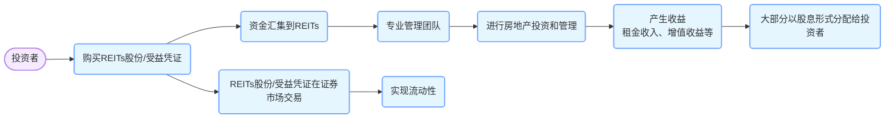

# REITs投资：房地产市场的流动性解决方案

> 关键词：REITs投资、房地产市场、流动性解决方案、收益模式、风险管控

> 摘要：本文围绕REITs投资展开，深入探讨其作为房地产市场流动性解决方案的原理和作用。首先介绍REITs的背景知识，包括目的、适用读者、文档结构和相关术语。接着阐述REITs的核心概念与联系，通过文本示意图和Mermaid流程图清晰呈现其架构。详细讲解核心算法原理和具体操作步骤，结合Python代码进行说明。分析其数学模型和公式，并举例解释。通过项目实战案例，展示REITs投资在实际中的应用，包括开发环境搭建、源代码实现和代码解读。探讨REITs在不同场景下的实际应用，推荐相关的学习资源、开发工具和研究论文。最后总结REITs投资的未来发展趋势与挑战，解答常见问题，并提供扩展阅读和参考资料，为投资者和相关从业者全面了解REITs投资提供深度指导。

## 1. 背景介绍 
### 1.1 目的和范围
房地产市场一直以来面临着流动性不足的问题，传统的房地产投资往往需要大量资金，且资产变现困难。REITs（Real Estate Investment Trusts，房地产投资信托基金）作为一种创新的金融工具，旨在解决房地产市场的流动性问题，为投资者提供一种间接投资房地产的方式。本文的目的是全面深入地探讨REITs投资，分析其作为房地产市场流动性解决方案的原理、机制和实际应用。范围涵盖REITs的基本概念、核心算法、数学模型、项目实战、实际应用场景以及相关的工具和资源等方面。

### 1.2 预期读者
本文预期读者包括房地产投资者、金融从业者、对REITs感兴趣的研究人员以及希望了解房地产市场流动性解决方案的相关人士。无论是专业的投资人士，还是对房地产金融领域有学习需求的初学者，都能从本文中获得有价值的信息。

### 1.3 文档结构概述
本文将按照以下结构进行阐述：首先介绍REITs的背景知识，包括相关术语和概念；接着详细讲解REITs的核心概念与联系，通过示意图和流程图展示其架构；然后深入分析核心算法原理和具体操作步骤，结合Python代码进行说明；探讨REITs的数学模型和公式，并举例解释；通过项目实战案例，展示REITs投资在实际中的应用；介绍REITs的实际应用场景；推荐相关的学习资源、开发工具和研究论文；最后总结REITs投资的未来发展趋势与挑战，解答常见问题，并提供扩展阅读和参考资料。

### 1.4 术语表
#### 1.4.1 核心术语定义
- **REITs（Real Estate Investment Trusts）**：房地产投资信托基金，是一种通过发行股份或受益凭证汇集资金，由专门的基金托管机构进行托管，并委托专门的投资机构进行房地产投资经营管理，将投资综合收益按比例分配给投资者的一种信托基金。
- **净运营收入（NOI，Net Operating Income）**：指房地产投资物业在扣除运营费用后所产生的收入，是衡量房地产投资收益的重要指标。
- **资金成本（Cost of Capital）**：指企业为筹集和使用资金而付出的代价，包括债务成本和股权成本。
- **资产负债率（Debt-to-Asset Ratio）**：指企业负债总额与资产总额的比率，反映了企业的负债水平和偿债能力。

#### 1.4.2 相关概念解释
- **权益型REITs**：直接投资并拥有房地产，其收入主要来源于房地产的租金收入和增值收益。
- **抵押型REITs**：主要投资于房地产抵押贷款或房地产抵押支持证券（MBS），其收入主要来源于贷款利息收入。
- **混合型REITs**：兼具权益型和抵押型REITs的特点，既投资于房地产物业，又投资于房地产抵押贷款。

#### 1.4.3 缩略词列表
- **REITs**：Real Estate Investment Trusts
- **NOI**：Net Operating Income
- **MBS**：Mortgage-Backed Securities

## 2. 核心概念与联系 

### 核心概念原理
REITs的核心原理是通过集合众多投资者的资金，由专业的管理团队进行房地产投资和管理。投资者购买REITs的股份或受益凭证，成为REITs的股东或受益人，分享REITs投资房地产所获得的收益。REITs通常会将大部分收益以股息的形式分配给投资者，同时，REITs的股份可以在证券市场上交易，具有较高的流动性。

### 架构的文本示意图
```plaintext
投资者 --> 购买REITs股份/受益凭证 --> 资金汇集到REITs
REITs --> 专业管理团队 --> 进行房地产投资和管理
房地产投资和管理 --> 产生收益（租金收入、增值收益等）
收益 --> 大部分以股息形式分配给投资者
REITs股份/受益凭证 --> 在证券市场交易 --> 实现流动性
```

### Mermaid流程图


## 3. 核心算法原理 & 具体操作步骤 

### 核心算法原理
在REITs投资中，一个重要的算法是评估REITs的价值和收益。其中，净运营收入（NOI）和资金成本是关键因素。REITs的价值可以通过净运营收入除以资金成本来估算，公式为：$V = \frac{NOI}{r}$，其中$V$表示REITs的价值，$NOI$表示净运营收入，$r$表示资金成本。

### 具体操作步骤
1. **数据收集**：收集REITs所投资房地产的相关数据，包括租金收入、运营费用、空置率等，以计算净运营收入。同时，确定REITs的资金成本，包括债务成本和股权成本。
2. **计算净运营收入**：净运营收入等于租金收入减去运营费用。公式为：$NOI = R - OE$，其中$R$表示租金收入，$OE$表示运营费用。
3. **确定资金成本**：资金成本可以通过加权平均资本成本（WACC）来计算。公式为：$WACC = w_d \times r_d \times (1 - t) + w_e \times r_e$，其中$w_d$表示债务占总资本的比例，$r_d$表示债务成本，$t$表示税率，$w_e$表示股权占总资本的比例，$r_e$表示股权成本。
4. **估算REITs价值**：将计算得到的净运营收入除以资金成本，得到REITs的估算价值。

### Python源代码实现
```python
# 计算净运营收入
def calculate_noi(rental_income, operating_expenses):
    return rental_income - operating_expenses

# 计算加权平均资本成本
def calculate_wacc(debt_weight, debt_cost, tax_rate, equity_weight, equity_cost):
    return debt_weight * debt_cost * (1 - tax_rate) + equity_weight * equity_cost

# 估算REITs价值
def estimate_reits_value(noi, wacc):
    return noi / wacc

# 示例数据
rental_income = 1000000  # 租金收入
operating_expenses = 300000  # 运营费用
debt_weight = 0.4  # 债务占总资本的比例
debt_cost = 0.05  # 债务成本
tax_rate = 0.25  # 税率
equity_weight = 0.6  # 股权占总资本的比例
equity_cost = 0.1  # 股权成本

# 计算净运营收入
noi = calculate_noi(rental_income, operating_expenses)
print(f"净运营收入: {noi}")

# 计算加权平均资本成本
wacc = calculate_wacc(debt_weight, debt_cost, tax_rate, equity_weight, equity_cost)
print(f"加权平均资本成本: {wacc}")

# 估算REITs价值
reits_value = estimate_reits_value(noi, wacc)
print(f"REITs估算价值: {reits_value}")
```

## 4. 数学模型和公式 & 详细讲解 & 举例说明 

### 净运营收入（NOI）公式
$$NOI = R - OE$$
- **详细讲解**：净运营收入是衡量房地产投资物业盈利能力的重要指标。租金收入$R$是指物业在一定时期内所获得的租金总额，运营费用$OE$包括物业管理费、维修费用、保险费等与物业运营相关的费用。通过计算净运营收入，可以了解物业在扣除运营成本后的实际盈利情况。
- **举例说明**：假设一个商业物业每月的租金收入为10万元，每月的运营费用为3万元，则该物业的月净运营收入为$NOI = 10 - 3 = 7$万元，年净运营收入为$7 \times 12 = 84$万元。

### 加权平均资本成本（WACC）公式
$$WACC = w_d \times r_d \times (1 - t) + w_e \times r_e$$
- **详细讲解**：加权平均资本成本是企业为筹集和使用资金而付出的平均代价。$w_d$和$w_e$分别表示债务和股权在总资本中所占的比例，$r_d$表示债务成本，$r_e$表示股权成本，$t$表示税率。由于债务利息可以在税前扣除，因此在计算债务成本时需要乘以$(1 - t)$。
- **举例说明**：某REITs的债务占总资本的比例为40%，债务成本为5%，股权占总资本的比例为60%，股权成本为10%，税率为25%。则该REITs的加权平均资本成本为：
$$WACC = 0.4 \times 0.05 \times (1 - 0.25) + 0.6 \times 0.1 = 0.015 + 0.06 = 0.075 = 7.5\%$$

### REITs价值估算公式
$$V = \frac{NOI}{r}$$
- **详细讲解**：该公式基于收益法的原理，将REITs的净运营收入按照资金成本进行折现，得到REITs的估算价值。资金成本$r$反映了投资者对REITs投资的预期收益率，净运营收入越高，资金成本越低，REITs的价值就越高。
- **举例说明**：假设某REITs的净运营收入为100万元，资金成本为8%，则该REITs的估算价值为：
$$V = \frac{100}{0.08} = 1250$$万元

## 5. 项目实战：代码实际案例和详细解释说明 

### 5.1  开发环境搭建
- **Python环境**：确保已经安装了Python 3.x版本，可以从Python官方网站（https://www.python.org/downloads/）下载并安装。
- **开发工具**：推荐使用PyCharm作为开发工具，它是一款功能强大的Python集成开发环境（IDE），可以从JetBrains官方网站（https://www.jetbrains.com/pycharm/download/）下载并安装。
- **必要库安装**：在命令行中使用以下命令安装必要的库：
```sh
pip install numpy pandas matplotlib
```

### 5.2  源代码详细实现和代码解读
```python
import numpy as np
import pandas as pd
import matplotlib.pyplot as plt

# 定义REITs投资模拟类
class REITsInvestmentSimulation:
    def __init__(self, rental_income, operating_expenses, debt_weight, debt_cost, tax_rate, equity_weight, equity_cost, years):
        self.rental_income = rental_income
        self.operating_expenses = operating_expenses
        self.debt_weight = debt_weight
        self.debt_cost = debt_cost
        self.tax_rate = tax_rate
        self.equity_weight = equity_weight
        self.equity_cost = equity_cost
        self.years = years

    # 计算净运营收入
    def calculate_noi(self):
        return self.rental_income - self.operating_expenses

    # 计算加权平均资本成本
    def calculate_wacc(self):
        return self.debt_weight * self.debt_cost * (1 - self.tax_rate) + self.equity_weight * self.equity_cost

    # 估算REITs价值
    def estimate_reits_value(self):
        noi = self.calculate_noi()
        wacc = self.calculate_wacc()
        return noi / wacc

    # 模拟REITs投资收益
    def simulate_investment(self):
        reits_value = self.estimate_reits_value()
        annual_returns = []
        for year in range(self.years):
            # 假设净运营收入每年增长5%
            self.rental_income *= 1.05
            self.operating_expenses *= 1.05
            noi = self.calculate_noi()
            wacc = self.calculate_wacc()
            new_reits_value = noi / wacc
            annual_return = (new_reits_value - reits_value) / reits_value
            annual_returns.append(annual_return)
            reits_value = new_reits_value

        return annual_returns

# 示例参数
rental_income = 1000000  # 初始租金收入
operating_expenses = 300000  # 初始运营费用
debt_weight = 0.4  # 债务占总资本的比例
debt_cost = 0.05  # 债务成本
tax_rate = 0.25  # 税率
equity_weight = 0.6  # 股权占总资本的比例
equity_cost = 0.1  # 股权成本
years = 10  # 模拟年限

# 创建REITs投资模拟对象
simulation = REITsInvestmentSimulation(rental_income, operating_expenses, debt_weight, debt_cost, tax_rate, equity_weight, equity_cost, years)

# 模拟投资收益
annual_returns = simulation.simulate_investment()

# 打印每年的收益率
for year, return_rate in enumerate(annual_returns, start=1):
    print(f"第{year}年的收益率: {return_rate * 100:.2f}%")

# 绘制收益率曲线
plt.plot(range(1, years + 1), annual_returns)
plt.xlabel('年份')
plt.ylabel('收益率')
plt.title('REITs投资收益率模拟')
plt.show()
```

### 5.3  代码解读与分析
- **类定义**：`REITsInvestmentSimulation`类封装了REITs投资模拟的相关功能，包括计算净运营收入、加权平均资本成本、估算REITs价值和模拟投资收益。
- **计算方法**：`calculate_noi`方法用于计算净运营收入，`calculate_wacc`方法用于计算加权平均资本成本，`estimate_reits_value`方法用于估算REITs价值。
- **模拟方法**：`simulate_investment`方法模拟了REITs投资在一定年限内的收益情况。假设净运营收入每年增长5%，每年重新计算REITs价值，并计算当年的收益率。
- **数据可视化**：使用`matplotlib`库绘制了每年的收益率曲线，直观展示了REITs投资的收益变化情况。

## 6. 实际应用场景 
### 个人投资者
对于个人投资者来说，REITs提供了一种低门槛、高流动性的房地产投资方式。个人投资者可以通过购买REITs的股份，间接参与房地产市场的投资，分享房地产的租金收入和增值收益。与直接投资房地产相比，REITs投资不需要大量的资金，并且可以在证券市场上随时买卖，具有较高的流动性。

### 机构投资者
机构投资者如保险公司、养老基金等，通常需要长期稳定的投资收益。REITs的收益相对稳定，且与其他资产的相关性较低，可以作为资产配置的一部分，降低投资组合的风险。同时，REITs的流动性也满足了机构投资者在需要资金时能够及时变现的需求。

### 房地产开发商
房地产开发商可以通过发行REITs来实现资产的证券化，将房地产项目的所有权转化为可交易的股份，从而快速回笼资金。这有助于开发商降低负债率，提高资金使用效率，同时也为房地产项目的后续开发和运营提供了资金支持。

### 政府部门
政府部门可以通过推动REITs的发展，促进房地产市场的健康稳定发展。REITs可以引导社会资金进入房地产领域，增加房地产市场的供给，缓解住房供需矛盾。同时，REITs的发展也有助于规范房地产市场的运作，提高房地产市场的透明度和效率。

## 7. 工具和资源推荐
### 7.1 学习资源推荐
#### 7.1.1 书籍推荐
- 《房地产投资信托基金：结构、管理与投资分析》：本书全面介绍了REITs的基本概念、结构、管理和投资分析方法，是学习REITs的经典教材。
- 《房地产金融与投资》：该书涵盖了房地产金融的各个方面，包括REITs、房地产抵押贷款、房地产证券化等，对于深入理解REITs的金融原理具有重要的参考价值。

#### 7.1.2 在线课程
- Coursera上的“Real Estate Finance and Investment”：该课程由知名高校的教授授课，系统讲解了房地产金融和投资的相关知识，包括REITs的投资策略和风险管理。
- edX上的“Introduction to Real Estate Investment Trusts”：课程介绍了REITs的基本概念、市场现状和投资机会，适合初学者学习。

#### 7.1.3 技术博客和网站
- NAREIT（National Association of Real Estate Investment Trusts）官网：提供了REITs行业的最新动态、市场数据和研究报告，是了解REITs行业的重要信息来源。
- Seeking Alpha：该网站上有许多关于REITs投资的分析文章和评论，投资者可以从中获取不同的观点和投资建议。

### 7.2 开发工具框架推荐
#### 7.2.1 IDE和编辑器
- PyCharm：功能强大的Python集成开发环境，提供了代码编辑、调试、版本控制等一系列功能，适合REITs投资分析的代码开发。
- Jupyter Notebook：交互式的编程环境，支持Python、R等多种编程语言，方便进行数据探索、模型验证和可视化展示。

#### 7.2.2 调试和性能分析工具
- PDB（Python Debugger）：Python自带的调试工具，可以帮助开发者定位代码中的错误和问题。
- cProfile：Python的性能分析工具，可以分析代码的运行时间和函数调用情况，帮助开发者优化代码性能。

#### 7.2.3 相关框架和库
- Pandas：用于数据处理和分析的Python库，提供了高效的数据结构和数据操作方法，适合处理REITs投资中的大量数据。
- NumPy：Python的数值计算库，提供了丰富的数学函数和数组操作功能，可用于REITs投资模型的计算和模拟。
- Matplotlib：Python的绘图库，可用于绘制REITs投资收益曲线、数据可视化等。

### 7.3 相关论文著作推荐
#### 7.3.1 经典论文
- “Real Estate Investment Trusts: Structure, Performance, and Investment Opportunities”：该论文系统地介绍了REITs的结构、绩效和投资机会，是REITs研究领域的经典之作。
- “The Risk and Return of Real Estate Investment Trusts”：论文分析了REITs的风险和收益特征，为投资者提供了重要的参考依据。

#### 7.3.2 最新研究成果
- 关注学术期刊如《Journal of Real Estate Finance and Economics》、《Real Estate Economics》等，这些期刊经常发表关于REITs的最新研究成果。
- 参加相关的学术会议和研讨会，如美国房地产与城市经济协会（AREUEA）年会，了解REITs领域的前沿研究动态。

#### 7.3.3 应用案例分析
- 可以参考一些知名投资机构的研究报告，如摩根士丹利、高盛等发布的关于REITs投资的案例分析，了解REITs在实际投资中的应用和策略。
- 分析一些成功的REITs项目案例，如美国的西蒙地产集团（Simon Property Group），学习其运营模式和投资策略。

## 8. 总结：未来发展趋势与挑战
### 未来发展趋势
- **市场规模扩大**：随着房地产市场的发展和金融市场的不断创新，REITs的市场规模有望继续扩大。越来越多的国家和地区开始推出REITs相关的政策和法规，促进REITs市场的发展。
- **产品创新**：未来REITs产品可能会更加多样化，除了传统的权益型、抵押型和混合型REITs外，还可能出现针对特定房地产领域或投资策略的REITs产品，如绿色REITs、养老地产REITs等。
- **国际化发展**：REITs市场将呈现国际化发展的趋势，投资者可以通过投资不同国家和地区的REITs，实现全球资产配置，分散投资风险。
- **科技应用加强**：随着科技的不断进步，REITs行业将加强科技应用，如利用大数据、人工智能等技术进行房地产市场分析、投资决策和资产管理，提高运营效率和投资收益。

### 挑战
- **法律法规不完善**：目前，一些国家和地区的REITs法律法规还不够完善，存在监管漏洞和政策不确定性，这可能会影响REITs市场的健康发展。
- **市场波动风险**：REITs的价格受到房地产市场和金融市场波动的影响较大，市场波动可能导致REITs的价格下跌，给投资者带来损失。
- **管理能力要求高**：REITs的成功运营需要专业的管理团队，具备房地产投资、资产管理、财务管理等多方面的能力。目前，市场上专业的REITs管理人才相对匮乏，这可能会制约REITs行业的发展。
- **投资者教育不足**：许多投资者对REITs的认识还不够深入，存在投资误区和风险意识不足的问题。加强投资者教育，提高投资者对REITs的认识和理解，是促进REITs市场健康发展的重要任务。

## 9. 附录：常见问题与解答
### 问题1：REITs与直接投资房地产有什么区别？
**解答**：与直接投资房地产相比，REITs具有以下优点：
- **低门槛**：REITs投资不需要大量的资金，个人投资者可以通过购买REITs的股份，以较小的资金参与房地产市场的投资。
- **高流动性**：REITs的股份可以在证券市场上交易，投资者可以随时买卖，而直接投资房地产的变现周期较长。
- **专业管理**：REITs由专业的管理团队进行房地产投资和管理，投资者无需亲自参与房地产的运营和管理。
- **分散风险**：REITs通常投资于多个房地产项目，通过分散投资降低了单一房地产项目的风险。

### 问题2：REITs的收益来源有哪些？
**解答**：REITs的收益主要来源于以下两个方面：
- **租金收入**：REITs投资的房地产物业会产生租金收入，这是REITs的主要收益来源之一。
- **增值收益**：随着房地产市场的发展和物业的增值，REITs所投资的房地产价值也会增加，投资者可以通过REITs的股份增值获得收益。

### 问题3：投资REITs有哪些风险？
**解答**：投资REITs的风险主要包括以下几个方面：
- **市场风险**：REITs的价格受到房地产市场和金融市场波动的影响较大，市场波动可能导致REITs的价格下跌。
- **利率风险**：利率的变化会影响REITs的资金成本和投资收益。当利率上升时，REITs的资金成本增加，投资收益可能会下降。
- **经营风险**：REITs的经营业绩取决于其管理团队的能力和房地产项目的运营情况。如果管理不善或房地产项目出现问题，可能会导致REITs的收益下降。
- **流动性风险**：虽然REITs的股份可以在证券市场上交易，但在某些情况下，市场流动性可能会降低，导致投资者难以及时买卖REITs股份。

### 问题4：如何选择合适的REITs进行投资？
**解答**：选择合适的REITs进行投资可以从以下几个方面考虑：
- **投资策略**：了解REITs的投资策略，如投资的房地产类型、地域分布、投资期限等，选择符合自己投资目标和风险偏好的REITs。
- **财务状况**：分析REITs的财务报表，了解其净运营收入、资产负债率、股息分配等情况，评估其财务健康状况和盈利能力。
- **管理团队**：考察REITs的管理团队的专业背景和经验，了解其投资决策能力和资产管理水平。
- **市场表现**：关注REITs的历史市场表现，包括价格走势、股息收益率等，评估其投资价值和风险。

## 10. 扩展阅读 & 参考资料
### 扩展阅读
- 《房地产投资分析与决策》：进一步深入学习房地产投资的分析方法和决策技巧，有助于更好地理解REITs投资。
- 《金融市场与金融机构》：了解金融市场的运作机制和金融机构的功能，对于理解REITs在金融市场中的地位和作用具有重要意义。

### 参考资料
- NAREIT官方网站：https://www.reit.com/
- 中国证券投资基金业协会官网：https://www.amac.org.cn/
- 《中国REITs市场发展白皮书》
- 《全球REITs市场研究报告》

作者：AI天才研究院/AI Genius Institute & 禅与计算机程序设计艺术 /Zen And The Art of Computer Programming