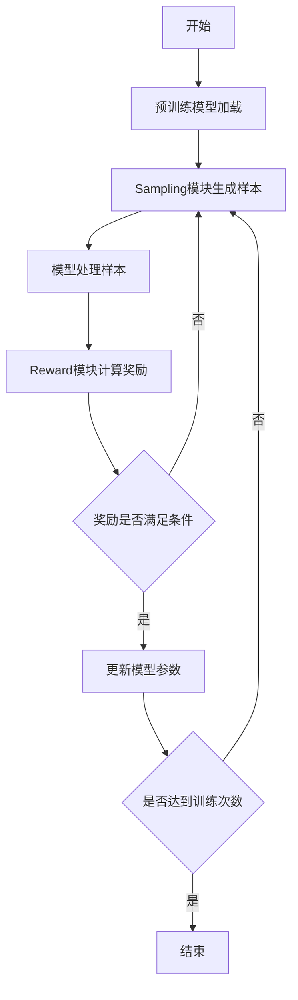

# RFT训练与模型坍塌:sampling+reward方法的优势

> 关键词：RFT训练、模型坍塌、sampling+reward方法、强化学习、采样策略、奖励机制

> 摘要：本文聚焦于RFT训练过程中模型坍塌这一关键问题，深入探讨了sampling+reward方法的优势。首先介绍了RFT训练的背景、目的、预期读者等内容，阐述了相关核心概念及联系。接着详细讲解了该方法的核心算法原理，结合Python代码给出具体操作步骤，同时运用数学模型和公式进行理论分析并举例说明。通过项目实战展示了该方法的代码实现及解读。分析了其在多个实际应用场景中的作用，推荐了学习、开发工具和相关论文著作。最后总结了未来发展趋势与挑战，解答了常见问题并提供扩展阅读和参考资料，旨在为相关领域的研究和实践提供全面而深入的指导。

## 1. 背景介绍 
### 1.1 目的和范围
RFT（Reinforcement Fine-Tuning，强化微调）训练在提升模型性能、使其更好地适应特定任务方面发挥着重要作用。然而，模型坍塌问题一直是困扰RFT训练的一大难题，它会导致模型性能急剧下降，无法达到预期的训练效果。本文章的目的在于深入研究sampling+reward方法在解决RFT训练中模型坍塌问题上的优势，通过详细的理论分析、代码实现和实际案例验证，为研究人员和开发者提供全面而深入的理解和实践指导。范围涵盖了从核心概念的阐述、算法原理的讲解、数学模型的推导，到项目实战、应用场景分析以及相关工具和资源的推荐等多个方面。

### 1.2 预期读者
本文预期读者包括但不限于人工智能领域的研究人员、深度学习开发者、对强化学习和模型训练有兴趣的学生以及相关行业的从业者。对于那些正在面临RFT训练中模型坍塌问题，或者希望深入了解sampling+reward方法以优化模型训练效果的人员，本文将提供有价值的参考和指导。

### 1.3 文档结构概述
本文将按照以下结构展开：首先介绍RFT训练和模型坍塌的背景知识，明确相关术语和概念；接着详细阐述sampling+reward方法的核心概念及联系，给出原理和架构的文本示意图和Mermaid流程图；然后讲解该方法的核心算法原理，并使用Python代码给出具体操作步骤；运用数学模型和公式对方法进行理论分析，并举例说明；通过项目实战展示代码实现和详细解读；分析该方法在实际应用场景中的作用；推荐相关的学习资源、开发工具和论文著作；最后总结未来发展趋势与挑战，解答常见问题并提供扩展阅读和参考资料。

### 1.4 术语表
#### 1.4.1 核心术语定义
- **RFT训练（Reinforcement Fine-Tuning）**：在预训练模型的基础上，使用强化学习的方法对模型进行微调，以使其更好地适应特定任务。
- **模型坍塌（Model Collapse）**：在训练过程中，模型的输出变得单调、缺乏多样性，无法捕捉到数据的丰富特征，导致性能急剧下降的现象。
- **Sampling（采样）**：从给定的分布中随机选取样本的过程，在RFT训练中，用于生成不同的输入或动作序列。
- **Reward（奖励）**：在强化学习中，用于评估智能体的行为表现，指导智能体学习最优策略的反馈信号。

#### 1.4.2 相关概念解释
- **强化学习（Reinforcement Learning）**：一种机器学习范式，智能体通过与环境进行交互，根据环境反馈的奖励信号来学习最优策略，以最大化长期累积奖励。
- **预训练模型（Pretrained Model）**：在大规模数据集上进行无监督或有监督训练得到的模型，通常具有较强的通用特征提取能力。

#### 1.4.3 缩略词列表
- **RFT**：Reinforcement Fine-Tuning
- **RL**：Reinforcement Learning

## 2. 核心概念与联系 

### 核心概念原理
在RFT训练中，模型坍塌的主要原因在于模型在训练过程中陷入了局部最优解，导致输出缺乏多样性。Sampling+reward方法的核心思想是通过引入合适的采样策略和奖励机制，增加模型训练的多样性，引导模型探索更广阔的解空间，从而避免陷入局部最优，有效解决模型坍塌问题。

采样策略的作用是从不同的分布中生成多样化的样本，这些样本可以作为模型的输入，使模型接触到更多不同类型的数据，增加训练的多样性。例如，可以使用随机采样、重要性采样等方法。

奖励机制则用于评估模型的输出质量，为模型提供明确的反馈信号。通过设计合理的奖励函数，可以引导模型朝着期望的方向进行学习。例如，可以根据模型输出的准确性、多样性等指标来计算奖励。

### 架构的文本示意图
```plaintext
+---------------------+
|      RFT训练过程     |
|                     |
|  +---------------+  |
|  |  预训练模型    |  |
|  +---------------+  |
|                     |
|  +---------------+  |
|  |  Sampling模块  |  |
|  +---------------+  |
|                     |
|  +---------------+  |
|  |  模型           |  |
|  +---------------+  |
|                     |
|  +---------------+  |
|  |  Reward模块    |  |
|  +---------------+  |
|                     |
+---------------------+
```

### Mermaid流程图


## 3. 核心算法原理 & 具体操作步骤 

### 核心算法原理
Sampling+reward方法的核心算法基于强化学习的思想，主要包括以下几个步骤：

1. **采样阶段**：使用采样策略从给定的分布中生成样本。常见的采样策略有随机采样、重要性采样等。随机采样是最简单的方法，直接从分布中随机选取样本；重要性采样则根据样本的重要性进行加权采样，提高采样效率。
2. **模型推理阶段**：将采样得到的样本输入到模型中，得到模型的输出。
3. **奖励计算阶段**：根据模型的输出和预先定义的奖励函数，计算奖励值。奖励函数可以根据具体任务进行设计，例如可以考虑输出的准确性、多样性等指标。
4. **模型更新阶段**：根据奖励值，使用优化算法更新模型的参数。常见的优化算法有随机梯度下降（SGD）、Adam等。

### 具体操作步骤（Python代码实现）
```python
import torch
import torch.nn as nn
import torch.optim as optim

# 定义一个简单的模型
class SimpleModel(nn.Module):
    def __init__(self, input_size, output_size):
        super(SimpleModel, self).__init__()
        self.fc = nn.Linear(input_size, output_size)

    def forward(self, x):
        return self.fc(x)

# 初始化模型
input_size = 10
output_size = 5
model = SimpleModel(input_size, output_size)

# 定义优化器
optimizer = optim.Adam(model.parameters(), lr=0.001)

# 定义奖励函数（示例：简单的准确性奖励）
def reward_function(output, target):
    _, predicted = torch.max(output, 1)
    correct = (predicted == target).sum().item()
    return correct / target.size(0)

# 训练参数
num_epochs = 100
batch_size = 32

# 模拟数据集
train_data = torch.randn(1000, input_size)
train_labels = torch.randint(0, output_size, (1000,))

# 训练循环
for epoch in range(num_epochs):
    for i in range(0, len(train_data), batch_size):
        # 采样阶段：从数据集中随机选取一个批次的样本
        batch_data = train_data[i:i+batch_size]
        batch_labels = train_labels[i:i+batch_size]

        # 模型推理阶段
        output = model(batch_data)

        # 奖励计算阶段
        reward = reward_function(output, batch_labels)

        # 模型更新阶段
        loss = -reward  # 最大化奖励等价于最小化负奖励
        optimizer.zero_grad()
        loss.backward()
        optimizer.step()

    print(f'Epoch {epoch+1}/{num_epochs}, Reward: {reward}')
```

在上述代码中，我们首先定义了一个简单的线性模型`SimpleModel`，并使用Adam优化器进行参数更新。然后定义了一个简单的奖励函数`reward_function`，根据模型输出的准确性计算奖励。在训练循环中，我们从数据集中随机采样一个批次的样本，输入到模型中进行推理，计算奖励值，并根据奖励值更新模型的参数。

## 4. 数学模型和公式 & 详细讲解 & 举例说明 

### 数学模型和公式
在强化学习中，智能体的目标是最大化长期累积奖励。假设智能体在每个时间步 $t$ 采取动作 $a_t$，环境返回状态 $s_{t+1}$ 和奖励 $r_{t+1}$，则长期累积奖励可以表示为：

$$G_t = \sum_{k=0}^{\infty} \gamma^k r_{t+k+1}$$

其中，$\gamma \in [0, 1]$ 是折扣因子，用于权衡近期奖励和远期奖励的重要性。

智能体的策略 $\pi(a|s)$ 表示在状态 $s$ 下采取动作 $a$ 的概率。在RFT训练中，我们的目标是找到一个最优策略 $\pi^*$，使得长期累积奖励最大化，即：

$$\pi^* = \arg\max_{\pi} \mathbb{E}[G_t | \pi]$$

为了实现这个目标，我们可以使用策略梯度算法，通过更新策略的参数 $\theta$ 来最大化期望奖励。策略梯度的计算公式为：

$$\nabla_{\theta} J(\theta) = \mathbb{E}_{\tau \sim \pi_{\theta}} \left[ \sum_{t=0}^{T} \nabla_{\theta} \log \pi_{\theta}(a_t | s_t) G_t \right]$$

其中，$\tau = (s_0, a_0, r_1, s_1, a_1, r_2, \cdots, s_T, a_T, r_{T+1})$ 是一个轨迹，$J(\theta)$ 是策略的性能指标。

### 详细讲解
上述公式的核心思想是通过计算策略梯度，更新策略的参数，使得策略在更多的轨迹上获得更高的奖励。具体来说，$\nabla_{\theta} \log \pi_{\theta}(a_t | s_t)$ 表示在状态 $s_t$ 下采取动作 $a_t$ 的概率对参数 $\theta$ 的梯度，$G_t$ 是从时间步 $t$ 开始的长期累积奖励。通过乘以 $G_t$，我们可以引导策略朝着获得更高奖励的方向进行更新。

### 举例说明
假设我们有一个简单的环境，智能体可以在两个动作 $a_1$ 和 $a_2$ 中进行选择。在某个状态 $s$ 下，策略 $\pi_{\theta}$ 采取动作 $a_1$ 的概率为 $\pi_{\theta}(a_1 | s) = 0.6$，采取动作 $a_2$ 的概率为 $\pi_{\theta}(a_2 | s) = 0.4$。如果智能体采取动作 $a_1$ 后获得的奖励为 $r_1 = 1$，采取动作 $a_2$ 后获得的奖励为 $r_2 = 0$，则长期累积奖励 $G_0$ 可以计算为：

$$G_0 = r_1 + \gamma r_2 + \gamma^2 r_3 + \cdots = 1$$

假设策略的参数 $\theta$ 影响 $\pi_{\theta}(a_1 | s)$ 和 $\pi_{\theta}(a_2 | s)$ 的值，我们可以计算策略梯度 $\nabla_{\theta} J(\theta)$，并使用梯度上升算法更新参数 $\theta$，使得 $\pi_{\theta}(a_1 | s)$ 增大，从而提高智能体在该状态下获得奖励的概率。

## 5. 项目实战：代码实际案例和详细解释说明 

### 5.1  开发环境搭建
为了实现Sampling+reward方法，我们需要搭建一个Python开发环境，并安装相关的深度学习库。以下是具体的步骤：

1. **安装Python**：建议使用Python 3.7及以上版本，可以从Python官方网站（https://www.python.org/downloads/）下载并安装。
2. **创建虚拟环境**：使用`venv`或`conda`创建一个虚拟环境，以隔离项目的依赖。例如，使用`venv`创建虚拟环境的命令如下：
```bash
python -m venv rft_env
source rft_env/bin/activate  # 激活虚拟环境（Windows使用 rft_env\Scripts\activate）
```
3. **安装深度学习库**：安装`torch`和`torchvision`库，用于构建和训练深度学习模型。可以使用以下命令进行安装：
```bash
pip install torch torchvision
```

### 5.2  源代码详细实现和代码解读
以下是一个完整的项目实战代码示例，使用Sampling+reward方法训练一个简单的图像分类模型：

```python
import torch
import torch.nn as nn
import torch.optim as optim
import torchvision
import torchvision.transforms as transforms

# 定义模型
class SimpleCNN(nn.Module):
    def __init__(self):
        super(SimpleCNN, self).__init__()
        self.conv1 = nn.Conv2d(3, 16, kernel_size=3, padding=1)
        self.relu1 = nn.ReLU()
        self.pool1 = nn.MaxPool2d(2, 2)
        self.fc1 = nn.Linear(16 * 16 * 16, 10)

    def forward(self, x):
        x = self.pool1(self.relu1(self.conv1(x)))
        x = x.view(-1, 16 * 16 * 16)
        x = self.fc1(x)
        return x

# 数据预处理
transform = transforms.Compose([
    transforms.ToTensor(),
    transforms.Normalize((0.5, 0.5, 0.5), (0.5, 0.5, 0.5))
])

# 加载数据集
trainset = torchvision.datasets.CIFAR10(root='./data', train=True,
                                        download=True, transform=transform)
trainloader = torch.utils.data.DataLoader(trainset, batch_size=32,
                                          shuffle=True, num_workers=2)

# 初始化模型、优化器和奖励函数
model = SimpleCNN()
optimizer = optim.Adam(model.parameters(), lr=0.001)

# 定义奖励函数（示例：简单的准确性奖励）
def reward_function(output, target):
    _, predicted = torch.max(output, 1)
    correct = (predicted == target).sum().item()
    return correct / target.size(0)

# 训练循环
num_epochs = 10
for epoch in range(num_epochs):
    running_reward = 0.0
    for i, data in enumerate(trainloader, 0):
        inputs, labels = data

        # 模型推理阶段
        outputs = model(inputs)

        # 奖励计算阶段
        reward = reward_function(outputs, labels)

        # 模型更新阶段
        loss = -reward  # 最大化奖励等价于最小化负奖励
        optimizer.zero_grad()
        loss.backward()
        optimizer.step()

        running_reward += reward
        if i % 200 == 199:    # 每200个批次打印一次平均奖励
            print(f'[{epoch + 1}, {i + 1:5d}] Reward: {running_reward / 200:.3f}')
            running_reward = 0.0

print('Finished Training')
```

### 代码解读与分析
1. **模型定义**：定义了一个简单的卷积神经网络`SimpleCNN`，包含一个卷积层、一个ReLU激活函数、一个最大池化层和一个全连接层。
2. **数据预处理**：使用`torchvision.transforms`对图像数据进行预处理，包括转换为张量和归一化操作。
3. **数据集加载**：使用`torchvision.datasets.CIFAR10`加载CIFAR-10数据集，并使用`torch.utils.data.DataLoader`创建数据加载器。
4. **奖励函数**：定义了一个简单的奖励函数`reward_function`，根据模型输出的准确性计算奖励。
5. **训练循环**：在每个epoch中，从数据加载器中获取一个批次的样本，输入到模型中进行推理，计算奖励值，并根据奖励值更新模型的参数。每200个批次打印一次平均奖励。

通过这种方式，我们可以使用Sampling+reward方法训练图像分类模型，避免模型坍塌问题，提高模型的性能。

## 6. 实际应用场景 
### 自然语言处理
在自然语言处理任务中，如文本生成、机器翻译等，RFT训练可以用于优化模型的输出质量。然而，模型坍塌问题可能导致生成的文本缺乏多样性，出现重复、单调的情况。Sampling+reward方法可以通过引入多样化的采样策略和合理的奖励机制，鼓励模型生成更加丰富、自然的文本。例如，在文本生成任务中，可以根据生成文本的流畅性、相关性和多样性等指标计算奖励，引导模型生成高质量的文本。

### 计算机视觉
在计算机视觉任务中，如目标检测、图像生成等，RFT训练可以帮助模型更好地适应特定的数据集和任务。模型坍塌可能导致检测结果不准确、图像生成质量下降等问题。Sampling+reward方法可以通过采样不同的图像区域或特征，以及设计合适的奖励函数，提高模型的检测精度和图像生成质量。例如，在目标检测任务中，可以根据检测的准确性、召回率等指标计算奖励，引导模型学习更有效的特征表示。

### 机器人控制
在机器人控制领域，RFT训练可以用于训练机器人的决策策略，使其能够在复杂的环境中完成各种任务。模型坍塌可能导致机器人的行为变得单一、缺乏灵活性，无法适应不同的环境变化。Sampling+reward方法可以通过采样不同的动作序列和环境状态，以及设计与任务相关的奖励函数，帮助机器人学习更加灵活、高效的决策策略。例如，在机器人导航任务中，可以根据机器人到达目标的时间、路径长度等指标计算奖励，引导机器人找到最优的导航路径。

## 7. 工具和资源推荐
### 7.1 学习资源推荐
#### 7.1.1 书籍推荐
- 《Reinforcement Learning: An Introduction》（《强化学习：原理与Python实现》）：这是一本经典的强化学习教材，全面介绍了强化学习的基本概念、算法和应用，适合初学者和有一定基础的读者。
- 《Deep Learning》（《深度学习》）：由Ian Goodfellow、Yoshua Bengio和Aaron Courville合著，是深度学习领域的权威教材，涵盖了深度学习的各个方面，包括神经网络、优化算法、强化学习等。

#### 7.1.2 在线课程
- 《Reinforcement Learning Specialization》（Coursera）：由美国华盛顿大学的教授开设的强化学习专项课程，包括多个模块，从基础概念到高级算法，逐步深入讲解强化学习的知识。
- 《Deep Learning Specialization》（Coursera）：由深度学习领域的知名学者Andrew Ng开设的深度学习专项课程，涵盖了深度学习的核心知识，包括神经网络、卷积神经网络、循环神经网络等。

#### 7.1.3 技术博客和网站
- OpenAI Blog（https://openai.com/blog/）：OpenAI发布的最新研究成果和技术文章，涵盖了人工智能的多个领域，包括强化学习、自然语言处理、计算机视觉等。
- Distill（https://distill.pub/）：一个专注于深度学习和人工智能的在线杂志，提供了许多高质量的技术文章和可视化解释，有助于深入理解深度学习的原理和算法。

### 7.2 开发工具框架推荐
#### 7.2.1 IDE和编辑器
- PyCharm：一款功能强大的Python集成开发环境，提供了代码编辑、调试、版本控制等一系列功能，适合Python开发。
- Jupyter Notebook：一个交互式的开发环境，支持Python、R等多种编程语言，方便进行数据分析、模型训练和可视化展示。

#### 7.2.2 调试和性能分析工具
- TensorBoard：TensorFlow提供的可视化工具，可以用于监控模型的训练过程、可视化模型结构、分析模型性能等。
- PyTorch Profiler：PyTorch提供的性能分析工具，可以帮助开发者找出代码中的性能瓶颈，优化代码性能。

#### 7.2.3 相关框架和库
- PyTorch：一个开源的深度学习框架，提供了丰富的神经网络层和优化算法，支持GPU加速，易于使用和扩展。
- Stable Baselines3：一个基于PyTorch的强化学习库，提供了多种经典的强化学习算法的实现，方便开发者快速搭建和训练强化学习模型。

### 7.3 相关论文著作推荐
#### 7.3.1 经典论文
- “Policy Gradient Methods for Reinforcement Learning with Function Approximation”（Richard S. Sutton等）：这篇论文提出了策略梯度算法，是强化学习领域的经典之作，为后续的研究奠定了基础。
- “Human-level control through deep reinforcement learning”（Volodymyr Mnih等）：这篇论文介绍了深度Q网络（DQN）算法，首次将深度学习和强化学习相结合，在Atari游戏中取得了人类水平的表现。

#### 7.3.2 最新研究成果
- “Proximal Policy Optimization Algorithms”（John Schulman等）：这篇论文提出了近端策略优化（PPO）算法，是一种高效的策略梯度算法，在多个强化学习任务中取得了优异的性能。
- “Reinforcement Learning for Natural Language Processing”（Mohammad Ghavamzadeh等）：这篇论文综述了强化学习在自然语言处理中的应用，介绍了相关的算法和研究进展。

#### 7.3.3 应用案例分析
- “Deep Reinforcement Learning for Autonomous Driving”（Alex Kendall等）：这篇论文介绍了深度强化学习在自动驾驶领域的应用，包括车辆控制、路径规划等方面的研究成果。
- “Reinforcement Learning in Healthcare”（Mihaela van der Schaar等）：这篇论文探讨了强化学习在医疗保健领域的应用，如疾病诊断、治疗方案优化等。

## 8. 总结：未来发展趋势与挑战
### 未来发展趋势
- **与其他技术的融合**：Sampling+reward方法将与深度学习、元学习、迁移学习等技术相结合，进一步提高模型的性能和泛化能力。例如，通过元学习可以快速适应新的任务和环境，迁移学习可以利用预训练模型的知识，加速模型的训练过程。
- **应用领域的拓展**：该方法将在更多的领域得到应用，如金融、医疗、交通等。在金融领域，可以用于投资决策、风险评估等；在医疗领域，可以用于疾病诊断、治疗方案优化等；在交通领域，可以用于交通流量控制、自动驾驶等。
- **算法的优化和创新**：研究人员将不断探索新的采样策略和奖励机制，优化现有的算法，提高算法的效率和稳定性。例如，采用更加智能的采样方法，根据模型的状态和环境的反馈动态调整采样策略。

### 挑战
- **计算资源的需求**：Sampling+reward方法通常需要大量的计算资源来进行模型训练，特别是在处理大规模数据集和复杂任务时。如何在有限的计算资源下提高算法的效率，是一个亟待解决的问题。
- **奖励函数的设计**：奖励函数的设计直接影响模型的学习效果，但设计一个合理的奖励函数往往是一个挑战。奖励函数需要考虑多个因素，如任务的目标、模型的输出质量、环境的动态变化等，如何平衡这些因素是一个关键问题。
- **模型的可解释性**：深度学习模型通常是黑盒模型，难以解释其决策过程和输出结果。在一些对安全性和可靠性要求较高的应用场景中，如医疗、自动驾驶等，模型的可解释性是一个重要的问题。如何提高Sampling+reward方法训练的模型的可解释性，是未来研究的一个方向。

## 9. 附录：常见问题与解答
### Q1：Sampling+reward方法与传统的训练方法有什么区别？
A1：传统的训练方法通常基于固定的数据集和损失函数进行训练，而Sampling+reward方法引入了采样策略和奖励机制，通过与环境进行交互，根据环境反馈的奖励信号来学习最优策略。这种方法可以增加训练的多样性，避免模型陷入局部最优，提高模型的性能。

### Q2：如何选择合适的采样策略和奖励函数？
A2：选择合适的采样策略和奖励函数需要根据具体的任务和问题来确定。采样策略可以根据数据的分布和特点选择，如随机采样、重要性采样等。奖励函数需要考虑任务的目标和模型的输出质量，可以根据准确性、多样性、效率等指标来设计。在实际应用中，通常需要进行多次实验和调整，以找到最优的采样策略和奖励函数。

### Q3：Sampling+reward方法是否适用于所有类型的模型？
A3：Sampling+reward方法适用于大多数基于强化学习的模型，特别是那些需要与环境进行交互、学习最优策略的模型。但对于一些不需要与环境交互的模型，如传统的监督学习模型，可能不太适用。在实际应用中，需要根据模型的特点和任务的需求来选择合适的训练方法。

## 10. 扩展阅读 & 参考资料
### 扩展阅读
- “Deep Reinforcement Learning Hands-On”（Max Lapan）：这本书提供了丰富的强化学习实践案例和代码实现，有助于深入理解强化学习的算法和应用。
- “Artificial Intelligence: A Modern Approach”（Stuart Russell和Peter Norvig）：这是一本经典的人工智能教材，涵盖了人工智能的各个领域，包括搜索算法、机器学习、自然语言处理等。

### 参考资料
- OpenAI官方文档（https://docs.openai.com/）：提供了OpenAI相关技术和工具的详细文档和教程。
- PyTorch官方文档（https://pytorch.org/docs/stable/index.html）：PyTorch的官方文档，包含了PyTorch的各种功能和接口的详细介绍。

作者：AI天才研究院/AI Genius Institute & 禅与计算机程序设计艺术 /Zen And The Art of Computer Programming