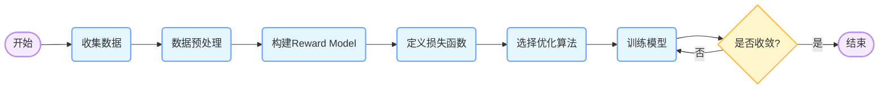

# Reward Model训练的稳定性问题探讨

> 关键词：Reward Model、训练稳定性、强化学习、模型优化、损失函数

> 摘要：本文聚焦于Reward Model训练的稳定性问题。首先介绍了Reward Model的背景知识，包括其目的、适用读者群体等。接着阐述了Reward Model的核心概念与联系，通过文本示意图和Mermaid流程图展示其架构原理。详细讲解了核心算法原理，并使用Python代码进行说明，同时给出了相关的数学模型和公式。通过项目实战，展示了代码的实际案例及详细解释。探讨了Reward Model的实际应用场景，推荐了相关的学习资源、开发工具框架和论文著作。最后总结了未来发展趋势与挑战，并提供了常见问题的解答和扩展阅读参考资料，旨在帮助读者深入理解Reward Model训练稳定性问题并找到解决思路。

## 1. 背景介绍 
### 1.1 目的和范围
Reward Model在强化学习、自然语言处理等多个领域有着广泛的应用。其主要目的是为智能体的行为提供一个合理的奖励信号，从而引导智能体学习到最优的策略。然而，在Reward Model的训练过程中，稳定性问题一直是一个亟待解决的挑战。本文的范围将涵盖Reward Model训练稳定性问题的各个方面，包括问题的根源、影响因素、解决方法等，并通过实际案例和代码展示来加深读者的理解。

### 1.2 预期读者
本文预期读者包括对强化学习、人工智能、机器学习等领域感兴趣的研究人员、开发者以及相关专业的学生。具备一定的编程基础和机器学习知识将有助于更好地理解本文内容。

### 1.3 文档结构概述
本文将按照以下结构进行组织：首先介绍Reward Model的核心概念与联系，让读者对其有一个基本的认识；接着详细讲解核心算法原理和具体操作步骤，并给出相应的Python代码；然后阐述相关的数学模型和公式，通过举例说明其应用；通过项目实战展示代码的实际应用和详细解释；探讨Reward Model的实际应用场景；推荐相关的学习资源、开发工具框架和论文著作；最后总结未来发展趋势与挑战，提供常见问题的解答和扩展阅读参考资料。

### 1.4 术语表
#### 1.4.1 核心术语定义
- **Reward Model（奖励模型）**：用于评估智能体行为好坏并给出相应奖励的模型。
- **Training Stability（训练稳定性）**：指模型在训练过程中能够保持稳定的性能，避免出现剧烈的波动或发散。
- **Reinforcement Learning（强化学习）**：一种机器学习范式，智能体通过与环境交互并根据环境反馈的奖励来学习最优策略。
- **Loss Function（损失函数）**：用于衡量模型预测值与真实值之间差异的函数，训练过程中通过最小化损失函数来优化模型。

#### 1.4.2 相关概念解释
- **Policy Gradient（策略梯度）**：强化学习中用于优化策略的一种方法，通过计算策略梯度来更新策略参数，使得智能体的行为获得更高的奖励。
- **Value Function（价值函数）**：用于评估智能体在某个状态下的长期价值，是强化学习中的重要概念之一。
- **Batch Normalization（批量归一化）**：一种用于加速神经网络训练和提高训练稳定性的技术，通过对输入数据进行归一化处理来减少内部协变量偏移。

#### 1.4.3 缩略词列表
- **RL（Reinforcement Learning）**：强化学习
- **RM（Reward Model）**：奖励模型
- **SGD（Stochastic Gradient Descent）**：随机梯度下降
- **Adam（Adaptive Moment Estimation）**：一种自适应学习率的优化算法

## 2. 核心概念与联系 

### 核心概念原理
Reward Model的核心原理是根据智能体的行为和环境状态，预测该行为所能获得的奖励。在训练过程中，通过收集大量的行为数据和对应的奖励标签，使用机器学习算法来学习行为与奖励之间的映射关系。一般来说，Reward Model可以表示为一个函数 $R(s,a)$，其中 $s$ 表示环境状态，$a$ 表示智能体的行为，$R(s,a)$ 表示该行为在该状态下所能获得的奖励。

### 架构的文本示意图
Reward Model的架构通常由输入层、隐藏层和输出层组成。输入层接收环境状态和智能体行为的特征向量，隐藏层通过一系列的非线性变换对输入特征进行处理，输出层输出预测的奖励值。

### Mermaid流程图


该流程图展示了Reward Model训练的基本流程，包括数据收集、预处理、模型构建、损失函数定义、优化算法选择、模型训练和收敛判断等步骤。

## 3. 核心算法原理 & 具体操作步骤 

### 核心算法原理
Reward Model的训练通常使用监督学习的方法，通过最小化预测奖励与真实奖励之间的差异来优化模型参数。常用的损失函数包括均方误差损失（Mean Squared Error, MSE）和交叉熵损失（Cross Entropy Loss）等。

以均方误差损失为例，其计算公式为：
$$L = \frac{1}{N} \sum_{i=1}^{N} (R_{pred}(s_i,a_i) - R_{true}(s_i,a_i))^2$$
其中 $N$ 表示样本数量，$R_{pred}(s_i,a_i)$ 表示模型预测的奖励值，$R_{true}(s_i,a_i)$ 表示真实的奖励值。

### 具体操作步骤
以下是使用Python和PyTorch实现Reward Model训练的具体步骤：

```python
import torch
import torch.nn as nn
import torch.optim as optim

# 定义Reward Model
class RewardModel(nn.Module):
    def __init__(self, input_dim):
        super(RewardModel, self).__init__()
        self.fc1 = nn.Linear(input_dim, 64)
        self.relu = nn.ReLU()
        self.fc2 = nn.Linear(64, 1)

    def forward(self, x):
        x = self.fc1(x)
        x = self.relu(x)
        x = self.fc2(x)
        return x

# 数据准备
# 假设我们有一些状态和行为的特征向量，以及对应的真实奖励
input_dim = 10
num_samples = 100
X = torch.randn(num_samples, input_dim)
y = torch.randn(num_samples, 1)

# 初始化模型、损失函数和优化器
model = RewardModel(input_dim)
criterion = nn.MSELoss()
optimizer = optim.Adam(model.parameters(), lr=0.001)

# 训练模型
num_epochs = 100
for epoch in range(num_epochs):
    # 前向传播
    outputs = model(X)
    loss = criterion(outputs, y)

    # 反向传播和优化
    optimizer.zero_grad()
    loss.backward()
    optimizer.step()

    if (epoch+1) % 10 == 0:
        print(f'Epoch [{epoch+1}/{num_epochs}], Loss: {loss.item():.4f}')
```

### 代码解释
1. **定义Reward Model**：使用PyTorch的`nn.Module`类定义一个简单的全连接神经网络作为Reward Model。该网络包含一个输入层、一个隐藏层和一个输出层。
2. **数据准备**：生成一些随机的输入特征向量和对应的真实奖励作为训练数据。
3. **初始化模型、损失函数和优化器**：实例化Reward Model，选择均方误差损失函数和Adam优化器。
4. **训练模型**：通过循环迭代进行模型训练，每次迭代包括前向传播、计算损失、反向传播和参数更新等步骤。

## 4. 数学模型和公式 & 详细讲解 & 举例说明 

### 数学模型和公式
#### 损失函数
如前所述，常用的损失函数有均方误差损失（MSE）和交叉熵损失等。均方误差损失的公式为：
$$L = \frac{1}{N} \sum_{i=1}^{N} (R_{pred}(s_i,a_i) - R_{true}(s_i,a_i))^2$$
交叉熵损失的公式为：
$$L = -\frac{1}{N} \sum_{i=1}^{N} [y_i \log(p_i) + (1 - y_i) \log(1 - p_i)]$$
其中 $y_i$ 表示真实标签，$p_i$ 表示模型预测的概率。

#### 优化算法
常用的优化算法包括随机梯度下降（SGD）和Adam等。SGD的更新公式为：
$$\theta_{t+1} = \theta_t - \eta \nabla L(\theta_t)$$
其中 $\theta_t$ 表示第 $t$ 次迭代的模型参数，$\eta$ 表示学习率，$\nabla L(\theta_t)$ 表示损失函数关于模型参数的梯度。

Adam的更新公式为：
$$m_{t+1} = \beta_1 m_t + (1 - \beta_1) \nabla L(\theta_t)$$
$$v_{t+1} = \beta_2 v_t + (1 - \beta_2) (\nabla L(\theta_t))^2$$
$$\hat{m}_{t+1} = \frac{m_{t+1}}{1 - \beta_1^{t+1}}$$
$$\hat{v}_{t+1} = \frac{v_{t+1}}{1 - \beta_2^{t+1}}$$
$$\theta_{t+1} = \theta_t - \frac{\eta}{\sqrt{\hat{v}_{t+1}} + \epsilon} \hat{m}_{t+1}$$
其中 $m_t$ 和 $v_t$ 分别表示梯度的一阶矩估计和二阶矩估计，$\beta_1$ 和 $\beta_2$ 是衰减系数，$\epsilon$ 是一个很小的常数，用于防止分母为零。

### 详细讲解
损失函数的选择取决于具体的任务和数据类型。均方误差损失适用于回归问题，而交叉熵损失适用于分类问题。优化算法的作用是在训练过程中不断更新模型参数，使得损失函数的值逐渐减小。SGD是一种简单而有效的优化算法，但它的收敛速度可能较慢。Adam则是一种自适应学习率的优化算法，能够根据梯度的一阶矩和二阶矩自适应地调整学习率，从而加快收敛速度。

### 举例说明
假设我们有一个简单的回归任务，输入特征向量为 $x = [1, 2, 3]$，真实奖励值为 $y = 5$。Reward Model的预测值为 $\hat{y} = 4$。使用均方误差损失计算损失值：
$$L = (4 - 5)^2 = 1$$

如果使用SGD进行优化，假设学习率 $\eta = 0.1$，模型参数的梯度为 $\nabla L = 0.5$，则模型参数的更新为：
$$\theta_{t+1} = \theta_t - 0.1 \times 0.5 = \theta_t - 0.05$$

## 5. 项目实战：代码实际案例和详细解释说明 

### 5.1  开发环境搭建
为了运行上述代码，我们需要搭建相应的开发环境。以下是具体步骤：

1. **安装Python**：建议使用Python 3.7及以上版本，可以从Python官方网站（https://www.python.org/downloads/）下载并安装。
2. **安装PyTorch**：根据自己的操作系统和CUDA版本，选择合适的PyTorch版本进行安装。可以参考PyTorch官方网站（https://pytorch.org/get-started/locally/）的安装指南。
3. **安装其他依赖库**：使用`pip`命令安装必要的依赖库，如`numpy`、`matplotlib`等。
```sh
pip install numpy matplotlib
```

### 5.2  源代码详细实现和代码解读
以下是一个完整的Reward Model训练的代码示例：

```python
import torch
import torch.nn as nn
import torch.optim as optim
import numpy as np
import matplotlib.pyplot as plt

# 定义Reward Model
class RewardModel(nn.Module):
    def __init__(self, input_dim):
        super(RewardModel, self).__init__()
        self.fc1 = nn.Linear(input_dim, 64)
        self.relu = nn.ReLU()
        self.fc2 = nn.Linear(64, 1)

    def forward(self, x):
        x = self.fc1(x)
        x = self.relu(x)
        x = self.fc2(x)
        return x

# 数据准备
input_dim = 10
num_samples = 100
X = torch.randn(num_samples, input_dim)
y = torch.randn(num_samples, 1)

# 初始化模型、损失函数和优化器
model = RewardModel(input_dim)
criterion = nn.MSELoss()
optimizer = optim.Adam(model.parameters(), lr=0.001)

# 训练模型
num_epochs = 100
losses = []
for epoch in range(num_epochs):
    # 前向传播
    outputs = model(X)
    loss = criterion(outputs, y)

    # 反向传播和优化
    optimizer.zero_grad()
    loss.backward()
    optimizer.step()

    losses.append(loss.item())

    if (epoch+1) % 10 == 0:
        print(f'Epoch [{epoch+1}/{num_epochs}], Loss: {loss.item():.4f}')

# 绘制损失曲线
plt.plot(np.arange(num_epochs), losses)
plt.xlabel('Epoch')
plt.ylabel('Loss')
plt.title('Training Loss')
plt.show()
```

### 代码解读与分析
1. **定义Reward Model**：定义了一个简单的全连接神经网络作为Reward Model，包含一个输入层、一个隐藏层和一个输出层。
2. **数据准备**：生成随机的输入特征向量和对应的真实奖励作为训练数据。
3. **初始化模型、损失函数和优化器**：实例化Reward Model，选择均方误差损失函数和Adam优化器。
4. **训练模型**：通过循环迭代进行模型训练，每次迭代包括前向传播、计算损失、反向传播和参数更新等步骤。同时，记录每次迭代的损失值。
5. **绘制损失曲线**：使用`matplotlib`库绘制训练过程中的损失曲线，直观地展示模型的训练效果。

## 6. 实际应用场景 
Reward Model在许多领域都有广泛的应用，以下是一些常见的实际应用场景：

### 强化学习
在强化学习中，Reward Model用于为智能体的行为提供奖励信号，引导智能体学习到最优的策略。例如，在机器人控制、自动驾驶、游戏等领域，通过训练一个准确的Reward Model，可以提高智能体的学习效率和性能。

### 推荐系统
在推荐系统中，Reward Model可以用于评估推荐结果的好坏。通过对用户的反馈数据进行学习，训练一个Reward Model来预测用户对不同推荐结果的满意度，从而优化推荐策略，提高推荐的准确性和用户体验。

### 自然语言处理
在自然语言处理中，Reward Model可以用于文本生成、机器翻译等任务。例如，在文本生成任务中，通过训练一个Reward Model来评估生成文本的质量，引导模型生成更符合人类语言习惯和语义要求的文本。

## 7. 工具和资源推荐
### 7.1 学习资源推荐
#### 7.1.1 书籍推荐
- 《Reinforcement Learning: An Introduction》：这是一本关于强化学习的经典教材，详细介绍了强化学习的基本概念、算法和应用。
- 《Deep Learning》：由Ian Goodfellow、Yoshua Bengio和Aaron Courville所著，是深度学习领域的权威教材，涵盖了深度学习的各个方面。

#### 7.1.2 在线课程
- 《Reinforcement Learning Specialization》：由Coursera平台提供，由加州大学伯克利分校的教授授课，内容涵盖了强化学习的基础理论和实践应用。
- 《Deep Learning Specialization》：同样由Coursera平台提供，由深度学习领域的知名学者Andrew Ng授课，是学习深度学习的优质课程。

#### 7.1.3 技术博客和网站
- OpenAI Blog：OpenAI官方博客，提供了关于人工智能、强化学习等领域的最新研究成果和技术动态。
- Towards Data Science：一个专注于数据科学和机器学习的技术博客平台，有许多关于Reward Model和强化学习的优秀文章。

### 7.2 开发工具框架推荐
#### 7.2.1 IDE和编辑器
- PyCharm：一款专业的Python集成开发环境，提供了丰富的代码编辑、调试和项目管理功能。
- Jupyter Notebook：一个交互式的编程环境，适合进行数据分析、模型训练和实验验证等工作。

#### 7.2.2 调试和性能分析工具
- TensorBoard：TensorFlow提供的可视化工具，可以用于监控模型的训练过程、可视化损失曲线和模型结构等。
- PyTorch Profiler：PyTorch提供的性能分析工具，可以帮助开发者分析模型的性能瓶颈和资源使用情况。

#### 7.2.3 相关框架和库
- PyTorch：一个开源的深度学习框架，提供了丰富的神经网络模块和优化算法，方便开发者进行模型的构建和训练。
- Stable Baselines3：一个基于PyTorch的强化学习库，提供了多种强化学习算法的实现，方便开发者进行强化学习实验。

### 7.3 相关论文著作推荐
#### 7.3.1 经典论文
- “Policy Gradient Methods for Reinforcement Learning with Function Approximation”：介绍了策略梯度方法在强化学习中的应用，是强化学习领域的经典论文之一。
- “Deep Q-Networks”：提出了深度Q网络（DQN）算法，开启了深度学习与强化学习相结合的新时代。

#### 7.3.2 最新研究成果
- “Proximal Policy Optimization Algorithms”：提出了近端策略优化（PPO）算法，是一种高效的强化学习算法，在许多任务中取得了很好的效果。
- “Fine-Tuning Language Models from Human Preferences”：探讨了如何通过人类偏好来微调语言模型，提高模型的性能和可用性。

#### 7.3.3 应用案例分析
- “Learning to Drive in a Day”：介绍了如何使用强化学习技术在一天内训练出一个能够在真实道路上行驶的自动驾驶模型。
- “Playing Atari with Deep Reinforcement Learning”：展示了如何使用深度强化学习算法在Atari游戏中取得超越人类水平的成绩。

## 8. 总结：未来发展趋势与挑战
### 未来发展趋势
- **与其他技术的融合**：Reward Model将与深度学习、计算机视觉、自然语言处理等技术进行更深入的融合，应用于更广泛的领域。
- **自适应奖励设计**：未来的Reward Model将能够根据不同的任务和环境自适应地设计奖励函数，提高智能体的学习效率和性能。
- **基于人类反馈的学习**：通过引入人类的反馈和偏好，Reward Model将能够学习到更符合人类价值观和需求的策略。

### 挑战
- **训练稳定性问题**：如本文所讨论的，Reward Model训练的稳定性问题仍然是一个亟待解决的挑战，需要进一步研究和探索有效的解决方法。
- **数据质量和数量**：Reward Model的训练需要大量高质量的数据，如何获取和处理这些数据是一个挑战。
- **可解释性问题**：随着Reward Model的复杂度不断增加，其决策过程的可解释性变得越来越重要，如何提高模型的可解释性是未来需要解决的问题之一。

## 9. 附录：常见问题与解答
### Q1：Reward Model训练不稳定的原因有哪些？
A1：Reward Model训练不稳定的原因可能包括数据质量问题、损失函数选择不当、优化算法参数设置不合理、模型复杂度过高等。

### Q2：如何提高Reward Model训练的稳定性？
A2：可以采取以下措施来提高Reward Model训练的稳定性：使用高质量的数据、选择合适的损失函数和优化算法、调整优化算法的参数、采用正则化技术、对模型进行适当的简化等。

### Q3：Reward Model在实际应用中有哪些注意事项？
A3：在实际应用中，需要注意以下几点：确保数据的准确性和代表性、根据具体任务选择合适的Reward Model架构和训练方法、对模型进行充分的评估和验证、考虑模型的可解释性和安全性等。

## 10. 扩展阅读 & 参考资料
- Sutton, R. S., & Barto, A. G. (2018). Reinforcement Learning: An Introduction. MIT Press.
- Goodfellow, I., Bengio, Y., & Courville, A. (2016). Deep Learning. MIT Press.
- OpenAI Blog. https://openai.com/blog/
- Towards Data Science. https://towardsdatascience.com/

作者：AI天才研究院/AI Genius Institute & 禅与计算机程序设计艺术 /Zen And The Art of Computer Programming