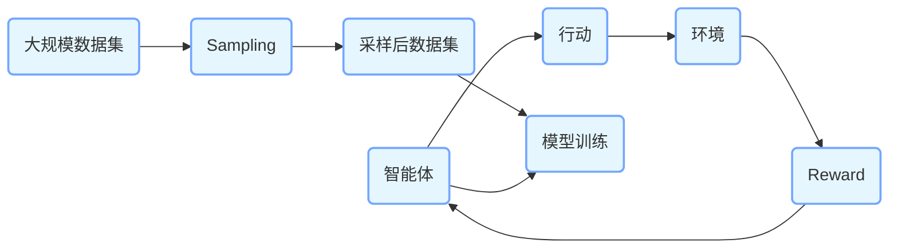

# Sampling+reward减少人类标注依赖的可行性

> 关键词：Sampling、reward、人类标注依赖、可行性分析、机器学习

> 摘要：本文旨在深入探讨通过Sampling（采样）和reward（奖励）机制来减少人类标注依赖的可行性。首先介绍了研究的背景、目的、预期读者和文档结构等内容。接着阐述了Sampling和reward的核心概念及其联系，详细讲解了相关核心算法原理和具体操作步骤，并给出了Python源代码示例。通过数学模型和公式进一步剖析其内在原理，并举例说明。在项目实战部分，提供了开发环境搭建的方法、源代码的详细实现与解读。分析了实际应用场景，推荐了相关的工具和资源，包括学习资源、开发工具框架以及论文著作等。最后总结了未来发展趋势与挑战，解答了常见问题，并列出了扩展阅读和参考资料，为减少人类标注依赖的研究和实践提供全面的指导。

## 1. 背景介绍 
### 1.1 目的和范围
在机器学习和人工智能领域，数据标注是一项成本高昂且耗时的工作。人类标注需要专业的人员投入大量的时间和精力，这不仅限制了数据的规模，也增加了项目的成本。本研究的目的是探讨利用Sampling（采样）和reward（奖励）机制来减少人类标注依赖的可行性。研究范围涵盖了相关核心概念的阐述、算法原理的分析、实际应用场景的探讨以及工具和资源的推荐等方面。

### 1.2 预期读者
本文的预期读者包括机器学习研究者、数据科学家、人工智能开发者以及对减少数据标注成本感兴趣的技术人员。对于那些希望在不依赖大量人类标注的情况下提高模型性能的专业人士具有一定的参考价值。

### 1.3 文档结构概述
本文将按照以下结构进行阐述：首先介绍核心概念与联系，包括Sampling和reward的原理和架构；接着详细讲解核心算法原理和具体操作步骤，并给出Python代码示例；通过数学模型和公式进一步剖析其内在原理；在项目实战部分，提供开发环境搭建、源代码实现与解读；分析实际应用场景；推荐相关的工具和资源；最后总结未来发展趋势与挑战，解答常见问题并列出参考资料。

### 1.4 术语表
#### 1.4.1 核心术语定义
- **Sampling（采样）**：从大规模数据集中选取一部分数据的过程，目的是在不处理整个数据集的情况下，获取具有代表性的数据子集。
- **Reward（奖励）**：在强化学习等领域中，用于衡量智能体行为好坏的数值反馈，智能体通过最大化奖励来学习最优策略。
- **人类标注依赖**：指机器学习模型的训练和优化过程过度依赖人类手动标注的数据。

#### 1.4.2 相关概念解释
- **主动学习**：一种机器学习方法，通过选择最有价值的数据进行标注，以提高标注效率和模型性能。
- **强化学习**：智能体通过与环境进行交互，根据环境反馈的奖励来学习最优行为策略的机器学习方法。

#### 1.4.3 缩略词列表
- **RL**：Reinforcement Learning，强化学习
- **AL**：Active Learning，主动学习

## 2. 核心概念与联系 

### 核心概念原理
#### Sampling
Sampling是从大规模数据集中选取一部分数据的过程。常见的采样方法包括随机采样、分层采样、聚类采样等。随机采样是最简单的方法，它从数据集中随机选取样本；分层采样则根据数据的某些特征将数据集划分为不同的层，然后从每层中进行采样；聚类采样是先对数据集进行聚类，然后从每个聚类中选取样本。采样的目的是在不处理整个数据集的情况下，获取具有代表性的数据子集，从而减少计算量和标注成本。

#### Reward
Reward是强化学习中的一个重要概念，用于衡量智能体行为的好坏。智能体在与环境进行交互时，会采取一系列的行动，环境会根据智能体的行动给出相应的奖励。智能体的目标是通过学习，最大化长期累积奖励。奖励可以是即时的，也可以是延迟的。例如，在游戏中，智能体每完成一个任务可能会立即获得一个奖励；而在一些复杂的决策问题中，奖励可能要在一系列行动之后才能得到。

### 架构示意图


该示意图展示了Sampling和reward的核心架构。首先，从大规模数据集中进行采样，得到采样后数据集。智能体在环境中采取行动，环境根据行动给出奖励，智能体通过最大化奖励来学习。采样后数据集和智能体的学习结果共同用于模型训练。

## 3. 核心算法原理 & 具体操作步骤 

### 核心算法原理
#### Sampling算法
以随机采样为例，随机采样的原理是从数据集中随机选取样本，每个样本被选中的概率相等。在Python中，可以使用`random`模块来实现随机采样。

```python
import random

def random_sampling(data, sample_size):
    """
    随机采样函数
    :param data: 数据集
    :param sample_size: 采样大小
    :return: 采样后的数据集
    """
    return random.sample(data, sample_size)

# 示例数据集
data = [i for i in range(100)]
sample_size = 10
sampled_data = random_sampling(data, sample_size)
print(sampled_data)
```

#### Reward机制
在强化学习中，常用的奖励机制是基于策略梯度的方法。策略梯度方法通过最大化累积奖励来更新智能体的策略。以简单的强化学习环境为例，假设智能体在一个二维网格世界中移动，目标是到达终点。智能体每次移动会得到一个奖励，如果到达终点则得到一个较大的正奖励，如果撞到障碍物则得到一个负奖励。

```python
import numpy as np

# 定义环境参数
grid_size = 5
start_state = (0, 0)
end_state = (grid_size - 1, grid_size - 1)
obstacles = [(2, 2), (3, 3)]

# 定义奖励函数
def get_reward(state, action):
    """
    获取奖励
    :param state: 当前状态
    :param action: 行动
    :return: 奖励
    """
    next_state = (state[0] + action[0], state[1] + action[1])
    if next_state == end_state:
        return 10
    elif next_state in obstacles:
        return -5
    elif next_state[0] < 0 or next_state[0] >= grid_size or next_state[1] < 0 or next_state[1] >= grid_size:
        return -1
    else:
        return -0.1

# 示例
state = start_state
action = (1, 0)
reward = get_reward(state, action)
print(f"当前状态: {state}, 行动: {action}, 奖励: {reward}")
```

### 具体操作步骤
1. **数据采样**：根据数据集的特点选择合适的采样方法，如随机采样、分层采样等。使用采样函数从大规模数据集中选取一部分数据作为采样后数据集。
2. **定义奖励机制**：根据具体的应用场景，定义合适的奖励函数。奖励函数应该能够准确地衡量智能体行为的好坏。
3. **智能体学习**：使用强化学习算法，如策略梯度算法，让智能体在环境中进行学习。智能体根据奖励函数的反馈，不断调整自己的策略，以最大化累积奖励。
4. **模型训练**：使用采样后数据集和智能体的学习结果对模型进行训练。

## 4. 数学模型和公式 & 详细讲解 & 举例说明 

### 随机采样数学模型
假设数据集 $D$ 包含 $N$ 个样本，即 $D = \{x_1, x_2, \cdots, x_N\}$。随机采样是从 $D$ 中选取 $n$ 个样本，每个样本被选中的概率为 $p = \frac{n}{N}$。对于任意一个样本 $x_i$，它被选中的概率可以表示为：

$$P(x_i \in S) = \frac{n}{N}$$

其中 $S$ 是采样后的数据集。

例如，有一个包含 100 个样本的数据集，要从中随机选取 10 个样本。那么每个样本被选中的概率为 $\frac{10}{100} = 0.1$。

### 策略梯度算法数学模型
在强化学习中，策略梯度算法的目标是最大化累积奖励。设策略函数为 $\pi_{\theta}(a|s)$，表示在状态 $s$ 下采取行动 $a$ 的概率，其中 $\theta$ 是策略函数的参数。累积奖励可以表示为：

$$J(\theta) = \mathbb{E}_{\tau \sim \pi_{\theta}} \left[ \sum_{t=0}^{T} r_t \right]$$

其中 $\tau = (s_0, a_0, r_0, s_1, a_1, r_1, \cdots, s_T, a_T, r_T)$ 是一个轨迹，$r_t$ 是在时间步 $t$ 获得的奖励。

策略梯度算法通过梯度上升的方法来更新策略函数的参数 $\theta$，更新公式为：

$$\theta \leftarrow \theta + \alpha \nabla_{\theta} J(\theta)$$

其中 $\alpha$ 是学习率，$\nabla_{\theta} J(\theta)$ 是 $J(\theta)$ 关于 $\theta$ 的梯度。

根据策略梯度定理，$\nabla_{\theta} J(\theta)$ 可以近似表示为：

$$\nabla_{\theta} J(\theta) \approx \frac{1}{M} \sum_{i=1}^{M} \sum_{t=0}^{T_i} \nabla_{\theta} \log \pi_{\theta}(a_{i,t}|s_{i,t}) G_{i,t}$$

其中 $M$ 是轨迹的数量，$T_i$ 是第 $i$ 条轨迹的长度，$G_{i,t}$ 是从时间步 $t$ 开始的累积奖励。

例如，在一个简单的网格世界中，智能体的策略是一个神经网络，其参数为 $\theta$。智能体在环境中进行多次试验，每次试验得到一个轨迹。根据上述公式，计算 $\nabla_{\theta} J(\theta)$，并更新 $\theta$，使得智能体的策略逐渐优化。

## 5. 项目实战：代码实际案例和详细解释说明 

### 5.1  开发环境搭建
#### 安装Python
首先，确保你已经安装了Python 3.x 版本。可以从Python官方网站（https://www.python.org/downloads/） 下载并安装适合你操作系统的Python版本。

#### 安装必要的库
在项目中，我们需要使用一些Python库，如`numpy`、`matplotlib`等。可以使用以下命令来安装这些库：

```sh
pip install numpy matplotlib
```

### 5.2  源代码详细实现和代码解读
#### 完整代码示例
```python
import numpy as np
import random

# 定义环境参数
grid_size = 5
start_state = (0, 0)
end_state = (grid_size - 1, grid_size - 1)
obstacles = [(2, 2), (3, 3)]

# 定义动作空间
actions = [(0, 1), (0, -1), (1, 0), (-1, 0)]

# 定义奖励函数
def get_reward(state, action):
    """
    获取奖励
    :param state: 当前状态
    :param action: 行动
    :return: 奖励
    """
    next_state = (state[0] + action[0], state[1] + action[1])
    if next_state == end_state:
        return 10
    elif next_state in obstacles:
        return -5
    elif next_state[0] < 0 or next_state[0] >= grid_size or next_state[1] < 0 or next_state[1] >= grid_size:
        return -1
    else:
        return -0.1

# 定义策略函数
def policy(state, theta):
    """
    策略函数
    :param state: 当前状态
    :param theta: 策略参数
    :return: 行动
    """
    action_probs = []
    for action in actions:
        feature = np.array([state[0], state[1], action[0], action[1]])
        logit = np.dot(theta, feature)
        action_probs.append(logit)
    action_probs = np.exp(action_probs) / np.sum(np.exp(action_probs))
    action_index = np.random.choice(len(actions), p=action_probs)
    return actions[action_index]

# 定义策略梯度算法
def policy_gradient(num_episodes, learning_rate):
    """
    策略梯度算法
    :param num_episodes: 训练轮数
    :param learning_rate: 学习率
    :return: 训练后的策略参数
    """
    theta = np.random.rand(4)
    for episode in range(num_episodes):
        state = start_state
        trajectory = []
        rewards = []
        while state!= end_state:
            action = policy(state, theta)
            reward = get_reward(state, action)
            next_state = (state[0] + action[0], state[1] + action[1])
            trajectory.append((state, action))
            rewards.append(reward)
            state = next_state
        G = []
        discounted_reward = 0
        for reward in reversed(rewards):
            discounted_reward = reward + 0.9 * discounted_reward
            G.insert(0, discounted_reward)
        for t in range(len(trajectory)):
            state, action = trajectory[t]
            feature = np.array([state[0], state[1], action[0], action[1]])
            action_index = actions.index(action)
            action_probs = []
            for a in actions:
                f = np.array([state[0], state[1], a[0], a[1]])
                logit = np.dot(theta, f)
                action_probs.append(logit)
            action_probs = np.exp(action_probs) / np.sum(np.exp(action_probs))
            score = feature - np.sum([action_probs[i] * np.array([state[0], state[1], actions[i][0], actions[i][1]]) for i in range(len(actions))], axis=0)
            theta += learning_rate * G[t] * score
    return theta

# 训练模型
num_episodes = 1000
learning_rate = 0.01
theta = policy_gradient(num_episodes, learning_rate)

# 测试模型
state = start_state
path = [state]
while state!= end_state:
    action = policy(state, theta)
    next_state = (state[0] + action[0], state[1] + action[1])
    path.append(next_state)
    state = next_state

print("最优路径:", path)
```

#### 代码解读
1. **环境参数定义**：定义了网格世界的大小、起始状态、结束状态和障碍物的位置。
2. **动作空间定义**：定义了智能体可以采取的行动，包括上下左右移动。
3. **奖励函数**：根据智能体的当前状态和行动，计算奖励。如果到达终点，得到正奖励；如果撞到障碍物或越界，得到负奖励；否则得到一个小的负奖励。
4. **策略函数**：根据当前状态和策略参数，计算每个行动的概率，并随机选择一个行动。
5. **策略梯度算法**：在多个训练轮数中，智能体在环境中进行试验，记录轨迹和奖励。根据策略梯度定理，更新策略参数，使得智能体的策略逐渐优化。
6. **模型训练和测试**：使用策略梯度算法训练模型，然后测试模型，找到从起始状态到结束状态的最优路径。

### 5.3  代码解读与分析
#### 策略梯度算法的优势
策略梯度算法可以直接优化策略函数，不需要像基于值函数的方法那样先估计值函数。这使得策略梯度算法在处理连续动作空间和高维状态空间时具有优势。

#### 代码的可扩展性
代码中的环境参数和策略函数可以很容易地进行修改，以适应不同的应用场景。例如，可以改变网格世界的大小、障碍物的位置，或者使用不同的策略函数。

#### 可能的改进方向
可以引入更复杂的奖励机制，如延迟奖励、稀疏奖励等，以提高智能体的学习效率。还可以使用更先进的优化算法，如Adam优化器，来加速模型的训练。

## 6. 实际应用场景 
### 自然语言处理
在自然语言处理中，数据标注是一项非常耗时的工作。例如，在文本分类任务中，需要人工对大量的文本进行分类标注。通过Sampling和reward机制，可以选择最有价值的文本进行标注，同时使用强化学习让模型在未标注的数据上进行学习，从而减少人类标注的依赖。

### 计算机视觉
在计算机视觉领域，图像标注也需要大量的人力。例如，在目标检测任务中，需要人工标注图像中的目标位置和类别。使用Sampling技术可以选择具有代表性的图像进行标注，同时通过reward机制让模型在未标注的图像上进行学习，提高模型的性能。

### 推荐系统
在推荐系统中，用户的反馈数据是有限的。通过Sampling和reward机制，可以选择最有潜力的用户进行反馈收集，同时使用强化学习让推荐系统根据用户的反馈进行优化，减少对大量用户标注数据的依赖。

## 7. 工具和资源推荐
### 7.1 学习资源推荐
#### 7.1.1 书籍推荐
- 《Reinforcement Learning: An Introduction》：由Richard S. Sutton和Andrew G. Barto编写，是强化学习领域的经典教材，详细介绍了强化学习的基本概念、算法和应用。
- 《Pattern Recognition and Machine Learning》：由Christopher M. Bishop编写，涵盖了机器学习的各个方面，包括采样方法、模型训练等内容。

#### 7.1.2 在线课程
- Coursera上的“Reinforcement Learning Specialization”：由DeepMind的研究人员授课，提供了强化学习的深入学习内容。
- edX上的“Artificial Intelligence”：介绍了人工智能的基本概念和算法，包括采样和奖励机制的应用。

#### 7.1.3 技术博客和网站
- OpenAI Blog：提供了人工智能领域的最新研究成果和技术应用。
- Towards Data Science：发布了大量关于机器学习和数据科学的技术文章。

### 7.2 开发工具框架推荐
#### 7.2.1 IDE和编辑器
- PyCharm：一款功能强大的Python集成开发环境，提供了代码编辑、调试、版本控制等功能。
- Jupyter Notebook：交互式的笔记本环境，适合进行数据探索和模型实验。

#### 7.2.2 调试和性能分析工具
- TensorBoard：TensorFlow提供的可视化工具，可以用于监控模型的训练过程和性能指标。
- Py-Spy：一个Python性能分析工具，可以帮助定位代码中的性能瓶颈。

#### 7.2.3 相关框架和库
- OpenAI Gym：一个开源的强化学习环境库，提供了多种不同的环境供开发者进行实验。
- Stable Baselines：基于OpenAI Gym的强化学习算法库，提供了多种预训练的强化学习模型。

### 7.3 相关论文著作推荐
#### 7.3.1 经典论文
- “Policy Gradient Methods for Reinforcement Learning with Function Approximation”：由Richard S. Sutton等人发表，介绍了策略梯度算法的基本原理和应用。
- “Active Learning Literature Survey”：对主动学习领域的研究进行了全面的综述。

#### 7.3.2 最新研究成果
- 关注顶级人工智能会议，如NeurIPS、ICML、CVPR等，这些会议上会发表关于Sampling和reward机制的最新研究成果。

#### 7.3.3 应用案例分析
- 可以在ACM Digital Library、IEEE Xplore等数据库中查找关于Sampling和reward机制在实际应用中的案例分析。

## 8. 总结：未来发展趋势与挑战
### 未来发展趋势
- **自动化标注技术的发展**：随着技术的进步，自动化标注技术将越来越成熟，如使用无监督学习和半监督学习方法进行数据标注，进一步减少人类标注的依赖。
- **多模态数据的应用**：未来的研究将更加关注多模态数据，如图像、文本、语音等的融合。Sampling和reward机制在多模态数据上的应用将成为一个重要的研究方向。
- **与其他技术的结合**：Sampling和reward机制将与其他技术，如深度学习、迁移学习等相结合，提高模型的性能和泛化能力。

### 挑战
- **奖励设计的困难**：设计合适的奖励函数是一个挑战，奖励函数需要准确地衡量智能体行为的好坏，同时要避免奖励函数的不稳定性和稀疏性。
- **采样方法的有效性**：选择合适的采样方法是减少人类标注依赖的关键。不同的采样方法在不同的数据集和应用场景下效果不同，需要进一步研究和优化。
- **计算资源的需求**：强化学习算法通常需要大量的计算资源，特别是在处理大规模数据集和复杂环境时。如何在有限的计算资源下提高算法的效率是一个亟待解决的问题。

## 9. 附录：常见问题与解答
### 问题1：Sampling和reward机制适用于所有的机器学习任务吗？
解答：不是所有的机器学习任务都适合使用Sampling和reward机制。一般来说，对于数据标注成本较高、数据规模较大的任务，如自然语言处理、计算机视觉等，Sampling和reward机制具有一定的优势。而对于一些数据标注相对容易、数据规模较小的任务，可能不需要使用这些机制。

### 问题2：如何选择合适的采样方法？
解答：选择合适的采样方法需要考虑数据集的特点和应用场景。如果数据集的分布比较均匀，可以使用随机采样；如果数据集存在明显的分层结构，可以使用分层采样；如果数据集具有聚类特性，可以使用聚类采样。此外，还可以根据具体任务的需求，选择主动学习等采样方法。

### 问题3：奖励函数的设计有哪些原则？
解答：奖励函数的设计需要遵循以下原则：
- **明确性**：奖励函数应该能够明确地衡量智能体行为的好坏。
- **稳定性**：奖励函数应该具有一定的稳定性，避免奖励的剧烈波动。
- **稀疏性控制**：奖励函数的稀疏性需要适当控制，避免奖励过于稀疏导致智能体学习困难。

## 10. 扩展阅读 & 参考资料
### 扩展阅读
- 《Deep Reinforcement Learning Hands-On》：提供了强化学习的实践指南，包括代码实现和案例分析。
- 《Machine Learning Yearning》：由Andrew Ng编写，介绍了机器学习项目的实践经验和技巧。

### 参考资料
- Sutton, R. S., & Barto, A. G. (2018). Reinforcement Learning: An Introduction. MIT press.
- Bishop, C. M. (2006). Pattern Recognition and Machine Learning. Springer.

作者：AI天才研究院/AI Genius Institute & 禅与计算机程序设计艺术 /Zen And The Art of Computer Programming