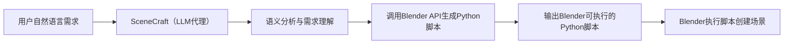

# SceneCraft:生成Blender可执行Python脚本的LLM代理

> 关键词：SceneCraft、LLM代理、Blender、Python脚本、生成式AI

> 摘要：本文围绕SceneCraft这一能够生成Blender可执行Python脚本的LLM代理展开深入探讨。首先介绍了其产生的背景、目的、适用读者群体及文档结构等内容。接着详细阐述了核心概念、算法原理、数学模型，通过Python代码对算法进行了细致的分析。同时给出了项目实战案例，从开发环境搭建到源代码实现与解读都进行了全面的说明。还探讨了SceneCraft在实际中的应用场景，推荐了相关的学习资源、开发工具框架以及论文著作。最后对其未来发展趋势与挑战进行了总结，并提供了常见问题解答和扩展阅读参考资料。

## 1. 背景介绍 
### 1.1 目的和范围
在3D建模与动画制作领域，Blender是一款功能强大且开源的软件。然而，手动编写Blender可执行的Python脚本对于许多用户来说具有一定的难度，尤其是那些非专业编程人员。SceneCraft作为一种LLM（大语言模型）代理，其目的就是为了降低在Blender中使用Python脚本进行场景创建、模型操作等任务的门槛。

本文章的范围将涵盖SceneCraft的核心概念、算法原理、数学模型，通过实际的项目案例展示其使用方法，同时探讨其在不同场景下的应用，还会为读者推荐相关的学习资源、开发工具以及论文著作等。

### 1.2 预期读者
本文预期读者包括Blender的初学者和有一定使用经验但在Python脚本编写方面存在困难的用户。同时，对生成式AI在3D建模领域应用感兴趣的研究人员和开发者也能从本文中获取有价值的信息。对于想要深入了解LLM代理与专业软件结合应用的技术爱好者，本文同样具有参考意义。

### 1.3 文档结构概述
本文将按照以下结构进行组织：首先介绍核心概念与联系，通过文本示意图和Mermaid流程图展示SceneCraft的工作原理和架构；接着详细阐述核心算法原理，并使用Python源代码进行说明；之后介绍相关的数学模型和公式，并举例说明；然后通过项目实战，从开发环境搭建到源代码实现与解读进行详细介绍；再探讨SceneCraft的实际应用场景；随后推荐相关的工具和资源；最后对其未来发展趋势与挑战进行总结，并提供常见问题解答和扩展阅读参考资料。

### 1.4 术语表
#### 1.4.1 核心术语定义
- **SceneCraft**：一种基于LLM的代理，能够根据用户的需求生成Blender可执行的Python脚本。
- **LLM（大语言模型）**：一种基于深度学习的语言模型，能够处理和生成自然语言文本，具有强大的语言理解和生成能力。
- **Blender**：一款开源的3D建模、动画制作、渲染等多功能软件，支持使用Python脚本进行自动化操作。
- **Python脚本**：一种使用Python语言编写的程序，在Blender中可以用于控制场景的创建、模型的操作、动画的设置等。

#### 1.4.2 相关概念解释
- **代理（Agent）**：在计算机科学中，代理是一种能够感知环境、做出决策并采取行动的实体。SceneCraft作为LLM代理，能够理解用户的自然语言需求，并生成相应的Blender Python脚本作为行动。
- **生成式AI**：指能够生成新的内容，如文本、图像、音频等的人工智能技术。SceneCraft利用生成式AI的能力生成Blender脚本。

#### 1.4.3 缩略词列表
- **LLM**：Large Language Model（大语言模型）

## 2. 核心概念与联系 
### 核心概念原理
SceneCraft的核心原理是利用大语言模型的强大语言理解和生成能力。用户通过自然语言描述自己在Blender中想要实现的场景、模型操作等需求，例如“在Blender中创建一个红色的立方体并将其移动到坐标(1, 2, 3)的位置”。SceneCraft接收这个自然语言输入后，会对其进行语义分析，理解用户的具体需求。

然后，它会根据对Blender API（应用程序编程接口）的知识储备，将用户需求转化为Blender可执行的Python脚本。Blender的API提供了一系列的函数和类，用于控制场景的各个方面，如创建对象、设置材质、调整动画等。SceneCraft就是通过调用这些API来生成脚本。

### 架构的文本示意图
```plaintext
用户自然语言需求 ---> SceneCraft（LLM代理）
                              |
                              v
                   语义分析与需求理解
                              |
                              v
                   调用Blender API生成Python脚本
                              |
                              v
              输出Blender可执行的Python脚本
                              |
                              v
                   Blender执行脚本创建场景
```

### Mermaid流程图


## 3. 核心算法原理 & 具体操作步骤 
### 核心算法原理
SceneCraft的核心算法主要基于大语言模型的微调技术。首先，需要准备一个包含大量Blender操作描述和对应Python脚本的数据集。这个数据集可以通过收集Blender用户的实际脚本和相关的自然语言描述来构建。

然后，使用这个数据集对预训练的大语言模型进行微调。微调的过程就是让模型学习如何将自然语言描述映射到Blender Python脚本。在微调过程中，使用交叉熵损失函数来衡量模型生成的脚本与真实脚本之间的差异，并通过反向传播算法更新模型的参数，使得损失函数的值逐渐减小。

以下是一个简化的Python代码示例，展示了如何使用Hugging Face的Transformers库对大语言模型进行微调：

```python
from transformers import AutoTokenizer, AutoModelForCausalLM, TrainingArguments, Trainer
import torch

# 加载预训练的大语言模型和分词器
tokenizer = AutoTokenizer.from_pretrained("gpt2")
model = AutoModelForCausalLM.from_pretrained("gpt2")

# 准备数据集
# 这里假设我们有一个包含自然语言描述和对应Python脚本的数据集
# 数据集格式为 [{"input_text": "在Blender中创建一个立方体", "target_text": "import bpy; bpy.ops.mesh.primitive_cube_add()"}]
dataset = [{"input_text": "在Blender中创建一个立方体", "target_text": "import bpy; bpy.ops.mesh.primitive_cube_add()"}]

# 对数据集进行编码
def preprocess_function(examples):
    inputs = [f"需求: {example['input_text']}" for example in examples]
    targets = [example['target_text'] for example in examples]
    model_inputs = tokenizer(inputs, truncation=True)
    labels = tokenizer(targets, truncation=True)
    model_inputs["labels"] = labels["input_ids"]
    return model_inputs

encoded_dataset = dataset.map(preprocess_function, batched=True)

# 定义训练参数
training_args = TrainingArguments(
    output_dir='./results',
    num_train_epochs=3,
    per_device_train_batch_size=4,
    save_steps=10_000,
    save_total_limit=2,
    prediction_loss_only=True,
)

# 定义训练器
trainer = Trainer(
    model=model,
    args=training_args,
    train_dataset=encoded_dataset,
)

# 开始训练
trainer.train()
```

### 具体操作步骤
1. **数据收集与预处理**：收集大量的Blender操作描述和对应Python脚本，构建数据集。对数据集进行清洗、标注等预处理操作。
2. **模型选择与加载**：选择合适的预训练大语言模型，如GPT - 2、T5等，并使用相应的库加载模型和分词器。
3. **数据集编码**：使用分词器对数据集进行编码，将自然语言描述和Python脚本转换为模型可以处理的输入和标签。
4. **定义训练参数**：设置训练的轮数、批次大小、保存步骤等参数。
5. **定义训练器**：使用训练参数和数据集创建训练器。
6. **模型训练**：调用训练器的`train`方法开始训练模型。
7. **模型评估与优化**：在验证集上评估模型的性能，根据评估结果调整模型的参数和训练策略。

## 4. 数学模型和公式 & 详细讲解 & 举例说明 
### 数学模型
SceneCraft的核心数学模型基于神经网络，特别是Transformer架构。Transformer架构由多个编码器和解码器层组成，每个层包含多头自注意力机制和前馈神经网络。

在微调过程中，使用的损失函数是交叉熵损失函数。假设模型的输出概率分布为 $P(y|x)$，其中 $x$ 是输入的自然语言描述，$y$ 是真实的Python脚本，那么交叉熵损失函数的定义为：

$$
L = - \sum_{i=1}^{N} y_{i} \log(P(y_{i}|x))
$$

其中 $N$ 是输出序列的长度，$y_{i}$ 是真实标签的第 $i$ 个元素。

### 详细讲解
交叉熵损失函数的作用是衡量模型输出的概率分布与真实标签之间的差异。当模型输出的概率分布与真实标签越接近时，交叉熵损失函数的值越小。在训练过程中，通过反向传播算法计算损失函数对模型参数的梯度，并使用优化算法（如Adam）更新模型的参数，使得损失函数的值逐渐减小。

多头自注意力机制是Transformer架构的核心组件之一，它允许模型在处理输入序列时，关注序列中不同位置的信息。多头自注意力机制的计算公式如下：

$$
\text{Attention}(Q, K, V) = \text{softmax}\left(\frac{QK^{T}}{\sqrt{d_{k}}}\right)V
$$

其中 $Q$、$K$、$V$ 分别是查询矩阵、键矩阵和值矩阵，$d_{k}$ 是键向量的维度。

### 举例说明
假设我们有一个输入序列 $x = [x_{1}, x_{2}, x_{3}]$，模型的目标是生成一个输出序列 $y = [y_{1}, y_{2}, y_{3}]$。在训练过程中，模型会根据输入序列 $x$ 生成一个概率分布 $P(y|x)$。例如，对于 $y_{1}$，模型可能输出 $P(y_{1}|x) = [0.2, 0.3, 0.5]$，表示 $y_{1}$ 取三个不同值的概率分别为 0.2、0.3 和 0.5。如果真实标签 $y_{1}$ 的值对应的索引为 2，那么交叉熵损失函数在这一步的计算为：

$$
L_{1} = - \log(0.5)
$$

然后将所有步骤的损失相加，得到总的交叉熵损失 $L$。

## 5. 项目实战：代码实际案例和详细解释说明 
### 5.1  开发环境搭建
#### 安装Blender
首先，从Blender官方网站（https://www.blender.org/download/）下载并安装适合你操作系统的Blender版本。安装完成后，打开Blender，确保其能够正常运行。

#### 安装Python环境
SceneCraft使用Python进行开发，因此需要安装Python环境。建议使用Python 3.7及以上版本。可以从Python官方网站（https://www.python.org/downloads/）下载并安装Python。

#### 安装必要的Python库
使用以下命令安装必要的Python库：
```bash
pip install transformers torch
```

### 5.2  源代码详细实现和代码解读
以下是一个简单的SceneCraft实现示例，用于根据用户的自然语言需求生成Blender可执行的Python脚本：

```python
from transformers import AutoTokenizer, AutoModelForCausalLM

# 加载微调后的模型和分词器
tokenizer = AutoTokenizer.from_pretrained("fine_tuned_model")
model = AutoModelForCausalLM.from_pretrained("fine_tuned_model")

def generate_blender_script(user_input):
    # 对用户输入进行编码
    input_ids = tokenizer.encode(f"需求: {user_input}", return_tensors="pt")
    
    # 生成脚本
    output = model.generate(input_ids, max_length=200, num_beams=5, no_repeat_ngram_size=2, early_stopping=True)
    
    # 解码生成的脚本
    generated_script = tokenizer.decode(output[0], skip_special_tokens=True)
    
    return generated_script

# 用户输入示例
user_input = "在Blender中创建一个红色的球体"

# 生成脚本
script = generate_blender_script(user_input)

print("生成的Blender脚本:")
print(script)
```

### 代码解读与分析
1. **加载模型和分词器**：使用`AutoTokenizer`和`AutoModelForCausalLM`从微调后的模型目录中加载分词器和模型。
2. **`generate_blender_script`函数**：该函数接收用户的自然语言输入，首先对输入进行编码，然后使用模型生成脚本，最后对生成的脚本进行解码并返回。
3. **生成脚本**：调用`model.generate`方法生成脚本，设置了最大长度、束搜索的束数等参数。
4. **用户输入和输出**：定义了一个用户输入示例，调用`generate_blender_script`函数生成脚本并打印输出。

## 6. 实际应用场景 
### 3D建模初学者
对于3D建模初学者来说，他们可能对Blender的操作和Python脚本编写都不太熟悉。SceneCraft可以帮助他们快速实现自己的创意，只需用自然语言描述想要创建的场景或模型，就可以得到相应的Blender Python脚本，从而降低了学习成本和操作难度。

### 游戏开发
在游戏开发中，需要创建大量的3D场景和模型。SceneCraft可以根据游戏设计师的需求，快速生成Blender脚本，用于创建游戏中的各种元素，如地形、建筑、道具等，提高开发效率。

### 动画制作
动画制作涉及到复杂的场景设置、角色动画等操作。使用SceneCraft，动画师可以通过自然语言描述动画的情节和效果，生成相应的Blender脚本，自动完成场景的搭建和动画的设置，节省时间和精力。

### 虚拟展览
在虚拟展览的创建中，需要快速搭建各种展览场景。SceneCraft可以根据展览的主题和布局要求，生成Blender脚本，创建出逼真的虚拟展览空间。

## 7. 工具和资源推荐
### 7.1 学习资源推荐
#### 7.1.1 书籍推荐
- 《Blender基础教程》：这本书详细介绍了Blender的基本操作和功能，适合初学者入门。
- 《Python编程从入门到实践》：帮助读者掌握Python编程的基础知识和技巧，为使用Blender Python脚本打下基础。
- 《深度学习入门：基于Python的理论与实现》：对深度学习的基本概念和算法进行了深入浅出的讲解，有助于理解SceneCraft背后的技术原理。

#### 7.1.2 在线课程
- Coursera上的“Blender 3D:从新手到专家”课程：由专业的Blender讲师授课，涵盖了Blender的各个方面。
- Udemy上的“Python编程速成班”：快速掌握Python编程的要点。
- 吴恩达的深度学习系列课程：深入学习深度学习的理论和实践。

#### 7.1.3 技术博客和网站
- Blender官方文档：提供了Blender的详细文档和教程。
- Hugging Face官方博客：发布了关于大语言模型的最新研究成果和应用案例。
- Stack Overflow：一个技术问答社区，可以在这里找到关于Blender和Python编程的各种问题的解决方案。

### 7.2 开发工具框架推荐
#### 7.2.1 IDE和编辑器
- PyCharm：一款功能强大的Python集成开发环境，提供了代码编辑、调试、版本控制等功能。
- Visual Studio Code：轻量级的代码编辑器，支持多种编程语言，并且有丰富的插件可以扩展功能。

#### 7.2.2 调试和性能分析工具
- PDB：Python自带的调试工具，可以帮助开发者定位代码中的问题。
- cProfile：用于分析Python代码的性能，找出代码中的瓶颈。

#### 7.2.3 相关框架和库
- Transformers：Hugging Face开发的用于处理自然语言的库，提供了各种预训练的大语言模型。
- PyTorch：一个深度学习框架，用于构建和训练神经网络。

### 7.3 相关论文著作推荐
#### 7.3.1 经典论文
- “Attention Is All You Need”：介绍了Transformer架构，是自然语言处理领域的经典论文。
- “Improving Language Understanding by Generative Pre - Training”：提出了预训练语言模型的概念。

#### 7.3.2 最新研究成果
- 关注顶级学术会议（如ACL、NeurIPS等）上关于大语言模型和3D建模结合的研究论文。

#### 7.3.3 应用案例分析
- 查看相关的技术博客和研究报告，了解SceneCraft和类似技术在实际项目中的应用案例。

## 8. 总结：未来发展趋势与挑战
### 未来发展趋势
- **功能增强**：SceneCraft未来可能会支持更复杂的Blender操作，如高级材质设置、物理模拟等，能够处理更丰富多样的用户需求。
- **多模态融合**：结合图像、音频等多模态信息，用户可以通过图片、语音等方式输入需求，进一步提高交互的便捷性。
- **与其他软件集成**：不仅局限于Blender，还可以与其他3D建模、动画制作软件集成，扩大应用范围。

### 挑战
- **准确性问题**：虽然大语言模型有很强的生成能力，但在理解一些复杂、模糊的用户需求时，可能会生成不准确的脚本，需要进一步提高模型的语义理解能力。
- **数据隐私和安全**：在使用大语言模型时，涉及到大量的数据，如何保证用户数据的隐私和安全是一个重要的挑战。
- **计算资源需求**：训练和运行大语言模型需要大量的计算资源，如何降低计算成本，提高效率是需要解决的问题。

## 9. 附录：常见问题与解答
### Q1：SceneCraft生成的脚本一定能在Blender中正常运行吗？
A：不一定。由于自然语言的模糊性和模型的局限性，生成的脚本可能存在错误。在运行脚本前，建议仔细检查脚本内容，并在Blender中进行测试和调试。

### Q2：如何提高SceneCraft生成脚本的质量？
A：可以通过增加训练数据的多样性和数量，对模型进行更精细的微调，以及优化模型的超参数等方式来提高生成脚本的质量。

### Q3：SceneCraft可以在哪些操作系统上使用？
A：只要安装了Blender和Python环境，SceneCraft可以在Windows、Mac OS和Linux等主流操作系统上使用。

## 10. 扩展阅读 & 参考资料
- Blender官方文档：https://docs.blender.org/manual/en/latest/
- Hugging Face官方文档：https://huggingface.co/docs/transformers/index
- 《深度学习》（花书），作者：Ian Goodfellow、Yoshua Bengio和Aaron Courville

作者：AI天才研究院/AI Genius Institute & 禅与计算机程序设计艺术 /Zen And The Art of Computer Programming