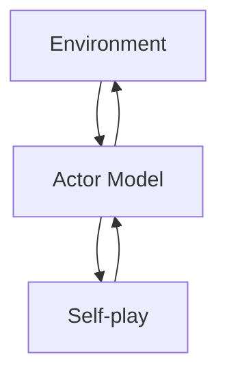

# Self-play方式对actor模型效果提升的评估

> 关键词：Self-play、actor模型、效果评估、强化学习、策略优化

> 摘要：本文旨在深入探讨Self-play方式对actor模型效果的提升。首先介绍了相关背景知识，包括研究目的、预期读者、文档结构等。接着详细阐述了Self-play和actor模型的核心概念及其联系，并给出了相应的原理和架构示意图与流程图。然后讲解了核心算法原理，使用Python代码进行详细说明，同时介绍了相关的数学模型和公式。通过项目实战，展示了如何搭建开发环境、实现源代码并进行解读。分析了Self-play在实际中的应用场景，推荐了学习资源、开发工具框架和相关论文著作。最后总结了未来发展趋势与挑战，并给出常见问题解答和扩展阅读参考资料，为研究Self-play对actor模型效果提升提供了全面而深入的分析。

## 1. 背景介绍 
### 1.1 目的和范围
在强化学习领域，actor模型用于生成策略，而Self-play是一种有效的训练方法。本研究的目的是评估Self-play方式对actor模型效果的提升程度。具体范围包括研究Self-play的原理、actor模型的基本结构和工作机制，通过理论分析和实际实验来量化Self-play对actor模型在性能指标（如胜率、奖励累积等）上的影响。

### 1.2 预期读者
本文预期读者包括对强化学习、人工智能领域感兴趣的研究人员、开发者和学生。对于正在学习强化学习算法，尤其是对策略优化和模型训练方法有深入研究需求的人员具有较高的参考价值。

### 1.3 文档结构概述
本文首先介绍背景知识，让读者了解研究的目的和相关概念。接着阐述核心概念与联系，包括Self-play和actor模型的原理和架构。然后详细讲解核心算法原理和具体操作步骤，使用Python代码进行说明。通过数学模型和公式进一步深入分析。项目实战部分展示了实际代码案例和详细解释。分析实际应用场景，推荐相关的学习资源、开发工具框架和论文著作。最后总结未来发展趋势与挑战，给出常见问题解答和扩展阅读参考资料。

### 1.4 术语表
#### 1.4.1 核心术语定义
- **Self-play**：指智能体与自身的不同版本或克隆体进行对战训练的方式，在训练过程中不断优化自身策略。
- **actor模型**：在强化学习中，actor模型负责生成动作策略，根据当前状态输出动作的概率分布。
- **强化学习**：一种机器学习范式，智能体通过与环境进行交互，根据环境反馈的奖励信号来学习最优策略。

#### 1.4.2 相关概念解释
- **策略梯度**：一种用于优化actor模型的方法，通过计算策略的梯度来更新模型参数，使得策略朝着获得更高奖励的方向调整。
- **奖励函数**：在强化学习中，奖励函数用于衡量智能体在某个状态下采取某个动作的好坏程度，是智能体学习的目标。

#### 1.4.3 缩略词列表
- **RL**：Reinforcement Learning，强化学习
- **PG**：Policy Gradient，策略梯度

## 2. 核心概念与联系 

### 2.1 Self-play原理
Self-play的核心思想是让智能体在训练过程中与自己或自己的历史版本进行对战。通过这种方式，智能体可以不断探索新的策略和应对不同的情况。例如，在棋类游戏中，智能体可以通过与自己对弈，尝试不同的开局和走法，从而发现更优的策略。

### 2.2 actor模型原理
actor模型是基于策略梯度的强化学习模型。它的输入是环境的状态，输出是动作的概率分布。智能体根据这个概率分布选择动作与环境进行交互，然后根据环境反馈的奖励来更新模型参数。具体来说，actor模型通过最大化长期累积奖励来优化策略。

### 2.3 两者联系
Self-play为actor模型提供了丰富的训练数据和多样化的对手。在Self-play过程中，actor模型不断与不同版本的自己对战，遇到各种不同的局面和策略，从而能够学习到更全面、更鲁棒的策略。同时，actor模型的优化结果也会影响Self-play的效果，因为更优的策略会在对战中获得更高的胜率，从而进一步推动模型的进化。

### 2.4 文本示意图
```plaintext
+------------------+
|    Environment   |
+------------------+
       ^     |
       |     v
+------------------+
|    Actor Model   |
+------------------+
       ^     |
       |     v
+------------------+
|    Self-play     |
+------------------+
```

### 2.5 Mermaid流程图


## 3. 核心算法原理 & 具体操作步骤 

### 3.1 策略梯度算法原理
策略梯度算法的目标是最大化智能体在环境中获得的长期累积奖励。设策略函数为 $\pi_{\theta}(a|s)$，表示在状态 $s$ 下采取动作 $a$ 的概率，其中 $\theta$ 是模型的参数。智能体与环境交互得到一系列的状态 - 动作对 $(s_1, a_1), (s_2, a_2), \cdots, (s_T, a_T)$，以及对应的奖励 $r_1, r_2, \cdots, r_T$。长期累积奖励 $R_t$ 可以表示为：
$$R_t = \sum_{k=t}^T \gamma^{k-t} r_k$$
其中 $\gamma$ 是折扣因子，用于平衡近期奖励和远期奖励。

策略梯度算法通过计算策略的梯度来更新模型参数 $\theta$，梯度计算公式为：
$$\nabla_{\theta} J(\theta) = \mathbb{E}_{\tau \sim \pi_{\theta}} \left[ \sum_{t=0}^T \nabla_{\theta} \log \pi_{\theta}(a_t|s_t) R_t \right]$$
其中 $\tau$ 表示一个完整的轨迹，即状态 - 动作 - 奖励序列。

### 3.2 具体操作步骤
#### 3.2.1 初始化
初始化actor模型的参数 $\theta$，设置折扣因子 $\gamma$ 和学习率 $\alpha$。

#### 3.2.2 采样
智能体根据当前策略 $\pi_{\theta}$ 与环境进行交互，采样得到一系列的状态 - 动作对 $(s_1, a_1), (s_2, a_2), \cdots, (s_T, a_T)$ 以及对应的奖励 $r_1, r_2, \cdots, r_T$。

#### 3.2.3 计算累积奖励
对于每个时间步 $t$，计算累积奖励 $R_t$。

#### 3.2.4 计算梯度
根据策略梯度公式计算梯度 $\nabla_{\theta} J(\theta)$。

#### 3.2.5 更新参数
使用梯度上升法更新模型参数：
$$\theta \leftarrow \theta + \alpha \nabla_{\theta} J(\theta)$$

#### 3.2.6 重复
重复步骤 3.2.2 - 3.2.5 直到模型收敛或达到预设的训练步数。

### 3.3 Python代码实现
```python
import torch
import torch.nn as nn
import torch.optim as optim
import numpy as np

# 定义actor模型
class Actor(nn.Module):
    def __init__(self, state_dim, action_dim):
        super(Actor, self).__init__()
        self.fc1 = nn.Linear(state_dim, 64)
        self.fc2 = nn.Linear(64, 64)
        self.fc3 = nn.Linear(64, action_dim)
        self.softmax = nn.Softmax(dim=-1)

    def forward(self, state):
        x = torch.relu(self.fc1(state))
        x = torch.relu(self.fc2(x))
        action_probs = self.softmax(self.fc3(x))
        return action_probs

# 策略梯度训练函数
def policy_gradient_training(state_dim, action_dim, num_episodes, gamma=0.99, lr=0.001):
    actor = Actor(state_dim, action_dim)
    optimizer = optim.Adam(actor.parameters(), lr=lr)

    for episode in range(num_episodes):
        states = []
        actions = []
        rewards = []

        # 初始化环境状态
        state = np.random.rand(state_dim)
        state = torch.FloatTensor(state)

        done = False
        while not done:
            action_probs = actor(state)
            action = torch.multinomial(action_probs, 1).item()

            states.append(state)
            actions.append(action)

            # 模拟环境交互，得到奖励和下一个状态
            reward = np.random.rand()
            next_state = np.random.rand(state_dim)
            next_state = torch.FloatTensor(next_state)

            rewards.append(reward)

            state = next_state

            # 模拟结束条件
            if np.random.rand() < 0.1:
                done = True

        # 计算累积奖励
        R = 0
        discounted_rewards = []
        for r in rewards[::-1]:
            R = r + gamma * R
            discounted_rewards.insert(0, R)
        discounted_rewards = torch.FloatTensor(discounted_rewards)

        # 计算梯度
        log_probs = []
        for state, action in zip(states, actions):
            action_probs = actor(state)
            log_prob = torch.log(action_probs[action])
            log_probs.append(log_prob)
        log_probs = torch.stack(log_probs)

        loss = -torch.sum(log_probs * discounted_rewards)

        # 更新参数
        optimizer.zero_grad()
        loss.backward()
        optimizer.step()

        if episode % 100 == 0:
            print(f"Episode {episode}: Loss = {loss.item()}")

    return actor

# 示例使用
state_dim = 10
action_dim = 5
num_episodes = 1000
trained_actor = policy_gradient_training(state_dim, action_dim, num_episodes)
```

## 4. 数学模型和公式 & 详细讲解 & 举例说明 

### 4.1 策略梯度公式推导
策略梯度的目标是最大化期望累积奖励 $J(\theta)$，可以表示为：
$$J(\theta) = \mathbb{E}_{\tau \sim \pi_{\theta}} \left[ \sum_{t=0}^T r(s_t, a_t) \right]$$
其中 $r(s_t, a_t)$ 表示在状态 $s_t$ 下采取动作 $a_t$ 获得的奖励。

根据重要性采样公式，我们可以将期望表示为：
$$J(\theta) = \int_{\tau} p(\tau; \theta) \sum_{t=0}^T r(s_t, a_t) d\tau$$
其中 $p(\tau; \theta)$ 是轨迹 $\tau$ 的概率分布，由策略 $\pi_{\theta}$ 决定。

对 $J(\theta)$ 求梯度：
$$\nabla_{\theta} J(\theta) = \nabla_{\theta} \int_{\tau} p(\tau; \theta) \sum_{t=0}^T r(s_t, a_t) d\tau$$
根据对数求导法则 $\nabla_{\theta} p(\tau; \theta) = p(\tau; \theta) \nabla_{\theta} \log p(\tau; \theta)$，可得：
$$\nabla_{\theta} J(\theta) = \int_{\tau} p(\tau; \theta) \nabla_{\theta} \log p(\tau; \theta) \sum_{t=0}^T r(s_t, a_t) d\tau$$
即：
$$\nabla_{\theta} J(\theta) = \mathbb{E}_{\tau \sim \pi_{\theta}} \left[ \nabla_{\theta} \log p(\tau; \theta) \sum_{t=0}^T r(s_t, a_t) \right]$$

由于 $p(\tau; \theta) = p(s_0) \prod_{t=0}^{T-1} \pi_{\theta}(a_t|s_t) p(s_{t+1}|s_t, a_t)$，其中 $p(s_0)$ 是初始状态的概率分布，$p(s_{t+1}|s_t, a_t)$ 是环境的状态转移概率。对 $\log p(\tau; \theta)$ 求梯度：
$$\nabla_{\theta} \log p(\tau; \theta) = \sum_{t=0}^{T-1} \nabla_{\theta} \log \pi_{\theta}(a_t|s_t)$$
因此，策略梯度公式为：
$$\nabla_{\theta} J(\theta) = \mathbb{E}_{\tau \sim \pi_{\theta}} \left[ \sum_{t=0}^{T-1} \nabla_{\theta} \log \pi_{\theta}(a_t|s_t) \sum_{k=t}^T r(s_k, a_k) \right]$$

### 4.2 折扣因子 $\gamma$ 的作用
折扣因子 $\gamma$ 用于平衡近期奖励和远期奖励。当 $\gamma$ 接近 1 时，智能体更关注远期奖励；当 $\gamma$ 接近 0 时，智能体更关注近期奖励。例如，在一个游戏中，如果 $\gamma = 0.9$，那么未来第 $n$ 步的奖励对当前决策的影响会以 $0.9^n$ 的比例衰减。

### 4.3 举例说明
假设一个简单的环境，状态空间为 $\{s_1, s_2\}$，动作空间为 $\{a_1, a_2\}$。初始状态为 $s_1$，智能体在 $s_1$ 状态下选择动作 $a_1$ 转移到 $s_2$，并获得奖励 $r_1 = 1$，在 $s_2$ 状态下选择动作 $a_2$ 结束游戏，获得奖励 $r_2 = 2$。

设折扣因子 $\gamma = 0.9$，则累积奖励 $R_1$ 和 $R_2$ 分别为：
$$R_1 = r_1 + \gamma r_2 = 1 + 0.9 \times 2 = 2.8$$
$$R_2 = r_2 = 2$$

假设策略函数 $\pi_{\theta}(a_1|s_1) = 0.6$，$\pi_{\theta}(a_2|s_2) = 0.7$，则 $\log \pi_{\theta}(a_1|s_1) = \log 0.6$，$\log \pi_{\theta}(a_2|s_2) = \log 0.7$。

根据策略梯度公式，梯度的一部分为：
$$\nabla_{\theta} \log \pi_{\theta}(a_1|s_1) R_1 + \nabla_{\theta} \log \pi_{\theta}(a_2|s_2) R_2$$

## 5. 项目实战：代码实际案例和详细解释说明 

### 5.1  开发环境搭建
#### 5.1.1 安装Python
确保系统中安装了Python 3.6及以上版本。可以从Python官方网站（https://www.python.org/downloads/）下载并安装。

#### 5.1.2 安装依赖库
使用以下命令安装必要的依赖库：
```sh
pip install torch numpy
```

### 5.2  源代码详细实现和代码解读
#### 5.2.1 定义actor模型
```python
class Actor(nn.Module):
    def __init__(self, state_dim, action_dim):
        super(Actor, self).__init__()
        self.fc1 = nn.Linear(state_dim, 64)
        self.fc2 = nn.Linear(64, 64)
        self.fc3 = nn.Linear(64, action_dim)
        self.softmax = nn.Softmax(dim=-1)

    def forward(self, state):
        x = torch.relu(self.fc1(state))
        x = torch.relu(self.fc2(x))
        action_probs = self.softmax(self.fc3(x))
        return action_probs
```
这段代码定义了一个简单的三层全连接神经网络作为actor模型。输入层的维度为 `state_dim`，输出层的维度为 `action_dim`，中间有两个隐藏层，每个隐藏层的维度为 64。最后使用 `Softmax` 函数将输出转换为动作的概率分布。

#### 5.2.2 策略梯度训练函数
```python
def policy_gradient_training(state_dim, action_dim, num_episodes, gamma=0.99, lr=0.001):
    actor = Actor(state_dim, action_dim)
    optimizer = optim.Adam(actor.parameters(), lr=lr)

    for episode in range(num_episodes):
        states = []
        actions = []
        rewards = []

        # 初始化环境状态
        state = np.random.rand(state_dim)
        state = torch.FloatTensor(state)

        done = False
        while not done:
            action_probs = actor(state)
            action = torch.multinomial(action_probs, 1).item()

            states.append(state)
            actions.append(action)

            # 模拟环境交互，得到奖励和下一个状态
            reward = np.random.rand()
            next_state = np.random.rand(state_dim)
            next_state = torch.FloatTensor(next_state)

            rewards.append(reward)

            state = next_state

            # 模拟结束条件
            if np.random.rand() < 0.1:
                done = True

        # 计算累积奖励
        R = 0
        discounted_rewards = []
        for r in rewards[::-1]:
            R = r + gamma * R
            discounted_rewards.insert(0, R)
        discounted_rewards = torch.FloatTensor(discounted_rewards)

        # 计算梯度
        log_probs = []
        for state, action in zip(states, actions):
            action_probs = actor(state)
            log_prob = torch.log(action_probs[action])
            log_probs.append(log_prob)
        log_probs = torch.stack(log_probs)

        loss = -torch.sum(log_probs * discounted_rewards)

        # 更新参数
        optimizer.zero_grad()
        loss.backward()
        optimizer.step()

        if episode % 100 == 0:
            print(f"Episode {episode}: Loss = {loss.item()}")

    return actor
```
这段代码实现了策略梯度训练的主要逻辑。在每个回合中，智能体与环境进行交互，采样得到状态、动作和奖励序列。然后计算累积奖励，根据策略梯度公式计算梯度并更新模型参数。

#### 5.2.3 示例使用
```python
state_dim = 10
action_dim = 5
num_episodes = 1000
trained_actor = policy_gradient_training(state_dim, action_dim, num_episodes)
```
这段代码调用 `policy_gradient_training` 函数进行训练，并指定状态维度、动作维度和训练回合数。

### 5.3  代码解读与分析
#### 5.3.1 模型结构
actor模型使用了简单的全连接神经网络，这种结构在处理低维状态空间时效果较好。通过调整隐藏层的维度和层数，可以改变模型的复杂度。

#### 5.3.2 训练过程
在训练过程中，智能体通过采样得到的数据计算累积奖励和梯度，然后使用梯度上升法更新模型参数。折扣因子 $\gamma$ 用于平衡近期奖励和远期奖励，学习率 $\alpha$ 控制参数更新的步长。

#### 5.3.3 收敛性分析
由于策略梯度算法是基于梯度上升的，因此在训练过程中可能会出现收敛速度慢或不收敛的情况。可以通过调整学习率、增加训练回合数或使用更复杂的优化算法来提高收敛性能。

## 6. 实际应用场景 
### 6.1 游戏领域
在棋类游戏（如围棋、象棋）和电子游戏（如星际争霸、Dota 2）中，Self-play和actor模型被广泛应用。通过Self-play，智能体可以不断与自己对战，学习到更强大的策略。例如，AlphaGo通过Self-play学习到了超越人类棋手的围棋策略。

### 6.2 机器人控制
在机器人运动控制中，actor模型可以用于生成机器人的动作策略。Self-play可以让机器人在虚拟环境中与自己的不同版本进行交互，学习到更灵活、更高效的运动策略，从而提高机器人在实际环境中的适应性。

### 6.3 金融领域
在金融交易中，actor模型可以用于生成交易策略。Self-play可以让交易策略在模拟市场环境中不断进化，提高策略的盈利能力和稳定性。

## 7. 工具和资源推荐
### 7.1 学习资源推荐
#### 7.1.1 书籍推荐
- 《Reinforcement Learning: An Introduction》：这是强化学习领域的经典教材，全面介绍了强化学习的基本概念、算法和应用。
- 《Deep Reinforcement Learning Hands-On》：通过实际案例介绍了深度强化学习的实现方法，对理解Self-play和actor模型有很大帮助。

#### 7.1.2 在线课程
- Coursera上的《Reinforcement Learning Specialization》：由知名教授授课，系统讲解了强化学习的理论和实践。
- Udemy上的《Deep Reinforcement Learning A-Z: Hands-On Artificial Intelligence》：通过实际项目让学员掌握深度强化学习的应用。

#### 7.1.3 技术博客和网站
- OpenAI博客（https://openai.com/blog/）：提供了强化学习领域的最新研究成果和应用案例。
- Medium上的强化学习相关文章：有很多专业人士分享的强化学习经验和技巧。

### 7.2 开发工具框架推荐
#### 7.2.1 IDE和编辑器
- PyCharm：功能强大的Python集成开发环境，支持代码调试、版本控制等功能。
- Jupyter Notebook：交互式的编程环境，适合进行数据分析和模型训练的实验。

#### 7.2.2 调试和性能分析工具
- TensorBoard：用于可视化模型训练过程中的指标和参数，帮助调试和优化模型。
- Py-Spy：用于分析Python程序的性能瓶颈，找出代码中的耗时部分。

#### 7.2.3 相关框架和库
- PyTorch：开源的深度学习框架，提供了丰富的神经网络层和优化算法，方便实现actor模型和Self-play训练。
- Stable Baselines：基于OpenAI Gym的强化学习库，提供了多种预实现的强化学习算法，可用于快速开发和测试。

### 7.3 相关论文著作推荐
#### 7.3.1 经典论文
- 《Policy Gradient Methods for Reinforcement Learning with Function Approximation》：介绍了策略梯度算法的基本原理和应用。
- 《Mastering the Game of Go without Human Knowledge》：介绍了AlphaGo Zero通过Self-play学习围棋策略的方法。

#### 7.3.2 最新研究成果
- 可以关注NeurIPS、ICML等顶级机器学习会议的论文，了解Self-play和actor模型的最新研究进展。

#### 7.3.3 应用案例分析
- 《AlphaStar: Mastering the Real-Time Strategy Game StarCraft II》：介绍了AlphaStar在星际争霸2游戏中的应用，展示了Self-play和actor模型在复杂游戏环境中的强大性能。

## 8. 总结：未来发展趋势与挑战
### 8.1 未来发展趋势
- **多智能体协作**：未来的研究可能会更加关注多个智能体之间的协作和竞争，通过Self-play让智能体学习到更好的协作策略。
- **结合其他技术**：将Self-play和actor模型与深度学习、进化算法等其他技术相结合，进一步提高模型的性能和适应性。
- **应用拓展**：将Self-play和actor模型应用到更多领域，如医疗、交通等，解决实际问题。

### 8.2 挑战
- **计算资源需求**：Self-play和深度强化学习通常需要大量的计算资源，如何降低计算成本是一个挑战。
- **收敛性问题**：策略梯度算法在训练过程中可能会出现收敛速度慢或不收敛的问题，需要研究更有效的优化算法。
- **可解释性**：深度强化学习模型通常是黑盒模型，缺乏可解释性，如何让模型的决策过程更加透明是一个重要的研究方向。

## 9. 附录：常见问题与解答
### 9.1 Self-play一定会提升actor模型的效果吗？
不一定。Self-play可以为actor模型提供丰富的训练数据和多样化的对手，但如果训练过程中没有合理的策略更新机制，可能会导致模型陷入局部最优解，无法提升效果。

### 9.2 如何选择合适的折扣因子 $\gamma$？
折扣因子 $\gamma$ 的选择需要根据具体的应用场景来决定。如果环境中的奖励主要集中在近期，可以选择较小的 $\gamma$；如果环境中的奖励主要集中在远期，可以选择较大的 $\gamma$。通常可以通过实验来确定最优的 $\gamma$ 值。

### 9.3 策略梯度算法的收敛速度慢怎么办？
可以尝试以下方法来提高收敛速度：
- 调整学习率：选择合适的学习率可以加快收敛速度，但学习率过大可能会导致模型不稳定。
- 使用更复杂的优化算法：如Adagrad、Adadelta等，这些算法可以自适应地调整学习率。
- 增加训练数据：通过增加训练回合数或使用更多的采样数据，可以提高模型的学习效率。

## 10. 扩展阅读 & 参考资料
- Sutton, R. S., & Barto, A. G. (2018). Reinforcement Learning: An Introduction. MIT press.
- Lapan, M. (2018). Deep Reinforcement Learning Hands-On. Packt Publishing.
- Schulman, J., Levine, S., Abbeel, P., Jordan, M., & Moritz, P. (2015). Trust region policy optimization. In Advances in neural information processing systems (pp. 1889-1897).
- Silver, D., Schrittwieser, J., Simonyan, K., Antonoglou, I., Huang, A., Guez, A.,... & Dieleman, S. (2017). Mastering the game of Go without human knowledge. Nature, 550(7676), 354-359.

作者：AI天才研究院/AI Genius Institute & 禅与计算机程序设计艺术 /Zen And The Art of Computer Programming