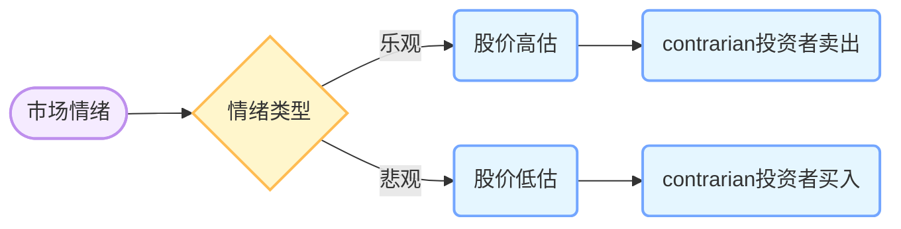

# contrarian投资：逆向思维创造超额收益

> 关键词：contrarian投资、逆向思维、超额收益、投资策略、市场情绪

> 摘要：本文围绕contrarian投资展开，深入探讨了其核心概念、算法原理、数学模型等内容。阐述了通过逆向思维在投资中创造超额收益的方法和逻辑。详细介绍了contrarian投资在实际项目中的应用案例，分析了其适用的实际场景。同时，为读者推荐了相关的学习资源、开发工具框架以及论文著作。最后对contrarian投资的未来发展趋势与挑战进行了总结，并提供了常见问题的解答和扩展阅读参考资料，帮助读者全面了解和掌握contrarian投资这一重要的投资理念。

## 1. 背景介绍 
### 1.1 目的和范围
本文章旨在深入剖析contrarian投资这一独特的投资策略，详细阐述其原理、方法和应用。通过对逆向思维在投资领域的运用进行系统分析，帮助投资者理解如何利用市场的非理性波动，通过与市场主流趋势相反的操作来获取超额收益。文章的范围涵盖了contrarian投资的理论基础、核心算法、数学模型，以及在实际项目中的应用案例，同时还会介绍相关的学习资源和工具，为投资者和相关从业者提供全面的指导和参考。

### 1.2 预期读者
本文预期读者主要包括对投资领域感兴趣的个人投资者、金融机构的投资分析师、基金经理等专业人士，以及从事金融相关专业学习和研究的学生。对于那些希望通过学习和掌握独特投资策略来提高投资收益的人士，本文将提供有价值的见解和实用的方法。同时，对于金融专业的学生来说，本文可以作为学习投资理论和实践的参考资料，帮助他们拓宽知识面和视野。

### 1.3 文档结构概述
本文将按照以下结构进行组织：首先介绍contrarian投资的背景知识，包括目的、预期读者和文档结构概述等内容；接着详细阐述contrarian投资的核心概念，包括其原理、架构，并通过文本示意图和Mermaid流程图进行直观展示；然后讲解核心算法原理和具体操作步骤，同时使用Python源代码进行详细阐述；之后介绍数学模型和公式，并通过具体例子进行说明；再通过项目实战，展示代码实际案例并进行详细解释；分析contrarian投资的实际应用场景；推荐相关的工具和资源，包括学习资源、开发工具框架和论文著作；最后对contrarian投资的未来发展趋势与挑战进行总结，提供常见问题的解答和扩展阅读参考资料。

### 1.4 术语表
#### 1.4.1 核心术语定义
- **contrarian投资**：一种投资策略，投资者通过与市场主流趋势相反的操作来获取收益。当市场普遍乐观时，投资者选择卖出；当市场普遍悲观时，投资者选择买入。
- **逆向思维**：与常规思维相反的思维方式，在投资中表现为不随波逐流，独立思考，寻找市场中的被低估或高估的资产。
- **超额收益**：投资者获得的超过市场平均收益的部分，是contrarian投资追求的目标。
- **市场情绪**：投资者对市场的整体看法和心理状态，通常表现为乐观或悲观情绪，会影响市场的价格波动。

#### 1.4.2 相关概念解释
- **羊群效应**：在投资市场中，投资者往往会受到其他投资者的影响，跟随大众的投资决策，而忽略自己的分析和判断。contrarian投资正是针对这种羊群效应，采取相反的操作策略。
- **价值投资**：一种基于公司基本面分析的投资策略，寻找被低估的股票并长期持有。contrarian投资在一定程度上与价值投资有相似之处，都关注资产的内在价值，但contrarian投资更强调逆向操作。

#### 1.4.3 缩略词列表
- **CAPM**：资本资产定价模型（Capital Asset Pricing Model），用于计算资产的预期收益率。
- **EMH**：有效市场假说（Efficient Market Hypothesis），认为市场价格已经反映了所有可用的信息。

## 2. 核心概念与联系 

### 核心概念原理
contrarian投资的核心原理基于市场的非理性行为和投资者的心理偏差。在金融市场中，投资者的情绪往往会受到市场波动的影响，产生过度乐观或过度悲观的情绪。当市场处于上升趋势时，投资者会变得过于乐观，纷纷买入股票，导致股票价格高估；而当市场处于下降趋势时，投资者会变得过于悲观，纷纷卖出股票，导致股票价格低估。

contrarian投资者利用这种市场的非理性波动，采取与市场主流趋势相反的操作策略。当市场普遍乐观时，他们会认为市场已经过热，股票价格高估，从而选择卖出股票；当市场普遍悲观时，他们会认为市场已经过度恐慌，股票价格低估，从而选择买入股票。通过这种逆向操作，contrarian投资者希望在市场反转时获得超额收益。

### 架构的文本示意图
```plaintext
市场情绪
|
|-- 乐观情绪
|   |-- 股价高估
|   |   |-- contrarian投资者卖出
|-- 悲观情绪
|   |-- 股价低估
|   |   |-- contrarian投资者买入
```

### Mermaid流程图


## 3. 核心算法原理 & 具体操作步骤 

### 核心算法原理
contrarian投资的核心算法主要基于对市场情绪和股票价格的分析。一种常见的方法是通过计算股票的相对强弱指标（RSI）来判断市场情绪和股票的超买超卖情况。

相对强弱指标（RSI）是一种技术分析工具，用于衡量股票在一段时间内的涨跌幅度，其计算公式为：

$$RSI = 100 - \frac{100}{1 + RS}$$

其中，$RS$ 是平均上涨幅度与平均下跌幅度的比值：

$$RS = \frac{\text{平均上涨幅度}}{\text{平均下跌幅度}}$$

一般来说，当 $RSI$ 超过70时，表明股票处于超买状态，市场情绪过于乐观，股价可能高估；当 $RSI$ 低于30时，表明股票处于超卖状态，市场情绪过于悲观，股价可能低估。

contrarian投资者可以根据 $RSI$ 的数值来制定投资策略：当 $RSI$ 超过70时，卖出股票；当 $RSI$ 低于30时，买入股票。

### 具体操作步骤
1. **数据收集**：收集股票的历史价格数据，包括开盘价、收盘价、最高价、最低价等。
2. **计算RSI**：根据收集到的价格数据，计算股票的相对强弱指标（RSI）。
3. **判断超买超卖**：根据 $RSI$ 的数值，判断股票是否处于超买或超卖状态。
4. **制定投资策略**：当股票处于超买状态时，卖出股票；当股票处于超卖状态时，买入股票。
5. **监控和调整**：定期监控股票的 $RSI$ 数值和市场情况，根据情况调整投资策略。

### Python源代码实现
```python
import pandas as pd
import numpy as np

def calculate_rsi(data, period=14):
    """
    计算相对强弱指标（RSI）
    :param data: 股票收盘价数据
    :param period: 计算周期，默认为14天
    :return: RSI数值
    """
    delta = data.diff()
    up = delta.clip(lower=0)
    down = -delta.clip(upper=0)
    avg_up = up.rolling(window=period).mean()
    avg_down = down.rolling(window=period).mean()
    rs = avg_up / avg_down
    rsi = 100 - (100 / (1 + rs))
    return rsi

# 示例数据
data = pd.Series([100, 102, 105, 103, 101, 99, 98, 100, 102, 104, 106, 108, 110, 108, 106])
rsi = calculate_rsi(data)
print(rsi)
```

在上述代码中，我们定义了一个 `calculate_rsi` 函数，用于计算股票的相对强弱指标（RSI）。函数接受两个参数：`data` 是股票的收盘价数据，`period` 是计算周期，默认为14天。函数内部首先计算价格的差值，然后分别计算上涨幅度和下跌幅度的平均值，最后根据公式计算 $RSI$ 数值。

## 4. 数学模型和公式 & 详细讲解 & 举例说明 

### 数学模型和公式
在contrarian投资中，除了相对强弱指标（RSI）外，还可以使用其他数学模型和公式来辅助分析和决策。以下是一些常见的数学模型和公式：

#### 资本资产定价模型（CAPM）
资本资产定价模型（CAPM）用于计算资产的预期收益率，其公式为：

$$E(R_i) = R_f + \beta_i (E(R_m) - R_f)$$

其中，$E(R_i)$ 是资产 $i$ 的预期收益率，$R_f$ 是无风险利率，$\beta_i$ 是资产 $i$ 的贝塔系数，$E(R_m)$ 是市场组合的预期收益率。

贝塔系数 $\beta_i$ 衡量了资产 $i$ 的收益率相对于市场组合收益率的波动程度，其计算公式为：

$$\beta_i = \frac{\text{Cov}(R_i, R_m)}{\text{Var}(R_m)}$$

其中，$\text{Cov}(R_i, R_m)$ 是资产 $i$ 的收益率与市场组合收益率的协方差，$\text{Var}(R_m)$ 是市场组合收益率的方差。

#### 有效市场假说（EMH）
有效市场假说（EMH）认为市场价格已经反映了所有可用的信息，分为弱式有效市场、半强式有效市场和强式有效市场。在弱式有效市场中，市场价格已经反映了所有历史价格信息；在半强式有效市场中，市场价格已经反映了所有公开信息；在强式有效市场中，市场价格已经反映了所有信息，包括公开信息和内幕信息。

### 详细讲解
#### 资本资产定价模型（CAPM）
资本资产定价模型（CAPM）的核心思想是，资产的预期收益率与其系统性风险（贝塔系数）成正比。无风险利率 $R_f$ 表示投资者在没有风险的情况下可以获得的收益率，通常以国债收益率作为参考。市场组合的预期收益率 $E(R_m)$ 表示市场整体的预期收益率。贝塔系数 $\beta_i$ 衡量了资产 $i$ 的系统性风险，当 $\beta_i > 1$ 时，资产 $i$ 的收益率波动比市场组合更大；当 $\beta_i < 1$ 时，资产 $i$ 的收益率波动比市场组合更小。

#### 有效市场假说（EMH）
有效市场假说（EMH）对contrarian投资有重要的影响。如果市场是强式有效的，那么所有信息都已经反映在市场价格中，投资者无法通过分析信息来获得超额收益，contrarian投资策略也将失效。然而，在现实市场中，市场往往不是完全有效的，存在着各种信息不对称和投资者的心理偏差，这为contrarian投资提供了机会。

### 举例说明
假设无风险利率 $R_f = 3\%$，市场组合的预期收益率 $E(R_m) = 10\%$，某股票的贝塔系数 $\beta = 1.2$。根据资本资产定价模型（CAPM），该股票的预期收益率为：

$$E(R) = 3\% + 1.2 \times (10\% - 3\%) = 11.4\%$$

如果该股票的实际收益率高于 $11.4\%$，则说明该股票被低估，contrarian投资者可以考虑买入；如果该股票的实际收益率低于 $11.4\%$，则说明该股票被高估，contrarian投资者可以考虑卖出。

## 5. 项目实战：代码实际案例和详细解释说明 

### 5.1  开发环境搭建
在进行contrarian投资的项目实战之前，需要搭建相应的开发环境。以下是具体的搭建步骤：

1. **安装Python**：Python是一种广泛使用的编程语言，具有丰富的数据分析和机器学习库。可以从Python官方网站（https://www.python.org/downloads/）下载并安装Python。
2. **安装必要的库**：需要安装一些必要的Python库，如 `pandas`、`numpy`、`matplotlib` 等。可以使用 `pip` 命令进行安装：
```sh
pip install pandas numpy matplotlib
```
3. **获取股票数据**：可以使用 `pandas-datareader` 库从雅虎财经等网站获取股票的历史价格数据。安装命令如下：
```sh
pip install pandas-datareader
```

### 5.2  源代码详细实现和代码解读
以下是一个使用Python实现contrarian投资策略的完整代码示例：

```python
import pandas as pd
import pandas_datareader.data as web
import numpy as np
import matplotlib.pyplot as plt

def calculate_rsi(data, period=14):
    """
    计算相对强弱指标（RSI）
    :param data: 股票收盘价数据
    :param period: 计算周期，默认为14天
    :return: RSI数值
    """
    delta = data.diff()
    up = delta.clip(lower=0)
    down = -delta.clip(upper=0)
    avg_up = up.rolling(window=period).mean()
    avg_down = down.rolling(window=period).mean()
    rs = avg_up / avg_down
    rsi = 100 - (100 / (1 + rs))
    return rsi

def contrarian_strategy(data, rsi_period=14, buy_threshold=30, sell_threshold=70):
    """
    contrarian投资策略
    :param data: 股票收盘价数据
    :param rsi_period: RSI计算周期，默认为14天
    :param buy_threshold: 买入阈值，默认为30
    :param sell_threshold: 卖出阈值，默认为70
    :return: 交易信号
    """
    rsi = calculate_rsi(data, rsi_period)
    signals = []
    position = 0
    for i in range(len(data)):
        if rsi[i] < buy_threshold and position == 0:
            signals.append(1)  # 买入信号
            position = 1
        elif rsi[i] > sell_threshold and position == 1:
            signals.append(-1)  # 卖出信号
            position = 0
        else:
            signals.append(0)  # 持有信号
    return pd.Series(signals, index=data.index)

# 获取股票数据
start_date = '2020-01-01'
end_date = '2021-12-31'
symbol = 'AAPL'
data = web.DataReader(symbol, 'yahoo', start_date, end_date)['Close']

# 计算交易信号
signals = contrarian_strategy(data)

# 计算持仓价值
positions = pd.DataFrame(index=data.index).fillna(0.0)
positions[symbol] = signals
portfolio = positions.multiply(data, axis=0)
pos_diff = positions.diff()

# 计算累计收益
portfolio['holdings'] = (positions.multiply(data, axis=0)).sum(axis=1)
portfolio['cash'] = 100000 - (pos_diff.multiply(data, axis=0)).sum(axis=1).cumsum()
portfolio['total'] = portfolio['cash'] + portfolio['holdings']
portfolio['returns'] = portfolio['total'].pct_change()

# 绘制收益曲线
plt.figure(figsize=(12, 6))
plt.plot(portfolio['total'])
plt.title('Contrarian Investment Strategy Performance')
plt.xlabel('Date')
plt.ylabel('Portfolio Value')
plt.show()
```

### 代码解读与分析
1. **calculate_rsi函数**：该函数用于计算股票的相对强弱指标（RSI）。首先计算价格的差值，然后分别计算上涨幅度和下跌幅度的平均值，最后根据公式计算 $RSI$ 数值。
2. **contrarian_strategy函数**：该函数实现了contrarian投资策略。根据计算得到的 $RSI$ 数值，当 $RSI$ 低于买入阈值时，发出买入信号；当 $RSI$ 高于卖出阈值时，发出卖出信号；否则发出持有信号。
3. **获取股票数据**：使用 `pandas-datareader` 库从雅虎财经获取苹果公司（AAPL）的历史收盘价数据。
4. **计算交易信号**：调用 `contrarian_strategy` 函数计算交易信号。
5. **计算持仓价值**：根据交易信号计算持仓价值，并计算持仓的变化。
6. **计算累计收益**：计算持仓价值、现金余额和总价值，并计算每日收益率。
7. **绘制收益曲线**：使用 `matplotlib` 库绘制投资组合的累计收益曲线，直观展示contrarian投资策略的表现。

通过对代码的分析可以看出，contrarian投资策略通过逆向操作，在股票价格超卖时买入，在股票价格超买时卖出，从而实现超额收益。然而，实际投资中还需要考虑交易成本、市场风险等因素。

## 6. 实际应用场景 
contrarian投资策略在以下实际应用场景中具有重要的价值：

### 股票市场
在股票市场中，投资者的情绪往往会导致股票价格的过度波动。当市场处于牛市时，投资者会变得过于乐观，股票价格普遍高估；当市场处于熊市时，投资者会变得过于悲观，股票价格普遍低估。contrarian投资者可以利用这种市场的非理性波动，在熊市中买入被低估的股票，在牛市中卖出被高估的股票，从而获得超额收益。

### 债券市场
债券市场也存在着投资者情绪的影响。当经济形势向好时，投资者会更倾向于投资股票等风险资产，导致债券价格下跌；当经济形势不佳时，投资者会更倾向于投资债券等避险资产，导致债券价格上涨。contrarian投资者可以根据市场情绪的变化，在债券价格下跌时买入，在债券价格上涨时卖出，实现资产的增值。

### 大宗商品市场
大宗商品市场的价格波动受到供求关系、宏观经济形势、地缘政治等多种因素的影响。投资者的情绪也会对大宗商品市场产生重要的影响。例如，当市场对某种大宗商品的需求预期过高时，投资者会纷纷买入，导致价格上涨；当市场对某种大宗商品的需求预期过低时，投资者会纷纷卖出，导致价格下跌。contrarian投资者可以通过逆向操作，在价格下跌时买入，在价格上涨时卖出，获取超额收益。

### 房地产市场
房地产市场也存在着投资者情绪的波动。当房地产市场处于繁荣期时，投资者会纷纷涌入，导致房价上涨；当房地产市场处于低迷期时，投资者会纷纷撤离，导致房价下跌。contrarian投资者可以在房地产市场低迷时买入房产，在房地产市场繁荣时卖出房产，实现资产的增值。

## 7. 工具和资源推荐
### 7.1 学习资源推荐
#### 7.1.1 书籍推荐
- 《聪明的投资者》（The Intelligent Investor）：本杰明·格雷厄姆（Benjamin Graham）著，被誉为投资界的圣经，详细介绍了价值投资和contrarian投资的理念和方法。
- 《金融炼金术》（The Alchemy of Finance）：乔治·索罗斯（George Soros）著，讲述了索罗斯的投资哲学和实践经验，强调了市场的非理性和投资者的心理偏差。
- 《逆向投资策略》（Contrarian Investment Strategies）：大卫·德雷曼（David Dreman）著，系统阐述了contrarian投资策略的原理、方法和应用。

#### 7.1.2 在线课程
- Coursera上的“投资学原理”（Principles of Investing）课程：由宾夕法尼亚大学沃顿商学院的教授授课，介绍了投资的基本原理和策略，包括contrarian投资。
- edX上的“金融市场”（Financial Markets）课程：由耶鲁大学的教授授课，涵盖了金融市场的各个方面，包括投资者情绪和contrarian投资。

#### 7.1.3 技术博客和网站
- Seeking Alpha（https://seekingalpha.com/）：一个专业的金融投资网站，提供各种投资分析和研究报告，包括contrarian投资的观点和策略。
- The Motley Fool（https://www.fool.com/）：提供投资建议和市场分析，有很多关于contrarian投资的文章和讨论。

### 7.2 开发工具框架推荐
#### 7.2.1 IDE和编辑器
- PyCharm：一款专业的Python集成开发环境，提供丰富的代码编辑、调试和分析功能，适合进行contrarian投资策略的开发和测试。
- Jupyter Notebook：一个交互式的开发环境，支持Python、R等多种编程语言，方便进行数据探索和分析，以及策略的可视化展示。

#### 7.2.2 调试和性能分析工具
- PDB：Python自带的调试工具，可以帮助开发者定位和解决代码中的问题。
- cProfile：Python的性能分析工具，可以分析代码的运行时间和内存使用情况，帮助优化代码性能。

#### 7.2.3 相关框架和库
- Pandas：一个强大的数据分析库，提供了丰富的数据结构和数据处理功能，适合进行股票数据的处理和分析。
- NumPy：一个用于科学计算的库，提供了高效的数组操作和数学函数，是进行数据分析和模型计算的基础。
- Matplotlib：一个用于数据可视化的库，可以绘制各种类型的图表，帮助直观展示投资策略的表现。

### 7.3 相关论文著作推荐
#### 7.3.1 经典论文
- “Does the Stock Market Overreact?”（股票市场是否反应过度？）：由德邦特（Werner F. M. De Bondt）和塞勒（Richard H. Thaler）发表于1985年的论文，首次提出了股票市场存在过度反应的现象，为contrarian投资策略提供了理论支持。
- “Contrarian Investment, Extrapolation, and Risk”（逆向投资、外推和风险）：由杰格迪什（Narasimhan Jegadeesh）和蒂特曼（Sheridan Titman）发表于1993年的论文，进一步研究了contrarian投资策略的有效性和风险。

#### 7.3.2 最新研究成果
- 近年来，随着行为金融学的发展，越来越多的研究关注投资者的心理偏差和市场的非理性行为，为contrarian投资策略提供了新的理论和实证支持。可以通过学术数据库如Google Scholar、IEEE Xplore等搜索相关的最新研究成果。

#### 7.3.3 应用案例分析
- 一些金融机构和投资公司会发布关于contrarian投资策略的应用案例分析报告，可以通过它们的官方网站或专业金融媒体获取这些报告，了解contrarian投资策略在实际中的应用效果和经验教训。

## 8. 总结：未来发展趋势与挑战
### 未来发展趋势
- **与人工智能和机器学习的结合**：随着人工智能和机器学习技术的不断发展，contrarian投资策略可以与这些技术相结合，通过对大量的市场数据和投资者情绪数据进行分析和挖掘，更准确地判断市场的非理性波动，制定更优化的投资策略。
- **跨市场和跨资产类别的应用**：contrarian投资策略不仅可以应用于股票市场，还可以扩展到债券市场、大宗商品市场、房地产市场等多个市场和资产类别，实现资产的多元化配置，降低投资风险。
- **个性化投资服务**：随着金融科技的发展，投资者可以通过在线平台获得个性化的投资服务。contrarian投资策略可以根据投资者的风险偏好、投资目标和资金状况等因素，为投资者提供定制化的投资方案。

### 挑战
- **市场有效性的提高**：随着市场的发展和信息传播的加快，市场的有效性可能会不断提高，这将使得contrarian投资策略的实施难度增加。投资者需要更加敏锐地捕捉市场的非理性波动，才能获得超额收益。
- **投资者情绪的复杂性**：投资者情绪受到多种因素的影响，如宏观经济形势、政策变化、地缘政治等，其复杂性使得准确判断投资者情绪变得困难。此外，投资者情绪的变化也可能非常迅速，需要投资者及时调整投资策略。
- **交易成本和风险控制**：contrarian投资策略通常需要频繁地进行买卖操作，这会增加交易成本。同时，逆向操作也可能面临市场反转不及预期的风险，投资者需要合理控制交易成本和风险，确保投资策略的有效性。

## 9. 附录：常见问题与解答
### 问题1：contrarian投资策略适合所有投资者吗？
答：contrarian投资策略并不适合所有投资者。该策略需要投资者具备较强的独立思考能力和风险承受能力，能够在市场普遍悲观或乐观时保持冷静，做出逆向的投资决策。对于风险偏好较低、缺乏投资经验的投资者来说，可能不太适合采用该策略。

### 问题2：如何判断市场情绪的高低？
答：可以通过多种方法判断市场情绪的高低。一种常见的方法是使用技术分析指标，如相对强弱指标（RSI）、布林带等，判断股票的超买超卖情况。此外，还可以关注市场的成交量、融资融券数据、投资者调查等信息，了解投资者的情绪和行为。

### 问题3：contrarian投资策略的风险有哪些？
答：contrarian投资策略的风险主要包括市场反转不及预期的风险、交易成本过高的风险、信息不对称的风险等。当市场情绪没有按照预期反转时，投资者可能会遭受损失。频繁的买卖操作也会增加交易成本，降低投资收益。此外，如果投资者掌握的信息不全面或不准确，也可能导致投资决策失误。

### 问题4：如何优化contrarian投资策略？
答：可以从以下几个方面优化contrarian投资策略。一是结合多种分析方法，如基本面分析、技术分析和情绪分析等，提高对市场的判断准确性。二是合理控制交易成本，选择合适的交易时机和交易方式。三是进行资产的多元化配置，降低单一资产的风险。四是根据市场情况和自身投资目标，动态调整投资策略。

## 10. 扩展阅读 & 参考资料
- 《行为金融学》：理查德·泰勒（Richard H. Thaler）著，介绍了行为金融学的基本理论和应用，有助于深入理解投资者的心理偏差和市场的非理性行为。
- 《投资中最简单的事》：邱国鹭著，结合中国市场的实际情况，阐述了价值投资和contrarian投资的理念和方法。
- Bloomberg（https://www.bloomberg.com/）：全球知名的金融资讯网站，提供实时的市场数据、新闻和分析，是了解金融市场动态的重要渠道。
- Yahoo Finance（https://finance.yahoo.com/）：提供丰富的股票、基金、债券等金融产品的信息和分析，方便投资者进行投资研究和决策。

作者：AI天才研究院/AI Genius Institute & 禅与计算机程序设计艺术 /Zen And The Art of Computer Programming