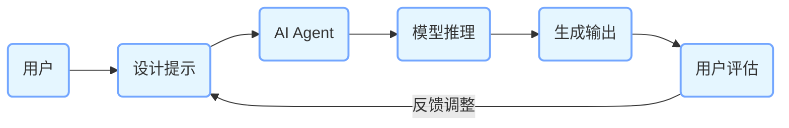

# prompt工程：设计有效提示以优化AI Agent输出

> 关键词：prompt工程、有效提示、AI Agent、输出优化、自然语言处理

> 摘要：本文聚焦于prompt工程，旨在深入探讨如何设计有效提示以优化AI Agent的输出。首先介绍了prompt工程的背景，包括目的、预期读者、文档结构和相关术语。接着阐述了核心概念与联系，给出了原理和架构的示意图及流程图。详细讲解了核心算法原理，通过Python代码进行说明，并介绍了相关的数学模型和公式。通过项目实战展示了具体的代码实现和解读。探讨了实际应用场景，推荐了学习资源、开发工具框架和相关论文著作。最后总结了未来发展趋势与挑战，提供了常见问题解答和扩展阅读参考资料。

## 1. 背景介绍 
### 1.1 目的和范围
在当今人工智能快速发展的时代，AI Agent已经广泛应用于各个领域，如智能客服、文本生成、图像识别等。然而，AI Agent的性能很大程度上依赖于输入的提示信息。Prompt工程的目的就是通过设计有效的提示，引导AI Agent生成更准确、更有用、更符合用户需求的输出。本文的范围涵盖了prompt工程的基本概念、核心算法、实际应用案例以及相关的工具和资源推荐，旨在为读者提供一个全面的关于设计有效提示以优化AI Agent输出的知识体系。

### 1.2 预期读者
本文预期读者包括人工智能领域的研究人员、开发者、数据科学家，以及对AI Agent和自然语言处理感兴趣的技术爱好者。无论是初学者想要了解prompt工程的基础知识，还是有一定经验的专业人士希望深入研究有效提示设计的方法，都能从本文中获得有价值的信息。

### 1.3 文档结构概述
本文将按照以下结构进行组织：首先介绍prompt工程的背景信息，包括目的、读者和文档结构等；接着阐述核心概念与联系，通过示意图和流程图展示其原理和架构；详细讲解核心算法原理，并给出Python代码示例；介绍相关的数学模型和公式，并举例说明；通过项目实战展示具体的代码实现和解读；探讨实际应用场景；推荐学习资源、开发工具框架和相关论文著作；最后总结未来发展趋势与挑战，提供常见问题解答和扩展阅读参考资料。

### 1.4 术语表
#### 1.4.1 核心术语定义
- **Prompt工程**：指通过设计和优化输入给AI Agent的提示信息，以引导其生成更符合预期的输出的过程。
- **AI Agent**：是一种能够感知环境、进行推理并采取行动的人工智能实体，可以是基于规则的系统、机器学习模型或深度学习模型等。
- **提示（Prompt）**：是输入给AI Agent的文本信息，用于指导其生成特定的输出。
- **输出优化**：指通过调整提示和相关参数，使AI Agent的输出在准确性、相关性、可读性等方面达到更好的效果。

#### 1.4.2 相关概念解释
- **自然语言处理（NLP）**：是人工智能的一个分支，研究如何让计算机理解、处理和生成人类语言。Prompt工程在很大程度上依赖于NLP技术，因为提示通常是以自然语言的形式输入的。
- **机器学习**：是人工智能的一种方法，通过让计算机从数据中学习模式和规律，从而实现对未知数据的预测和分类。许多AI Agent是基于机器学习模型构建的，prompt工程可以影响这些模型的输出。
- **深度学习**：是机器学习的一个子领域，使用深度神经网络来学习数据的表示。在自然语言处理中，深度学习模型如Transformer架构已经取得了显著的成果，prompt工程可以用于优化这些模型的性能。

#### 1.4.3 缩略词列表
- **NLP**：Natural Language Processing（自然语言处理）
- **LLM**：Large Language Model（大语言模型）

## 2. 核心概念与联系 
### 核心概念原理
Prompt工程的核心原理是通过精心设计的提示来影响AI Agent的决策过程。AI Agent通常基于某种模型（如大语言模型LLM），该模型根据输入的提示进行推理和生成输出。提示可以包含任务描述、示例、约束条件等信息，这些信息会引导模型朝着特定的方向进行思考和生成。

例如，当我们需要AI Agent生成一篇关于环保的新闻报道时，我们可以设计一个提示，包含报道的主题、风格要求（如正式、客观）、字数范围等信息。模型会根据这些提示，结合自身学习到的语言知识和模式，生成符合要求的新闻报道。

### 架构示意图

这个示意图展示了prompt工程的基本架构。用户首先设计提示，将其输入到AI Agent中。AI Agent内部的模型进行推理，生成输出。用户对输出进行评估，如果不满意，可以反馈并调整提示，再次进行上述过程，直到得到满意的输出。

### 核心概念联系
Prompt工程涉及到多个核心概念之间的紧密联系。提示的设计与AI Agent所使用的模型密切相关，不同的模型对提示的理解和响应方式可能不同。例如，一些模型对特定的格式或关键词更为敏感，因此在设计提示时需要考虑模型的特点。

同时，输出优化的目标也会影响提示的设计。如果我们希望输出更加准确，可能需要在提示中提供更多的细节和约束条件；如果希望输出更加富有创意，可能需要在提示中给予更多的自由发挥空间。

此外，自然语言处理技术为prompt工程提供了基础，包括词法分析、句法分析、语义理解等，这些技术可以帮助我们更好地理解提示和输出的含义，从而进行更有效的提示设计。

## 3. 核心算法原理 & 具体操作步骤 
### 核心算法原理
在prompt工程中，核心算法原理主要涉及到如何根据目标输出和模型特点来设计提示。这里我们以一个简单的文本生成任务为例，介绍一种基于模板的提示设计算法。

假设我们有一个大语言模型LLM，我们希望它生成特定主题的故事。我们可以设计一个提示模板，包含故事的主题、角色、情节要素等信息。模型会根据这些信息，结合自身的语言知识，生成符合要求的故事。

### Python代码示例
```python
import openai

# 设置OpenAI API密钥
openai.api_key = "your_api_key"

def generate_story(topic, characters, plot_elements):
    # 设计提示
    prompt = f"请生成一个关于{topic}的故事，故事中包含角色：{characters}，情节要素：{plot_elements}。"
    
    try:
        # 调用OpenAI API生成故事
        response = openai.Completion.create(
            engine="text-davinci-003",
            prompt=prompt,
            max_tokens=300,
            temperature=0.7
        )
        
        # 提取生成的故事文本
        story = response.choices[0].text.strip()
        return story
    except Exception as e:
        print(f"生成故事时出现错误：{e}")
        return None

# 示例参数
topic = "太空冒险"
characters = "宇航员小明、外星人小红"
plot_elements = "飞船故障、寻找能源"

# 生成故事
story = generate_story(topic, characters, plot_elements)
if story:
    print(story)
```
### 具体操作步骤
1. **明确任务目标**：确定我们希望AI Agent生成的输出类型，如故事、新闻报道、诗歌等。
2. **分析模型特点**：了解所使用的AI Agent的模型特点，包括其训练数据、语言能力、对不同类型提示的响应方式等。
3. **设计提示模板**：根据任务目标和模型特点，设计一个包含必要信息的提示模板。提示模板可以包括任务描述、示例、约束条件等。
4. **填充提示信息**：将具体的任务信息填充到提示模板中，形成最终的提示。
5. **调用AI Agent生成输出**：将设计好的提示输入到AI Agent中，调用其生成功能，得到输出结果。
6. **评估和调整**：对生成的输出进行评估，如果不符合预期，根据评估结果调整提示信息，再次进行生成，直到得到满意的输出。

## 4. 数学模型和公式 & 详细讲解 & 举例说明 
### 数学模型
在prompt工程中，我们可以使用一些数学模型来描述提示和输出之间的关系。一种简单的模型是基于概率的语言模型。假设我们有一个提示 $P$ 和一个输出 $O$，语言模型可以计算在给定提示 $P$ 的条件下，输出 $O$ 出现的概率 $P(O|P)$。

### 数学公式
$$P(O|P)=\frac{P(P,O)}{P(P)}$$
其中，$P(P,O)$ 表示提示 $P$ 和输出 $O$ 同时出现的联合概率，$P(P)$ 表示提示 $P$ 出现的概率。

### 详细讲解
这个公式的意义在于，我们可以通过计算在给定提示下输出出现的概率，来评估不同提示对输出的影响。如果某个提示使得某个输出的概率较高，那么我们可以认为这个提示更有可能引导模型生成该输出。

### 举例说明
假设我们有一个语言模型，用于生成关于水果的描述。我们设计了两个提示：
- $P_1$：“请描述苹果的特点”
- $P_2$：“请描述一种常见的红色水果的特点”

对于输出 $O$：“苹果是一种常见的水果，颜色通常为红色，口感清甜”。

我们可以分别计算 $P(O|P_1)$ 和 $P(O|P_2)$。如果 $P(O|P_1) > P(O|P_2)$，说明提示 $P_1$ 更有可能引导模型生成关于苹果的准确描述。

在实际应用中，计算这些概率通常需要使用复杂的机器学习算法和大量的训练数据。我们可以通过实验和调优来找到最适合的提示，以提高输出的质量。

## 5. 项目实战：代码实际案例和详细解释说明 
### 5.1  开发环境搭建
#### 安装Python
首先，确保你已经安装了Python 3.x版本。你可以从Python官方网站（https://www.python.org/downloads/）下载并安装适合你操作系统的版本。

#### 安装OpenAI Python库
我们使用OpenAI的API来进行文本生成，需要安装OpenAI的Python库。在命令行中运行以下命令：
```sh
pip install openai
```

#### 获取OpenAI API密钥
访问OpenAI官方网站（https://platform.openai.com/），注册并登录账号，然后在API密钥管理页面生成一个API密钥。将该密钥保存好，后续代码中会用到。

### 5.2  源代码详细实现和代码解读
```python
import openai

# 设置OpenAI API密钥
openai.api_key = "your_api_key"

def generate_recipe(ingredients, cuisine):
    # 设计提示
    prompt = f"请生成一份{ cuisine }风格的食谱，使用以下食材：{ ', '.join(ingredients) }。"
    
    try:
        # 调用OpenAI API生成食谱
        response = openai.Completion.create(
            engine="text-davinci-003",
            prompt=prompt,
            max_tokens=500,
            temperature=0.8
        )
        
        # 提取生成的食谱文本
        recipe = response.choices[0].text.strip()
        return recipe
    except Exception as e:
        print(f"生成食谱时出现错误：{e}")
        return None

# 示例食材
ingredients = ["鸡肉", "土豆", "胡萝卜"]
# 示例菜系
cuisine = "中式"

# 生成食谱
recipe = generate_recipe(ingredients, cuisine)
if recipe:
    print(recipe)
```
### 代码解读
1. **导入OpenAI库**：`import openai` 导入OpenAI的Python库，用于调用OpenAI的API。
2. **设置API密钥**：`openai.api_key = "your_api_key"` 将你自己的OpenAI API密钥替换 `"your_api_key"`，以便进行身份验证。
3. **定义生成食谱的函数**：`generate_recipe` 函数接受两个参数：`ingredients` 表示食材列表，`cuisine` 表示菜系。
4. **设计提示**：在函数内部，根据输入的食材和菜系设计提示信息。提示信息明确告知模型要生成的是一份特定菜系风格的食谱，并列出了使用的食材。
5. **调用OpenAI API**：使用 `openai.Completion.create` 方法调用OpenAI的API，传入提示信息、引擎名称（`text-davinci-003`）、最大生成的令牌数（`max_tokens`）和温度参数（`temperature`）。温度参数控制生成的随机性，值越高越随机。
6. **提取生成的食谱**：从API响应中提取生成的食谱文本，并去除首尾的空白字符。
7. **处理异常**：如果在调用API过程中出现错误，捕获异常并打印错误信息。
8. **示例调用**：定义示例食材和菜系，调用 `generate_recipe` 函数生成食谱，并打印结果。

### 5.3  代码解读与分析
#### 提示设计的重要性
在这个代码示例中，提示的设计直接影响了生成的食谱的质量。通过明确指定菜系和食材，我们引导模型生成符合特定要求的食谱。如果提示信息不清晰或不完整，模型可能会生成不符合预期的结果。

#### 参数调整
`max_tokens` 和 `temperature` 是两个重要的参数。`max_tokens` 控制了生成文本的最大长度，我们可以根据实际需求进行调整。`temperature` 参数影响生成的随机性，较高的温度值会使生成的文本更具创造性，但也可能导致结果不太准确；较低的温度值会使生成的文本更保守，更接近训练数据中的模式。

#### 错误处理
在代码中加入了异常处理机制，以应对可能出现的API调用错误。这样可以增强代码的健壮性，避免程序因错误而崩溃。

## 6. 实际应用场景 
### 智能客服
在智能客服场景中，prompt工程可以用于设计有效的提示，引导AI Agent更好地理解用户的问题并提供准确的回答。例如，通过在提示中明确问题的领域、相关的业务规则等信息，帮助AI Agent快速定位问题的答案。

### 内容创作
在内容创作领域，如新闻写作、小说创作、诗歌创作等，prompt工程可以帮助创作者利用AI Agent生成灵感和初稿。创作者可以设计包含主题、风格、情节等信息的提示，让AI Agent生成符合要求的内容，然后在此基础上进行修改和完善。

### 翻译服务
在翻译服务中，prompt工程可以用于优化AI翻译模型的输出。通过在提示中提供原文的背景信息、特定的术语要求等，帮助模型生成更准确、更自然的翻译结果。

### 数据分析报告生成
在数据分析领域，prompt工程可以用于生成数据分析报告。通过设计包含数据来源、分析目的、指标要求等信息的提示，让AI Agent根据数据分析结果生成详细的报告，提高工作效率。

### 游戏开发
在游戏开发中，prompt工程可以用于生成游戏剧情、对话、任务描述等内容。游戏开发者可以设计包含游戏风格、角色设定、情节走向等信息的提示，让AI Agent生成丰富多样的游戏内容，增加游戏的趣味性和可玩性。

## 7. 工具和资源推荐
### 7.1 学习资源推荐
#### 7.1.1 书籍推荐
- 《自然语言处理入门》：这本书全面介绍了自然语言处理的基础知识和常用技术，对于理解prompt工程的底层原理有很大帮助。
- 《Python自然语言处理实战》：通过大量的Python代码示例，详细讲解了自然语言处理的实际应用，包括文本分类、情感分析、信息提取等，对prompt工程的实践有指导作用。
- 《深度学习》：深度学习是现代AI的核心技术之一，这本书深入介绍了深度学习的原理、算法和应用，对于理解基于深度学习的AI Agent和prompt工程有重要意义。

#### 7.1.2 在线课程
- Coursera上的“自然语言处理专项课程”：由顶尖高校的教授授课，系统地介绍了自然语言处理的各个方面，包括词法分析、句法分析、语义理解、文本生成等，其中也涉及到了prompt工程的相关内容。
- edX上的“深度学习基础”：该课程深入浅出地讲解了深度学习的基本概念、模型架构和训练方法，为学习基于深度学习的AI Agent和prompt工程打下坚实的基础。
- 网易云课堂上的“Python人工智能实战教程”：通过实际项目案例，详细讲解了如何使用Python和相关库进行人工智能开发，包括自然语言处理和prompt工程的实践。

#### 7.1.3 技术博客和网站
- Medium：这是一个知名的技术博客平台，上面有很多关于人工智能、自然语言处理和prompt工程的优质文章，作者来自世界各地的技术专家和研究者。
- Towards Data Science：专注于数据科学和人工智能领域的博客网站，提供了大量关于自然语言处理、机器学习、深度学习等方面的技术文章和案例分析，对prompt工程的学习有很大帮助。
- Hugging Face Blog：Hugging Face是一家在自然语言处理领域非常有影响力的公司，其博客上发布了很多关于大语言模型、提示工程等方面的最新研究成果和技术文章。

### 7.2 开发工具框架推荐
#### 7.2.1 IDE和编辑器
- PyCharm：是一款专门为Python开发设计的集成开发环境（IDE），具有强大的代码编辑、调试、自动补全、代码分析等功能，非常适合进行Python和自然语言处理项目的开发。
- Visual Studio Code：是一款轻量级的代码编辑器，支持多种编程语言，拥有丰富的插件生态系统。可以通过安装Python相关插件，将其打造成一个强大的Python开发环境。
- Jupyter Notebook：是一个交互式的开发环境，适合进行数据分析、模型训练和实验。可以在浏览器中编写和运行Python代码，同时还可以插入文本说明、图表等，方便进行项目的记录和分享。

#### 7.2.2 调试和性能分析工具
- pdb：是Python内置的调试器，可以帮助开发者在代码执行过程中进行调试，查看变量的值、执行流程等，定位和解决代码中的问题。
- cProfile：是Python的性能分析工具，可以分析代码的执行时间和函数调用情况，帮助开发者找出代码中的性能瓶颈，进行优化。
- TensorBoard：是TensorFlow的可视化工具，也可以用于其他深度学习框架。可以可视化模型的训练过程、损失函数变化、网络结构等信息，方便开发者进行模型调试和优化。

#### 7.2.3 相关框架和库
- OpenAI API：提供了强大的文本生成能力，可以用于各种自然语言处理任务，如文本生成、问答系统、摘要生成等。通过设计有效的提示，可以利用OpenAI API生成高质量的文本输出。
- Hugging Face Transformers：是一个流行的自然语言处理库，提供了各种预训练的大语言模型，如GPT、BERT等。可以方便地加载和使用这些模型进行文本生成、分类、翻译等任务，同时也支持自定义提示和微调模型。
- NLTK（Natural Language Toolkit）：是一个经典的自然语言处理库，提供了丰富的工具和数据集，用于文本处理、词法分析、句法分析、语义理解等任务。可以帮助开发者进行提示设计和文本预处理。

### 7.3 相关论文著作推荐
#### 7.3.1 经典论文
- “Attention Is All You Need”：提出了Transformer架构，是现代自然语言处理和深度学习的重要基础。Transformer架构在大语言模型中得到了广泛应用，对于理解prompt工程中模型的工作原理有重要意义。
- “BERT: Pre-training of Deep Bidirectional Transformers for Language Understanding”：介绍了BERT模型，该模型在自然语言处理任务中取得了显著的成果。BERT模型的预训练和微调方法对prompt工程有一定的启示作用。
- “GPT-3: Language Models are Few-Shot Learners”：介绍了GPT-3模型，展示了大语言模型在少样本学习和文本生成方面的强大能力。论文中关于提示设计和少样本学习的方法对prompt工程有重要的参考价值。

#### 7.3.2 最新研究成果
- 在各大人工智能学术会议（如ACL、EMNLP、NeurIPS等）上发表的关于prompt工程、大语言模型优化、自然语言处理的最新研究论文。这些论文通常展示了该领域的最新技术和方法，对于了解prompt工程的前沿动态有很大帮助。
- 一些知名研究机构（如OpenAI、Google Research、Microsoft Research等）发布的技术报告和研究成果，往往包含了最新的算法和实验结果，对prompt工程的研究和实践有指导作用。

#### 7.3.3 应用案例分析
- 一些实际应用案例的研究报告和分析文章，如智能客服、内容创作、翻译服务等领域中prompt工程的应用案例。这些案例可以帮助我们了解如何在实际场景中设计有效的提示，优化AI Agent的输出，解决实际问题。

## 8. 总结：未来发展趋势与挑战
### 未来发展趋势
#### 更智能的提示设计
随着人工智能技术的不断发展，未来的prompt工程将更加智能化。可能会出现基于机器学习和深度学习的自动提示设计算法，能够根据任务目标、模型特点和历史数据自动生成最优的提示。

#### 跨领域融合
Prompt工程将与其他领域进行更深入的融合，如计算机视觉、语音识别、机器人技术等。例如，在多模态交互中，设计有效的提示可以引导AI Agent同时处理文本、图像、语音等多种信息，提供更加丰富和智能的服务。

#### 个性化提示
未来的prompt工程将更加注重个性化。根据用户的偏好、历史行为和上下文信息，为每个用户设计个性化的提示，从而使AI Agent的输出更加符合用户的需求和期望。

#### 提示工程的标准化
随着prompt工程的应用越来越广泛，可能会出现相关的标准和规范。这些标准将有助于提高提示设计的质量和效率，促进不同模型和系统之间的兼容性和互操作性。

### 挑战
#### 模型理解的局限性
尽管大语言模型在自然语言处理方面取得了很大的进展，但它们对提示的理解仍然存在一定的局限性。有时候，即使设计了看似合理的提示，模型也可能无法准确理解其意图，导致生成的输出不符合预期。

#### 提示的可解释性
目前，提示设计往往依赖于经验和试错，缺乏明确的理论基础和可解释性。这使得提示设计过程不够透明，难以评估提示的有效性和可靠性。

#### 数据隐私和安全
在prompt工程中，提示信息可能包含敏感数据，如用户的个人信息、商业机密等。如何确保这些数据的隐私和安全，防止数据泄露和滥用，是一个重要的挑战。

#### 对抗攻击
恶意用户可能会利用prompt工程进行对抗攻击，通过设计特殊的提示来误导AI Agent，使其生成有害或错误的输出。如何防范这种对抗攻击，保证AI Agent的安全性和可靠性，是未来需要解决的问题。

## 9. 附录：常见问题与解答
### 问题1：如何设计一个有效的提示？
解答：设计有效提示需要考虑以下几点：首先，明确任务目标，确保提示中包含足够的信息来引导AI Agent生成符合要求的输出。其次，了解所使用的模型特点，根据模型的训练数据和语言能力来设计提示。此外，可以参考一些成功的提示案例，学习它们的设计方法和技巧。最后，通过实验和调优，不断改进提示的效果。

### 问题2：提示的长度对输出有影响吗？
解答：提示的长度可能会对输出产生影响。一般来说，过长的提示可能会使模型在处理过程中迷失重点，导致输出质量下降；而过短的提示可能提供的信息不足，无法引导模型生成准确的结果。因此，需要根据任务的复杂程度和模型的处理能力，合理控制提示的长度。

### 问题3：如何评估提示的有效性？
解答：可以从多个方面评估提示的有效性。首先，检查生成的输出是否符合任务目标和预期要求，如准确性、相关性、完整性等。其次，可以比较不同提示下生成的输出，选择效果更好的提示。此外，还可以使用一些自动化的评估指标，如准确率、召回率、F1值等，来评估输出的质量。

### 问题4：如果AI Agent生成的输出不符合预期，应该怎么办？
解答：如果AI Agent生成的输出不符合预期，可以采取以下措施：首先，检查提示信息是否清晰、准确，是否包含了足够的信息。如果提示存在问题，可以对其进行修改和完善。其次，调整模型的参数，如温度、最大令牌数等，可能会改变生成的结果。最后，如果问题仍然存在，可以尝试使用不同的模型或方法，或者参考相关的文献和案例，寻找解决方案。

### 问题5：Prompt工程适用于所有类型的AI Agent吗？
解答：Prompt工程并不是适用于所有类型的AI Agent。它主要适用于基于自然语言处理和文本生成的AI Agent，如大语言模型、文本生成系统等。对于一些基于规则的系统或特定领域的AI Agent，可能不需要或不太适合使用prompt工程的方法。

## 10. 扩展阅读 & 参考资料
### 扩展阅读
- 《人工智能：现代方法》：全面介绍了人工智能的基本概念、算法和应用，是人工智能领域的经典教材，对于深入理解AI Agent和prompt工程的背景知识有很大帮助。
- 《自然语言处理实战：基于Python和深度学习》：通过实际项目案例，详细讲解了如何使用Python和深度学习技术进行自然语言处理，包括文本分类、情感分析、机器翻译等任务，对prompt工程的实践有进一步的指导作用。
- 《深度学习实战：基于TensorFlow和Keras》：介绍了如何使用TensorFlow和Keras进行深度学习模型的开发和训练，对于理解基于深度学习的AI Agent和prompt工程的实现原理有重要意义。

### 参考资料
- OpenAI官方文档（https://platform.openai.com/docs/）：提供了OpenAI API的详细使用说明和示例代码，是使用OpenAI API进行prompt工程的重要参考资料。
- Hugging Face官方文档（https://huggingface.co/docs/transformers/index）：介绍了Hugging Face Transformers库的使用方法和功能，包括如何加载和使用预训练的大语言模型，对于基于Hugging Face库进行prompt工程的开发者有很大帮助。
- ACL、EMNLP、NeurIPS等人工智能学术会议的官方网站：这些会议是自然语言处理和人工智能领域的顶级学术会议，发布了很多关于prompt工程、大语言模型、自然语言处理的最新研究成果和技术文章，可以作为了解该领域前沿动态的重要参考。

作者：AI天才研究院/AI Genius Institute & 禅与计算机程序设计艺术 /Zen And The Art of Computer Programming