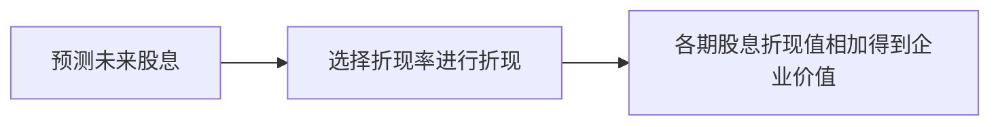

# 不同行业的企业估值模型对比

> 关键词：企业估值模型、不同行业、估值方法对比、现金流折现、相对估值法

> 摘要：本文旨在深入探讨不同行业的企业估值模型。通过对各行业特点的分析，对比了多种常见的估值模型，包括现金流折现模型、相对估值法等在不同行业的适用性和局限性。详细阐述了各模型的核心原理、数学公式，并结合实际案例进行说明。同时，介绍了相关的开发环境、工具和资源，最后对企业估值模型的未来发展趋势与挑战进行了总结，为投资者、分析师等在对不同行业企业进行估值时提供全面的参考和指导。

## 1. 背景介绍 
### 1.1 目的和范围
企业估值是投资决策、企业并购、财务报告等诸多领域的关键环节。不同行业由于其经营模式、盈利特征、风险水平等存在显著差异，适用的估值模型也不尽相同。本文的目的在于系统地对比不同行业适用的企业估值模型，分析各模型的优缺点及适用场景，范围涵盖传统制造业、科技行业、金融行业、消费行业等常见行业。

### 1.2 预期读者
本文预期读者包括金融分析师、投资者、企业管理人员、学术研究人员等。对于金融分析师和投资者而言，能够通过本文了解不同行业的合理估值方法，从而做出更准确的投资决策；企业管理人员可以借助本文的知识更好地评估自身企业价值，制定战略规划；学术研究人员则可以从中获取相关研究的基础和思路。

### 1.3 文档结构概述
本文首先介绍了相关的核心概念和它们之间的联系，包括各种估值模型的原理和架构；接着详细阐述了核心算法原理及具体操作步骤，并结合Python代码进行说明；然后给出了数学模型和公式，并举例讲解；通过项目实战部分展示了代码的实际应用和详细解读；分析了不同行业的实际应用场景；推荐了学习和开发过程中用到的工具和资源；最后总结了未来发展趋势与挑战，还包含了常见问题解答和扩展阅读参考资料。

### 1.4 术语表
#### 1.4.1 核心术语定义
- **企业估值**：对企业整体价值进行评估和估算的过程，旨在确定企业在特定时间点的经济价值。
- **现金流折现模型（DCF）**：通过预测企业未来的现金流，并将其按照一定的折现率折现到当前时点，以计算企业的内在价值。
- **相对估值法**：通过比较同行业内其他类似企业的相关指标，如市盈率（P/E）、市净率（P/B）等，来评估目标企业的价值。
- **股息折现模型（DDM）**：基于企业未来股息分配的预测，将股息按照一定的折现率折现到当前，从而得出企业的价值。

#### 1.4.2 相关概念解释
- **折现率**：用于将未来现金流或股息折现到当前的比率，反映了资金的时间价值和投资的风险水平。
- **可比公司**：在相对估值法中，与目标企业在业务、规模、财务状况等方面具有相似特征的其他企业。
- **自由现金流**：企业在满足了运营和投资需求后，可自由分配给股东和债权人的现金流量。

#### 1.4.3 缩略词列表
- **DCF**：Discounted Cash Flow（现金流折现模型）
- **P/E**：Price-to-Earnings Ratio（市盈率）
- **P/B**：Price-to-Book Ratio（市净率）
- **DDM**：Dividend Discount Model（股息折现模型）

## 2. 核心概念与联系 

### 核心概念原理和架构

#### 现金流折现模型（DCF）
原理：DCF模型基于货币的时间价值理论，认为企业的价值等于其未来产生的自由现金流的现值之和。其基本架构是先预测企业未来各期的自由现金流，然后选择合适的折现率将这些现金流折现到当前时点，最后将各期折现值相加得到企业的内在价值。

示意图：
```plaintext
           预测未来自由现金流
                   |
                   v
         选择折现率进行折现
                   |
                   v
    各期折现值相加得到企业价值
```

Mermaid流程图：


#### 相对估值法
原理：相对估值法认为同行业的企业在市场上应该具有相似的估值倍数。通过找到可比公司，计算可比公司的相关估值倍数（如P/E、P/B等），然后将目标企业的相应财务指标乘以该倍数，得到目标企业的估值。

示意图：
```plaintext
    选择可比公司
         |
         v
    计算可比公司估值倍数
         |
         v
    目标企业财务指标 × 估值倍数 = 目标企业估值
```

Mermaid流程图：


#### 股息折现模型（DDM）
原理：DDM模型假设企业的价值完全取决于其未来向股东支付的股息。通过预测企业未来各期的股息，并将其按照一定的折现率折现到当前，得到企业的价值。

示意图：
```plaintext
           预测未来股息
                   |
                   v
         选择折现率进行折现
                   |
                   v
    各期股息折现值相加得到企业价值
```

Mermaid流程图：


### 各模型之间的联系
现金流折现模型是一种基于企业内在价值的绝对估值方法，它考虑了企业未来的现金流创造能力，是最理论化和全面的估值方法。相对估值法是一种相对简单和直观的方法，它依赖于市场上可比公司的估值情况，适用于市场有效性较高的情况。股息折现模型是现金流折现模型的一种特殊形式，它只考虑了企业以股息形式分配给股东的现金流。在实际应用中，这些模型可以相互补充，例如在使用相对估值法时，可以用现金流折现模型来验证估值结果的合理性。

## 3. 核心算法原理 & 具体操作步骤 

### 现金流折现模型（DCF）

#### 算法原理
DCF模型的基本公式为：
$$V = \sum_{t=1}^{n} \frac{FCF_t}{(1 + r)^t} + \frac{TV}{(1 + r)^n}$$
其中，$V$ 表示企业的价值，$FCF_t$ 表示第 $t$ 期的自由现金流，$r$ 表示折现率，$n$ 表示预测期数，$TV$ 表示终值。

#### 具体操作步骤
1. **预测未来自由现金流**：根据企业的历史财务数据、行业发展趋势、企业战略规划等因素，预测企业未来 $n$ 期的自由现金流。
2. **确定折现率**：折现率通常采用加权平均资本成本（WACC），计算公式为：
$$WACC = E/V \times r_e + D/V \times r_d \times (1 - T_c)$$
其中，$E$ 表示股权价值，$V$ 表示企业总价值（$V = E + D$），$r_e$ 表示股权成本，$D$ 表示债务价值，$r_d$ 表示债务成本，$T_c$ 表示企业所得税税率。
3. **计算终值**：终值通常采用永续增长模型计算，公式为：
$$TV = \frac{FCF_{n+1}}{r - g}$$
其中，$FCF_{n+1}$ 表示预测期最后一期下一期的自由现金流，$g$ 表示永续增长率。
4. **计算企业价值**：将各期自由现金流和终值按照折现率折现到当前时点，并相加得到企业的价值。

#### Python代码实现
```python
import numpy as np

def dcf_valuation(fcf, r, g, n):
    """
    现金流折现模型估值
    :param fcf: 预测期各期自由现金流列表
    :param r: 折现率
    :param g: 永续增长率
    :param n: 预测期数
    :return: 企业价值
    """
    # 计算各期自由现金流的折现值
    pv_fcf = [fcf[i] / (1 + r) ** (i + 1) for i in range(n)]
    # 计算终值
    fcf_n_plus_1 = fcf[-1] * (1 + g)
    tv = fcf_n_plus_1 / (r - g)
    pv_tv = tv / (1 + r) ** n
    # 计算企业价值
    value = sum(pv_fcf) + pv_tv
    return value

# 示例数据
fcf = [100, 120, 140, 160, 180]
r = 0.1
g = 0.03
n = len(fcf)

value = dcf_valuation(fcf, r, g, n)
print(f"企业价值: {value}")
```

### 相对估值法

#### 算法原理
相对估值法的基本公式为：
$$V = P \times M$$
其中，$V$ 表示目标企业的估值，$P$ 表示目标企业的相关财务指标（如净利润、净资产等），$M$ 表示可比公司的估值倍数（如P/E、P/B等）。

#### 具体操作步骤
1. **选择可比公司**：从同行业中选择与目标企业在业务、规模、财务状况等方面具有相似特征的企业作为可比公司。
2. **计算可比公司的估值倍数**：根据可比公司的市场价格和相关财务指标，计算其估值倍数。
3. **确定目标企业的相关财务指标**：获取目标企业的相应财务指标。
4. **计算目标企业的估值**：将目标企业的财务指标乘以可比公司的估值倍数，得到目标企业的估值。

#### Python代码实现
```python
def relative_valuation(target_financial_metric, comparable_multiples):
    """
    相对估值法估值
    :param target_financial_metric: 目标企业的相关财务指标
    :param comparable_multiples: 可比公司的估值倍数列表
    :return: 目标企业的估值
    """
    # 计算可比公司估值倍数的平均值
    average_multiple = np.mean(comparable_multiples)
    # 计算目标企业的估值
    value = target_financial_metric * average_multiple
    return value

# 示例数据
target_financial_metric = 200
comparable_multiples = [10, 12, 14]

value = relative_valuation(target_financial_metric, comparable_multiples)
print(f"目标企业估值: {value}")
```

### 股息折现模型（DDM）

#### 算法原理
DDM模型的基本公式为：
$$V = \sum_{t=1}^{n} \frac{D_t}{(1 + r)^t} + \frac{TV}{(1 + r)^n}$$
其中，$V$ 表示企业的价值，$D_t$ 表示第 $t$ 期的股息，$r$ 表示折现率，$n$ 表示预测期数，$TV$ 表示终值。

#### 具体操作步骤
1. **预测未来股息**：根据企业的历史股息分配情况、盈利状况、股利政策等因素，预测企业未来 $n$ 期的股息。
2. **确定折现率**：折现率通常采用股权成本 $r_e$。
3. **计算终值**：终值通常采用永续增长模型计算，公式为：
$$TV = \frac{D_{n+1}}{r - g}$$
其中，$D_{n+1}$ 表示预测期最后一期下一期的股息，$g$ 表示永续增长率。
4. **计算企业价值**：将各期股息和终值按照折现率折现到当前时点，并相加得到企业的价值。

#### Python代码实现
```python
def ddm_valuation(dividends, r, g, n):
    """
    股息折现模型估值
    :param dividends: 预测期各期股息列表
    :param r: 折现率
    :param g: 永续增长率
    :param n: 预测期数
    :return: 企业价值
    """
    # 计算各期股息的折现值
    pv_dividends = [dividends[i] / (1 + r) ** (i + 1) for i in range(n)]
    # 计算终值
    d_n_plus_1 = dividends[-1] * (1 + g)
    tv = d_n_plus_1 / (r - g)
    pv_tv = tv / (1 + r) ** n
    # 计算企业价值
    value = sum(pv_dividends) + pv_tv
    return value

# 示例数据
dividends = [5, 6, 7, 8, 9]
r = 0.1
g = 0.03
n = len(dividends)

value = ddm_valuation(dividends, r, g, n)
print(f"企业价值: {value}")
```

## 4. 数学模型和公式 & 详细讲解 & 举例说明 

### 现金流折现模型（DCF）

#### 数学模型和公式
$$V = \sum_{t=1}^{n} \frac{FCF_t}{(1 + r)^t} + \frac{TV}{(1 + r)^n}$$
$$WACC = E/V \times r_e + D/V \times r_d \times (1 - T_c)$$
$$TV = \frac{FCF_{n+1}}{r - g}$$

#### 详细讲解
- **自由现金流（FCF）**：是企业在满足了运营和投资需求后，可自由分配给股东和债权人的现金流量。预测FCF需要对企业的营业收入、成本、资本支出等进行详细分析。
- **折现率（r）**：通常采用加权平均资本成本（WACC），它反映了企业融资的综合成本。$E/V$ 和 $D/V$ 分别表示股权和债务在企业总价值中的比重，$r_e$ 是股权成本，$r_d$ 是债务成本，$T_c$ 是企业所得税税率。
- **终值（TV）**：由于无法无限期地预测自由现金流，通常假设企业在预测期结束后进入稳定增长阶段，采用永续增长模型计算终值。

#### 举例说明
假设一家企业未来5年的自由现金流分别为100万元、120万元、140万元、160万元、180万元，折现率为10%，永续增长率为3%。
1. 计算各期自由现金流的折现值：
    - 第1年：$100 / (1 + 0.1)^1 = 90.91$ 万元
    - 第2年：$120 / (1 + 0.1)^2 = 99.17$ 万元
    - 第3年：$140 / (1 + 0.1)^3 = 105.18$ 万元
    - 第4年：$160 / (1 + 0.1)^4 = 109.29$ 万元
    - 第5年：$180 / (1 + 0.1)^5 = 111.74$ 万元
2. 计算终值：
    - 第6年的自由现金流：$180 \times (1 + 0.03) = 185.4$ 万元
    - 终值：$185.4 / (0.1 - 0.03) = 2648.57$ 万元
    - 终值的折现值：$2648.57 / (1 + 0.1)^5 = 1643.03$ 万元
3. 计算企业价值：
    - 企业价值：$90.91 + 99.17 + 105.18 + 109.29 + 111.74 + 1643.03 = 2159.32$ 万元

### 相对估值法

#### 数学模型和公式
$$V = P \times M$$

#### 详细讲解
- **目标企业的相关财务指标（P）**：可以是净利润、净资产、营业收入等，具体选择取决于行业特点和分析目的。
- **可比公司的估值倍数（M）**：常见的估值倍数有市盈率（P/E）、市净率（P/B）、市销率（P/S）等。通过计算可比公司的估值倍数，并取平均值或中位数，作为目标企业的估值参考。

#### 举例说明
假设目标企业的净利润为200万元，选取了3家可比公司，它们的市盈率分别为10、12、14。
1. 计算可比公司市盈率的平均值：
    - 平均值：$(10 + 12 + 14) / 3 = 12$
2. 计算目标企业的估值：
    - 估值：$200 \times 12 = 2400$ 万元

### 股息折现模型（DDM）

#### 数学模型和公式
$$V = \sum_{t=1}^{n} \frac{D_t}{(1 + r)^t} + \frac{TV}{(1 + r)^n}$$
$$TV = \frac{D_{n+1}}{r - g}$$

#### 详细讲解
- **股息（D）**：是企业向股东分配的利润。预测股息需要考虑企业的盈利状况、股利政策等因素。
- **折现率（r）**：通常采用股权成本，反映了股东投资的期望回报率。
- **终值（TV）**：同样采用永续增长模型计算，假设企业在预测期结束后股息以固定增长率 $g$ 持续增长。

#### 举例说明
假设一家企业未来5年的股息分别为5元、6元、7元、8元、9元，折现率为10%，永续增长率为3%。
1. 计算各期股息的折现值：
    - 第1年：$5 / (1 + 0.1)^1 = 4.55$ 元
    - 第2年：$6 / (1 + 0.1)^2 = 4.96$ 元
    - 第3年：$7 / (1 + 0.1)^3 = 5.26$ 元
    - 第4年：$8 / (1 + 0.1)^4 = 5.46$ 元
    - 第5年：$9 / (1 + 0.1)^5 = 5.58$ 元
2. 计算终值：
    - 第6年的股息：$9 \times (1 + 0.03) = 9.27$ 元
    - 终值：$9.27 / (0.1 - 0.03) = 132.43$ 元
    - 终值的折现值：$132.43 / (1 + 0.1)^5 = 82.22$ 元
3. 计算企业价值：
    - 企业价值：$4.55 + 4.96 + 5.26 + 5.46 + 5.58 + 82.22 = 108.03$ 元

## 5. 项目实战：代码实际案例和详细解释说明 

### 5.1  开发环境搭建
- **Python环境**：建议使用Python 3.7及以上版本。可以从Python官方网站（https://www.python.org/downloads/）下载安装包进行安装。
- **开发工具**：推荐使用Jupyter Notebook或PyCharm。Jupyter Notebook适合进行交互式编程和数据分析，PyCharm是一款功能强大的Python集成开发环境（IDE）。
- **必要的库**：需要安装`numpy`库，用于数值计算。可以使用以下命令进行安装：
```sh
pip install numpy
```

### 5.2  源代码详细实现和代码解读

#### 现金流折现模型（DCF）
```python
import numpy as np

def dcf_valuation(fcf, r, g, n):
    """
    现金流折现模型估值
    :param fcf: 预测期各期自由现金流列表
    :param r: 折现率
    :param g: 永续增长率
    :param n: 预测期数
    :return: 企业价值
    """
    # 计算各期自由现金流的折现值
    pv_fcf = [fcf[i] / (1 + r) ** (i + 1) for i in range(n)]
    # 计算终值
    fcf_n_plus_1 = fcf[-1] * (1 + g)
    tv = fcf_n_plus_1 / (r - g)
    pv_tv = tv / (1 + r) ** n
    # 计算企业价值
    value = sum(pv_fcf) + pv_tv
    return value

# 示例数据
fcf = [100, 120, 140, 160, 180]
r = 0.1
g = 0.03
n = len(fcf)

value = dcf_valuation(fcf, r, g, n)
print(f"企业价值: {value}")
```

**代码解读**：
- `dcf_valuation`函数接受预测期各期自由现金流列表`fcf`、折现率`r`、永续增长率`g`和预测期数`n`作为输入。
- 在函数内部，首先使用列表推导式计算各期自由现金流的折现值`pv_fcf`。
- 然后计算预测期最后一期下一期的自由现金流`fcf_n_plus_1`，并根据永续增长模型计算终值`tv`，再将终值折现得到`pv_tv`。
- 最后将各期自由现金流的折现值和终值的折现值相加，得到企业的价值。

#### 相对估值法
```python
def relative_valuation(target_financial_metric, comparable_multiples):
    """
    相对估值法估值
    :param target_financial_metric: 目标企业的相关财务指标
    :param comparable_multiples: 可比公司的估值倍数列表
    :return: 目标企业的估值
    """
    # 计算可比公司估值倍数的平均值
    average_multiple = np.mean(comparable_multiples)
    # 计算目标企业的估值
    value = target_financial_metric * average_multiple
    return value

# 示例数据
target_financial_metric = 200
comparable_multiples = [10, 12, 14]

value = relative_valuation(target_financial_metric, comparable_multiples)
print(f"目标企业估值: {value}")
```

**代码解读**：
- `relative_valuation`函数接受目标企业的相关财务指标`target_financial_metric`和可比公司的估值倍数列表`comparable_multiples`作为输入。
- 在函数内部，使用`np.mean`函数计算可比公司估值倍数的平均值`average_multiple`。
- 然后将目标企业的财务指标乘以平均估值倍数，得到目标企业的估值。

#### 股息折现模型（DDM）
```python
def ddm_valuation(dividends, r, g, n):
    """
    股息折现模型估值
    :param dividends: 预测期各期股息列表
    :param r: 折现率
    :param g: 永续增长率
    :param n: 预测期数
    :return: 企业价值
    """
    # 计算各期股息的折现值
    pv_dividends = [dividends[i] / (1 + r) ** (i + 1) for i in range(n)]
    # 计算终值
    d_n_plus_1 = dividends[-1] * (1 + g)
    tv = d_n_plus_1 / (r - g)
    pv_tv = tv / (1 + r) ** n
    # 计算企业价值
    value = sum(pv_dividends) + pv_tv
    return value

# 示例数据
dividends = [5, 6, 7, 8, 9]
r = 0.1
g = 0.03
n = len(dividends)

value = ddm_valuation(dividends, r, g, n)
print(f"企业价值: {value}")
```

**代码解读**：
- `ddm_valuation`函数接受预测期各期股息列表`dividends`、折现率`r`、永续增长率`g`和预测期数`n`作为输入。
- 在函数内部，首先使用列表推导式计算各期股息的折现值`pv_dividends`。
- 然后计算预测期最后一期下一期的股息`d_n_plus_1`，并根据永续增长模型计算终值`tv`，再将终值折现得到`pv_tv`。
- 最后将各期股息的折现值和终值的折现值相加，得到企业的价值。

### 5.3  代码解读与分析
- **现金流折现模型（DCF）**：该模型的优点是考虑了企业未来的现金流创造能力，能够较为准确地反映企业的内在价值。但缺点是对未来现金流和折现率的预测较为困难，预测结果的准确性对模型的可靠性影响较大。
- **相对估值法**：该方法简单直观，易于理解和应用，能够快速得到企业的估值。但缺点是依赖于可比公司的选择和市场的有效性，如果可比公司选择不当或市场存在异常波动，可能会导致估值结果不准确。
- **股息折现模型（DDM）**：该模型适用于股息分配稳定的企业，能够反映企业对股东的回报能力。但缺点是对于不分配股息或股息分配不稳定的企业不适用。

## 6. 实际应用场景 

### 传统制造业
传统制造业企业通常具有较为稳定的现金流和资产基础。现金流折现模型（DCF）在该行业的应用较为广泛，因为可以通过预测企业未来的生产、销售和成本情况，较为准确地估算自由现金流。同时，相对估值法也可作为辅助方法，通过比较同行业企业的市盈率、市净率等指标，对企业进行估值。例如，一家汽车制造企业，其生产和销售具有一定的周期性，但长期来看现金流相对稳定，可以使用DCF模型进行估值，并结合相对估值法进行验证。

### 科技行业
科技行业企业的特点是发展速度快、创新性强，但盈利不确定性较大。相对估值法在该行业应用较多，尤其是对于尚未盈利的科技初创企业，市销率（P/S）等指标可以作为估值参考。此外，对于一些具有稳定现金流和盈利预期的科技企业，也可以使用现金流折现模型进行估值。例如，一家互联网科技公司，在其快速发展阶段，可能尚未实现盈利，但营业收入增长迅速，可以通过与同行业其他类似公司的市销率对比进行估值。

### 金融行业
金融行业企业的资产和负债结构较为特殊，其价值主要取决于风险管理能力和盈利能力。相对估值法中的市净率（P/B）在金融行业应用广泛，因为金融企业的净资产相对较为稳定，能够反映其资产质量。同时，现金流折现模型也可用于评估金融企业的长期价值，但需要考虑金融行业的特殊风险和监管要求。例如，一家银行，其资产主要由贷款和投资组成，负债主要是存款，通过市净率可以快速评估其相对价值，再结合DCF模型考虑其未来的盈利和现金流情况。

### 消费行业
消费行业企业通常具有较为稳定的现金流和品牌价值。股息折现模型（DDM）在该行业有一定的适用性，因为很多消费企业注重股息分配，能够为股东提供稳定的回报。同时，现金流折现模型和相对估值法也可结合使用。例如，一家食品饮料企业，其产品市场需求稳定，盈利和股息分配较为稳定，可以使用DDM模型进行估值，再通过相对估值法与同行业企业进行比较。

## 7. 工具和资源推荐

### 7.1 学习资源推荐

#### 7.1.1 书籍推荐
- 《估值：难点、解决方案及相关案例》：全面介绍了企业估值的各种方法和技巧，包含大量实际案例，对不同行业的估值有深入分析。
- 《投资中最简单的事》：从投资的角度阐述了企业估值的重要性和方法，语言通俗易懂，适合初学者。
- 《财务报表分析与证券定价》：详细讲解了如何通过财务报表分析进行企业估值，对理解企业的财务状况和价值评估有很大帮助。

#### 7.1.2 在线课程
- Coursera上的“Corporate Finance”：由知名大学教授授课，系统介绍了企业融资、估值等方面的知识。
- edX上的“Valuation for Mergers, Acquisitions, and Restructuring”：专注于企业并购和重组中的估值问题，内容深入实用。
- 网易云课堂上的“企业估值实战课程”：结合实际案例，讲解企业估值的方法和应用。

#### 7.1.3 技术博客和网站
- Seeking Alpha：提供专业的金融分析和企业估值文章，涵盖了不同行业的企业分析。
- Bloomberg：全球知名的金融信息服务提供商，提供丰富的市场数据和企业估值相关的研究报告。
- 雪球财经：国内知名的投资交流社区，有很多投资者分享企业估值的经验和见解。

### 7.2 开发工具框架推荐

#### 7.2.1 IDE和编辑器
- Jupyter Notebook：适合进行交互式编程和数据分析，方便展示代码和结果，支持多种编程语言。
- PyCharm：功能强大的Python集成开发环境，提供代码调试、自动补全、版本控制等功能，提高开发效率。
- Visual Studio Code：轻量级的代码编辑器，支持多种编程语言和插件扩展，可用于快速编写和调试代码。

#### 7.2.2 调试和性能分析工具
- PDB：Python自带的调试工具，可以在代码中设置断点，逐步执行代码，方便查找和解决问题。
- cProfile：Python标准库中的性能分析工具，用于分析代码的运行时间和函数调用情况，找出性能瓶颈。
- Py-Spy：一款跨平台的Python性能分析工具，无需修改代码即可进行性能分析，提供直观的可视化界面。

#### 7.2.3 相关框架和库
- Numpy：用于数值计算的Python库，提供了高效的数组操作和数学函数，在企业估值模型的计算中经常使用。
- Pandas：用于数据处理和分析的Python库，提供了数据结构和数据操作方法，方便处理和分析财务数据。
- Scikit-learn：用于机器学习的Python库，可用于对企业数据进行建模和预测，辅助企业估值。

### 7.3 相关论文著作推荐

#### 7.3.1 经典论文
- “The Theory of Investment Value” by John Burr Williams：提出了股息折现模型（DDM）的基本思想，是企业估值领域的经典之作。
- “Valuation and Corporate Finance” by Aswath Damodaran：系统介绍了企业估值的理论和方法，对现金流折现模型、相对估值法等进行了深入探讨。
- “Market Efficiency: A Theoretical Distinction and so What?” by Eugene F. Fama：讨论了市场效率对企业估值的影响，为相对估值法的应用提供了理论基础。

#### 7.3.2 最新研究成果
- 关于科技行业企业估值的最新研究，考虑了人工智能、大数据等新兴技术对企业价值的影响。
- 对金融科技企业估值方法的研究，结合了金融行业和科技行业的特点。
- 关于绿色企业估值的研究，考虑了环境、社会和治理（ESG）因素对企业价值的影响。

#### 7.3.3 应用案例分析
- 分析苹果公司、亚马逊公司等科技巨头的估值案例，了解科技行业企业估值的方法和特点。
- 研究银行、保险公司等金融企业的估值案例，掌握金融行业企业估值的要点。
- 探讨可口可乐、宝洁等消费企业的估值案例，学习消费行业企业估值的思路。

## 8. 总结：未来发展趋势与挑战

### 未来发展趋势
- **多元化估值模型的融合**：随着企业经营模式的日益复杂和多元化，单一的估值模型可能无法准确评估企业的价值。未来，将多种估值模型融合使用的趋势将更加明显，例如将现金流折现模型与实物期权模型相结合，考虑企业的战略投资和不确定性因素对价值的影响。
- **数据驱动的估值方法**：随着大数据、人工智能等技术的发展，企业可以获取更多的内外部数据。利用这些数据进行机器学习和数据分析，开发数据驱动的估值模型将成为未来的发展方向。例如，通过分析社交媒体数据、行业大数据等，更准确地预测企业的未来业绩和价值。
- **考虑ESG因素的估值**：环境、社会和治理（ESG）因素对企业的长期发展和价值越来越重要。未来的企业估值模型将更多地考虑ESG因素，将其纳入到现金流预测、折现率调整等环节中，以更全面地评估企业的可持续发展能力和价值。

### 挑战
- **数据质量和可靠性**：数据驱动的估值方法依赖于大量的高质量数据。然而，数据的收集、整理和清洗过程中可能存在误差和偏差，影响估值结果的准确性。此外，一些企业的数据可能存在不透明或造假的情况，给估值带来挑战。
- **模型的复杂性和可解释性**：多元化估值模型的融合和数据驱动的估值方法往往会增加模型的复杂性。复杂的模型可能难以理解和解释，降低了模型的可信度和实用性。如何在保证模型准确性的前提下，提高模型的可解释性是一个重要的挑战。
- **市场的不确定性**：市场环境的不确定性，如宏观经济波动、政策变化、行业竞争等，会对企业的未来业绩和价值产生影响。准确预测这些不确定性因素对企业价值的影响是非常困难的，给企业估值带来了很大的挑战。

## 9. 附录：常见问题与解答

### 1. 如何选择合适的估值模型？
选择合适的估值模型需要考虑企业的行业特点、经营模式、财务状况、发展阶段等因素。一般来说，对于现金流稳定的企业，现金流折现模型（DCF）较为适用；对于同行业有较多可比公司的企业，相对估值法是一个不错的选择；对于股息分配稳定的企业，股息折现模型（DDM）可以作为参考。在实际应用中，也可以结合多种模型进行估值，相互验证。

### 2. 折现率的确定方法有哪些？
折现率的确定方法有多种，常见的有以下几种：
- **加权平均资本成本（WACC）**：综合考虑了股权成本和债务成本，是最常用的折现率确定方法。
- **资本资产定价模型（CAPM）**：通过计算股票的系统性风险来确定股权成本，进而确定折现率。
- **行业平均收益率**：参考同行业其他企业的平均收益率作为折现率。

### 3. 如何预测企业的未来现金流？
预测企业的未来现金流需要综合考虑企业的历史财务数据、行业发展趋势、市场竞争状况、企业战略规划等因素。可以采用以下方法：
- **趋势分析法**：根据企业过去的现金流变化趋势，预测未来的现金流。
- **情景分析法**：设定不同的情景，如乐观情景、悲观情景和中性情景，分别预测不同情景下的现金流。
- **专家判断法**：咨询行业专家、企业管理人员等，获取他们对企业未来现金流的看法和预测。

### 4. 相对估值法中可比公司的选择标准是什么？
可比公司的选择标准主要包括以下几个方面：
- **行业相同或相似**：选择与目标企业处于同一行业或具有相似业务模式的企业。
- **规模相近**：可比公司的规模（如营业收入、资产规模等）应与目标企业相近。
- **财务状况相似**：可比公司的盈利能力、偿债能力、运营能力等财务指标应与目标企业相似。
- **市场环境相同**：可比公司所处的市场环境（如宏观经济环境、行业竞争环境等）应与目标企业相同。

### 5. 企业估值结果的准确性如何保证？
企业估值结果的准确性受到多种因素的影响，为了保证估值结果的准确性，可以采取以下措施：
- **合理选择估值模型**：根据企业的实际情况选择合适的估值模型，并结合多种模型进行估值，相互验证。
- **准确预测输入参数**：如未来现金流、折现率、永续增长率等输入参数的预测应基于充分的研究和分析，尽量减少误差。
- **考虑不确定性因素**：采用敏感性分析、情景分析等方法，考虑不确定性因素对估值结果的影响。
- **持续跟踪和调整**：企业的经营状况和市场环境是不断变化的，应持续跟踪企业的发展情况，及时调整估值结果。

## 10. 扩展阅读 & 参考资料
- 《Financial Management: Theory and Practice》 by Eugene F. Brigham and Michael C. Ehrhardt
- 《Valuation: Measuring and Managing the Value of Companies》 by Tim Koller, Marc Goedhart, and David Wessels
- 中国证券监督管理委员会官方网站（https://www.csrc.gov.cn/）
- 美国证券交易委员会官方网站（https://www.sec.gov/）

作者：AI天才研究院/AI Genius Institute & 禅与计算机程序设计艺术 /Zen And The Art of Computer Programming