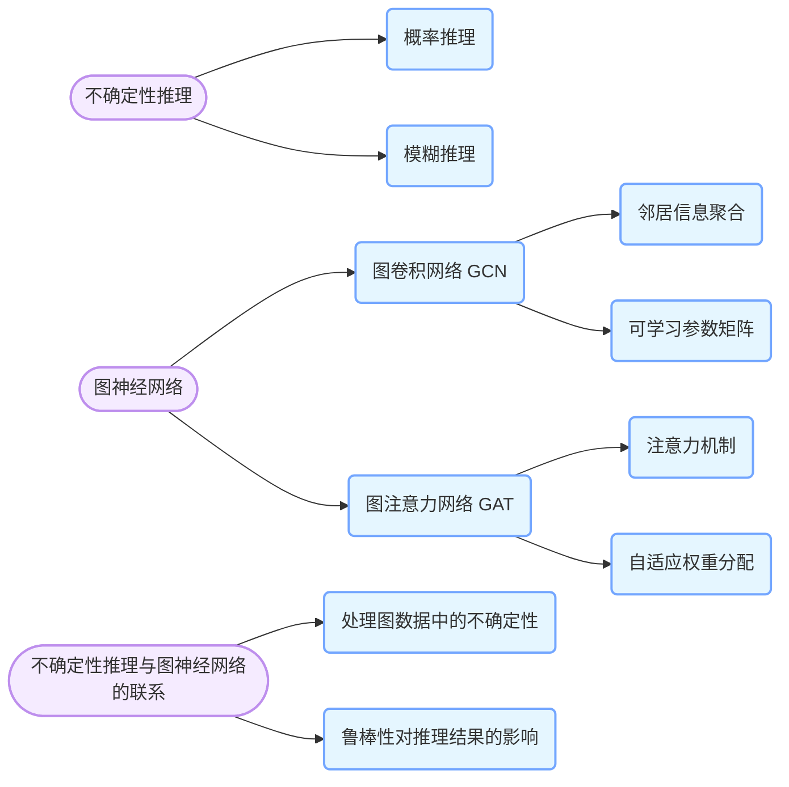

# 不确定性推理中图神经网络的鲁棒性研究

> 关键词：不确定性推理、图神经网络、鲁棒性、深度学习、图数据

> 摘要：本文聚焦于不确定性推理中图神经网络的鲁棒性研究。首先介绍了相关背景，包括研究目的、预期读者等内容。接着阐述了不确定性推理和图神经网络的核心概念及其联系，给出了原理和架构的文本示意图与Mermaid流程图。详细讲解了核心算法原理，并用Python源代码进行说明，同时给出了数学模型和公式并举例。通过项目实战展示了代码实现及解读。分析了实际应用场景，推荐了学习资源、开发工具框架和相关论文著作。最后总结了未来发展趋势与挑战，解答了常见问题并提供扩展阅读和参考资料，旨在为相关领域的研究和应用提供全面且深入的指导。

## 1. 背景介绍 
### 1.1 目的和范围
在现实世界中，许多数据都以图的形式存在，如社交网络、生物网络、知识图谱等。图神经网络（Graph Neural Networks, GNNs）作为处理图数据的强大工具，在节点分类、图分类、链接预测等任务中取得了显著的成果。然而，实际图数据往往存在不确定性，例如数据中的噪声、缺失值以及数据分布的变化等。在不确定性推理的场景下，图神经网络的鲁棒性就显得尤为重要。

本研究的目的在于深入探讨不确定性推理中图神经网络的鲁棒性问题，分析影响鲁棒性的因素，研究提高鲁棒性的方法和策略。研究范围涵盖了常见的图神经网络架构，如Graph Convolutional Networks (GCN)、Graph Attention Networks (GAT)等，以及多种不确定性场景，包括数据噪声、对抗攻击等。

### 1.2 预期读者
本文的预期读者包括从事机器学习、深度学习、数据挖掘等领域的研究人员和学者，他们希望深入了解图神经网络在不确定性推理中的鲁棒性问题。同时，也适合对图数据处理和分析感兴趣的工程师和开发者，帮助他们在实际项目中更好地应用图神经网络并提高模型的鲁棒性。

### 1.3 文档结构概述
本文共分为十个部分。第一部分为背景介绍，阐述了研究的目的、范围、预期读者和文档结构。第二部分介绍了不确定性推理和图神经网络的核心概念及其联系，给出了原理和架构的文本示意图与Mermaid流程图。第三部分详细讲解了核心算法原理，并使用Python源代码进行说明。第四部分给出了相关的数学模型和公式，并举例说明。第五部分通过项目实战展示了代码实现及解读。第六部分分析了实际应用场景。第七部分推荐了学习资源、开发工具框架和相关论文著作。第八部分总结了未来发展趋势与挑战。第九部分解答了常见问题。第十部分提供了扩展阅读和参考资料。

### 1.4 术语表
#### 1.4.1 核心术语定义
- **不确定性推理**：在信息不完整、不准确或存在噪声的情况下进行推理的过程。在图数据中，不确定性可能表现为节点特征的噪声、边的缺失或错误等。
- **图神经网络（GNN）**：一类专门用于处理图数据的神经网络模型，通过节点之间的消息传递来学习节点和图的表示。
- **鲁棒性**：模型在面对不确定性、噪声、对抗攻击等不利条件时，仍能保持较好性能的能力。
- **数据噪声**：数据中存在的随机误差或干扰，可能导致数据的不准确或不一致。
- **对抗攻击**：有意地对输入数据进行微小的扰动，以误导模型的输出。

#### 1.4.2 相关概念解释
- **图数据**：由节点和边组成的数据结构，节点表示实体，边表示实体之间的关系。
- **节点分类**：根据节点的特征和图的结构，将节点划分为不同的类别。
- **图分类**：将整个图划分为不同的类别。
- **链接预测**：预测图中两个节点之间是否存在边。

#### 1.4.3 缩略词列表
- **GNN**：Graph Neural Networks（图神经网络）
- **GCN**：Graph Convolutional Networks（图卷积网络）
- **GAT**：Graph Attention Networks（图注意力网络）
- **MLP**：Multi - Layer Perceptron（多层感知机）

## 2. 核心概念与联系 
### 2.1 不确定性推理的原理
不确定性推理的核心思想是在不完整或不准确的信息下进行合理的推断。常见的不确定性推理方法包括概率推理、模糊推理等。在图数据中，不确定性可能来自多个方面。例如，节点特征可能存在测量误差或不完整性，边的存在与否可能存在不确定性。

概率推理是一种常用的不确定性推理方法，它基于概率论的原理，通过计算事件发生的概率来进行推理。例如，在节点分类任务中，我们可以计算节点属于每个类别的概率，然后根据概率最大的类别进行预测。

### 2.2 图神经网络的原理
图神经网络通过节点之间的消息传递来学习节点和图的表示。基本的图神经网络架构包括图卷积网络（GCN）和图注意力网络（GAT）。

#### 2.2.1 图卷积网络（GCN）
GCN的核心思想是通过聚合节点的邻居信息来更新节点的表示。具体来说，对于节点 $i$，其第 $l + 1$ 层的表示 $h_i^{l+1}$ 可以通过以下公式计算：

$$h_i^{l + 1}=\sigma\left(\sum_{j\in\mathcal{N}(i)\cup\{i\}}\frac{1}{\sqrt{\hat{d}_i\hat{d}_j}}W^lh_j^l\right)$$

其中，$\mathcal{N}(i)$ 是节点 $i$ 的邻居节点集合，$\hat{d}_i$ 是节点 $i$ 的度加上 1，$W^l$ 是第 $l$ 层的可学习参数矩阵，$\sigma$ 是激活函数。

#### 2.2.2 图注意力网络（GAT）
GAT引入了注意力机制，使得节点在聚合邻居信息时能够自适应地分配权重。对于节点 $i$ 和其邻居节点 $j$，注意力系数 $\alpha_{ij}$ 可以通过以下公式计算：

$$\alpha_{ij}=\frac{\exp\left(\text{LeakyReLU}\left(a^T\left[W h_i||W h_j\right]\right)\right)}{\sum_{k\in\mathcal{N}(i)}\exp\left(\text{LeakyReLU}\left(a^T\left[W h_i||W h_k\right]\right)\right)}$$

其中，$W$ 是可学习的线性变换矩阵，$a$ 是可学习的注意力向量，$||$ 表示拼接操作。然后，节点 $i$ 的第 $l + 1$ 层表示 $h_i^{l+1}$ 可以通过以下公式计算：

$$h_i^{l + 1}=\sigma\left(\sum_{j\in\mathcal{N}(i)}\alpha_{ij}W^lh_j^l\right)$$

### 2.3 不确定性推理与图神经网络的联系
在不确定性推理中，图神经网络可以用于处理图数据中的不确定性。例如，通过在图神经网络中引入概率模型，可以更好地处理节点特征和边的不确定性。同时，图神经网络的鲁棒性对于在不确定性环境下进行准确的推理至关重要。如果图神经网络在面对数据噪声或对抗攻击时容易失效，那么基于它的不确定性推理结果也将不可靠。

### 2.4 核心概念原理和架构的文本示意图
```plaintext
不确定性推理
|
|-- 概率推理
|-- 模糊推理
|
图神经网络
|
|-- 图卷积网络（GCN）
|   |-- 邻居信息聚合
|   |-- 可学习参数矩阵
|
|-- 图注意力网络（GAT）
|   |-- 注意力机制
|   |-- 自适应权重分配
|
不确定性推理与图神经网络的联系
|
|-- 处理图数据中的不确定性
|-- 鲁棒性对推理结果的影响
```

### 2.5 Mermaid流程图


## 3. 核心算法原理 & 具体操作步骤 
### 3.1 基于GCN的不确定性推理算法原理
在基于GCN的不确定性推理中，我们可以将节点的不确定性表示为概率分布。例如，对于节点的特征，我们可以假设其服从高斯分布。在GCN的消息传递过程中，我们需要考虑邻居节点特征的不确定性。

具体来说，假设节点 $i$ 的特征 $x_i$ 服从高斯分布 $\mathcal{N}(\mu_i,\Sigma_i)$，其中 $\mu_i$ 是均值向量，$\Sigma_i$ 是协方差矩阵。在GCN的第 $l$ 层，节点 $i$ 从其邻居节点 $j$ 接收消息。消息的均值 $\mu_{ij}^l$ 和协方差 $\Sigma_{ij}^l$ 可以通过以下公式计算：

$$\mu_{ij}^l = \frac{1}{\sqrt{\hat{d}_i\hat{d}_j}}W^l\mu_j^l$$

$$\Sigma_{ij}^l=\frac{1}{\hat{d}_i\hat{d}_j}W^l\Sigma_j^l(W^l)^T$$

然后，节点 $i$ 的更新后的均值 $\mu_i^{l+1}$ 和协方差 $\Sigma_i^{l+1}$ 可以通过以下公式计算：

$$\mu_i^{l + 1}=\sigma\left(\sum_{j\in\mathcal{N}(i)\cup\{i\}}\mu_{ij}^l\right)$$

$$\Sigma_i^{l + 1}=\text{diag}\left(\sigma'\left(\sum_{j\in\mathcal{N}(i)\cup\{i\}}\mu_{ij}^l\right)^2\sum_{j\in\mathcal{N}(i)\cup\{i\}}\Sigma_{ij}^l\right)$$

其中，$\sigma'$ 是 $\sigma$ 的导数。

### 3.2 Python源代码实现
```python
import torch
import torch.nn as nn
import torch.nn.functional as F

class GaussianGCNLayer(nn.Module):
    def __init__(self, in_features, out_features):
        super(GaussianGCNLayer, self).__init__()
        self.weight_mean = nn.Parameter(torch.FloatTensor(in_features, out_features))
        self.weight_cov = nn.Parameter(torch.FloatTensor(in_features, out_features))
        self.reset_parameters()

    def reset_parameters(self):
        nn.init.xavier_uniform_(self.weight_mean)
        nn.init.xavier_uniform_(self.weight_cov)

    def forward(self, mu, sigma, adj):
        # 计算消息的均值
        mu_message = torch.mm(mu, self.weight_mean)
        mu_hat = torch.spmm(adj, mu_message)

        # 计算消息的协方差
        sigma_message = torch.mm(sigma, self.weight_cov)
        sigma_hat = torch.spmm(adj, sigma_message)

        # 更新节点的均值和协方差
        new_mu = F.relu(mu_hat)
        relu_derivative = (mu_hat > 0).float()
        new_sigma = relu_derivative.pow(2) * sigma_hat

        return new_mu, new_sigma

class GaussianGCN(nn.Module):
    def __init__(self, nfeat, nhid, nclass):
        super(GaussianGCN, self).__init__()
        self.gc1 = GaussianGCNLayer(nfeat, nhid)
        self.gc2 = GaussianGCNLayer(nhid, nclass)

    def forward(self, mu, sigma, adj):
        mu, sigma = self.gc1(mu, sigma, adj)
        mu, sigma = self.gc2(mu, sigma, adj)
        return mu, sigma
```

### 3.3 具体操作步骤
1. **数据预处理**：将图数据转换为邻接矩阵 $A$ 和节点特征矩阵 $X$。同时，为节点特征添加不确定性，将其表示为高斯分布的均值 $\mu$ 和协方差 $\Sigma$。
2. **模型初始化**：初始化基于GaussianGCN的模型，设置输入特征维度、隐藏层维度和输出类别数。
3. **训练模型**：定义损失函数，例如交叉熵损失函数，用于衡量模型预测的均值和真实标签之间的差异。使用随机梯度下降等优化算法更新模型的参数。
4. **推理过程**：在推理阶段，输入测试数据的均值和协方差，通过模型得到输出的均值和协方差。根据输出的均值进行类别预测。

## 4. 数学模型和公式 & 详细讲解 & 举例说明 
### 4.1 基于GCN的不确定性推理的数学模型
在基于GCN的不确定性推理中，我们使用高斯分布来表示节点特征的不确定性。设图 $G=(V, E)$，其中 $V$ 是节点集合，$E$ 是边集合。节点 $i$ 的特征 $x_i$ 服从高斯分布 $\mathcal{N}(\mu_i,\Sigma_i)$。

在GCN的第 $l$ 层，节点 $i$ 从其邻居节点 $j$ 接收消息。消息传递的过程可以用以下公式表示：

#### 消息的均值计算
$$\mu_{ij}^l = \frac{1}{\sqrt{\hat{d}_i\hat{d}_j}}W^l\mu_j^l$$

其中，$\hat{d}_i$ 是节点 $i$ 的度加上 1，$W^l$ 是第 $l$ 层的可学习参数矩阵。这个公式表示节点 $i$ 从邻居节点 $j$ 接收的消息的均值是通过对邻居节点 $j$ 的特征均值进行线性变换并归一化得到的。

#### 消息的协方差计算
$$\Sigma_{ij}^l=\frac{1}{\hat{d}_i\hat{d}_j}W^l\Sigma_j^l(W^l)^T$$

这个公式表示节点 $i$ 从邻居节点 $j$ 接收的消息的协方差是通过对邻居节点 $j$ 的特征协方差进行线性变换并归一化得到的。

#### 节点的更新
$$\mu_i^{l + 1}=\sigma\left(\sum_{j\in\mathcal{N}(i)\cup\{i\}}\mu_{ij}^l\right)$$

$$\Sigma_i^{l + 1}=\text{diag}\left(\sigma'\left(\sum_{j\in\mathcal{N}(i)\cup\{i\}}\mu_{ij}^l\right)^2\sum_{j\in\mathcal{N}(i)\cup\{i\}}\Sigma_{ij}^l\right)$$

其中，$\sigma$ 是激活函数，如ReLU函数，$\sigma'$ 是 $\sigma$ 的导数。这两个公式表示节点 $i$ 的更新后的均值和协方差是通过聚合邻居节点的消息并经过激活函数处理得到的。

### 4.2 详细讲解
- **均值的更新**：节点的均值更新是通过聚合邻居节点的消息的均值得到的。激活函数 $\sigma$ 的作用是引入非线性，使得模型能够学习到更复杂的特征表示。
- **协方差的更新**：节点的协方差更新考虑了激活函数的导数。由于激活函数的非线性，协方差的更新需要进行调整。$\text{diag}$ 函数的作用是将矩阵的对角线元素提取出来，得到一个对角矩阵，以保证协方差矩阵的正定性。

### 4.3 举例说明
假设我们有一个简单的图，包含 3 个节点 $v_1, v_2, v_3$，节点的特征维度为 2。节点 $v_1$ 的特征均值 $\mu_1 = [1, 2]^T$，协方差 $\Sigma_1=\begin{bmatrix}0.1 & 0\\0 & 0.2\end{bmatrix}$，节点 $v_2$ 的特征均值 $\mu_2 = [3, 4]^T$，协方差 $\Sigma_2=\begin{bmatrix}0.3 & 0\\0 & 0.4\end{bmatrix}$，节点 $v_3$ 的特征均值 $\mu_3 = [5, 6]^T$，协方差 $\Sigma_3=\begin{bmatrix}0.5 & 0\\0 & 0.6\end{bmatrix}$。

邻接矩阵 $A=\begin{bmatrix}0 & 1 & 0\\1 & 0 & 1\\0 & 1 & 0\end{bmatrix}$，第 1 层的可学习参数矩阵 $W^1=\begin{bmatrix}0.1 & 0.2\\0.3 & 0.4\end{bmatrix}$。

#### 计算消息的均值
对于节点 $v_1$，其邻居节点为 $v_2$。

$$\hat{d}_1 = 1 + 1 = 2, \hat{d}_2 = 2 + 1 = 3$$

$$\mu_{12}^1=\frac{1}{\sqrt{2\times3}}W^1\mu_2=\frac{1}{\sqrt{6}}\begin{bmatrix}0.1 & 0.2\\0.3 & 0.4\end{bmatrix}\begin{bmatrix}3\\4\end{bmatrix}\approx\begin{bmatrix}0.57\\1.33\end{bmatrix}$$

#### 计算消息的协方差
$$\Sigma_{12}^1=\frac{1}{2\times3}W^1\Sigma_2(W^1)^T=\frac{1}{6}\begin{bmatrix}0.1 & 0.2\\0.3 & 0.4\end{bmatrix}\begin{bmatrix}0.3 & 0\\0 & 0.4\end{bmatrix}\begin{bmatrix}0.1 & 0.3\\0.2 & 0.4\end{bmatrix}\approx\begin{bmatrix}0.005 & 0.011\\0.011 & 0.025\end{bmatrix}$$

#### 更新节点的均值和协方差
假设激活函数为ReLU函数，$\sigma(x)=\max(0, x)$，$\sigma'(x)=(x > 0).float()$。

对于节点 $v_1$，由于只有一个邻居节点 $v_2$，则

$$\mu_1^{2}=\sigma(\mu_{12}^1)=\begin{bmatrix}0.57\\1.33\end{bmatrix}$$

$$\Sigma_1^{2}=\text{diag}(\sigma'(\mu_{12}^1)^2\Sigma_{12}^1)=\begin{bmatrix}0.005 & 0\\0 & 0.025\end{bmatrix}$$

## 5. 项目实战：代码实际案例和详细解释说明 
### 5.1  开发环境搭建
#### 5.1.1 安装Python
首先，确保你已经安装了Python 3.x版本。可以从Python官方网站（https://www.python.org/downloads/）下载并安装适合你操作系统的Python版本。

#### 5.1.2 安装必要的库
使用以下命令安装必要的库：
```bash
pip install torch torchvision numpy scipy networkx
```
- `torch` 和 `torchvision` 是PyTorch深度学习框架及其视觉扩展库，用于构建和训练图神经网络模型。
- `numpy` 是Python的数值计算库，用于处理数组和矩阵运算。
- `scipy` 是科学计算库，提供了许多科学计算工具。
- `networkx` 是用于创建、操作和研究复杂网络结构的库，可用于图数据的处理。

### 5.2  源代码详细实现和代码解读
```python
import torch
import torch.nn as nn
import torch.nn.functional as F
import numpy as np
import scipy.sparse as sp
import networkx as nx

# 数据加载和预处理函数
def load_data():
    # 创建一个简单的图
    G = nx.karate_club_graph()
    adj = nx.adjacency_matrix(G)
    features = np.eye(G.number_of_nodes())
    labels = np.array([0 if data['club'] == 'Mr. Hi' else 1 for _, data in G.nodes(data=True)])

    # 转换为稀疏矩阵和PyTorch张量
    adj = sparse_mx_to_torch_sparse_tensor(adj)
    features = torch.FloatTensor(features)
    labels = torch.LongTensor(labels)

    return adj, features, labels

def sparse_mx_to_torch_sparse_tensor(sparse_mx):
    sparse_mx = sparse_mx.tocoo().astype(np.float32)
    indices = torch.from_numpy(
        np.vstack((sparse_mx.row, sparse_mx.col)).astype(np.int64))
    values = torch.from_numpy(sparse_mx.data)
    shape = torch.Size(sparse_mx.shape)
    return torch.sparse.FloatTensor(indices, values, shape)

# 定义高斯GCN层
class GaussianGCNLayer(nn.Module):
    def __init__(self, in_features, out_features):
        super(GaussianGCNLayer, self).__init__()
        self.weight_mean = nn.Parameter(torch.FloatTensor(in_features, out_features))
        self.weight_cov = nn.Parameter(torch.FloatTensor(in_features, out_features))
        self.reset_parameters()

    def reset_parameters(self):
        nn.init.xavier_uniform_(self.weight_mean)
        nn.init.xavier_uniform_(self.weight_cov)

    def forward(self, mu, sigma, adj):
        # 计算消息的均值
        mu_message = torch.mm(mu, self.weight_mean)
        mu_hat = torch.spmm(adj, mu_message)

        # 计算消息的协方差
        sigma_message = torch.mm(sigma, self.weight_cov)
        sigma_hat = torch.spmm(adj, sigma_message)

        # 更新节点的均值和协方差
        new_mu = F.relu(mu_hat)
        relu_derivative = (mu_hat > 0).float()
        new_sigma = relu_derivative.pow(2) * sigma_hat

        return new_mu, new_sigma

# 定义高斯GCN模型
class GaussianGCN(nn.Module):
    def __init__(self, nfeat, nhid, nclass):
        super(GaussianGCN, self).__init__()
        self.gc1 = GaussianGCNLayer(nfeat, nhid)
        self.gc2 = GaussianGCNLayer(nhid, nclass)

    def forward(self, mu, sigma, adj):
        mu, sigma = self.gc1(mu, sigma, adj)
        mu, sigma = self.gc2(mu, sigma, adj)
        return mu, sigma

# 训练函数
def train(model, adj, features, labels, epochs=200, lr=0.01, weight_decay=5e-4):
    optimizer = torch.optim.Adam(model.parameters(), lr=lr, weight_decay=weight_decay)
    for epoch in range(epochs):
        optimizer.zero_grad()
        mu, _ = model(features, torch.zeros_like(features), adj)
        loss = F.cross_entropy(mu, labels)
        loss.backward()
        optimizer.step()
        if epoch % 10 == 0:
            print(f'Epoch {epoch}: Loss = {loss.item()}')

# 主函数
def main():
    adj, features, labels = load_data()
    nfeat = features.shape[1]
    nhid = 16
    nclass = 2
    model = GaussianGCN(nfeat, nhid, nclass)
    train(model, adj, features, labels)

if __name__ == "__main__":
    main()
```

### 5.3  代码解读与分析
#### 5.3.1 数据加载和预处理
`load_data` 函数用于加载和预处理图数据。这里使用了 `networkx` 库的 `karate_club_graph` 作为示例图。将图的邻接矩阵转换为稀疏矩阵，并将节点特征和标签转换为PyTorch张量。

#### 5.3.2 高斯GCN层的定义
`GaussianGCNLayer` 类定义了高斯GCN层的结构。在 `forward` 方法中，首先计算消息的均值和协方差，然后更新节点的均值和协方差。使用ReLU函数作为激活函数。

#### 5.3.3 高斯GCN模型的定义
`GaussianGCN` 类定义了整个高斯GCN模型的结构，包含两个高斯GCN层。

#### 5.3.4 训练函数
`train` 函数用于训练模型。使用交叉熵损失函数和Adam优化器进行训练。在每个epoch中，前向传播计算损失，然后反向传播更新模型的参数。

#### 5.3.5 主函数
`main` 函数是程序的入口，调用 `load_data` 函数加载数据，初始化模型，并调用 `train` 函数进行训练。

## 6. 实际应用场景 
### 6.1 社交网络分析
在社交网络中，用户之间的关系构成了一个图。节点表示用户，边表示用户之间的社交关系。不确定性可能来自用户信息的不完整或不准确，例如用户的年龄、职业等信息可能存在误差。图神经网络可以用于社交网络中的用户分类、社区发现等任务。提高图神经网络的鲁棒性可以使得在面对不完整或不准确的用户信息时，仍然能够准确地进行分类和社区发现。

### 6.2 生物网络分析
生物网络如蛋白质 - 蛋白质相互作用网络、基因调控网络等也是图数据的典型例子。在生物网络中，节点表示蛋白质或基因，边表示它们之间的相互作用。实验数据可能存在噪声和不确定性，例如蛋白质相互作用的测量可能存在误差。图神经网络可以用于预测蛋白质的功能、发现基因调控模块等任务。鲁棒的图神经网络可以在不确定的生物数据下更准确地进行预测和发现。

### 6.3 知识图谱推理
知识图谱是一种以图的形式表示知识的结构，节点表示实体，边表示实体之间的关系。知识图谱中可能存在不完整或不准确的信息，例如实体的属性值可能缺失或错误。图神经网络可以用于知识图谱的推理任务，如实体分类、关系预测等。提高图神经网络的鲁棒性可以增强知识图谱推理的准确性和可靠性。

## 7. 工具和资源推荐
### 7.1 学习资源推荐
#### 7.1.1 书籍推荐
- 《图神经网络：基础、前沿与应用》：全面介绍了图神经网络的基本概念、算法和应用，是学习图神经网络的经典书籍。
- 《深度学习》：由Ian Goodfellow、Yoshua Bengio和Aaron Courville合著，是深度学习领域的权威教材，其中也包含了图神经网络的相关内容。

#### 7.1.2 在线课程
- Coursera上的“Graph Neural Networks for Machine Learning”：由知名学者授课，系统地介绍了图神经网络的理论和实践。
- edX上的“Deep Learning for Graphs”：提供了丰富的图神经网络学习资源，包括视频讲座、编程作业等。

#### 7.1.3 技术博客和网站
- Medium上的“Towards Data Science”：有许多关于图神经网络和不确定性推理的高质量文章。
- ArXiv.org：可以获取最新的图神经网络和不确定性推理的研究论文。

### 7.2 开发工具框架推荐
#### 7.2.1 IDE和编辑器
- PyCharm：是一款功能强大的Python集成开发环境，支持代码调试、自动补全、版本控制等功能，非常适合开发图神经网络项目。
- Jupyter Notebook：是一个交互式的开发环境，可以实时显示代码的运行结果，方便进行数据探索和模型调试。

#### 7.2.2 调试和性能分析工具
- TensorBoard：是TensorFlow的可视化工具，可以用于可视化图神经网络的训练过程，如损失函数的变化、模型参数的分布等。
- PyTorch Profiler：是PyTorch的性能分析工具，可以帮助分析模型的运行时间和内存使用情况，找出性能瓶颈。

#### 7.2.3 相关框架和库
- PyTorch Geometric：是一个基于PyTorch的图神经网络库，提供了丰富的图神经网络层和数据集，方便快速开发和实验。
- DGL（Deep Graph Library）：是另一个流行的图神经网络库，支持多种深度学习框架，具有高效的图数据处理能力。

### 7.3 相关论文著作推荐
#### 7.3.1 经典论文
- “Semi - Supervised Classification with Graph Convolutional Networks”：提出了图卷积网络（GCN）的经典论文，为图神经网络的发展奠定了基础。
- “Graph Attention Networks”：介绍了图注意力网络（GAT）的论文，引入了注意力机制，提高了图神经网络的性能。

#### 7.3.2 最新研究成果
- 关注NeurIPS、ICML、CVPR等顶级机器学习会议的论文，这些会议每年都会发表许多关于图神经网络和不确定性推理的最新研究成果。
- ArXiv.org上也有大量的预印本论文，可以及时了解最新的研究动态。

#### 7.3.3 应用案例分析
- 在ACM SIGKDD、IEEE ICDM等数据挖掘会议的论文中，可以找到许多图神经网络在实际应用中的案例分析，如社交网络分析、生物网络分析等。

## 8. 总结：未来发展趋势与挑战
### 8.1 未来发展趋势
#### 8.1.1 结合更多的不确定性建模方法
未来的研究可能会将图神经网络与更多的不确定性建模方法相结合，如贝叶斯方法、模糊逻辑等。这样可以更全面地处理图数据中的不确定性，提高模型的鲁棒性和推理能力。

#### 8.1.2 发展自适应的鲁棒性机制
研究人员可能会开发自适应的鲁棒性机制，使得图神经网络能够根据不同的不确定性场景自动调整模型的参数和结构，以达到最佳的性能。

#### 8.1.3 拓展应用领域
图神经网络在不确定性推理中的应用将不断拓展到更多的领域，如交通网络、电力网络等。在这些领域中，数据的不确定性和复杂性更高，对图神经网络的鲁棒性提出了更大的挑战。

### 8.2 挑战
#### 8.2.1 计算复杂度
随着图数据的规模不断增大，图神经网络的计算复杂度也会增加。在处理不确定性时，需要考虑更多的因素，进一步增加了计算的难度。如何在保证模型性能的前提下，降低计算复杂度是一个亟待解决的问题。

#### 8.2.2 数据质量和标注
图数据的质量和标注对模型的性能有很大的影响。在不确定性推理中，数据的不完整性和噪声会更加突出。如何获取高质量的数据并进行准确的标注是一个挑战。

#### 8.2.3 理论基础的完善
目前，图神经网络在不确定性推理中的理论基础还不够完善。需要进一步研究图神经网络在不确定性环境下的收敛性、泛化性等理论问题，为模型的设计和优化提供理论支持。

## 9. 附录：常见问题与解答
### 9.1 问题1：如何衡量图神经网络在不确定性推理中的鲁棒性？
解答：可以使用多种指标来衡量图神经网络在不确定性推理中的鲁棒性。例如，在数据存在噪声的情况下，可以比较模型在干净数据和噪声数据上的性能差异，如准确率、召回率等。还可以使用对抗攻击的方法，评估模型在对抗样本下的性能。

### 9.2 问题2：如何提高图神经网络在不确定性推理中的鲁棒性？
解答：可以从以下几个方面提高图神经网络在不确定性推理中的鲁棒性。一是改进模型结构，如引入注意力机制、正则化方法等。二是进行数据增强，增加数据的多样性和鲁棒性。三是使用更合适的损失函数，如考虑不确定性的损失函数。

### 9.3 问题3：图神经网络在不确定性推理中的计算复杂度如何？
解答：图神经网络在不确定性推理中的计算复杂度通常比普通的图神经网络更高。这是因为在处理不确定性时，需要考虑更多的因素，如节点特征的概率分布、消息传递过程中的不确定性等。具体的计算复杂度取决于模型的结构和数据的规模。

## 10. 扩展阅读 & 参考资料
### 10.1 扩展阅读
- “Probabilistic Graphical Models: Principles and Techniques”：深入介绍了概率图模型的原理和技术，对于理解不确定性推理有很大的帮助。
- “Graph Representation Learning”：专注于图表示学习的相关内容，包括图神经网络的最新进展。

### 10.2 参考资料
- Kipf, T. N., & Welling, M. (2016). Semi - supervised classification with graph convolutional networks. arXiv preprint arXiv:1609.02907.
- Veličković, P., Cucurull, G., Casanova, A., Romero, A., Lio, P., & Bengio, Y. (2017). Graph attention networks. arXiv preprint arXiv:1710.10903.

作者：AI天才研究院/AI Genius Institute & 禅与计算机程序设计艺术 /Zen And The Art of Computer Programming