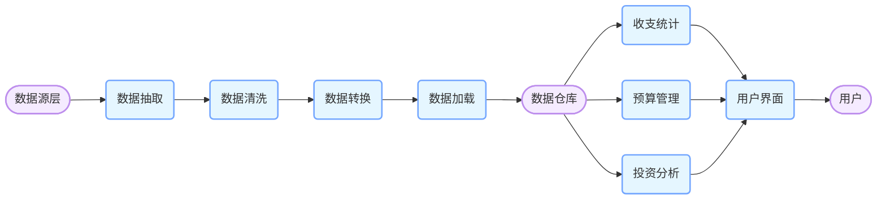

# 个人财务管理工具集成

> 关键词：个人财务管理、工具集成、财务分析、数据整合、预算管理

> 摘要：本文聚焦于个人财务管理工具集成这一主题，旨在探讨如何将多种财务管理工具进行有效整合，以满足个人全面、高效的财务管理需求。通过详细介绍核心概念、算法原理、数学模型，结合实际项目案例和应用场景，为读者提供从理论到实践的全方位指导。同时，推荐了相关的学习资源、开发工具和论文著作，最后对未来发展趋势与挑战进行了总结，并解答常见问题。

## 1. 背景介绍 
### 1.1 目的和范围
个人财务管理对于每个人的生活至关重要，它有助于合理规划收入和支出、实现财务目标、保障财务安全。然而，市场上存在着众多功能各异的财务管理工具，如记账软件、预算规划工具、投资分析平台等。这些工具各自独立，用户需要在不同的应用中切换，难以形成统一的财务管理视图。因此，本文章的目的是探讨如何将这些分散的个人财务管理工具集成起来，构建一个综合性的财务管理平台。范围涵盖了各种常见的个人财务管理场景，包括日常收支管理、预算控制、投资组合分析等。

### 1.2 预期读者
本文预期读者包括对个人财务管理有需求的普通用户，希望通过工具集成提升财务管理效率；软件开发人员和程序员，对构建个人财务管理系统感兴趣；金融从业者，希望借助技术手段优化个人理财服务。

### 1.3 文档结构概述
本文首先介绍个人财务管理工具集成的背景和相关术语，接着阐述核心概念和联系，包括工具集成的原理和架构。然后详细讲解核心算法原理和具体操作步骤，通过Python代码进行说明。随后介绍数学模型和公式，并举例说明其应用。在项目实战部分，给出代码实际案例和详细解释。之后探讨实际应用场景，推荐相关的工具和资源。最后总结未来发展趋势与挑战，解答常见问题，并提供扩展阅读和参考资料。

### 1.4 术语表
#### 1.4.1 核心术语定义
- **个人财务管理工具集成**：将多种不同功能的个人财务管理工具整合到一个平台或系统中，实现数据共享和协同工作。
- **财务数据整合**：把来自不同数据源的财务数据进行清洗、转换和合并，使其能够在统一的环境中进行分析和处理。
- **预算管理**：设定财务预算目标，并对实际收支情况进行监控和调整，以确保预算目标的实现。
- **投资组合分析**：对个人的投资资产进行评估和分析，包括资产配置、风险评估、收益预测等。

#### 1.4.2 相关概念解释
- **API（Application Programming Interface）**：应用程序编程接口，是不同软件系统之间进行交互和数据交换的桥梁。通过API，不同的财务管理工具可以实现数据共享和功能调用。
- **数据仓库**：用于存储和管理大量历史财务数据的数据库，为财务分析和决策提供数据支持。
- **ETL（Extract, Transform, Load）**：数据抽取、转换和加载过程，是实现财务数据整合的关键步骤。

#### 1.4.3 缩略词列表
- **API**：Application Programming Interface
- **ETL**：Extract, Transform, Load
- **CSV**：Comma-Separated Values

## 2. 核心概念与联系 

### 核心概念原理
个人财务管理工具集成的核心原理是通过数据整合和功能协同，将不同的财务管理工具连接在一起，形成一个有机的整体。具体来说，它涉及以下几个方面：

- **数据层面**：不同的财务管理工具通常存储着各自的财务数据，如收支记录、预算信息、投资交易数据等。工具集成需要将这些数据从不同的数据源中抽取出来，进行清洗和转换，然后加载到一个统一的数据仓库中。这样，用户可以在一个平台上查看和分析所有的财务数据。
- **功能层面**：各个财务管理工具具有不同的功能，如记账、预算规划、投资分析等。工具集成需要实现这些功能的协同工作，例如在记账时自动更新预算数据，或者根据投资组合情况提供个性化的理财建议。

### 架构的文本示意图
个人财务管理工具集成的架构可以分为以下几个层次：

- **数据源层**：包括各种财务管理工具的数据库、文件系统等，存储着原始的财务数据。
- **数据整合层**：负责从数据源层抽取数据，进行清洗、转换和加载，将数据整合到统一的数据仓库中。
- **业务逻辑层**：实现各种财务管理功能，如收支统计、预算管理、投资分析等。这些功能可以调用数据仓库中的数据进行计算和分析。
- **用户界面层**：为用户提供操作界面，让用户可以方便地使用各种财务管理功能，查看和管理财务数据。

### Mermaid 流程图


## 3. 核心算法原理 & 具体操作步骤 

### 核心算法原理
在个人财务管理工具集成中，涉及到多个核心算法，以下是一些常见的算法及其原理：

#### 数据清洗算法
数据清洗的目的是去除数据中的噪声、重复值和错误数据，提高数据的质量。常见的数据清洗算法包括：

- **缺失值处理**：对于缺失的数据，可以采用均值填充、中位数填充、删除等方法进行处理。
- **重复值处理**：通过比较数据记录的关键信息，找出重复的记录并进行删除。
- **异常值处理**：使用统计方法（如标准差、箱线图等）识别异常值，并进行修正或删除。

#### 预算控制算法
预算控制算法用于监控实际收支情况与预算目标的差异，并提供相应的预警。常见的预算控制算法包括：

- **百分比控制**：设定每个预算项目的支出百分比上限，当实际支出超过该百分比时发出预警。
- **绝对金额控制**：设定每个预算项目的绝对金额上限，当实际支出超过该金额时发出预警。

#### 投资组合优化算法
投资组合优化算法用于确定最优的资产配置方案，以实现投资收益最大化和风险最小化。常见的投资组合优化算法包括：

- **均值 - 方差模型**：通过计算资产的预期收益率和方差，构建投资组合的有效前沿，找出最优的资产配置方案。
- **风险平价模型**：通过平衡不同资产的风险贡献，实现投资组合的风险分散。

### 具体操作步骤
以下是实现个人财务管理工具集成的具体操作步骤：

#### 步骤 1：确定数据源
首先，需要确定要集成的财务管理工具和数据源，包括数据库、文件系统、API等。

#### 步骤 2：数据抽取
使用合适的工具和技术，从数据源中抽取财务数据。例如，可以使用Python的`pandas`库读取CSV文件，或者使用`requests`库调用API获取数据。

```python
import pandas as pd

# 读取CSV文件
data = pd.read_csv('financial_data.csv')
```

#### 步骤 3：数据清洗
对抽取的数据进行清洗，处理缺失值、重复值和异常值。

```python
# 处理缺失值
data = data.fillna(data.mean())

# 处理重复值
data = data.drop_duplicates()

# 处理异常值
Q1 = data['amount'].quantile(0.25)
Q3 = data['amount'].quantile(0.75)
IQR = Q3 - Q1
data = data[(data['amount'] >= Q1 - 1.5 * IQR) & (data['amount'] <= Q3 + 1.5 * IQR)]
```

#### 步骤 4：数据转换
根据业务需求，对清洗后的数据进行转换，如数据类型转换、字段合并等。

```python
# 数据类型转换
data['date'] = pd.to_datetime(data['date'])

# 字段合并
data['category'] = data['category'] + '_' + data['subcategory']
```

#### 步骤 5：数据加载
将转换后的数据加载到统一的数据仓库中，如MySQL数据库。

```python
import mysql.connector

# 连接数据库
mydb = mysql.connector.connect(
    host="localhost",
    user="yourusername",
    password="yourpassword",
    database="financial_db"
)

# 创建游标
mycursor = mydb.cursor()

# 创建表
mycursor.execute("CREATE TABLE IF NOT EXISTS financial_data (id INT AUTO_INCREMENT PRIMARY KEY, date DATE, amount DECIMAL(10, 2), category VARCHAR(255))")

# 插入数据
for index, row in data.iterrows():
    sql = "INSERT INTO financial_data (date, amount, category) VALUES (%s, %s, %s)"
    val = (row['date'], row['amount'], row['category'])
    mycursor.execute(sql, val)

# 提交更改
mydb.commit()
```

#### 步骤 6：业务逻辑实现
实现各种财务管理功能，如收支统计、预算管理、投资分析等。

```python
# 收支统计
income = data[data['amount'] > 0]['amount'].sum()
expenses = data[data['amount'] < 0]['amount'].sum()

# 预算管理
budget = 1000
if expenses > budget:
    print("超出预算！")
else:
    print("未超出预算。")
```

#### 步骤 7：用户界面开发
开发用户界面，让用户可以方便地使用各种财务管理功能，查看和管理财务数据。可以使用Python的`Flask`框架开发Web应用。

```python
from flask import Flask, render_template

app = Flask(__name__)

@app.route('/')
def index():
    return render_template('index.html', income=income, expenses=expenses, budget=budget)

if __name__ == '__main__':
    app.run(debug=True)
```

## 4. 数学模型和公式 & 详细讲解 & 举例说明 

### 均值 - 方差模型
#### 数学公式
均值 - 方差模型是由哈里·马科维茨（Harry Markowitz）提出的投资组合优化模型，其核心思想是在给定风险水平下最大化预期收益率，或者在给定预期收益率下最小化风险。

设投资组合中有 $n$ 种资产，每种资产的预期收益率为 $r_i$，权重为 $w_i$，资产之间的协方差矩阵为 $\Sigma$。则投资组合的预期收益率 $R_p$ 和方差 $\sigma_p^2$ 分别为：

$$R_p = \sum_{i=1}^{n} w_i r_i$$

$$\sigma_p^2 = \sum_{i=1}^{n} \sum_{j=1}^{n} w_i w_j \sigma_{ij}$$

其中，$\sigma_{ij}$ 是资产 $i$ 和资产 $j$ 之间的协方差。

#### 详细讲解
均值 - 方差模型的目标是找到一组最优的权重 $w_i$，使得在满足一定约束条件下，投资组合的预期收益率最大，方差最小。约束条件通常包括：

- $\sum_{i=1}^{n} w_i = 1$，即所有资产的权重之和为 1。
- $w_i \geq 0$，即不允许卖空。

通过求解上述优化问题，可以得到投资组合的有效前沿，即在给定风险水平下预期收益率最高的投资组合集合。

#### 举例说明
假设投资组合中有三种资产，其预期收益率分别为 $r_1 = 0.1$，$r_2 = 0.15$，$r_3 = 0.2$，协方差矩阵为：

$$\Sigma = \begin{bmatrix}
0.04 & 0.01 & 0.02 \\
0.01 & 0.09 & 0.03 \\
0.02 & 0.03 & 0.16
\end{bmatrix}$$

我们可以使用Python的`scipy.optimize`库来求解最优的资产配置方案。

```python
import numpy as np
from scipy.optimize import minimize

# 预期收益率
r = np.array([0.1, 0.15, 0.2])

# 协方差矩阵
Sigma = np.array([[0.04, 0.01, 0.02], [0.01, 0.09, 0.03], [0.02, 0.03, 0.16]])

# 目标函数：最小化方差
def objective(w):
    return np.dot(np.dot(w.T, Sigma), w)

# 约束条件：权重之和为1
constraints = ({'type': 'eq', 'fun': lambda w: np.sum(w) - 1})

# 边界条件：不允许卖空
bounds = [(0, 1), (0, 1), (0, 1)]

# 初始权重
w0 = np.array([1/3, 1/3, 1/3])

# 求解优化问题
result = minimize(objective, w0, method='SLSQP', bounds=bounds, constraints=constraints)

# 最优权重
optimal_weights = result.x

print("最优权重：", optimal_weights)
```

### 风险平价模型
#### 数学公式
风险平价模型的核心思想是通过平衡不同资产的风险贡献，实现投资组合的风险分散。设投资组合中有 $n$ 种资产，每种资产的权重为 $w_i$，资产之间的协方差矩阵为 $\Sigma$。则资产 $i$ 的风险贡献 $RC_i$ 为：

$$RC_i = w_i \frac{\partial \sigma_p}{\partial w_i}$$

其中，$\sigma_p$ 是投资组合的标准差。

风险平价模型的目标是使得所有资产的风险贡献相等，即：

$$RC_1 = RC_2 = \cdots = RC_n$$

#### 详细讲解
风险平价模型的优点是可以降低投资组合对单一资产的风险暴露，提高投资组合的稳定性。在实际应用中，可以通过求解上述等式来确定最优的资产配置方案。

#### 举例说明
同样假设投资组合中有三种资产，其协方差矩阵为上述的 $\Sigma$。我们可以使用Python来求解风险平价模型的最优权重。

```python
import numpy as np
from scipy.optimize import minimize

# 协方差矩阵
Sigma = np.array([[0.04, 0.01, 0.02], [0.01, 0.09, 0.03], [0.02, 0.03, 0.16]])

# 目标函数：最小化风险贡献差异
def objective(w):
    portfolio_volatility = np.sqrt(np.dot(np.dot(w.T, Sigma), w))
    risk_contributions = w * (np.dot(Sigma, w) / portfolio_volatility)
    return np.sum((risk_contributions - risk_contributions.mean())**2)

# 约束条件：权重之和为1
constraints = ({'type': 'eq', 'fun': lambda w: np.sum(w) - 1})

# 边界条件：不允许卖空
bounds = [(0, 1), (0, 1), (0, 1)]

# 初始权重
w0 = np.array([1/3, 1/3, 1/3])

# 求解优化问题
result = minimize(objective, w0, method='SLSQP', bounds=bounds, constraints=constraints)

# 最优权重
optimal_weights = result.x

print("最优权重：", optimal_weights)
```

## 5. 项目实战：代码实际案例和详细解释说明 

### 5.1  开发环境搭建
#### 安装Python
首先，需要安装Python编程语言。可以从Python官方网站（https://www.python.org/downloads/）下载适合自己操作系统的Python安装包，并按照安装向导进行安装。

#### 安装必要的库
在项目中，我们需要使用一些Python库来实现数据处理、数据库操作、Web开发等功能。可以使用`pip`命令来安装这些库：

```sh
pip install pandas mysql-connector-python flask
```

#### 安装数据库
我们使用MySQL数据库来存储财务数据。可以从MySQL官方网站（https://dev.mysql.com/downloads/installer/）下载MySQL安装包，并按照安装向导进行安装。安装完成后，创建一个名为`financial_db`的数据库。

### 5.2  源代码详细实现和代码解读
以下是一个完整的个人财务管理工具集成项目的源代码：

```python
import pandas as pd
import mysql.connector
from flask import Flask, render_template

# 数据抽取和清洗
def extract_and_clean_data():
    # 读取CSV文件
    data = pd.read_csv('financial_data.csv')
    
    # 处理缺失值
    data = data.fillna(data.mean())
    
    # 处理重复值
    data = data.drop_duplicates()
    
    # 处理异常值
    Q1 = data['amount'].quantile(0.25)
    Q3 = data['amount'].quantile(0.75)
    IQR = Q3 - Q1
    data = data[(data['amount'] >= Q1 - 1.5 * IQR) & (data['amount'] <= Q3 + 1.5 * IQR)]
    
    return data

# 数据转换和加载
def transform_and_load_data(data):
    # 数据类型转换
    data['date'] = pd.to_datetime(data['date'])
    
    # 字段合并
    data['category'] = data['category'] + '_' + data['subcategory']
    
    # 连接数据库
    mydb = mysql.connector.connect(
        host="localhost",
        user="yourusername",
        password="yourpassword",
        database="financial_db"
    )
    
    # 创建游标
    mycursor = mydb.cursor()
    
    # 创建表
    mycursor.execute("CREATE TABLE IF NOT EXISTS financial_data (id INT AUTO_INCREMENT PRIMARY KEY, date DATE, amount DECIMAL(10, 2), category VARCHAR(255))")
    
    # 插入数据
    for index, row in data.iterrows():
        sql = "INSERT INTO financial_data (date, amount, category) VALUES (%s, %s, %s)"
        val = (row['date'], row['amount'], row['category'])
        mycursor.execute(sql, val)
    
    # 提交更改
    mydb.commit()

# 业务逻辑实现
def business_logic():
    # 连接数据库
    mydb = mysql.connector.connect(
        host="localhost",
        user="yourusername",
        password="yourpassword",
        database="financial_db"
    )
    
    # 创建游标
    mycursor = mydb.cursor()
    
    # 查询数据
    mycursor.execute("SELECT amount FROM financial_data")
    results = mycursor.fetchall()
    
    # 转换为DataFrame
    data = pd.DataFrame(results, columns=['amount'])
    
    # 收支统计
    income = data[data['amount'] > 0]['amount'].sum()
    expenses = data[data['amount'] < 0]['amount'].sum()
    
    # 预算管理
    budget = 1000
    if expenses > budget:
        status = "超出预算！"
    else:
        status = "未超出预算。"
    
    return income, expenses, status

# Web应用开发
app = Flask(__name__)

@app.route('/')
def index():
    income, expenses, status = business_logic()
    return render_template('index.html', income=income, expenses=expenses, status=status)

if __name__ == '__main__':
    # 数据抽取和清洗
    data = extract_and_clean_data()
    
    # 数据转换和加载
    transform_and_load_data(data)
    
    # 启动Web应用
    app.run(debug=True)
```

### 5.3  代码解读与分析
#### 数据抽取和清洗部分
`extract_and_clean_data`函数负责从CSV文件中读取财务数据，并进行清洗处理。使用`pandas`库的`read_csv`函数读取CSV文件，然后使用`fillna`函数处理缺失值，`drop_duplicates`函数处理重复值，通过计算四分位数和四分位距处理异常值。

#### 数据转换和加载部分
`transform_and_load_data`函数负责对清洗后的数据进行转换，并将其加载到MySQL数据库中。使用`pandas`库的`to_datetime`函数进行数据类型转换，使用字符串拼接进行字段合并。然后使用`mysql.connector`库连接数据库，创建表并插入数据。

#### 业务逻辑实现部分
`business_logic`函数负责实现收支统计和预算管理功能。从数据库中查询数据，转换为`pandas`的`DataFrame`对象，然后进行收支统计和预算判断。

#### Web应用开发部分
使用`Flask`框架开发Web应用，将收支统计和预算管理的结果展示在网页上。通过定义路由`/`，在访问该路由时调用`business_logic`函数获取数据，并使用`render_template`函数渲染HTML模板。

## 6. 实际应用场景 
### 日常收支管理
个人可以使用集成的财务管理工具记录日常的收入和支出，自动分类和统计，方便了解自己的财务状况。例如，用户可以在工具中记录每一笔消费，工具会自动将其归类到餐饮、购物、交通等类别中，并生成收支报表，让用户清楚地看到自己的钱花在了哪里。

### 预算规划与控制
用户可以设定每月或每年的预算目标，工具会实时监控实际收支情况，当支出接近或超过预算时发出预警。例如，用户设定每月餐饮预算为2000元，当实际餐饮支出达到1800元时，工具会提醒用户注意控制餐饮消费。

### 投资组合管理
对于有投资需求的用户，集成的财务管理工具可以整合不同的投资账户，分析投资组合的风险和收益情况，提供优化建议。例如，工具可以分析用户的股票、基金、债券等投资组合，计算其预期收益率和风险水平，并根据用户的风险偏好提供调整建议。

### 财务目标设定与跟踪
用户可以设定长期的财务目标，如购房、养老、子女教育等，工具会根据用户的收入和支出情况，制定实现目标的计划，并跟踪进度。例如，用户设定在10年内攒够50万元用于购房，工具会根据用户的当前财务状况和收入预期，制定每月的储蓄计划，并实时跟踪储蓄进度。

## 7. 工具和资源推荐
### 7.1 学习资源推荐
#### 7.1.1 书籍推荐
- 《Python数据分析实战》：介绍了使用Python进行数据分析的方法和技巧，包括数据清洗、处理、可视化等内容，对于个人财务管理工具集成中的数据处理部分有很大帮助。
- 《投资学》：由滋维·博迪（Zvi Bodie）等著，系统地介绍了投资学的基本理论和方法，对于理解投资组合分析和优化算法有很大帮助。
- 《Python Flask Web开发实战》：详细介绍了使用Python的Flask框架开发Web应用的过程，对于开发个人财务管理工具的用户界面有很大帮助。

#### 7.1.2 在线课程
- Coursera上的“Python for Data Science”课程：由密歇根大学提供，系统地介绍了Python在数据分析领域的应用，包括数据处理、可视化、机器学习等内容。
- edX上的“Investment Management”课程：由哥伦比亚大学提供，深入讲解了投资组合管理的理论和实践，包括资产配置、风险评估、绩效评估等内容。
- Udemy上的“Flask Web Development Bootcamp”课程：详细介绍了使用Flask框架开发Web应用的全过程，包括路由、模板、数据库操作等内容。

#### 7.1.3 技术博客和网站
- Medium：上面有很多关于数据分析、投资管理、Web开发等方面的技术文章和经验分享，可以从中获取最新的技术动态和实践经验。
- Stack Overflow：是一个知名的技术问答社区，当遇到技术问题时，可以在上面搜索解决方案或提问。
- Python官方文档：提供了Python语言的详细文档和教程，对于学习Python编程有很大帮助。

### 7.2 开发工具框架推荐
#### 7.2.1 IDE和编辑器
- PyCharm：是一款专业的Python集成开发环境，提供了代码编辑、调试、版本控制等功能，对于开发Python项目非常方便。
- Visual Studio Code：是一款轻量级的代码编辑器，支持多种编程语言，通过安装插件可以实现Python开发的各种功能，如代码提示、调试等。

#### 7.2.2 调试和性能分析工具
- PDB：是Python自带的调试工具，可以在代码中设置断点，逐步执行代码，查看变量的值，帮助定位和解决问题。
- cProfile：是Python的性能分析工具，可以分析代码的执行时间和函数调用情况，帮助优化代码性能。

#### 7.2.3 相关框架和库
- Pandas：是Python中用于数据处理和分析的库，提供了高效的数据结构和数据操作方法，如DataFrame、Series等，对于个人财务管理工具集成中的数据处理部分非常有用。
- MySQL Connector/Python：是Python连接MySQL数据库的官方驱动，提供了方便的数据库操作接口，如连接数据库、执行SQL语句等。
- Flask：是Python的轻量级Web框架，易于学习和使用，适合开发小型的Web应用，如个人财务管理工具的用户界面。

### 7.3 相关论文著作推荐
#### 7.3.1 经典论文
- Markowitz, H. M. (1952). Portfolio Selection. The Journal of Finance, 7(1), 77-91. 该论文提出了均值 - 方差模型，是现代投资组合理论的奠基之作。
- Sharpe, W. F. (1964). Capital Asset Prices: A Theory of Market Equilibrium Under Conditions of Risk. The Journal of Finance, 19(3), 425-442. 该论文提出了资本资产定价模型（CAPM），为投资组合的风险评估和收益预测提供了重要的理论基础。

#### 7.3.2 最新研究成果
- 在学术数据库（如IEEE Xplore、ACM Digital Library等）中搜索“Personal Financial Management Tool Integration”相关的研究论文，可以了解该领域的最新研究动态和技术发展趋势。

#### 7.3.3 应用案例分析
- 一些金融科技公司的官方博客和报告中会分享他们在个人财务管理工具集成方面的应用案例和实践经验，可以从中学习到实际项目中的解决方案和优化策略。

## 8. 总结：未来发展趋势与挑战
### 未来发展趋势
#### 智能化
随着人工智能技术的发展，个人财务管理工具将越来越智能化。例如，工具可以通过机器学习算法分析用户的财务数据，提供个性化的理财建议；可以自动识别用户的消费模式，预测未来的收支情况，并提前发出预警。

#### 移动化
移动设备的普及使得人们越来越倾向于使用手机和平板电脑进行财务管理。未来，个人财务管理工具将更加注重移动应用的开发，提供更加便捷、高效的移动使用体验。

#### 数据共享与开放
随着金融科技的发展，不同金融机构和企业之间的数据共享和开放将越来越普遍。个人财务管理工具可以通过API接口与银行、支付机构等进行数据对接，实现更加全面、实时的财务数据整合。

#### 社交化
未来的个人财务管理工具可能会引入社交元素，用户可以与朋友、家人分享自己的理财经验和成果，互相监督和鼓励，形成良好的理财氛围。

### 挑战
#### 数据安全与隐私保护
个人财务管理工具涉及大量的敏感财务数据，如银行账户信息、交易记录等。如何保障数据的安全和隐私，防止数据泄露和滥用，是一个重要的挑战。

#### 数据标准化与整合难度
不同的财务管理工具和数据源可能采用不同的数据格式和标准，数据整合的难度较大。如何实现数据的标准化和有效整合，是个人财务管理工具集成面临的一个关键问题。

#### 技术更新换代快
信息技术发展迅速，新的技术和算法不断涌现。个人财务管理工具需要不断更新和升级，以跟上技术发展的步伐，满足用户日益增长的需求。

#### 用户教育与接受度
一些用户可能对新技术和新工具不太熟悉，需要进行一定的教育和培训。如何提高用户对个人财务管理工具集成的接受度和使用意愿，也是一个需要解决的问题。

## 9. 附录：常见问题与解答
### 问题 1：如何选择合适的财务管理工具进行集成？
解答：选择合适的财务管理工具进行集成需要考虑以下几个因素：功能需求、数据兼容性、易用性、安全性等。首先，要明确自己的财务管理需求，如日常收支管理、预算规划、投资分析等，选择具备相应功能的工具。其次，要确保工具之间的数据可以相互兼容，方便进行数据整合。此外，工具的易用性和安全性也是重要的考虑因素。

### 问题 2：数据清洗过程中如何处理缺失值？
解答：处理缺失值的方法有多种，常见的方法包括：均值填充、中位数填充、删除等。如果数据分布比较均匀，可以使用均值填充；如果数据存在异常值，使用中位数填充可能更合适。如果缺失值的比例较小，也可以直接删除包含缺失值的记录。

### 问题 3：如何保障集成系统的数据安全？
解答：保障集成系统的数据安全可以从以下几个方面入手：采用加密技术对数据进行加密存储和传输；设置严格的访问权限，只有授权人员才能访问和操作数据；定期备份数据，防止数据丢失；及时更新系统和软件，修复安全漏洞。

### 问题 4：开发个人财务管理工具集成系统需要具备哪些技术知识？
解答：开发个人财务管理工具集成系统需要具备以下技术知识：Python编程、数据库操作（如MySQL）、数据处理和分析（如Pandas）、Web开发（如Flask）等。此外，了解一些投资学和财务管理的基本理论和方法也会有帮助。

## 10. 扩展阅读 & 参考资料
- 《Python数据分析实战》，作者： Wes McKinney
- 《投资学》，作者：滋维·博迪（Zvi Bodie）等
- 《Python Flask Web开发实战》，作者：Miguel Grinberg
- Markowitz, H. M. (1952). Portfolio Selection. The Journal of Finance, 7(1), 77-91.
- Sharpe, W. F. (1964). Capital Asset Prices: A Theory of Market Equilibrium Under Conditions of Risk. The Journal of Finance, 19(3), 425-442.
- Coursera：https://www.coursera.org/
- edX：https://www.edx.org/
- Udemy：https://www.udemy.com/
- Medium：https://medium.com/
- Stack Overflow：https://stackoverflow.com/
- Python官方文档：https://docs.python.org/

作者：AI天才研究院/AI Genius Institute & 禅与计算机程序设计艺术 /Zen And The Art of Computer Programming