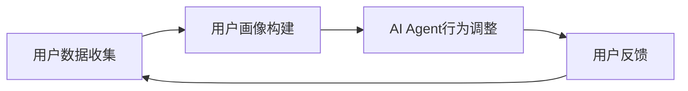

# 个性化定制：为不同用户调整AI Agent的行为

> 关键词：个性化定制、AI Agent、用户行为调整、机器学习、用户画像

> 摘要：本文围绕为不同用户调整AI Agent的行为这一核心主题展开。深入探讨了个性化定制AI Agent行为的背景、核心概念、算法原理、数学模型等内容。通过详细的Python代码案例，展示了如何在实际项目中实现这一技术。同时，介绍了该技术的实际应用场景、相关工具和资源，最后对其未来发展趋势与挑战进行了总结，并给出常见问题解答和参考资料，旨在为读者全面呈现个性化定制AI Agent行为的技术全貌。

## 1. 背景介绍 
### 1.1 目的和范围
随着人工智能技术的飞速发展，AI Agent在各个领域得到了广泛应用。然而，不同用户具有不同的需求和偏好，通用的AI Agent行为模式往往无法满足所有用户的期望。本文章的目的在于深入探讨如何为不同用户调整AI Agent的行为，以实现个性化定制。范围涵盖了从核心概念的理解、算法原理的剖析、数学模型的构建，到实际项目的开发和应用场景的分析等多个方面。

### 1.2 预期读者
本文预期读者包括人工智能领域的开发者、研究人员、软件架构师，以及对个性化定制技术感兴趣的技术爱好者。无论是希望深入研究个性化AI Agent技术的专业人士，还是想要了解相关基础知识的初学者，都能从本文中获得有价值的信息。

### 1.3 文档结构概述
本文将按照以下结构进行组织：首先介绍相关背景知识，包括目的、预期读者和文档结构概述等；接着阐述核心概念与联系，通过文本示意图和Mermaid流程图帮助读者理解；然后详细讲解核心算法原理和具体操作步骤，并使用Python源代码进行说明；之后介绍数学模型和公式，并给出详细讲解和举例；再通过项目实战展示代码实际案例和详细解释；接着探讨实际应用场景；随后推荐相关工具和资源；最后总结未来发展趋势与挑战，给出常见问题解答和参考资料。

### 1.4 术语表
#### 1.4.1 核心术语定义
- **AI Agent**：能够感知环境、自主决策并执行相应动作的人工智能实体。
- **个性化定制**：根据不同用户的特征、需求和偏好，为其量身定制特定的服务或行为模式。
- **用户画像**：通过收集和分析用户的各种数据，构建出的关于用户特征和行为的抽象模型。

#### 1.4.2 相关概念解释
- **机器学习**：一门多领域交叉学科，涉及概率论、统计学、逼近论、凸分析、算法复杂度理论等多门学科。它专门研究计算机怎样模拟或实现人类的学习行为，以获取新的知识或技能，重新组织已有的知识结构使之不断改善自身的性能。
- **深度学习**：机器学习的一个分支领域，它试图使用包含复杂结构或由多重非线性变换构成的多个处理层对数据进行高层抽象的算法。

#### 1.4.3 缩略词列表
- **ML**：Machine Learning，机器学习
- **DL**：Deep Learning，深度学习

## 2. 核心概念与联系 

### 核心概念原理
个性化定制AI Agent行为的核心在于理解用户的特征和需求，并根据这些信息调整AI Agent的行为策略。用户画像的构建是实现个性化定制的关键步骤，它通过收集用户的各种数据，如基本信息、历史行为记录、偏好等，利用数据分析和机器学习算法提取用户的特征，从而为每个用户建立一个独特的画像。

AI Agent则根据用户画像中的信息，动态调整自身的行为。例如，在推荐系统中，AI Agent可以根据用户的兴趣偏好，为其推荐符合其口味的商品或内容；在智能客服系统中，AI Agent可以根据用户的历史咨询记录和问题类型，提供更加个性化的解决方案。

### 架构的文本示意图
```plaintext
用户数据收集 --> 用户画像构建 --> AI Agent行为调整 --> 用户反馈 --> 用户数据更新
```
这个示意图展示了个性化定制AI Agent行为的整体架构。首先，通过各种渠道收集用户的数据；然后，利用这些数据构建用户画像；接着，AI Agent根据用户画像调整自身的行为；用户与AI Agent交互后产生反馈，这些反馈信息又会用于更新用户数据，从而实现一个闭环的个性化定制过程。

### Mermaid流程图


这个流程图清晰地展示了从用户数据收集到AI Agent行为调整，再到用户反馈并更新数据的循环过程，体现了个性化定制的动态性和持续性。

## 3. 核心算法原理 & 具体操作步骤 

### 核心算法原理
在个性化定制AI Agent行为的过程中，常用的算法包括基于规则的算法、机器学习算法和深度学习算法。这里我们主要介绍基于机器学习的算法，以朴素贝叶斯分类器为例。

朴素贝叶斯分类器是一种基于贝叶斯定理和特征条件独立假设的分类算法。其核心思想是通过计算不同类别的后验概率，将样本分类到后验概率最大的类别中。

### 具体操作步骤
1. **数据收集**：收集用户的各种数据，如基本信息、历史行为记录等。
2. **数据预处理**：对收集到的数据进行清洗、转换和特征提取等操作，以便后续的机器学习算法能够处理。
3. **模型训练**：使用预处理后的数据训练朴素贝叶斯分类器。
4. **模型评估**：使用测试数据评估训练好的模型的性能。
5. **AI Agent行为调整**：根据模型的预测结果，调整AI Agent的行为。

### Python源代码实现
```python
import numpy as np
from sklearn.naive_bayes import GaussianNB
from sklearn.model_selection import train_test_split
from sklearn.metrics import accuracy_score

# 模拟用户数据
# 假设有100个用户，每个用户有5个特征
X = np.random.rand(100, 5)
# 假设有3种不同的用户类别
y = np.random.randint(0, 3, 100)

# 划分训练集和测试集
X_train, X_test, y_train, y_test = train_test_split(X, y, test_size=0.2, random_state=42)

# 创建朴素贝叶斯分类器
clf = GaussianNB()

# 训练模型
clf.fit(X_train, y_train)

# 预测
y_pred = clf.predict(X_test)

# 评估模型
accuracy = accuracy_score(y_test, y_pred)
print(f"模型准确率: {accuracy}")

# 根据预测结果调整AI Agent的行为
def adjust_agent_behavior(prediction):
    if prediction == 0:
        print("调整AI Agent行为为模式0")
    elif prediction == 1:
        print("调整AI Agent行为为模式1")
    else:
        print("调整AI Agent行为为模式2")

# 对测试集中的第一个样本进行预测并调整行为
first_sample = X_test[0].reshape(1, -1)
pred = clf.predict(first_sample)
adjust_agent_behavior(pred[0])
```

在这段代码中，我们首先模拟了用户数据，然后使用`train_test_split`函数将数据划分为训练集和测试集。接着，创建了一个朴素贝叶斯分类器并进行训练。使用`accuracy_score`函数评估模型的准确率。最后，定义了一个`adjust_agent_behavior`函数，根据模型的预测结果调整AI Agent的行为。

## 4. 数学模型和公式 & 详细讲解 & 举例说明 

### 贝叶斯定理
贝叶斯定理是朴素贝叶斯分类器的理论基础，其公式为：
$$P(A|B) = \frac{P(B|A)P(A)}{P(B)}$$
其中，$P(A|B)$ 表示在事件 $B$ 发生的条件下事件 $A$ 发生的概率，也称为后验概率；$P(B|A)$ 表示在事件 $A$ 发生的条件下事件 $B$ 发生的概率，称为似然概率；$P(A)$ 表示事件 $A$ 发生的先验概率；$P(B)$ 表示事件 $B$ 发生的概率。

### 朴素贝叶斯分类器的数学模型
在朴素贝叶斯分类器中，假设特征之间是条件独立的。设样本 $x = (x_1, x_2, \cdots, x_n)$ ，类别标签为 $y$ ，则根据贝叶斯定理，样本 $x$ 属于类别 $y$ 的后验概率为：
$$P(y|x) = \frac{P(x|y)P(y)}{P(x)}$$
由于 $P(x)$ 对于所有类别都是相同的，因此在分类时可以忽略。又因为特征之间条件独立，所以有：
$$P(x|y) = \prod_{i=1}^{n}P(x_i|y)$$
则样本 $x$ 属于类别 $y$ 的后验概率可以表示为：
$$P(y|x) \propto P(y)\prod_{i=1}^{n}P(x_i|y)$$
分类器的决策规则是将样本 $x$ 分类到后验概率最大的类别中，即：
$$\hat{y} = \arg\max_{y} P(y)\prod_{i=1}^{n}P(x_i|y)$$

### 举例说明
假设有一个简单的二分类问题，判断一个用户是否会购买某商品。我们收集了用户的两个特征：年龄（分为年轻和年老）和性别（分为男和女）。训练数据如下：

| 年龄 | 性别 | 是否购买 |
|------|------|----------|
| 年轻 | 男   | 是       |
| 年轻 | 女   | 是       |
| 年老 | 男   | 否       |
| 年老 | 女   | 是       |

我们要判断一个年轻女性用户是否会购买该商品。

首先，计算先验概率：
$P(是) = \frac{3}{4}$，$P(否) = \frac{1}{4}$

然后，计算似然概率：
$P(年轻|是) = \frac{2}{3}$，$P(年轻|否) = 0$
$P(女|是) = \frac{2}{3}$，$P(女|否) = 0$

接着，计算后验概率：
$P(是|年轻, 女) \propto P(是)P(年轻|是)P(女|是) = \frac{3}{4} \times \frac{2}{3} \times \frac{2}{3} = \frac{1}{3}$
$P(否|年轻, 女) \propto P(否)P(年轻|否)P(女|否) = 0$

由于 $P(是|年轻, 女) > P(否|年轻, 女)$，所以判断该年轻女性用户会购买该商品。

## 5. 项目实战：代码实际案例和详细解释说明 

### 5.1  开发环境搭建
在进行项目实战之前，需要搭建相应的开发环境。以下是具体步骤：

1. **安装Python**：建议安装Python 3.7及以上版本。可以从Python官方网站（https://www.python.org/downloads/）下载并安装。
2. **安装必要的库**：使用`pip`命令安装所需的库，包括`numpy`、`pandas`、`scikit-learn`等。
```bash
pip install numpy pandas scikit-learn
```

### 5.2  源代码详细实现和代码解读
以下是一个完整的项目实战代码示例，实现了根据用户的历史行为数据为用户推荐电影的功能。

```python
import pandas as pd
from sklearn.neighbors import KNeighborsClassifier
from sklearn.model_selection import train_test_split
from sklearn.metrics import accuracy_score

# 加载电影评分数据
data = pd.read_csv('movie_ratings.csv')

# 提取特征和标签
X = data.drop('movie_recommended', axis=1)
y = data['movie_recommended']

# 划分训练集和测试集
X_train, X_test, y_train, y_test = train_test_split(X, y, test_size=0.2, random_state=42)

# 创建K近邻分类器
knn = KNeighborsClassifier(n_neighbors=5)

# 训练模型
knn.fit(X_train, y_train)

# 预测
y_pred = knn.predict(X_test)

# 评估模型
accuracy = accuracy_score(y_test, y_pred)
print(f"模型准确率: {accuracy}")

# 根据预测结果为用户推荐电影
def recommend_movie(user_features):
    prediction = knn.predict([user_features])
    if prediction[0] == 1:
        print("推荐电影A")
    else:
        print("推荐电影B")

# 模拟一个用户的特征
user_features = [1, 2, 3, 4, 5]
recommend_movie(user_features)
```

### 代码解读与分析
1. **数据加载**：使用`pandas`库的`read_csv`函数加载电影评分数据。
2. **特征提取**：将数据集中除了`movie_recommended`列以外的其他列作为特征，`movie_recommended`列作为标签。
3. **数据集划分**：使用`train_test_split`函数将数据集划分为训练集和测试集，测试集占比为20%。
4. **模型创建与训练**：创建一个K近邻分类器，并使用训练集数据进行训练。
5. **模型预测与评估**：使用测试集数据进行预测，并使用`accuracy_score`函数评估模型的准确率。
6. **电影推荐**：定义一个`recommend_movie`函数，根据用户的特征进行预测，并根据预测结果为用户推荐电影。

## 6. 实际应用场景 
个性化定制AI Agent的行为在许多领域都有广泛的应用，以下是一些常见的应用场景：

### 推荐系统
在电商平台、视频网站、音乐平台等应用中，推荐系统可以根据用户的历史行为、兴趣偏好等信息，为用户推荐符合其口味的商品、视频、音乐等。例如，淘宝根据用户的浏览记录和购买历史，为用户推荐相关的商品；抖音根据用户的观看历史和点赞记录，为用户推荐感兴趣的视频。

### 智能客服
智能客服系统可以根据用户的历史咨询记录和问题类型，提供更加个性化的解决方案。例如，当用户再次咨询相同或类似的问题时，智能客服可以直接给出解决方案，提高服务效率和用户满意度。

### 教育领域
在在线教育平台中，AI Agent可以根据学生的学习进度、学习能力和兴趣爱好，为学生提供个性化的学习计划和学习资源。例如，为学习能力较强的学生提供更具挑战性的学习任务，为学习能力较弱的学生提供更多的辅导和练习。

### 医疗保健
在医疗保健领域，AI Agent可以根据患者的病史、症状、基因信息等，为患者提供个性化的医疗建议和治疗方案。例如，为患有糖尿病的患者制定个性化的饮食和运动计划。

## 7. 工具和资源推荐
### 7.1 学习资源推荐
#### 7.1.1 书籍推荐
- 《机器学习》（周志华）：本书是机器学习领域的经典教材，全面介绍了机器学习的基本概念、算法和应用。
- 《深度学习》（Ian Goodfellow、Yoshua Bengio、Aaron Courville）：深度学习领域的权威著作，深入讲解了深度学习的理论和实践。
- 《Python机器学习实战》（Sebastian Raschka）：通过实际案例介绍了如何使用Python实现机器学习算法。

#### 7.1.2 在线课程
- Coursera上的“机器学习”课程（Andrew Ng教授授课）：经典的机器学习入门课程，讲解深入浅出，适合初学者。
- edX上的“深度学习微硕士项目”：提供了深度学习领域的系统学习课程，包括多个专项课程。
- 网易云课堂上的“Python数据分析与机器学习实战”：结合实际案例，介绍了Python在数据分析和机器学习中的应用。

#### 7.1.3 技术博客和网站
- 博客园：国内知名的技术博客平台，有许多机器学习和人工智能领域的优秀博客文章。
- Medium：国外的技术博客平台，有很多关于人工智能和机器学习的前沿技术文章。
- Kaggle：全球知名的数据科学竞赛平台，提供了大量的数据集和代码示例，适合学习和实践。

### 7.2 开发工具框架推荐
#### 7.2.1 IDE和编辑器
- PyCharm：功能强大的Python集成开发环境，提供了代码编辑、调试、版本控制等功能。
- Jupyter Notebook：交互式的开发环境，适合数据探索和模型实验，支持Python、R等多种编程语言。
- Visual Studio Code：轻量级的代码编辑器，支持多种编程语言和插件扩展，对Python开发也有很好的支持。

#### 7.2.2 调试和性能分析工具
- pdb：Python自带的调试工具，可以在代码中设置断点，逐行调试代码。
- cProfile：Python的性能分析工具，可以分析代码的运行时间和函数调用次数，找出性能瓶颈。
- TensorBoard：TensorFlow的可视化工具，可以可视化模型的训练过程、性能指标等。

#### 7.2.3 相关框架和库
- Scikit-learn：简单易用的机器学习库，提供了各种机器学习算法的实现，如分类、回归、聚类等。
- TensorFlow：Google开发的深度学习框架，支持多种深度学习模型的构建和训练。
- PyTorch：Facebook开发的深度学习框架，具有动态图的特点，适合快速开发和实验。

### 7.3 相关论文著作推荐
#### 7.3.1 经典论文
- “A Decision-Theoretic Generalization of On-Line Learning and an Application to Boosting”（Yoav Freund、Robert E. Schapire）：介绍了AdaBoost算法，是机器学习领域的经典论文之一。
- “ImageNet Classification with Deep Convolutional Neural Networks”（Alex Krizhevsky、Ilya Sutskever、Geoffrey E. Hinton）：提出了AlexNet模型，开启了深度学习在计算机视觉领域的热潮。
- “Attention Is All You Need”（Ashish Vaswani、Noam Shazeer等）：提出了Transformer模型，在自然语言处理领域取得了巨大的成功。

#### 7.3.2 最新研究成果
- 关注顶级学术会议如NeurIPS（神经信息处理系统大会）、ICML（国际机器学习会议）、CVPR（计算机视觉与模式识别会议）等的最新论文，了解个性化定制AI Agent行为领域的最新研究进展。
- 关注知名学术期刊如Journal of Artificial Intelligence Research（JAIR）、Artificial Intelligence等的相关研究成果。

#### 7.3.3 应用案例分析
- 分析各大科技公司的技术博客和公开报告，了解他们在个性化定制AI Agent行为方面的应用案例和实践经验。例如，Google的AI Blog、Facebook的Research Blog等。

## 8. 总结：未来发展趋势与挑战
### 未来发展趋势
- **多模态融合**：未来的个性化定制AI Agent将不仅考虑单一模态的数据，如文本、图像等，而是融合多种模态的数据，如语音、视频等，以更全面地了解用户的需求和偏好。
- **强化学习的应用**：强化学习可以让AI Agent在与环境的交互中不断学习和优化行为策略，未来将在个性化定制中得到更广泛的应用。例如，在智能游戏中，AI Agent可以根据玩家的实时行为调整游戏难度和策略。
- **边缘计算与云计算的结合**：将部分计算任务放在边缘设备上进行处理，减少数据传输延迟，提高个性化定制的实时性。同时，利用云计算的强大计算能力进行大规模的数据处理和模型训练。

### 挑战
- **数据隐私和安全**：个性化定制需要收集大量的用户数据，如何保护用户的数据隐私和安全是一个重要的挑战。需要采用加密技术、匿名化处理等手段来确保数据的安全性。
- **模型可解释性**：许多深度学习模型是黑盒模型，难以解释其决策过程和结果。在个性化定制中，用户往往希望了解AI Agent为什么做出这样的推荐或决策，因此提高模型的可解释性是一个亟待解决的问题。
- **计算资源和成本**：个性化定制需要进行大量的数据处理和模型训练，对计算资源的需求较高。如何在保证性能的前提下降低计算成本，是一个需要考虑的问题。

## 9. 附录：常见问题与解答
### 问题1：如何收集用户数据？
可以通过多种渠道收集用户数据，如网站日志、移动应用的使用记录、用户调查问卷等。同时，需要注意遵守相关的法律法规和隐私政策，确保数据收集的合法性和合规性。

### 问题2：如何选择合适的机器学习算法？
选择合适的机器学习算法需要考虑多个因素，如数据的类型和规模、问题的类型（分类、回归、聚类等）、算法的复杂度和性能等。可以通过实验和比较不同算法的性能来选择最合适的算法。

### 问题3：如何评估个性化定制的效果？
可以使用多种指标来评估个性化定制的效果，如准确率、召回率、F1值、点击率、转化率等。同时，还可以通过用户反馈和用户满意度调查来评估个性化定制的效果。

## 10. 扩展阅读 & 参考资料
- 《人工智能：一种现代的方法》（Stuart Russell、Peter Norvig）
- 《统计学习方法》（李航）
- https://www.sciencedirect.com/ 科学研究文献数据库
- https://arxiv.org/ 预印本论文平台

作者：AI天才研究院/AI Genius Institute & 禅与计算机程序设计艺术 /Zen And The Art of Computer Programming