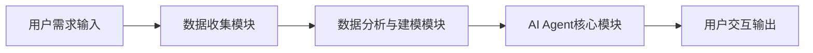

# 个性化定制：打造独特风格的AI Agent

> 关键词：个性化定制、AI Agent、独特风格、定制化开发、人工智能

> 摘要：本文围绕个性化定制打造独特风格的AI Agent展开深入探讨。首先介绍了相关背景信息，包括目的、预期读者、文档结构和术语表等。接着阐述了核心概念与联系，通过文本示意图和Mermaid流程图清晰呈现原理和架构。详细讲解了核心算法原理和具体操作步骤，结合Python源代码进行说明。对数学模型和公式进行推导与举例。通过项目实战给出代码实际案例并详细解释。分析了AI Agent在不同场景的实际应用，推荐了学习资源、开发工具框架以及相关论文著作。最后总结了未来发展趋势与挑战，还提供了常见问题解答和扩展阅读参考资料，旨在帮助读者全面了解如何定制具有独特风格的AI Agent。

## 1. 背景介绍 
### 1.1 目的和范围
在当今数字化时代，人工智能技术飞速发展，AI Agent作为人工智能的重要应用形式，正逐渐融入到人们生活和工作的各个方面。然而，通用的AI Agent往往无法满足用户多样化的需求。本文章的目的在于探讨如何对AI Agent进行个性化定制，使其具备独特的风格，以更好地适应不同用户、不同场景的特定需求。

本文的范围涵盖了AI Agent个性化定制的核心概念、算法原理、数学模型、项目实战、应用场景等多个方面，旨在为读者提供一个全面且深入的关于打造独特风格AI Agent的知识体系。

### 1.2 预期读者
本文的预期读者主要包括对人工智能技术感兴趣的开发者、研究人员，希望利用AI Agent提升业务效率和用户体验的企业从业者，以及对个性化定制AI Agent有学习需求的学生群体。无论是初学者希望了解基本概念，还是有一定经验的专业人士寻求深入技术突破，都能从本文中获得有价值的信息。

### 1.3 文档结构概述
本文将按照以下结构进行阐述：首先介绍核心概念与联系，帮助读者建立对AI Agent个性化定制的基本认知；接着详细讲解核心算法原理和具体操作步骤，结合Python代码进行说明；然后给出数学模型和公式，并通过举例加深理解；通过项目实战展示代码实际案例和详细解释；分析AI Agent的实际应用场景；推荐相关的学习资源、开发工具框架和论文著作；最后总结未来发展趋势与挑战，提供常见问题解答和扩展阅读参考资料。

### 1.4 术语表
#### 1.4.1 核心术语定义
- **AI Agent（人工智能代理）**：是一种能够感知环境、自主决策并采取行动以实现特定目标的人工智能实体。它可以是软件程序、机器人等不同形式。
- **个性化定制**：根据用户的特定需求、偏好、使用习惯等因素，对AI Agent进行针对性的设计和开发，使其具有独特的功能、交互方式和风格。
- **独特风格**：指AI Agent在语言表达、行为模式、界面设计等方面表现出的与众不同的特征，能够让用户产生独特的使用体验。

#### 1.4.2 相关概念解释
- **机器学习**：是AI Agent实现智能化的重要手段，通过让计算机从数据中学习模式和规律，从而实现对未知数据的预测和决策。常见的机器学习算法包括决策树、神经网络等。
- **自然语言处理**：主要研究如何让计算机理解和处理人类语言。在AI Agent中，自然语言处理技术用于实现与用户的自然语言交互，如语音识别、文本生成等。

#### 1.4.3 缩略词列表
- **ML（Machine Learning）**：机器学习
- **NLP（Natural Language Processing）**：自然语言处理
- **DNN（Deep Neural Network）**：深度神经网络

## 2. 核心概念与联系 

### 核心概念原理
AI Agent的个性化定制核心在于将用户的个性化需求转化为具体的技术实现。其基本原理是通过收集用户的相关数据，如历史交互记录、偏好设置等，利用机器学习和自然语言处理等技术对这些数据进行分析和建模，从而调整AI Agent的行为和输出，使其符合用户的个性化要求。

例如，在一个智能客服AI Agent中，通过分析用户以往的咨询问题和解决方案，了解用户的行业特点和常见问题类型，进而在后续的交互中提供更精准、个性化的服务。

### 架构的文本示意图
```plaintext
用户需求输入
|
V
数据收集模块（收集用户历史交互、偏好等数据）
|
V
数据分析与建模模块（利用ML、NLP技术分析数据，建立个性化模型）
|
V
AI Agent核心模块（根据个性化模型调整行为和输出）
|
V
用户交互输出（与用户进行个性化交互）
```

### Mermaid流程图


## 3. 核心算法原理 & 具体操作步骤 

### 核心算法原理
在AI Agent个性化定制中，常用的算法包括基于规则的算法和基于机器学习的算法。基于规则的算法通过预定义的规则来实现个性化定制，适用于规则明确、变化较少的场景。基于机器学习的算法则通过对大量数据的学习来自动发现模式和规律，具有更强的适应性和灵活性。

以基于深度学习的自然语言处理算法为例，我们可以使用循环神经网络（RNN）或长短期记忆网络（LSTM）来实现文本生成的个性化定制。这些网络能够处理序列数据，学习文本的上下文信息，从而生成符合用户风格的文本。

### 具体操作步骤及Python源代码

#### 步骤1：数据收集
首先，我们需要收集用户的相关数据，例如用户的聊天记录、搜索历史等。以下是一个简单的Python代码示例，用于模拟数据收集：

```python
# 模拟用户聊天记录
user_chat_records = [
    "我喜欢科技类的新闻",
    "给我推荐一些科幻电影",
    "最近有什么新的科技产品发布吗"
]

# 模拟用户偏好设置
user_preferences = {
    "topic": "科技",
    "media_type": "电影"
}
```

#### 步骤2：数据预处理
对收集到的数据进行预处理，包括分词、去除停用词等操作。以下是使用Python的`jieba`库进行中文分词的示例：

```python
import jieba

def preprocess_text(text):
    # 分词
    words = jieba.lcut(text)
    # 去除停用词（这里简单假设停用词列表为空）
    stopwords = []
    filtered_words = [word for word in words if word not in stopwords]
    return filtered_words

# 对聊天记录进行预处理
preprocessed_chat_records = [preprocess_text(record) for record in user_chat_records]
print(preprocessed_chat_records)
```

#### 步骤3：模型训练
使用预处理后的数据训练机器学习模型。这里以简单的词袋模型和朴素贝叶斯分类器为例：

```python
from sklearn.feature_extraction.text import CountVectorizer
from sklearn.naive_bayes import MultinomialNB

# 将分词后的文本转换为词袋向量
vectorizer = CountVectorizer()
X = vectorizer.fit_transform([" ".join(record) for record in preprocessed_chat_records])

# 模拟标签（这里简单假设所有记录都属于“科技”类别）
y = ["科技"] * len(preprocessed_chat_records)

# 训练朴素贝叶斯分类器
clf = MultinomialNB()
clf.fit(X, y)
```

#### 步骤4：个性化生成
根据训练好的模型和用户偏好，生成个性化的内容。以下是一个简单的文本生成示例：

```python
# 生成个性化推荐文本
new_text = "最近有什么好的科技电影推荐吗"
preprocessed_new_text = preprocess_text(new_text)
new_text_vector = vectorizer.transform([" ".join(preprocessed_new_text)])
predicted_category = clf.predict(new_text_vector)[0]

if predicted_category == "科技":
    response = "为您推荐几部科技类电影：《星际穿越》《人工智能》《银翼杀手2049》。"
else:
    response = "暂时没有符合您需求的推荐。"

print(response)
```

## 4. 数学模型和公式 & 详细讲解 & 举例说明 

### 词袋模型
词袋模型（Bag of Words，BoW）是一种简单而常用的文本表示方法。它将文本看作是一个无序的词集合，忽略词的顺序和语法结构。

设文本集合为 $D = \{d_1, d_2, \cdots, d_n\}$，词汇表为 $V = \{w_1, w_2, \cdots, w_m\}$，则文本 $d_i$ 可以表示为一个 $m$ 维向量 $\mathbf{x}_i = [x_{i1}, x_{i2}, \cdots, x_{im}]$，其中 $x_{ij}$ 表示词 $w_j$ 在文本 $d_i$ 中出现的次数。

例如，有两个文本：
$d_1$: "I love Python programming"
$d_2$: "Python is a great programming language"

词汇表 $V = \{"I", "love", "Python", "programming", "is", "a", "great", "language"\}$

则 $d_1$ 的词袋向量为 $\mathbf{x}_1 = [1, 1, 1, 1, 0, 0, 0, 0]$
$d_2$ 的词袋向量为 $\mathbf{x}_2 = [0, 0, 1, 1, 1, 1, 1, 1]$

### 朴素贝叶斯分类器
朴素贝叶斯分类器是一种基于贝叶斯定理和特征条件独立假设的分类算法。对于给定的输入特征向量 $\mathbf{x} = [x_1, x_2, \cdots, x_n]$ 和类别集合 $C = \{c_1, c_2, \cdots, c_k\}$，朴素贝叶斯分类器的目标是找到后验概率最大的类别 $c^*$：

$$c^* = \arg\max_{c \in C} P(c|\mathbf{x})$$

根据贝叶斯定理，有：

$$P(c|\mathbf{x}) = \frac{P(\mathbf{x}|c)P(c)}{P(\mathbf{x})}$$

由于 $P(\mathbf{x})$ 对于所有类别都是相同的，因此可以忽略，得到：

$$c^* = \arg\max_{c \in C} P(\mathbf{x}|c)P(c)$$

在朴素贝叶斯分类器中，假设特征之间是条件独立的，即：

$$P(\mathbf{x}|c) = \prod_{i = 1}^{n} P(x_i|c)$$

因此，最终的分类公式为：

$$c^* = \arg\max_{c \in C} P(c) \prod_{i = 1}^{n} P(x_i|c)$$

例如，在上述的文本分类示例中，我们可以通过计算不同类别下每个词的出现概率 $P(x_i|c)$ 和类别的先验概率 $P(c)$，来对新的文本进行分类。

## 5. 项目实战：代码实际案例和详细解释说明 

### 5.1  开发环境搭建
为了实现一个个性化定制的AI Agent，我们需要搭建相应的开发环境。以下是具体步骤：

#### 安装Python
首先，确保你已经安装了Python。建议使用Python 3.7及以上版本，可以从Python官方网站（https://www.python.org/downloads/）下载并安装。

#### 安装必要的库
使用`pip`命令安装所需的库，包括`jieba`、`sklearn`等：

```sh
pip install jieba scikit-learn
```

### 5.2  源代码详细实现和代码解读
以下是一个完整的个性化定制AI Agent的Python代码示例：

```python
import jieba
from sklearn.feature_extraction.text import CountVectorizer
from sklearn.naive_bayes import MultinomialNB

# 模拟用户聊天记录
user_chat_records = [
    "我喜欢科技类的新闻",
    "给我推荐一些科幻电影",
    "最近有什么新的科技产品发布吗"
]

# 模拟用户偏好设置
user_preferences = {
    "topic": "科技",
    "media_type": "电影"
}

def preprocess_text(text):
    # 分词
    words = jieba.lcut(text)
    # 去除停用词（这里简单假设停用词列表为空）
    stopwords = []
    filtered_words = [word for word in words if word not in stopwords]
    return filtered_words

# 对聊天记录进行预处理
preprocessed_chat_records = [preprocess_text(record) for record in user_chat_records]

# 将分词后的文本转换为词袋向量
vectorizer = CountVectorizer()
X = vectorizer.fit_transform([" ".join(record) for record in preprocessed_chat_records])

# 模拟标签（这里简单假设所有记录都属于“科技”类别）
y = ["科技"] * len(preprocessed_chat_records)

# 训练朴素贝叶斯分类器
clf = MultinomialNB()
clf.fit(X, y)

def generate_response(user_input):
    # 预处理用户输入
    preprocessed_input = preprocess_text(user_input)
    input_vector = vectorizer.transform([" ".join(preprocessed_input)])
    # 预测类别
    predicted_category = clf.predict(input_vector)[0]
    if predicted_category == user_preferences["topic"] and user_preferences["media_type"] == "电影":
        response = "为您推荐几部科技类电影：《星际穿越》《人工智能》《银翼杀手2049》。"
    else:
        response = "暂时没有符合您需求的推荐。"
    return response

# 测试
user_input = "最近有什么好的科技电影推荐吗"
response = generate_response(user_input)
print(response)
```

### 5.3  代码解读与分析
- **数据收集**：通过`user_chat_records`和`user_preferences`模拟用户的聊天记录和偏好设置。
- **数据预处理**：`preprocess_text`函数使用`jieba`库对文本进行分词，并去除停用词。
- **特征提取**：使用`CountVectorizer`将分词后的文本转换为词袋向量。
- **模型训练**：使用`MultinomialNB`训练朴素贝叶斯分类器。
- **个性化生成**：`generate_response`函数根据用户输入，预测类别并生成个性化的响应。

## 6. 实际应用场景 
### 智能客服
在电商、金融等行业，智能客服AI Agent可以根据用户的历史咨询记录和偏好，提供个性化的服务。例如，对于经常购买电子产品的用户，智能客服可以优先推荐最新的电子产品信息；对于关注理财产品的用户，提供定制化的理财方案。

### 智能教育
在在线教育领域，AI Agent可以根据学生的学习习惯、知识掌握情况等进行个性化的学习辅导。例如，为学习进度较慢的学生提供更多的基础练习，为学习能力较强的学生推荐拓展性的学习资源。

### 智能家居
在智能家居系统中，AI Agent可以根据用户的生活习惯进行个性化的家居控制。例如，在用户习惯起床的时间自动调节窗帘和灯光亮度，根据用户的饮食偏好推荐适合的食谱并控制厨房电器。

## 7. 工具和资源推荐
### 7.1 学习资源推荐
#### 7.1.1 书籍推荐
- 《人工智能：一种现代的方法》：全面介绍了人工智能的基本概念、算法和应用，是学习人工智能的经典教材。
- 《Python机器学习》：详细讲解了使用Python进行机器学习的方法和技巧，适合初学者入门。
- 《自然语言处理入门》：系统介绍了自然语言处理的基本原理和常用技术，对于理解AI Agent的自然语言交互有很大帮助。

#### 7.1.2 在线课程
- Coursera上的“机器学习”课程：由斯坦福大学教授Andrew Ng授课，内容丰富，讲解清晰，是学习机器学习的优质课程。
- edX上的“自然语言处理基础”课程：深入介绍了自然语言处理的基础知识和算法，适合有一定编程基础的学习者。

#### 7.1.3 技术博客和网站
- Medium：上面有很多关于人工智能和机器学习的技术文章，涵盖了最新的研究成果和实践经验。
- 机器之心：专注于人工智能领域的资讯和技术分享，提供了大量的优质文章和案例分析。

### 7.2 开发工具框架推荐
#### 7.2.1 IDE和编辑器
- PyCharm：是一款专门为Python开发设计的集成开发环境，具有强大的代码编辑、调试和自动补全功能。
- Jupyter Notebook：适合进行数据分析和模型实验，支持交互式编程和可视化展示。

#### 7.2.2 调试和性能分析工具
- TensorBoard：是TensorFlow提供的可视化工具，可以用于监控模型训练过程、查看模型结构和分析性能指标。
- Py-Spy：用于分析Python程序的性能瓶颈，找出耗时较长的代码段。

#### 7.2.3 相关框架和库
- TensorFlow：是一个开源的机器学习框架，提供了丰富的工具和算法，支持大规模的深度学习模型训练。
- PyTorch：也是一个流行的深度学习框架，具有动态图机制，易于使用和调试。
- NLTK：是Python中常用的自然语言处理库，提供了丰富的语料库和工具，方便进行文本处理和分析。

### 7.3 相关论文著作推荐
#### 7.3.1 经典论文
- “A Logical Calculus of the Ideas Immanent in Nervous Activity”：由Warren S. McCulloch和Walter Pitts发表，提出了人工神经网络的概念，是人工智能领域的奠基性论文。
- “Speech Recognition with Deep Recurrent Neural Networks”：介绍了使用深度循环神经网络进行语音识别的方法，推动了语音识别技术的发展。

#### 7.3.2 最新研究成果
- 关注顶级学术会议如NeurIPS、ICML、ACL等的最新论文，了解人工智能领域的前沿研究动态。

#### 7.3.3 应用案例分析
- 可以查阅一些知名企业的技术博客和研究报告，如Google、Microsoft等，了解他们在AI Agent个性化定制方面的应用案例和实践经验。

## 8. 总结：未来发展趋势与挑战
### 未来发展趋势
- **更加智能化**：随着人工智能技术的不断发展，AI Agent将具备更强的学习能力和推理能力，能够更好地理解用户的意图和需求，提供更加智能化的服务。
- **多模态交互**：未来的AI Agent将不仅仅局限于文本和语音交互，还将支持图像、视频等多模态交互方式，为用户带来更加丰富和自然的交互体验。
- **个性化程度更高**：通过收集更多的用户数据和使用更先进的算法，AI Agent将能够实现更高程度的个性化定制，满足用户日益多样化的需求。

### 挑战
- **数据隐私和安全**：个性化定制需要收集大量的用户数据，如何保障这些数据的隐私和安全是一个重要的挑战。
- **算法复杂度和计算资源**：为了实现更高级的个性化定制，需要使用更复杂的算法，这将增加计算资源的需求和算法的复杂度。
- **伦理和法律问题**：AI Agent的个性化定制可能会引发一些伦理和法律问题，如算法歧视、虚假信息传播等，需要建立相应的规范和法律来进行约束。

## 9. 附录：常见问题与解答
### 问题1：个性化定制的AI Agent是否需要大量的训练数据？
解答：一般来说，个性化定制的AI Agent需要一定量的训练数据来学习用户的偏好和模式。数据量的大小取决于具体的应用场景和算法复杂度。对于一些简单的应用，少量的数据可能就足够了；而对于复杂的应用，可能需要大量的数据来训练出准确的模型。

### 问题2：如何确保AI Agent的个性化定制不会侵犯用户的隐私？
解答：可以采取以下措施来确保用户隐私：首先，在收集用户数据时，要获得用户的明确授权；其次，对收集到的数据进行加密处理，防止数据泄露；最后，遵循相关的法律法规和隐私政策，合理使用用户数据。

### 问题3：个性化定制的AI Agent是否可以实时更新用户偏好？
解答：可以。通过实时收集用户的交互数据，并使用在线学习算法对模型进行更新，AI Agent可以实时调整用户偏好，提供更加及时和准确的个性化服务。

## 10. 扩展阅读 & 参考资料
### 扩展阅读
- 《深度学习》：由Ian Goodfellow、Yoshua Bengio和Aaron Courville所著，深入介绍了深度学习的理论和实践。
- 《人工智能时代的人类未来》：探讨了人工智能技术对人类社会的影响和未来发展趋势。

### 参考资料
- 相关学术论文和研究报告可以从IEEE Xplore、ACM Digital Library等学术数据库中获取。
- 技术文档和开源代码可以从GitHub等代码托管平台上查找。

作者：AI天才研究院/AI Genius Institute & 禅与计算机程序设计艺术 /Zen And The Art of Computer Programming