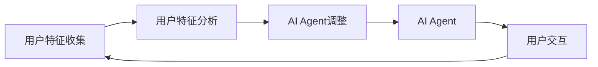

# 个性化定制：根据用户特征调整AI Agent

> 关键词：个性化定制、用户特征、AI Agent、机器学习、用户体验

> 摘要：本文聚焦于个性化定制中根据用户特征调整AI Agent这一核心主题。首先介绍了相关背景，包括目的范围、预期读者等内容。接着阐述了核心概念及联系，给出了原理和架构的示意图与流程图。详细讲解了核心算法原理，并用Python代码展示具体操作步骤。从数学模型和公式层面进行深入剖析并举例说明。通过项目实战，给出代码案例并详细解读。探讨了实际应用场景，推荐了相关的学习资源、开发工具框架以及论文著作。最后总结未来发展趋势与挑战，还设置了常见问题解答和扩展阅读参考资料，旨在为读者全面呈现如何依据用户特征对AI Agent进行个性化定制。

## 1. 背景介绍 
### 1.1 目的和范围
在当今数字化时代，用户对于服务和产品的个性化需求日益增长。AI Agent作为一种能够模拟人类智能行为的程序，在各个领域得到了广泛应用。本文章的目的在于深入探讨如何根据用户的特征来调整AI Agent，以实现更加个性化的服务和交互。范围涵盖了从核心概念的理解，到算法原理的剖析，再到实际项目的应用和未来发展趋势的展望。通过对这些方面的研究，旨在为开发者、研究者和相关从业者提供全面而深入的指导，帮助他们更好地实现AI Agent的个性化定制。

### 1.2 预期读者
本文的预期读者包括但不限于以下几类人群：
- **AI开发者**：希望通过个性化定制提升AI Agent性能和用户体验的专业开发者。
- **机器学习研究者**：对用户特征与AI Agent交互机制感兴趣的研究人员。
- **产品经理**：负责设计和规划具有个性化功能产品的管理人员。
- **相关领域的学生**：学习人工智能、计算机科学等专业，希望了解个性化定制技术的学生。

### 1.3 文档结构概述
本文将按照以下结构进行组织：
- 核心概念与联系：介绍与个性化定制、用户特征和AI Agent相关的核心概念，并展示它们之间的联系。
- 核心算法原理 & 具体操作步骤：详细讲解用于根据用户特征调整AI Agent的核心算法，并给出Python代码示例。
- 数学模型和公式 & 详细讲解 & 举例说明：运用数学模型和公式对算法进行深入分析，并通过实际例子进行说明。
- 项目实战：代码实际案例和详细解释说明：通过一个具体的项目案例，展示如何在实际开发中应用所学知识。
- 实际应用场景：探讨个性化定制AI Agent在不同领域的实际应用。
- 工具和资源推荐：推荐相关的学习资源、开发工具框架和论文著作。
- 总结：未来发展趋势与挑战：总结本文的主要内容，并对未来的发展趋势和挑战进行展望。
- 附录：常见问题与解答：解答读者在阅读过程中可能遇到的常见问题。
- 扩展阅读 & 参考资料：提供进一步阅读的相关资料和参考文献。

### 1.4 术语表
#### 1.4.1 核心术语定义
- **个性化定制**：根据用户的特定特征和需求，对产品或服务进行针对性的调整和优化，以提供更加符合用户期望的体验。
- **用户特征**：反映用户个体差异的各种属性和行为信息，如年龄、性别、兴趣爱好、消费习惯等。
- **AI Agent**：一种能够感知环境、自主决策并执行相应操作的智能程序，通常基于人工智能技术实现。

#### 1.4.2 相关概念解释
- **机器学习**：一门多领域交叉学科，涉及概率论、统计学、逼近论、凸分析、算法复杂度理论等多门学科。它专门研究计算机怎样模拟或实现人类的学习行为，以获取新的知识或技能，重新组织已有的知识结构使之不断改善自身的性能。
- **深度学习**：机器学习的一个分支领域，它是一种基于对数据进行表征学习的方法。深度学习通过构建具有很多层的神经网络模型，自动从大量数据中学习到复杂的模式和特征。

#### 1.4.3 缩略词列表
- **AI**：Artificial Intelligence，人工智能
- **ML**：Machine Learning，机器学习
- **DL**：Deep Learning，深度学习

## 2. 核心概念与联系 
### 核心概念原理
个性化定制的核心在于理解用户的特征，并根据这些特征对AI Agent进行调整。用户特征可以分为静态特征和动态特征。静态特征如年龄、性别等相对稳定，而动态特征如用户的实时行为、兴趣变化等则会随着时间不断变化。

AI Agent可以看作是一个智能的决策系统，它通过感知用户的输入和环境信息，运用内置的算法和模型进行决策，并输出相应的响应。在个性化定制中，我们需要根据用户特征来调整AI Agent的决策机制，使其能够更好地满足用户的需求。

### 架构的文本示意图
```plaintext
用户特征收集模块 --> 用户特征分析模块 --> AI Agent调整模块 --> AI Agent --> 用户交互
|                                                        ^
|                                                        |
+--------------------------------------------------------+
```
这个示意图展示了个性化定制AI Agent的整体架构。用户特征收集模块负责收集用户的各种特征信息，用户特征分析模块对这些信息进行处理和分析，提取有用的特征。AI Agent调整模块根据分析结果对AI Agent的参数和策略进行调整。调整后的AI Agent与用户进行交互，同时将交互过程中的信息反馈给用户特征收集模块，形成一个闭环系统。

### Mermaid流程图

这个流程图清晰地展示了从用户特征收集到AI Agent调整，再到与用户交互并反馈的整个过程。

## 3. 核心算法原理 & 具体操作步骤 
### 核心算法原理
我们可以使用基于机器学习的方法来实现根据用户特征调整AI Agent。其中，一种常用的方法是基于聚类分析和推荐算法。

聚类分析可以将具有相似特征的用户划分为不同的群体，每个群体具有相似的需求和行为模式。推荐算法则可以根据用户所在的群体以及用户的具体特征，为用户提供个性化的推荐和服务。

### 具体操作步骤及Python代码实现
以下是一个简单的示例，展示了如何使用Python实现基于K-Means聚类算法的用户特征分析和AI Agent调整。

```python
import numpy as np
from sklearn.cluster import KMeans

# 模拟用户特征数据
user_features = np.array([
    [25, 5000, 3],  # [年龄, 年收入, 消费次数]
    [30, 8000, 5],
    [22, 3000, 2],
    [40, 12000, 8],
    [35, 10000, 6]
])

# 使用K-Means聚类算法进行用户群体划分
n_clusters = 2
kmeans = KMeans(n_clusters=n_clusters, random_state=42)
kmeans.fit(user_features)

# 获取每个用户所属的聚类标签
labels = kmeans.labels_

# 模拟AI Agent的调整策略
def adjust_ai_agent(user_index):
    cluster_label = labels[user_index]
    if cluster_label == 0:
        # 针对第0类用户的调整策略
        print(f"用户 {user_index} 属于第 {cluster_label} 类，采用策略A")
    else:
        # 针对第1类用户的调整策略
        print(f"用户 {user_index} 属于第 {cluster_label} 类，采用策略B")

# 对每个用户进行AI Agent调整
for i in range(len(user_features)):
    adjust_ai_agent(i)
```
### 代码解释
1. **数据准备**：首先，我们使用`numpy`数组模拟了用户的特征数据，包括年龄、年收入和消费次数。
2. **聚类分析**：使用`sklearn`库中的`KMeans`算法对用户特征数据进行聚类分析，将用户划分为不同的群体。
3. **获取聚类标签**：通过`kmeans.labels_`获取每个用户所属的聚类标签。
4. **AI Agent调整**：定义了一个`adjust_ai_agent`函数，根据用户所属的聚类标签，采用不同的调整策略。
5. **遍历所有用户**：对每个用户调用`adjust_ai_agent`函数，实现AI Agent的调整。

## 4. 数学模型和公式 & 详细讲解 & 举例说明 
### 聚类分析的数学模型
K-Means聚类算法的目标是将$n$个样本点划分为$k$个簇，使得每个样本点到其所属簇的质心的距离之和最小。

设样本点集合为$X = \{x_1, x_2, \cdots, x_n\}$，其中$x_i \in \mathbb{R}^d$，$d$为特征维度。簇的质心集合为$C = \{c_1, c_2, \cdots, c_k\}$，其中$c_j \in \mathbb{R}^d$。

K-Means算法的目标函数可以表示为：
$$
J = \sum_{i=1}^{n} \sum_{j=1}^{k} r_{ij} \| x_i - c_j \|^2
$$
其中，$r_{ij}$是一个指示变量，如果样本点$x_i$属于簇$j$，则$r_{ij} = 1$，否则$r_{ij} = 0$。

### 详细讲解
K-Means算法的具体步骤如下：
1. **初始化质心**：随机选择$k$个样本点作为初始质心。
2. **分配样本点**：对于每个样本点$x_i$，计算它到每个质心$c_j$的距离，将其分配到距离最近的质心所在的簇。
3. **更新质心**：对于每个簇，计算该簇内所有样本点的平均值，将其作为新的质心。
4. **重复步骤2和3**：直到质心不再发生变化或达到最大迭代次数。

### 举例说明
假设我们有以下5个二维样本点：
$$
X = \begin{bmatrix}
1 & 2 \\
2 & 3 \\
8 & 7 \\
9 & 8 \\
10 & 9
\end{bmatrix}
$$
我们希望将这些样本点划分为2个簇。

1. **初始化质心**：随机选择两个样本点作为初始质心，例如$c_1 = [1, 2]$和$c_2 = [8, 7]$。
2. **分配样本点**：计算每个样本点到两个质心的距离，将其分配到距离最近的质心所在的簇。
3. **更新质心**：计算每个簇内所有样本点的平均值，得到新的质心。
4. **重复步骤2和3**：直到质心不再发生变化。

通过不断迭代，最终可以得到两个簇，每个簇内的样本点具有相似的特征。

## 5. 项目实战：代码实际案例和详细解释说明 
### 5.1  开发环境搭建
为了实现一个完整的个性化定制AI Agent项目，我们需要搭建相应的开发环境。以下是所需的主要工具和库：
- **Python**：作为主要的编程语言，建议使用Python 3.7及以上版本。
- **Jupyter Notebook**：用于交互式开发和代码调试。
- **NumPy**：用于数值计算和数组操作。
- **Pandas**：用于数据处理和分析。
- **Scikit-learn**：提供了丰富的机器学习算法和工具。
- **TensorFlow或PyTorch**：用于深度学习模型的开发。

可以使用以下命令来安装这些库：
```sh
pip install numpy pandas scikit-learn tensorflow
```

### 5.2  源代码详细实现和代码解读
以下是一个完整的项目示例，实现了根据用户的电影评分数据进行个性化电影推荐的功能。

```python
import pandas as pd
from sklearn.metrics.pairwise import cosine_similarity
from sklearn.preprocessing import StandardScaler

# 加载电影评分数据
ratings_data = pd.read_csv('ratings.csv')
movies_data = pd.read_csv('movies.csv')

# 合并评分数据和电影数据
merged_data = pd.merge(ratings_data, movies_data, on='movieId')

# 创建用户-电影评分矩阵
user_movie_matrix = merged_data.pivot_table(index='userId', columns='movieId', values='rating').fillna(0)

# 数据标准化
scaler = StandardScaler()
scaled_matrix = scaler.fit_transform(user_movie_matrix)

# 计算用户之间的相似度
user_similarity = cosine_similarity(scaled_matrix)

# 定义推荐函数
def recommend_movies(user_id, top_n=5):
    user_index = user_id - 1  # 用户ID从1开始，索引从0开始
    similar_users = user_similarity[user_index].argsort()[::-1][1:top_n + 1]
    similar_user_ratings = user_movie_matrix.iloc[similar_users]
    target_user_ratings = user_movie_matrix.iloc[user_index]
    unrated_movies = target_user_ratings[target_user_ratings == 0].index
    movie_scores = {}
    for movie_id in unrated_movies:
        score = 0
        for similar_user in similar_users:
            similar_user_rating = similar_user_ratings.loc[similar_user + 1, movie_id]
            if similar_user_rating > 0:
                score += user_similarity[user_index][similar_user] * similar_user_rating
        movie_scores[movie_id] = score
    sorted_movies = sorted(movie_scores.items(), key=lambda x: x[1], reverse=True)[:top_n]
    recommended_movie_ids = [movie[0] for movie in sorted_movies]
    recommended_movies = movies_data[movies_data['movieId'].isin(recommended_movie_ids)][['movieId', 'title']]
    return recommended_movies

# 测试推荐函数
user_id = 1
recommended_movies = recommend_movies(user_id)
print(f"为用户 {user_id} 推荐的电影：")
print(recommended_movies)
```

### 5.3  代码解读与分析
1. **数据加载和预处理**：使用`pandas`库加载电影评分数据和电影信息数据，并将它们合并。然后创建用户-电影评分矩阵，并对矩阵进行标准化处理。
2. **相似度计算**：使用`cosine_similarity`函数计算用户之间的相似度。
3. **推荐函数实现**：定义了一个`recommend_movies`函数，根据用户之间的相似度，为指定用户推荐未评分的电影。
4. **测试推荐函数**：选择一个用户ID，调用`recommend_movies`函数进行电影推荐，并输出推荐结果。

## 6. 实际应用场景 
### 电子商务
在电子商务领域，个性化定制AI Agent可以根据用户的浏览历史、购买记录、收藏偏好等特征，为用户提供个性化的商品推荐。例如，当用户访问电商网站时，AI Agent可以根据用户的特征展示用户可能感兴趣的商品，提高用户的购买转化率。

### 智能客服
智能客服系统可以根据用户的问题类型、语言风格、历史交互记录等特征，调整AI Agent的回复策略。例如，对于新用户，AI Agent可以提供更加详细的引导和帮助；对于老用户，AI Agent可以根据用户的历史问题提供更加个性化的解决方案。

### 教育领域
在教育领域，个性化定制AI Agent可以根据学生的学习进度、知识掌握情况、学习风格等特征，为学生提供个性化的学习计划和辅导。例如，AI Agent可以根据学生的薄弱知识点，为学生推荐相关的学习资料和练习题。

### 医疗保健
在医疗保健领域，个性化定制AI Agent可以根据患者的病历信息、症状表现、基因数据等特征，为患者提供个性化的医疗建议和治疗方案。例如，AI Agent可以根据患者的基因数据预测患者患某种疾病的风险，并提供相应的预防措施。

## 7. 工具和资源推荐
### 7.1 学习资源推荐
#### 7.1.1 书籍推荐
- 《机器学习》（周志华）：一本全面介绍机器学习算法和理论的经典教材。
- 《深度学习》（Ian Goodfellow、Yoshua Bengio、Aaron Courville）：深度学习领域的权威著作。
- 《Python机器学习实战》（Sebastian Raschka）：通过实际案例介绍如何使用Python实现机器学习算法。

#### 7.1.2 在线课程
- Coursera上的“机器学习”课程（Andrew Ng）：经典的机器学习入门课程。
- edX上的“深度学习”课程（MIT）：深入介绍深度学习的原理和应用。
- 阿里云大学的“人工智能基础”课程：适合初学者了解人工智能的基本概念和技术。

#### 7.1.3 技术博客和网站
- Medium：有许多关于人工智能和机器学习的优质博客文章。
- Towards Data Science：专注于数据科学和机器学习的技术博客。
- Kaggle：一个数据科学竞赛平台，提供了丰富的数据集和优秀的解决方案。

### 7.2 开发工具框架推荐
#### 7.2.1 IDE和编辑器
- PyCharm：功能强大的Python集成开发环境。
- Jupyter Notebook：交互式开发环境，适合数据分析和模型实验。
- Visual Studio Code：轻量级的代码编辑器，支持多种编程语言和插件。

#### 7.2.2 调试和性能分析工具
- TensorBoard：用于可视化深度学习模型的训练过程和性能指标。
- Py-Spy：用于分析Python代码的性能瓶颈。
- cProfile：Python内置的性能分析工具。

#### 7.2.3 相关框架和库
- Scikit-learn：提供了丰富的机器学习算法和工具，适合初学者和快速原型开发。
- TensorFlow：谷歌开发的深度学习框架，具有强大的分布式训练和部署能力。
- PyTorch：Facebook开发的深度学习框架，以其动态图机制和易用性受到广泛关注。

### 7.3 相关论文著作推荐
#### 7.3.1 经典论文
- “A Tutorial on Support Vector Machines for Pattern Recognition”：支持向量机的经典教程。
- “Deep Residual Learning for Image Recognition”：介绍了残差网络（ResNet）的论文。
- “Attention Is All You Need”：提出了Transformer架构的论文。

#### 7.3.2 最新研究成果
- 在arXiv.org上可以找到许多关于个性化定制和AI Agent的最新研究论文。
- 顶级学术会议如NeurIPS、ICML、CVPR等的会议论文集也包含了许多前沿的研究成果。

#### 7.3.3 应用案例分析
- 《AI未来进行式》（李开复、王咏刚）：通过实际案例介绍了人工智能在各个领域的应用。
- 各大科技公司的官方博客和技术报告中也有许多关于个性化定制AI Agent的应用案例。

## 8. 总结：未来发展趋势与挑战
### 未来发展趋势
- **多模态融合**：未来的AI Agent将不仅仅依赖于文本信息，还会融合图像、语音、视频等多模态信息，以提供更加丰富和个性化的服务。
- **强化学习与个性化定制的结合**：强化学习可以使AI Agent在与用户的交互过程中不断学习和优化，从而更好地满足用户的个性化需求。
- **边缘计算与个性化AI Agent**：边缘计算可以将AI Agent部署在离用户更近的设备上，减少数据传输延迟，提高个性化服务的实时性。

### 挑战
- **数据隐私和安全**：个性化定制需要收集大量的用户数据，如何保障用户数据的隐私和安全是一个重要的挑战。
- **模型可解释性**：深度学习模型通常是黑盒模型，难以解释其决策过程。在个性化定制中，需要提高模型的可解释性，以便用户更好地理解和信任AI Agent的推荐。
- **计算资源和效率**：个性化定制需要处理大量的数据和复杂的模型，如何在有限的计算资源下提高效率是一个亟待解决的问题。

## 9. 附录：常见问题与解答
### 如何选择合适的聚类算法？
选择合适的聚类算法需要考虑以下因素：
- **数据类型**：不同的聚类算法适用于不同类型的数据，如数值型数据、文本数据等。
- **数据规模**：对于大规模数据集，需要选择效率较高的聚类算法。
- **聚类目标**：不同的聚类算法有不同的聚类目标，如划分式聚类、层次聚类等。

### 如何评估个性化推荐的效果？
可以使用以下指标来评估个性化推荐的效果：
- **准确率**：推荐的物品中用户实际感兴趣的物品所占的比例。
- **召回率**：用户实际感兴趣的物品中被推荐出来的物品所占的比例。
- **F1值**：准确率和召回率的调和平均值。

### 如何处理用户特征数据的缺失值？
处理用户特征数据的缺失值可以采用以下方法：
- **删除缺失值**：如果缺失值的比例较小，可以直接删除包含缺失值的样本。
- **填充缺失值**：可以使用均值、中位数、众数等统计量来填充缺失值。
- **使用模型预测缺失值**：可以使用机器学习模型来预测缺失值。

## 10. 扩展阅读 & 参考资料
### 扩展阅读
- 《人工智能简史》（尼克）：了解人工智能的发展历程和重要事件。
- 《人类简史：从动物到上帝》（尤瓦尔·赫拉利）：思考人工智能对人类社会的影响。

### 参考资料
- [Scikit-learn官方文档](https://scikit-learn.org/stable/)
- [TensorFlow官方文档](https://www.tensorflow.org/)
- [PyTorch官方文档](https://pytorch.org/)

作者：AI天才研究院/AI Genius Institute & 禅与计算机程序设计艺术 /Zen And The Art of Computer Programming