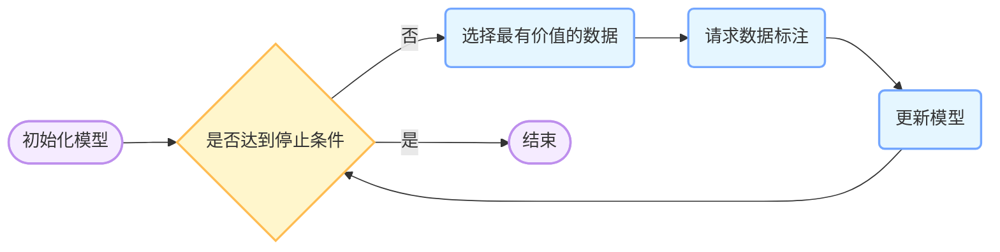

# 主动学习在工业机器人技能获取中的策略研究

> 关键词：主动学习、工业机器人、技能获取、策略研究、机器学习

> 摘要：本文聚焦于主动学习在工业机器人技能获取中的策略研究。首先介绍了研究的背景、目的、预期读者和文档结构等内容。详细阐述了主动学习和工业机器人技能获取的核心概念及它们之间的联系，并通过文本示意图和Mermaid流程图进行清晰展示。深入讲解了主动学习相关的核心算法原理，用Python源代码进行详细说明，同时给出了数学模型和公式并举例。通过项目实战，包括开发环境搭建、源代码实现与解读，展示了主动学习在工业机器人技能获取中的实际应用。探讨了该技术在不同工业场景中的应用，并推荐了相关的学习资源、开发工具框架以及论文著作。最后总结了未来发展趋势与挑战，还提供了常见问题解答和扩展阅读参考资料，旨在为工业机器人技能获取中主动学习策略的研究和应用提供全面的技术指导。

## 1. 背景介绍 
### 1.1 目的和范围
工业机器人在现代制造业中扮演着至关重要的角色，其技能获取的效率和质量直接影响着生产效率和产品质量。传统的机器人技能获取方式往往依赖于人工编程和预设规则，这种方式缺乏灵活性和适应性，难以应对复杂多变的工业环境。主动学习作为一种机器学习方法，允许机器人主动选择最有价值的数据进行学习，从而提高学习效率和技能获取的质量。

本研究的目的在于探索主动学习在工业机器人技能获取中的有效策略，通过研究主动学习算法、数据选择方法和学习机制，提高工业机器人在不同任务场景下的技能获取能力。研究范围涵盖了常见的工业机器人任务，如装配、搬运、焊接等，以及多种主动学习策略和算法。

### 1.2 预期读者
本文的预期读者包括工业机器人领域的研究人员、工程师和技术爱好者。对于研究人员，本文可以提供主动学习在工业机器人技能获取方面的最新研究成果和思路；对于工程师，本文可以提供实用的技术方案和实现方法，帮助他们在实际项目中应用主动学习技术；对于技术爱好者，本文可以帮助他们了解工业机器人和主动学习的相关知识，激发他们的学习兴趣。

### 1.3 文档结构概述
本文将按照以下结构进行组织：
- 核心概念与联系：介绍主动学习和工业机器人技能获取的核心概念，并阐述它们之间的联系。
- 核心算法原理 & 具体操作步骤：详细讲解主动学习的核心算法原理，并用Python源代码进行说明。
- 数学模型和公式 & 详细讲解 & 举例说明：给出主动学习的数学模型和公式，并进行详细讲解和举例。
- 项目实战：通过一个实际项目案例，展示主动学习在工业机器人技能获取中的应用，包括开发环境搭建、源代码实现和代码解读。
- 实际应用场景：探讨主动学习在工业机器人不同任务场景中的应用。
- 工具和资源推荐：推荐相关的学习资源、开发工具框架和论文著作。
- 总结：总结主动学习在工业机器人技能获取中的发展趋势和挑战。
- 附录：提供常见问题解答和扩展阅读参考资料。

### 1.4 术语表
#### 1.4.1 核心术语定义
- **主动学习（Active Learning）**：一种机器学习方法，在学习过程中，模型主动选择最有价值的数据进行标注和学习，以提高学习效率和性能。
- **工业机器人（Industrial Robot）**：面向工业领域的多关节机械手或多自由度的机器装置，它能自动执行工作，是靠自身动力和控制能力来实现各种功能的一种机器。
- **技能获取（Skill Acquisition）**：机器人通过学习和实践，掌握完成特定任务的能力和方法。

#### 1.4.2 相关概念解释
- **数据标注（Data Annotation）**：为数据添加标签或注释的过程，以便机器学习模型能够理解和学习数据。
- **不确定性采样（Uncertainty Sampling）**：主动学习中常用的一种数据选择策略，选择模型对其预测结果最不确定的数据进行标注和学习。
- **查询合成（Query Synthesis）**：主动学习中另一种数据选择策略，通过合成新的数据样本并请求标注，以提高模型的学习效果。

#### 1.4.3 缩略词列表
- **ML（Machine Learning）**：机器学习
- **AL（Active Learning）**：主动学习
- **IR（Industrial Robot）**：工业机器人

## 2. 核心概念与联系 

### 主动学习的核心概念
主动学习是一种特殊的机器学习方法，它与传统的监督学习不同。在传统监督学习中，模型使用预先标注好的数据集进行学习，而主动学习中，模型可以主动选择需要标注的数据。主动学习的核心思想是通过选择最有价值的数据进行标注和学习，减少标注数据的数量，同时提高模型的学习效率和性能。

主动学习的过程通常包括以下几个步骤：
1. **初始化**：使用少量的标注数据训练一个初始模型。
2. **数据选择**：模型根据一定的策略从未标注的数据集中选择最有价值的数据。
3. **数据标注**：将选择的数据提交给标注者进行标注。
4. **模型更新**：使用新标注的数据更新模型。
5. **重复步骤2 - 4**：直到模型达到满意的性能或满足其他停止条件。

### 工业机器人技能获取的核心概念
工业机器人技能获取是指机器人通过学习和实践，掌握完成特定任务的能力和方法。工业机器人的技能可以包括运动控制、目标识别、任务规划等多个方面。传统的工业机器人技能获取方法主要依赖于人工编程和预设规则，这种方法需要专业的编程知识和大量的时间成本。随着机器学习技术的发展，越来越多的研究开始关注如何使用机器学习方法来实现工业机器人的技能获取。

### 主动学习与工业机器人技能获取的联系
主动学习在工业机器人技能获取中具有重要的应用价值。在工业机器人的技能学习过程中，标注数据的获取通常是一个昂贵且耗时的过程。主动学习可以通过选择最有价值的数据进行标注，减少标注数据的数量，从而降低成本和时间开销。同时，主动学习可以提高模型的学习效率和性能，使工业机器人能够更快地掌握新的技能。

### 文本示意图
```plaintext
主动学习
|
|-- 数据选择策略
|   |-- 不确定性采样
|   |-- 查询合成
|
|-- 模型更新
|
|-- 标注数据
|
|-- 未标注数据

工业机器人技能获取
|
|-- 运动控制
|-- 目标识别
|-- 任务规划

主动学习与工业机器人技能获取的联系
|
|-- 主动学习为工业机器人技能获取提供数据选择方法
|-- 工业机器人技能获取为主动学习提供应用场景
```

### Mermaid流程图


## 3. 核心算法原理 & 具体操作步骤 

### 不确定性采样算法原理
不确定性采样是主动学习中最常用的一种数据选择策略。其基本思想是选择模型对其预测结果最不确定的数据进行标注和学习。常用的不确定性度量方法包括熵、最小置信度和margin等。

#### 熵
熵是一种常用的不确定性度量方法，对于一个分类问题，假设模型的预测概率分布为 $P(y|x)$，其中 $y$ 是类别标签，$x$ 是输入数据。熵的计算公式为：
$$H(P(y|x)) = -\sum_{y} P(y|x) \log P(y|x)$$
熵越大，表示模型对预测结果越不确定。

#### 最小置信度
最小置信度是指模型对所有类别预测概率中的最小值。假设模型对 $K$ 个类别进行预测，预测概率分别为 $P(y_1|x), P(y_2|x), \cdots, P(y_K|x)$，则最小置信度为：
$$\min_{i=1}^{K} P(y_i|x)$$
最小置信度越小，表示模型对预测结果越不确定。

#### margin
margin 是指模型对预测概率最高的两个类别之间的差值。假设模型对 $K$ 个类别进行预测，预测概率分别为 $P(y_1|x), P(y_2|x), \cdots, P(y_K|x)$，将预测概率从大到小排序为 $P_{(1)}(y|x) \geq P_{(2)}(y|x) \geq \cdots \geq P_{(K)}(y|x)$，则 margin 为：
$$P_{(1)}(y|x) - P_{(2)}(y|x)$$
margin 越小，表示模型对预测结果越不确定。

### Python 代码实现不确定性采样
```python
import numpy as np
from sklearn.linear_model import LogisticRegression
from sklearn.datasets import make_classification
from sklearn.model_selection import train_test_split

# 生成数据集
X, y = make_classification(n_samples=1000, n_features=10, n_informative=5, n_redundant=0, random_state=42)
X_train, X_test, y_train, y_test = train_test_split(X, y, test_size=0.2, random_state=42)

# 初始化模型
model = LogisticRegression()

# 选择初始标注数据
n_initial = 10
idx_initial = np.random.choice(len(X_train), n_initial, replace=False)
X_labeled = X_train[idx_initial]
y_labeled = y_train[idx_initial]
X_unlabeled = np.delete(X_train, idx_initial, axis=0)

# 训练初始模型
model.fit(X_labeled, y_labeled)

# 不确定性采样
n_queries = 10
for _ in range(n_queries):
    # 预测未标注数据的概率
    probabilities = model.predict_proba(X_unlabeled)
    
    # 计算熵
    entropy = -np.sum(probabilities * np.log(probabilities + 1e-10), axis=1)
    
    # 选择熵最大的数据
    query_idx = np.argmax(entropy)
    
    # 获取选择的数据
    x_query = X_unlabeled[query_idx]
    y_query = y_train[np.where((X_train == x_query).all(axis=1))[0][0]]
    
    # 更新标注数据
    X_labeled = np.vstack((X_labeled, x_query))
    y_labeled = np.hstack((y_labeled, y_query))
    
    # 移除选择的数据
    X_unlabeled = np.delete(X_unlabeled, query_idx, axis=0)
    
    # 更新模型
    model.fit(X_labeled, y_labeled)

# 评估模型
accuracy = model.score(X_test, y_test)
print(f"Accuracy: {accuracy}")
```

### 具体操作步骤
1. **数据准备**：准备工业机器人的数据集，包括输入数据和对应的标签。将数据集分为训练集和测试集。
2. **初始化模型**：选择合适的机器学习模型，如逻辑回归、支持向量机等，并使用少量的标注数据初始化模型。
3. **数据选择**：使用不确定性采样等策略从未标注的数据集中选择最有价值的数据。
4. **数据标注**：将选择的数据提交给标注者进行标注。
5. **模型更新**：使用新标注的数据更新模型。
6. **重复步骤3 - 5**：直到模型达到满意的性能或满足其他停止条件。
7. **模型评估**：使用测试集评估模型的性能。

## 4. 数学模型和公式 & 详细讲解 & 举例说明 

### 主动学习的数学模型
主动学习的目标是在有限的标注数据下，使模型的性能达到最优。假设我们有一个数据集 $D = \{(x_1, y_1), (x_2, y_2), \cdots, (x_N, y_N)\}$，其中 $x_i$ 是输入数据，$y_i$ 是对应的标签。我们将数据集分为标注数据集 $D_L$ 和未标注数据集 $D_U$。

主动学习的过程可以看作是一个序列决策问题，在每一步 $t$，模型需要从 $D_U$ 中选择一个数据点 $x_t$ 进行标注，然后使用新标注的数据更新模型。设 $\theta_t$ 是模型在第 $t$ 步的参数，$L(\theta_t; D_L)$ 是模型在标注数据集上的损失函数。主动学习的目标是最小化损失函数：
$$\min_{\theta_t} L(\theta_t; D_L)$$

### 不确定性采样的数学公式
#### 熵
如前面所述，熵的计算公式为：
$$H(P(y|x)) = -\sum_{y} P(y|x) \log P(y|x)$$
其中，$P(y|x)$ 是模型对输入数据 $x$ 属于类别 $y$ 的预测概率。

#### 最小置信度
最小置信度的计算公式为：
$$\min_{i=1}^{K} P(y_i|x)$$
其中，$P(y_i|x)$ 是模型对输入数据 $x$ 属于第 $i$ 个类别的预测概率，$K$ 是类别总数。

#### margin
margin 的计算公式为：
$$P_{(1)}(y|x) - P_{(2)}(y|x)$$
其中，$P_{(1)}(y|x)$ 和 $P_{(2)}(y|x)$ 分别是模型对输入数据 $x$ 预测概率最高的两个类别。

### 举例说明
假设我们有一个二分类问题，模型对输入数据 $x$ 的预测概率分布为 $P(y = 0|x) = 0.3$，$P(y = 1|x) = 0.7$。

#### 熵
根据熵的计算公式：
$$H(P(y|x)) = -(0.3 \log 0.3 + 0.7 \log 0.7) \approx 0.61$$

#### 最小置信度
最小置信度为：
$$\min(0.3, 0.7) = 0.3$$

#### margin
margin 为：
$$0.7 - 0.3 = 0.4$$

通过比较不同数据点的熵、最小置信度和 margin，我们可以选择最有价值的数据进行标注和学习。

## 5. 项目实战：代码实际案例和详细解释说明 

### 5.1  开发环境搭建
#### 硬件环境
- **计算机**：推荐使用具有较高性能的计算机，如 Intel Core i7 及以上处理器，16GB 及以上内存。
- **工业机器人**：选择适合项目需求的工业机器人，如 ABB、Fanuc 等品牌的机器人。

#### 软件环境
- **操作系统**：推荐使用 Ubuntu 18.04 及以上版本的 Linux 操作系统。
- **编程语言**：Python 3.7 及以上版本。
- **机器学习库**：安装 scikit-learn、numpy、pandas 等常用的机器学习库。
- **机器人开发框架**：根据所选的工业机器人品牌，安装相应的开发框架，如 ROS（Robot Operating System）。

### 5.2  源代码详细实现和代码解读
#### 项目背景
假设我们要实现一个工业机器人的目标识别技能，使用主动学习方法提高识别准确率。

#### 代码实现
```python
import numpy as np
from sklearn.linear_model import LogisticRegression
from sklearn.datasets import make_classification
from sklearn.model_selection import train_test_split

# 生成数据集
X, y = make_classification(n_samples=1000, n_features=10, n_informative=5, n_redundant=0, random_state=42)
X_train, X_test, y_train, y_test = train_test_split(X, y, test_size=0.2, random_state=42)

# 初始化模型
model = LogisticRegression()

# 选择初始标注数据
n_initial = 10
idx_initial = np.random.choice(len(X_train), n_initial, replace=False)
X_labeled = X_train[idx_initial]
y_labeled = y_train[idx_initial]
X_unlabeled = np.delete(X_train, idx_initial, axis=0)

# 训练初始模型
model.fit(X_labeled, y_labeled)

# 主动学习过程
n_queries = 10
for _ in range(n_queries):
    # 预测未标注数据的概率
    probabilities = model.predict_proba(X_unlabeled)
    
    # 计算熵
    entropy = -np.sum(probabilities * np.log(probabilities + 1e-10), axis=1)
    
    # 选择熵最大的数据
    query_idx = np.argmax(entropy)
    
    # 获取选择的数据
    x_query = X_unlabeled[query_idx]
    y_query = y_train[np.where((X_train == x_query).all(axis=1))[0][0]]
    
    # 更新标注数据
    X_labeled = np.vstack((X_labeled, x_query))
    y_labeled = np.hstack((y_labeled, y_query))
    
    # 移除选择的数据
    X_unlabeled = np.delete(X_unlabeled, query_idx, axis=0)
    
    # 更新模型
    model.fit(X_labeled, y_labeled)

# 评估模型
accuracy = model.score(X_test, y_test)
print(f"Accuracy: {accuracy}")
```

#### 代码解读
1. **数据生成**：使用 `make_classification` 函数生成一个分类数据集，并将其分为训练集和测试集。
2. **模型初始化**：选择逻辑回归模型作为分类器，并使用少量的标注数据初始化模型。
3. **主动学习过程**：
    - 预测未标注数据的概率。
    - 计算每个未标注数据的熵。
    - 选择熵最大的数据进行标注。
    - 更新标注数据和未标注数据。
    - 使用新标注的数据更新模型。
4. **模型评估**：使用测试集评估模型的准确率。

### 5.3  代码解读与分析
#### 优点
- **提高学习效率**：通过主动选择最有价值的数据进行标注，减少了标注数据的数量，提高了模型的学习效率。
- **提高模型性能**：选择最有挑战性的数据进行学习，有助于模型更好地泛化，提高模型的性能。

#### 缺点
- **计算复杂度高**：在计算熵等不确定性度量时，需要对每个未标注数据进行预测，计算复杂度较高。
- **标注成本**：虽然主动学习减少了标注数据的数量，但仍然需要人工进行标注，标注成本仍然存在。

## 6. 实际应用场景 
### 装配任务
在工业机器人的装配任务中，主动学习可以帮助机器人更快地学习不同零件的识别和装配方法。例如，在电子产品的装配过程中，机器人需要识别不同的电子元件并将其正确地安装到电路板上。通过主动学习，机器人可以主动选择最有价值的图像数据进行标注和学习，提高元件识别的准确率和装配的效率。

### 搬运任务
在搬运任务中，工业机器人需要识别不同的物品并将其搬运到指定的位置。主动学习可以帮助机器人学习物品的特征和位置信息，提高搬运的准确性和效率。例如，在仓库物流中，机器人可以主动选择不同形状、大小和颜色的物品图像进行学习，以适应不同的搬运任务。

### 焊接任务
在焊接任务中，工业机器人需要根据不同的焊接要求和工件形状进行焊接。主动学习可以帮助机器人学习焊接参数和路径规划，提高焊接质量和效率。例如，在汽车制造中，机器人可以主动选择不同类型的焊接任务数据进行学习，以适应不同的汽车零部件焊接需求。

## 7. 工具和资源推荐
### 7.1 学习资源推荐
#### 7.1.1 书籍推荐
- 《机器学习》（周志华）：全面介绍了机器学习的基本概念、算法和应用，是机器学习领域的经典教材。
- 《Python机器学习》（Sebastian Raschka）：使用Python语言介绍了机器学习的各种算法和实现方法，适合初学者学习。
- 《主动学习》（Burr Settles）：专门介绍了主动学习的理论和方法，是主动学习领域的权威著作。

#### 7.1.2 在线课程
- Coursera上的“机器学习”课程（Andrew Ng）：由斯坦福大学教授Andrew Ng主讲，是机器学习领域最受欢迎的在线课程之一。
- edX上的“深度学习”课程（MIT）：由麻省理工学院教授开设，介绍了深度学习的基本概念、算法和应用。
- Udemy上的“工业机器人编程与应用”课程：介绍了工业机器人的编程和应用，适合工业机器人领域的初学者。

#### 7.1.3 技术博客和网站
- Medium：一个技术博客平台，上面有很多关于机器学习、工业机器人等领域的文章和教程。
- arXiv：一个预印本服务器，提供了大量的学术论文和研究成果，适合研究人员和技术爱好者学习。
- ROS官方网站：提供了ROS机器人开发框架的文档、教程和社区资源，是工业机器人开发的重要参考网站。

### 7.2 开发工具框架推荐
#### 7.2.1 IDE和编辑器
- PyCharm：一款专门为Python开发设计的集成开发环境，具有强大的代码编辑、调试和分析功能。
- Visual Studio Code：一款轻量级的代码编辑器，支持多种编程语言和插件扩展，适合快速开发和调试。
- Jupyter Notebook：一个交互式的笔记本环境，适合进行数据分析、机器学习实验和代码演示。

#### 7.2.2 调试和性能分析工具
- TensorBoard：一个用于可视化深度学习模型训练过程和性能的工具，支持TensorFlow等深度学习框架。
- Scikit-learn的模型评估工具：提供了各种模型评估指标和工具，如准确率、召回率、F1值等，方便对机器学习模型进行评估和比较。
- ROS的调试工具：如rqt_graph、rqt_console等，用于调试和监控ROS机器人系统的运行状态。

#### 7.2.3 相关框架和库
- Scikit-learn：一个常用的机器学习库，提供了各种机器学习算法和工具，如分类、回归、聚类等。
- TensorFlow：一个开源的深度学习框架，支持各种深度学习模型的开发和训练，如卷积神经网络、循环神经网络等。
- ROS：一个机器人开发框架，提供了丰富的机器人驱动、算法和工具，方便开发工业机器人应用。

### 7.3 相关论文著作推荐
#### 7.3.1 经典论文
- “Active Learning Literature Survey”（Burr Settles）：对主动学习领域的文献进行了全面的综述，介绍了主动学习的基本概念、算法和应用。
- “Support-Vector Machine Active Learning with Applications to Text Classification”（Thorsten Joachims）：提出了基于支持向量机的主动学习算法，并应用于文本分类任务。
- “Query by Committee”（H. S. Seung, M. Opper, and H. Sompolinsky）：提出了基于委员会查询的主动学习策略，通过多个模型的投票来选择最有价值的数据。

#### 7.3.2 最新研究成果
- 关注顶级学术会议如NeurIPS、ICML、CVPR等上的主动学习和工业机器人相关的研究论文，了解最新的研究成果和技术趋势。
- 关注相关学术期刊如Journal of Artificial Intelligence Research（JAIR）、Artificial Intelligence等上的主动学习和工业机器人相关的研究论文。

#### 7.3.3 应用案例分析
- 参考工业机器人制造商的官方网站和技术文档，了解他们在实际项目中应用主动学习技术的案例和经验。
- 关注工业自动化领域的行业报告和案例分析，了解主动学习在工业机器人技能获取中的应用效果和挑战。

## 8. 总结：未来发展趋势与挑战
### 未来发展趋势
- **与深度学习的结合**：随着深度学习技术的发展，主动学习与深度学习的结合将成为未来的一个重要发展趋势。深度学习模型通常需要大量的标注数据进行训练，主动学习可以帮助选择最有价值的数据，减少标注成本，提高模型的学习效率。
- **多模态数据的应用**：工业机器人在实际应用中需要处理多种类型的数据，如图像、声音、力觉等。未来的主动学习方法将更加注重多模态数据的处理和融合，以提高机器人的技能获取能力。
- **强化学习的融合**：强化学习可以让机器人通过与环境的交互来学习最优的行为策略。将主动学习与强化学习相结合，可以使机器人在学习过程中更加主动地选择数据和探索环境，提高学习效率和性能。

### 挑战
- **数据标注的质量和效率**：主动学习仍然需要人工进行数据标注，数据标注的质量和效率直接影响模型的性能。如何提高数据标注的质量和效率，是主动学习在工业机器人技能获取中面临的一个重要挑战。
- **模型的可解释性**：深度学习模型通常是黑盒模型，缺乏可解释性。在工业机器人的应用中，模型的可解释性非常重要，因为它可以帮助工程师理解模型的决策过程，提高系统的可靠性和安全性。如何提高主动学习模型的可解释性，是未来需要解决的一个问题。
- **复杂环境的适应性**：工业机器人通常需要在复杂多变的环境中工作，如高温、高压、高噪声等。如何使主动学习方法在复杂环境中仍然能够有效地工作，是一个具有挑战性的问题。

## 9. 附录：常见问题与解答
### 主动学习一定能提高模型的性能吗？
主动学习并不一定能保证提高模型的性能。主动学习的效果取决于多个因素，如数据选择策略、模型的类型和性能、标注数据的质量等。在某些情况下，主动学习可能会因为选择了不合适的数据或模型无法有效利用选择的数据而导致性能下降。因此，在应用主动学习时，需要根据具体情况选择合适的策略和模型，并进行充分的实验和评估。

### 主动学习需要多少标注数据？
主动学习的目标是在有限的标注数据下达到较好的性能，但具体需要多少标注数据取决于多个因素，如数据集的规模和复杂度、模型的类型和性能、数据选择策略等。一般来说，主动学习可以在较少的标注数据下达到与传统监督学习相当的性能，但具体的标注数据量需要通过实验来确定。

### 如何选择合适的主动学习策略？
选择合适的主动学习策略需要考虑多个因素，如数据集的特点、模型的类型和性能、标注成本等。常见的主动学习策略包括不确定性采样、查询合成、基于委员会查询等。不同的策略适用于不同的场景，例如，不确定性采样适用于模型对预测结果不确定的数据，查询合成适用于需要探索新的数据分布的场景。在实际应用中，可以通过实验比较不同策略的性能，选择最合适的策略。

## 10. 扩展阅读 & 参考资料
### 扩展阅读
- 《机器人学导论》（John J. Craig）：全面介绍了机器人学的基本概念、运动学、动力学和控制等方面的知识，适合深入学习机器人技术。
- 《深度学习》（Ian Goodfellow、Yoshua Bengio和Aaron Courville）：深度学习领域的经典著作，详细介绍了深度学习的理论和方法。
- 《工业4.0：即将来袭的第四次工业革命》（乌尔里希·森德勒）：介绍了工业4.0的概念、技术和应用，了解工业机器人在工业4.0中的发展趋势。

### 参考资料
- Burr Settles. Active Learning Literature Survey. Technical Report 1648, University of Wisconsin–Madison, 2010.
- Thorsten Joachims. Support-Vector Machine Active Learning with Applications to Text Classification. Machine Learning, 37(2):135–163, 1999.
- H. S. Seung, M. Opper, and H. Sompolinsky. Query by Committee. In Proceedings of the Fifth Annual Workshop on Computational Learning Theory, pages 287–294, 1992.

作者：AI天才研究院/AI Genius Institute & 禅与计算机程序设计艺术 /Zen And The Art of Computer Programming